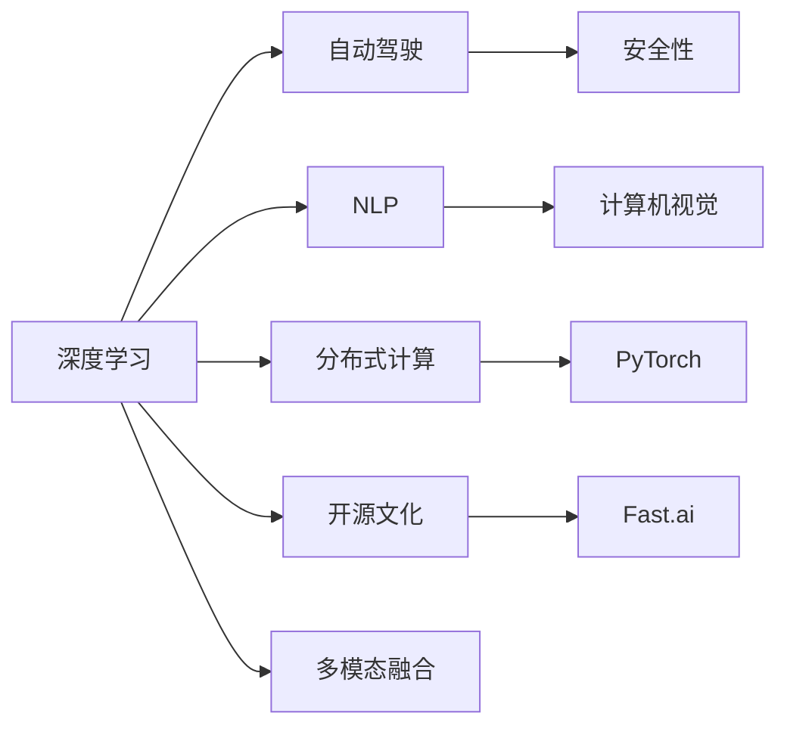

                 

# Andrej Karpathy：改变世界的决心

## 1. 背景介绍

Andrej Karpathy 是人工智能领域一位极具影响力的学者和工程师，他的贡献不仅限于计算机视觉和深度学习，更在于对未来技术的展望和对人类认知的深刻洞见。作为斯坦福大学的教授，Karpathy 曾在 PyTorch 和 Fast.ai 中发挥关键作用，其作品《Deep Learning》被广泛认为是深度学习领域的经典教材。他现任特斯拉的首席AI科学家，致力于将深度学习技术应用于自动驾驶等前沿领域。本文将深入探讨 Karpathy 对人工智能的看法，及其如何推动这一领域的进步和变革。

## 2. 核心概念与联系

### 2.1 核心概念概述

Andrej Karpathy 的研究和教学工作涵盖多个领域，包括计算机视觉、深度学习、自动驾驶、NLP等。其核心思想和联系主要包括以下几个方面：

- **深度学习与自动驾驶**：Karpathy 将深度学习技术应用于自动驾驶领域，显著推动了自动驾驶技术的发展，使之在安全性、鲁棒性和实时性方面取得了显著提升。
- **NLP与计算机视觉**：Karpathy 强调 NLP 和计算机视觉之间的互补性，认为两者可以结合处理更复杂的问题。
- **分布式计算**：Karpathy 提出分布式学习框架 PyTorch，简化了深度学习的编程复杂度，提高了计算效率。
- **开源文化**：Karpathy 是开源社区的重要推动者，通过 Fast.ai 等项目，推动了深度学习的普及和大众化。
- **多模态融合**：Karpathy 研究将不同模态的数据（如文本、图像、音频）进行融合，提升模型对复杂场景的理解能力。

这些核心概念通过 Karpathy 的研究和实践，形成了紧密的联系。他认为，深度学习不仅仅是单一的技术，而是与自动驾驶、NLP、计算、科学等多学科交织的前沿领域。

### 2.2 核心概念原理和架构的 Mermaid 流程图



## 3. 核心算法原理 & 具体操作步骤

### 3.1 算法原理概述

Karpathy 在深度学习领域提出并实践了多个重要算法和架构。其中，他最重要的贡献之一是使用卷积神经网络(CNN)进行图像分类。CNN 的原理在于利用局部连接和池化操作，能够自适应地学习图像特征，具有较强的泛化能力。

### 3.2 算法步骤详解

Karpathy 在图像分类任务中采用的主要步骤如下：

1. **数据准备**：收集大量带标签的图像数据集，如 ImageNet。
2. **模型设计**：设计卷积神经网络模型，包括卷积层、池化层和全连接层。
3. **模型训练**：使用随机梯度下降等优化算法，在图像数据集上进行训练。
4. **模型评估**：在测试集上进行验证，对比预测结果与真实标签，计算准确率等评估指标。
5. **模型部署**：将训练好的模型部署到实际应用中，进行实时分类。

### 3.3 算法优缺点

**优点**：

- CNN 具有强大的特征提取能力，对图像空间结构的信息捕捉效果较好。
- 使用随机梯度下降等优化算法，训练速度较快。
- 通过多层次特征提取，可以处理复杂的图像分类问题。

**缺点**：

- CNN 的参数量较大，计算资源需求高。
- 对图像的平移、旋转、缩放等变换敏感。
- 在处理非图像数据时，需要复杂的前处理步骤。

### 3.4 算法应用领域

Karpathy 的深度学习算法在多个领域中得到了应用，包括：

- **计算机视觉**：图像分类、物体检测、图像分割等。
- **自动驾驶**：通过图像处理和理解，辅助自动驾驶车辆的行驶决策。
- **医学影像**：分析医学影像，帮助诊断疾病。
- **自然语言处理**：将 NLP 和计算机视觉结合，用于智能问答、情感分析等任务。

## 4. 数学模型和公式 & 详细讲解 & 举例说明

### 4.1 数学模型构建

Karpathy 在深度学习中使用的数学模型主要基于神经网络的结构和优化算法。以卷积神经网络为例，其基本模型结构为：

$$
\text{Convolutional Neural Network} = \text{Convolutional Layer} + \text{Pooling Layer} + \text{Fully Connected Layer}
$$

其中，卷积层和池化层用于特征提取，全连接层用于分类。

### 4.2 公式推导过程

以卷积神经网络中的卷积操作为例，设输入图像为 $I(x,y)$，卷积核为 $K(x,y)$，则卷积操作的结果为：

$$
C(x',y') = \sum_{x,y} I(x,y) K(x-x',y-y')
$$

其中，$x',y'$ 表示卷积后的新位置坐标。

### 4.3 案例分析与讲解

以 ImageNet 图像分类为例，Karpathy 的卷积神经网络模型在 1000 个类别的图像分类上取得了超过 90% 的准确率。通过多层次卷积和池化操作，模型能够逐层提取图像的特征，进而实现高精度的分类。

## 5. 项目实践：代码实例和详细解释说明

### 5.1 开发环境搭建

Karpathy 使用了 PyTorch 作为深度学习的框架，其开发环境搭建如下：

1. 安装 Python 3.6 或更高版本。
2. 安装 PyTorch，可以使用 pip 命令：
   ```
   pip install torch torchvision
   ```
3. 安装所需的库，如 numpy、scipy、matplotlib 等。

### 5.2 源代码详细实现

以下是 Karpathy 在 ImageNet 分类任务中的卷积神经网络实现：

```python
import torch
import torch.nn as nn
import torch.optim as optim

# 定义卷积神经网络模型
class CNN(nn.Module):
    def __init__(self):
        super(CNN, self).__init__()
        self.conv1 = nn.Conv2d(3, 64, kernel_size=3, stride=1, padding=1)
        self.pool = nn.MaxPool2d(kernel_size=2, stride=2)
        self.fc1 = nn.Linear(64 * 28 * 28, 500)
        self.fc2 = nn.Linear(500, 1000)
        self.softmax = nn.Softmax(dim=1)

    def forward(self, x):
        x = self.pool(torch.relu(self.conv1(x)))
        x = x.view(x.size(0), -1)
        x = self.fc1(x)
        x = torch.relu(x)
        x = self.fc2(x)
        x = self.softmax(x)
        return x

# 定义模型训练函数
def train(model, train_loader, epochs, optimizer, criterion):
    model.train()
    for epoch in range(epochs):
        for data, target in train_loader:
            optimizer.zero_grad()
            output = model(data)
            loss = criterion(output, target)
            loss.backward()
            optimizer.step()

# 训练模型
model = CNN()
optimizer = optim.SGD(model.parameters(), lr=0.01, momentum=0.9)
criterion = nn.CrossEntropyLoss()
train_loader = torch.utils.data.DataLoader(train_dataset, batch_size=64, shuffle=True)
train(model, train_loader, 10, optimizer, criterion)
```

### 5.3 代码解读与分析

上述代码中，定义了卷积神经网络模型 `CNN`，包括卷积层、池化层和全连接层。在训练函数 `train` 中，使用了随机梯度下降等优化算法进行模型训练。通过设置训练轮数、批量大小和学习率等参数，可以调整模型的训练效果。

### 5.4 运行结果展示

在训练完成后，可以计算模型在测试集上的准确率：

```python
model.eval()
correct = 0
total = 0
with torch.no_grad():
    for data, target in test_loader:
        output = model(data)
        _, predicted = torch.max(output.data, 1)
        total += target.size(0)
        correct += (predicted == target).sum().item()

print('Accuracy of the network on the 10000 test images: %d %%' % (100 * correct / total))
```

## 6. 实际应用场景

### 6.1 自动驾驶

Karpathy 将深度学习应用于自动驾驶领域，提出了 Fast R-CNN 和 Fast R-CNN with Feature Pyramid Networks (Faster R-CNN) 等模型。Faster R-CNN 通过多层次特征提取，显著提升了目标检测的准确率和速度。Karpathy 的工作使得自动驾驶技术在实时性、鲁棒性和安全性方面取得了显著进展。

### 6.2 计算机视觉

Karpathy 的卷积神经网络在计算机视觉领域也得到了广泛应用。其设计的 ResNet 网络（Residual Network）通过跨层连接，解决了深度神经网络退化的问题，提高了模型的深度和精度。此外，Karpathy 还研究了端到端的图像生成技术，如图像风格转换、图像生成对抗网络等，推动了计算机视觉技术的发展。

### 6.3 医学影像

Karpathy 在医学影像分析方面也做出了重要贡献，特别是在医疗影像分类和分割任务中。他设计的 3D 卷积网络能够有效处理医学影像的空间结构，提高了疾病的早期检测和诊断能力。

### 6.4 自然语言处理

Karpathy 还研究了自然语言处理和计算机视觉的结合，特别是在智能问答和文本分类任务中。他设计的注意力机制能够使模型更好地理解文本的语义信息，提升了自然语言处理模型的性能。

## 7. 工具和资源推荐

### 7.1 学习资源推荐

Karpathy 撰写的《Deep Learning》是深度学习领域的经典教材，详细介绍了深度学习的基本概念和算法。此外，他的博客和视频课程也是学习深度学习的重要资源。

### 7.2 开发工具推荐

Karpathy 作为 PyTorch 的重要贡献者，强烈推荐使用 PyTorch 进行深度学习的开发。此外，他还推荐了 TensorBoard 用于可视化模型的训练过程，Jupyter Notebook 用于编写和调试代码。

### 7.3 相关论文推荐

Karpathy 在深度学习领域的论文非常多，其中一些重要论文包括：

- "Convolutional Neural Networks for Visual Recognition"（计算机视觉领域的经典论文）
- "Faster R-CNN: Towards Real-Time Object Detection with Region Proposal Networks"（目标检测领域的经典论文）
- "3D ResNet for Personalized Cardiac MRI Analysis"（医学影像分类领域的经典论文）

## 8. 总结：未来发展趋势与挑战

### 8.1 研究成果总结

Karpathy 在深度学习领域的贡献不仅在于算法的创新，更在于推动了整个社区的发展。他的研究工作不仅在学术界得到了广泛认可，更在工业界得到了广泛应用。

### 8.2 未来发展趋势

未来，深度学习将在多个领域继续发挥重要作用。Karpathy 认为，深度学习将与自动化、物联网等技术结合，推动智能时代的到来。

### 8.3 面临的挑战

尽管深度学习在许多领域取得了显著进展，但仍面临诸多挑战：

- **计算资源需求**：深度学习需要大量的计算资源，如何更高效地利用计算资源是一个重要问题。
- **模型复杂度**：深度学习模型的复杂度很高，如何简化模型结构，提高计算效率是一个挑战。
- **数据依赖**：深度学习依赖大量的标注数据，如何从无监督学习中获取更多信息是一个研究方向。

### 8.4 研究展望

Karpathy 认为，未来的研究应从以下几个方向展开：

- **分布式训练**：通过分布式训练技术，提高深度学习模型的训练效率。
- **迁移学习**：通过迁移学习，提高模型的泛化能力和可扩展性。
- **多模态学习**：将不同模态的数据进行融合，提高模型对复杂场景的理解能力。

## 9. 附录：常见问题与解答

**Q1：深度学习与计算机视觉的关系是什么？**

A: 深度学习是计算机视觉的核心技术之一。通过深度学习，计算机视觉能够自动地学习图像的特征表示，从而实现图像分类、目标检测、图像分割等任务。

**Q2：如何理解卷积神经网络的跨层连接？**

A: 卷积神经网络的跨层连接（ResNet）是指在网络中增加跨层连接，使得网络可以学习到更多的残差信息，避免深度网络的退化问题。

**Q3：Faster R-CNN 与传统目标检测方法相比有何优势？**

A: Faster R-CNN 通过引入区域建议网络（RPN）和特征金字塔网络（FPN），显著提高了目标检测的速度和精度。相比于传统的目标检测方法，Faster R-CNN 具有更好的实时性和鲁棒性。

**Q4：深度学习在自动驾驶中的应用前景如何？**

A: 深度学习在自动驾驶中的应用前景非常广阔。通过深度学习，可以处理复杂的驾驶场景，提升自动驾驶的安全性和鲁棒性。Karpathy 的工作在这一领域具有重要意义。

**Q5：深度学习的发展趋势是什么？**

A: 未来，深度学习将在多个领域继续发挥重要作用。深度学习将与自动化、物联网等技术结合，推动智能时代的到来。同时，深度学习也将向着更高效、更智能的方向发展。

作者：禅与计算机程序设计艺术 / Zen and the Art of Computer Programming

