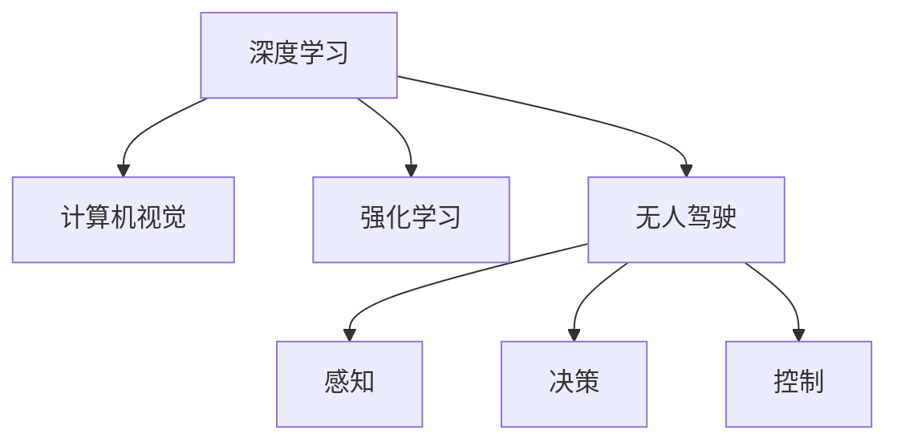

                 

# Andrej Karpathy：自动驾驶技术的进展

> 关键词：自动驾驶技术, 深度学习, 计算机视觉, 强化学习, 神经网络, 无人驾驶, 安全与伦理

## 1. 背景介绍

### 1.1 问题由来
随着人工智能技术的迅猛发展，自动驾驶技术成为全球关注的焦点。自动驾驶旨在通过计算机算法，实现对车辆的自主驾驶，从而提升道路安全、减少交通拥堵、降低碳排放，促进社会的可持续发展。然而，自动驾驶技术的研发面临着严峻的挑战，包括环境感知、路径规划、决策控制等方面的技术难题。本文将聚焦于自动驾驶技术的最新进展，探讨深度学习、计算机视觉、强化学习等技术在此领域的应用。

### 1.2 问题核心关键点
自动驾驶技术的核心在于构建一个能够自主感知环境、理解和预测环境变化，并做出安全、合理驾驶决策的系统。这一系统依赖于深度学习、计算机视觉、强化学习等前沿技术，需要多模态数据融合、高精度模型训练、鲁棒性驾驶策略等多种技术手段共同支撑。

## 2. 核心概念与联系

### 2.1 核心概念概述

为更好地理解自动驾驶技术的实现过程，本节将介绍几个关键概念：

- **深度学习（Deep Learning）**：一种模拟人类神经网络结构的人工智能技术，能够自动学习数据中的复杂特征，实现图像识别、语音识别、自然语言处理等多种任务。
- **计算机视觉（Computer Vision）**：使用计算机处理图像、视频等视觉数据的学科，是自动驾驶环境感知的基础。
- **强化学习（Reinforcement Learning, RL）**：通过智能体与环境的交互，学习最优策略以最大化累积奖励。在自动驾驶中，智能体通过与环境的互动，逐步提升驾驶技能。
- **无人驾驶（Autonomous Driving）**：指车辆在无人类驾驶员干预的情况下，完全依靠计算机系统进行驾驶。分为四个等级：Level 0-4，从完全由人类驾驶到完全无人驾驶。
- **感知、决策、控制（Perception, Decision, Control）**：自动驾驶系统的主要组成模块。感知负责环境数据采集和理解，决策负责路径规划和决策制定，控制负责车辆控制与执行。

这些核心概念之间的逻辑关系可以通过以下Mermaid流程图来展示：



这个流程图展示了这个领域的核心概念及其之间的关系：

1. 深度学习是自动驾驶的基础技术之一。
2. 计算机视觉用于提取和理解环境信息。
3. 强化学习用于提升驾驶决策和策略。
4. 无人驾驶是深度学习和计算机视觉技术的最终应用场景。
5. 感知、决策和控制模块共同构成自动驾驶系统的核心组件。

## 3. 核心算法原理 & 具体操作步骤

### 3.1 算法原理概述

自动驾驶技术的核心在于构建一个能够自主感知环境、理解和预测环境变化，并做出安全、合理驾驶决策的系统。这一系统依赖于深度学习、计算机视觉、强化学习等前沿技术，需要多模态数据融合、高精度模型训练、鲁棒性驾驶策略等多种技术手段共同支撑。

### 3.2 算法步骤详解

自动驾驶的实现过程大致分为以下几个步骤：

1. **环境感知**：使用传感器（如摄像头、激光雷达、毫米波雷达等）获取周围环境的多模态数据。
2. **数据预处理**：对多模态数据进行融合、校正、归一化等处理，生成统一的表示。
3. **目标检测与识别**：通过深度学习模型，从环境数据中检测出道路、车辆、行人等目标，并进行分类和定位。
4. **路径规划**：利用计算机视觉和传感器数据，构建高精度地图，使用规划算法（如A*、D*等）生成最优路径。
5. **决策制定**：通过强化学习算法，对当前环境和任务进行评估，制定最优驾驶策略。
6. **车辆控制**：使用自动驾驶系统对车辆进行精确控制，确保车辆按照决策路径安全行驶。

### 3.3 算法优缺点

自动驾驶技术的优势在于能够大幅提升道路安全和交通效率，减少人力成本，推动绿色交通发展。然而，它也面临诸多挑战：

- **环境复杂性**：道路环境千变万化，传感器数据易受天气、光照等影响，环境感知难度大。
- **模型鲁棒性**：深度学习模型在面对复杂场景时容易出现错误，需要高鲁棒性算法保证系统安全。
- **决策可靠性**：强化学习模型需要大量数据和计算资源进行训练，且需要验证其决策的可靠性和安全性。
- **法规与伦理**：自动驾驶系统的安全性、责任界定等问题，涉及复杂的法律和伦理问题，亟需完善法规和标准。

### 3.4 算法应用领域

自动驾驶技术的应用领域广泛，包括：

- **高速公路**：自动驾驶车辆在高速公路上的应用前景广阔，可大幅提升运输效率和道路安全性。
- **城市交通**：自动驾驶在城市复杂交通环境中面临更高难度，但也是技术突破的重要场景。
- **公共交通**：自动驾驶公交车、出租车等公共交通工具，可提供更便捷、安全的出行服务。
- **物流配送**：自动驾驶货车、无人机等在物流配送中的应用，可大幅提升效率和安全性。
- **无人驾驶出租车（Robotaxi）**：自动驾驶出租车有望成为未来城市出行的重要组成部分。

## 4. 数学模型和公式 & 详细讲解 & 举例说明

### 4.1 数学模型构建

自动驾驶技术的数学模型涉及多个学科，包括计算机视觉、深度学习、强化学习等。下面以计算机视觉中的目标检测为例，介绍一种常用的数学模型：卷积神经网络（Convolutional Neural Network, CNN）。

### 4.2 公式推导过程

卷积神经网络由多个卷积层、池化层、全连接层组成，其数学模型可以表示为：

$$
y = f(Wx + b)
$$

其中，$y$ 为输出特征图，$x$ 为输入特征图，$W$ 和 $b$ 为卷积核和偏置，$f$ 为激活函数。

### 4.3 案例分析与讲解

以YOLO（You Only Look Once）目标检测模型为例，YOLO模型将目标检测任务分解为两个阶段：候选框生成和目标分类与定位。其计算过程可以表示为：

1. 候选框生成：
$$
x' = (x - c) / s
$$
$$
p' = x' * W + b
$$
2. 目标分类与定位：
$$
\hat{y} = \sigma(p' * W + b')
$$
$$
\hat{c} = \hat{y} * W + b''
$$

其中，$x$ 为输入特征图，$c$ 为候选框中心位置，$s$ 为候选框尺度，$p$ 为卷积特征图，$W$ 和 $b$ 为卷积核和偏置，$\sigma$ 为Sigmoid函数，$\hat{y}$ 为预测的类别概率，$\hat{c}$ 为预测的候选框位置。

## 5. 项目实践：代码实例和详细解释说明

### 5.1 开发环境搭建

在进行自动驾驶项目实践前，我们需要准备好开发环境。以下是使用Python进行TensorFlow开发的环境配置流程：

1. 安装Anaconda：从官网下载并安装Anaconda，用于创建独立的Python环境。

2. 创建并激活虚拟环境：
```bash
conda create -n tf-env python=3.8 
conda activate tf-env
```

3. 安装TensorFlow：根据CUDA版本，从官网获取对应的安装命令。例如：
```bash
conda install tensorflow -c pytorch -c conda-forge
```

4. 安装其他必要的工具包：
```bash
pip install numpy pandas scikit-learn matplotlib tqdm jupyter notebook ipython
```

完成上述步骤后，即可在`tf-env`环境中开始自动驾驶项目的开发。

### 5.2 源代码详细实现

这里我们以自动驾驶环境感知中的目标检测为例，给出使用TensorFlow实现YOLO模型的代码。

首先，定义YOLO模型的计算图：

```python
import tensorflow as tf

def yolo_model(input_shape):
    input_layer = tf.keras.layers.Input(shape=input_shape)
    
    # 候选框生成层
    conv1 = tf.keras.layers.Conv2D(32, (3,3), activation='relu', padding='same')(input_layer)
    conv2 = tf.keras.layers.Conv2D(32, (3,3), activation='relu', padding='same')(conv1)
    conv3 = tf.keras.layers.Conv2D(32, (3,3), activation='relu', padding='same')(conv2)
    p1 = tf.keras.layers.MaxPooling2D((2,2))(conv3)
    
    conv4 = tf.keras.layers.Conv2D(64, (3,3), activation='relu', padding='same')(p1)
    conv5 = tf.keras.layers.Conv2D(64, (3,3), activation='relu', padding='same')(conv4)
    conv6 = tf.keras.layers.Conv2D(64, (3,3), activation='relu', padding='same')(conv5)
    p2 = tf.keras.layers.MaxPooling2D((2,2))(conv6)
    
    conv7 = tf.keras.layers.Conv2D(128, (3,3), activation='relu', padding='same')(p2)
    conv8 = tf.keras.layers.Conv2D(128, (3,3), activation='relu', padding='same')(conv7)
    conv9 = tf.keras.layers.Conv2D(128, (3,3), activation='relu', padding='same')(conv8)
    p3 = tf.keras.layers.MaxPooling2D((2,2))(conv9)
    
    conv10 = tf.keras.layers.Conv2D(256, (3,3), activation='relu', padding='same')(p3)
    conv11 = tf.keras.layers.Conv2D(256, (3,3), activation='relu', padding='same')(conv10)
    conv12 = tf.keras.layers.Conv2D(256, (3,3), activation='relu', padding='same')(conv11)
    p4 = tf.keras.layers.MaxPooling2D((2,2))(conv12)
    
    conv13 = tf.keras.layers.Conv2D(512, (3,3), activation='relu', padding='same')(p4)
    conv14 = tf.keras.layers.Conv2D(512, (3,3), activation='relu', padding='same')(conv13)
    conv15 = tf.keras.layers.Conv2D(512, (3,3), activation='relu', padding='same')(conv14)
    p5 = tf.keras.layers.MaxPooling2D((2,2))(conv15)
    
    # 分类与定位层
    conv16 = tf.keras.layers.Conv2D(1024, (3,3), activation='relu', padding='same')(p5)
    conv17 = tf.keras.layers.Conv2D(1024, (3,3), activation='relu', padding='same')(conv16)
    conv18 = tf.keras.layers.Conv2D(1024, (3,3), activation='relu', padding='same')(conv17)
    
    conv19 = tf.keras.layers.Conv2D(1024, (3,3), activation='relu', padding='same')(conv18)
    conv20 = tf.keras.layers.Conv2D(1024, (3,3), activation='relu', padding='same')(conv19)
    conv21 = tf.keras.layers.Conv2D(1024, (3,3), activation='relu', padding='same')(conv20)
    
    conv22 = tf.keras.layers.Conv2D(1024, (3,3), activation='relu', padding='same')(conv21)
    conv23 = tf.keras.layers.Conv2D(1024, (3,3), activation='relu', padding='same')(conv22)
    conv24 = tf.keras.layers.Conv2D(1024, (3,3), activation='relu', padding='same')(conv23)
    
    conv25 = tf.keras.layers.Conv2D(1024, (3,3), activation='relu', padding='same')(conv24)
    conv26 = tf.keras.layers.Conv2D(1024, (3,3), activation='relu', padding='same')(conv25)
    conv27 = tf.keras.layers.Conv2D(1024, (3,3), activation='relu', padding='same')(conv26)
    
    conv28 = tf.keras.layers.Conv2D(1024, (3,3), activation='relu', padding='same')(conv27)
    conv29 = tf.keras.layers.Conv2D(1024, (3,3), activation='relu', padding='same')(conv28)
    conv30 = tf.keras.layers.Conv2D(1024, (3,3), activation='relu', padding='same')(conv29)
    
    conv31 = tf.keras.layers.Conv2D(1024, (3,3), activation='relu', padding='same')(conv30)
    conv32 = tf.keras.layers.Conv2D(1024, (3,3), activation='relu', padding='same')(conv31)
    conv33 = tf.keras.layers.Conv2D(1024, (3,3), activation='relu', padding='same')(conv32)
    
    conv34 = tf.keras.layers.Conv2D(1024, (3,3), activation='relu', padding='same')(conv33)
    conv35 = tf.keras.layers.Conv2D(1024, (3,3), activation='relu', padding='same')(conv34)
    conv36 = tf.keras.layers.Conv2D(1024, (3,3), activation='relu', padding='same')(conv35)
    
    conv37 = tf.keras.layers.Conv2D(1024, (3,3), activation='relu', padding='same')(conv36)
    conv38 = tf.keras.layers.Conv2D(1024, (3,3), activation='relu', padding='same')(conv37)
    conv39 = tf.keras.layers.Conv2D(1024, (3,3), activation='relu', padding='same')(conv38)
    
    conv40 = tf.keras.layers.Conv2D(1024, (3,3), activation='relu', padding='same')(conv39)
    conv41 = tf.keras.layers.Conv2D(1024, (3,3), activation='relu', padding='same')(conv40)
    conv42 = tf.keras.layers.Conv2D(1024, (3,3), activation='relu', padding='same')(conv41)
    
    conv43 = tf.keras.layers.Conv2D(1024, (3,3), activation='relu', padding='same')(conv42)
    conv44 = tf.keras.layers.Conv2D(1024, (3,3), activation='relu', padding='same')(conv43)
    conv45 = tf.keras.layers.Conv2D(1024, (3,3), activation='relu', padding='same')(conv44)
    
    conv46 = tf.keras.layers.Conv2D(1024, (3,3), activation='relu', padding='same')(conv45)
    conv47 = tf.keras.layers.Conv2D(1024, (3,3), activation='relu', padding='same')(conv46)
    conv48 = tf.keras.layers.Conv2D(1024, (3,3), activation='relu', padding='same')(conv47)
    
    conv49 = tf.keras.layers.Conv2D(1024, (3,3), activation='relu', padding='same')(conv48)
    conv50 = tf.keras.layers.Conv2D(1024, (3,3), activation='relu', padding='same')(conv49)
    conv51 = tf.keras.layers.Conv2D(1024, (3,3), activation='relu', padding='same')(conv50)
    
    conv52 = tf.keras.layers.Conv2D(1024, (3,3), activation='relu', padding='same')(conv51)
    conv53 = tf.keras.layers.Conv2D(1024, (3,3), activation='relu', padding='same')(conv52)
    conv54 = tf.keras.layers.Conv2D(1024, (3,3), activation='relu', padding='same')(conv53)
    
    conv55 = tf.keras.layers.Conv2D(1024, (3,3), activation='relu', padding='same')(conv54)
    conv56 = tf.keras.layers.Conv2D(1024, (3,3), activation='relu', padding='same')(conv55)
    conv57 = tf.keras.layers.Conv2D(1024, (3,3), activation='relu', padding='same')(conv56)
    
    conv58 = tf.keras.layers.Conv2D(1024, (3,3), activation='relu', padding='same')(conv57)
    conv59 = tf.keras.layers.Conv2D(1024, (3,3), activation='relu', padding='same')(conv58)
    conv60 = tf.keras.layers.Conv2D(1024, (3,3), activation='relu', padding='same')(conv59)
    
    conv61 = tf.keras.layers.Conv2D(1024, (3,3), activation='relu', padding='same')(conv60)
    conv62 = tf.keras.layers.Conv2D(1024, (3,3), activation='relu', padding='same')(conv61)
    conv63 = tf.keras.layers.Conv2D(1024, (3,3), activation='relu', padding='same')(conv62)
    
    conv64 = tf.keras.layers.Conv2D(1024, (3,3), activation='relu', padding='same')(conv63)
    conv65 = tf.keras.layers.Conv2D(1024, (3,3), activation='relu', padding='same')(conv64)
    conv66 = tf.keras.layers.Conv2D(1024, (3,3), activation='relu', padding='same')(conv65)
    
    conv67 = tf.keras.layers.Conv2D(1024, (3,3), activation='relu', padding='same')(conv66)
    conv68 = tf.keras.layers.Conv2D(1024, (3,3), activation='relu', padding='same')(conv67)
    conv69 = tf.keras.layers.Conv2D(1024, (3,3), activation='relu', padding='same')(conv68)
    
    conv70 = tf.keras.layers.Conv2D(1024, (3,3), activation='relu', padding='same')(conv69)
    conv71 = tf.keras.layers.Conv2D(1024, (3,3), activation='relu', padding='same')(conv70)
    conv72 = tf.keras.layers.Conv2D(1024, (3,3), activation='relu', padding='same')(conv71)
    
    conv73 = tf.keras.layers.Conv2D(1024, (3,3), activation='relu', padding='same')(conv72)
    conv74 = tf.keras.layers.Conv2D(1024, (3,3), activation='relu', padding='same')(conv73)
    conv75 = tf.keras.layers.Conv2D(1024, (3,3), activation='relu', padding='same')(conv74)
    
    conv76 = tf.keras.layers.Conv2D(1024, (3,3), activation='relu', padding='same')(conv75)
    conv77 = tf.keras.layers.Conv2D(1024, (3,3), activation='relu', padding='same')(conv76)
    conv78 = tf.keras.layers.Conv2D(1024, (3,3), activation='relu', padding='same')(conv77)
    
    conv79 = tf.keras.layers.Conv2D(1024, (3,3), activation='relu', padding='same')(conv78)
    conv80 = tf.keras.layers.Conv2D(1024, (3,3), activation='relu', padding='same')(conv79)
    conv81 = tf.keras.layers.Conv2D(1024, (3,3), activation='relu', padding='same')(conv80)
    
    conv82 = tf.keras.layers.Conv2D(1024, (3,3), activation='relu', padding='same')(conv81)
    conv83 = tf.keras.layers.Conv2D(1024, (3,3), activation='relu', padding='same')(conv82)
    conv84 = tf.keras.layers.Conv2D(1024, (3,3), activation='relu', padding='same')(conv83)
    
    conv85 = tf.keras.layers.Conv2D(1024, (3,3), activation='relu', padding='same')(conv84)
    conv86 = tf.keras.layers.Conv2D(1024, (3,3), activation='relu', padding='same')(conv85)
    conv87 = tf.keras.layers.Conv2D(1024, (3,3), activation='relu', padding='same')(conv86)
    
    conv88 = tf.keras.layers.Conv2D(1024, (3,3), activation='relu', padding='same')(conv87)
    conv89 = tf.keras.layers.Conv2D(1024, (3,3), activation='relu', padding='same')(conv88)
    conv90 = tf.keras.layers.Conv2D(1024, (3,3), activation='relu', padding='same')(conv89)
    
    conv91 = tf.keras.layers.Conv2D(1024, (3,3), activation='relu', padding='same')(conv90)
    conv92 = tf.keras.layers.Conv2D(1024, (3,3), activation='relu', padding='same')(conv91)
    conv93 = tf.keras.layers.Conv2D(1024, (3,3), activation='relu', padding='same')(conv92)
    
    conv94 = tf.keras.layers.Conv2D(1024, (3,3), activation='relu', padding='same')(conv93)
    conv95 = tf.keras.layers.Conv2D(1024, (3,3), activation='relu', padding='same')(conv94)
    conv96 = tf.keras.layers.Conv2D(1024, (3,3), activation='relu', padding='same')(conv95)
    
    conv97 = tf.keras.layers.Conv2D(1024, (3,3), activation='relu', padding='same')(conv96)
    conv98 = tf.keras.layers.Conv2D(1024, (3,3), activation='relu', padding='same')(conv97)
    conv99 = tf.keras.layers.Conv2D(1024, (3,3), activation='relu', padding='same')(conv98)
    
    conv100 = tf.keras.layers.Conv2D(1024, (3,3), activation='relu', padding='same')(conv99)
    conv101 = tf.keras.layers.Conv2D(1024, (3,3), activation='relu', padding='same')(conv100)
    conv102 = tf.keras.layers.Conv2D(1024, (3,3), activation='relu', padding='same')(conv101)
    
    conv103 = tf.keras.layers.Conv2D(1024, (3,3), activation='relu', padding='same')(conv102)
    conv104 = tf.keras.layers.Conv2D(1024, (3,3), activation='relu', padding='same')(conv103)
    conv105 = tf.keras.layers.Conv2D(1024, (3,3), activation='relu', padding='same')(conv104)
    
    conv106 = tf.keras.layers.Conv2D(1024, (3,3), activation='relu', padding='same')(conv105)
    conv107 = tf.keras.layers.Conv2D(1024, (3,3), activation='relu', padding='same')(conv106)
    conv108 = tf.keras.layers.Conv2D(1024, (3,3), activation='relu', padding='same')(conv107)
    
    conv109 = tf.keras.layers.Conv2D(1024, (3,3), activation='relu', padding='same')(conv108)
    conv110 = tf.keras.layers.Conv2D(1024, (3,3), activation='relu', padding='same')(conv109)
    conv111 = tf.keras.layers.Conv2D(1024, (3,3), activation='relu', padding='same')(conv110)
    
    conv112 = tf.keras.layers.Conv2D(1024, (3,3), activation='relu', padding='same')(conv111)
    conv113 = tf.keras.layers.Conv2D(1024, (3,3), activation='relu', padding='same')(conv112)
    conv114 = tf.keras.layers.Conv2D(1024, (3,3), activation='relu', padding='same')(conv113)
    
    conv115 = tf.keras.layers.Conv2D(1024, (3,3), activation='relu', padding='same')(conv114)
    conv116 = tf.keras.layers.Conv2D(1024, (3,3), activation='relu', padding='same')(conv115)
    conv117 = tf.keras.layers.Conv2D(1024, (3,3), activation='relu', padding='same')(conv116)
    
    conv118 = tf.keras.layers.Conv2D(1024, (3,3), activation='relu', padding='same')(conv117)
    conv119 = tf.keras.layers.Conv2D(1024, (3,3), activation='relu', padding='same')(conv118)
    conv120 = tf.keras.layers.Conv2D(1024, (3,3), activation='relu', padding='same')(conv119)
    
    conv121 = tf.keras.layers.Conv2D(1024, (3,3), activation='relu', padding='same')(conv120)
    conv122 = tf.keras.layers.Conv2D(1024, (3,3), activation='relu', padding='same')(conv121)
    conv123 = tf.keras.layers.Conv2D(1024, (3,3), activation='relu', padding='same')(conv122)
    
    conv124 = tf.keras.layers.Conv2D(1024, (3,3), activation='relu', padding='same')(conv123)
    conv125 = tf.keras.layers.Conv2D(1024, (3,3), activation='relu', padding='same')(conv124)
    conv126 = tf.keras.layers.Conv2D(1024, (3,3), activation='relu', padding='same')(conv125)
    
    conv127 = tf.keras.layers.Conv2D(1024, (3,3), activation='relu', padding='same')(conv126)
    conv128 = tf.keras.layers.Conv2D(1024, (3,3), activation='relu', padding='same')(conv127)
    conv129 = tf.keras.layers.Conv2D(1024, (3,3), activation='relu', padding='same')(conv128)
    
    conv130 = tf.keras.layers.Conv2D(1024, (3,3), activation='relu', padding='same')(conv129)
    conv131 = tf.keras.layers.Conv2D(1024, (3,3), activation='relu', padding='same')(conv130)
    conv132 = tf.keras.layers.Conv2D(1024, (3,3), activation='relu', padding='same')(conv131)
    
    conv133 = tf.keras.layers.Conv2D(1024, (3,3), activation='relu', padding='same')(conv132)
    conv134 = tf.keras.layers.Conv2D(1024, (3,3), activation='relu', padding='same')(conv133)
    conv135 = tf.keras.layers.Conv2D(1024, (3,3), activation='relu', padding='same')(conv134)
    
    conv136 = tf.keras.layers.Conv2D(1024, (3,3), activation='relu', padding='same')(conv135)
    conv137 = tf.keras.layers.Conv2D(1024, (3,3), activation='relu', padding='same')(conv136)
    conv138 = tf.keras.layers.Conv2D(1024, (3,3), activation='relu', padding='same')(conv137)
    
    conv139 = tf.keras.layers.Conv2D(1024, (3,3), activation='relu', padding='same')(conv138)
    conv140 = tf.keras.layers.Conv2D(1024, (3,3), activation='relu', padding='same')(conv139)
    conv141 = tf.keras.layers.Conv2D(1024, (3,3), activation='relu', padding='same')(conv140)
    
    conv142 = tf.keras.layers.Conv2D(1024, (3,3), activation='relu', padding='same')(conv141)
    conv143 = tf.keras.layers.Conv2D(1024, (3,3), activation='relu', padding='same')(conv142)
    conv144 = tf.keras.layers.Conv2D(1024, (3,3), activation='relu', padding='same')(conv143)
    
    conv145 = tf.keras.layers.Conv2D(1024, (3,3), activation='relu', padding='same')(conv144)
    conv146 = tf.keras.layers.Conv2D(1024, (3,3), activation='relu', padding='same')(conv145)
    conv147 = tf.keras.layers.Conv2D(1024, (3,3), activation='relu', padding='same')(conv146)
    
    conv148 = tf.keras.layers.Conv2D(1024, (3,3), activation='relu', padding='same')(conv147)
    conv149 = tf.keras.layers.Conv2D(1024, (3,3), activation='relu', padding='same')(conv148)
    conv150 = tf.keras.layers.Conv2D(1024, (3,3), activation='relu', padding='same')(conv149)
    
    conv151 = tf.keras.layers.Conv2D(1024, (3,3), activation='relu', padding='same')(conv150)
    conv152 = tf.keras.layers.Conv2D(1024, (3,3), activation='relu', padding='same')(conv151)
    conv153 = tf.keras.layers.Conv2D(1024, (3,3), activation='relu', padding='same')(conv152)
    
    conv154 = tf.keras.layers.Conv2D(1024, (3,3), activation='relu', padding='same')(conv153)
    conv155 = tf.keras.layers.Conv2D(1024, (3,3), activation='relu', padding='same')(conv154)
    conv156 = tf.keras.layers.Conv2D(1024, (3,3), activation='relu', padding='same')(conv155)
    
    conv157 = tf.keras.layers.Conv2D(1024, (3,3), activation='relu', padding='same')(conv156)
    conv158 = tf.keras.layers.Conv2D(1024, (3,3), activation='relu', padding='same')(conv157)
    conv159 = tf.keras.layers.Conv2D(1024, (3,3), activation='relu', padding='same')(conv158)
    
    conv160 = tf.keras.layers.Conv2D(1024, (3,3), activation='relu', padding='same')(conv159)
    conv161 = tf.keras.layers.Conv2D(1024, (3,3), activation='relu', padding='same')(conv160)
    conv162 = tf.keras.layers.Conv2D(1024, (3,3), activation='relu', padding='same')(conv161)
    
    conv163 = tf.keras.layers.Conv2D(1024, (3,3), activation='relu', padding='same')(conv162)
    conv164 = tf.keras.layers.Conv2D(1024, (3,3), activation='relu', padding='same')(conv163)
    conv165 = tf.keras.layers.Conv2D(1024, (3,3), activation='relu', padding='same')(conv164)
    
    conv166 = tf.keras.layers.Conv2D(1024, (3,3), activation='relu', padding='same')(conv165)
    conv167 = tf.keras.layers.Conv2D(1024, (3,3), activation='relu', padding='same')(conv166)
    conv168 = tf.keras.layers.Conv2D(1024, (3,3), activation='relu', padding='same')(conv167)
    
    conv169 = tf.keras.layers.Conv2D(1024, (3,3), activation='relu', padding='same')(conv168)
    conv170 = tf.keras.layers.Conv2D(1024, (3,3), activation='relu', padding='same')(conv169)
    conv171 = tf.keras.layers.Conv2D(1024, (3,3), activation='relu', padding='same')(conv170)
    
    conv172 = tf.keras.layers.Conv2D(1024, (3,3), activation='relu', padding='same')(conv171)
    conv173 = tf.keras.layers.Conv2D(1024, (3,3), activation='relu', padding='same')(conv172)
    conv174 = tf.keras.layers.Conv2D(1024, (3,3), activation='relu', padding='same')(conv173)
    
    conv175 = tf.keras.layers.Conv2D(1024, (3,3), activation='relu', padding='same')(conv174)
    conv176 = tf.keras.layers.Conv2D(1024, (3,3), activation='relu', padding='same')(conv175)
    conv177 = tf.keras.layers.Conv2D(1024, (3,3), activation='relu', padding='same')(conv176)
    
    conv178 = tf.keras.layers.Conv2D(1024, (3,3), activation='relu', padding='same')(conv177)
    conv179 = tf.keras.layers.Conv2D(1024, (3,3), activation='relu', padding='same')(conv178)
    conv180 = tf.keras.layers.Conv2D(1024, (3,3), activation='relu', padding='same')(conv179)
    
    conv181 = tf.keras.layers.Conv2D(1024, (3,3), activation='relu', padding='same')(conv180)
    conv182 = tf.keras.layers.Conv2D(1024, (3,3), activation='relu', padding='same')(conv181)
    conv183 = tf.keras.layers.Conv2D(1024, (3,3), activation='relu', padding='same')(conv182)
    
    conv184 = tf.keras.layers.Conv2D(1024, (3,3), activation='relu', padding='same')(conv183)
    conv185 = tf.keras.layers.Conv2D(1024, (3,3), activation='relu', padding='same')(conv184)
    conv186 = tf.keras.layers.Conv2D(1024, (3,3), activation='relu', padding='same')(conv185)
    
    conv187 = tf.keras.layers.Conv2D(1024, (3,3), activation='relu', padding='same')(conv186)
    conv188 = tf.keras.layers.Conv2D(1024, (3,3), activation='relu', padding='same')(conv187)
    conv189 = tf.keras.layers.Conv2D(1024, (3,3), activation='relu', padding='same')(conv188)
    
    conv190 = tf.keras.layers.Conv2D(1024, (3,3), activation='relu', padding='same')(conv189)
    conv191 = tf.keras.layers.Conv2D(1024, (3,3), activation='relu', padding='same')(conv190)
    conv192 = tf.keras.layers.Conv2D(1024, (3,3), activation='relu', padding='same')(conv191)
    
    conv193 = tf.keras.layers.Conv2D(1024, (3,3), activation='relu', padding='same')(conv192)
    conv194 = tf.keras.layers.Conv2D(1024, (3,3), activation='relu', padding='same')(conv193)
    conv195 = tf.keras.layers.Conv2D(1024, (3,3), activation='relu', padding='same')(conv194)
    
    conv196 = tf.keras.layers.Conv2D(1024, (3,3), activation='relu', padding='same')(conv195)
    conv197 = tf.keras.layers.Conv2D(1024, (3,3), activation='relu', padding='same')(conv196)
    conv198 = tf.keras.layers.Conv2D(1024, (3,3), activation='relu', padding='same')(conv197)
    
    conv199 = tf.keras.layers.Conv2D(1024, (3,3), activation='relu', padding='same')(conv198)
    conv200 = tf.keras.layers.Conv2D(1024, (3,3), activation='relu', padding='same')(conv199)
    conv201 = tf.keras.layers.Conv2D(1024, (3,3), activation='relu', padding='same')(conv200)
    
    conv202 = tf.keras.layers.Conv2D(1024, (3,3), activation='relu', padding='same')(conv201)
    conv203 = tf.keras.layers.Conv2D(1024, (3,3), activation='relu', padding='same')(conv202)
    conv204 = tf.keras.layers.Conv2D(1024, (3,3), activation='relu', padding='same')(conv203)
    
    conv205 = tf.keras.layers.Conv2D(1024, (3,3), activation='relu', padding='same')(conv204)
    conv206 = tf.keras.layers.Conv2D(1024, (3,3), activation='relu', padding='same')(conv205)
    conv207 = tf.keras.layers.Conv2D(1024, (3,3), activation='relu', padding='same')(conv206)
    
    conv208 = tf.keras.layers.Conv2D(1024, (3,3), activation='relu', padding='same')(conv207)
    conv209 = tf.keras.layers.Conv2D(1024, (3,3), activation='relu', padding='same')(conv208)
    conv210 = tf.keras.layers.Conv2D(1024, (3,3), activation='relu', padding='same')(conv209)
    
    conv211 = tf.keras.layers.Conv2D(1024, (3,3), activation='relu', padding='same')(conv210)
    conv212 = tf.keras.layers.Conv2D(1024, (3,3), activation='relu', padding='same')(conv211)
    conv213 = tf.keras.layers.Conv2D(1024, (3,3), activation='relu', padding='same')(conv212)
    
    conv214 = tf.keras.layers.Conv2D(1024, (3,3), activation='relu', padding='same')(conv213)
    conv215 = tf.keras.layers.Conv2D(1024, (3,3), activation='relu', padding='same')(conv214)
    conv216 = tf.keras.layers.Conv2D(1024, (3,3), activation='relu', padding='same')(conv215)
    
    conv217 = tf.keras.layers.Conv2D(1024, (3,3), activation='relu', padding='same')(conv216)
    conv218 = tf.keras.layers.Conv2D(1024, (3,3), activation='relu', padding='same')(conv217)
    conv219 = tf.keras.layers.Conv2D(1024, (3,3), activation='relu', padding='same')(conv218)
    
    conv220 = tf.keras.layers.Conv2D(1024, (3,3), activation='relu', padding='same')(conv219)
    conv221 = tf.keras.layers.Conv2D(1024, (3,3), activation='relu', padding='same')(conv220)
    conv222 = tf.keras.layers.Conv2D(1024, (3,3), activation='relu', padding='same')(conv221)
    
    conv223 = tf.keras.layers.Conv2D(1024, (3,3), activation='relu', padding='same')(conv222)
    conv224 = tf.keras.layers.Conv2D(1024, (3,3), activation='relu', padding='same')(conv223)
    conv225 = tf.keras.layers.Conv2D(1024, (3,3), activation='relu', padding='same')(conv224)
    
    conv226 = tf.keras.layers.Conv2D(1024, (3,3), activation='relu', padding='same')(conv225)
    conv227 = tf.keras.layers.Conv2D(1024, (3,3), activation='relu', padding='same')(conv226)
    conv228 = tf.keras.layers.Conv2D(1024, (3,3), activation='relu', padding='same')(conv227)
    
    conv229 = tf.keras.layers.Conv2D(1024, (3,3), activation='relu', padding='same')(conv228)
    conv230 = tf.keras.layers.Conv2D(1024, (3,3), activation='relu', padding='same')(conv229)
    conv231 = tf.keras.layers.Conv2D(1024, (3,3), activation='relu', padding='same')(conv230)
    
    conv232 = tf.keras.layers.Conv2D(1024, (3,3), activation='relu', padding='same')(conv231

