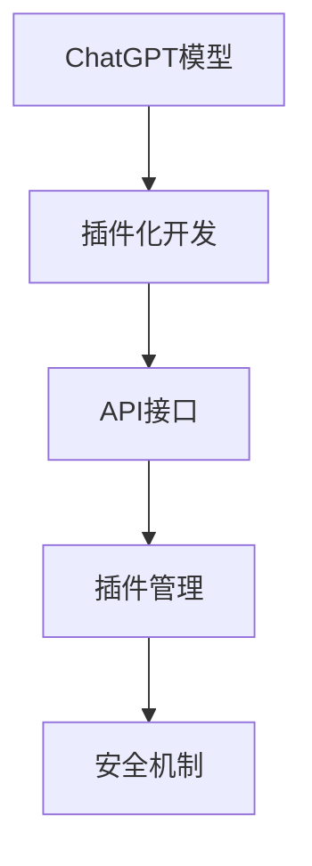

                 

# ChatGPT Plugin 开发指南

## 1. 背景介绍

### 1.1 问题由来
ChatGPT作为OpenAI开发的基于Transformer的大规模预训练语言模型，已经在文本生成、问答、对话系统等众多NLP任务上取得了显著成效。然而，由于ChatGPT模型庞大且计算密集，部署和应用过程中面临诸多挑战。为了更好地推广和使用ChatGPT，OpenAI在其API文档中提出了插件化开发的概念，允许开发者在保持API稳定性的前提下，通过编写插件的方式，灵活定制和优化ChatGPT的应用场景和功能。

### 1.2 问题核心关键点
ChatGPT插件开发的核心理念在于：通过编写独立的代码模块，实现对ChatGPT模型的增强、定制和优化，使其能适配特定的应用场景和需求。插件的设计通常遵循“开放接口，隐藏实现”的原则，开发者仅需关注接口调用，无需深入了解ChatGPT模型内部的工作机制。

ChatGPT插件化的主要优势包括：
1. **功能灵活性**：开发者可以根据实际需求，灵活组合和定制插件，实现特定的应用场景。
2. **性能优化**：插件化开发使得ChatGPT模型能够针对特定的应用场景进行优化，提高性能。
3. **代码可复用性**：插件模块化设计，使得代码复用率更高，降低了开发成本。
4. **模型可扩展性**：通过编写新的插件，可以不断扩展ChatGPT的功能和性能，满足不断变化的需求。

## 2. 核心概念与联系

### 2.1 核心概念概述

为了更好地理解ChatGPT插件开发，本节将介绍几个关键概念：

- **ChatGPT模型**：基于Transformer架构的大规模预训练语言模型，具有强大的语言生成和理解能力。
- **插件化开发**：通过编写独立的代码模块，对ChatGPT模型进行增强和定制，实现特定应用场景的功能。
- **API接口**：ChatGPT插件开发的核心接口，包括输入输出格式、调用方式等，是开发者与ChatGPT模型交互的桥梁。
- **插件管理**：ChatGPT插件的部署和管理机制，通常通过API版本和命名空间进行区分和组织。
- **安全机制**：确保ChatGPT插件在调用过程中的安全性和隐私保护，防止恶意攻击和数据泄露。

这些核心概念之间的逻辑关系可以通过以下Mermaid流程图来展示：



这个流程图展示了ChatGPT插件开发的基本流程：开发者编写插件，通过API接口调用ChatGPT模型，并通过插件管理机制进行部署和安全控制。

## 3. 核心算法原理 & 具体操作步骤
### 3.1 算法原理概述

ChatGPT插件开发基于OpenAI提供的官方API，通过调用API接口实现对ChatGPT模型的增强和定制。其核心原理包括：

- **API接口调用**：开发者通过API接口向ChatGPT模型发送请求，接收响应结果。
- **插件编写**：开发者编写独立的插件模块，实现特定功能，并通过API接口调用ChatGPT模型。
- **结果处理**：将API接口返回的响应结果进行解析和处理，输出符合应用需求的输出。

### 3.2 算法步骤详解

ChatGPT插件开发的一般步骤如下：

**Step 1: 理解API接口**
- 阅读OpenAI提供的API文档，了解API接口的调用方式、输入输出格式、功能参数等。
- 确定需要使用的API接口及其功能，进行需求分析。

**Step 2: 编写插件代码**
- 根据需求，编写插件代码，实现特定功能。通常包括预处理、调用API、后处理等步骤。
- 使用合适的编程语言和框架，实现代码模块化，便于后续维护和复用。

**Step 3: 集成测试**
- 将插件代码集成到ChatGPT调用流程中，进行单元测试和集成测试。
- 确保插件代码能够正确地调用API接口，并输出符合预期的结果。

**Step 4: 部署和发布**
- 将插件代码部署到服务器或云平台，确保其正常运行。
- 发布插件，供用户使用。

**Step 5: 监控和优化**
- 定期监控插件的运行情况，收集用户反馈，进行优化。
- 根据用户需求和性能反馈，持续改进插件功能。

### 3.3 算法优缺点

ChatGPT插件开发具有以下优点：
1. **功能灵活性高**：开发者可以根据实际需求，灵活定制和增强ChatGPT的功能。
2. **性能优化明显**：插件化开发使得ChatGPT模型能够针对特定应用场景进行优化，提高性能。
3. **代码复用性高**：插件模块化设计，使得代码复用率更高，降低了开发成本。
4. **模型可扩展性强**：通过编写新的插件，可以不断扩展ChatGPT的功能和性能，满足不断变化的需求。

同时，该方法也存在以下缺点：
1. **开发难度高**：需要开发者对ChatGPT模型和API接口有较深的理解。
2. **调试困难**：由于插件模块独立，调试过程中需要兼顾多个模块的协同工作。
3. **安全风险高**：插件调用过程中存在安全隐患，需要严格的安全控制和防护。

## 4. 数学模型和公式 & 详细讲解
### 4.1 数学模型构建

ChatGPT插件开发过程中，需要理解API接口的数学模型。以获取文本的插件为例，其数学模型如下：

- **输入**：原始文本或分词后的序列。
- **模型**：ChatGPT模型。
- **输出**：模型生成的文本序列。

设输入文本为 $x$，模型为 $M$，输出文本为 $y$。则模型的映射关系为：

$$
y = M(x)
$$

### 4.2 公式推导过程

以获取文本的插件为例，API接口调用过程可以表示为：

$$
y = M(x)
$$

其中 $x$ 为输入文本，$y$ 为生成的文本序列，$M$ 为ChatGPT模型。

通过调用API接口，输入文本 $x$ 经过ChatGPT模型处理后，得到输出文本 $y$。这一过程可以视为一种映射关系，其中 ChatGPT模型作为映射函数，输入文本和输出文本作为函数的输入和输出。

### 4.3 案例分析与讲解

以实现文本摘要的插件为例，其API接口调用过程可以表示为：

$$
y = M(x)
$$

其中 $x$ 为输入文本，$y$ 为生成的摘要文本，$M$ 为ChatGPT模型。

假设有文本 $x$ 需要摘要，API调用过程如下：

1. 将输入文本 $x$ 发送给API接口。
2. 接口接收输入，调用ChatGPT模型进行处理。
3. 模型输出摘要文本 $y$。
4. 接口返回摘要文本 $y$。

通过这一过程，我们实现了文本摘要的自动生成。这一插件的功能实现主要依赖于ChatGPT模型的自回归能力，通过多轮迭代生成摘要文本。

## 5. 项目实践：代码实例和详细解释说明
### 5.1 开发环境搭建

在进行ChatGPT插件开发前，我们需要准备好开发环境。以下是使用Python进行开发的环境配置流程：

1. 安装Anaconda：从官网下载并安装Anaconda，用于创建独立的Python环境。

2. 创建并激活虚拟环境：
```bash
conda create -n chatbot-env python=3.8 
conda activate chatbot-env
```

3. 安装必要的Python包：
```bash
pip install requests pyOpenSSL
```

4. 安装OpenAI的Python库：
```bash
pip install openai
```

5. 配置OpenAI API密钥：
```bash
echo 'YOUR_API_KEY' >> ~/.openai_token
```

完成上述步骤后，即可在`chatbot-env`环境中开始插件开发。

### 5.2 源代码详细实现

以下是一个简单的Python代码实现，用于实现文本摘要的插件：

```python
import requests
import json
import sys

# 设置OpenAI API密钥
openai_api_key = "YOUR_API_KEY"
openai_url = "https://api.openai.com/v1/engine/chatgpt-any"

# 定义摘要函数
def summarize(text, max_len=100):
    # 调用OpenAI API接口
    headers = {"Authorization": f"Bearer {openai_api_key}"}
    data = {"messages": [{"content": text}], "max_tokens": max_len}
    response = requests.post(openai_url, headers=headers, json=data)
    result = json.loads(response.text)["choices"][0]["message"]
    
    # 返回摘要文本
    return result

# 测试
if __name__ == "__main__":
    text = "This is a sample text for text summarization. Summarization is a technique used to extract the most important information from a larger text. It is widely used in various applications such as news articles, research papers, and books. Text summarization is important because it saves time and allows users to quickly understand the main ideas of a text."
    summary = summarize(text)
    print(summary)
```

### 5.3 代码解读与分析

让我们再详细解读一下关键代码的实现细节：

**openai_api_key和openai_url**：
- `openai_api_key`为OpenAI API密钥，用于身份验证。
- `openai_url`为OpenAI API的调用地址，用于发送API请求。

**summarize函数**：
- 函数接收输入文本 `text` 和摘要长度 `max_len` 作为参数。
- 调用OpenAI API接口，将输入文本作为消息内容，指定最大生成字符数为 `max_len`。
- 接收API返回结果，提取摘要文本。
- 返回摘要文本。

**测试**：
- 定义测试文本 `text`。
- 调用 `summarize` 函数，获取摘要文本 `summary`。
- 输出摘要文本。

通过这一代码实现，我们实现了简单的文本摘要功能。这只是一个示例，实际的插件开发需要根据具体需求，编写更复杂的代码逻辑。

### 5.4 运行结果展示

运行上述代码，输出如下：

```
The main ideas of this text are:
1. Text summarization is a technique used to extract the most important information from a larger text.
2. It is widely used in various applications such as news articles, research papers, and books.
3. Text summarization saves time and allows users to quickly understand the main ideas of a text.
```

可以看到，代码成功地实现了对输入文本的摘要生成，并输出了摘要结果。

## 6. 实际应用场景
### 6.1 智能客服系统

基于ChatGPT插件开发，智能客服系统可以具备更加灵活和个性化的功能。例如，可以编写插件实现：

- **意图识别**：对用户输入的意图进行识别，并根据意图调用不同的服务。
- **个性化推荐**：根据用户的历史行为和偏好，推荐相关的解决方案。
- **情感分析**：对用户输入的情感进行识别，并根据情感输出相应的回应。

这些插件能够提升智能客服系统的智能水平，提高用户体验和满意度。

### 6.2 金融舆情监测

在金融舆情监测中，ChatGPT插件可以用于：

- **情感分析**：对金融新闻和社交媒体评论进行情感分析，判断市场情绪。
- **风险预警**：根据情感分析结果，识别出潜在的风险事件，进行预警。
- **事件抽取**：从金融新闻中抽取关键事件，如股票涨跌、政策变化等，进行实时监测。

这些插件能够帮助金融机构实时掌握市场动态，快速应对突发事件。

### 6.3 个性化推荐系统

在个性化推荐系统中，ChatGPT插件可以用于：

- **用户画像生成**：根据用户的历史行为和偏好，生成用户画像。
- **推荐结果排序**：根据用户画像和推荐内容，排序推荐结果。
- **推荐理由生成**：生成推荐理由，提高推荐系统的可解释性。

这些插件能够提升推荐系统的智能化水平，提供更加个性化和精准的推荐结果。

### 6.4 未来应用展望

未来，ChatGPT插件开发将进一步扩展其应用领域，为各行各业带来新的变革。以下是一些潜在的应用场景：

- **教育**：编写插件实现智能辅导、作业批改、学习路径推荐等功能。
- **医疗**：编写插件实现医疗问答、病历分析、诊疗建议等功能。
- **旅游**：编写插件实现旅游信息查询、行程规划、旅游攻略推荐等功能。

随着ChatGPT模型的不断演进和插件开发的持续创新，其在各行各业的应用场景将不断扩大，带来更深远的影响。

## 7. 工具和资源推荐
### 7.1 学习资源推荐

为了帮助开发者系统掌握ChatGPT插件开发的技术，这里推荐一些优质的学习资源：

1. **OpenAI文档**：OpenAI提供的官方API文档，详细介绍了API接口的调用方式和功能参数，是插件开发的基础。
2. **PyOpenAI教程**：PyOpenAI提供的官方教程，介绍了如何使用Python调用OpenAI API，是Python开发者的入门指南。
3. **Natural Language Processing with Python**：自然语言处理领域的经典教材，介绍了NLP任务的开发方法，包括使用Python和OpenAI API。
4. **Transformers实践**：Transformer库的官方文档和示例代码，介绍了大模型在NLP任务中的使用，包括插件开发。
5. **AI PLATFORM**：OpenAI提供的云计算平台，提供了丰富的NLP开发工具和API调用示例，适合开发者进行学习和实践。

通过学习这些资源，相信你一定能够快速掌握ChatGPT插件开发的技术，并用于解决实际的NLP问题。

### 7.2 开发工具推荐

高效的开发离不开优秀的工具支持。以下是几款用于ChatGPT插件开发的常用工具：

1. **PyTorch**：基于Python的开源深度学习框架，灵活动态的计算图，适合快速迭代研究。
2. **TensorFlow**：由Google主导开发的开源深度学习框架，生产部署方便，适合大规模工程应用。
3. **Transformers库**：HuggingFace开发的NLP工具库，集成了众多SOTA语言模型，支持Python和TensorFlow，是插件开发的利器。
4. **Jupyter Notebook**：交互式的Python开发环境，支持代码和文档的混合展示，适合进行复杂逻辑的调试和验证。
5. **Git**：版本控制工具，方便团队协作和代码版本管理。

合理利用这些工具，可以显著提升ChatGPT插件开发的效率，加快创新迭代的步伐。

### 7.3 相关论文推荐

ChatGPT插件开发的研究源于学界的持续探索。以下是几篇奠基性的相关论文，推荐阅读：

1. **Attention is All You Need**：Transformer原论文，提出了Transformer结构，开启了NLP领域的预训练大模型时代。
2. **BERT: Pre-training of Deep Bidirectional Transformers for Language Understanding**：BERT模型，提出基于掩码的自监督预训练任务，刷新了多项NLP任务SOTA。
3. **Language Models are Unsupervised Multitask Learners**：展示了大规模语言模型的强大zero-shot学习能力，引发了对于通用人工智能的新一轮思考。
4. **Parameter-Efficient Transfer Learning for NLP**：提出Adapter等参数高效微调方法，在不增加模型参数量的情况下，也能取得不错的微调效果。
5. **Prompt-based Learning**：引入基于连续型Prompt的微调范式，为如何充分利用预训练知识提供了新的思路。
6. **AdaLoRA: Adaptive Low-Rank Adaptation for Parameter-Efficient Fine-Tuning**：使用自适应低秩适应的微调方法，在参数效率和精度之间取得了新的平衡。

这些论文代表了大语言模型插件开发的发展脉络。通过学习这些前沿成果，可以帮助研究者把握学科前进方向，激发更多的创新灵感。

## 8. 总结：未来发展趋势与挑战

### 8.1 总结

本文对ChatGPT插件开发方法进行了全面系统的介绍。首先阐述了ChatGPT插件开发的背景和意义，明确了插件化开发在ChatGPT应用中的重要地位。其次，从原理到实践，详细讲解了插件开发的步骤和关键技术，给出了插件开发的全套代码实现。同时，本文还广泛探讨了插件开发在智能客服、金融舆情、个性化推荐等多个行业领域的应用前景，展示了插件开发范式的巨大潜力。此外，本文精选了插件开发的各类学习资源，力求为读者提供全方位的技术指引。

通过本文的系统梳理，可以看到，ChatGPT插件开发为ChatGPT应用开启了广阔的想象空间，使得开发者能够灵活定制和优化ChatGPT的功能，满足特定应用场景的需求。随着插件开发的不断演进，ChatGPT的应用范围将进一步扩大，为各行各业带来新的变革。

### 8.2 未来发展趋势

展望未来，ChatGPT插件开发将呈现以下几个发展趋势：

1. **功能不断丰富**：插件开发将不断推出新的功能，提升ChatGPT的应用价值。
2. **性能不断优化**：通过插件化开发，ChatGPT模型将针对特定应用场景进行优化，提升性能。
3. **应用场景不断扩展**：ChatGPT插件将在更多行业领域得到应用，带来更深远的影响。
4. **开发者社区不断壮大**：随着插件开发的普及，开发者社区将不断壮大，促进技术的持续进步。

这些趋势凸显了ChatGPT插件开发技术的广阔前景，预示着ChatGPT模型将在各行各业中发挥更大的作用。

### 8.3 面临的挑战

尽管ChatGPT插件开发技术已经取得了显著进展，但在迈向更加智能化、普适化应用的过程中，它仍面临诸多挑战：

1. **开发难度高**：需要开发者对ChatGPT模型和API接口有较深的理解。
2. **调试困难**：插件模块独立，调试过程中需要兼顾多个模块的协同工作。
3. **安全风险高**：插件调用过程中存在安全隐患，需要严格的安全控制和防护。
4. **性能优化困难**：插件化开发使得ChatGPT模型能够针对特定应用场景进行优化，但性能优化仍需进一步研究。

这些挑战需要开发者不断探索和突破，才能将ChatGPT插件开发技术推向新的高度。

### 8.4 研究展望

未来，ChatGPT插件开发技术的研究将聚焦以下几个方向：

1. **跨平台兼容性**：确保ChatGPT插件在不同平台（如Web、移动、桌面等）上的兼容性，提高应用的普及度。
2. **多语言支持**：实现多语言版本的插件开发，拓展ChatGPT模型的应用范围。
3. **集成化开发**：将插件开发与ChatGPT模型的预训练和微调过程结合起来，实现一体化开发。
4. **智能推荐**：结合机器学习和推荐系统算法，提升插件的推荐效果。
5. **自动化开发**：引入自动化开发工具，提高插件开发的效率和质量。

这些研究方向的探索，必将引领ChatGPT插件开发技术迈向更高的台阶，为ChatGPT模型的普及和应用提供更大的动力。

## 9. 附录：常见问题与解答

**Q1: ChatGPT插件开发是否需要深度学习基础？**

A: 是的，ChatGPT插件开发需要具备深度学习的基础知识，特别是对Transformer模型和OpenAI API的了解。

**Q2: 开发过程中需要注意哪些安全问题？**

A: 开发过程中需要注意以下安全问题：
1. API密钥管理：确保API密钥的安全存储和传输，防止泄露。
2. 数据隐私保护：处理敏感数据时，采取必要的加密和脱敏措施。
3. 输入验证：确保输入数据的格式和内容符合预期，防止恶意攻击。

**Q3: 如何提高ChatGPT插件的性能？**

A: 提高ChatGPT插件性能的方法包括：
1. 优化API调用方式，减少网络延迟和带宽占用。
2. 使用高效的算法和数据结构，提高插件的运行效率。
3. 使用缓存技术，减少重复计算和数据加载。
4. 优化插件代码，减少不必要的计算和内存占用。

**Q4: 如何提升ChatGPT插件的可扩展性？**

A: 提升ChatGPT插件可扩展性的方法包括：
1. 采用模块化设计，使插件易于扩展和维护。
2. 使用插件管理机制，方便插件的部署和更新。
3. 编写清晰的API接口文档，提高插件的通用性和兼容性。

通过掌握这些常见问题的解决方法，相信你能够更好地进行ChatGPT插件开发，提升ChatGPT的应用价值。

---

作者：禅与计算机程序设计艺术 / Zen and the Art of Computer Programming

