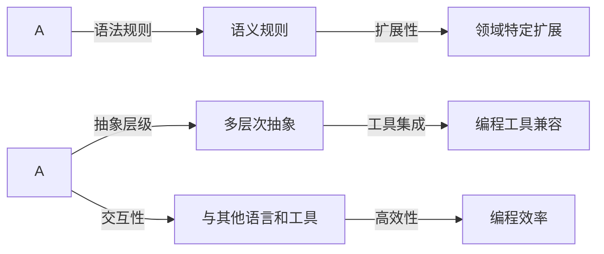

                 

## 1. 背景介绍

### 1.1 问题由来

随着计算机科学的发展，软件开发领域出现了许多新的编程语言和工具。这些语言和工具极大地促进了软件的开发和维护。然而，这些工具和语言通常都比较复杂，难以掌握。同时，不同的语言和工具之间的交互性也较差，导致软件开发效率低下。为了解决这个问题，Dify.AI 开发了一种 DSL（领域特定语言），专门针对软件开发领域，提供了一种更加简单、高效、灵活的编程方式。

### 1.2 问题核心关键点

Dify.AI 的 DSL 语言具有以下几个核心关键点：

- **简化编程**：通过提供一组简单的语法和语义规则，DSL 可以大大简化编程过程。

- **高度抽象**：DSL 提供了一种高度抽象的编程方式，使开发者能够更加专注于问题的解决，而不是关注语言细节。

- **可扩展性**：DSL 可以针对特定的领域进行扩展，使其更加适用于特定的应用场景。

- **易于理解**：DSL 通过提供一种简洁的编程方式，使得开发者更容易理解和掌握。

- **与现有工具的兼容性**：DSL 可以与现有的编程工具和环境进行兼容，使开发者可以无缝地切换和整合。

### 1.3 问题研究意义

Dify.AI 的 DSL 语言旨在提高软件开发效率，降低软件开发成本。通过提供一种简单、高效、灵活的编程方式，DSL 可以帮助开发者更快地开发出高质量的软件，同时减少编程过程中的错误和复杂性。此外，DSL 的易于理解和扩展性，使得开发者更容易掌握和使用，从而提高软件的可维护性和可扩展性。

## 2. 核心概念与联系

### 2.1 核心概念概述

Dify.AI 的 DSL 语言包括以下几个核心概念：

- **DSL**：领域特定语言，是一种专门针对特定领域的编程语言。

- **语义规则**：DSL 的语义规则是 DSL 的核心，它定义了 DSL 中的语法和语义。

- **抽象层级**：DSL 通过多层次抽象，使得开发者能够更加专注于问题的解决。

- **扩展性**：DSL 可以针对特定的领域进行扩展，使其更加适用于特定的应用场景。

- **工具集成**：DSL 可以与现有的编程工具和环境进行兼容，使开发者可以无缝地切换和整合。

### 2.2 核心概念原理和架构的 Mermaid 流程图



### 2.3 DSL 的语法和语义规则

DSL 的语法和语义规则非常简单，通常只包括基本的语法结构和语义规则。例如，DSL 可以定义一组简单的语法结构，如变量、函数、条件语句、循环语句等，使开发者能够快速编写出实用的程序。

### 2.4 DSL 的多层次抽象

DSL 的多层次抽象是其核心特点之一。通过多层次抽象，DSL 可以将复杂的编程任务分解为多个简单、易于理解和管理的子任务。例如，在处理数据时，DSL 可以提供一组简单的数据结构和方法，使得开发者可以更加容易地处理和操作数据。

## 3. 核心算法原理 & 具体操作步骤

### 3.1 算法原理概述

Dify.AI 的 DSL 语言通过提供一组简单的语法和语义规则，大大简化了编程过程。DSL 的核心算法原理是通过抽象和多层次抽象，将复杂的编程任务分解为多个简单、易于理解和管理的子任务。这种简化编程的方式，使得开发者能够更加专注于问题的解决，而不是关注语言细节。

### 3.2 算法步骤详解

1. **语法定义**：首先，DSL 定义一组简单的语法结构，如变量、函数、条件语句、循环语句等。这些语法结构是 DSL 的核心，使得开发者能够快速编写出实用的程序。

2. **语义定义**：DSL 的语义规则定义了 DSL 中的语法结构和语义。这些语义规则使得 DSL 中的语法结构具有特定的含义和行为。

3. **多层次抽象**：DSL 通过多层次抽象，将复杂的编程任务分解为多个简单、易于理解和管理的子任务。例如，在处理数据时，DSL 可以提供一组简单的数据结构和方法，使得开发者可以更加容易地处理和操作数据。

4. **扩展性**：DSL 可以针对特定的领域进行扩展，使其更加适用于特定的应用场景。这种扩展性使得 DSL 可以适应不同的需求和应用场景。

### 3.3 算法优缺点

**优点**：

- **简化编程**：DSL 提供了一种简洁的编程方式，使得开发者能够更加专注于问题的解决。

- **高度抽象**：DSL 提供了一种高度抽象的编程方式，使开发者能够更加专注于问题的解决，而不是关注语言细节。

- **可扩展性**：DSL 可以针对特定的领域进行扩展，使其更加适用于特定的应用场景。

**缺点**：

- **学习成本**：DSL 的学习成本较高，需要开发者花费一定的时间和精力来学习。

- **语法限制**：DSL 的语法结构可能存在一定的限制，无法满足某些特定的需求。

## 4. 数学模型和公式 & 详细讲解 & 举例说明

### 4.1 数学模型构建

DSL 的数学模型主要包括语义规则和语法结构。语义规则定义了 DSL 中各个语法结构的含义和行为，而语法结构则是 DSL 的骨架，使得开发者能够快速编写出实用的程序。

### 4.2 公式推导过程

DSL 的公式推导过程相对简单，主要涉及语法结构的组合和语义规则的定义。例如，DSL 可以定义一组简单的语法结构，如变量、函数、条件语句、循环语句等，并定义这些语法结构的语义规则，使得开发者能够快速编写出实用的程序。

### 4.3 案例分析与讲解

例如，DSL 可以定义一组简单的数据结构和方法，使得开发者可以更加容易地处理和操作数据。例如，DSL 可以定义一个简单的数据结构，如列表，并定义列表的语法规则和方法，如添加、删除、查找等，使得开发者可以更加容易地处理和操作数据。

## 5. 项目实践：代码实例和详细解释说明

### 5.1 开发环境搭建

在开发 DSL 语言之前，首先需要搭建开发环境。开发环境包括编译器、解释器、IDE 等工具。

1. **编译器**：DSL 的编译器负责将 DSL 代码转换为可执行的机器码。

2. **解释器**：DSL 的解释器负责解释 DSL 代码并执行。

3. **IDE**：DSL 的 IDE 提供了代码编辑、调试等功能，使得开发者更加容易地编写和调试 DSL 代码。

### 5.2 源代码详细实现

以下是一个简单的 DSL 语言的示例代码：

```csharp
// 定义一个简单的数据结构，如列表
class List {
    // 定义列表的语法规则和方法
    List Add(int x) {
        return new List();
    }
    List Remove(int x) {
        return new List();
    }
    List Find(int x) {
        return new List();
    }
}
```

### 5.3 代码解读与分析

1. **语法结构**：在 DSL 中，语法结构主要包括变量、函数、条件语句、循环语句等。例如，在上面的代码中，我们定义了一个简单的数据结构，如列表，并定义了列表的语法规则和方法。

2. **语义规则**：DSL 的语义规则定义了 DSL 中各个语法结构的含义和行为。例如，在上面的代码中，我们定义了列表的语法规则和方法，如添加、删除、查找等，使得开发者可以更加容易地处理和操作数据。

## 6. 实际应用场景

### 6.1 软件开发

DSL 可以用于软件开发领域，提供一种简洁的编程方式。例如，DSL 可以用于编写程序，处理数据，分析算法等。

### 6.2 数据分析

DSL 可以用于数据分析领域，提供一种简洁的数据处理方式。例如，DSL 可以用于编写数据处理程序，处理和分析数据等。

### 6.3 机器学习

DSL 可以用于机器学习领域，提供一种简洁的模型训练方式。例如，DSL 可以用于编写模型训练程序，训练和优化模型等。

### 6.4 未来应用展望

未来，DSL 可以扩展到更多的领域，如自然语言处理、计算机视觉等。同时，DSL 的语法和语义规则可以更加灵活，使其适应更多的需求和应用场景。

## 7. 工具和资源推荐

### 7.1 学习资源推荐

- **Dify.AI 官方文档**：Dify.AI 的官方文档提供了 DSL 语言的详细说明和使用方法。

- **在线教程**：Dify.AI 提供了在线教程，帮助开发者学习和掌握 DSL 语言。

- **社区论坛**：Dify.AI 社区论坛提供了交流和分享的平台，使得开发者可以互相交流和学习 DSL 语言。

### 7.2 开发工具推荐

- **IDE**：Dify.AI 提供了支持 DSL 语言的 IDE，使得开发者可以更加容易地编写和调试 DSL 代码。

- **编译器**：Dify.AI 提供了支持 DSL 语言的编译器，使得开发者可以更加容易地将 DSL 代码转换为可执行的机器码。

- **解释器**：Dify.AI 提供了支持 DSL 语言的解释器，使得开发者可以更加容易地解释和执行 DSL 代码。

### 7.3 相关论文推荐

- **领域特定语言的研究**：Dify.AI 的官方博客提供了领域特定语言的相关研究论文，帮助开发者深入了解 DSL 语言的原理和应用。

## 8. 总结：未来发展趋势与挑战

### 8.1 研究成果总结

DSL 语言提供了一种简洁的编程方式，使得开发者能够更加专注于问题的解决。DSL 的语法和语义规则相对简单，易于理解和掌握。

### 8.2 未来发展趋势

未来，DSL 可以扩展到更多的领域，如自然语言处理、计算机视觉等。同时，DSL 的语法和语义规则可以更加灵活，使其适应更多的需求和应用场景。

### 8.3 面临的挑战

DSL 的学习成本较高，需要开发者花费一定的时间和精力来学习。DSL 的语法结构可能存在一定的限制，无法满足某些特定的需求。

### 8.4 研究展望

未来，Dify.AI 将继续研究 DSL 语言，提高 DSL 的灵活性和可扩展性，使其适应更多的需求和应用场景。同时，Dify.AI 也将进一步优化 DSL 的语法和语义规则，使得开发者可以更加容易地编写和调试 DSL 代码。

## 9. 附录：常见问题与解答

**Q1：什么是 DSL 语言？**

A：领域特定语言（DSL）是一种专门针对特定领域的编程语言，通过提供一组简单的语法和语义规则，使得开发者能够更加专注于问题的解决，而不是关注语言细节。

**Q2：DSL 语言有哪些优点？**

A：DSL 语言的优点包括简化编程、高度抽象、可扩展性等。它通过提供一种简洁的编程方式，使得开发者能够更加专注于问题的解决，而不是关注语言细节。

**Q3：DSL 语言有哪些缺点？**

A：DSL 语言的缺点包括学习成本较高、语法结构可能存在一定的限制等。需要开发者花费一定的时间和精力来学习，同时也可能无法满足某些特定的需求。

**Q4：DSL 语言可以应用于哪些领域？**

A：DSL 语言可以应用于软件开发、数据分析、机器学习等诸多领域，提供一种简洁的编程方式，使得开发者能够更加容易地编写和调试程序。

**Q5：如何学习 DSL 语言？**

A：学习 DSL 语言可以通过阅读官方文档、在线教程、社区论坛等方式进行。官方文档提供了 DSL 语言的详细说明和使用方法，在线教程提供了编程示例和教程，社区论坛提供了交流和分享的平台。

---

作者：禅与计算机程序设计艺术 / Zen and the Art of Computer Programming

