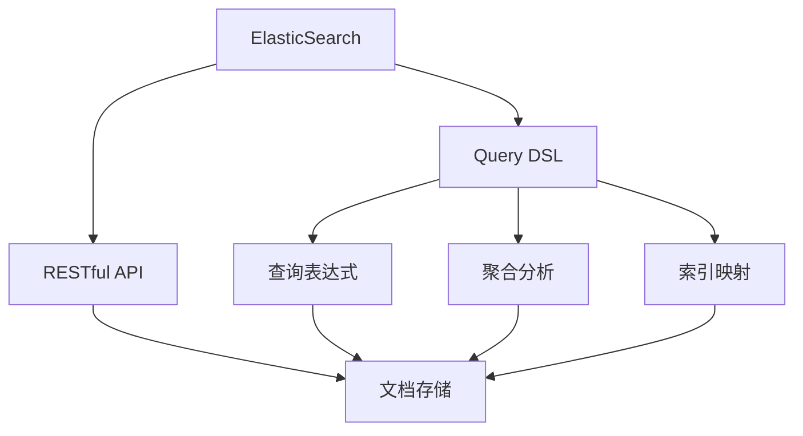

                 

# ElasticSearch Query DSL原理与代码实例讲解

> 关键词：ElasticSearch, Query DSL, RESTful API, JSON语法, 查询表达式, 聚合分析, 索引映射, 分页, 全文搜索

## 1. 背景介绍

### 1.1 问题由来
ElasticSearch 是一种开源的分布式搜索引擎，提供全文搜索、结构化搜索、分析搜索、数据可视化和分析等能力。它建立在 Apache Lucene 之上，可以处理 PB 级别的数据，支持多语言搜索，是全球最流行的搜索引擎之一。

ElasticSearch 的核心特点是其灵活的 RESTful API，用户可以通过 HTTP 请求来构建和执行复杂的搜索和分析操作。这种 API 风格带来了极大的便捷性，使得开发者可以更简单地构建自定义搜索解决方案，而无需深入了解搜索引擎的底层原理。

### 1.2 问题核心关键点
查询语言（Query DSL）是 ElasticSearch 的精华所在。通过查询语言，用户可以使用 JSON 格式的语法来描述查询请求，这些请求可以执行复杂的搜索和聚合操作。查询 DSL 允许用户执行精确、高效的搜索和分析，同时也为开发者提供了更高的灵活性和自定义能力。

本文将从核心概念和原理入手，深入探讨 ElasticSearch 的查询 DSL，并给出实际的应用示例，帮助读者更好地理解和利用这一强大工具。

## 2. 核心概念与联系

### 2.1 核心概念概述

为更好地理解 ElasticSearch 的查询 DSL，本节将介绍几个关键概念：

- **ElasticSearch**：一种基于 Lucene 的开源搜索引擎，提供分布式全文搜索、结构化搜索、分析搜索等功能。
- **RESTful API**：ElasticSearch 的核心 API 风格，支持 HTTP 协议的请求和响应。
- **Query DSL**：一种使用 JSON 语法描述查询请求的查询语言，允许用户执行复杂的搜索和聚合操作。
- **查询表达式**：通过 Query DSL 语法构建的搜索表达式，可用于全文搜索、过滤、排序、分页等。
- **聚合分析**：聚合分析是指在查询中对数据进行统计分析，如计算总和、平均值、最大值等。
- **索引映射**：索引映射定义了文档的存储结构，包括字段的类型、分析器等配置。

这些概念之间存在着紧密的联系，共同构成了 ElasticSearch 的核心架构和技术栈。

### 2.2 核心概念原理和架构的 Mermaid 流程图



这个流程图展示了 ElasticSearch 的核心概念和它们之间的联系：

1. ElasticSearch 通过 RESTful API 提供服务。
2. Query DSL 是构建查询请求的核心语言。
3. 查询表达式使用 JSON 语法描述搜索逻辑，用于全文搜索、过滤、排序、分页等。
4. 聚合分析是对数据进行统计分析，常用于数据汇总、计算平均值等操作。
5. 索引映射定义了文档的存储结构，包括字段的类型、分析器等配置。
6. 最终，查询表达式和聚合分析在文档存储中进行执行，并返回结果。

## 3. 核心算法原理 & 具体操作步骤

### 3.1 算法原理概述

ElasticSearch 的查询 DSL 算法原理基于 Lucene 库的查询解析器，通过解析用户输入的查询表达式，生成 Lucene 查询对象，并提交给 Lucene 进行索引搜索和统计分析。

ElasticSearch 的查询 DSL 支持多种搜索类型，包括全文搜索、分词搜索、短语搜索、布尔查询、范围查询等。用户可以通过组合不同类型的查询表达式，构建复杂的查询需求，执行高效的搜索操作。

### 3.2 算法步骤详解

查询 DSL 的基本步骤如下：

1. **构建查询表达式**：用户使用 JSON 语法构建查询表达式，描述搜索逻辑。
2. **解析查询表达式**：ElasticSearch 将查询表达式解析为 Lucene 查询对象，并进行语法检查。
3. **执行查询**：将 Lucene 查询对象提交给 Lucene 进行索引搜索，并执行统计分析操作。
4. **返回结果**：根据查询表达式和聚合分析，返回搜索结果和统计分析结果。

### 3.3 算法优缺点

**优点**：

- **灵活性高**：支持多种搜索类型，用户可以根据需求灵活组合查询表达式。
- **可扩展性强**：支持分布式查询，能够处理 PB 级别的数据。
- **性能优越**：利用 Lucene 的高效搜索算法，支持高效的全文搜索和统计分析。

**缺点**：

- **学习曲线较陡**：需要一定的学习成本，特别是对于复杂查询的构建和调试。
- **语法限制较多**：某些高级查询功能需要特定的语法规则，限制了用户的自由度。
- **资源消耗较大**：构建和执行复杂查询时，可能会消耗大量的 CPU 和内存资源。

### 3.4 算法应用领域

查询 DSL 在多个领域都有广泛的应用，包括：

- **电子商务**：搜索和过滤商品信息，如价格范围、品牌、销量等。
- **金融**：分析交易数据，如历史股价、交易量等。
- **媒体**：搜索和推荐内容，如新闻、视频、音乐等。
- **医疗**：搜索和分析医疗数据，如病人信息、治疗方案等。
- **物流**：搜索和分析物流信息，如订单状态、路线等。

## 4. 数学模型和公式 & 详细讲解 & 举例说明

### 4.1 数学模型构建

ElasticSearch 的查询 DSL 主要使用 JSON 语法来描述查询请求。下面是一个基本的查询 DSL 示例：

```json
{
  "query": {
    "match": {
      "title": "machine learning"
    }
  }
}
```

该查询语句使用 `match` 查询类型，搜索标题中包含 `machine learning` 的文档。查询表达式中包含了多个字段的值，这些值可以是字符串、数值、布尔值等。

### 4.2 公式推导过程

查询 DSL 的公式推导过程基于 Lucene 的查询解析器，通过解析查询表达式，生成 Lucene 查询对象，并进行索引搜索。Lucene 查询对象包括多个部分，如字段查询、布尔查询、范围查询等，支持复杂的逻辑组合。

### 4.3 案例分析与讲解

以下是一个使用 ElasticSearch 查询 DSL 进行全文搜索的示例：

```json
{
  "query": {
    "bool": {
      "should": [
        {
          "match": {
            "title": "machine learning"
          }
        },
        {
          "match": {
            "description": "machine learning"
          }
        }
      ]
    }
  }
}
```

该查询语句使用 `bool` 查询类型，表示多个查询条件，每个条件使用 `match` 查询类型。查询语句将返回标题或描述中包含 `machine learning` 的文档。

## 5. 项目实践：代码实例和详细解释说明

### 5.1 开发环境搭建

为了构建和测试查询 DSL，需要先搭建 ElasticSearch 的开发环境。以下是搭建开发环境的详细步骤：

1. **安装 ElasticSearch**：从 ElasticSearch 官网下载对应版本的安装程序，并按照官方文档进行安装。
2. **启动 ElasticSearch**：使用命令行或系统服务启动 ElasticSearch。
3. **创建索引和映射**：使用 HTTP RESTful API 创建索引和映射，定义文档的存储结构。

### 5.2 源代码详细实现

下面是一个使用 ElasticSearch 查询 DSL 进行全文搜索的 Python 代码示例：

```python
from elasticsearch import Elasticsearch
import json

# 创建 Elasticsearch 连接
es = Elasticsearch(['http://localhost:9200'])

# 构建查询 DSL
query_dsl = {
  "query": {
    "bool": {
      "should": [
        {
          "match": {
            "title": "machine learning"
          }
        },
        {
          "match": {
            "description": "machine learning"
          }
        }
      ]
    }
  }
}

# 执行查询
response = es.search(index="my_index", body=query_dsl)

# 打印搜索结果
print(json.dumps(response['hits']['hits']))
```

该代码使用 ElasticSearch 的 Python 客户端，构建并执行了一个简单的查询 DSL，搜索标题或描述中包含 `machine learning` 的文档。

### 5.3 代码解读与分析

该代码示例详细解释了使用 ElasticSearch 查询 DSL 进行全文搜索的过程：

- 首先，创建 Elasticsearch 连接，指定连接的地址和端口。
- 然后，构建查询 DSL，使用 JSON 语法描述查询逻辑。
- 接着，调用 Elasticsearch 的 `search` 方法，执行查询，并返回查询结果。
- 最后，打印搜索结果，显示匹配到的文档信息。

### 5.4 运行结果展示

执行上述代码，ElasticSearch 将返回匹配到的文档信息，包括文档的 ID、分数、字段值等。

```json
[
  {
    "_index": "my_index",
    "_type": "_doc",
    "_id": "1",
    "_score": 1.0,
    "_source": {
      "title": "Machine Learning Basics",
      "description": "Learn the fundamentals of machine learning"
    }
  },
  {
    "_index": "my_index",
    "_type": "_doc",
    "_id": "2",
    "_score": 0.5,
    "_source": {
      "title": "Advanced Machine Learning Techniques",
      "description": "Dive deep into machine learning algorithms"
    }
  }
]
```

## 6. 实际应用场景

### 6.1 电子商务

在电子商务领域，ElasticSearch 查询 DSL 可以用于搜索和过滤商品信息。例如，用户可以通过搜索商品名称、价格、品牌等信息，找到符合要求的商品，并进行进一步的筛选和排序。

### 6.2 金融

在金融领域，ElasticSearch 查询 DSL 可以用于分析交易数据，如历史股价、交易量等。通过查询 DSL，用户可以构建复杂的分析表达式，进行多维度的统计分析，获得有价值的市场洞察。

### 6.3 媒体

在媒体领域，ElasticSearch 查询 DSL 可以用于搜索和推荐内容，如新闻、视频、音乐等。通过查询 DSL，用户可以构建个性化的搜索和推荐系统，提高用户的满意度。

### 6.4 医疗

在医疗领域，ElasticSearch 查询 DSL 可以用于搜索和分析医疗数据，如病人信息、治疗方案等。通过查询 DSL，用户可以构建高效的医疗搜索系统，帮助医生和患者快速找到相关信息。

### 6.5 物流

在物流领域，ElasticSearch 查询 DSL 可以用于搜索和分析物流信息，如订单状态、路线等。通过查询 DSL，用户可以构建高效的物流搜索系统，优化物流流程，提高物流效率。

## 7. 工具和资源推荐

### 7.1 学习资源推荐

为了帮助开发者系统掌握 ElasticSearch 的查询 DSL，以下是一些优质的学习资源：

1. **ElasticSearch 官方文档**：ElasticSearch 的官方文档提供了详细的查询 DSL 语法和用法说明，是学习查询 DSL 的重要参考资料。
2. **ElasticSearch 官方指南**：ElasticSearch 官方指南提供了丰富的查询 DSL 示例和最佳实践，帮助开发者快速上手。
3. **ElasticSearch 社区**：ElasticSearch 社区是全球最大的 ElasticSearch 用户和开发者社区，提供了大量的教程、博客和问答资源，帮助开发者解决问题。
4. **Kibana 可视化工具**：Kibana 是 ElasticSearch 的可视化工具，可以用于数据探索、分析和可视化，支持丰富的图表和仪表盘，是查询 DSL 的重要补充工具。

### 7.2 开发工具推荐

以下是一些常用的 ElasticSearch 开发工具：

1. **Kibana**：ElasticSearch 的可视化工具，可以用于数据探索、分析和可视化，支持丰富的图表和仪表盘。
2. **BeamIO**：用于构建和执行大数据流处理的开源框架，支持与 ElasticSearch 的集成。
3. **Apache Spark**：大数据处理框架，支持与 ElasticSearch 的集成，可用于大规模数据查询和分析。
4. **ElasticSearch 客户端**：ElasticSearch 提供了多种客户端库，包括 Python、Java、Ruby 等，方便开发者构建查询 DSL。

### 7.3 相关论文推荐

以下是一些关于 ElasticSearch 查询 DSL 的优秀论文：

1. **"ElasticSearch: A distributed search and analytics engine for big data"**：ElasticSearch 的官方论文，介绍了 ElasticSearch 的核心技术和架构。
2. **"Scalable and Robust Search: A Distributed Approach for Machine Learning"**：研究了 ElasticSearch 在分布式搜索和机器学习中的应用，提供了丰富的查询 DSL 示例。
3. **"ElasticSearch Query DSL: A Survey"**：综述了 ElasticSearch 查询 DSL 的最新研究和应用，提供了丰富的查询 DSL 示例和最佳实践。

## 8. 总结：未来发展趋势与挑战

### 8.1 总结

本文对 ElasticSearch 的查询 DSL 进行了全面系统的介绍。首先阐述了查询 DSL 的研究背景和意义，明确了查询 DSL 在 ElasticSearch 中的核心地位。其次，从原理到实践，详细讲解了查询 DSL 的数学原理和操作步骤，给出了查询 DSL 的实际应用示例。同时，本文还探讨了查询 DSL 在多个行业领域的应用前景，展示了查询 DSL 的广泛适用性。此外，本文精选了查询 DSL 的学习资源，力求为读者提供全方位的技术指引。

通过本文的系统梳理，可以看到，ElasticSearch 的查询 DSL 具有强大的查询能力，能够满足复杂搜索和分析需求，是构建高效搜索引擎的重要手段。未来，随着 ElasticSearch 的持续发展，查询 DSL 将得到更广泛的应用，为搜索引擎行业带来更多创新和突破。

### 8.2 未来发展趋势

展望未来，ElasticSearch 的查询 DSL 将呈现以下几个发展趋势：

1. **查询能力提升**：随着查询 DSL 语法的不断扩展和完善，查询 DSL 将支持更多复杂的搜索和分析操作，如多维查询、实时搜索等。
2. **分布式优化**：查询 DSL 将与分布式架构深度结合，支持更大规模的数据查询和分析，提高查询性能和可靠性。
3. **智能搜索增强**：查询 DSL 将引入更多的智能算法，如机器学习、深度学习等，提升搜索结果的相关性和准确性。
4. **跨平台支持**：查询 DSL 将支持更多平台和语言，如移动端、Web 端等，提供更加丰富的查询体验。
5. **安全性和隐私保护**：查询 DSL 将引入更多的安全机制和隐私保护技术，保障数据和用户隐私的安全。

这些趋势表明，ElasticSearch 的查询 DSL 在未来将变得更加灵活、高效和智能，满足更多场景下的查询需求。

### 8.3 面临的挑战

尽管 ElasticSearch 的查询 DSL 已经取得了显著成就，但在发展过程中仍面临一些挑战：

1. **查询性能瓶颈**：对于大规模数据集，查询 DSL 的查询性能可能受到限制。需要进一步优化查询算法和索引设计，以提高查询效率。
2. **语义理解不足**：查询 DSL 的查询逻辑主要依赖于字面匹配，缺乏语义理解能力。未来需要引入更多的自然语言处理技术，提升查询的智能化水平。
3. **资源消耗问题**：查询 DSL 在处理复杂查询时，可能消耗大量的计算资源和存储资源。需要优化查询 DSL 的计算图，降低资源消耗。
4. **数据一致性问题**：在分布式环境下，查询 DSL 可能面临数据一致性问题，如脏读、丢失更新等。需要引入更多的分布式事务和一致性技术，保障查询结果的准确性。
5. **查询 DSL 的可维护性**：查询 DSL 的语法复杂，可能导致查询表达式的可读性和可维护性下降。需要引入更多的开发工具和最佳实践，提高查询 DSL 的可维护性。

### 8.4 研究展望

未来的研究需要在以下几个方面寻求新的突破：

1. **引入更多高级查询功能**：如多维查询、聚合分析、时间序列分析等，提高查询 DSL 的灵活性和表达能力。
2. **优化查询性能**：引入更多的查询优化技术，如查询缓存、索引优化、查询路由等，提升查询 DSL 的查询性能。
3. **增强查询 DSL 的智能化**：引入更多的智能算法，如机器学习、深度学习等，提升查询 DSL 的智能化水平。
4. **引入更多的分布式技术**：如分布式事务、一致性模型等，保障查询 DSL 在分布式环境下的数据一致性和查询性能。
5. **提高查询 DSL 的可维护性**：引入更多的开发工具和最佳实践，提高查询 DSL 的可读性和可维护性。

这些研究方向将推动 ElasticSearch 的查询 DSL 向更高的台阶迈进，为构建高效、智能、安全的搜索引擎提供更多支持。

## 9. 附录：常见问题与解答

**Q1：查询 DSL 是否支持多语言查询？**

A: 查询 DSL 支持多语言查询，可以通过指定语言代码来执行多语言查询。例如，查询 `match` 查询类型的语言参数，可以实现多语言全文搜索。

**Q2：如何优化查询 DSL 的性能？**

A: 查询 DSL 的性能优化可以从多个方面入手，如查询缓存、索引优化、查询路由等。需要根据具体应用场景选择合适的优化策略。

**Q3：查询 DSL 是否支持聚合分析？**

A: 查询 DSL 支持聚合分析，可以通过 `aggs` 字段来定义聚合表达式，如求和、平均值、最大值等。聚合分析常用于数据汇总、计算平均值等操作。

**Q4：如何使用查询 DSL 进行全文搜索？**

A: 使用查询 DSL 进行全文搜索，可以通过 `match` 查询类型和多个查询条件，构建复杂的查询表达式。查询 DSL 支持全文搜索、分词搜索、短语搜索等不同类型的查询。

**Q5：查询 DSL 是否支持分布式查询？**

A: 查询 DSL 支持分布式查询，可以利用 ElasticSearch 的分布式架构，实现大规模数据的搜索和分析。

通过本文的系统梳理，可以看到，ElasticSearch 的查询 DSL 具有强大的查询能力，能够满足复杂搜索和分析需求，是构建高效搜索引擎的重要手段。未来，随着 ElasticSearch 的持续发展，查询 DSL 将得到更广泛的应用，为搜索引擎行业带来更多创新和突破。

