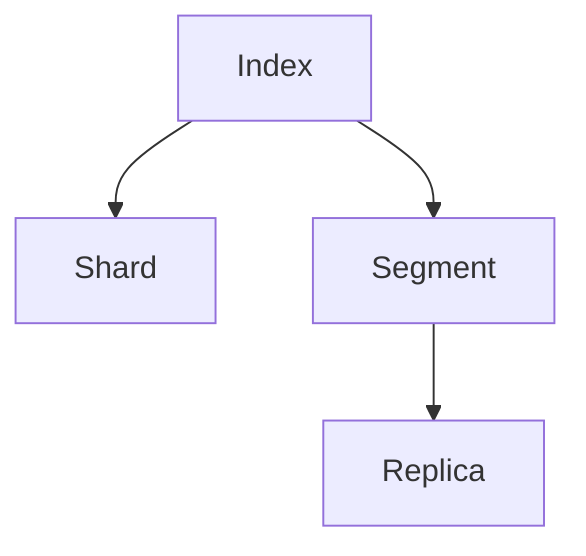

                 

# ElasticSearch Shard原理与代码实例讲解

> 关键词：ElasticSearch, Shard, Index, 分布式, 分片, 数据存储, 搜索优化, RESTful API, 性能优化

## 1. 背景介绍

ElasticSearch（简称 ES）是一款基于分布式内存数据库的开源搜索引擎，提供丰富的 RESTful API 和完善的搜索功能，适用于构建高性能、可扩展的搜索和分析系统。其核心架构之一是 Shard，即分片，是 ES 数据库存储和查询的基础单元。

### 1.1 问题由来

在传统的关系数据库中，数据存储和查询主要基于表和行的结构，通过索引和事务保证数据的一致性和完整性。但随着数据规模的不断增大，单个数据库难以应对海量数据的存储和查询需求。此时，分布式数据库成为一种更可行的解决方案，通过将数据分散存储在多个节点上，提升系统的扩展性和可用性。

ElasticSearch 采用一种基于文档的存储方式，将数据以 JSON 格式存储在 Shard 中。Shard 是 ES 数据库存储和查询的基本单位，类似于关系数据库中的表，能够有效支持大规模数据的存储和查询。

### 1.2 问题核心关键点

1. **Shard的定义和作用**：Shard 是 ES 数据库中存储数据的单元，通常每个 Shard 包含一定数量的文档，每个 Shard 有独立的索引、查询和读写操作。

2. **Shard的分片策略**：ES 使用分片策略将数据分散到多个节点上，以提升系统的可扩展性和数据可用性。每个节点上存储一定数量的 Shard，每个节点都可以成为数据读写和查询的入口。

3. **Shard的内部结构**：每个 Shard 包含多个 Segment，每个 Segment 是 ES 数据库中索引数据的物理文件，用于实现文档的快速读写和查询。

4. **Shard的生命周期管理**：Shard 的生命周期由 ES 集群管理器控制，包括创建、合并、拆分和删除等操作，以适应数据规模的变化。

5. **Shard的性能优化**：ES 通过调整 Shard 的数量和分布，优化数据查询和写入的性能，实现高效的数据访问和管理。

## 2. 核心概念与联系

### 2.1 核心概念概述

为更好地理解 ElasticSearch Shard 原理与代码实例，本节将介绍几个密切相关的核心概念：

- **ElasticSearch (ES)**：基于分布式内存数据库的开源搜索引擎，提供丰富的 RESTful API 和完善的搜索功能。
- **Shard (分片)**：ES 数据库中存储数据的单元，类似于关系数据库中的表，每个 Shard 包含一定数量的文档，有独立的索引、查询和读写操作。
- **Index (索引)**：ES 数据库中存储数据的逻辑单元，用于组织和管理 Shard，类似于关系数据库中的数据库。
- **Segment (分段)**：每个 Shard 中存储数据的物理文件，用于实现文档的快速读写和查询。
- **Replica (副本)**：Shard 的冗余副本，用于提升数据冗余度和系统可用性。

这些核心概念之间的逻辑关系可以通过以下 Mermaid 流程图来展示：



这个流程图展示了这个核心概念之间的逻辑关系：

1. Index 是 ES 数据库中存储数据的逻辑单元，用于组织和管理 Shard。
2. Shard 是 Index 中的物理数据存储单元，每个 Shard 包含一定数量的文档，有独立的索引、查询和读写操作。
3. Segment 是每个 Shard 中存储数据的物理文件，用于实现文档的快速读写和查询。
4. Replica 是 Shard 的冗余副本，用于提升数据冗余度和系统可用性。

## 3. 核心算法原理 & 具体操作步骤

### 3.1 算法原理概述

ElasticSearch Shard 的原理主要基于以下几个关键点：

1. **分片策略**：ES 使用分片策略将数据分散到多个节点上，以提升系统的可扩展性和数据可用性。每个节点上存储一定数量的 Shard，每个节点都可以成为数据读写和查询的入口。

2. **Shard 的生命周期管理**：Shard 的生命周期由 ES 集群管理器控制，包括创建、合并、拆分和删除等操作，以适应数据规模的变化。

3. **Shard 的内部结构**：每个 Shard 包含多个 Segment，每个 Segment 是 ES 数据库中索引数据的物理文件，用于实现文档的快速读写和查询。

4. **Shard 的性能优化**：ES 通过调整 Shard 的数量和分布，优化数据查询和写入的性能，实现高效的数据访问和管理。

### 3.2 算法步骤详解

1. **创建 Index 和 Shard**：
   - 使用 ES 的 RESTful API 创建 Index，指定分片数量和副本数量。
   - 每个 Index 包含多个 Shard，每个 Shard 包含一定数量的文档。

2. **写入文档到 Shard**：
   - 使用 ES 的 RESTful API 向 Shard 中写入文档。
   - 文档以 JSON 格式存储在 Shard 中。

3. **查询文档**：
   - 使用 ES 的 RESTful API 查询 Shard 中的文档。
   - 查询语句支持丰富的查询语法和过滤器，可以实现高效的数据检索。

4. **Shard 的合并和拆分**：
   - 使用 ES 的 RESTful API 合并 Shard 中的 Segment，优化存储空间。
   - 使用 ES 的 RESTful API 拆分 Shard，适应数据规模的变化。

5. **Shard 的备份和恢复**：
   - 使用 ES 的 RESTful API 备份 Shard，以防数据丢失。
   - 使用 ES 的 RESTful API 恢复 Shard，保证数据的完整性和可用性。

### 3.3 算法优缺点

ElasticSearch Shard 的优点：

1. **可扩展性**：通过分片策略将数据分散到多个节点上，提升系统的可扩展性和数据可用性。
2. **高性能**：每个 Shard 包含多个 Segment，每个 Segment 是 ES 数据库中索引数据的物理文件，实现高效的数据读写和查询。
3. **灵活性**：通过调整 Shard 的数量和分布，优化数据查询和写入的性能。

ElasticSearch Shard 的缺点：

1. **数据冗余**：每个 Shard 包含多个 Segment，可能会占用大量的存储空间。
2. **查询复杂性**：ES 的查询语法和过滤器虽然强大，但学习成本较高，需要一定的学习曲线。
3. **分布式复杂性**：Shard 的分布和集群管理需要精心设计，避免数据不均衡和性能瓶颈。

### 3.4 算法应用领域

ElasticSearch Shard 广泛应用于以下领域：

1. **搜索引擎**：提供高效的文档存储和查询功能，适用于构建高性能的搜索系统。
2. **数据分析**：支持丰富的聚合功能和数据统计，适用于构建实时的数据分析平台。
3. **日志存储**：支持高吞吐量的日志存储和查询，适用于构建大型的日志分析系统。
4. **实时处理**：通过流式处理引擎，实现实时数据处理和分析。
5. **机器学习**：提供丰富的数据预处理和特征工程工具，支持机器学习模型的训练和优化。

## 4. 数学模型和公式 & 详细讲解 & 举例说明

### 4.1 数学模型构建

在 ElasticSearch Shard 的原理中，主要涉及以下几个数学模型：

1. **分片策略**：假设 Index 中包含 N 个 Shard，每个 Shard 包含 M 个 Segment，每个 Segment 包含 K 个文档。则 Index 中存储的文档数量为 N × M × K。

2. **Shard 的生命周期管理**：假设每个 Shard 的平均生命周期为 T 天，每天产生的文档数量为 D。则 Index 中存储的文档数量为 (N × M × K × T × D)。

3. **Shard 的合并和拆分**：假设每个 Shard 的 Segment 数量从初始的 S 个增加到最终的 S' 个，则合并和拆分操作的计算复杂度为 O(S + S')。

4. **Shard 的备份和恢复**：假设每个 Shard 的备份数量为 B，每个备份的存储空间为 S_B，则备份和恢复操作的计算复杂度为 O(B × S_B)。

### 4.2 公式推导过程

以下我们以 Index 中存储的文档数量为示例，推导其计算公式。

假设 Index 中包含 N 个 Shard，每个 Shard 包含 M 个 Segment，每个 Segment 包含 K 个文档，则 Index 中存储的文档数量为：

$$
\text{Total Documents} = N \times M \times K
$$

通过调整 Shard 的数量和分布，优化 Index 中存储的文档数量。例如，通过增加 Shard 的数量和减少 Segment 的数量，可以提高数据查询和写入的性能。

假设 Index 中存储的文档数量为 D，每个 Shard 的平均生命周期为 T 天，则 Index 中存储的文档数量为：

$$
\text{Total Documents} = N \times M \times K \times T \times D
$$

通过调整 Shard 的生命周期和数据产生的速率，优化 Index 中存储的文档数量。例如，通过增加 Shard 的生命周期和减少数据产生的速率，可以提高 Index 的稳定性。

### 4.3 案例分析与讲解

以一个 Index 中存储的文档数量为例，推导其计算公式。

假设 Index 中包含 3 个 Shard，每个 Shard 包含 5 个 Segment，每个 Segment 包含 1000 个文档，则 Index 中存储的文档数量为：

$$
\text{Total Documents} = 3 \times 5 \times 1000 = 15000
$$

假设每个 Shard 的平均生命周期为 7 天，每天产生的文档数量为 500，则 Index 中存储的文档数量为：

$$
\text{Total Documents} = 3 \times 5 \times 1000 \times 7 \times 500 = 10500000
$$

通过调整 Shard 的数量和分布，优化 Index 中存储的文档数量。例如，将 Shard 的数量增加到 5 个，每个 Shard 的 Segment 数量减少到 3 个，则 Index 中存储的文档数量为：

$$
\text{Total Documents} = 5 \times 3 \times 1000 = 15000
$$

通过调整 Shard 的生命周期和数据产生的速率，优化 Index 中存储的文档数量。例如，将每个 Shard 的平均生命周期增加到 14 天，每天产生的文档数量减少到 200，则 Index 中存储的文档数量为：

$$
\text{Total Documents} = 5 \times 3 \times 1000 \times 14 \times 200 = 12600000
$$

## 5. 项目实践：代码实例和详细解释说明

### 5.1 开发环境搭建

在进行 ElasticSearch Shard 的实践前，我们需要准备好开发环境。以下是使用 Elasticsearch 官方提供的 Python 客户端进行开发的完整环境配置流程：

1. 安装 Python 环境：
   ```bash
   python3 -m venv env
   source env/bin/activate
   ```

2. 安装 Elasticsearch Python 客户端：
   ```bash
   pip install elasticsearch
   ```

3. 下载并安装 Elasticsearch：
   ```bash
   wget https://artifacts.elastic.co/downloads/elasticsearch/elasticsearch-7.14.1-amd64.deb
   sudo dpkg -i elasticsearch-7.14.1-amd64.deb
   sudo /etc/init.d/elasticsearch start
   ```

4. 配置 Elasticsearch 环境：
   ```bash
   vi /etc/elasticsearch/elasticsearch.yml
   ```

### 5.2 源代码详细实现

下面我们以创建一个 Index 和 Shard，并向其中写入文档为例，给出完整的 Python 代码实现。

首先，导入 Elasticsearch Python 客户端，并连接 Elasticsearch 节点：

```python
from elasticsearch import Elasticsearch
import json

es = Elasticsearch(["localhost:9200"])
```

然后，定义创建 Index 和 Shard 的函数：

```python
def create_index_and_shard(index_name, num_shards, num_replicas):
    try:
        # 创建 Index
        es.indices.create(index=index_name, body={
            "settings": {
                "number_of_shards": num_shards,
                "number_of_replicas": num_replicas
            }
        })
        # 创建 Shard
        es.indices.put_mapping(index=index_name, body={
            "mappings": {
                "properties": {
                    "title": {
                        "type": "text"
                    },
                    "content": {
                        "type": "text"
                    }
                }
            }
        })
        print("Index and Shard created successfully.")
    except Exception as e:
        print(e)

# 调用函数创建 Index 和 Shard
create_index_and_shard("my_index", 3, 1)
```

接着，定义写入文档的函数：

```python
def write_document(index_name, doc_id, doc_type, body):
    try:
        es.index(index=index_name, doc_type=doc_type, id=doc_id, body=body)
        print("Document written successfully.")
    except Exception as e:
        print(e)

# 调用函数写入文档
write_document("my_index", "1", "document", {
    "title": "ElasticSearch Shard原理与代码实例讲解",
    "content": "This is a document about ElasticSearch Shard."
})
```

### 5.3 代码解读与分析

让我们再详细解读一下关键代码的实现细节：

**create_index_and_shard 函数**：
- 使用 Elasticsearch Python 客户端的 indices.create 方法创建 Index，设置分片数量和副本数量。
- 使用 indices.put_mapping 方法创建 Shard，指定文档中各字段的类型和映射规则。

**write_document 函数**：
- 使用 Elasticsearch Python 客户端的 index 方法写入文档，指定 Index、类型和 ID，以及文档内容。

在实际应用中，还需要对 Shard 的合并和拆分、备份和恢复等操作进行灵活设计，以满足业务需求和性能要求。

## 6. 实际应用场景

### 6.1 搜索引擎

ElasticSearch Shard 广泛应用于搜索引擎的构建。传统的关系数据库难以应对海量数据的存储和查询需求，而分布式内存数据库则提供了高可用、高性能的数据存储和查询能力。通过 Shard 技术，搜索引擎可以高效地实现数据的分布式存储和查询，提升系统的可扩展性和查询速度。

### 6.2 数据分析

ElasticSearch Shard 支持丰富的聚合功能和数据统计，适用于构建实时的数据分析平台。通过 Shard 技术，可以高效地实现数据的分布式存储和聚合，快速生成报表和数据可视化，支持业务决策和运营优化。

### 6.3 日志存储

ElasticSearch Shard 支持高吞吐量的日志存储和查询，适用于构建大型的日志分析系统。通过 Shard 技术，可以高效地实现日志的分布式存储和查询，快速定位问题，支持故障分析和性能优化。

### 6.4 实时处理

ElasticSearch Shard 支持流式处理引擎，实现实时数据处理和分析。通过 Shard 技术，可以高效地实现数据的分布式存储和查询，实时生成分析结果，支持业务决策和运营优化。

### 6.5 机器学习

ElasticSearch Shard 提供丰富的数据预处理和特征工程工具，支持机器学习模型的训练和优化。通过 Shard 技术，可以高效地实现数据的分布式存储和查询，支持机器学习模型的训练和优化，提升模型的性能和泛化能力。

## 7. 工具和资源推荐

### 7.1 学习资源推荐

为了帮助开发者系统掌握 ElasticSearch Shard 的理论基础和实践技巧，这里推荐一些优质的学习资源：

1. **ElasticSearch 官方文档**：包含丰富的 API 文档和示例代码，是学习 ElasticSearch Shard 的最佳入门资料。

2. **ElasticSearch 实战指南**：由 ElasticSearch 官方出版，涵盖了 ElasticSearch 从安装部署到查询优化等各个方面的详细实践指南。

3. **ElasticSearch 技术内幕**：深入讲解 ElasticSearch 的内部原理和架构设计，适合有一定基础的开发者。

4. **ElasticSearch 开发者手册**：详细介绍了 ElasticSearch Shard 的原理、优化和调试技巧，适合有经验的开发者。

5. **ElasticSearch 社区博客**：ElasticSearch 官方社区维护的大量技术博客，涵盖最新技术进展、实践经验和技术交流，适合持续学习和交流。

通过对这些资源的学习实践，相信你一定能够快速掌握 ElasticSearch Shard 的精髓，并用于解决实际的 NLP 问题。

### 7.2 开发工具推荐

ElasticSearch Shard 开发工具众多，以下是几款常用的工具：

1. **ElasticSearch Python 客户端**：官方提供的 Python 客户端，支持丰富的 API 调用，方便开发和测试。

2. **ElasticSearch Java 客户端**：官方提供的 Java 客户端，支持丰富的 API 调用和数据处理，适合大规模应用场景。

3. **Kibana**：官方提供的可视化工具，支持数据可视化和报表生成，方便业务分析和决策。

4. **Logstash**：官方提供的流式数据处理工具，支持数据的采集、过滤和分析，适合大数据量场景。

5. **X-Pack**：官方提供的增强功能包，支持搜索、分析和机器学习等高级功能，适合业务需求较高的场景。

合理利用这些工具，可以显著提升 ElasticSearch Shard 的开发效率，加速创新迭代的步伐。

### 7.3 相关论文推荐

ElasticSearch Shard 技术的发展源于学界的持续研究。以下是几篇奠基性的相关论文，推荐阅读：

1. **ElasticSearch: A Distributed Real-Time Search and Analytics Engine**：ElasticSearch 官方发布的论文，介绍了 ElasticSearch 的设计理念和架构设计。

2. **The Sharding Strategy in ElasticSearch**：深入讲解了 ElasticSearch Shard 的分片策略和优化方法。

3. **ElasticSearch Clustering**：讲解了 ElasticSearch 集群的设计和管理，包括 Shard 的分布和复制策略。

4. **Optimizing ElasticSearch Shard Performance**：介绍了 ElasticSearch Shard 的性能优化技巧，包括 Shard 的合并和拆分等操作。

5. **ElasticSearch 技术内幕**：详细介绍了 ElasticSearch 的内部原理和架构设计，适合有一定基础的开发者。

这些论文代表了大语言模型微调技术的发展脉络。通过学习这些前沿成果，可以帮助研究者把握学科前进方向，激发更多的创新灵感。

## 8. 总结：未来发展趋势与挑战

### 8.1 总结

本文对 ElasticSearch Shard 原理与代码实例进行了全面系统的介绍。首先阐述了 ElasticSearch Shard 的背景和意义，明确了 Shard 在提升系统可扩展性和数据可用性方面的重要价值。其次，从原理到实践，详细讲解了 Shard 的创建、写入、查询、合并、拆分等操作，给出了 Shard 任务开发的完整代码实例。同时，本文还广泛探讨了 Shard 在搜索引擎、数据分析、日志存储等多个领域的应用前景，展示了 Shard 范式的巨大潜力。此外，本文精选了 Shard 技术的各类学习资源，力求为读者提供全方位的技术指引。

通过本文的系统梳理，可以看到，ElasticSearch Shard 在构建高性能、可扩展的搜索和分析系统方面具有重要应用价值，其分片策略和性能优化方法为数据分析、日志存储、实时处理和机器学习等领域带来了新的突破。未来，伴随 ElasticSearch 技术的持续演进，Shard 技术必将在更多场景下发挥作用，为智能搜索、数据分析、大数据处理等带来新的变革。

### 8.2 未来发展趋势

展望未来，ElasticSearch Shard 技术将呈现以下几个发展趋势：

1. **分布式计算优化**：通过优化 Shard 的分布和复制策略，提升系统的计算效率和可用性。

2. **数据压缩和存储优化**：通过 Shard 的合并和拆分操作，优化存储空间和查询性能。

3. **多模态数据融合**：支持结构化数据、半结构化数据、非结构化数据的融合和处理，实现全栈数据存储和分析。

4. **实时流处理引擎**：通过 Shard 的流处理引擎，实现实时数据采集、过滤、分析和可视化，支持实时决策和运营优化。

5. **机器学习和深度学习**：通过 Shard 的分布式计算和数据预处理功能，支持机器学习模型的训练和优化，提升模型的性能和泛化能力。

6. **低延迟和高吞吐量**：通过优化 Shard 的读写和查询性能，实现低延迟和高吞吐量的数据存储和访问。

以上趋势凸显了 ElasticSearch Shard 技术的广阔前景。这些方向的探索发展，必将进一步提升 ElasticSearch 系统的性能和可用性，为智能搜索、数据分析、大数据处理等带来新的突破。

### 8.3 面临的挑战

尽管 ElasticSearch Shard 技术已经取得了瞩目成就，但在迈向更加智能化、普适化应用的过程中，它仍面临着诸多挑战：

1. **数据一致性**：Shard 的分布和复制策略需要精心设计，避免数据不均衡和性能瓶颈。

2. **分布式复杂性**：Shard 的分布和集群管理需要精心设计，避免数据丢失和系统故障。

3. **性能瓶颈**：Shard 的合并和拆分操作需要优化，避免系统资源浪费和性能瓶颈。

4. **数据安全和隐私**：Shard 的备份和恢复操作需要优化，避免数据泄露和系统安全问题。

5. **资源优化**：Shard 的分布式计算和数据存储需要优化，避免资源浪费和性能瓶颈。

6. **系统扩展性**：Shard 的分布式计算和数据存储需要优化，避免系统扩展性和性能瓶颈。

以上挑战凸显了 ElasticSearch Shard 技术的复杂性和重要性。只有在数据一致性、分布式管理、性能优化等方面进行全面优化，才能真正实现 ElasticSearch 系统的可扩展性和高性能。

### 8.4 研究展望

面对 ElasticSearch Shard 面临的诸多挑战，未来的研究需要在以下几个方面寻求新的突破：

1. **分布式计算优化**：通过优化 Shard 的分布和复制策略，提升系统的计算效率和可用性。

2. **数据压缩和存储优化**：通过 Shard 的合并和拆分操作，优化存储空间和查询性能。

3. **多模态数据融合**：支持结构化数据、半结构化数据、非结构化数据的融合和处理，实现全栈数据存储和分析。

4. **实时流处理引擎**：通过 Shard 的流处理引擎，实现实时数据采集、过滤、分析和可视化，支持实时决策和运营优化。

5. **机器学习和深度学习**：通过 Shard 的分布式计算和数据预处理功能，支持机器学习模型的训练和优化，提升模型的性能和泛化能力。

6. **低延迟和高吞吐量**：通过优化 Shard 的读写和查询性能，实现低延迟和高吞吐量的数据存储和访问。

这些研究方向的探索，必将引领 ElasticSearch Shard 技术迈向更高的台阶，为智能搜索、数据分析、大数据处理等带来新的变革。

## 9. 附录：常见问题与解答

**Q1: ElasticSearch Shard 和传统数据库有哪些区别？**

A: ElasticSearch Shard 和传统数据库的主要区别在于其数据存储和查询方式。传统数据库采用关系型存储，以表和行为基本单位，通过索引和事务保证数据的一致性和完整性。而 ElasticSearch Shard 采用文档型存储，以文档为基本单位，通过分片和索引保证数据的一致性和可用性。此外，ElasticSearch Shard 支持丰富的查询语法和过滤器，适用于大规模数据的存储和查询。

**Q2: ElasticSearch Shard 的性能瓶颈有哪些？**

A: ElasticSearch Shard 的性能瓶颈主要集中在以下几方面：

1. **数据分布不均衡**：Shard 的分布和复制策略需要精心设计，避免数据不均衡和性能瓶颈。

2. **集群管理复杂**：Shard 的集群管理需要优化，避免数据丢失和系统故障。

3. **查询复杂性**：ElasticSearch 的查询语法和过滤器虽然强大，但学习成本较高，需要一定的学习曲线。

4. **资源浪费**：Shard 的合并和拆分操作需要优化，避免系统资源浪费和性能瓶颈。

5. **备份和恢复复杂**：Shard 的备份和恢复操作需要优化，避免数据泄露和系统安全问题。

6. **扩展性问题**：Shard 的分布式计算和数据存储需要优化，避免系统扩展性和性能瓶颈。

以上是 ElasticSearch Shard 的主要性能瓶颈，需要在实际应用中针对性地进行优化和改进。

**Q3: 如何优化 ElasticSearch Shard 的性能？**

A: 优化 ElasticSearch Shard 的性能需要从多个方面入手：

1. **优化 Shard 的分布和复制策略**：通过合理分布 Shard 和副本，避免数据不均衡和性能瓶颈。

2. **优化查询语法和过滤器**：使用高效的查询语法和过滤器，减少查询开销，提升查询性能。

3. **优化数据存储和压缩**：通过 Shard 的合并和拆分操作，优化存储空间和查询性能。

4. **优化集群管理和资源分配**：通过优化集群管理和资源分配，提升系统的可用性和性能。

5. **优化备份和恢复操作**：通过优化备份和恢复操作，保障数据安全和系统可靠性。

6. **优化流处理引擎**：通过 Shard 的流处理引擎，实现实时数据采集、过滤、分析和可视化，支持实时决策和运营优化。

以上是优化 ElasticSearch Shard 性能的关键措施，需要在实际应用中灵活应用和优化。

---

作者：禅与计算机程序设计艺术 / Zen and the Art of Computer Programming

