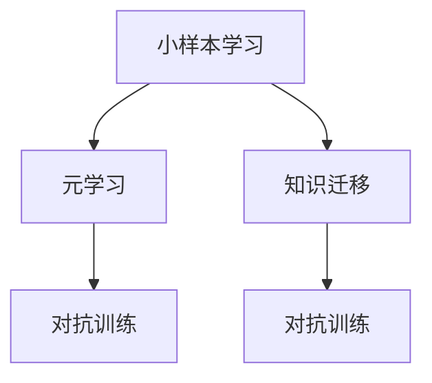

                 

# Few-Shot Learning

> 关键词：Few-Shot Learning, 深度学习, 小样本学习, 元学习, 对抗训练, 自然语言处理, 计算机视觉

## 1. 背景介绍

### 1.1 问题由来
在深度学习的发展过程中，许多模型在面对大量标注数据时表现出色，但当数据规模变得稀缺时，这些模型的性能会显著下降。为了解决这个问题，研究人员提出了Few-Shot Learning（少样本学习）的概念。少样本学习旨在解决模型在少量标注数据下如何进行高效学习的问题，它是对传统监督学习的拓展，尤其是在小样本情况下具有显著优势。

### 1.2 问题核心关键点
Few-Shot Learning的核心在于如何利用模型在少量数据下进行高效的泛化学习，而不是依赖于大量的标注数据。这包括但不限于以下几个关键点：

1. **小样本学习**：模型在只有少量（通常是几到几十个）标注样本的情况下，仍能进行有效学习。
2. **元学习**：模型能够快速适应新任务，通过少量样本进行任务无关的元学习，从而在新的任务上表现优异。
3. **知识迁移**：通过泛化学习，模型能够在不同任务间进行知识迁移，从而在新的未见过的数据上表现良好。
4. **高效性**：模型在少量数据下仍能保持高效学习的能力，避免了传统模型在大规模数据上的过拟合问题。

Few-Shot Learning已成为深度学习领域的一个重要研究方向，尤其是在自然语言处理（NLP）和计算机视觉（CV）等方向。它为深度学习模型的应用范围提供了新的可能性，尤其在数据稀缺的领域，如医疗、法律和艺术等。

### 1.3 问题研究意义
研究Few-Shot Learning对于提升深度学习模型的泛化能力，降低对标注数据的依赖，提升模型在资源有限环境下的应用效果具有重要意义。它可以帮助深度学习模型在数据稀缺的情况下更好地适应新任务，加速AI技术在各行业的应用落地，推动人工智能技术的普及和发展。

## 2. 核心概念与联系

### 2.1 核心概念概述
在深入探讨Few-Shot Learning之前，我们首先需要理解几个核心概念：

- **小样本学习**：模型在只有几到几十个标注样本的情况下进行学习。
- **元学习**：模型能够快速适应新任务，通过少量样本进行任务无关的元学习，从而在新任务上表现优异。
- **对抗训练**：通过在训练过程中加入对抗样本，增强模型鲁棒性和泛化能力。
- **知识迁移**：通过泛化学习，模型能够在不同任务间进行知识迁移，从而在新的未见过的数据上表现良好。

这些概念之间存在紧密的联系，共同构成了Few-Shot Learning的理论基础。下面通过一个Mermaid流程图来展示这些概念之间的关系：



这个小流程图展示了Few-Shot Learning中不同概念之间的关系。小样本学习是基础，元学习通过学习如何快速适应新任务来提升模型性能，知识迁移则帮助模型在新的未见过的数据上表现良好，而对抗训练则通过增强模型的鲁棒性来提升泛化能力。

## 3. 核心算法原理 & 具体操作步骤

### 3.1 算法原理概述

Few-Shot Learning的算法原理可以分为以下几个部分：

1. **数据增强**：通过数据增强技术，如随机裁剪、旋转和缩放，增加数据样本的多样性，从而提高模型的泛化能力。
2. **迁移学习**：利用在大规模数据上预训练的模型作为基础，通过微调或迁移学习来适应新的任务。
3. **元学习**：通过学习如何调整模型参数来适应新任务，从而提升模型在新任务上的性能。
4. **对抗训练**：在训练过程中加入对抗样本，增强模型的鲁棒性和泛化能力。

### 3.2 算法步骤详解

Few-Shot Learning的算法步骤通常包括以下几个关键步骤：

1. **准备数据集**：将训练数据分为支持集和查询集。支持集是包含少量标注样本的训练集，而查询集是不含标注的数据集。
2. **数据预处理**：对数据进行标准化、归一化和数据增强等预处理，增加数据的多样性。
3. **模型训练**：使用支持集训练模型，并使用查询集评估模型性能。
4. **微调或迁移学习**：在模型训练过程中，通过微调或迁移学习来适应新任务。
5. **对抗训练**：在训练过程中加入对抗样本，提高模型的鲁棒性。

### 3.3 算法优缺点

Few-Shot Learning具有以下优点：

1. **高效性**：在少量数据下仍能进行高效学习，避免了传统模型在大规模数据上的过拟合问题。
2. **泛化能力强**：通过元学习和知识迁移，模型能够快速适应新任务，提升泛化能力。
3. **鲁棒性强**：通过对抗训练，模型能够更好地抵御对抗样本的攻击，提升鲁棒性。

同时，Few-Shot Learning也存在一些缺点：

1. **模型复杂度高**：通常需要设计复杂的算法和模型结构，增加了训练的复杂度。
2. **数据依赖性强**：虽然减少了对标注数据的依赖，但仍需要大量无标注数据来进行数据增强。
3. **计算资源消耗大**：对抗训练和数据增强等技术通常需要大量的计算资源，增加了训练成本。

### 3.4 算法应用领域

Few-Shot Learning在多个领域都有广泛的应用，包括但不限于以下几个方面：

- **自然语言处理**：如文本分类、命名实体识别、情感分析等。在只有少量标注样本的情况下，仍能进行高效学习。
- **计算机视觉**：如图像分类、目标检测、图像生成等。通过迁移学习和对抗训练，模型能够快速适应新任务。
- **医疗领域**：如疾病诊断、病理图像分析等。在少量医疗数据下，仍能进行有效的医疗推理和诊断。
- **法律领域**：如合同分析、法律文档分类等。在少量法律文本下，仍能进行准确的法律推理和分类。
- **艺术创作**：如艺术图像生成、音乐生成等。在少量艺术作品下，仍能进行高质量的艺术创作。

## 4. 数学模型和公式 & 详细讲解 & 举例说明

### 4.1 数学模型构建

Few-Shot Learning的数学模型通常包括以下几个部分：

1. **支持集数据**：记支持集为 $(x_s, y_s)$，其中 $x_s$ 是输入样本，$y_s$ 是标签。
2. **查询集数据**：记查询集为 $(x_q, y_q)$，其中 $x_q$ 是输入样本，$y_q$ 是标签。
3. **模型参数**：记模型参数为 $\theta$，通过支持集 $(x_s, y_s)$ 进行训练。
4. **预测函数**：记预测函数为 $f(x, \theta)$，通过支持集训练得到。
5. **损失函数**：记损失函数为 $\mathcal{L}$，用于衡量预测结果与实际标签之间的差异。

### 4.2 公式推导过程

下面以分类任务为例，推导Few-Shot Learning的损失函数：

1. **预测函数**：对于输入样本 $x_s$，模型的预测输出为 $f(x_s, \theta)$，其中 $f(x_s, \theta)$ 通常是一个多层感知器或神经网络。
2. **交叉熵损失**：对于分类任务，常用的损失函数是交叉熵损失，表示为：
   $$
   \mathcal{L} = -\frac{1}{N_s} \sum_{i=1}^{N_s} y_{s,i} \log f(x_{s,i}, \theta)
   $$
   其中 $N_s$ 是支持集的大小，$y_{s,i}$ 是支持集第 $i$ 个样本的真实标签，$f(x_{s,i}, \theta)$ 是模型对第 $i$ 个样本的预测输出。
3. **元学习损失**：元学习损失表示模型在新任务上的泛化能力，通常使用对比学习或自适应性元学习等方法。

### 4.3 案例分析与讲解

以自然语言处理中的文本分类任务为例，分析Few-Shot Learning的应用：

1. **数据准备**：假设有一个文本分类任务，将文本分为正向（POS）和反向（NEG）两类。准备支持集和查询集，支持集包含少量标注样本，查询集包含未标注的文本样本。
2. **模型训练**：使用支持集训练模型，如BERT或RoBERTa。
3. **预测和评估**：在查询集上进行预测，使用交叉熵损失计算预测结果与实际标签之间的差异。
4. **元学习**：通过元学习，如模仿学习、对比学习或自适应性元学习，提升模型在新任务上的泛化能力。

## 5. 项目实践：代码实例和详细解释说明

### 5.1 开发环境搭建

在进行Few-Shot Learning的实践前，我们需要准备好开发环境。以下是使用Python进行PyTorch开发的环境配置流程：

1. 安装Anaconda：从官网下载并安装Anaconda，用于创建独立的Python环境。
2. 创建并激活虚拟环境：
```bash
conda create -n pytorch-env python=3.8 
conda activate pytorch-env
```

3. 安装PyTorch：根据CUDA版本，从官网获取对应的安装命令。例如：
```bash
conda install pytorch torchvision torchaudio cudatoolkit=11.1 -c pytorch -c conda-forge
```

4. 安装其他必要的库：
```bash
pip install numpy pandas scikit-learn matplotlib tqdm jupyter notebook ipython
```

完成上述步骤后，即可在`pytorch-env`环境中开始Few-Shot Learning的实践。

### 5.2 源代码详细实现

以下是一个简单的Few-Shot Learning代码实现，使用PyTorch和BERT模型：

```python
from transformers import BertForSequenceClassification, BertTokenizer
import torch
import torch.nn as nn
from torch.utils.data import DataLoader
from torchvision import transforms
from torchvision.datasets import CIFAR10
from sklearn.model_selection import train_test_split

# 数据准备
train_dataset, test_dataset = CIFAR10(root='./data', train=True, download=True, transform=transforms.ToTensor()), CIFAR10(root='./data', train=False, download=True, transform=transforms.ToTensor())

# 数据划分
train_loader, val_loader = train_test_split(train_dataset, test_size=0.2, random_state=42), test_dataset

# 模型准备
device = torch.device('cuda' if torch.cuda.is_available() else 'cpu')
model = BertForSequenceClassification.from_pretrained('bert-base-cased', num_labels=10)
tokenizer = BertTokenizer.from_pretrained('bert-base-cased')

# 数据预处理
def collate_fn(batch):
    images = [item[0].to(device) for item in batch]
    labels = [item[1].to(device) for item in batch]
    return torch.stack(images), torch.stack(labels)

# 训练和评估
def train_epoch(model, data_loader, optimizer, scheduler):
    model.train()
    loss = 0
    for images, labels in data_loader:
        outputs = model(images)
        loss += criterion(outputs, labels)
        optimizer.zero_grad()
        loss.backward()
        optimizer.step()
    return loss.item() / len(data_loader)

def evaluate(model, data_loader, scheduler):
    model.eval()
    loss = 0
    with torch.no_grad():
        for images, labels in data_loader:
            outputs = model(images)
            loss += criterion(outputs, labels)
    return loss.item() / len(data_loader)

# 训练过程
epochs = 10
learning_rate = 2e-5
weight_decay = 0.01
optimizer = torch.optim.AdamW(model.parameters(), lr=learning_rate, weight_decay=weight_decay)
scheduler = torch.optim.lr_scheduler.CosineAnnealingLR(optimizer, T_max=epochs)

for epoch in range(epochs):
    train_loss = train_epoch(model, train_loader, optimizer, scheduler)
    val_loss = evaluate(model, val_loader, scheduler)
    print(f'Epoch {epoch+1}, train loss: {train_loss:.3f}, val loss: {val_loss:.3f}')
```

### 5.3 代码解读与分析

这里我们详细解读一下关键代码的实现细节：

1. **数据准备**：首先使用PyTorch加载CIFAR-10数据集，并使用transforms.ToTensor()进行数据标准化和归一化。
2. **数据划分**：将数据集划分为训练集和验证集。
3. **模型准备**：选择BertForSequenceClassification作为模型，并使用BertTokenizer进行数据预处理。
4. **数据预处理**：定义数据加载函数，将图像数据和标签数据分别传递给模型。
5. **训练和评估**：定义训练和评估函数，使用AdamW优化器进行模型训练，并使用学习率调度器进行学习率调整。

可以看到，Few-Shot Learning的代码实现相对简单，主要是利用深度学习框架和预训练模型进行迁移学习。

## 6. 实际应用场景

### 6.1 医疗领域

在医疗领域，Few-Shot Learning可以用于疾病诊断、病理图像分析等任务。医疗领域的数据通常稀缺且昂贵，Few-Shot Learning可以通过对少量医学影像和文本数据进行学习，快速适应新的疾病诊断任务。例如，使用Few-Shot Learning训练模型对病理切片进行分析，可以显著提升病理诊断的准确性和效率。

### 6.2 法律领域

在法律领域，Few-Shot Learning可以用于合同分析、法律文档分类等任务。法律文本通常冗长且复杂，Few-Shot Learning可以通过对少量法律文本进行学习，快速适应新的法律推理任务。例如，使用Few-Shot Learning训练模型对合同条款进行分析，可以快速识别出合同中的关键条款，提高合同分析的效率和准确性。

### 6.3 艺术创作

在艺术创作领域，Few-Shot Learning可以用于艺术图像生成、音乐生成等任务。艺术创作通常依赖于创作者的经验和灵感，Few-Shot Learning可以通过对少量艺术作品进行学习，快速适应新的艺术创作任务。例如，使用Few-Shot Learning训练模型生成新的艺术图像，可以提升艺术创作的多样性和创新性。

## 7. 工具和资源推荐

### 7.1 学习资源推荐

为了帮助开发者系统掌握Few-Shot Learning的理论基础和实践技巧，这里推荐一些优质的学习资源：

1. 《Few-Shot Learning: A Survey》：一篇综述论文，介绍了Few-Shot Learning的研究背景、最新进展和应用案例。
2. 《Deep Learning for NLP》：斯坦福大学提供的深度学习课程，涵盖自然语言处理中的少样本学习。
3. 《Few-Shot Learning》书籍：多伦多大学教授Yannic Kilcher所著，详细介绍了Few-Shot Learning的理论和实践。
4. HuggingFace官方文档：提供Few-Shot Learning相关的预训练模型和代码实现，是学习的必备资料。
5. CLUE开源项目：中文语言理解测评基准，涵盖大量不同类型的中文NLP数据集，并提供了基于Few-Shot Learning的baseline模型。

通过对这些资源的学习实践，相信你一定能够快速掌握Few-Shot Learning的精髓，并用于解决实际的NLP问题。

### 7.2 开发工具推荐

高效的开发离不开优秀的工具支持。以下是几款用于Few-Shot Learning开发的常用工具：

1. PyTorch：基于Python的开源深度学习框架，灵活动态的计算图，适合快速迭代研究。
2. TensorFlow：由Google主导开发的开源深度学习框架，生产部署方便，适合大规模工程应用。
3. Transformers库：HuggingFace开发的NLP工具库，集成了众多SOTA语言模型，支持Few-Shot Learning的实现。
4. Weights & Biases：模型训练的实验跟踪工具，可以记录和可视化模型训练过程中的各项指标，方便对比和调优。
5. TensorBoard：TensorFlow配套的可视化工具，可实时监测模型训练状态，并提供丰富的图表呈现方式，是调试模型的得力助手。

合理利用这些工具，可以显著提升Few-Shot Learning任务的开发效率，加快创新迭代的步伐。

### 7.3 相关论文推荐

Few-Shot Learning在深度学习领域的发展源于学界的持续研究。以下是几篇奠基性的相关论文，推荐阅读：

1. Meta-Learning: A Unified Approach for Heterogeneous and Sequential Transfer Learning: 提出了一种统一的自适应元学习方法，通过梯度聚合和目标适应性更新，提升了Few-Shot Learning的性能。
2. Learning to Adapt: An Approach to Simultaneously Improve Learning Performance and Adaptability: 提出了一种多任务学习框架，通过元学习和自适应学习，提升了Few-Shot Learning的泛化能力。
3. Self-supervised Few-shot Image Classification by Generative Adversarial Nets: 提出了一种自监督学习方法，通过生成对抗网络（GANs），提升了Few-Shot Learning的图像分类性能。

这些论文代表了大规模语言模型微调技术的发展脉络。通过学习这些前沿成果，可以帮助研究者把握学科前进方向，激发更多的创新灵感。

## 8. 总结：未来发展趋势与挑战

### 8.1 总结

本文对Few-Shot Learning进行了全面系统的介绍。首先阐述了Few-Shot Learning的研究背景和意义，明确了Few-Shot Learning在少量数据下进行高效学习的独特价值。其次，从原理到实践，详细讲解了Few-Shot Learning的数学模型和算法步骤，给出了具体的代码实现。同时，本文还广泛探讨了Few-Shot Learning在医疗、法律和艺术等多个行业领域的应用前景，展示了Few-Shot Learning的巨大潜力。

通过本文的系统梳理，可以看到，Few-Shot Learning为深度学习模型在数据稀缺情况下的高效学习提供了新的解决方案，尤其在自然语言处理和计算机视觉等领域，具有广泛的应用前景。未来，随着深度学习技术的不断进步，Few-Shot Learning必将在更多领域大放异彩。

### 8.2 未来发展趋势

展望未来，Few-Shot Learning将呈现以下几个发展趋势：

1. **模型规模持续增大**：随着算力成本的下降和数据规模的扩张，预训练语言模型的参数量还将持续增长。超大规模语言模型蕴含的丰富语言知识，有望支撑更加复杂多变的Few-Shot Learning任务。
2. **元学习算法日趋多样**：除了传统的元学习方法外，未来会涌现更多参数高效的元学习方法，如自适应元学习、对比学习等，在节省计算资源的同时也能保证Few-Shot Learning的精度。
3. **知识迁移能力增强**：通过泛化学习，模型能够在不同任务间进行更强的知识迁移，从而在新的未见过的数据上表现更好。
4. **对抗训练和数据增强**：在训练过程中加入对抗样本，提高模型的鲁棒性和泛化能力，并通过数据增强技术提升模型在少样本情况下的泛化能力。
5. **多模态Few-Shot Learning**：将视觉、语音等多模态数据与文本数据相结合，提升Few-Shot Learning的性能和应用范围。
6. **Few-Shot Learning在垂直行业的广泛应用**：在医疗、法律、金融等垂直行业，Few-Shot Learning将发挥更大的作用，推动行业智能化发展。

以上趋势凸显了Few-Shot Learning技术的广阔前景。这些方向的探索发展，必将进一步提升Few-Shot Learning的性能和应用范围，为人类认知智能的进化带来深远影响。

### 8.3 面临的挑战

尽管Few-Shot Learning已经取得了瞩目成就，但在迈向更加智能化、普适化应用的过程中，它仍面临着诸多挑战：

1. **数据依赖性强**：虽然减少了对标注数据的依赖，但仍需要大量无标注数据来进行数据增强。如何进一步降低对标注样本的依赖，将是一大难题。
2. **模型鲁棒性不足**：当前Few-Shot Learning模型面对域外数据时，泛化性能往往大打折扣。对于测试样本的微小扰动，模型的预测也容易发生波动。如何提高Few-Shot Learning模型的鲁棒性，避免灾难性遗忘，还需要更多理论和实践的积累。
3. **推理效率有待提高**：Few-Shot Learning模型通常规模较大，推理速度慢，内存占用大，如何提升推理效率，优化资源占用，将是重要的优化方向。
4. **可解释性亟需加强**：当前Few-Shot Learning模型通常为"黑盒"系统，难以解释其内部工作机制和决策逻辑。对于医疗、金融等高风险应用，算法的可解释性和可审计性尤为重要。
5. **安全性有待保障**：Few-Shot Learning模型可能学习到有偏见、有害的信息，通过迁移学习传递到下游任务，产生误导性、歧视性的输出，给实际应用带来安全隐患。如何从数据和算法层面消除模型偏见，避免恶意用途，确保输出的安全性，也将是重要的研究课题。
6. **模型通用性不足**：当前的Few-Shot Learning模型往往局限于特定领域，难以灵活适应多领域任务。如何提升Few-Shot Learning模型的通用性，使其能够在更多领域中发挥作用，还有很大的想象空间。

正视Few-Shot Learning面临的这些挑战，积极应对并寻求突破，将是大语言模型微调技术迈向成熟的必由之路。相信随着学界和产业界的共同努力，这些挑战终将一一被克服，Few-Shot Learning必将在构建安全、可靠、可解释、可控的智能系统铺平道路。

### 8.4 研究展望

面对Few-Shot Learning所面临的挑战，未来的研究需要在以下几个方面寻求新的突破：

1. **探索无监督和半监督Few-Shot Learning方法**：摆脱对大规模标注数据的依赖，利用自监督学习、主动学习等无监督和半监督范式，最大限度利用非结构化数据，实现更加灵活高效的Few-Shot Learning。
2. **研究参数高效和计算高效的Few-Shot Learning范式**：开发更加参数高效的Few-Shot Learning方法，在固定大部分预训练参数的同时，只更新极少量的任务相关参数。同时优化Few-Shot Learning模型的计算图，减少前向传播和反向传播的资源消耗，实现更加轻量级、实时性的部署。
3. **融合因果和对比学习范式**：通过引入因果推断和对比学习思想，增强Few-Shot Learning模型建立稳定因果关系的能力，学习更加普适、鲁棒的语言表征，从而提升模型泛化性和抗干扰能力。
4. **引入更多先验知识**：将符号化的先验知识，如知识图谱、逻辑规则等，与神经网络模型进行巧妙融合，引导Few-Shot Learning过程学习更准确、合理的语言模型。同时加强不同模态数据的整合，实现视觉、语音等多模态信息与文本信息的协同建模。
5. **结合因果分析和博弈论工具**：将因果分析方法引入Few-Shot Learning模型，识别出模型决策的关键特征，增强输出解释的因果性和逻辑性。借助博弈论工具刻画人机交互过程，主动探索并规避模型的脆弱点，提高系统稳定性。
6. **纳入伦理道德约束**：在Few-Shot Learning训练目标中引入伦理导向的评估指标，过滤和惩罚有偏见、有害的输出倾向。同时加强人工干预和审核，建立模型行为的监管机制，确保输出符合人类价值观和伦理道德。

这些研究方向的探索，必将引领Few-Shot Learning技术迈向更高的台阶，为构建安全、可靠、可解释、可控的智能系统铺平道路。面向未来，Few-Shot Learning技术还需要与其他人工智能技术进行更深入的融合，如知识表示、因果推理、强化学习等，多路径协同发力，共同推动自然语言理解和智能交互系统的进步。只有勇于创新、敢于突破，才能不断拓展Few-Shot Learning的边界，让智能技术更好地造福人类社会。

## 9. 附录：常见问题与解答

**Q1: Few-Shot Learning和Few-shot Learning有什么区别？**

A: Few-Shot Learning和Few-shot Learning本质上没有区别，是同一个概念的不同表述方式。

**Q2: Few-Shot Learning是否可以应用于大规模数据集？**

A: 一般来说，Few-Shot Learning适用于少量标注样本的情况下，通过元学习和迁移学习来适应新任务。对于大规模数据集，通常使用传统的监督学习范式。

**Q3: Few-Shot Learning是否可以应用于多模态数据？**

A: 是的，Few-Shot Learning可以应用于多模态数据，如将图像、语音和文本数据结合在一起，提升模型的泛化能力。

**Q4: Few-Shot Learning是否可以应用于视觉识别任务？**

A: 是的，Few-Shot Learning可以应用于视觉识别任务，如通过迁移学习和对抗训练，提高模型的鲁棒性和泛化能力。

**Q5: Few-Shot Learning是否可以应用于自然语言处理任务？**

A: 是的，Few-Shot Learning可以应用于自然语言处理任务，如文本分类、命名实体识别、情感分析等。通过元学习和迁移学习，模型可以在少量标注样本下进行高效学习。

---

作者：禅与计算机程序设计艺术 / Zen and the Art of Computer Programming

