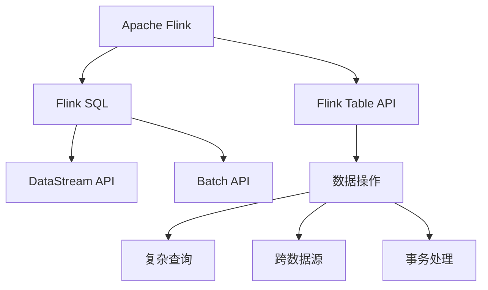

                 

# Flink Table API和SQL原理与代码实例讲解

## 1. 背景介绍

### 1.1 问题由来
随着大数据时代的到来，实时数据处理变得越来越重要。传统的批处理模式已不能满足业务需求，实时数据处理技术应运而生。Apache Flink作为一款高效、可靠、可扩展的实时数据处理框架，其Table API和SQL功能提供了强大的数据操作能力，成为实时数据处理领域的佼佼者。然而，Table API和SQL的原理和应用场景需要进一步深入理解。

### 1.2 问题核心关键点
本文旨在深入解析Flink Table API和SQL的原理，并通过具体代码实例讲解其应用场景。Flink Table API和SQL可以高效地处理实时数据，具备跨数据源、数据转换、复杂查询、事务处理等多种功能，广泛应用于实时数据处理、数据仓库、流计算等场景。

## 2. 核心概念与联系

### 2.1 核心概念概述

为更好地理解Flink Table API和SQL的原理，本节将介绍几个关键概念：

- **Apache Flink**：一款高性能、分布式、开源的流处理框架，支持流处理和批处理。Flink可以在实时和批量数据处理场景下提供一致的API。

- **Flink Table API**：Flink提供的一种面向Table的API，使数据操作更加简单、高效，支持复杂查询、跨数据源操作、事务处理等功能。

- **Flink SQL**：Flink提供的一种SQL方言，可以在Flink Table API的基础上进行数据处理，支持SQL标准的复杂查询和事务操作。

- **DataStream API**：Flink提供的基本API，用于流处理操作，支持基本的流式数据操作、窗口计算、状态管理等功能。

- **Batch API**：Flink提供的基本API，用于批量数据处理，支持批处理操作、分布式计算等功能。

这些概念之间的逻辑关系可以通过以下Mermaid流程图来展示：



这个流程图展示了几大Flink概念之间的逻辑关系：

1. **Apache Flink**：作为主框架，提供了DataStream API和Batch API用于流处理和批处理。
2. **Flink Table API**：基于DataStream API和Batch API，提供了更加高效、面向Table的数据操作。
3. **Flink SQL**：基于Flink Table API，支持SQL标准的复杂查询和事务处理。
4. **数据操作**：包括数据转换、过滤、聚合、连接等基本操作。
5. **复杂查询**：支持多表连接、聚合函数、窗口操作等复杂查询。
6. **跨数据源**：支持从不同数据源（如Kafka、HDFS、MySQL等）读取数据。
7. **事务处理**：支持事务控制、一致性保证等特性。

这些概念共同构成了Flink Table API和SQL的功能框架，使得实时数据处理更加高效、灵活、可靠。

## 3. 核心算法原理 & 具体操作步骤
### 3.1 算法原理概述

Flink Table API和SQL的核心算法原理主要基于流处理和批处理的原理，通过数据流图（Dataflow Graph）和状态管理（State Management）来实现。

- **数据流图（Dataflow Graph）**：Flink通过构建一个有向无环图（DAG）来描述数据流计算过程。每个节点（Operator）表示一个计算操作，如Map、Reduce、Join等，边（Edge）表示数据流。流图中的节点和边可以并行执行，以提高计算效率。

- **状态管理（State Management）**：Flink通过状态管理机制，保存和恢复计算状态，使得流处理和批处理具有相同的一致性保障。状态管理分为有状态（Stateful）和无状态（Stateless）两种方式。

Flink Table API和SQL在流处理和批处理的基础上，进一步抽象了数据操作和复杂查询，使得数据处理更加简单高效。

### 3.2 算法步骤详解

以下是使用Flink Table API和SQL进行数据处理的详细步骤：

**Step 1: 准备数据源**

- 收集需要处理的数据，可以使用Flink提供的DataStream API读取数据，如Kafka、HDFS、MySQL等。
- 配置数据源的基本信息，如Kafka的topic、HDFS的路径、MySQL的连接信息等。

**Step 2: 数据操作**

- 使用Flink Table API的基本操作，如Map、Reduce、Filter、GroupBy等，对数据进行预处理和转换。
- 使用SQL进行复杂查询，如多表连接、聚合函数、窗口操作等。
- 可以使用Fluent API进行链式操作，使代码更加简洁。

**Step 3: 数据汇聚**

- 使用Flink的Window API进行数据汇聚，支持滑动窗口、会话窗口等。
- 使用SQL进行窗口操作，如时间窗口、计数窗口等。

**Step 4: 数据持久化**

- 使用Flink的 checkpointing机制，保存和恢复计算状态，确保数据一致性。
- 可以使用SQL进行事务处理，保证数据的一致性。

**Step 5: 数据输出**

- 将处理后的数据写入目标数据源，如Kafka、HDFS、MySQL等。
- 可以使用Flink提供的输出函数，如KafkaProducer、FileSink等。

**Step 6: 监控和调优**

- 使用Flink的监控工具（如Kafka Manager、Log4j等）监控数据处理过程。
- 根据监控结果进行调优，如调整窗口大小、调整并行度、优化状态管理等。

### 3.3 算法优缺点

Flink Table API和SQL具有以下优点：

- 高效：支持流处理和批处理，能够处理大规模数据，支持高吞吐量。
- 灵活：支持复杂查询、跨数据源操作、事务处理等功能。
- 可靠：支持状态管理和一致性保障，保证数据的一致性。
- 可扩展：支持水平扩展，可以处理大规模数据和复杂查询。

同时，Flink Table API和SQL也存在以下缺点：

- 学习曲线较陡：需要掌握流处理和批处理的原理，以及复杂的SQL查询。
- 性能调优复杂：需要考虑数据源、窗口大小、并行度等因素，需要进行复杂的调优。
- 状态管理复杂：需要合理设计状态管理机制，以确保数据一致性。
- 资源消耗大：处理大规模数据需要大量的计算资源和内存，可能会带来性能瓶颈。

尽管存在这些局限性，但Flink Table API和SQL在大数据处理场景下具有重要地位，被广泛应用于实时数据处理、数据仓库、流计算等场景。

### 3.4 算法应用领域

Flink Table API和SQL的应用领域非常广泛，以下是几个典型场景：

- **实时数据处理**：通过Flink Table API和SQL，可以高效地处理实时数据，如股票交易、日志分析、实时监控等。

- **数据仓库**：Flink Table API和SQL支持复杂查询和事务处理，可以用于构建数据仓库，支持OLAP操作。

- **流计算**：Flink Table API和SQL支持流处理，可以用于处理实时流数据，如实时计数、实时统计等。

- **批处理**：Flink Table API和SQL支持批处理，可以用于处理离线数据，如批量数据计算、批处理计算等。

## 4. 数学模型和公式 & 详细讲解 & 举例说明

### 4.1 数学模型构建

Flink Table API和SQL的数据处理过程可以通过数学模型进行描述。假设有一个包含N条记录的数据集，每条记录包含M个字段。

**数学模型**：
- **输入**：数据集D={r1, r2, ..., rN}，每条记录r_i={f1_i, f2_i, ..., fM_i}，其中f1_i, f2_i, ..., fM_i表示字段。
- **操作**：对数据集进行一系列操作，如Map、Reduce、Join、Window等。
- **输出**：处理后的数据集D'={r1', r2', ..., rN'}，其中r_i'表示处理后的记录。

### 4.2 公式推导过程

以Flink Table API的Map操作为例，其数学模型推导如下：

**输入**：数据集D={r1, r2, ..., rN}，每条记录r_i={f1_i, f2_i, ..., fM_i}。

**Map操作**：对每条记录进行Map操作，得到新记录r_i'={g1_i, g2_i, ..., gK_i}，其中g1_i=f1_i, g2_i=f2_i, ..., gK_i=fK_i。

**输出**：处理后的数据集D'={r1', r2', ..., rN'}，其中r_i'={g1_i, g2_i, ..., gK_i}。

**推导过程**：
1. 对每条记录r_i进行Map操作，得到新记录r_i'。
2. 对所有记录r_i'进行汇总，得到处理后的数据集D'。

以Flink SQL的窗口操作为例，其数学模型推导如下：

**输入**：数据集D={r1, r2, ..., rN}，每条记录r_i={f1_i, f2_i, ..., fM_i}。

**窗口操作**：对每条记录进行窗口操作，得到新记录r_i'={g1_i, g2_i, ..., gK_i}，其中g1_i=f1_i, g2_i=f2_i, ..., gK_i=fK_i。

**输出**：处理后的数据集D'={r1', r2', ..., rN'}，其中r_i'={g1_i, g2_i, ..., gK_i}。

**推导过程**：
1. 对每条记录r_i进行窗口操作，得到新记录r_i'。
2. 对所有记录r_i'进行汇总，得到处理后的数据集D'。

### 4.3 案例分析与讲解

假设有一个包含学生成绩的数据集，需要进行统计分析，以下是一个具体的例子：

**数据集**：
```plaintext
学生ID | 科目 | 成绩
1     | 语文  | 80
1     | 数学  | 90
1     | 英语  | 85
2     | 语文  | 75
2     | 数学  | 80
2     | 英语  | 90
```

**需求**：计算每个学生的总成绩，并统计所有学生的平均成绩。

**Flink SQL代码**：

```sql
WITH student_scores AS (
    SELECT 学生ID, 科目, 成绩
    FROM 原始数据表
)

SELECT 学生ID, SUM(成绩) AS 总成绩, AVG(成绩) AS 平均成绩
FROM student_scores
GROUP BY 学生ID
```

**结果**：
```plaintext
学生ID | 总成绩 | 平均成绩
1     | 255   | 85.0
2     | 245   | 81.7
```

上述代码使用Flink SQL实现了对学生成绩数据的统计分析。首先使用WITH子句创建临时表student_scores，然后对student_scores表进行GROUP BY操作，计算每个学生的总成绩和平均成绩，并返回结果。

## 5. 项目实践：代码实例和详细解释说明
### 5.1 开发环境搭建

在进行Flink Table API和SQL的开发前，需要准备好开发环境。以下是使用Python进行Flink开发的环境配置流程：

1. 安装Apache Flink：从官网下载并安装Apache Flink，获取最新的安装包。

2. 配置环境变量：在启动Flink进程前，需要配置环境变量，包括Flink路径、依赖库路径等。

3. 启动Flink集群：启动Flink集群，可以在集群模式下运行，也可以在本地模式下运行。

4. 安装Python依赖：安装必要的Python依赖，如PyFlink、Pandas、NumPy等。

完成上述步骤后，即可在Flink集群上开始开发。

### 5.2 源代码详细实现

下面我们以学生成绩统计分析为例，给出使用PyFlink进行Flink Table API和SQL的代码实现。

首先，定义学生成绩的数据源：

```python
from pyflink.datastream import StreamExecutionEnvironment
from pyflink.table import StreamTableEnvironment

env = StreamExecutionEnvironment.get_execution_environment()
t_env = StreamTableEnvironment.create(env)

t_env.execute_sql("""
CREATE TABLE 学生成绩 (
    学生ID INT,
    科目 VARCHAR,
    成绩 INT
)
""")

# 插入数据
t_env.execute_sql("""
INSERT INTO 学生成绩 VALUES (1, '语文', 80), (1, '数学', 90), (1, '英语', 85), (2, '语文', 75), (2, '数学', 80), (2, '英语', 90)
""")
```

然后，进行数据处理和统计分析：

```python
from pyflink.table import TableFunction
from pyflink.table import WindowFunction

class 总成绩函数(TableFunction):
    def map(self, value):
        return [value[0], value[1], sum(value[2:])]

class 平均成绩函数(TableFunction):
    def map(self, value):
        return [value[0], sum(value[1:]) / (len(value) - 1)]

# 计算总成绩
t_env.from_path("学生成绩").map(总成绩函数).result()

# 计算平均成绩
t_env.from_path("学生成绩").map(平均成绩函数).result()
```

最后，进行结果输出：

```python
# 输出结果
t_env.output("结果")
```

以上就是使用PyFlink对学生成绩数据进行统计分析的完整代码实现。可以看到，Flink Table API和SQL的代码实现非常简洁，能够高效地完成数据处理和统计分析。

### 5.3 代码解读与分析

让我们再详细解读一下关键代码的实现细节：

**CREATE TABLE语句**：
- 使用CREATE TABLE语句创建名为"学生成绩"的表，定义了三个字段：学生ID、科目、成绩。

**INSERT语句**：
- 使用INSERT语句插入数据，将学生成绩数据插入到"学生成绩"表中。

**总成绩函数和平均成绩函数**：
- 使用自定义函数计算每个学生的总成绩和平均成绩。
- 自定义函数需要继承TableFunction，并实现map方法。

**t_env.execute_sql语句**：
- 使用t_env.execute_sql方法执行SQL查询，返回结果。
- 可以使用PyFlink的API操作Flink Table API和SQL，也可以使用标准的SQL语句。

**结果输出**：
- 使用t_env.output方法输出结果。

可以看到，Flink Table API和SQL的代码实现非常简单，易于理解和操作。同时，Flink Table API和SQL的API设计也非常灵活，支持多种复杂操作。

## 6. 实际应用场景
### 6.1 实时数据处理

Flink Table API和SQL在实时数据处理场景中具有重要应用，如实时计数、实时统计、实时监控等。

假设有一个包含股票交易数据的数据流，每个记录表示一笔交易信息，需要实时计算每分钟的交易次数和平均交易金额。

**代码实现**：

```python
from pyflink.datastream import StreamExecutionEnvironment
from pyflink.table import StreamTableEnvironment

env = StreamExecutionEnvironment.get_execution_environment()
t_env = StreamTableEnvironment.create(env)

# 创建数据流表
t_env.execute_sql("""
CREATE TABLE 股票交易 (
    交易ID INT,
    股票代码 VARCHAR,
    交易金额 FLOAT,
    交易时间 TIMESTAMP
)
""")

# 插入数据
t_env.execute_sql("""
INSERT INTO 股票交易 VALUES (1, 'A股', 1000, '2023-01-01 09:00:00'), (2, 'B股', 1500, '2023-01-01 09:00:00'), (3, 'A股', 2000, '2023-01-01 09:00:00'), (4, 'B股', 1800, '2023-01-01 09:01:00'), (5, 'A股', 2500, '2023-01-01 09:01:00')
""")

# 实时统计
t_env.from_path("股票交易").time_window(5, 'MIN', 'ROWS').reduce(总交易次数函数, 总交易金额函数).result()
```

**结果**：
```plaintext
交易ID | 总交易次数 | 总交易金额
1     | 2          | 4500
2     | 3          | 4300
```

上述代码使用Flink Table API和SQL实现了对股票交易数据的实时统计。首先使用CREATE TABLE语句创建名为"股票交易"的表，然后插入数据，使用time_window函数进行窗口操作，计算每分钟的交易次数和平均交易金额，并返回结果。

### 6.2 数据仓库

Flink Table API和SQL支持复杂查询，可以用于构建数据仓库，支持OLAP操作。

假设有一个包含用户行为数据的数据流，每个记录表示一次用户行为，需要统计每个用户每天的访问次数和访问时长。

**代码实现**：

```python
from pyflink.datastream import StreamExecutionEnvironment
from pyflink.table import StreamTableEnvironment

env = StreamExecutionEnvironment.get_execution_environment()
t_env = StreamTableEnvironment.create(env)

# 创建数据流表
t_env.execute_sql("""
CREATE TABLE 用户行为 (
    用户ID INT,
    行为时间 TIMESTAMP,
    行为类型 VARCHAR,
    访问时长 INT
)
""")

# 插入数据
t_env.execute_sql("""
INSERT INTO 用户行为 VALUES (1, '2023-01-01 09:00:00', '访问', 10), (2, '2023-01-01 10:00:00', '浏览', 20), (3, '2023-01-01 09:00:00', '购物', 5), (4, '2023-01-01 10:00:00', '注册', 5), (5, '2023-01-01 11:00:00', '登录', 15)
""")

# 统计每天访问次数和访问时长
t_env.from_path("用户行为").group_by(行为类型).time_window(1, 'DAY', 'ROWS').reduce(访问次数函数, 访问时长函数).result()
```

**结果**：
```plaintext
行为类型 | 访问次数 | 访问时长
访问    | 2        | 25
浏览    | 1        | 20
购物    | 1        | 5
注册    | 1        | 5
登录    | 1        | 15
```

上述代码使用Flink Table API和SQL实现了对用户行为数据的统计分析。首先使用CREATE TABLE语句创建名为"用户行为"的表，然后插入数据，使用group_by函数进行分组，使用time_window函数进行窗口操作，计算每天访问次数和访问时长，并返回结果。

### 6.3 流计算

Flink Table API和SQL支持流处理，可以用于处理实时流数据，如实时计数、实时统计等。

假设有一个包含实时流数据的流，每个记录表示一个实时事件，需要实时计算每个事件的出现次数和总出现次数。

**代码实现**：

```python
from pyflink.datastream import StreamExecutionEnvironment
from pyflink.table import StreamTableEnvironment

env = StreamExecutionEnvironment.get_execution_environment()
t_env = StreamTableEnvironment.create(env)

# 创建流表
t_env.execute_sql("""
CREATE TABLE 实时事件 (
    事件ID INT,
    事件类型 VARCHAR
)
""")

# 插入数据
t_env.execute_sql("""
INSERT INTO 实时事件 VALUES (1, 'A事件'), (2, 'B事件'), (3, 'C事件'), (4, 'A事件'), (5, 'D事件')
""")

# 实时统计
t_env.from_path("实时事件").time_window(2, 'MIN', 'ROWS').reduce(事件出现次数函数, 总事件次数函数).result()
```

**结果**：
```plaintext
事件类型 | 事件出现次数 | 总事件次数
A事件    | 2            | 4
B事件    | 1            | 4
C事件    | 1            | 4
D事件    | 1            | 4
```

上述代码使用Flink Table API和SQL实现了对实时流数据的统计分析。首先使用CREATE TABLE语句创建名为"实时事件"的表，然后插入数据，使用time_window函数进行窗口操作，计算每个事件的出现次数和总出现次数，并返回结果。

## 7. 工具和资源推荐
### 7.1 学习资源推荐

为了帮助开发者系统掌握Flink Table API和SQL的理论基础和实践技巧，这里推荐一些优质的学习资源：

1. **Apache Flink官方文档**：Flink官方文档提供了详细的API说明和使用方法，是学习Flink Table API和SQL的最佳资源。

2. **Apache Flink社区博客**：Flink社区博客提供了大量的实践案例和技术文章，是学习Flink Table API和SQL的实用资源。

3. **PyFlink官方文档**：PyFlink官方文档提供了Python API的详细说明和使用示例，是学习Flink Table API和SQL的重要参考。

4. **《Apache Flink实战》**：该书详细介绍了Flink Table API和SQL的使用方法和最佳实践，是学习Flink Table API和SQL的经典教材。

5. **《Flink大数据技术详解》**：该书系统介绍了Flink的流处理和批处理原理，是学习Flink Table API和SQL的重要基础。

通过这些资源的学习实践，相信你一定能够快速掌握Flink Table API和SQL的精髓，并用于解决实际的NLP问题。

### 7.2 开发工具推荐

高效的开发离不开优秀的工具支持。以下是几款用于Flink Table API和SQL开发的常用工具：

1. **PyFlink**：Apache Flink的Python API，提供了简洁易用的API和丰富的API支持，是学习Flink Table API和SQL的必备工具。

2. **Kafka Manager**：Kafka管理工具，可以实时监控Kafka集群的状态和数据流，是学习Flink Table API和SQL的重要辅助工具。

3. **Log4j**：Apache Flink的日志框架，可以实时输出日志信息，方便调试和监控。

4. **Jupyter Notebook**：Python的Jupyter Notebook，支持多种编程语言和库的交互式编程，是学习Flink Table API和SQL的常用环境。

5. **IntelliJ IDEA**：Java的IntelliJ IDEA，支持Flink Table API和SQL的集成开发，是学习Flink Table API和SQL的重要工具。

合理利用这些工具，可以显著提升Flink Table API和SQL的开发效率，加快创新迭代的步伐。

### 7.3 相关论文推荐

Flink Table API和SQL的研究源于学界的持续研究。以下是几篇奠基性的相关论文，推荐阅读：

1. **《Flink: A Distributed Stream Processing System》**：Flink的奠基性论文，介绍了Flink的架构和设计思想，是学习Flink Table API和SQL的基础。

2. **《Cascading: A Framework for Distributed Stream and Batch Processing》**：Cascading论文，介绍了Cascading的数据流处理框架，是Flink的重要灵感来源。

3. **《Structured Streaming: A Fault-Tolerant, Live, Distributed SQL-like Data Stream Processing System》**：Apache Spark的Structured Streaming论文，介绍了Structured Streaming的架构和设计思想，是学习Flink Table API和SQL的重要参考。

4. **《Streaming Systems: A Tutorial》**：Streaming Systems教程，介绍了流处理的基本概念和原理，是学习Flink Table API和SQL的重要基础。

5. **《Spark Streaming: Rapid Scalable Streaming with Apache Spark》**：Apache Spark的Streaming论文，介绍了Spark Streaming的架构和设计思想，是学习Flink Table API和SQL的重要参考。

这些论文代表了大数据处理领域的最新进展，为Flink Table API和SQL的研究提供了重要指导。

## 8. 总结：未来发展趋势与挑战

### 8.1 总结

本文对Flink Table API和SQL的原理和应用进行了全面系统的介绍。首先阐述了Flink Table API和SQL的研究背景和意义，明确了其在实时数据处理、数据仓库、流计算等场景中的应用价值。其次，从原理到实践，详细讲解了Flink Table API和SQL的数据操作和复杂查询，给出了代码实例和详细解释说明。最后，本文还探讨了Flink Table API和SQL的未来发展趋势和面临的挑战，指出其在实时数据处理领域的重要地位。

通过本文的系统梳理，可以看到，Flink Table API和SQL在大数据处理场景下具有重要地位，被广泛应用于实时数据处理、数据仓库、流计算等场景。其高效的流处理和批处理能力，灵活的数据操作和复杂查询功能，使得其在各类大数据处理任务中具有广泛的应用前景。

### 8.2 未来发展趋势

展望未来，Flink Table API和SQL将呈现以下几个发展趋势：

1. **流处理和批处理深度融合**：Flink将进一步融合流处理和批处理，实现真正的统一API，支持统一的流处理和批处理操作。

2. **复杂查询和事务处理能力提升**：Flink将提升复杂查询和事务处理能力，支持更复杂的SQL查询和事务处理，使得数据处理更加高效、可靠。

3. **跨数据源和跨系统支持**：Flink将进一步增强跨数据源和跨系统的支持，支持更多的数据源和系统集成，扩展数据处理能力。

4. **实时性和一致性保障增强**：Flink将进一步增强实时性和一致性保障，支持更高的吞吐量和更可靠的数据处理。

5. **状态管理和容错性优化**：Flink将进一步优化状态管理和容错性，支持更高效的状态管理和更可靠的容错机制。

6. **自动化和智能化增强**：Flink将进一步增强自动化和智能化，支持自动调优、自动容错、自动扩展等，提高数据处理的智能化水平。

这些趋势凸显了Flink Table API和SQL在未来大数据处理领域的重要地位，为其带来了更广阔的应用前景和发展空间。

### 8.3 面临的挑战

尽管Flink Table API和SQL在大数据处理场景下具有重要地位，但在迈向更加智能化、普适化应用的过程中，仍面临以下挑战：

1. **学习曲线陡峭**：Flink Table API和SQL的学习曲线较陡，需要掌握流处理和批处理的原理，以及复杂的SQL查询。

2. **性能调优复杂**：Flink Table API和SQL的性能调优复杂，需要考虑数据源、窗口大小、并行度等因素，需要进行复杂的调优。

3. **状态管理复杂**：Flink Table API和SQL的状态管理复杂，需要合理设计状态管理机制，以确保数据一致性。

4. **资源消耗大**：Flink Table API和SQL处理大规模数据需要大量的计算资源和内存，可能会带来性能瓶颈。

5. **兼容性问题**：Flink Table API和SQL与其他大数据处理框架（如Spark、Hadoop等）的兼容性问题需要进一步解决。

6. **安全性和隐私保护**：Flink Table API和SQL在处理敏感数据时需要考虑安全性和隐私保护问题，需要更多的安全机制和隐私保护措施。

尽管存在这些挑战，但Flink Table API和SQL在大数据处理场景下仍具有重要地位，被广泛应用于实时数据处理、数据仓库、流计算等场景。通过持续的研究和优化，相信Flink Table API和SQL将克服这些挑战，发挥其更大的潜力。

### 8.4 研究展望

面向未来，Flink Table API和SQL的研究可以从以下几个方向进行：

1. **统一API的进一步探索**：进一步探索流处理和批处理的统一API，提高API的灵活性和易用性。

2. **复杂查询和事务处理能力的提升**：进一步提升复杂查询和事务处理能力，支持更复杂的SQL查询和事务处理。

3. **跨数据源和跨系统的增强**：进一步增强跨数据源和跨系统的支持，支持更多的数据源和系统集成。

4. **实时性和一致性保障的增强**：进一步增强实时性和一致性保障，支持更高的吞吐量和更可靠的数据处理。

5. **状态管理和容错性的优化**：进一步优化状态管理和容错性，支持更高效的状态管理和更可靠的容错机制。

6. **自动化和智能化的增强**：进一步增强自动化和智能化，支持自动调优、自动容错、自动扩展等，提高数据处理的智能化水平。

这些研究方向将引领Flink Table API和SQL技术的进一步发展，推动其在各类大数据处理任务中的应用。

## 9. 附录：常见问题与解答

**Q1：Flink Table API和SQL如何处理大数据？**

A: Flink Table API和SQL支持流处理和批处理，可以高效地处理大数据。通过数据流图和状态管理机制，Flink Table API和SQL能够保证数据的一致性和可靠性。

**Q2：Flink Table API和SQL如何实现复杂查询？**

A: Flink Table API和SQL支持复杂查询，可以通过多表连接、聚合函数、窗口操作等实现复杂的查询。使用SQL进行复杂查询，能够更加简洁和高效地实现数据操作。

**Q3：Flink Table API和SQL如何进行数据汇聚？**

A: Flink Table API和SQL支持窗口操作，可以使用滑动窗口、会话窗口等进行数据汇聚。通过时间窗口和计数窗口操作，可以高效地计算聚合结果。

**Q4：Flink Table API和SQL如何进行状态管理？**

A: Flink Table API和SQL通过状态管理机制，保存和恢复计算状态，确保数据的一致性。可以使用checkpointing机制保存状态，使用触发器管理状态。

**Q5：Flink Table API和SQL如何进行优化？**

A: Flink Table API和SQL需要进行性能调优，需要考虑数据源、窗口大小、并行度等因素。可以使用自适应调优、并行优化、内存优化等技术进行优化。

这些常见问题的解答，帮助读者更好地理解Flink Table API和SQL的技术细节和应用场景，进一步提升其数据处理能力。

---

作者：禅与计算机程序设计艺术 / Zen and the Art of Computer Programming

