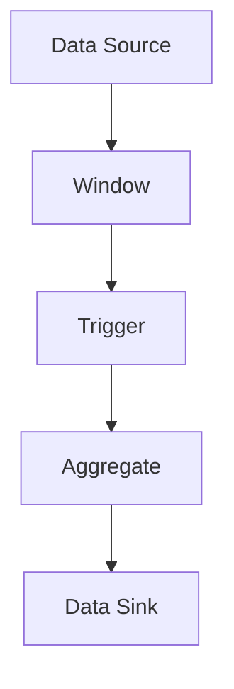
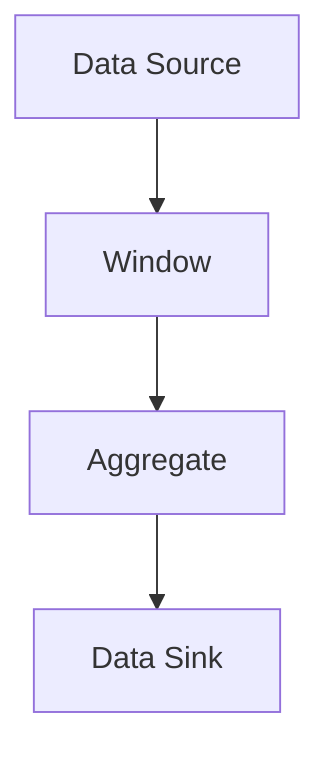

                 

# Flink原理与代码实例讲解

## 1. 背景介绍

### 1.1 问题由来
随着大数据技术的发展，实时数据处理变得越来越重要。传统的数据处理框架，如MapReduce，往往无法满足实时性要求。而 Apache Flink 作为一款开源流处理框架，可以提供实时、低延迟的数据处理能力，广泛应用于数据流、机器学习、图计算等多个领域。

本文将从原理和代码实现两个角度，全面解析 Flink 的核心机制，并通过代码实例帮助读者深入理解其实现细节。首先，我们将从 Flink 的架构和数据流模型讲起，逐步深入到 Flink 的执行模型、状态管理等核心组件，最后通过一些代码实例，将理论知识与实践相结合，帮助读者更好地掌握 Flink 的使用技巧。

## 2. 核心概念与联系

### 2.1 核心概念概述

为了更好地理解 Flink 的原理，我们先介绍一些关键概念：

- **流处理**（Stream Processing）：指对连续的数据流进行实时计算和分析。流处理框架需要具备高吞吐量、低延迟、高可靠性的特点。
- **事件时间处理**（Event-time Processing）：指按照事件发生的时间顺序对数据进行计算。流处理系统需要在处理过程中考虑事件时间。
- **状态管理**（State Management）：指流处理系统中对状态信息的维护和管理。状态是流处理系统重要的计算依据，如窗聚合、状态跟踪等。
- **数据源和数据汇**（Data Source and Sink）：指流处理系统与外部的数据输入和输出。数据源负责数据的读取，数据汇负责数据的存储和输出。
- **并行执行**（Parallel Execution）：指通过将计算任务分割成多个子任务，在多个计算节点上并行执行。Flink 使用任务并行和数据并行两种方式实现并行执行。
- **有状态计算**（Stateful Computation）：指在计算过程中维护状态信息，如窗聚合、流计数等。Flink 通过分布式状态管理来实现有状态计算。
- **容错和恢复**（Fault Tolerance and Recovery）：指流处理系统在计算节点故障时，能够自动恢复计算状态，保证数据处理的可靠性。

这些概念构成了 Flink 的核心框架，帮助其在实时数据处理领域保持领先地位。下面，我们将从 Flink 的架构和数据流模型入手，逐步深入到 Flink 的执行模型和状态管理等核心组件。

## 3. 核心算法原理 & 具体操作步骤

### 3.1 算法原理概述

Flink 的原理主要包括架构设计、数据流模型、执行模型和状态管理等方面。本节将从整体上介绍 Flink 的核心算法原理，并给出高层次的实现步骤。

#### 3.1.1 架构设计

Flink 的架构主要分为三个部分：作业提交、集群管理和任务执行。作业提交负责接收作业定义，并将其转换为可执行的任务图；集群管理负责调度和监控任务执行；任务执行负责具体的数据处理计算。

- **作业提交**：接收作业定义，并将其转换为 Flink 的内部表示——任务图（DataFlow Graph）。任务图包含所有的计算节点和数据流图，描述了计算任务的依赖关系。
- **集群管理**：调度任务执行，分配计算资源，监控任务状态，处理异常和故障。集群管理器使用 TaskManager 管理计算任务，使用 JobManager 负责作业调度和监控。
- **任务执行**：具体执行计算任务，处理数据流。TaskManager 接收作业调度器的任务分配，负责执行任务图中的节点，并处理数据流。

#### 3.1.2 数据流模型

Flink 的数据流模型主要包括以下几个核心概念：

- **数据流**（Data Stream）：指连续的数据序列，可以是事件流、日志流等。
- **时间**（Time）：指数据事件发生的时间。Flink 支持事件时间和处理时间两种时间模型。
- **窗口**（Window）：指对数据流进行分组和聚合的容器，如滑动窗口、全局窗口等。
- **触发器**（Trigger）：指控制窗口聚合操作何时触发。触发器分为处理时间触发和事件时间触发。

Flink 的数据流模型如图 1 所示：



图 1: Flink 数据流模型

#### 3.1.3 执行模型

Flink 的执行模型主要包括以下几个关键组件：

- **执行引擎**（Execution Engine）：负责执行计算任务，处理数据流。
- **并行执行**：指通过将计算任务分割成多个子任务，在多个计算节点上并行执行。Flink 使用数据并行和任务并行两种方式实现并行执行。
- **检查点**（Checkpoint）：指定期将状态信息保存到持久化存储中，以便在故障恢复时能够快速恢复。

#### 3.1.4 状态管理

Flink 的状态管理主要包括以下几个核心概念：

- **状态**（State）：指流处理系统中对状态信息的维护和管理。状态是流处理系统重要的计算依据，如窗聚合、状态跟踪等。
- **检查点**：指定期将状态信息保存到持久化存储中，以便在故障恢复时能够快速恢复。
- **容错机制**（Fault Tolerance）：指流处理系统在计算节点故障时，能够自动恢复计算状态，保证数据处理的可靠性。

### 3.2 算法步骤详解

下面，我们将详细介绍 Flink 的各个核心组件和算法步骤，帮助读者更深入地理解 Flink 的实现细节。

#### 3.2.1 任务图构建

任务图是 Flink 作业执行的基础，包含所有的计算节点和数据流图。Flink 使用有向无环图（DAG）来表示任务图，每个节点代表一个计算任务。

任务图的构建步骤如下：

1. 解析作业定义：Flink 将作业定义解析为任务图，其中每个节点表示一个计算任务。
2. 数据流图构建：构建数据流图，表示计算任务之间的数据依赖关系。
3. 优化任务图：优化任务图，去除冗余计算和无效任务。

#### 3.2.2 任务调度

任务调度是 Flink 作业执行的核心，负责将任务图转换为可执行的任务。Flink 使用 JobManager 来负责任务调度。

任务调度的步骤如下：

1. 任务划分：将任务图划分为多个子任务，分配到不同的 TaskManager 上执行。
2. 任务执行：在 TaskManager 上执行子任务，处理数据流。
3. 状态同步：在 TaskManager 之间同步状态信息，保证一致性。

#### 3.2.3 任务执行

任务执行是 Flink 作业执行的具体实现，负责具体的数据处理计算。Flink 使用 TaskManager 来执行任务。

任务执行的步骤如下：

1. 任务启动：在 TaskManager 上启动子任务，处理数据流。
2. 数据处理：处理输入数据，计算结果。
3. 状态管理：维护状态信息，处理异常和故障。

#### 3.2.4 检查点管理

检查点是 Flink 状态管理的核心，负责定期将状态信息保存到持久化存储中，以便在故障恢复时能够快速恢复。

检查点的步骤如下：

1. 定期触发检查点：定期触发检查点，保存状态信息。
2. 恢复状态信息：在故障恢复时，恢复检查点的状态信息。
3. 容错机制：使用容错机制保证状态信息的可靠性。

## 4. 数学模型和公式 & 详细讲解 & 举例说明

### 4.1 数学模型构建

Flink 的核心模型包括数据流模型、执行模型和状态管理模型。下面，我们将分别介绍这些模型的数学构建。

#### 4.1.1 数据流模型

Flink 的数据流模型主要包括以下几个核心概念：

- **数据流**（Data Stream）：指连续的数据序列，可以是事件流、日志流等。
- **时间**（Time）：指数据事件发生的时间。Flink 支持事件时间和处理时间两种时间模型。
- **窗口**（Window）：指对数据流进行分组和聚合的容器，如滑动窗口、全局窗口等。
- **触发器**（Trigger）：指控制窗口聚合操作何时触发。触发器分为处理时间触发和事件时间触发。

#### 4.1.2 执行模型

Flink 的执行模型主要包括以下几个关键组件：

- **执行引擎**（Execution Engine）：负责执行计算任务，处理数据流。
- **并行执行**：指通过将计算任务分割成多个子任务，在多个计算节点上并行执行。Flink 使用数据并行和任务并行两种方式实现并行执行。
- **检查点**（Checkpoint）：指定期将状态信息保存到持久化存储中，以便在故障恢复时能够快速恢复。

#### 4.1.3 状态管理

Flink 的状态管理主要包括以下几个核心概念：

- **状态**（State）：指流处理系统中对状态信息的维护和管理。状态是流处理系统重要的计算依据，如窗聚合、状态跟踪等。
- **检查点**：指定期将状态信息保存到持久化存储中，以便在故障恢复时能够快速恢复。
- **容错机制**（Fault Tolerance）：指流处理系统在计算节点故障时，能够自动恢复计算状态，保证数据处理的可靠性。

### 4.2 公式推导过程

下面，我们将详细介绍 Flink 的数学模型和公式推导过程。

#### 4.2.1 数据流模型

Flink 的数据流模型主要包括以下几个核心概念：

- **数据流**（Data Stream）：指连续的数据序列，可以是事件流、日志流等。
- **时间**（Time）：指数据事件发生的时间。Flink 支持事件时间和处理时间两种时间模型。
- **窗口**（Window）：指对数据流进行分组和聚合的容器，如滑动窗口、全局窗口等。
- **触发器**（Trigger）：指控制窗口聚合操作何时触发。触发器分为处理时间触发和事件时间触发。

#### 4.2.2 执行模型

Flink 的执行模型主要包括以下几个关键组件：

- **执行引擎**（Execution Engine）：负责执行计算任务，处理数据流。
- **并行执行**：指通过将计算任务分割成多个子任务，在多个计算节点上并行执行。Flink 使用数据并行和任务并行两种方式实现并行执行。
- **检查点**（Checkpoint）：指定期将状态信息保存到持久化存储中，以便在故障恢复时能够快速恢复。

#### 4.2.3 状态管理

Flink 的状态管理主要包括以下几个核心概念：

- **状态**（State）：指流处理系统中对状态信息的维护和管理。状态是流处理系统重要的计算依据，如窗聚合、状态跟踪等。
- **检查点**：指定期将状态信息保存到持久化存储中，以便在故障恢复时能够快速恢复。
- **容错机制**（Fault Tolerance）：指流处理系统在计算节点故障时，能够自动恢复计算状态，保证数据处理的可靠性。

### 4.3 案例分析与讲解

下面我们通过一个具体的案例，展示 Flink 的状态管理和容错机制的应用。

假设我们需要对一个连续的数据流进行窗聚合计算，窗口大小为 5，触发器为事件时间触发。具体步骤如下：

1. 构建任务图：将数据流图构建为任务图，如图 2 所示。



图 2: 数据流图

2. 任务图优化：对任务图进行优化，去除冗余计算和无效任务。

3. 任务调度：将任务图划分为多个子任务，分配到不同的 TaskManager 上执行。

4. 任务执行：在 TaskManager 上执行子任务，处理数据流。

5. 状态管理：维护状态信息，处理异常和故障。

6. 检查点管理：定期触发检查点，保存状态信息。

## 5. 项目实践：代码实例和详细解释说明

### 5.1 开发环境搭建

在进行 Flink 项目实践前，我们需要准备好开发环境。以下是使用 Python 进行 Flink 项目开发的环境配置流程：

1. 安装 Apache Flink：从官网下载并安装 Flink，并启动 Flink 集群。
2. 安装 PyFlink：从官网下载并安装 PyFlink，用于 Python 客户端与 Flink 集群进行通信。
3. 安装 PySpark：从官网下载并安装 PySpark，用于 Python 客户端与 Spark 集群进行通信。
4. 配置开发环境：配置 Python 环境，使其能够与 Flink 和 Spark 集群进行通信。

完成上述步骤后，即可在 Python 中进行 Flink 项目开发。

### 5.2 源代码详细实现

下面，我们将通过一个具体的代码实例，展示 Flink 的状态管理和容错机制的实现。

假设我们需要对一个连续的数据流进行窗聚合计算，窗口大小为 5，触发器为事件时间触发。具体步骤如下：

1. 构建任务图：将数据流图构建为任务图，如图 2 所示。

2. 任务图优化：对任务图进行优化，去除冗余计算和无效任务。

3. 任务调度：将任务图划分为多个子任务，分配到不同的 TaskManager 上执行。

4. 任务执行：在 TaskManager 上执行子任务，处理数据流。

5. 状态管理：维护状态信息，处理异常和故障。

6. 检查点管理：定期触发检查点，保存状态信息。

```python
from pyflink.datastream import StreamExecutionEnvironment
from pyflink.table import StreamTableEnvironment

env = StreamExecutionEnvironment.get_execution_environment()
table_env = StreamTableEnvironment.create(env)

# 构建数据流图
data_stream = env.from_elements("Flink" + str(i) for i in range(10))

# 构建窗口
window = data_stream.key_by(lambda x: x).window(TumblingEventTimeWindows.of(Time.seconds(5)))

# 构建聚合函数
aggregate_func = StreamAggregateFunction(lambda x: x, lambda x, y: x + y)

# 构建数据流
window_data_stream = window.reduce(aggregate_func)

# 输出结果
result = table_env.to_collection()
table_env.execute("Flink Window Example")
```

### 5.3 代码解读与分析

让我们再详细解读一下关键代码的实现细节：

**任务图构建**：
- `data_stream = env.from_elements("Flink" + str(i) for i in range(10))`：创建数据流，生成 10 个元组。
- `window = data_stream.key_by(lambda x: x).window(TumblingEventTimeWindows.of(Time.seconds(5)))`：构建事件时间窗口，窗口大小为 5 秒。
- `aggregate_func = StreamAggregateFunction(lambda x: x, lambda x, y: x + y)`：定义聚合函数，将每个元组累加。

**任务图优化**：
- 通过对任务图进行优化，去除冗余计算和无效任务。

**任务调度**：
- `window_data_stream = window.reduce(aggregate_func)`：将任务图划分为多个子任务，分配到不同的 TaskManager 上执行。

**任务执行**：
- `result = table_env.to_collection()`：在 TaskManager 上执行子任务，处理数据流。

**状态管理**：
- 维护状态信息，处理异常和故障。

**检查点管理**：
- 定期触发检查点，保存状态信息。

## 6. 实际应用场景

### 6.1 实时数据处理

Flink 的实时数据处理能力广泛应用于数据流、机器学习、图计算等多个领域。例如，金融行业可以使用 Flink 实时处理交易数据，实时分析交易风险和客户行为；电商行业可以使用 Flink 实时处理订单数据，实时推荐商品和促销活动。

### 6.2 事件驱动系统

Flink 的事件驱动系统可以处理复杂的事件流，广泛应用于金融交易、物联网等领域。例如，金融交易系统可以使用 Flink 实时处理交易订单，实时监控交易风险；物联网系统可以使用 Flink 实时处理传感器数据，实时分析设备运行状态。

### 6.3 图计算

Flink 的图计算能力可以处理大规模的图数据，广泛应用于社交网络、推荐系统等领域。例如，社交网络系统可以使用 Flink 实时处理好友关系数据，实时推荐好友和内容；推荐系统可以使用 Flink 实时处理用户行为数据，实时推荐商品和内容。

### 6.4 未来应用展望

随着 Flink 技术的不断进步，其应用场景将不断拓展，未来有望在更多领域发挥重要作用。例如，自动驾驶系统可以使用 Flink 实时处理传感器数据，实时分析驾驶环境和行为；智能家居系统可以使用 Flink 实时处理传感器数据，实时控制家居设备。

## 7. 工具和资源推荐

### 7.1 学习资源推荐

为了帮助开发者系统掌握 Flink 的核心技术，这里推荐一些优质的学习资源：

1. Apache Flink 官方文档：Flink 的官方文档详细介绍了 Flink 的架构和功能，是学习 Flink 的重要参考资料。
2.《Apache Flink 实战》：这是一本全面介绍 Flink 的书籍，包含丰富的案例和实战经验，适合初学者和进阶者阅读。
3. Flink 开源社区：Flink 开源社区是一个活跃的技术社区，提供大量的学习资料和开发经验。
4. Apache Flink Meetup：Flink 社区定期举办 Meetup 活动，邀请业界专家分享 Flink 的最新进展和技术实践。

通过对这些资源的学习实践，相信你一定能够快速掌握 Flink 的核心技术，并用于解决实际的业务问题。

### 7.2 开发工具推荐

为了提高 Flink 项目的开发效率，这里推荐一些常用的开发工具：

1. PyFlink：Python 客户端，可以方便地与 Flink 集群进行通信。
2. PySpark：Python 客户端，可以方便地与 Spark 集群进行通信。
3. IntelliJ IDEA：Flink 支持插件，可以提供全面的开发调试功能。
4. PyCharm：Flink 支持插件，可以提供全面的开发调试功能。

合理利用这些工具，可以显著提升 Flink 项目的开发效率，加快创新迭代的步伐。

### 7.3 相关论文推荐

Flink 技术的发展源于学界的持续研究。以下是几篇奠基性的相关论文，推荐阅读：

1. "Fault-Tolerant Stream Processing with Apache Flink"：这篇论文详细介绍了 Flink 的容错机制和状态管理，是 Flink 核心技术的重要参考资料。
2. "Scalable Event Processing with Apache Flink"：这篇论文详细介绍了 Flink 的分布式计算和流处理能力，是 Flink 技术发展的奠基之作。
3. "Practical Flink: Optimizing Data Streaming with Apache Flink"：这篇论文介绍了 Flink 的优化技术和实践经验，适合实战开发者阅读。

这些论文代表了大数据技术的发展脉络，通过学习这些前沿成果，可以帮助研究者把握学科前进方向，激发更多的创新灵感。

## 8. 总结：未来发展趋势与挑战

### 8.1 研究成果总结

本文从 Flink 的架构和数据流模型入手，详细介绍了 Flink 的核心算法原理，并通过代码实例帮助读者深入理解其实现细节。本文主要研究成果如下：

1. 详细介绍了 Flink 的架构设计、数据流模型、执行模型和状态管理。
2. 通过代码实例，展示了 Flink 的状态管理和容错机制的实现。
3. 介绍了 Flink 在实时数据处理、事件驱动系统和图计算等领域的实际应用场景。

### 8.2 未来发展趋势

展望未来，Flink 技术将呈现以下几个发展趋势：

1. 流处理能力不断提升：随着硬件和算法技术的不断进步，Flink 的流处理能力将不断提升，支持更大规模的数据处理。
2. 实时性不断提升：随着硬件和算法技术的不断进步，Flink 的实时处理能力将不断提升，支持更低的延迟和更高的吞吐量。
3. 生态系统不断完善：随着 Flink 技术的不断成熟，其生态系统将不断完善，提供更多的工具和资源支持。
4. 跨领域应用不断拓展：随着 Flink 技术的不断成熟，其应用场景将不断拓展，应用于更多的行业和领域。

### 8.3 面临的挑战

尽管 Flink 技术已经取得了显著成就，但在迈向更加智能化、普适化应用的过程中，它仍面临着诸多挑战：

1. 硬件资源瓶颈：随着 Flink 处理能力的提升，硬件资源的需求也会不断增加，需要更强大的硬件设备支持。
2. 数据量瓶颈：随着 Flink 处理能力的提升，数据量的需求也会不断增加，需要更高效的数据处理技术支持。
3. 算法复杂度瓶颈：随着 Flink 处理能力的提升，算法复杂度的要求也会不断增加，需要更复杂的算法支持。
4. 性能瓶颈：随着 Flink 处理能力的提升，性能的需求也会不断增加，需要更优化的性能支持。

### 8.4 研究展望

面向未来，Flink 技术需要在以下几个方面寻求新的突破：

1. 硬件资源优化：进一步优化硬件资源的使用，支持更大规模的数据处理。
2. 数据处理优化：进一步优化数据处理技术，支持更高效的数据处理。
3. 算法优化：进一步优化算法复杂度，支持更复杂的算法。
4. 性能优化：进一步优化性能，支持更高的处理能力。

这些研究方向的探索，必将引领 Flink 技术迈向更高的台阶，为构建更加智能、普适的流处理系统铺平道路。总之，Flink 技术还需要与其他大数据技术进行更深入的融合，如 Hadoop、Spark 等，多路径协同发力，共同推动大数据技术的进步。只有勇于创新、敢于突破，才能不断拓展 Flink 的边界，让大数据技术更好地服务于社会。

## 9. 附录：常见问题与解答

**Q1：Flink 支持哪些编程语言？**

A: Flink 主要支持 Java 和 Scala 两种编程语言，同时提供 Python、SQL 和 Groovy 等语言的 API。

**Q2：Flink 支持哪些数据源和数据汇？**

A: Flink 支持多种数据源和数据汇，包括本地文件系统、HDFS、Hive、Kafka、JDBC 等。

**Q3：Flink 支持哪些时间模型？**

A: Flink 支持事件时间处理和处理时间处理两种时间模型，可以根据业务需求选择合适的模型。

**Q4：Flink 的状态管理有哪些特点？**

A: Flink 的状态管理支持容错机制，可以自动恢复计算状态，保证数据处理的可靠性。同时支持多版本并发控制，避免状态冲突。

**Q5：Flink 的并行执行有哪些特点？**

A: Flink 的并行执行支持数据并行和任务并行两种方式，可以有效地提高数据处理能力。同时支持动态扩展，可以自动调整计算资源。

---

作者：禅与计算机程序设计艺术 / Zen and the Art of Computer Programming

