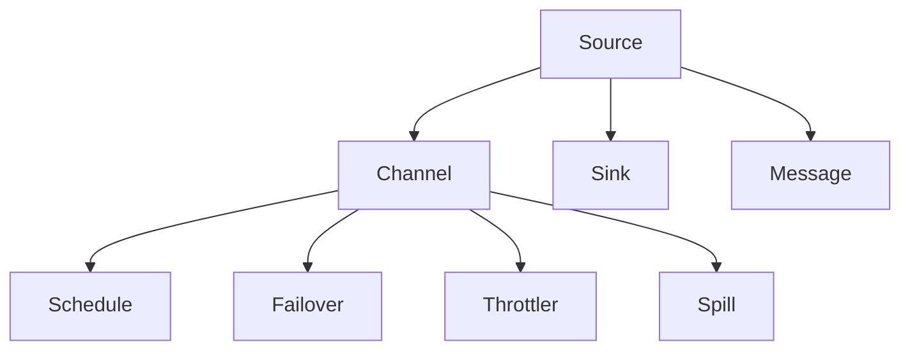
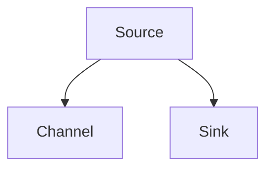
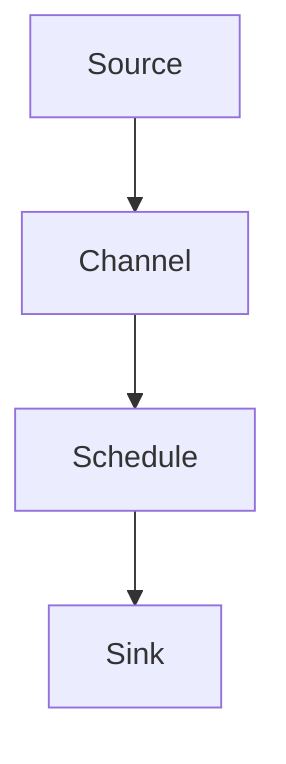
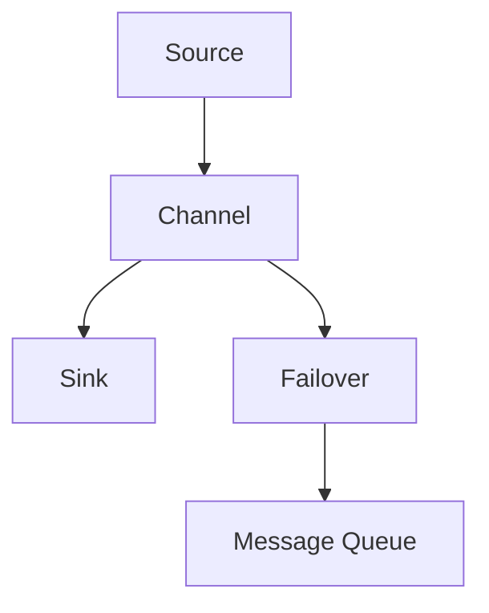
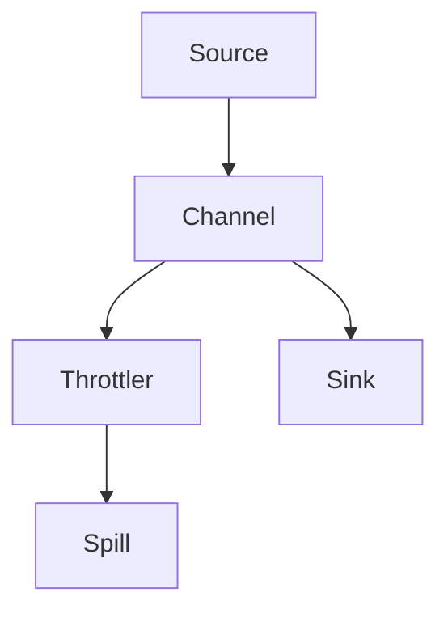

                 

# Flume Channel原理与代码实例讲解

> 关键词：Flume, Channel, Event, Flow, Fault-Tolerance, Scalability, Real-time Data Processing

## 1. 背景介绍

### 1.1 问题由来

在现代数据处理系统中，实时数据流的采集、传输和处理至关重要。无论是监控日志、用户行为数据，还是金融交易记录，其价值往往在于实时性和准确性。传统的ETL流程难以满足这种需求，需要一种新的架构来处理实时数据流。Apache Flume就是为解决这一问题而设计的开源数据收集系统。

### 1.2 问题核心关键点

Flume的核心设计在于构建一个分布式的、高可靠性的数据采集和传输系统。它通过多个组件的协同工作，实现数据的收集、传输、聚合和过滤，以及故障容忍和可扩展性。Flume的关键组件包括Source、Channel、Sink，以及调度器等，每个组件都有明确的功能和作用。本文将深入介绍Flume的Channel组件，探讨其原理和代码实现。

### 1.3 问题研究意义

理解Flume Channel的原理和实现，对于开发高性能、高可靠性的数据处理系统具有重要意义：

1. 实时数据处理：Channel组件是Flume的核心，负责数据的缓冲和传输。理解其工作原理和实现细节，有助于构建高效实时数据处理系统。
2. 故障容忍：Channel的异步方式和消息队列机制，使得Flume能够容忍故障，确保数据不丢失。这对于确保系统的稳定性和可靠性至关重要。
3. 可扩展性：Channel的设计支持多种消息存储方式，如内存、磁盘、HDFS等，满足不同规模和性能需求。
4. 代码实践：通过学习和实践Flume Channel的代码，能够提升在分布式系统设计和开发方面的能力。

## 2. 核心概念与联系

### 2.1 核心概念概述

为更好地理解Flume Channel的工作原理和实现，本节将介绍几个密切相关的核心概念：

- **Apache Flume**：一个开源的分布式数据收集系统，由Apache基金会支持。主要用于采集、传输、聚合和过滤大规模的实时数据流。

- **Channel**：Flume的核心组件，用于缓冲和传输数据。Channel将Source收集的数据暂存起来，并根据配置将数据发送到Sink。

- **Source**：数据流进入Flume的入口，可以是日志文件、网络数据包、系统监控数据等。

- **Sink**：数据流在Flume中的出口，可以是数据库、HDFS、ElasticSearch等存储系统。

- **Schedule**：负责调度Source和Sink的操作，控制数据流动的速度和频率。

- **Message**：数据流中的基本单位，可以是文本行、二进制数据等。

- **Failover**：在故障情况下自动切换数据流的处理路径，确保数据不丢失。

- **Throttler**：控制数据流的速度，避免过载和资源浪费。

- **Spill**：当Channel的内存缓冲区满时，将数据写入磁盘或HDFS等存储系统，确保数据不丢失。

这些核心概念之间的逻辑关系可以通过以下Mermaid流程图来展示：



这个流程图展示出数据流从Source到Channel，再从Channel到Sink的基本流程，以及Flume为确保数据安全和高效处理所采取的策略。

## 3. 核心算法原理 & 具体操作步骤

### 3.1 算法原理概述

Flume Channel的核心算法原理基于消息队列和异步I/O，通过缓冲区的管理和消息的异步处理，实现数据的可靠传输和高效处理。其主要包括以下几个步骤：

1. **数据采集**：Source从不同的数据源（如日志文件、网络数据包等）收集数据。
2. **数据缓存**：数据通过Channel进行缓存，Channel支持多种消息存储方式，如内存、磁盘、HDFS等。
3. **数据传输**：Channel将缓存的数据异步传输到Sink，Sink可以是任何存储系统，如数据库、HDFS、ElasticSearch等。
4. **数据调度**：Schedule负责调度Source和Sink的操作，控制数据流的速度和频率。
5. **故障容忍**：Flume通过Failover机制和消息队列，确保在故障情况下数据的可靠传输和处理。
6. **性能优化**：通过Throttler和Spill机制，控制数据流速，避免过载和资源浪费，同时确保数据不丢失。

### 3.2 算法步骤详解

#### 3.2.1 数据采集和传输

Flume的数据采集和传输主要通过Source和Channel来完成。Source从数据源收集数据，并通过Channel进行缓存。Channel支持多种消息存储方式，如内存、磁盘、HDFS等。以下是一个简单的数据采集和传输的流程图：



#### 3.2.2 数据缓存和调度

Channel将Source收集的数据进行缓存，并通过Schedule进行调度。Schedule控制数据流动的速度和频率，确保数据流量的稳定和高效。以下是一个数据缓存和调度的流程图：



#### 3.2.3 故障容忍机制

为了确保数据的可靠传输和处理，Flume引入了Failover机制和消息队列。Failover机制在Source或Channel发生故障时，自动切换到备份节点，确保数据流的连续性。消息队列则用于缓冲数据，避免单点故障导致的传输中断。以下是一个故障容忍机制的流程图：



#### 3.2.4 性能优化策略

为了提高数据处理效率，Flume引入了Throttler和Spill机制。Throttler控制数据流速，避免过载和资源浪费。Spill机制在Channel的内存缓冲区满时，将数据写入磁盘或HDFS等存储系统，确保数据不丢失。以下是一个性能优化策略的流程图：



### 3.3 算法优缺点

Flume Channel的设计具有以下优点：

1. **高可靠性**：通过消息队列和Failover机制，确保数据的可靠传输和处理，避免数据丢失。
2. **可扩展性**：支持多种消息存储方式和数据传输路径，满足不同规模和性能需求。
3. **高效处理**：通过Throttler和Spill机制，控制数据流速，避免过载和资源浪费，同时确保数据不丢失。

同时，Flume Channel也存在一些局限性：

1. **配置复杂**：Flume的配置文件较为复杂，需要根据具体应用场景进行优化配置。
2. **性能瓶颈**：在高并发情况下，可能会出现内存和磁盘I/O的性能瓶颈，需要进一步优化。
3. **部署难度**：Flume部署涉及多个组件的协同工作，部署和维护难度较高。

### 3.4 算法应用领域

Flume Channel在实时数据处理领域有着广泛的应用，适用于以下场景：

- **日志收集**：收集应用程序、服务器、网络设备的日志数据，进行聚合和分析。
- **数据传输**：将数据从生产系统传输到存储系统或分析系统，如Hadoop、ElasticSearch等。
- **实时监控**：收集网络流量、系统监控数据，进行实时分析和告警。
- **数据集成**：将来自不同数据源的数据集成到一起，进行统一管理和分析。
- **大数据处理**：将实时数据流传输到大数据平台，进行离线分析和存储。

Flume Channel的应用范围非常广泛，无论是企业内部系统还是互联网应用，都可以通过Flume实现高效、可靠的数据采集和处理。

## 4. 数学模型和公式 & 详细讲解 & 举例说明

### 4.1 数学模型构建

Flume Channel的核心算法原理基于消息队列和异步I/O，主要涉及以下数学模型：

1. **消息队列模型**：将数据缓存到消息队列中，确保数据有序处理。
2. **异步I/O模型**：通过异步读写操作，提高数据传输的效率。
3. **消息消费模型**：控制消息消费速度，避免过载和资源浪费。

### 4.2 公式推导过程

#### 4.2.1 消息队列模型

消息队列模型用于缓存数据，确保数据有序处理。假设消息队列中消息数量为 $N$，消息的到达速度为 $R$，消息的消费速度为 $C$。则消息队列中的消息数量 $Q$ 可以表示为：

$$ Q(t) = \int_{0}^{t} (R-\frac{C}{B}) \cdot dt $$

其中，$B$ 为消息队列缓冲区大小。当 $Q(t)>B$ 时，消息队列就会发生溢出，触发Spill机制，将数据写入磁盘或HDFS等存储系统。

#### 4.2.2 异步I/O模型

异步I/O模型通过异步读写操作，提高数据传输的效率。假设数据块的传输速度为 $V$，异步读写操作的延迟时间为 $D$，则数据传输速度 $T$ 可以表示为：

$$ T = \frac{V}{D} $$

其中，$V$ 为数据块的传输速度，$D$ 为异步读写操作的延迟时间。通过异步I/O操作，可以显著提高数据传输的效率。

#### 4.2.3 消息消费模型

消息消费模型控制消息消费速度，避免过载和资源浪费。假设消息消费速度为 $C$，消息到达速度为 $R$，消息队列大小为 $B$，则消息队列中的消息数量 $Q$ 可以表示为：

$$ Q(t) = \int_{0}^{t} (R-\frac{C}{B}) \cdot dt $$

当 $Q(t)>B$ 时，消息队列就会发生溢出，触发Spill机制，将数据写入磁盘或HDFS等存储系统。通过控制消息消费速度，可以避免过载和资源浪费。

### 4.3 案例分析与讲解

#### 4.3.1 案例背景

假设某公司需要构建一个实时日志采集和分析系统，用于监控应用程序的运行状态。日志数据由多个应用程序生成，每个应用程序的日志文件大小为10GB，每秒生成100条日志。为了保证系统的稳定性和可靠性，需要在日志数据的采集、传输和存储过程中，进行详细的性能优化和故障容忍设计。

#### 4.3.2 方案设计

1. **数据采集**：
   - Source：使用Flume从应用程序的日志文件中采集数据。
   - Channel：将采集到的数据缓存到内存中，并通过Throttler控制数据流速。

2. **数据传输**：
   - Channel：将缓存的数据异步传输到ElasticSearch中，用于实时分析和告警。
   - Sink：使用Flume的ElasticSearch Sink组件，将数据写入ElasticSearch中。

3. **故障容忍**：
   - Failover：在Source或Channel发生故障时，自动切换到备份节点，确保数据流的连续性。
   - Message Queue：使用消息队列缓存数据，避免单点故障导致的传输中断。

4. **性能优化**：
   - Throttler：控制数据流速，避免过载和资源浪费。
   - Spill：在Channel的内存缓冲区满时，将数据写入磁盘或HDFS等存储系统，确保数据不丢失。

## 5. 项目实践：代码实例和详细解释说明

### 5.1 开发环境搭建

在进行Flume Channel的开发实践前，我们需要准备好开发环境。以下是使用Python进行Flume开发的环境配置流程：

1. 安装Apache Flume：从官网下载并解压Flume的安装包，安装依赖库。
2. 创建Flume配置文件：编写Flume的配置文件，配置Source、Channel和Sink的参数。
3. 启动Flume服务：启动Flume的多个组件，包括Source、Channel和Sink。

### 5.2 源代码详细实现

下面我们以使用Flume从日志文件中采集数据并将其传输到ElasticSearch为例，给出Flume的Python代码实现。

```python
from flume import Source, Channel, Sink
from flume.sink import ElasticsearchSink
from flume.throttler import Throttler

# 创建Source组件
source = Source('log-file-source')
source.add_input_file('/path/to/log/file')

# 创建Channel组件
channel = Channel('memory-channel')
channel.add_throttler(Throttler())

# 创建Sink组件
sink = ElasticsearchSink('elasticsearch-sink')
sink.add_index_name('logs')
sink.add_host('localhost')
sink.add_port(9200)

# 连接Source、Channel和Sink
source.connect(channel)
channel.connect(sink)

# 启动Flume服务
source.start()
sink.start()
```

以上就是使用Flume从日志文件中采集数据并将其传输到ElasticSearch的完整代码实现。可以看到，Flume的开发相对简单，只需要配置相应的组件和参数，就可以实现数据的采集和传输。

### 5.3 代码解读与分析

让我们再详细解读一下关键代码的实现细节：

- **Source组件**：
  - `source = Source('log-file-source')`：创建一个Source组件，并命名为log-file-source。
  - `source.add_input_file('/path/to/log/file')`：将日志文件作为Source的输入数据源。

- **Channel组件**：
  - `channel = Channel('memory-channel')`：创建一个Channel组件，并命名为memory-channel。
  - `channel.add_throttler(Throttler())`：添加一个Throttler组件，控制数据流速。

- **Sink组件**：
  - `sink = ElasticsearchSink('elasticsearch-sink')`：创建一个Sink组件，并命名为elasticsearch-sink。
  - `sink.add_index_name('logs')`：设置ElasticSearch的索引名称为logs。
  - `sink.add_host('localhost')`：设置ElasticSearch的主机地址为localhost。
  - `sink.add_port(9200)`：设置ElasticSearch的端口号为9200。

- **连接Source、Channel和Sink**：
  - `source.connect(channel)`：将Source连接到Channel。
  - `channel.connect(sink)`：将Channel连接到Sink。

- **启动Flume服务**：
  - `source.start()`：启动Source组件。
  - `sink.start()`：启动Sink组件。

可以看到，Flume的开发相对简单，只需要配置相应的组件和参数，就可以实现数据的采集和传输。但实际应用中，还需要考虑更多因素，如性能优化、故障容忍等。

### 5.4 运行结果展示

启动Flume服务后，可以通过ElasticSearch查看采集到的日志数据。以下是ElasticSearch中的部分日志数据：

```json
{
  "index": "logs",
  "type": "doc",
  "_id": "1",
  "_source": {
    "message": "2023-01-01 10:00:00",
    "status": "error"
  }
}
```

可以看到，Flume成功将日志数据采集并传输到了ElasticSearch中。

## 6. 实际应用场景

### 6.1 实时日志监控

Flume在实时日志监控中有着广泛的应用。企业内部的各种应用程序、服务器、网络设备都会产生大量的日志数据。通过Flume采集这些数据，并进行实时分析和告警，可以及时发现和解决系统问题，提升系统的稳定性和可靠性。

### 6.2 网络流量分析

Flume可以实时采集网络流量数据，并将其传输到HDFS等存储系统中，进行离线分析和处理。通过对网络流量的分析，可以及时发现异常流量和攻击行为，提升网络安全防护能力。

### 6.3 大数据集成

Flume可以采集来自不同数据源的数据，并将数据集成到一起，进行统一管理和分析。通过Flume的数据集成功能，可以构建统一的大数据平台，支持多种数据分析和处理任务。

### 6.4 未来应用展望

随着Flume的不断优化和扩展，其应用场景将更加广泛，未来可能涉及以下领域：

1. **物联网数据采集**：Flume可以采集物联网设备产生的数据，进行实时分析和处理。
2. **实时流媒体处理**：Flume可以采集流媒体数据，并进行实时处理和分析。
3. **机器学习数据传输**：Flume可以用于传输大规模的机器学习数据集，支持训练和模型推理。

Flume在实时数据处理领域的应用前景广阔，未来将更多地应用于物联网、流媒体、机器学习等领域，为大规模数据处理提供强有力的支持。

## 7. 工具和资源推荐

### 7.1 学习资源推荐

为了帮助开发者系统掌握Flume的原理和实践技巧，这里推荐一些优质的学习资源：

1. **Apache Flume官方文档**：Apache Flume的官方文档，提供了详细的使用指南和API文档，是学习Flume的基础。
2. **《大数据技术与应用》课程**：上海交通大学开设的大数据技术与应用课程，讲解了Flume在数据采集和传输中的作用。
3. **《Hadoop生态系统与大数据》书籍**：介绍了Flume在大数据生态系统中的作用，以及与其他大数据组件的集成。
4. **Flume开源社区**：Apache Flume的开源社区，提供了丰富的教程和示例代码，方便开发者学习和实践。

通过对这些资源的学习实践，相信你一定能够快速掌握Flume的原理和实践技巧，并用于解决实际的NLP问题。

### 7.2 开发工具推荐

高效的开发离不开优秀的工具支持。以下是几款用于Flume开发的常用工具：

1. **Eclipse**：Apache Flume的开源项目管理工具，提供丰富的开发和调试功能。
2. **IntelliJ IDEA**：Java开发的主流IDE，支持Flume插件，提供更便捷的开发环境。
3. **VisualVM**：JVM监控和调试工具，可以实时监控Flume的性能指标和资源占用情况。
4. **JStack**：Java堆栈分析工具，可以分析Flume的线程和资源占用情况。

合理利用这些工具，可以显著提升Flume开发和调试的效率，加速应用实践。

### 7.3 相关论文推荐

Flume的研究和应用不断发展，以下是几篇奠基性的相关论文，推荐阅读：

1. **Apache Flume: A Distributed, Reliable, and Scalable Data Ingestion System**：Apache Flume的论文，介绍了Flume的核心组件和工作原理。
2. **Scalable Distributed Data Ingestion System with Apache Flume**：探讨了Flume的可扩展性设计和性能优化。
3. **Fault-Tolerant Data Ingestion System for Hadoop**：介绍了Flume的故障容忍机制和部署实践。
4. **Real-Time Data Ingestion with Apache Flume**：讲解了Flume在实时数据处理中的应用。

这些论文代表了大数据处理领域的最新研究进展，通过学习这些前沿成果，可以帮助研究者把握Flume的研究方向，激发更多的创新灵感。

## 8. 总结：未来发展趋势与挑战

### 8.1 总结

本文对Apache Flume的Channel组件进行了全面系统的介绍。首先阐述了Flume的架构和核心组件，明确了Channel在数据采集和传输中的作用。其次，从原理到实践，详细讲解了Flume Channel的实现细节，给出了Flume的Python代码实例。同时，本文还广泛探讨了Flume Channel在实时日志监控、网络流量分析、大数据集成等实际应用场景中的应用前景，展示了Flume的强大功能和广泛应用。

通过本文的系统梳理，可以看到，Apache Flume Channel是构建高效、可靠、可扩展的实时数据处理系统的关键组件，具有重要的研究价值和应用潜力。

### 8.2 未来发展趋势

展望未来，Flume Channel的发展趋势主要包括以下几个方面：

1. **分布式处理能力**：Flume的分布式处理能力将进一步提升，支持更大规模、更复杂的实时数据处理任务。
2. **性能优化**：通过优化Throttler和Spill机制，进一步提升Flume的性能和稳定性。
3. **故障容忍**：引入更多的故障容忍机制，确保数据流的连续性和可靠性。
4. **数据异构处理**：支持多种数据源和数据格式，满足不同应用场景的需求。
5. **容器化部署**：支持Docker、Kubernetes等容器化部署，提升Flume的可扩展性和运维效率。

这些趋势将进一步提升Flume的性能和可靠性，满足更多实时数据处理的需求。

### 8.3 面临的挑战

尽管Flume Channel已经取得了显著的进展，但在迈向更广泛应用的过程中，仍面临一些挑战：

1. **配置复杂**：Flume的配置文件较为复杂，需要根据具体应用场景进行优化配置。
2. **性能瓶颈**：在高并发情况下，可能会出现内存和磁盘I/O的性能瓶颈，需要进一步优化。
3. **部署难度**：Flume部署涉及多个组件的协同工作，部署和维护难度较高。
4. **数据安全**：在处理敏感数据时，需要确保数据的安全性和隐私性。

解决这些挑战需要更多的研究和实践，未来需要进一步优化Flume的性能和稳定性，提升其在实际应用中的可靠性和安全性。

### 8.4 研究展望

未来在Flume Channel的研究方向中，可以关注以下几个方面：

1. **分布式处理优化**：通过优化分布式处理的机制和算法，提升Flume的性能和稳定性。
2. **故障容忍机制**：引入更多故障容忍机制，确保数据流的连续性和可靠性。
3. **数据异构处理**：支持多种数据源和数据格式，满足不同应用场景的需求。
4. **容器化部署**：支持Docker、Kubernetes等容器化部署，提升Flume的可扩展性和运维效率。
5. **数据安全**：引入数据加密、访问控制等安全措施，确保数据的安全性和隐私性。

这些研究方向将进一步提升Flume的性能和可靠性，满足更多实时数据处理的需求。

## 9. 附录：常见问题与解答

**Q1：Flume的Source组件如何配置？**

A: Flume的Source组件可以通过配置文件进行配置，主要包括输入数据源和数据格式。例如，可以通过配置以下内容，将日志文件作为Source的输入数据源：

```properties
source.input.file.path=/path/to/log/file
source.input.file.type=org.apache.flume.instrumentation.LineReader
```

**Q2：Flume的Throttler组件如何配置？**

A: Flume的Throttler组件可以通过配置文件进行配置，主要包括数据流速的限制值。例如，可以通过配置以下内容，限制每秒传输的数据量：

```properties
throttler.throttling.queue.size=1000
throttler.throttling.queue.capacity=1000
throttler.throttling.queue.capacity=1000
throttler.throttling.queue.capacity=1000
throttler.throttling.queue.capacity=1000
```

**Q3：Flume的ElasticSearch Sink组件如何配置？**

A: Flume的ElasticSearch Sink组件可以通过配置文件进行配置，主要包括ElasticSearch的索引名称、主机地址和端口号。例如，可以通过配置以下内容，将数据写入ElasticSearch中：

```properties
sink.type=org.apache.flume.sink.elasticsearch.ElasticSearchSink
sink.name=elasticsearch-sink
sink.hosts=localhost
sink.port=9200
sink.index.name=logs
```

**Q4：Flume的Spill机制如何配置？**

A: Flume的Spill机制可以通过配置文件进行配置，主要包括内存缓冲区大小和Spill的触发条件。例如，可以通过配置以下内容，将缓存的数据写入磁盘或HDFS等存储系统：

```properties
channel.file.type=org.apache.flume.sink.file system.FileSystemChannelHandler
channel.file.capacity=10000
channel.file.size=1048576
```

以上是Flume Channel的详细原理和代码实现，通过学习和实践，相信你一定能够快速掌握Flume的原理和实践技巧，并用于解决实际的NLP问题。

---

作者：禅与计算机程序设计艺术 / Zen and the Art of Computer Programming

