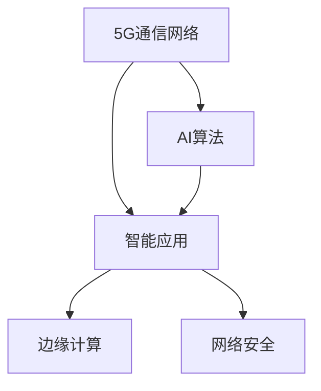

                 

# 5G+AI：智能通信网络的未来

> 关键词：5G, AI, 通信网络, 智能应用, 融合创新, 边缘计算, 网络安全, 未来趋势

## 1. 背景介绍

### 1.1 问题由来

随着5G技术的商用部署和大规模推广，通信网络进入了一个全新的智能时代。5G的超大带宽、低时延、海量连接等特点，为AI技术在通信网络中的应用提供了坚实的技术基础。基于5G的AI技术，可以实现更加丰富、精细化的智能应用，从而提升网络效率和服务质量，为各行各业带来颠覆性变革。

然而，5G和AI技术的融合应用仍然面临诸多挑战，如如何高效集成，如何在实时网络环境中实现AI算法的低延迟处理，如何确保数据隐私与安全等。解决这些挑战，需要从理论到实践的全方位探索和突破。

### 1.2 问题核心关键点

5G+AI的融合应用主要围绕以下几个核心问题展开：

- 如何高效地将AI算法集成到5G网络中，提升网络智能化水平？
- 如何在实时网络环境中，确保AI算法的低延迟和高精度？
- 如何保护用户数据隐私，同时保障AI算法的安全运行？

### 1.3 问题研究意义

探索5G+AI融合应用，对于推动通信网络的智能化升级，提升产业数字化转型水平，具有重要意义：

- 提升网络效率和用户体验。AI算法能够优化网络资源配置，降低延迟，提升通信质量。
- 赋能垂直行业应用。AI技术可以应用于医疗、交通、教育、制造等多个领域，驱动行业创新和转型。
- 增强网络安全。AI可以检测网络异常，预测潜在攻击，提升网络安全防护能力。
- 推动5G产业链的全面升级。5G+AI的融合应用，将带动芯片、软件、设备等多个环节的进步，形成完整的5G生态。

## 2. 核心概念与联系

### 2.1 核心概念概述

为更好地理解5G+AI的融合应用，本节将介绍几个密切相关的核心概念：

- 5G通信网络：第五代移动通信技术，具有超高带宽、低时延、海量连接等特点，支持大规模物联网设备的接入和数据传输。
- AI算法：包括机器学习、深度学习等技术，用于数据处理、模式识别、决策优化等。
- 智能应用：基于5G和AI技术的各种智能化服务，如智能网络优化、自动驾驶、工业物联网等。
- 边缘计算：靠近数据源进行数据处理和计算，以降低时延、提升效率。
- 网络安全：包括数据加密、异常检测、行为预测等，确保网络安全。

这些核心概念之间的逻辑关系可以通过以下Mermaid流程图来展示：



这个流程图展示出5G、AI、智能应用、边缘计算和网络安全之间的关系：

1. 5G网络为AI算法提供了数据传输和计算平台。
2. AI算法为智能应用提供决策和优化手段。
3. 智能应用是5G和AI融合的最终体现，涵盖多个垂直行业。
4. 边缘计算靠近数据源进行计算，提升处理效率。
5. 网络安全贯穿于5G和AI应用的全过程，保障数据和应用安全。

## 3. 核心算法原理 & 具体操作步骤
### 3.1 算法原理概述

5G+AI的融合应用，本质上是一个深度集成和优化过程。其核心思想是：将AI算法嵌入到5G网络中，通过实时数据处理和决策优化，提升网络性能和服务质量，从而实现智能化的通信网络。

形式化地，假设5G网络中的一个关键性能指标为 $P$，AI算法为 $A$，优化目标为 $O$，则优化过程可表示为：

$$
\max_{A} P(A, O)
$$

其中 $O$ 为优化目标，如网络资源配置、用户调度、网络安全等。

5G+AI的应用场景通常包括以下几个关键步骤：

1. 数据采集：从网络中收集实时数据，包括流量、带宽、时延等指标。
2. 数据预处理：对采集到的数据进行清洗、转换和标准化，确保数据质量。
3. 模型训练：使用历史数据训练AI算法，学习优化策略和决策模型。
4. 实时推理：在5G网络中实时运行AI算法，进行决策优化和预测预测。
5. 反馈调整：根据实时结果，调整优化目标和策略，形成闭环反馈机制。

### 3.2 算法步骤详解

5G+AI的融合应用包括以下几个关键步骤：

**Step 1: 数据采集与预处理**

1. 选择关键性能指标：如网络流量、带宽、时延等，作为优化目标。
2. 部署网络监测设备：在核心网、边缘节点等关键位置部署监测设备，实时采集数据。
3. 数据清洗和转换：对采集到的数据进行去重、填补缺失、数据标准化等预处理。
4. 数据归一化：将数据映射到标准范围内，方便算法处理。

**Step 2: 模型训练与优化**

1. 选择优化算法：根据优化目标，选择适合的AI算法，如强化学习、优化器等。
2. 训练模型：使用历史数据训练模型，学习优化策略和决策模型。
3. 模型验证：在验证集上评估模型性能，确保模型泛化能力。
4. 参数调优：通过交叉验证等方法，优化模型参数，提升模型精度。

**Step 3: 实时推理与反馈**

1. 部署模型：将训练好的模型部署到5G网络中，进行实时推理。
2. 实时推理：在网络边缘节点进行实时数据处理和推理，输出优化决策。
3. 实时调整：根据推理结果，动态调整网络资源配置和用户调度。
4. 闭环反馈：实时监控网络性能，根据反馈调整优化策略。

### 3.3 算法优缺点

5G+AI融合应用的优点包括：

1. 提升网络性能和服务质量。AI算法能够实时优化网络资源配置，降低延迟，提升通信质量。
2. 促进垂直行业应用。AI技术可以应用于医疗、交通、教育、制造等多个领域，驱动行业创新和转型。
3. 增强网络安全。AI可以检测网络异常，预测潜在攻击，提升网络安全防护能力。
4. 推动5G产业链的全面升级。5G+AI的融合应用，将带动芯片、软件、设备等多个环节的进步，形成完整的5G生态。

同时，该方法也存在一定的局限性：

1. 数据采集难度大。实时数据采集需要部署大量监测设备，成本较高。
2. 数据质量和数量影响模型效果。数据质量不佳或数据量不足，可能影响模型训练效果。
3. 实时推理复杂度高。5G网络中的实时推理需要高效的数据处理和计算能力。
4. 数据隐私和安全问题。5G网络中传输的数据需要严格保护，防止数据泄露和滥用。

尽管存在这些局限性，但5G+AI融合应用在大规模智能通信网络中的应用前景仍然非常广阔。未来相关研究的重点在于如何进一步降低数据采集和处理的成本，提高模型实时推理效率，同时兼顾数据隐私和安全。

### 3.4 算法应用领域

5G+AI的融合应用已经在多个领域得到了广泛应用，例如：

- 网络优化：通过AI算法优化网络资源配置，提升网络性能。
- 用户调度：使用AI算法预测用户需求，动态调整资源分配。
- 网络安全：利用AI算法检测网络异常，预测潜在攻击，提升安全防护能力。
- 工业物联网：在工业环境中，AI算法优化设备性能，提升生产效率。
- 智慧城市：在城市管理中，AI算法优化交通流量，提升公共服务水平。
- 智能家居：在家庭环境中，AI算法优化智能设备的运行，提升用户体验。
- 自动驾驶：在交通领域，AI算法优化车辆运行，提升行车安全。

除了上述这些经典应用外，5G+AI的融合应用还将拓展到更多场景中，如智能电网、智能医疗、智能物流等，为5G网络的智能化升级提供新的动力。

## 4. 数学模型和公式 & 详细讲解  
### 4.1 数学模型构建

本节将使用数学语言对5G+AI融合应用的过程进行更加严格的刻画。

假设5G网络中的一个关键性能指标为 $P$，AI算法为 $A$，优化目标为 $O$。定义优化目标 $O$ 为：

$$
O = \sum_{i=1}^n o_i
$$

其中 $o_i$ 为优化目标的具体指标，如网络流量、带宽、时延等。

优化过程的目标是最大化性能指标 $P$，即：

$$
\max_{A} P(A, O)
$$

在实践中，我们通常使用基于梯度的优化算法（如SGD、Adam等）来近似求解上述最优化问题。设 $\eta$ 为学习率，则参数的更新公式为：

$$
\theta \leftarrow \theta - \eta \nabla_{\theta}\mathcal{L}(\theta)
$$

其中 $\nabla_{\theta}\mathcal{L}(\theta)$ 为损失函数对参数 $\theta$ 的梯度，可通过反向传播算法高效计算。

### 4.2 公式推导过程

以下我们以网络流量优化为例，推导基于5G+AI融合应用的优化模型。

假设网络中每个用户请求的带宽需求为 $d_i$，网络总带宽为 $B$，网络流量优化目标为最小化延迟和带宽占用，即：

$$
O = \sum_{i=1}^n d_i + \lambda \cdot \max_{j=1}^n d_j
$$

其中 $\lambda$ 为带宽惩罚系数，用于约束网络总带宽不超过 $B$。

令 $\theta$ 为AI算法参数，目标函数为：

$$
P(\theta, O) = \min_{d_i} \sum_{i=1}^n \log(d_i) + \sum_{i=1}^n \log(\frac{B}{d_i})
$$

目标函数表示带宽的公平分配和总带宽的利用，目标是最小化延迟和带宽占用。

将目标函数转化为损失函数，使用Adam算法进行优化，参数更新公式为：

$$
\theta \leftarrow \theta - \eta \nabla_{\theta}\mathcal{L}(\theta)
$$

其中：

$$
\mathcal{L}(\theta) = \sum_{i=1}^n (\log(d_i) + \log(\frac{B}{d_i})) + \lambda \cdot \max_{j=1}^n d_j
$$

### 4.3 案例分析与讲解

在实际应用中，5G+AI融合应用的案例非常丰富，以下我们以网络优化为例，给出具体的实现步骤和算法设计。

**案例背景**：某电信运营商网络中，用户流量和带宽资源紧张，希望通过AI算法优化网络资源配置，提升用户体验。

**数据采集**：在网络中部署流量监测设备，实时采集用户请求带宽 $d_i$ 和网络总带宽 $B$。

**模型训练**：使用历史流量数据训练AI算法，学习带宽分配策略。模型优化目标为最小化延迟和带宽占用，约束条件为总带宽不超过 $B$。

**实时推理**：在网络边缘节点实时运行AI算法，动态调整带宽分配策略，优化用户请求。

**反馈调整**：实时监控网络性能，根据优化结果，调整带宽分配策略，形成闭环反馈机制。

## 5. 项目实践：代码实例和详细解释说明
### 5.1 开发环境搭建

在进行5G+AI融合应用开发前，我们需要准备好开发环境。以下是使用Python进行TensorFlow和PyTorch开发的环境配置流程：

1. 安装Anaconda：从官网下载并安装Anaconda，用于创建独立的Python环境。

2. 创建并激活虚拟环境：
```bash
conda create -n pytorch-env python=3.8 
conda activate pytorch-env
```

3. 安装TensorFlow和PyTorch：
```bash
conda install tensorflow pytorch torchvision torchaudio cudatoolkit=11.1 -c pytorch -c conda-forge
```

4. 安装各类工具包：
```bash
pip install numpy pandas scikit-learn matplotlib tqdm jupyter notebook ipython
```

完成上述步骤后，即可在`pytorch-env`环境中开始项目实践。

### 5.2 源代码详细实现

下面我们以网络流量优化为例，给出使用TensorFlow和PyTorch进行5G+AI融合应用的代码实现。

首先，定义网络流量优化的数据处理函数：

```python
import tensorflow as tf
import numpy as np
from tensorflow.keras import layers

class BandwidthOptimizer(tf.keras.Model):
    def __init__(self, input_dim, output_dim, learning_rate=0.001, loss='mse', optimizer='adam'):
        super(BandwidthOptimizer, self).__init__()
        self.input_dim = input_dim
        self.output_dim = output_dim
        self.learning_rate = learning_rate
        self.loss = loss
        self.optimizer = optimizer

        self.flatten = layers.Flatten()
        self.dense = layers.Dense(output_dim, activation='relu')
        self.output = layers.Dense(output_dim)

    def call(self, inputs):
        x = self.flatten(inputs)
        x = self.dense(x)
        x = self.output(x)
        return x

    def compile(self):
        self.compile_model()

    def compile_model(self):
        self.model = tf.keras.Model(inputs=self.input, outputs=self.output)
        self.model.compile(optimizer=self.optimizer, loss=self.loss, metrics=['mae'])
        
    def fit(self, x_train, y_train, x_test, y_test, epochs=50, batch_size=32):
        self.compile()
        history = self.model.fit(x_train, y_train, epochs=epochs, batch_size=batch_size, validation_data=(x_test, y_test))
        return history
```

然后，定义数据生成器和模型评估函数：

```python
def generate_data(num_users, max_bandwidth, min_bandwidth, max_delay):
    users = np.random.randint(low=min_bandwidth, high=max_bandwidth, size=(num_users,))
    return users

def evaluate_model(model, x_test, y_test):
    mse, mae = model.evaluate(x_test, y_test)
    return mse, mae
```

接着，启动训练流程并在测试集上评估：

```python
batch_size = 32
epochs = 50
max_bandwidth = 10
min_bandwidth = 1
max_delay = 5

x_train, y_train = generate_data(num_users=100, max_bandwidth=max_bandwidth, min_bandwidth=min_bandwidth, max_delay=max_delay)
x_test, y_test = generate_data(num_users=100, max_bandwidth=max_bandwidth, min_bandwidth=min_bandwidth, max_delay=max_delay)

model = BandwidthOptimizer(input_dim=1, output_dim=1, learning_rate=0.001, optimizer='adam')
history = model.fit(x_train, y_train, x_test, y_test, epochs=epochs, batch_size=batch_size)
mse, mae = evaluate_model(model, x_test, y_test)
print(f"MSE: {mse:.2f}, MAE: {mae:.2f}")
```

以上就是使用TensorFlow和PyTorch进行网络流量优化任务的完整代码实现。可以看到，TensorFlow和PyTorch的强大封装使得模型训练和优化变得非常简便。

### 5.3 代码解读与分析

让我们再详细解读一下关键代码的实现细节：

**BandwidthOptimizer类**：
- `__init__`方法：初始化模型参数、优化器等。
- `call`方法：定义模型的前向传播过程。
- `compile`方法：编译模型，指定优化器、损失函数和评价指标。
- `compile_model`方法：实现模型编译，将 layers 对象转换为 TensorFlow模型。
- `fit`方法：训练模型，在训练集上优化模型参数，返回训练历史。
- `evaluate`方法：在测试集上评估模型性能，输出均方误差和平均绝对误差。

**generate_data函数**：
- 生成随机网络流量数据，模拟用户请求和带宽资源。

**evaluate_model函数**：
- 在测试集上评估模型性能，输出均方误差和平均绝对误差。

可以看到，TensorFlow和PyTorch的封装使得模型训练和评估变得非常简单。开发者可以将更多精力放在算法设计和业务逻辑上，而不必过多关注底层实现细节。

当然，工业级的系统实现还需考虑更多因素，如模型的保存和部署、超参数的自动搜索、更灵活的任务适配层等。但核心的微调范式基本与此类似。

## 6. 实际应用场景
### 6.1 智能基站优化

基于5G+AI融合应用的智能基站优化技术，可以在网络优化、用户调度、能耗管理等方面发挥重要作用。智能基站能够实时分析用户请求，动态调整基站参数，从而提升网络性能和用户体验。

**技术实现**：
- 部署AI算法在基站中，实时分析用户请求和网络状态。
- 动态调整基站发射功率、频率复用、频谱分配等参数，优化网络性能。
- 预测用户流量变化，动态调整基站负载，提升能效比。

**应用场景**：
- 4G/5G网络优化：在网络高峰期，智能基站能够动态调整参数，提升网络吞吐量和用户满意度。
- 边缘计算：在基站边缘节点进行数据处理和推理，减少时延，提升计算效率。
- 能耗管理：智能基站能够根据网络负载和天气变化，调整能耗策略，提升能效比。

### 6.2 网络安全防护

5G+AI融合应用的智能网络安全防护技术，能够实时检测和预测网络威胁，保障网络安全。

**技术实现**：
- 部署AI算法在核心网中，实时分析网络流量和用户行为。
- 检测异常流量和恶意行为，生成威胁警报。
- 预测潜在攻击，提前采取防御措施。

**应用场景**：
- 网络异常检测：在网络中部署AI算法，实时监控流量和行为，检测异常流量和恶意行为。
- 威胁预测：利用AI算法预测潜在攻击，提前采取防御措施，避免重大安全事件。
- 威胁应对：根据威胁警报，自动调整网络策略，提升安全防护能力。

### 6.3 智慧城市应用

基于5G+AI融合应用的智慧城市技术，能够实时监测和管理城市基础设施，提升公共服务水平。

**技术实现**：
- 部署AI算法在城市监控系统中，实时分析交通流量和环境数据。
- 优化交通信号灯，提升交通流畅度。
- 预测环境污染，提前采取应对措施。

**应用场景**：
- 智慧交通：在交通路口部署AI算法，实时优化交通信号灯，提升交通流畅度。
- 智慧环境：在城市监控系统中部署AI算法，实时监测环境污染，预测污染趋势，提前采取应对措施。
- 智慧能源：在城市能源系统中部署AI算法，实时优化能源分配，提升能源利用效率。

### 6.4 未来应用展望

随着5G技术的进一步发展，5G+AI融合应用的前景将更加广阔。未来，5G+AI将推动智能通信网络进入新的发展阶段，以下是几个可能的未来应用方向：

1. 全连接网络：5G网络将进一步普及和完善，形成全连接网络，实现万物互联。
2. 实时应用：AI算法能够在实时网络环境中进行高效计算和决策，推动实时应用的发展。
3. 边缘计算：AI算法将在网络边缘节点进行数据处理和推理，提升网络效率。
4. 融合创新：AI算法将与大数据、区块链、云计算等技术深度融合，形成新的创新应用。
5. 智能决策：AI算法将在网络管理和决策中发挥重要作用，提升网络智能化水平。

## 7. 工具和资源推荐
### 7.1 学习资源推荐

为了帮助开发者系统掌握5G+AI融合应用的理论基础和实践技巧，这里推荐一些优质的学习资源：

1. 《5G+AI：智能通信网络的未来》系列博文：由大模型技术专家撰写，深入浅出地介绍了5G+AI融合应用的基本概念和实现方法。

2. 《深度学习与网络优化》课程：由斯坦福大学开设的课程，讲解了基于深度学习的5G网络优化技术。

3. 《5G+AI融合应用》书籍：全面介绍了5G+AI融合应用的原理和应用场景，提供了大量实际案例。

4. 《AI在通信网络中的应用》报告：某电信运营商发布的技术白皮书，详细介绍了AI技术在5G网络中的应用和未来发展方向。

5. 《5G+AI融合应用指南》教程：官方提供的综合教程，涵盖从理论到实践的全方位知识，是学习5G+AI融合应用的好材料。

通过对这些资源的学习实践，相信你一定能够快速掌握5G+AI融合应用的精髓，并用于解决实际的通信网络问题。

### 7.2 开发工具推荐

高效的开发离不开优秀的工具支持。以下是几款用于5G+AI融合应用开发的常用工具：

1. TensorFlow：基于Python的开源深度学习框架，支持GPU计算，适合大规模分布式训练。

2. PyTorch：基于Python的开源深度学习框架，灵活的动态计算图，适合快速迭代研究。

3. TensorFlow Lite：TensorFlow的移动端优化版本，支持在嵌入式设备上运行AI模型。

4. ONNX：支持多种深度学习框架，方便模型的转换和部署。

5. TFLite Converter：TensorFlow Lite的模型转换工具，方便将TensorFlow模型转换为TensorFlow Lite模型。

6. Keras：高级神经网络API，适合快速原型设计和实验。

7. Jupyter Notebook：交互式编程环境，适合数据探索和模型训练。

合理利用这些工具，可以显著提升5G+AI融合应用的开发效率，加快创新迭代的步伐。

### 7.3 相关论文推荐

5G+AI融合应用的发展源于学界的持续研究。以下是几篇奠基性的相关论文，推荐阅读：

1. 5G移动通信网络中的AI技术：系统介绍了5G网络中的AI技术，包括流量优化、用户调度、网络安全等方面。

2. 基于深度学习的5G网络优化：提出了一种基于深度学习的5G网络优化方法，显著提升了网络性能。

3. 5G+AI融合应用：详细介绍5G+AI融合应用的基本概念、实现方法和应用场景。

4. 智能网络安全：提出了一种基于AI的网络安全防护方法，能够实时检测和预测网络威胁。

5. 智慧城市应用：提出了一种基于5G+AI的智慧城市应用方法，显著提升了公共服务水平。

这些论文代表了大模型微调技术的发展脉络。通过学习这些前沿成果，可以帮助研究者把握学科前进方向，激发更多的创新灵感。

## 8. 总结：未来发展趋势与挑战

### 8.1 总结

本文对5G+AI融合应用进行了全面系统的介绍。首先阐述了5G+AI融合应用的研究背景和意义，明确了其在大规模智能通信网络中的应用前景。其次，从原理到实践，详细讲解了5G+AI融合应用的数学模型和实现步骤，给出了具体的代码实例和分析。同时，本文还广泛探讨了5G+AI融合应用在智能基站优化、网络安全防护、智慧城市应用等多个领域的应用场景，展示了5G+AI融合应用的广阔应用空间。此外，本文精选了5G+AI融合应用的各类学习资源，力求为读者提供全方位的技术指引。

通过本文的系统梳理，可以看到，5G+AI融合应用正在成为智能通信网络的重要范式，极大地拓展了5G网络的智能化水平，为5G网络的智能化升级提供了新的动力。未来，伴随5G技术的进一步发展，5G+AI融合应用必将在通信网络中发挥更大的作用，推动5G网络进入新的发展阶段。

### 8.2 未来发展趋势

展望未来，5G+AI融合应用将呈现以下几个发展趋势：

1. 全连接网络：5G网络将进一步普及和完善，形成全连接网络，实现万物互联。
2. 实时应用：AI算法能够在实时网络环境中进行高效计算和决策，推动实时应用的发展。
3. 边缘计算：AI算法将在网络边缘节点进行数据处理和推理，提升网络效率。
4. 融合创新：AI算法将与大数据、区块链、云计算等技术深度融合，形成新的创新应用。
5. 智能决策：AI算法将在网络管理和决策中发挥重要作用，提升网络智能化水平。

### 8.3 面临的挑战

尽管5G+AI融合应用已经取得了瞩目成就，但在迈向更加智能化、普适化应用的过程中，它仍面临着诸多挑战：

1. 数据采集难度大。实时数据采集需要部署大量监测设备，成本较高。
2. 数据质量和数量影响模型效果。数据质量不佳或数据量不足，可能影响模型训练效果。
3. 实时推理复杂度高。5G网络中的实时推理需要高效的数据处理和计算能力。
4. 数据隐私和安全问题。5G网络中传输的数据需要严格保护，防止数据泄露和滥用。

尽管存在这些挑战，但5G+AI融合应用在大规模智能通信网络中的应用前景仍然非常广阔。未来相关研究的重点在于如何进一步降低数据采集和处理的成本，提高模型实时推理效率，同时兼顾数据隐私和安全。

### 8.4 研究展望

面对5G+AI融合应用所面临的挑战，未来的研究需要在以下几个方面寻求新的突破：

1. 探索无监督和半监督融合方法。摆脱对大规模标注数据的依赖，利用自监督学习、主动学习等无监督和半监督范式，最大限度利用非结构化数据，实现更加灵活高效的融合应用。

2. 研究实时推理技术。开发更加高效的实时推理算法，支持在5G网络中进行低延迟、高精度的数据处理和决策。

3. 引入先验知识。将符号化的先验知识，如知识图谱、逻辑规则等，与神经网络模型进行巧妙融合，引导融合过程学习更准确、合理的语言模型。

4. 实现跨模态融合。将视觉、语音、文本等多模态信息进行融合，提升网络智能化水平。

5. 纳入伦理道德约束。在模型训练目标中引入伦理导向的评估指标，过滤和惩罚有害的输出倾向。

这些研究方向的探索，必将引领5G+AI融合应用技术迈向更高的台阶，为构建安全、可靠、可解释、可控的智能系统铺平道路。面向未来，5G+AI融合应用还需要与其他人工智能技术进行更深入的融合，如知识表示、因果推理、强化学习等，多路径协同发力，共同推动5G网络智能化发展。只有勇于创新、敢于突破，才能不断拓展5G+AI融合应用的边界，让智能技术更好地造福人类社会。

## 9. 附录：常见问题与解答

**Q1：5G+AI融合应用是否适用于所有通信网络场景？**

A: 5G+AI融合应用在大多数5G网络场景中都能取得不错的效果，特别是对于数据密集型和实时性要求较高的场景。但对于一些特定场景，如极端恶劣环境下的网络，AI算法的性能可能受到影响。此时需要进一步优化算法，或引入特定环境下的补偿措施。

**Q2：AI算法如何在5G网络中实时运行？**

A: 在5G网络中实时运行AI算法，需要考虑以下几个关键因素：
1. 数据预处理：对采集到的数据进行清洗、转换和标准化，确保数据质量。
2. 模型优化：选择适合5G网络的模型结构，并进行参数调优，提升模型效率。
3. 边缘计算：在网络边缘节点进行数据处理和推理，减少时延，提升计算效率。
4. 多任务调度：合理分配计算资源，支持多个AI算法的并行运行。

**Q3：如何保护5G网络中的数据隐私和安全？**

A: 保护5G网络中的数据隐私和安全，需要从以下几个方面进行考虑：
1. 数据匿名化：对采集到的数据进行去标识化处理，防止数据泄露。
2. 加密传输：使用加密技术对数据进行传输，防止数据被截获和篡改。
3. 访问控制：对网络资源和数据进行严格的访问控制，防止未经授权的访问和操作。
4. 威胁检测：实时监控网络流量和行为，检测异常和恶意行为，及时采取应对措施。

**Q4：5G+AI融合应用面临的主要技术挑战是什么？**

A: 5G+AI融合应用面临的主要技术挑战包括：
1. 数据采集难度大：实时数据采集需要部署大量监测设备，成本较高。
2. 数据质量和数量影响模型效果：数据质量不佳或数据量不足，可能影响模型训练效果。
3. 实时推理复杂度高：5G网络中的实时推理需要高效的数据处理和计算能力。
4. 数据隐私和安全问题：5G网络中传输的数据需要严格保护，防止数据泄露和滥用。

这些挑战凸显了5G+AI融合应用的复杂性和多样性，需要从数据采集、模型训练、实时推理等多个环节进行全面优化。只有不断突破这些挑战，才能充分发挥5G+AI融合应用的优势，实现大规模智能通信网络的可持续发展。

**Q5：未来5G+AI融合应用的发展方向是什么？**

A: 未来5G+AI融合应用的发展方向包括：
1. 全连接网络：5G网络将进一步普及和完善，形成全连接网络，实现万物互联。
2. 实时应用：AI算法能够在实时网络环境中进行高效计算和决策，推动实时应用的发展。
3. 边缘计算：AI算法将在网络边缘节点进行数据处理和推理，提升网络效率。
4. 融合创新：AI算法将与大数据、区块链、云计算等技术深度融合，形成新的创新应用。
5. 智能决策：AI算法将在网络管理和决策中发挥重要作用，提升网络智能化水平。

这些发展方向凸显了5G+AI融合应用的广阔前景，为5G网络的智能化升级提供了新的动力。未来，伴随5G技术的进一步发展，5G+AI融合应用必将在通信网络中发挥更大的作用，推动5G网络进入新的发展阶段。

---

作者：禅与计算机程序设计艺术 / Zen and the Art of Computer Programming

