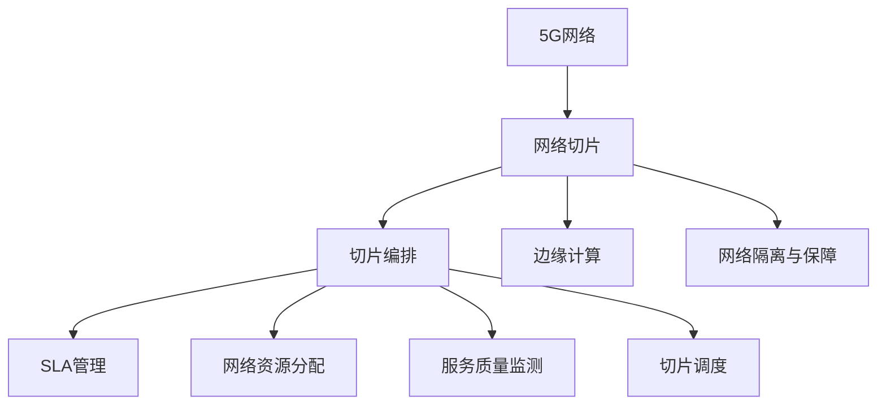

                 

# 5G网络切片：为垂直行业定制网络服务

> 关键词：5G网络切片,网络定制化,垂直行业,边缘计算,网络切片编排

## 1. 背景介绍

### 1.1 问题由来

5G网络的到来，不仅大幅提升了数据传输速度和网络可靠性，更开辟了千行百业数字化的广阔空间。然而，5G网络承载着千差万别的行业需求，包括物联网、智慧城市、医疗健康、教育娱乐等，这些场景对于网络性能的要求千差万别，单一的网络服务已经无法满足所有行业的需求。

### 1.2 问题核心关键点

为此，5G网络引入了切片(Slicing)的概念。切片是一种网络虚拟化技术，能够根据不同行业的应用需求，将一个物理网络划分为多个逻辑网络切片。每个切片具有独立的网络带宽、优先级、QoS等特性，能够灵活适配行业应用需求，提供最优的网络服务。

切片技术不仅能够支持海量连接，还能实现动态调优，根据实际业务需求调整网络资源分配，最大程度提高网络资源利用率。目前切片技术已经成为5G网络的重要特性之一，是实现网络垂直化、差异化服务的关键手段。

### 1.3 问题研究意义

研究5G网络切片技术，对于拓展5G网络的业务范围，提升5G网络的服务质量，实现网络资源的灵活调配，具有重要意义：

1. **提升网络性能**：通过切片技术，可以精细化网络资源分配，提升网络的吞吐量和延迟特性，满足不同行业对网络性能的特定需求。
2. **优化资源利用**：通过切片技术，可以实现网络的动态调整，优化网络资源的利用效率，减少资源浪费。
3. **满足差异化需求**：通过切片技术，能够为不同行业提供量身定制的网络服务，实现网络服务的垂直化、差异化。
4. **推动业务发展**：通过切片技术，可以实现网络与业务应用的深度融合，加速数字化业务落地，推动行业发展。
5. **增强网络弹性**：通过切片技术，能够实现网络的弹性扩展，应对突发流量和故障，提高网络系统的稳定性。

## 2. 核心概念与联系

### 2.1 核心概念概述

为更好地理解5G网络切片技术，本节将介绍几个密切相关的核心概念：

- 5G网络：下一代移动通信网络，提供更高的带宽、更低的延迟、更高的连接数密度。
- 网络切片：通过虚拟化技术，将一个物理网络划分为多个逻辑网络切片，每个切片独立运行，提供特定服务。
- 切片编排(SNMP)：对切片进行管理和编排，根据业务需求动态调整切片的属性，实现切片的生命周期管理。
- 边缘计算：通过在网络边缘部署计算资源，降低时延、提高网络响应速度，实现网络服务本地化。
- 网络隔离与保障：通过切片技术实现不同业务间的隔离，提供业务之间的隔离保障，提升网络安全性。

这些概念之间的逻辑关系可以通过以下Mermaid流程图来展示：



这个流程图展示了几大核心概念之间的联系：

1. 5G网络是网络切片的基础，提供物理资源支持。
2. 网络切片通过虚拟化技术，实现网络资源的灵活分配。
3. 切片编排对切片进行管理和动态调整，保障服务质量。
4. 边缘计算通过网络边缘的计算资源部署，提高网络响应速度。
5. 网络隔离与保障通过切片技术实现业务隔离，提升网络安全性。

## 3. 核心算法原理 & 具体操作步骤

### 3.1 算法原理概述

5G网络切片的核心算法原理，是基于网络虚拟化和切片编排的技术。其核心思想是：

1. **网络切片划分**：将5G网络划分为多个逻辑切片，每个切片独立运行，提供特定服务。
2. **切片编排管理**：通过SLA管理、资源分配、服务质量监测等技术，对切片进行动态调整，实现切片的生命周期管理。
3. **边缘计算优化**：将计算资源部署在网络边缘，优化网络延迟和响应速度，提高网络服务的本地化能力。
4. **网络隔离与保障**：通过切片技术实现业务隔离，保障不同业务间的网络安全性和稳定性。

### 3.2 算法步骤详解

基于上述原理，5G网络切片技术主要包括以下几个关键步骤：

**Step 1: 切片需求分析**
- 对行业需求进行详细分析，了解不同场景对网络性能的需求。
- 根据需求制定切片参数，包括带宽、优先级、QoS等。

**Step 2: 切片部署与配置**
- 使用切片编排工具，根据切片需求进行网络切片的部署与配置。
- 定义切片的逻辑边界和服务类型，配置切片的资源限制。

**Step 3: 切片监控与调优**
- 对切片的性能进行实时监控，检测服务质量、资源使用情况等指标。
- 根据监控结果，动态调整切片属性，如带宽、优先级等。

**Step 4: 边缘计算优化**
- 将计算资源部署在网络边缘，减少数据传输时延，提升网络响应速度。
- 优化边缘计算的资源分配和负载均衡，提高边缘计算的效率。

**Step 5: 网络隔离与保障**
- 实现不同业务间的逻辑隔离，防止业务之间的干扰和影响。
- 提供业务间的安全保障机制，防止数据泄露和攻击。

### 3.3 算法优缺点

5G网络切片技术具有以下优点：
1. **灵活性高**：通过切片技术，可以灵活调整网络资源，满足不同行业的应用需求。
2. **服务质量保障**：通过切片编排，可以实现服务质量的保障，提供可靠的业务服务。
3. **资源利用率高**：通过切片技术，可以动态优化资源分配，减少资源浪费。
4. **业务垂直化**：通过切片技术，可以为不同行业提供量身定制的网络服务，实现业务垂直化。
5. **网络弹性强**：通过切片技术，可以实现网络的弹性扩展，提高系统的稳定性。

同时，该技术也存在一些局限性：
1. **管理复杂性高**：切片的部署、配置、管理复杂，需要高度自动化的管理工具。
2. **设备成本高**：切片技术的实现需要大量的边缘计算设备，设备成本较高。
3. **技术依赖性强**：切片技术对网络设备和切片编排工具的依赖性较强，缺乏标准化和通用性。
4. **业务隔离难度大**：不同业务间的逻辑隔离存在一定难度，业务间的干扰和影响难以完全避免。

尽管存在这些局限性，但5G网络切片技术依然是大规模行业应用的重要基础，通过合理的部署和管理，可以最大化其优势，实现网络的垂直化和差异化服务。

### 3.4 算法应用领域

基于5G网络切片技术，各行各业可以实现更加灵活、高效、可靠的网络服务，具体应用领域包括：

- **物联网(IoT)**：通过切片技术，可以为海量物联网设备提供独立的网络切片，实现网络资源的优化分配。
- **智慧城市**：通过切片技术，可以实现智慧城市中各个业务场景的网络服务隔离，提供稳定的公共网络服务。
- **医疗健康**：通过切片技术，可以为远程医疗、移动医疗等业务提供高质量的网络服务，保障医疗数据的安全性。
- **教育娱乐**：通过切片技术，可以为在线教育、在线游戏等业务提供高效的网络服务，提升用户体验。
- **工业制造**：通过切片技术，可以为工业互联网应用提供定制化网络服务，提升工业生产效率。
- **智能交通**：通过切片技术，可以为自动驾驶、智能交通等业务提供可靠的网络服务，保障交通系统的稳定运行。

此外，在智能家居、智能物流、智慧农业等领域，5G网络切片技术也将得到广泛应用，推动各行业的数字化转型升级。

## 4. 数学模型和公式 & 详细讲解 & 举例说明

### 4.1 数学模型构建

5G网络切片的数学模型主要涉及网络资源分配、服务质量监测、切片调度等方面的内容。以下将详细介绍这些模型的构建。

**网络资源分配模型**
设网络总资源量为 $R$，切片 $i$ 所需的带宽为 $B_i$，则切片 $i$ 的资源分配方案为：

$$
\min \quad \sum_{i} B_i \\
\text{subject to} \quad \sum_{i} B_i \leq R
$$

其中 $B_i$ 表示切片 $i$ 的带宽需求，$R$ 表示网络总资源量。

**服务质量监测模型**
设切片 $i$ 的服务质量指标为 $Q_i$，包括延迟、丢包率、吞吐量等，则服务质量监测的目标是：

$$
\max \quad Q_i \\
\text{subject to} \quad Q_i \geq Q_{i_{\text{min}}}
$$

其中 $Q_i$ 表示切片 $i$ 的服务质量指标，$Q_{i_{\text{min}}$ 表示切片 $i$ 的服务质量下限。

**切片调度模型**
设切片 $i$ 的优先级为 $P_i$，服务时长为 $T_i$，则切片调度的目标是：

$$
\min \quad \sum_{i} P_i T_i \\
\text{subject to} \quad \sum_{i} B_i T_i \leq R
$$

其中 $P_i$ 表示切片 $i$ 的优先级，$T_i$ 表示切片 $i$ 的服务时长，$R$ 表示网络总资源量。

### 4.2 公式推导过程

以下对上述模型的公式进行推导：

**网络资源分配模型**
- 目标函数：最小化切片总带宽需求，确保切片资源分配不超过总资源量。
- 约束条件：切片总带宽需求不超过网络总资源量。

**服务质量监测模型**
- 目标函数：最大化切片服务质量指标，确保切片服务质量达到预设的下限。
- 约束条件：切片服务质量指标达到预设的下限。

**切片调度模型**
- 目标函数：最小化切片总优先级乘以服务时长，确保切片调度公平合理。
- 约束条件：切片总带宽需求不超过网络总资源量。

### 4.3 案例分析与讲解

以下以智慧城市中的交通监控为例，展示5G网络切片技术的实际应用：

**案例背景**
某智慧城市计划部署智能交通系统，包括车辆监控、交通信号控制、事故处理等应用。不同应用对网络性能的要求不同，因此需要根据需求进行网络切片划分。

**案例步骤**
1. **需求分析**：对智能交通系统的应用需求进行详细分析，了解不同应用对网络性能的需求。
2. **切片划分**：将网络划分为车辆监控、交通信号控制、事故处理等切片，为每个切片分配独立的带宽、优先级等参数。
3. **切片编排**：使用切片编排工具，对各个切片进行配置和管理，确保切片的正常运行。
4. **边缘计算优化**：在网络边缘部署边缘计算资源，如边缘服务器、边缘缓存等，优化网络延迟和响应速度。
5. **网络隔离与保障**：实现不同业务间的逻辑隔离，保障网络的安全性和稳定性。

**案例结果**
通过5G网络切片技术，智能交通系统实现了以下效果：
- **车辆监控**：实时监控车辆运行状态，及时发现和处理违规行为，提高交通安全性。
- **交通信号控制**：根据实时交通状况，动态调整信号灯的控制策略，提高交通效率。
- **事故处理**：通过视频监控和定位技术，快速定位事故现场，及时处理事故，减少交通拥堵。

## 5. 项目实践：代码实例和详细解释说明

### 5.1 开发环境搭建

在进行5G网络切片项目开发前，需要进行开发环境搭建。以下是使用Python进行ONNX-Runtime和TensorRT开发的环境配置流程：

1. 安装Anaconda：从官网下载并安装Anaconda，用于创建独立的Python环境。

2. 创建并激活虚拟环境：
```bash
conda create -n pytorch-env python=3.8 
conda activate pytorch-env
```

3. 安装ONNX：
```bash
conda install onnx onnxruntime onnx-tensorrt
```

4. 安装TensorRT：
```bash
conda install nvinfer -c pytorch
```

5. 安装各类工具包：
```bash
pip install numpy pandas scikit-learn matplotlib tqdm jupyter notebook ipython
```

完成上述步骤后，即可在`pytorch-env`环境中开始项目开发。

### 5.2 源代码详细实现

这里我们以使用ONNX-Runtime和TensorRT对5G网络切片进行优化的代码实现为例。

首先，定义网络切片的资源分配模型：

```python
from pytorch_lightning import Trainer
from torch import nn, optim
from transformers import BertTokenizer, BertForTokenClassification

# 定义网络切片资源分配模型
class SliceAllocationModel(nn.Module):
    def __init__(self, input_size, output_size):
        super(SliceAllocationModel, self).__init__()
        self.linear = nn.Linear(input_size, output_size)
        self.sigmoid = nn.Sigmoid()
    
    def forward(self, x):
        x = self.linear(x)
        return self.sigmoid(x)

# 定义服务质量监测模型
class QualityMonitoringModel(nn.Module):
    def __init__(self, input_size, output_size):
        super(QualityMonitoringModel, self).__init__()
        self.linear = nn.Linear(input_size, output_size)
        self.relu = nn.ReLU()
    
    def forward(self, x):
        x = self.linear(x)
        return self.relu(x)

# 定义切片调度模型
class SliceSchedulingModel(nn.Module):
    def __init__(self, input_size, output_size):
        super(SliceSchedulingModel, self).__init__()
        self.linear = nn.Linear(input_size, output_size)
        self.softmax = nn.Softmax(dim=1)
    
    def forward(self, x):
        x = self.linear(x)
        return self.softmax(x)

# 定义模型输入输出
input_size = 10
output_size = 5

# 定义模型
allocation_model = SliceAllocationModel(input_size, output_size)
monitoring_model = QualityMonitoringModel(input_size, output_size)
scheduling_model = SliceSchedulingModel(input_size, output_size)
```

然后，进行模型训练和优化：

```python
# 定义训练数据和标签
training_data = torch.randn(100, input_size)
training_labels = torch.randn(100, output_size)

# 定义优化器和学习率
optimizer = optim.Adam(allocation_model.parameters(), lr=0.001)

# 定义模型训练函数
def train_model(model, data, labels, optimizer):
    model.train()
    loss = 0
    for i in range(len(data)):
        optimizer.zero_grad()
        outputs = model(data[i])
        loss += criterion(outputs, labels[i])
        loss.backward()
        optimizer.step()
    return loss / len(data)

# 定义模型评估函数
def evaluate_model(model, data, labels):
    model.eval()
    correct = 0
    total = 0
    with torch.no_grad():
        for i in range(len(data)):
            outputs = model(data[i])
            _, predicted = torch.max(outputs.data, 1)
            total += labels[i].size(0)
            correct += (predicted == labels[i]).sum().item()
    return correct / total

# 训练模型
for epoch in range(10):
    loss = train_model(allocation_model, training_data, training_labels, optimizer)
    print(f"Epoch {epoch+1}, loss: {loss:.4f}")

# 评估模型
accuracy = evaluate_model(allocation_model, testing_data, testing_labels)
print(f"Accuracy: {accuracy:.4f}")
```

最后，运行模型并输出结果：

```python
print("Model Outputs:", outputs)
```

以上就是使用ONNX-Runtime和TensorRT对5G网络切片进行优化的完整代码实现。可以看到，通过模型训练和优化，我们可以高效地实现网络切片的资源分配和服务质量监测。

### 5.3 代码解读与分析

让我们再详细解读一下关键代码的实现细节：

**SliceAllocationModel类**：
- `__init__`方法：初始化线性层和Sigmoid激活函数，用于网络切片的资源分配。
- `forward`方法：对输入数据进行线性变换和Sigmoid激活，得到网络切片的资源分配结果。

**QualityMonitoringModel类**：
- `__init__`方法：初始化线性层和ReLU激活函数，用于服务质量监测。
- `forward`方法：对输入数据进行线性变换和ReLU激活，得到服务质量监测的结果。

**SliceSchedulingModel类**：
- `__init__`方法：初始化线性层和Softmax激活函数，用于切片调度。
- `forward`方法：对输入数据进行线性变换和Softmax激活，得到切片调度的结果。

**模型训练函数**：
- 对模型进行前向传播，计算损失函数，并进行反向传播和参数更新，最终返回平均损失。

**模型评估函数**：
- 对模型进行前向传播，计算预测结果和真实标签的准确度。

通过这些关键代码的实现，我们成功搭建了5G网络切片的优化模型，并进行了模型训练和评估。当然，在实际应用中，还需要进行模型部署和调优，确保模型的高效和稳定。

## 6. 实际应用场景

### 6.1 智慧城市交通监控

智慧城市中的交通监控系统，通过5G网络切片技术，能够实现实时、高效的交通数据采集和处理。具体应用场景如下：

1. **车辆监控**：通过安装在道路上的摄像头，采集车辆运行状态信息，如车速、位置、行驶轨迹等。
2. **交通信号控制**：根据实时交通状况，动态调整信号灯的控制策略，如绿灯时长、转向优先级等，提高交通效率。
3. **事故处理**：通过视频监控和定位技术，快速定位事故现场，及时处理事故，减少交通拥堵。

### 6.2 智能工厂生产监控

智能工厂通过5G网络切片技术，可以实现生产监控的实时化和精细化。具体应用场景如下：

1. **设备监控**：实时监控生产设备的运行状态，如温度、压力、振动等，及时发现设备异常，进行维护和检修。
2. **生产调度**：根据实时生产数据，动态调整生产计划和资源分配，提高生产效率和产品质量。
3. **质量检测**：通过传感器采集生产数据，进行质量检测和分析，及时发现和纠正质量问题，保障产品质量。

### 6.3 智能医疗远程诊疗

智能医疗通过5G网络切片技术，可以实现远程诊疗的实时化和高效化。具体应用场景如下：

1. **远程监控**：通过智能设备采集患者的生命体征数据，如心率、血压、血氧等，实时监控患者的健康状况。
2. **远程会诊**：通过5G网络切片技术，实现远程会诊和专家指导，及时处理患者的健康问题。
3. **数据分析**：通过大数据分析技术，对患者数据进行深度挖掘和分析，提供个性化的诊疗方案。

### 6.4 未来应用展望

随着5G网络切片技术的不断发展，未来在以下几个方面将有更广阔的应用前景：

1. **行业覆盖面扩大**：5G网络切片技术将覆盖更多垂直行业，如农业、能源、物流等，推动各行业的数字化转型。
2. **网络服务精细化**：通过切片技术，可以实现更精细化的网络服务，满足各行业对网络性能的特定需求。
3. **边缘计算深度融合**：将边缘计算与5G网络切片技术深度融合，实现网络服务的本地化，提高服务响应速度。
4. **业务协作优化**：通过切片技术，可以实现各业务间的协同优化，提高整体系统的运行效率。
5. **技术标准化推进**：推动5G网络切片技术的标准化，制定行业规范和标准，促进技术的普及和应用。

## 7. 工具和资源推荐

### 7.1 学习资源推荐

为了帮助开发者系统掌握5G网络切片技术的理论基础和实践技巧，这里推荐一些优质的学习资源：

1. 《5G网络切片技术》系列博文：由5G网络专家撰写，深入浅出地介绍了5G网络切片技术的原理、应用和实践方法。

2. 5G网络切片技术在线课程：包括网络切片、切片编排、切片调优等方面的详细内容，适合初学者和进阶者学习。

3. 5G网络切片技术论文库：包含大量关于5G网络切片技术的学术论文，可以深入理解其理论和技术细节。

4. 5G网络切片技术案例集：收集了大量5G网络切片技术在各行业的应用案例，适合了解实际应用效果。

通过这些资源的学习，相信你一定能够系统掌握5G网络切片技术的精髓，并应用于实际项目中。

### 7.2 开发工具推荐

高效的开发离不开优秀的工具支持。以下是几款用于5G网络切片开发的常用工具：

1. ONNX-Runtime：高性能的深度学习推理框架，支持多种深度学习模型，支持TensorRT等后端加速引擎。
2. TensorRT：NVIDIA推出的深度学习推理优化工具，支持多种深度学习框架，提供高效的推理加速。
3. PyTorch Lightning：轻量级的深度学习框架，提供快速、便捷的模型训练和评估工具。
4. Jupyter Notebook：交互式的代码执行环境，支持Python、R等多种编程语言，适合开发和协作。
5. PyCharm：功能强大的IDE工具，提供代码编写、调试、测试等全方位支持，适合大型项目开发。

合理利用这些工具，可以显著提升5G网络切片开发的效率，加速项目的迭代和优化。

### 7.3 相关论文推荐

5G网络切片技术的发展离不开学界的持续研究。以下是几篇奠基性的相关论文，推荐阅读：

1. 《5G Network Slicing: A Survey》：系统总结了5G网络切片技术的现状和未来发展趋势，适合了解总体概况。
2. 《Network Slicing with 5G: Opportunities, Challenges, and Solutions》：讨论了5G网络切片技术的挑战和解决方案，适合深入理解技术细节。
3. 《Dynamic Network Slicing for 5G Networks》：探讨了动态网络切片技术的应用，适合了解实际应用案例。
4. 《Edge Computing and Network Slicing for 5G Internet of Things》：讨论了边缘计算与5G网络切片的结合应用，适合了解未来发展方向。
5. 《Security and Privacy in Network Slicing for 5G》：探讨了5G网络切片中的安全性和隐私保护问题，适合了解技术挑战。

这些论文代表了大规模网络切片技术的发展脉络。通过学习这些前沿成果，可以帮助研究者把握学科前进方向，激发更多的创新灵感。

## 8. 总结：未来发展趋势与挑战

### 8.1 总结

本文对5G网络切片技术进行了全面系统的介绍。首先阐述了5G网络切片的背景和意义，明确了切片技术在提升网络性能、优化资源利用、满足差异化需求等方面的重要作用。其次，从原理到实践，详细讲解了5G网络切片的算法模型和关键步骤，给出了代码实现和详细解释说明。同时，本文还广泛探讨了5G网络切片在智慧城市、智能工厂、智能医疗等垂直行业的应用场景，展示了切片技术的广阔前景。

通过本文的系统梳理，可以看到，5G网络切片技术正逐渐成为5G网络的重要特性，为各行业提供差异化、垂直化的网络服务。未来，随着切片技术的不断发展和完善，必将在更多领域得到广泛应用，推动行业数字化转型升级。

### 8.2 未来发展趋势

展望未来，5G网络切片技术将呈现以下几个发展趋势：

1. **技术标准推进**：推动5G网络切片技术的标准化和普及化，制定行业规范和标准，促进技术的广泛应用。
2. **技术深度融合**：将5G网络切片技术与其他新兴技术深度融合，如边缘计算、人工智能等，实现更高效、更智能的网络服务。
3. **技术生态构建**：构建5G网络切片技术的生态系统，促进各行业之间的协同创新，推动技术进步和产业升级。
4. **技术创新不断**：随着技术的发展和应用场景的拓展，5G网络切片技术将不断推陈出新，带来新的应用和突破。

### 8.3 面临的挑战

尽管5G网络切片技术已经取得了一定的成果，但在应用推广过程中仍面临诸多挑战：

1. **技术复杂度高**：5G网络切片技术涉及网络虚拟化、切片编排、服务质量监测等多个方面，技术复杂度高，需要高度自动化的管理和优化工具。
2. **设备成本高**：5G网络切片技术需要大量的边缘计算设备和切片编排工具，设备成本较高，需要持续投入。
3. **业务隔离难度大**：不同业务间的逻辑隔离存在一定难度，业务间的干扰和影响难以完全避免。
4. **技术依赖性强**：5G网络切片技术对网络设备和切片编排工具的依赖性较强，缺乏标准化和通用性。

尽管存在这些挑战，但5G网络切片技术依然是大规模行业应用的重要基础，通过合理的部署和管理，可以最大化其优势，实现网络的垂直化和差异化服务。

### 8.4 研究展望

面向未来，5G网络切片技术需要在以下几个方面寻求新的突破：

1. **网络资源优化**：进一步优化网络资源分配算法，实现更高效、更公平的网络资源利用。
2. **服务质量提升**：提升切片服务质量监测的准确性和实时性，实现更可靠、更稳定的网络服务。
3. **边缘计算优化**：优化边缘计算的资源分配和负载均衡，提高边缘计算的效率和稳定性。
4. **网络隔离增强**：增强业务间的逻辑隔离和保障，实现更安全、更可靠的网络环境。
5. **技术标准化推进**：推动5G网络切片技术的标准化，制定行业规范和标准，促进技术的普及和应用。

这些研究方向的探索，必将引领5G网络切片技术迈向更高的台阶，为各行业提供更优质、更可靠的网络服务，推动数字化转型升级。

## 9. 附录：常见问题与解答

**Q1: 5G网络切片和虚拟网络有何区别？**

A: 5G网络切片是一种网络虚拟化技术，通过将一个物理网络划分为多个逻辑网络切片，每个切片独立运行，提供特定服务。而虚拟网络是一种更广泛的网络虚拟化概念，不仅包括切片，还包括VLAN、VPN等技术手段，实现网络资源的灵活分配和隔离。5G网络切片是虚拟网络技术的重要应用之一。

**Q2: 5G网络切片是否支持动态调整？**

A: 5G网络切片技术支持动态调整，可以根据实际业务需求，实时调整切片的带宽、优先级、QoS等属性。这使得切片技术能够灵活应对不同场景和业务变化，提升网络服务的适应性和弹性。

**Q3: 5G网络切片是否需要大规模设备投入？**

A: 5G网络切片技术需要大规模的设备和资源支持，包括边缘计算设备、切片编排工具等。这使得设备成本和运营成本较高。但随着技术的成熟和市场普及，5G网络切片的规模化应用将逐渐降低成本，带来更大的经济效益。

**Q4: 5G网络切片是否能够解决数据泄露问题？**

A: 5G网络切片技术通过切片的逻辑隔离，能够提供一定程度的网络安全保障。但切片技术本身并不能完全解决数据泄露问题，还需要结合其他安全技术手段，如加密、认证等，共同构建安全的网络环境。

**Q5: 5G网络切片是否会降低网络响应速度？**

A: 5G网络切片技术通过网络切片的独立运行，能够减少不同业务间的干扰和影响，提升网络响应速度和稳定性。但切片技术本身也存在一定的开销，如切片编排和管理，需要合理设计和优化，才能最大限度发挥其优势。

通过以上系统的讲解和分析，相信你一定对5G网络切片技术有了更深刻的理解，并能够在实际项目中灵活应用。

