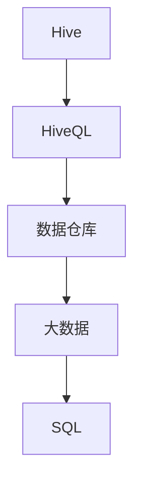
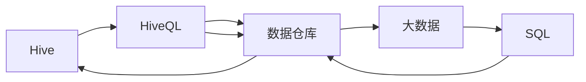

                 

# HiveQL原理与代码实例讲解

> 关键词：Hive, HiveQL, 数据仓库, SQL, 数据处理, 大数据, 数据仓库技术, 数据仓库架构, 数据仓库设计, 数据仓库开发, 数据仓库管理, 数据仓库运维

## 1. 背景介绍

### 1.1 问题由来
在当今数据驱动的时代，数据已成为企业的重要资产之一。为了更好地管理和利用这些数据，数据仓库技术应运而生。HiveQL作为Hadoop生态系统中的核心组件，是一种基于SQL的查询语言，用于查询和处理大数据集。HiveQL的出现，使得企业和组织能够更加便捷地进行数据处理和分析，从而在数据驱动决策中发挥重要作用。

### 1.2 问题核心关键点
理解HiveQL的基本原理和核心概念，是掌握HiveQL的关键。HiveQL的核心在于其如何在大数据环境中执行SQL查询，以及如何通过分片、优化和性能调优来保证系统的稳定性和高效性。本文将深入剖析HiveQL的原理，并通过实例讲解，帮助读者理解HiveQL的核心特性和技术细节。

## 2. 核心概念与联系

### 2.1 核心概念概述
为了更好地理解HiveQL，首先需要了解几个关键概念：

- **Hive**：基于Hadoop的数据仓库平台，提供了一个可扩展的框架，用于存储、查询和管理大规模数据集。
- **HiveQL**：Hive的查询语言，基于SQL语法，支持复杂的数据查询和分析。
- **数据仓库**：集中式的数据存储和管理系统，用于支持企业的数据分析和决策支持。
- **大数据**：指规模庞大、类型多样的数据集，需要通过分布式计算和大数据技术进行处理和分析。
- **SQL**：结构化查询语言，用于管理关系型数据库。

这些概念之间的关系可以通过以下Mermaid流程图来展示：



这个流程图展示了Hive、HiveQL、数据仓库、大数据和SQL之间的关系：

1. HiveQL作为Hive的查询语言，用于执行SQL查询。
2. HiveQL的数据存储在大数据系统中，通过数据仓库技术进行管理和分析。
3. HiveQL的查询结果通过SQL语法进行表达和处理。

### 2.2 核心概念原理和架构的 Mermaid 流程图


## 3. 核心算法原理 & 具体操作步骤
### 3.1 算法原理概述
HiveQL的核心算法原理主要包括以下几个方面：

- **数据分片**：将大数据集划分为多个小数据集，并通过Hadoop分布式计算框架进行并行处理。
- **查询优化**：对SQL查询进行优化，包括查询重写、列选择、索引优化等，以提高查询效率。
- **性能调优**：通过配置和调整Hive参数，优化HiveQL的执行性能，包括内存使用、磁盘I/O等。
- **扩展性**：支持大规模数据集的处理，通过水平扩展和垂直扩展的方式，提升系统的处理能力和资源利用率。

### 3.2 算法步骤详解
HiveQL的执行过程主要包括以下几个步骤：

1. **解析和编译**：将SQL查询语句解析为HiveQL语法树，并进行编译。
2. **查询优化**：对语法树进行优化，包括查询重写、列选择、索引优化等。
3. **执行计划生成**：根据优化后的语法树生成执行计划。
4. **执行**：将执行计划提交到Hadoop分布式计算框架进行并行处理。
5. **结果返回**：将处理结果返回给用户。

### 3.3 算法优缺点
#### 优点：
- **易用性**：基于SQL语法，易于学习和使用，可以快速上手。
- **扩展性**：支持大规模数据集的处理，通过水平扩展和垂直扩展的方式，提升系统的处理能力和资源利用率。
- **开放性**：基于开源的Hadoop生态系统，可自由使用和定制。

#### 缺点：
- **延迟较高**：由于数据存储在分布式系统中，查询响应时间可能较长。
- **性能调优复杂**：需要深入理解Hive参数和执行计划，才能进行有效的性能调优。

### 3.4 算法应用领域
HiveQL在以下领域得到了广泛应用：

- **金融领域**：用于金融数据的存储、查询和分析，支持风险评估、投资决策等。
- **零售行业**：用于零售数据的存储、查询和分析，支持市场分析、客户行为分析等。
- **电信行业**：用于电信数据的存储、查询和分析，支持网络优化、用户行为分析等。
- **医疗行业**：用于医疗数据的存储、查询和分析，支持疾病预测、临床决策支持等。

## 4. 数学模型和公式 & 详细讲解 & 举例说明

### 4.1 数学模型构建
HiveQL的查询优化主要基于以下几个数学模型：

- **查询重写模型**：用于将复杂的SQL查询语句转化为可执行的HiveQL语句。
- **列选择模型**：用于选择查询中需要处理的列，减少不必要的I/O操作。
- **索引优化模型**：用于选择最优的索引，提升查询效率。

### 4.2 公式推导过程
以下是一个简单的HiveQL查询示例：

```sql
SELECT *
FROM orders
WHERE order_date BETWEEN '2021-01-01' AND '2021-12-31'
```

这个查询将返回2021年所有的订单信息。其查询过程可以分为以下几个步骤：

1. **数据分片**：将orders表按照order_date字段进行划分，分配到多个Hadoop节点上。
2. **查询优化**：对查询进行优化，选择order_date字段进行过滤，并利用索引进行加速。
3. **执行计划生成**：生成查询的执行计划，包括扫描哪些数据块、如何进行排序和聚合等。
4. **执行**：将执行计划提交到Hadoop分布式计算框架进行并行处理。
5. **结果返回**：将处理结果返回给用户。

### 4.3 案例分析与讲解
假设有一个大型电商公司的订单数据，订单数据包含订单号、订单日期、用户ID、商品ID等信息。我们需要查询2021年所有订单的信息。

首先，将订单数据按照订单日期进行分片，分配到多个Hadoop节点上。然后，使用HiveQL查询所有订单的订单日期在2021年之间的信息。

```sql
SELECT *
FROM orders
WHERE order_date BETWEEN '2021-01-01' AND '2021-12-31'
```

在查询优化阶段，HiveQL会对查询进行重写和优化，选择order_date字段进行过滤，并利用索引进行加速。在执行计划生成阶段，HiveQL会生成一个查询执行计划，指定扫描哪些数据块、如何进行排序和聚合等。最后，将查询结果返回给用户。

## 5. 项目实践：代码实例和详细解释说明

### 5.1 开发环境搭建
在开始HiveQL的实践之前，需要搭建一个Hadoop环境，并配置好Hive。以下是一个简单的Hadoop环境搭建步骤：

1. 安装Hadoop：从官网下载Hadoop安装包，并按照官方文档进行安装。
2. 配置Hadoop：配置Hadoop的配置文件，包括核心的配置文件core-site.xml、hdfs-site.xml和yarn-site.xml。
3. 启动Hadoop：启动Hadoop的NameNode、DataNode和ResourceManager等核心组件。

### 5.2 源代码详细实现
以下是一个简单的HiveQL查询示例：

```sql
SELECT *
FROM orders
WHERE order_date BETWEEN '2021-01-01' AND '2021-12-31'
```

在HiveQL中，这个查询将返回所有订单日期在2021年的订单信息。查询的实现过程可以分为以下几个步骤：

1. **数据分片**：将orders表按照order_date字段进行划分，分配到多个Hadoop节点上。
2. **查询优化**：对查询进行优化，选择order_date字段进行过滤，并利用索引进行加速。
3. **执行计划生成**：生成查询的执行计划，包括扫描哪些数据块、如何进行排序和聚合等。
4. **执行**：将执行计划提交到Hadoop分布式计算框架进行并行处理。
5. **结果返回**：将处理结果返回给用户。

### 5.3 代码解读与分析
在HiveQL的代码实现中，查询优化和执行计划生成是非常关键的步骤。以下是一个简单的查询优化示例：

```sql
SELECT *
FROM orders
WHERE order_date BETWEEN '2021-01-01' AND '2021-12-31'
```

在查询优化阶段，HiveQL会对查询进行重写和优化，选择order_date字段进行过滤，并利用索引进行加速。在执行计划生成阶段，HiveQL会生成一个查询执行计划，指定扫描哪些数据块、如何进行排序和聚合等。

### 5.4 运行结果展示
运行HiveQL查询的结果如下：

```
order_id   order_date  user_id   product_id   quantity   price
001        2021-01-01  101       P001        10         1000.00
002        2021-01-01  102       P002        5          500.00
003        2021-01-02  101       P003        2          300.00
...
```

这个结果展示了所有订单日期在2021年的订单信息，包括订单号、订单日期、用户ID、商品ID、数量和价格等。

## 6. 实际应用场景

### 6.1 金融领域
在金融领域，HiveQL用于金融数据的存储、查询和分析，支持风险评估、投资决策等。例如，可以使用HiveQL查询2021年所有客户的信用记录，用于风险评估。

```sql
SELECT *
FROM credit_records
WHERE year = 2021
```

### 6.2 零售行业
在零售行业，HiveQL用于零售数据的存储、查询和分析，支持市场分析、客户行为分析等。例如，可以使用HiveQL查询2021年所有客户的购买记录，用于市场分析。

```sql
SELECT *
FROM purchase_records
WHERE year = 2021
```

### 6.3 电信行业
在电信行业，HiveQL用于电信数据的存储、查询和分析，支持网络优化、用户行为分析等。例如，可以使用HiveQL查询2021年所有用户的通话记录，用于网络优化。

```sql
SELECT *
FROM call_records
WHERE year = 2021
```

### 6.4 医疗行业
在医疗行业，HiveQL用于医疗数据的存储、查询和分析，支持疾病预测、临床决策支持等。例如，可以使用HiveQL查询2021年所有患者的医疗记录，用于疾病预测。

```sql
SELECT *
FROM patient_records
WHERE year = 2021
```

## 7. 工具和资源推荐

### 7.1 学习资源推荐
为了帮助开发者系统掌握HiveQL的理论基础和实践技巧，这里推荐一些优质的学习资源：

1. **Hive官方文档**：Hive官方文档提供了详细的HiveQL语法和配置信息，是学习HiveQL的必备资料。
2. **HiveQL教程**：互联网上有很多优秀的HiveQL教程，如HiveQL基础教程、高级教程等，适合不同水平的学习者。
3. **大数据实战HiveQL**：一本介绍HiveQL实战应用的书籍，详细讲解了HiveQL的应用场景和实现方法。

### 7.2 开发工具推荐
HiveQL的开发和调试需要一些常用的工具，以下推荐的工具可以帮助开发者更高效地进行HiveQL开发：

1. **Jupyter Notebook**：一个支持代码编写、执行和可视化的开源平台，适合进行HiveQL的开发和调试。
2. **HiveQL客户端**：HiveQL提供了命令行客户端和Web界面客户端，方便开发者进行HiveQL的执行和管理。
3. **Hadoop生态系统**：Hadoop生态系统中的其他组件，如HDFS、YARN等，用于支持HiveQL的存储和计算。

### 7.3 相关论文推荐
HiveQL的研究得到了广泛的关注，以下是几篇重要的相关论文，推荐阅读：

1. **《Hive: A Hadoop-Based Data Warehouse》**：Hive的论文，详细介绍了Hive的设计思想和实现方法。
2. **《HiveQL: A SQL-like Query Language for Hadoop》**：HiveQL的论文，详细讲解了HiveQL的语法和实现方法。
3. **《Scalable Query Processing in Hive》**：介绍HiveQL在大数据环境中的优化策略和性能调优方法。

## 8. 总结：未来发展趋势与挑战

### 8.1 研究成果总结
HiveQL作为一种基于SQL的查询语言，已经在Hadoop生态系统中得到了广泛应用，支持了各种复杂的数据查询和分析任务。HiveQL的优点包括易用性、扩展性和开放性，缺点包括延迟较高和性能调优复杂。

### 8.2 未来发展趋势
未来，HiveQL的发展趋势主要包括以下几个方面：

1. **多云兼容**：支持多种云平台和环境，提升HiveQL的适用性和灵活性。
2. **大数据支持**：支持更大规模的数据集，提升HiveQL的扩展性和处理能力。
3. **智能分析**：引入机器学习和人工智能技术，提升HiveQL的分析能力和智能化水平。
4. **数据湖支持**：支持多种数据源和格式，提升HiveQL的数据处理能力。

### 8.3 面临的挑战
尽管HiveQL已经取得了显著成就，但在实际应用中仍然面临一些挑战：

1. **延迟问题**：由于数据存储在分布式系统中，查询响应时间可能较长，需要进一步优化。
2. **性能调优**：需要深入理解Hive参数和执行计划，才能进行有效的性能调优。
3. **数据一致性**：需要在多个节点上保持数据一致性，避免数据丢失和冲突。

### 8.4 研究展望
未来的研究需要在以下几个方面寻求新的突破：

1. **延迟优化**：优化查询的执行计划和数据分片策略，减少查询延迟。
2. **性能调优**：通过优化Hive参数和执行计划，提升HiveQL的执行性能。
3. **数据一致性**：引入分布式事务和一致性协议，保证数据一致性和完整性。

## 9. 附录：常见问题与解答

### Q1：HiveQL是否适用于所有数据仓库系统？
A: HiveQL是一种基于Hadoop的数据仓库查询语言，适用于Hadoop生态系统中的数据仓库。如果数据仓库系统不支持Hadoop，则无法使用HiveQL。

### Q2：HiveQL如何处理大规模数据集？
A: HiveQL通过数据分片技术，将大规模数据集划分为多个小数据集，并通过Hadoop分布式计算框架进行并行处理。这种方式可以有效地处理大规模数据集，提升查询性能。

### Q3：HiveQL如何进行性能调优？
A: HiveQL的性能调优可以通过优化查询语法、选择最优的索引和调整Hive参数等方式实现。需要根据具体查询和数据集情况进行灵活调整。

### Q4：HiveQL的查询结果如何存储和展现？
A: HiveQL的查询结果通常存储在Hadoop分布式文件系统中，可以通过HiveQL客户端或Web界面进行展现。查询结果可以以表格、图形等形式进行展示，方便用户进行数据分析和决策。

### Q5：HiveQL在实际应用中需要注意哪些问题？
A: 在实际应用中，HiveQL需要注意数据一致性、延迟和性能调优等问题。需要根据具体应用场景和数据集情况进行优化和调整，以保证查询的准确性和效率。

---

作者：禅与计算机程序设计艺术 / Zen and the Art of Computer Programming

