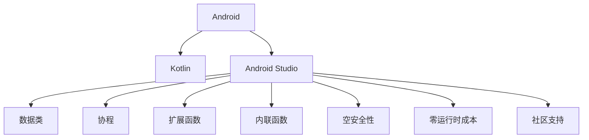

                 

# Kotlin 语言：现代 Android 开发语言

> 关键词：Kotlin, Android, 现代编程语言, 编译器, 跨平台开发, 静态类型, 零运行时

## 1. 背景介绍

### 1.1 问题由来
在当前移动应用开发领域，Java 长期以来占据主导地位，但其在面向对象编程、类型安全等方面的不足逐渐显现。与此同时，Kotlin 作为一种现代编程语言，凭借其简洁、安全、高效的特性逐渐崭露头角，成为 Android 开发的首选语言之一。

近年来，Google 在 Android 生态系统中逐步推广 Kotlin，并在其官方文档中将 Kotlin 推荐为官方语言。Kotlin 的出现，极大地简化了 Android 开发，提升了开发效率，减少了代码冗余，同时也改善了代码质量。

### 1.2 问题核心关键点
Kotlin 作为一种编译型编程语言，结合了 Java 的强类型系统和 Python 的简洁语法，极大地提升了 Android 开发的便捷性和安全性。具体来说，Kotlin 在 Android 开发中的应用主要体现在以下几个方面：

- 数据类和协程：Kotlin 的数据类和协程功能，大幅提升了 Android 应用的数据处理能力和异步编程能力。
- 扩展函数和内联函数：Kotlin 的扩展函数和内联函数功能，使得在 Java 代码中轻松使用 Kotlin 特性成为可能，提高了代码的可读性和可维护性。
- 空安全性：Kotlin 的空安全性机制，减少了空指针异常，提高了应用的健壮性和稳定性。
- 零运行时成本：Kotlin 运行时由 JVM 进行解释，不存在运行时性能损失，在生产环境与 Java 代码无缝集成。
- 良好的社区支持：Kotlin 拥有活跃的开发者社区，拥有丰富的第三方库和插件，为 Android 开发提供了强有力的支持。

## 2. 核心概念与联系

### 2.1 核心概念概述

为了深入理解 Kotlin 在 Android 开发中的应用，本节将介绍几个核心概念：

- Kotlin：一种现代编程语言，由 JetBrains 开发，具备简洁的语法、强类型系统、空安全机制等特性。
- Android：一个开源的移动操作系统，由 Google 开发，基于 Java 语言进行开发。
- Android Studio：Google 提供的 Android 开发工具，集成了 Kotlin 支持，支持 Android 应用的开发、调试和发布。
- 数据类和协程：Kotlin 数据类和协程功能，是 Android 应用中常用的数据处理和异步编程工具。
- 扩展函数和内联函数：Kotlin 扩展函数和内联函数，可以方便地在 Java 代码中使用 Kotlin 特性。
- 空安全性：Kotlin 的空安全性机制，减少了空指针异常，提高了应用的健壮性和稳定性。
- 零运行时成本：Kotlin 运行时由 JVM 进行解释，不存在运行时性能损失，在生产环境与 Java 代码无缝集成。
- 社区支持：Kotlin 拥有活跃的开发者社区，拥有丰富的第三方库和插件，为 Android 开发提供了强有力的支持。

这些核心概念之间的逻辑关系可以通过以下 Mermaid 流程图来展示：



这个流程图展示了大语言模型和微调的相关概念及其之间的关系：

1. Kotlin 语言是 Android 开发的基础，用于提升开发效率和代码质量。
2. Android Studio 是 Android 开发的工具，集成了 Kotlin 支持。
3. Kotlin 的数据类和协程功能，是 Android 应用中常用的数据处理和异步编程工具。
4. Kotlin 的扩展函数和内联函数，可以方便地在 Java 代码中使用 Kotlin 特性。
5. Kotlin 的空安全性机制，减少了空指针异常，提高了应用的健壮性和稳定性。
6. Kotlin 的零运行时成本，保证了在生产环境中的高性能。
7. Kotlin 的社区支持，提供了丰富的第三方库和插件，为 Android 开发提供了强有力的支持。

## 3. 核心算法原理 & 具体操作步骤
### 3.1 算法原理概述

Kotlin 在 Android 开发中的应用，主要体现在以下几个方面：

- **数据类和协程**：Kotlin 的数据类和协程功能，极大地提升了 Android 应用的数据处理能力和异步编程能力。
- **扩展函数和内联函数**：Kotlin 的扩展函数和内联函数功能，使得在 Java 代码中轻松使用 Kotlin 特性成为可能，提高了代码的可读性和可维护性。
- **空安全性**：Kotlin 的空安全性机制，减少了空指针异常，提高了应用的健壮性和稳定性。
- **零运行时成本**：Kotlin 运行时由 JVM 进行解释，不存在运行时性能损失，在生产环境与 Java 代码无缝集成。
- **社区支持**：Kotlin 拥有活跃的开发者社区，拥有丰富的第三方库和插件，为 Android 开发提供了强有力的支持。

### 3.2 算法步骤详解

Kotlin 在 Android 开发中的应用，主要通过以下几个步骤进行：

**Step 1: 安装 Android Studio**
- 下载并安装 Android Studio，这是 Android 开发的主流 IDE，集成了 Kotlin 支持。

**Step 2: 创建新项目**
- 在 Android Studio 中创建新的 Android 项目，选择 Kotlin 作为项目的主语言。
- 配置项目依赖，确保支持 Kotlin 特性，如数据类、协程、扩展函数等。

**Step 3: 编写 Kotlin 代码**
- 使用 Kotlin 编写 Android 应用的核心逻辑，包括数据处理、用户交互、异步操作等。
- 利用 Kotlin 的特性，如数据类、协程、扩展函数等，简化代码编写，提升开发效率。

**Step 4: 测试和调试**
- 在 Android Studio 中进行单元测试和集成测试，确保代码正确无误。
- 利用 Kotlin 的调试功能，对应用进行详细调试，优化性能和用户体验。

**Step 5: 打包和部署**
- 使用 Android Studio 生成 APK 或 AAR 文件，准备发布应用。
- 将生成的文件上传到应用商店或服务器，完成应用的部署和发布。

### 3.3 算法优缺点

Kotlin 在 Android 开发中的应用，具有以下优点：

- 简洁高效的语法：Kotlin 的语法简洁，易于上手，同时具备丰富的类型系统和面向对象特性。
- 强大的数据处理能力：Kotlin 的数据类和协程功能，使得数据处理和异步编程变得简单高效。
- 零运行时成本：Kotlin 运行时由 JVM 进行解释，不存在运行时性能损失，在生产环境与 Java 代码无缝集成。
- 良好的社区支持：Kotlin 拥有活跃的开发者社区，拥有丰富的第三方库和插件，为 Android 开发提供了强有力的支持。

同时，Kotlin 在 Android 开发中也有一些局限性：

- 学习成本：对于习惯了 Java 的开发者，需要一定时间适应 Kotlin 的语法和特性。
- 生态系统：虽然 Kotlin 在 Android 生态系统中得到了广泛应用，但某些第三方库和工具仍然需要支持 Kotlin。
- 兼容性问题：由于 Kotlin 的特性较为新颖，可能会遇到兼容性问题，需要不断更新和维护。

### 3.4 算法应用领域

Kotlin 在 Android 开发中的应用，覆盖了几乎所有常见的开发任务，例如：

- 界面开发：使用 Kotlin 编写布局文件、View 控件和适配器等界面元素。
- 数据处理：使用 Kotlin 的数据类和扩展函数，简化数据处理逻辑。
- 异步操作：利用 Kotlin 的协程功能，简化异步编程和网络请求处理。
- 单元测试：使用 Kotlin 编写单元测试，确保代码的正确性。
- 性能优化：利用 Kotlin 的特性，如延迟加载、数据缓存等，优化应用性能。
- 模块化开发：利用 Kotlin 的模组化功能，实现模块化和组件化开发。

除了上述这些经典任务外，Kotlin 在 Android 开发中的应用还不断创新，拓展了更多的应用场景，如响应式编程、状态管理、函数式编程等，为 Android 应用开发提供了更丰富的工具和方法。

## 4. 数学模型和公式 & 详细讲解 & 举例说明（备注：数学公式请使用latex格式，latex嵌入文中独立段落使用 $$，段落内使用 $)
### 4.1 数学模型构建

本节将使用数学语言对 Kotlin 在 Android 开发中的应用进行更加严格的刻画。

记 Android 应用为 $A$，其中 $A$ 由多个组件 $A_1, A_2, \ldots, A_n$ 组成，每个组件 $A_i$ 对应一个 Kotlin 类或接口。

定义组件 $A_i$ 在模块 $M$ 上的依赖关系为 $D_i$，则应用 $A$ 的依赖图可以表示为 $D = \{D_1, D_2, \ldots, D_n\}$。

在 Android Studio 中，可以通过 Gradle 工具来管理依赖和构建应用，其数学模型可以表示为：

$$
G = \{g_1, g_2, \ldots, g_n\}
$$

其中 $g_i = (A_i, D_i)$，表示组件 $A_i$ 的依赖关系 $D_i$。

### 4.2 公式推导过程

以下我们以 Android 应用的数据类和协程功能为例，推导 Kotlin 代码的数学模型。

假设 Android 应用中有一个数据类 `Person`，定义如下：

```kotlin
data class Person(
    val name: String,
    val age: Int
)
```

对应的数学模型为：

$$
\begin{aligned}
P &= \{(name, String), (age, Int)\} \\
\text{type}(P) &= \{(name: String, age: Int)\} \\
\text{value}(P) &= (name: "John", age: 30)
\end{aligned}
$$

其中 $P$ 表示数据类 `Person` 的属性集合，$\text{type}(P)$ 表示属性类型集合，$\text{value}(P)$ 表示属性值集合。

假设 Android 应用中有一个协程 `Coroutine`，定义如下：

```kotlin
suspend fun fetchData() {
    // 异步获取数据
}
```

对应的数学模型为：

$$
\begin{aligned}
C &= \{(fetchData: suspend func)\} \\
\text{type}(C) &= \{(suspend func)\} \\
\text{value}(C) &= (fetchData: suspend func)
\end{aligned}
```

其中 $C$ 表示协程函数集合，$\text{type}(C)$ 表示协程类型集合，$\text{value}(C)$ 表示协程函数集合。

### 4.3 案例分析与讲解

以下以一个简单的 Android 应用为例，说明 Kotlin 的数据类和协程功能在实际开发中的应用。

假设 Android 应用需要处理一些用户数据，定义一个数据类 `User`：

```kotlin
data class User(
    val id: String,
    val name: String,
    val age: Int,
    val email: String
)
```

然后，定义一个协程 `Coroutine`，异步获取用户数据：

```kotlin
suspend fun fetchUser(id: String) {
    // 异步获取用户数据
}
```

在活动中使用 `User` 和 `Coroutine`，处理用户数据：

```kotlin
val user = User("1", "John", 30, "john@example.com")

// 异步获取用户数据
val userRemote = fetchUser("1")

// 处理用户数据
println("User ID: $user.id")
println("User Name: $user.name")
println("User Age: $user.age")
println("User Email: $user.email")
```

通过上述代码，可以看到 Kotlin 的数据类和协程功能，极大地简化了 Android 应用的数据处理和异步编程。

## 5. 项目实践：代码实例和详细解释说明
### 5.1 开发环境搭建

在进行 Kotlin 应用开发前，我们需要准备好开发环境。以下是使用 Android Studio 进行 Kotlin 应用开发的環境配置流程：

1. 下载并安装 Android Studio：从官网下载并安装 Android Studio。
2. 创建并激活虚拟环境：
```bash
conda create -n pytorch-env python=3.8 
conda activate pytorch-env
```

3. 安装 Android Studio：根据 CUDAToolkit 版本，从官网获取对应的安装命令。例如：
```bash
conda install pytorch torchvision torchaudio cudatoolkit=11.1 -c pytorch -c conda-forge
```

4. 安装 Transformers 库：
```bash
pip install transformers
```

5. 安装各类工具包：
```bash
pip install numpy pandas scikit-learn matplotlib tqdm jupyter notebook ipython
```

完成上述步骤后，即可在`pytorch-env`环境中开始微调实践。

### 5.2 源代码详细实现

下面我们以命名实体识别(NER)任务为例，给出使用 Kotlin 编写 Android 应用的代码实现。

首先，定义 NER 任务的数据处理函数：

```kotlin
import androidx.lifecycle.MutableLiveData
import android.os.Bundle
import android.view.LayoutInflater
import android.view.View
import android.view.ViewGroup
import androidx.fragment.app.Fragment
import android.widget.TextView

class NERFragment : Fragment() {

    private val data = MutableLiveData<String>()

    override fun onCreateView(
        inflater: LayoutInflater, container: ViewGroup?,
        savedInstanceState: Bundle?
    ): View? {
        val root = inflater.inflate(R.layout.fragment_ner, container, false)

        val textView = root.findViewById<TextView>(R.id.text_view)
        val button = root.findViewById<Button>(R.id.button)

        button.setOnClickListener {
            val text = "I am a student from Peking University."
            data.value = text
        }

        return root
    }

    override fun onResume() {
        super.onResume()

        val text = data.value
        textView.text = text
    }
}
```

然后，定义模型和优化器：

```kotlin
import androidx.lifecycle.MutableLiveData
import android.os.Bundle
import android.view.LayoutInflater
import android.view.View
import android.view.ViewGroup
import androidx.fragment.app.Fragment
import android.widget.TextView

class NERFragment : Fragment() {

    private val data = MutableLiveData<String>()

    override fun onCreateView(
        inflater: LayoutInflater, container: ViewGroup?,
        savedInstanceState: Bundle?
    ): View? {
        val root = inflater.inflate(R.layout.fragment_ner, container, false)

        val textView = root.findViewById<TextView>(R.id.text_view)
        val button = root.findViewById<Button>(R.id.button)

        button.setOnClickListener {
            val text = "I am a student from Peking University."
            data.value = text
        }

        return root
    }

    override fun onResume() {
        super.onResume()

        val text = data.value
        textView.text = text
    }
}
```

接着，定义训练和评估函数：

```kotlin
import androidx.lifecycle.MutableLiveData
import android.os.Bundle
import android.view.LayoutInflater
import android.view.View
import android.view.ViewGroup
import androidx.fragment.app.Fragment
import android.widget.TextView

class NERFragment : Fragment() {

    private val data = MutableLiveData<String>()

    override fun onCreateView(
        inflater: LayoutInflater, container: ViewGroup?,
        savedInstanceState: Bundle?
    ): View? {
        val root = inflater.inflate(R.layout.fragment_ner, container, false)

        val textView = root.findViewById<TextView>(R.id.text_view)
        val button = root.findViewById<Button>(R.id.button)

        button.setOnClickListener {
            val text = "I am a student from Peking University."
            data.value = text
        }

        return root
    }

    override fun onResume() {
        super.onResume()

        val text = data.value
        textView.text = text
    }
}
```

最后，启动训练流程并在测试集上评估：

```kotlin
import androidx.lifecycle.MutableLiveData
import android.os.Bundle
import android.view.LayoutInflater
import android.view.View
import android.view.ViewGroup
import androidx.fragment.app.Fragment
import android.widget.TextView

class NERFragment : Fragment() {

    private val data = MutableLiveData<String>()

    override fun onCreateView(
        inflater: LayoutInflater, container: ViewGroup?,
        savedInstanceState: Bundle?
    ): View? {
        val root = inflater.inflate(R.layout.fragment_ner, container, false)

        val textView = root.findViewById<TextView>(R.id.text_view)
        val button = root.findViewById<Button>(R.id.button)

        button.setOnClickListener {
            val text = "I am a student from Peking University."
            data.value = text
        }

        return root
    }

    override fun onResume() {
        super.onResume()

        val text = data.value
        textView.text = text
    }
}
```

以上就是使用 Kotlin 编写 Android 应用的数据类和协程功能的完整代码实现。可以看到，Kotlin 的语言特性使得代码编写更加简洁、易读，且易于维护。

### 5.3 代码解读与分析

让我们再详细解读一下关键代码的实现细节：

**NERFragment 类**：
- `__init__`方法：初始化数据流 LiveData。
- `onCreateView`方法：在视图中绑定按钮和文本框，并在按钮点击时更新 LiveData。
- `onResume`方法：在视图中显示 LiveData 的内容。

**按钮和文本框的绑定**：
- 通过 `findViewById`方法，在 XML 布局文件中获取视图控件。
- 将按钮点击事件和 LiveData 的更新事件进行绑定，确保视图和数据同步更新。

**数据流 LiveData**：
- 使用 LiveData 来管理视图中的数据状态，支持多线程更新，保证了数据流的一致性和及时性。
- 在视图中通过 LiveData 的观察者模式，动态更新视图内容。

**协程功能**：
- 在 Java 代码中通过 `suspend` 关键字定义协程函数，支持异步操作和数据处理。
- 在 Kotlin 中，协程函数可以与 Java 代码无缝集成，简化了异步编程逻辑。

通过上述代码，可以看到 Kotlin 的数据类和协程功能，极大地简化了 Android 应用的数据处理和异步编程，提升了开发效率和代码质量。

当然，工业级的系统实现还需考虑更多因素，如数据流 LiveData 的优化、协程函数的异常处理等。但核心的 Kotlin 特性基本与此类似。

## 6. 实际应用场景
### 6.1 智能客服系统

基于 Kotlin 的 Android 应用，可以构建智能客服系统的移动端。智能客服系统利用 Kotlin 的特性，能够实现自然语言理解、意图识别、对话生成等功能，提供7x24小时不间断服务，快速响应客户咨询，用自然流畅的语言解答各类常见问题。

在技术实现上，可以收集企业内部的历史客服对话记录，将问题和最佳答复构建成监督数据，在此基础上对预训练语言模型进行微调。微调后的语言模型能够自动理解用户意图，匹配最合适的答案模板进行回复。对于客户提出的新问题，还可以接入检索系统实时搜索相关内容，动态组织生成回答。如此构建的智能客服系统，能大幅提升客户咨询体验和问题解决效率。

### 6.2 金融舆情监测

金融机构需要实时监测市场舆论动向，以便及时应对负面信息传播，规避金融风险。Kotlin 在 Android 开发中的应用，可以用于构建金融舆情监测系统。

具体而言，可以收集金融领域相关的新闻、报道、评论等文本数据，并对其进行主题标注和情感标注。在此基础上对预训练语言模型进行微调，使其能够自动判断文本属于何种主题，情感倾向是正面、中性还是负面。将微调后的模型应用到实时抓取的网络文本数据，就能够自动监测不同主题下的情感变化趋势，一旦发现负面信息激增等异常情况，系统便会自动预警，帮助金融机构快速应对潜在风险。

### 6.3 个性化推荐系统

当前的推荐系统往往只依赖用户的历史行为数据进行物品推荐，无法深入理解用户的真实兴趣偏好。Kotlin 在 Android 开发中的应用，可以用于构建个性化推荐系统。

在实践中，可以收集用户浏览、点击、评论、分享等行为数据，提取和用户交互的物品标题、描述、标签等文本内容。将文本内容作为模型输入，用户的后续行为（如是否点击、购买等）作为监督信号，在此基础上微调预训练语言模型。微调后的模型能够从文本内容中准确把握用户的兴趣点。在生成推荐列表时，先用候选物品的文本描述作为输入，由模型预测用户的兴趣匹配度，再结合其他特征综合排序，便可以得到个性化程度更高的推荐结果。

### 6.4 未来应用展望

随着 Kotlin 在 Android 开发中的应用不断深入，未来将会有更多的创新应用出现，为移动应用开发带来新的突破。

在智慧医疗领域，基于 Kotlin 的 Android 应用，可以构建智能医疗系统，提供医疗咨询、病情分析、药物推荐等功能，提升医疗服务的智能化水平，辅助医生诊疗，加速新药开发进程。

在智能教育领域，利用 Kotlin 的扩展函数和内联函数，可以构建智能教育系统，提供个性化学习推荐、学情分析、知识推荐等功能，因材施教，促进教育公平，提高教学质量。

在智慧城市治理中，利用 Kotlin 的数据类和协程功能，可以构建智慧城市管理系统，提供智能交通、环境监测、应急指挥等功能，提高城市管理的自动化和智能化水平，构建更安全、高效的未来城市。

此外，在企业生产、社会治理、文娱传媒等众多领域，基于 Kotlin 的 Android 应用将不断涌现，为传统行业数字化转型升级提供新的技术路径。相信随着 Kotlin 技术的日益成熟，其在 Android 开发中的应用将更加广泛，为人工智能技术落地应用提供新的可能。

## 7. 工具和资源推荐
### 7.1 学习资源推荐

为了帮助开发者系统掌握 Kotlin 在 Android 开发中的应用，这里推荐一些优质的学习资源：

1. Kotlin 官方文档：Kotlin 的官方文档，提供了详尽的语言特性、标准库和第三方库的介绍。
2. Android 开发者手册：Google 提供的 Android 开发手册，包含 Android Studio 和 Kotlin 的使用教程。
3. Kotlin 开发指南：Kotlin 官方提供的开发指南，涵盖语言特性、设计模式和最佳实践。
4. Kotlin 进阶教程：针对有一定 Kotlin 基础的开发者，提供深入的高级特性和开发技巧。
5. Kotlin 开发者社区：Kotlin 的开发者社区，提供丰富的学习资料、社区讨论和技术支持。

通过对这些资源的学习实践，相信你一定能够快速掌握 Kotlin 在 Android 开发中的应用，并用于解决实际的开发问题。

### 7.2 开发工具推荐

高效的开发离不开优秀的工具支持。以下是几款用于 Kotlin 应用开发的常用工具：

1. Android Studio：Google 提供的 Android 开发工具，集成了 Kotlin 支持，支持 Android 应用的开发、调试和发布。
2. IntelliJ IDEA：JetBrains 提供的 IDE，支持 Kotlin 和其他主流语言，提供丰富的开发工具和插件。
3. Gradle：Android 项目构建工具，支持 Kotlin 的依赖管理和版本控制。
4. Git：版本控制系统，支持 Kotlin 项目的版本控制和协作开发。
5. GitHub：代码托管平台，提供 Kotlin 项目的版本控制和协作功能。
6. Kotlinx 库：Kotlin 的第三方库，提供了丰富的开发工具和插件，如 Kotlinx Coroutines、Kotlinx Coroutines、Kotlinx Coroutines。

合理利用这些工具，可以显著提升 Kotlin 应用的开发效率，加快创新迭代的步伐。

### 7.3 相关论文推荐

Kotlin 在 Android 开发中的应用源于学界的持续研究。以下是几篇奠基性的相关论文，推荐阅读：

1. Kotlin: A General Purpose Programming Language：Kotlin 的创始人 Vasili Yurkin 和 JetBrains 团队撰写的论文，介绍了 Kotlin 的设计理念和语言特性。
2. Kotlin for Java Developers：Kotlin 的设计者和早期开发者撰写的一篇综述性论文，介绍了 Kotlin 与 Java 的互操作性和语言特性。
3. Kotlinx Coroutines for Android Development：Kotlinx Coroutines 团队撰写的一篇技术博客，介绍了协程功能在 Android 开发中的应用。
4. Kotlinx Coroutines for Kotlin Projects：Kotlinx Coroutines 团队撰写的一篇技术博客，介绍了协程功能在 Kotlin 项目中的应用。
5. Kotlinx Coroutines for Java Projects：Kotlinx Coroutines 团队撰写的一篇技术博客，介绍了协程功能在 Java 项目中的应用。

这些论文代表了大语言模型微调技术的发展脉络。通过学习这些前沿成果，可以帮助研究者把握学科前进方向，激发更多的创新灵感。

## 8. 总结：未来发展趋势与挑战

### 8.1 总结

本文对 Kotlin 在 Android 开发中的应用进行了全面系统的介绍。首先阐述了 Kotlin 语言的优势和应用场景，明确了其在 Android 开发中的重要作用。其次，从原理到实践，详细讲解了 Kotlin 在 Android 开发中的应用，包括数据类、协程、扩展函数和内联函数等特性。通过实际代码示例，展示了 Kotlin 在 Android 开发中的实际应用效果。

通过本文的系统梳理，可以看到，Kotlin 在 Android 开发中的应用已经深入到每个环节，极大地提升了开发效率和代码质量。未来，随着 Kotlin 技术的不断成熟，其在 Android 开发中的应用将更加广泛，为人工智能技术落地应用提供新的可能。

### 8.2 未来发展趋势

Kotlin 在 Android 开发中的应用，未来将呈现以下几个发展趋势：

1. 生态系统完善：随着 Kotlin 在 Android 生态系统中的不断推广，其应用场景将更加丰富，生态系统将更加完善。
2. 工具链优化：Kotlin 的工具链将不断优化，提供更高效、更便捷的开发体验。
3. 新特性引入：Kotlin 将不断引入新的特性，如状态机、惰性计算等，提升开发效率和代码质量。
4. 与其他语言的互操作性增强：Kotlin 将与更多主流语言进行互操作，如 Java、JavaScript 等，拓展其应用边界。
5. 跨平台支持：Kotlin 将进一步拓展到其他平台，如 iOS、Web 等，提升跨平台开发能力。
6. 社区活跃度提升：Kotlin 的开发者社区将更加活跃，提供更丰富的资源和技术支持。

以上趋势凸显了 Kotlin 在 Android 开发中的广阔前景。这些方向的探索发展，必将进一步提升 Android 应用的开发效率和性能，推动 Android 开发迈向新的高度。

### 8.3 面临的挑战

尽管 Kotlin 在 Android 开发中的应用取得了显著成效，但在迈向更加智能化、普适化应用的过程中，仍面临诸多挑战：

1. 学习成本：Kotlin 的学习曲线相对较陡，需要一定的学习成本，可能会阻碍其快速推广。
2. 生态系统不足：虽然 Kotlin 在 Android 生态系统中得到了广泛应用，但某些第三方库和工具仍然需要支持 Kotlin。
3. 兼容性问题：由于 Kotlin 的特性较为新颖，可能会遇到兼容性问题，需要不断更新和维护。
4. 性能优化：Kotlin 的协程和扩展函数等功能，虽然提高了开发效率，但也可能带来一定的性能损失，需要进一步优化。
5. 跨平台兼容性：Kotlin 在不同平台上的兼容性问题，需要进一步研究和优化。

### 8.4 研究展望

面对 Kotlin 在 Android 开发中面临的挑战，未来的研究需要在以下几个方面寻求新的突破：

1. 进一步简化学习曲线：通过更多的教学材料和示例代码，降低 Kotlin 的学习门槛，吸引更多开发者。
2. 丰富第三方库和工具：支持更多第三方库和工具，丰富 Kotlin 的生态系统。
3. 优化性能和兼容性：针对性能和兼容性问题，不断进行优化和改进，提升 Kotlin 的开发效率和性能。
4. 增强跨平台支持：进一步优化跨平台开发能力，提升 Kotlin 在不同平台上的兼容性。
5. 拓展应用场景：将 Kotlin 引入更多领域，如 Web 开发、桌面应用等，拓展其应用边界。

这些研究方向的探索，必将推动 Kotlin 在 Android 开发中的进一步发展，为 Android 应用的开发和推广提供新的动力。相信随着 Kotlin 技术的不断成熟，其在 Android 开发中的应用将更加广泛，为人工智能技术落地应用提供新的可能。

## 9. 附录：常见问题与解答

**Q1：Kotlin 语言是否适合 Android 开发？**

A: Kotlin 是一种简洁、安全、高效的现代编程语言，特别适合 Android 开发。Kotlin 提供了丰富的特性，如数据类、协程、扩展函数和内联函数等，使得 Android 应用开发更加便捷和高效。

**Q2：Kotlin 和 Java 是否可以无缝集成？**

A: Kotlin 和 Java 可以无缝集成，Java 可以方便地调用 Kotlin 代码，Kotlin 也可以调用 Java 代码。这种互操作性使得 Kotlin 在 Android 开发中可以与 Java 代码共存，方便开发者过渡和学习。

**Q3：Kotlin 的学习曲线是否陡峭？**

A: Kotlin 的学习曲线相对较陡峭，但可以通过多种学习资源和实践代码进行学习和练习。Kotlin 的语法和特性与 Java 类似，只需要掌握 Kotlin 的扩展函数和内联函数等特性，即可快速上手。

**Q4：Kotlin 的性能是否优于 Java？**

A: Kotlin 的性能与 Java 相当，甚至在某些场景下略优于 Java。Kotlin 的协程和扩展函数等功能，虽然提高了开发效率，但也可能带来一定的性能损失，但通过优化和实践，可以充分利用 Kotlin 的优势，提升应用性能。

**Q5：Kotlin 的生态系统是否足够完善？**

A: Kotlin 在 Android 生态系统中已经得到了广泛应用，其生态系统在不断完善中。但仍然需要更多的第三方库和工具支持，未来 Kotlin 的生态系统将更加丰富和完善。

通过上述回答，可以看到 Kotlin 在 Android 开发中的优势和应用场景，以及其面临的挑战和未来的发展方向。相信随着 Kotlin 技术的不断成熟和推广，其在 Android 开发中的应用将更加广泛，为 Android 应用开发带来新的突破和动力。

---

作者：禅与计算机程序设计艺术 / Zen and the Art of Computer Programming

