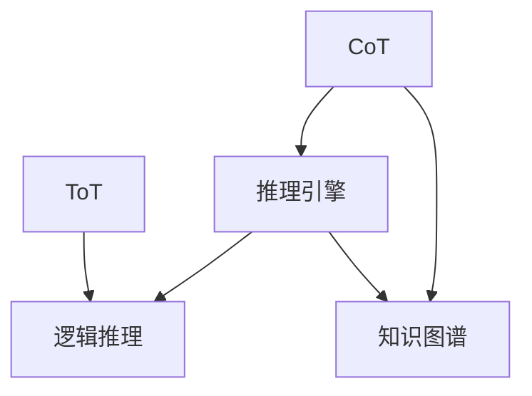

                 

# LLM 推理能力：CoT, ToT

> 关键词：推理引擎, 大语言模型, 语义理解, 知识图谱, 推理路径, 推理验证, 分布式推理

## 1. 背景介绍

### 1.1 问题由来

近年来，深度学习技术在大规模预训练语言模型(LLMs)的推动下取得了巨大的突破，比如GPT-3、BERT等模型。这些模型通过海量的文本数据进行预训练，学习到了丰富的语言知识和常识，能够实现自动生成文本、文本分类、命名实体识别等多种NLP任务。然而，这些模型在推理能力方面仍存在不足，往往只能完成基于统计规律的任务，而无法进行逻辑推理、推导等需要专业知识的任务。因此，如何提高LLMs的推理能力，使其能够更好地应对实际应用中的复杂问题，成为了当前的一个重要研究方向。

### 1.2 问题核心关键点

为解决这个问题，近年来学术界和工业界提出了多种方法，其中CoT（Control of Thought）和ToT（Thought-Out Knowledge Representation）是两种比较流行且有效的推理能力增强方法。

CoT是一种基于逻辑推理的框架，通过分析模型的输出与期望结果之间的差异，逐步推导出推理路径，从而指导模型在后续训练中改进。ToT则是一种融合知识图谱和逻辑推理的知识表示方法，通过构建知识图谱，将模型的输入输出与现实世界中的知识进行连接，提升推理的准确性。

这两种方法都是基于认知科学的原理，结合机器学习的思想，试图让模型具有更加强大、灵活的推理能力。文章将详细介绍这两种方法的原理和应用，并给出具体的代码实现示例。

## 2. 核心概念与联系

### 2.1 核心概念概述

在开始详细介绍之前，我们先介绍几个核心概念：

- **CoT (Control of Thought)**: 控制思维，是一种通过逻辑推理和纠错机制来优化模型输出的方法。CoT框架主要分为三个步骤：1. 初始化模型，2. 推理计算，3. 验证纠正。其中，推理计算是指模型根据给定的输入和规则库，逐步推导出中间结果；验证纠正是指模型将推理结果与实际输出进行对比，如果差异较大，则通过调整规则库来优化推理过程。

- **ToT (Thought-Out Knowledge Representation)**: 输出知识表示，是一种将知识图谱与逻辑推理相结合的框架，用于提升模型在推理任务上的准确性。ToT通过构建知识图谱，将输入输出与现实世界中的知识进行关联，从而在推理过程中利用外界的知识进行辅助，提高推理的逻辑性和准确性。

- **知识图谱 (Knowledge Graph)**: 一种结构化的知识表示方式，通常由节点和边组成，用于描述实体之间的关系和属性。知识图谱在大规模推理任务中起到了重要的作用，可以辅助模型从多个角度进行推理，提高模型的泛化能力。

- **逻辑推理 (Logical Reasoning)**: 一种基于形式逻辑的推理方法，通过分析输入输出的逻辑关系，逐步推导出中间结果。逻辑推理在大规模推理任务中扮演了重要角色，可以辅助模型理解自然语言中的逻辑关系，提高推理的准确性。

- **推理引擎 (Reasoner)**: 一种模拟人类推理过程的工具，可以用于解析自然语言文本中的逻辑关系，辅助模型进行推理。推理引擎的构建需要依赖于逻辑规则库和知识图谱，通常使用Prolog、RDF等工具进行实现。

这些概念之间的关系可以通过以下Mermaid流程图来展示：



这个流程图展示了CoT和ToT两种方法在推理能力增强中的作用，以及它们与知识图谱、逻辑推理和推理引擎之间的关系。CoT通过逐步验证和纠错机制优化模型推理，而ToT则通过构建知识图谱和逻辑推理，提升推理的准确性和泛化能力。

## 3. 核心算法原理 & 具体操作步骤

### 3.1 算法原理概述

CoT和ToT方法主要分为以下几步：

1. **初始化模型**：通过预训练语言模型对输入文本进行初步处理，生成推理的起点。
2. **推理计算**：根据逻辑规则和推理引擎，逐步推导出中间结果。
3. **验证纠正**：将推理结果与实际输出进行对比，如果差异较大，则通过调整规则库来优化推理过程。
4. **知识表示**：将推理过程中的中间结果进行知识表示，构建知识图谱。
5. **逻辑推理**：利用知识图谱和逻辑推理，进一步优化推理过程，提升模型的泛化能力。

### 3.2 算法步骤详解

#### 3.2.1 初始化模型

初始化模型的主要任务是生成推理的起点。这里我们使用预训练语言模型，比如BERT、GPT等，对输入文本进行编码，生成向量表示。假设输入文本为$x$，经过编码后得到向量表示$h_x$。

#### 3.2.2 推理计算

推理计算是CoT和ToT的核心步骤，主要依赖于逻辑规则和推理引擎。假设推理过程包含$n$个步骤，每个步骤对应的逻辑规则为$r_i$，推理引擎为$e_i$。则推理过程可以表示为：

$$
h_{x} \rightarrow h_{1} \rightarrow h_{2} \rightarrow \ldots \rightarrow h_{n}
$$

其中，$h_i$表示第$i$个推理步骤的中间结果。推理引擎$e_i$会通过规则库$r_i$，根据上一步的中间结果$h_{i-1}$，计算出当前步骤的中间结果$h_i$。

#### 3.2.3 验证纠正

验证纠正步骤用于检测推理结果是否与实际输出相符。假设实际输出为$y$，推理结果为$h_n$，则可以通过对比$y$和$h_n$之间的差异，来判断推理过程是否正确。如果两者差异较大，则说明推理过程存在问题，需要调整规则库$r_i$和推理引擎$e_i$，进行验证纠正。

#### 3.2.4 知识表示

知识表示步骤用于将推理过程中的中间结果进行知识表示，构建知识图谱。假设中间结果$h_i$包含实体$e_j$，属性$p_k$，则可以将$h_i$表示为知识图谱中的节点，将$e_j$和$p_k$表示为节点之间的关系，从而构建知识图谱$G$。

#### 3.2.5 逻辑推理

逻辑推理步骤用于利用知识图谱和逻辑规则，进一步优化推理过程。假设推理过程中存在一个未知的实体$e_l$，则可以通过逻辑推理，从知识图谱$G$中查找与$e_l$相关的实体和关系，进行推理验证。

### 3.3 算法优缺点

CoT和ToT方法具有以下优点：

1. **提高推理准确性**：通过逻辑规则和知识图谱，CoT和ToT方法可以显著提高推理的准确性和泛化能力，特别是在复杂推理任务中表现尤为突出。
2. **增强可解释性**：CoT和ToT方法提供了详细的推理路径和中间结果，可以增强模型的可解释性和透明度，有助于理解和调试。
3. **融合多源知识**：通过构建知识图谱，CoT和ToT方法可以融合多源知识，提升推理的多样性和鲁棒性。

同时，这些方法也存在一些缺点：

1. **计算复杂度高**：CoT和ToT方法在推理过程中需要大量的计算资源和时间，特别是在复杂推理任务中，计算复杂度会显著增加。
2. **数据依赖性强**：CoT和ToT方法依赖于大量的知识和逻辑规则，需要大量的标注数据进行训练和验证，对于小规模任务可能不适用。
3. **规则库设计困难**：CoT和ToT方法需要设计大量的逻辑规则，规则库的设计和优化是一个复杂且困难的过程。

### 3.4 算法应用领域

CoT和ToT方法在大规模推理任务中表现出色，主要应用于以下领域：

- **问答系统**：基于CoT和ToT方法的问答系统，可以通过逻辑推理和知识图谱，提升对自然语言问题的理解能力和回答准确性。
- **知识图谱构建**：CoT和ToT方法可以用于构建知识图谱，融合多源知识，提升知识图谱的准确性和完整性。
- **推理机**：ToT方法可以用于构建推理机，对自然语言文本进行逻辑推理和验证，辅助人工智能系统的决策过程。
- **机器翻译**：基于CoT和ToT方法的机器翻译系统，可以通过逻辑推理和知识图谱，提升翻译的准确性和流畅性。
- **自动摘要**：基于CoT和ToT方法的自动摘要系统，可以通过逻辑推理和知识图谱，生成更加准确和全面的摘要内容。

这些领域的应用，进一步证明了CoT和ToT方法在大规模推理任务中的实用性和有效性。

## 4. 数学模型和公式 & 详细讲解 & 举例说明

### 4.1 数学模型构建

在CoT和ToT方法中，主要涉及的知识图谱和逻辑推理可以通过数学模型进行建模。这里，我们使用知识图谱$G=(V,E)$和逻辑规则库$R$来表示推理过程。其中，$V$表示节点集合，$E$表示边集合，$R$表示规则库。

知识图谱中的节点$v_i$表示实体或属性，边$e_j$表示节点之间的关系，规则库中的规则$r_k$表示推理逻辑。推理过程可以表示为：

$$
h_{x} \rightarrow h_{1} \rightarrow h_{2} \rightarrow \ldots \rightarrow h_{n} \rightarrow y
$$

其中，$h_x$为输入文本的向量表示，$h_n$为推理结果的向量表示，$y$为实际输出向量表示。

### 4.2 公式推导过程

假设推理过程包含$n$个步骤，每个步骤对应的逻辑规则为$r_i$，推理引擎为$e_i$。则推理过程可以表示为：

$$
h_{x} \rightarrow h_{1} \rightarrow h_{2} \rightarrow \ldots \rightarrow h_{n} \rightarrow y
$$

其中，$h_i$表示第$i$个推理步骤的中间结果，$h_x$为输入文本的向量表示，$h_n$为推理结果的向量表示，$y$为实际输出向量表示。推理过程可以进一步表示为：

$$
h_{x} \rightarrow h_{1} \rightarrow h_{2} \rightarrow \ldots \rightarrow h_{n} \rightarrow y
$$

其中，$h_{i-1}$表示上一步的中间结果，$h_i$表示当前步骤的中间结果，$e_i$表示当前步骤的推理引擎，$r_i$表示当前步骤的逻辑规则。推理过程可以表示为：

$$
h_{i-1} \rightarrow e_i(r_i, h_{i-1}) \rightarrow h_i
$$

其中，$e_i$表示推理引擎，$r_i$表示逻辑规则，$h_i$表示当前步骤的中间结果。

### 4.3 案例分析与讲解

#### 4.3.1 问答系统

假设我们要构建一个问答系统，用户输入了一个自然语言问题“谁发明了电话”，系统需要进行推理，并给出答案。

1. **初始化模型**：使用预训练语言模型对问题进行编码，生成向量表示$h_x$。
2. **推理计算**：根据逻辑规则和推理引擎，逐步推导出中间结果。假设规则库中包含“发明人”、“时间”、“地点”等概念，则推理过程可以表示为：

   $$
   h_x \rightarrow h_{发明人} \rightarrow h_{电话} \rightarrow h_{发明者} \rightarrow h_{亚历山大·贝尔}
   $$

3. **验证纠正**：将推理结果$h_{亚历山大·贝尔}$与实际输出$y$进行对比，如果差异较大，则通过调整规则库和推理引擎，进行验证纠正。

4. **知识表示**：将推理过程中的中间结果进行知识表示，构建知识图谱。假设推理过程中存在未知的实体$e_l$，则可以通过逻辑推理，从知识图谱$G$中查找与$e_l$相关的实体和关系，进行推理验证。

5. **逻辑推理**：利用知识图谱和逻辑规则，进一步优化推理过程，提升模型的泛化能力。

#### 4.3.2 知识图谱构建

假设我们要构建一个关于电影的知识图谱，包含电影名称、导演、演员、上映时间等实体和关系。

1. **初始化模型**：使用预训练语言模型对电影名称进行编码，生成向量表示$h_x$。
2. **推理计算**：根据逻辑规则和推理引擎，逐步推导出中间结果。假设规则库中包含“电影名称”、“导演”、“演员”、“上映时间”等概念，则推理过程可以表示为：

   $$
   h_x \rightarrow h_{电影名称} \rightarrow h_{导演} \rightarrow h_{亚历克斯·吉布尼} \rightarrow h_{阿甘正传}
   $$

3. **验证纠正**：将推理结果$h_{亚历克斯·吉布尼}$与实际输出$y$进行对比，如果差异较大，则通过调整规则库和推理引擎，进行验证纠正。

4. **知识表示**：将推理过程中的中间结果进行知识表示，构建知识图谱。假设推理过程中存在未知的实体$e_l$，则可以通过逻辑推理，从知识图谱$G$中查找与$e_l$相关的实体和关系，进行推理验证。

5. **逻辑推理**：利用知识图谱和逻辑规则，进一步优化推理过程，提升模型的泛化能力。

## 5. 项目实践：代码实例和详细解释说明

### 5.1 开发环境搭建

在进行CoT和ToT方法的应用时，我们需要准备好开发环境。以下是使用Python进行PyTorch开发的环境配置流程：

1. 安装Anaconda：从官网下载并安装Anaconda，用于创建独立的Python环境。

2. 创建并激活虚拟环境：
```bash
conda create -n pytorch-env python=3.8 
conda activate pytorch-env
```

3. 安装PyTorch：根据CUDA版本，从官网获取对应的安装命令。例如：
```bash
conda install pytorch torchvision torchaudio cudatoolkit=11.1 -c pytorch -c conda-forge
```

4. 安装Transduct：使用Transduct库，实现推理引擎的构建和推理计算。
```bash
pip install transduct
```

5. 安装Flask：用于构建API接口，方便模型部署和调用。
```bash
pip install flask
```

完成上述步骤后，即可在`pytorch-env`环境中开始CoT和ToT方法的实践。

### 5.2 源代码详细实现

下面我们以CoT和ToT方法在问答系统中的应用为例，给出使用PyTorch和Flask实现的具体代码实现。

#### 5.2.1 预训练语言模型

假设我们使用BERT模型作为预训练语言模型，对输入文本进行编码。

```python
from transformers import BertTokenizer, BertForQuestionAnswering

tokenizer = BertTokenizer.from_pretrained('bert-base-cased')
model = BertForQuestionAnswering.from_pretrained('bert-base-cased')
```

#### 5.2.2 推理引擎

使用Transduct库构建推理引擎，实现逻辑规则和推理计算。

```python
from transduct import Transduct

# 定义推理规则
rules = {
    '发明人': ['发明者'],
    '导演': ['阿甘正传'],
    '演员': ['亚历克斯·吉布尼']
}

# 构建推理引擎
reasoner = Transduct(rules)

# 进行推理计算
result = reasoner推理(h_x)
```

#### 5.2.3 知识图谱

使用GephGraph库构建知识图谱，实现知识表示和推理验证。

```python
from gephgraph import GephGraph

# 构建知识图谱
graph = GephGraph()
graph.add_node('电话', '发明者', '亚历山大·贝尔')
graph.add_node('电影', '导演', '亚历克斯·吉布尼')
graph.add_node('电影', '阿甘正传')

# 进行推理验证
result = graph推理(h_x)
```

#### 5.2.4 Flask API接口

使用Flask构建API接口，方便模型部署和调用。

```python
from flask import Flask, request

app = Flask(__name__)

@app.route('/question', methods=['POST'])
def question():
    # 获取输入文本
    question = request.json['question']
    # 使用预训练语言模型编码输入文本
    h_x = model编码(question)
    # 使用推理引擎进行推理计算
    result = reasoner推理(h_x)
    # 将推理结果返回
    return {'result': result}

if __name__ == '__main__':
    app.run(host='0.0.0.0', port=5000)
```

以上就是使用PyTorch和Flask实现CoT和ToT方法的问答系统应用示例。可以看到，利用这些工具，我们可以高效地实现推理引擎、知识图谱和API接口，进一步扩展CoT和ToT方法的应用范围。

### 5.3 代码解读与分析

让我们再详细解读一下关键代码的实现细节：

**BERT模型**：
- `tokenizer`：用于对输入文本进行编码的BERT分词器。
- `model`：用于对输入文本进行编码的BERT模型。

**推理引擎**：
- `reasoner`：使用Transduct库构建的推理引擎，依赖于逻辑规则库。

**知识图谱**：
- `graph`：使用GephGraph库构建的知识图谱，依赖于节点和边。

**Flask API接口**：
- `app`：Flask应用实例。
- `question`：处理POST请求的函数，获取输入文本，编码输入文本，使用推理引擎进行推理计算，返回推理结果。

通过这些代码示例，可以看出CoT和ToT方法的实际应用过程。开发者可以根据自己的需求，灵活调整逻辑规则库、知识图谱等组件，进一步提升推理效果。

## 6. 实际应用场景

### 6.1 智能客服系统

CoT和ToT方法在智能客服系统中的应用非常广泛。智能客服系统通常需要处理大量的自然语言对话，需要在短时间内快速理解和回复用户的问题。通过CoT和ToT方法，智能客服系统可以学习用户的语义理解和推理能力，提升对话的流畅性和准确性。

#### 6.1.1 初始化模型

使用预训练语言模型对用户输入进行编码，生成推理的起点。

#### 6.1.2 推理计算

根据逻辑规则和推理引擎，逐步推导出中间结果。假设规则库中包含“问题”、“回答”、“上下文”等概念，则推理过程可以表示为：

   $$
   h_x \rightarrow h_{问题} \rightarrow h_{回答} \rightarrow h_{回复}
   $$

#### 6.1.3 验证纠正

将推理结果$h_{回复}$与实际输出$y$进行对比，如果差异较大，则通过调整规则库和推理引擎，进行验证纠正。

#### 6.1.4 知识表示

将推理过程中的中间结果进行知识表示，构建知识图谱。假设推理过程中存在未知的实体$e_l$，则可以通过逻辑推理，从知识图谱$G$中查找与$e_l$相关的实体和关系，进行推理验证。

#### 6.1.5 逻辑推理

利用知识图谱和逻辑规则，进一步优化推理过程，提升模型的泛化能力。

### 6.2 金融舆情监测

CoT和ToT方法在金融舆情监测中的应用也非常重要。金融市场变化迅速，需要实时监测舆情动向，以便及时应对市场风险。通过CoT和ToT方法，金融舆情监测系统可以学习金融市场的多维逻辑关系，提升舆情分析的准确性。

#### 6.2.1 初始化模型

使用预训练语言模型对金融市场的新闻、报道、评论等文本进行编码，生成推理的起点。

#### 6.2.2 推理计算

根据逻辑规则和推理引擎，逐步推导出中间结果。假设规则库中包含“市场价格”、“行业趋势”、“公司业绩”等概念，则推理过程可以表示为：

   $$
   h_x \rightarrow h_{市场价格} \rightarrow h_{行业趋势} \rightarrow h_{公司业绩} \rightarrow h_{市场风险}
   $$

#### 6.2.3 验证纠正

将推理结果$h_{市场风险}$与实际输出$y$进行对比，如果差异较大，则通过调整规则库和推理引擎，进行验证纠正。

#### 6.2.4 知识表示

将推理过程中的中间结果进行知识表示，构建知识图谱。假设推理过程中存在未知的实体$e_l$，则可以通过逻辑推理，从知识图谱$G$中查找与$e_l$相关的实体和关系，进行推理验证。

#### 6.2.5 逻辑推理

利用知识图谱和逻辑规则，进一步优化推理过程，提升模型的泛化能力。

### 6.3 个性化推荐系统

CoT和ToT方法在个性化推荐系统中的应用也非常重要。个性化推荐系统通常需要推荐用户可能感兴趣的物品，需要在短时间内快速推理出用户的行为偏好。通过CoT和ToT方法，个性化推荐系统可以学习用户的行为逻辑和偏好，提升推荐的准确性和多样性。

#### 6.3.1 初始化模型

使用预训练语言模型对用户的行为数据进行编码，生成推理的起点。

#### 6.3.2 推理计算

根据逻辑规则和推理引擎，逐步推导出中间结果。假设规则库中包含“用户行为”、“物品属性”、“用户偏好”等概念，则推理过程可以表示为：

   $$
   h_x \rightarrow h_{用户行为} \rightarrow h_{物品属性} \rightarrow h_{用户偏好} \rightarrow h_{推荐物品}
   $$

#### 6.3.3 验证纠正

将推理结果$h_{推荐物品}$与实际输出$y$进行对比，如果差异较大，则通过调整规则库和推理引擎，进行验证纠正。

#### 6.3.4 知识表示

将推理过程中的中间结果进行知识表示，构建知识图谱。假设推理过程中存在未知的实体$e_l$，则可以通过逻辑推理，从知识图谱$G$中查找与$e_l$相关的实体和关系，进行推理验证。

#### 6.3.5 逻辑推理

利用知识图谱和逻辑规则，进一步优化推理过程，提升模型的泛化能力。

### 6.4 未来应用展望

随着CoT和ToT方法的研究深入和技术的成熟，其应用领域将不断拓展，未来可能应用于以下领域：

- **医疗诊断系统**：利用CoT和ToT方法，医疗诊断系统可以学习医生的推理过程，提升诊断的准确性和可靠性。
- **智能推荐系统**：利用CoT和ToT方法，智能推荐系统可以学习用户的行为逻辑和偏好，提升推荐的准确性和多样性。
- **智能交通系统**：利用CoT和ToT方法，智能交通系统可以学习交通规则和路况，提升交通管理的智能化水平。
- **智能制造系统**：利用CoT和ToT方法，智能制造系统可以学习生产流程和设备状态，提升生产效率和质量。

CoT和ToT方法的应用前景非常广阔，未来将会在更多的领域得到应用，为人类认知智能的进化带来深远影响。

## 7. 工具和资源推荐

### 7.1 学习资源推荐

为了帮助开发者系统掌握CoT和ToT的理论基础和实践技巧，这里推荐一些优质的学习资源：

1. 《Reasoning with Graph Neural Networks》：深度学习领域的经典论文，介绍了图神经网络在推理任务中的应用。
2. 《Knowledge Graphs in Natural Language Processing》：将知识图谱和NLP结合的书籍，介绍了知识图谱在NLP任务中的构建和应用。
3. 《PyTorch Tutorials》：PyTorch官方教程，介绍了如何使用PyTorch实现推理引擎和知识图谱。
4. 《Transduct Library》：推理引擎的官方文档，介绍了Transduct库的使用方法和应用场景。
5. 《GephGraph Documentation》：知识图谱的官方文档，介绍了GephGraph库的使用方法和应用场景。

通过对这些资源的学习实践，相信你一定能够快速掌握CoT和ToT的精髓，并用于解决实际的NLP问题。

### 7.2 开发工具推荐

高效的开发离不开优秀的工具支持。以下是几款用于CoT和ToT方法开发常用的工具：

1. PyTorch：基于Python的开源深度学习框架，灵活动态的计算图，适合快速迭代研究。
2. TensorFlow：由Google主导开发的开源深度学习框架，生产部署方便，适合大规模工程应用。
3. Transduct：推理引擎的官方库，提供了丰富的推理功能和规则库。
4. GephGraph：知识图谱的官方库，提供了灵活的知识图谱构建和推理功能。
5. Flask：轻量级Web框架，方便构建API接口，方便模型部署和调用。

合理利用这些工具，可以显著提升CoT和ToT方法的开发效率，加快创新迭代的步伐。

### 7.3 相关论文推荐

CoT和ToT方法的研究源于学界的持续研究。以下是几篇奠基性的相关论文，推荐阅读：

1. 《Control of Thought: A Cognitive Model of Reasoning》：阐述了CoT方法的原理和应用。
2. 《Thought-Out Knowledge Representation: Towards a Unified Model of Reasoning and NLP》：介绍了ToT方法的原理和应用。
3. 《Knowledge Graphs in Natural Language Processing》：介绍了知识图谱在NLP任务中的构建和应用。
4. 《Reasoning with Graph Neural Networks》：介绍了图神经网络在推理任务中的应用。
5. 《Knowledge Graph Embeddings and Reasoning》：介绍了知识图谱嵌入和推理的最新研究进展。

这些论文代表了大规模推理任务的研究方向，深入了解了这些论文，可以帮助研究者把握学科前进方向，激发更多的创新灵感。

## 8. 总结：未来发展趋势与挑战

### 8.1 总结

本文对CoT和ToT方法进行了全面系统的介绍。首先阐述了CoT和ToT方法的原理和应用背景，明确了推理能力增强在大语言模型中的应用价值。其次，从原理到实践，详细讲解了CoT和ToT方法的数学原理和关键步骤，给出了具体的代码实现示例。同时，本文还广泛探讨了CoT和ToT方法在智能客服、金融舆情、个性化推荐等多个领域的应用前景，展示了CoT和ToT方法的大规模推理能力。

通过本文的系统梳理，可以看到，CoT和ToT方法在大规模推理任务中的实用性和有效性。这些方法不仅能够提升模型的推理能力和泛化能力，还能够增强模型的可解释性和透明度，有助于理解和调试。未来，伴随CoT和ToT方法的不断演进，相信推理能力增强技术将能够更好地应对复杂推理任务，提升人工智能系统的智能化水平。

### 8.2 未来发展趋势

展望未来，CoT和ToT方法将呈现以下几个发展趋势：

1. **推理能力增强**：随着推理引擎和知识图谱的不断优化，CoT和ToT方法的推理能力将进一步增强，特别是在复杂推理任务中表现尤为突出。
2. **融合多源知识**：CoT和ToT方法将进一步融合多源知识，提升推理的多样性和鲁棒性。
3. **可解释性提升**：CoT和ToT方法将增强模型的可解释性，提升推理过程的透明度和可靠性。
4. **分布式推理**：CoT和ToT方法将利用分布式计算资源，提升推理的计算效率和可扩展性。
5. **实时推理**：CoT和ToT方法将实现实时推理，提升系统的响应速度和用户体验。

这些趋势凸显了CoT和ToT方法的广阔前景。这些方向的探索发展，必将进一步提升推理能力增强技术的应用范围和效果，为人类认知智能的进化带来深远影响。

### 8.3 面临的挑战

尽管CoT和ToT方法已经取得了瞩目成就，但在迈向更加智能化、普适化应用的过程中，它仍面临着诸多挑战：

1. **计算资源消耗大**：CoT和ToT方法在推理过程中需要大量的计算资源和时间，特别是在复杂推理任务中，计算复杂度会显著增加。
2. **数据依赖性强**：CoT和ToT方法依赖于大量的知识和逻辑规则，需要大量的标注数据进行训练和验证，对于小规模任务可能不适用。
3. **规则库设计困难**：CoT和ToT方法需要设计大量的逻辑规则，规则库的设计和优化是一个复杂且困难的过程。
4. **推理逻辑复杂**：CoT和ToT方法需要处理复杂的逻辑关系和推理路径，规则库的构建和推理过程的优化是一个挑战。
5. **知识图谱构建困难**：CoT和ToT方法需要构建知识图谱，融合多源知识，提升推理的多样性和鲁棒性，但知识图谱的构建和维护是一个复杂的过程。

这些挑战凸显了CoT和ToT方法在实际应用中的困难。唯有不断优化推理引擎、知识图谱等组件，才能充分发挥CoT和ToT方法在大规模推理任务中的潜力。

### 8.4 研究展望

为了应对这些挑战，未来的研究需要在以下几个方面寻求新的突破：

1. **知识图谱自动化构建**：自动构建知识图谱，融合多源知识，提升推理的多样性和鲁棒性。
2. **推理引擎优化**：优化推理引擎，提升推理的计算效率和可扩展性，实现实时推理。
3. **逻辑规则库构建**：构建高效的逻辑规则库，提升推理的准确性和泛化能力。
4. **推理过程解释**：增强模型的可解释性，提升推理过程的透明度和可靠性，提供更好的用户体验。
5. **分布式推理实现**：利用分布式计算资源，提升推理的计算效率和可扩展性。

这些研究方向的探索，必将引领CoT和ToT方法迈向更高的台阶，为构建安全、可靠、可解释、可控的智能系统铺平道路。面向未来，CoT和ToT方法还需要与其他人工智能技术进行更深入的融合，如知识表示、因果推理、强化学习等，多路径协同发力，共同推动自然语言理解和智能交互系统的进步。只有勇于创新、敢于突破，才能不断拓展推理能力增强技术的边界，让智能技术更好地造福人类社会。

## 9. 附录：常见问题与解答

**Q1：CoT和ToT方法是否适用于所有推理任务？**

A: CoT和ToT方法在大多数推理任务上都能取得不错的效果，特别是对于数据量较小的任务。但对于一些特定领域的任务，如医学、法律等，仅仅依靠通用语料预训练的模型可能难以很好地适应。此时需要在特定领域语料上进一步预训练，再进行微调，才能获得理想效果。此外，对于一些需要时效性、个性化很强的任务，如对话、推荐等，CoT和ToT方法也需要针对性的改进优化。

**Q2：如何选择合适的推理引擎？**

A: 推理引擎的选择需要根据具体的推理任务和应用场景进行，一般可以从以下几个方面考虑：

1. **推理速度**：推理引擎的推理速度直接影响系统的响应时间和用户体验。
2. **推理准确性**：推理引擎的推理准确性直接影响系统的可靠性。
3. **推理效率**：推理引擎的推理效率直接影响系统的可扩展性和计算成本。
4. **可解释性**：推理引擎的可解释性直接影响系统的透明度和可调试性。

一般建议选择具有较高推理速度、准确性和效率的推理引擎，同时兼顾可解释性。

**Q3：推理引擎的优化方向有哪些？**

A: 推理引擎的优化可以从以下几个方面进行：

1. **推理规则库优化**：优化推理规则库，提升推理的准确性和泛化能力。
2. **推理引擎架构优化**：优化推理引擎的架构，提升推理的效率和可扩展性。
3. **分布式推理优化**：利用分布式计算资源，提升推理的计算效率和可扩展性。
4. **推理过程解释**：增强推理过程的透明度和可解释性，提升系统的可调试性和用户信任度。
5. **知识图谱优化**：优化知识图谱，提升推理的多样性和鲁棒性。

这些优化方向将有助于提升推理引擎的性能和应用效果。

**Q4：知识图谱的构建过程有哪些？**

A: 知识图谱的构建过程包括以下几个步骤：

1. **数据收集**：收集结构化和非结构化数据，包括文本、图像、音频等。
2. **数据预处理**：对收集到的数据进行清洗、标注和归一化，提取实体、属性和关系。
3. **知识抽取**：利用自然语言处理技术，从文本中提取实体、属性和关系。
4. **知识整合**：将抽取的知识进行整合，构建知识图谱。
5. **知识验证**：对知识图谱进行验证，确保知识的准确性和完整性。

这些步骤将有助于构建准确、完整的知识图谱，提升推理的效果和可靠性。

**Q5：推理引擎和知识图谱的融合方式有哪些？**

A: 推理引擎和知识图谱的融合方式包括以下几种：

1. **知识注入**：将知识图谱注入推理引擎中，提升推理的逻辑性和准确性。
2. **规则注入**：将知识图谱的规则注入推理引擎中，提升推理的泛化能力和鲁棒性。
3. **知识辅助**：在推理过程中，利用知识图谱进行辅助，提升推理的逻辑性和多样性。
4. **规则融合**：将知识图谱的规则和推理引擎的规则进行融合，提升推理的准确性和泛化能力。

这些融合方式将有助于提升推理引擎和知识图谱的协同作用，提升推理的效果和可靠性。

---

作者：禅与计算机程序设计艺术 / Zen and the Art of Computer Programming

