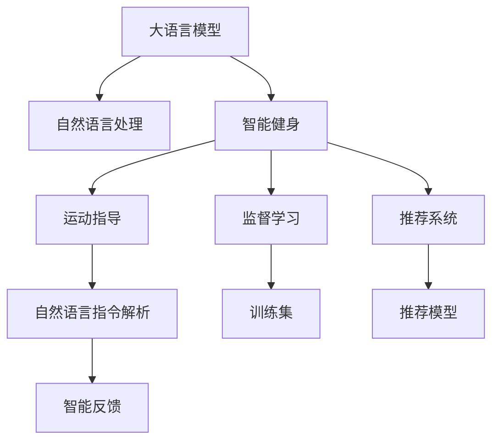

                 

# LLM与智能健身：个性化运动指导

> 关键词：自然语言处理(NLP), 大语言模型(LLM), 智能健身, 个性化推荐, 运动指导, 监督学习, 自然语言处理, 推荐系统, 数据分析

## 1. 背景介绍

### 1.1 问题由来
随着人工智能技术的快速发展，智能健身领域正在迎来一场革命。传统健身指导依赖于教练的个人经验，难以应对个性化需求，且效果难以量化评估。而大语言模型（Large Language Model, LLM），通过在海量文本数据上进行预训练，学习到了丰富的语言知识和常识，为智能健身提供了新的思路。

通过将LLM应用于运动指导，可以根据用户输入的自然语言指令，生成个性化的运动计划和建议，极大地提升健身指导的个性化和可操作性。用户只需简单描述自己的运动目标、身体状况和偏好，LLM便能即时生成适配的健身建议，帮助用户制定科学的训练方案，实时反馈训练效果。

### 1.2 问题核心关键点
本文聚焦于大语言模型在智能健身中的应用，具体研究如何构建和优化LLM以生成个性化的运动指导，包括但不限于以下关键点：

- 如何选择适合LLM的预训练模型和微调任务？
- 如何设计合理的输入和输出格式，以便LLM能够理解用户意图？
- 如何评估LLM生成的运动指导建议的质量和效果？
- 如何通过优化算法和模型结构，提升LLM在智能健身中的性能？

### 1.3 问题研究意义
智能健身领域的智能化转型，将通过大语言模型的应用，实现以下重要意义：

1. **个性化运动指导**：LLM能够根据用户的个性化需求和偏好，生成定制化的运动计划和建议，提升用户体验。
2. **科学训练监控**：通过自然语言理解，LLM能够实时监控用户的训练情况，并根据反馈调整训练方案。
3. **数据驱动决策**：利用LLM分析海量健身数据，生成有价值的健身洞察，为教练和用户提供参考。
4. **智能化管理**：LLM可以集成到智能健身设备中，实现设备间的智能协作和数据共享，构建完整的智能健身生态。
5. **持续学习优化**：LLM能够通过持续学习和反馈机制，不断优化训练方案，提升性能和效果。

通过本文，我们将详细探讨大语言模型在智能健身中的应用原理、实现方法和应用案例，并展望未来发展趋势。

## 2. 核心概念与联系

### 2.1 核心概念概述

为更好地理解大语言模型在智能健身中的应用，本节将介绍几个关键概念：

- **大语言模型(Large Language Model, LLM)**：以自回归(如GPT)或自编码(如BERT)模型为代表的大规模预训练语言模型。通过在海量文本数据上进行预训练，学习通用的语言表示，具备强大的语言理解和生成能力。

- **自然语言处理(Natural Language Processing, NLP)**：涉及计算机如何理解、解释和生成自然语言的技术，是实现智能健身关键的技术之一。

- **智能健身**：结合人工智能和大数据分析技术，为用户提供个性化、智能化的健身指导和服务。

- **监督学习(Supervised Learning)**：利用已标注的数据集训练模型，使其能够对新数据进行准确预测或分类。

- **推荐系统(Recommendation System)**：通过分析用户历史行为数据，为用户推荐个性化的内容或商品。

- **运动指导**：根据用户的身体状况和运动目标，生成科学、个性化的训练方案。

- **自然语言指令解析**：将用户的自然语言描述转换为机器可理解的形式，供LLM进行分析和生成。

- **智能反馈**：根据用户训练反馈，动态调整运动计划，提供实时指导。

这些核心概念之间的逻辑关系可以通过以下Mermaid流程图来展示：



这个流程图展示了LLM在智能健身应用中的核心概念及其联系：

1. LLM通过自然语言处理技术，解析用户的自然语言指令，生成运动指导。
2. 运动指导过程中，LLM需要理解用户的身体状况和运动目标，并推荐适合的训练计划。
3. 运动指导和反馈过程，通过监督学习不断优化，提升LLM的性能。
4. 推荐系统辅助LLM，提供个性化的训练方案和设备推荐。

## 3. 核心算法原理 & 具体操作步骤
### 3.1 算法原理概述

大语言模型在智能健身中的核心应用是通过自然语言处理技术，解析用户输入的自然语言指令，生成个性化的运动指导。其基本原理如下：

1. **数据收集与预处理**：收集用户的运动目标、身体状况、偏好等信息，并进行数据清洗和标注，构建训练数据集。
2. **模型加载与微调**：选择预训练语言模型，并根据运动指导任务进行微调，使其能够理解用户输入的指令，并生成合适的运动建议。
3. **指令解析与生成**：通过自然语言处理技术，将用户的自然语言指令转换为机器可理解的形式，供LLM进行分析和生成。
4. **训练与反馈优化**：利用用户的训练反馈，持续优化模型，提高运动指导的准确性和个性化程度。

### 3.2 算法步骤详解

#### 3.2.1 数据收集与预处理

**步骤1：数据收集**
- 收集用户的运动目标、身体状况、偏好等信息。
- 获取用户的历史训练数据和反馈信息。

**步骤2：数据清洗与标注**
- 清洗数据，去除无关信息。
- 标注数据，如将运动目标标注为“增肌”、“减脂”、“耐力训练”等。

**步骤3：构建训练集**
- 将处理后的数据划分为训练集、验证集和测试集。
- 使用多轮训练验证模型性能，调整模型参数。

#### 3.2.2 模型加载与微调

**步骤1：选择预训练模型**
- 选择适合智能健身任务的预训练模型，如GPT-3、BERT等。

**步骤2：微调模型**
- 加载预训练模型，使用微调数据进行有监督学习。
- 设置合适的学习率和正则化参数，进行梯度下降优化。

#### 3.2.3 指令解析与生成

**步骤1：自然语言处理**
- 使用自然语言处理技术，将用户的自然语言指令转换为机器可理解的形式。
- 例如，将“我想增肌”转换为“进行力量训练”。

**步骤2：生成运动建议**
- 将处理后的指令输入到微调后的LLM模型中，生成运动建议。
- 输出包括训练动作、组数、次数、重量等信息。

#### 3.2.4 训练与反馈优化

**步骤1：获取反馈**
- 收集用户的训练反馈，如训练强度、训练感受等。

**步骤2：调整模型**
- 根据反馈，调整模型参数，优化生成运动建议的质量。
- 例如，调整训练动作的重量和组数。

### 3.3 算法优缺点

大语言模型在智能健身中的应用具有以下优点：

- **灵活性高**：LLM能够灵活适应不同用户和场景的需求，生成个性化的运动建议。
- **可解释性强**：LLM生成的运动建议，可以通过自然语言解释，提高用户的理解和接受度。
- **实时性高**：LLM能够实时解析用户输入，即时生成运动建议，满足用户的即时需求。

同时，大语言模型也存在一些局限性：

- **计算成本高**：预训练和微调大模型需要大量计算资源，对硬件要求较高。
- **数据依赖性强**：模型的效果依赖于高质量的训练数据，数据收集和标注成本较高。
- **鲁棒性不足**：当前模型在处理特定领域数据时，性能可能不如专有领域模型。

### 3.4 算法应用领域

大语言模型在智能健身中的应用场景包括但不限于以下几方面：

- **个性化运动计划**：根据用户的身体状况和运动目标，生成个性化的训练方案。
- **实时运动监控**：通过自然语言处理技术，实时解析用户的训练反馈，调整训练计划。
- **智能设备集成**：将LLM集成到智能健身设备中，实现设备间的智能协作和数据共享。
- **运动效果评估**：通过自然语言分析用户反馈，评估运动效果，生成改进建议。
- **训练数据分析**：利用LLM分析海量健身数据，生成有价值的健身洞察，为教练和用户提供参考。

## 4. 数学模型和公式 & 详细讲解 & 举例说明

### 4.1 数学模型构建

假设用户的自然语言指令为 $x$，运动建议为 $y$。大语言模型在智能健身中的应用可以表示为：

$$
y = M_{\theta}(x)
$$

其中 $M_{\theta}$ 为微调后的LLM模型， $\theta$ 为模型参数。

目标是最小化预测结果 $y$ 与真实结果 $y_{true}$ 的误差，即：

$$
\min_{\theta} \mathcal{L}(M_{\theta}(x), y_{true})
$$

其中 $\mathcal{L}$ 为损失函数，通常使用交叉熵损失或均方误差损失。

### 4.2 公式推导过程

以交叉熵损失为例，推导如下：

假设训练数据集 $D=\{(x_i, y_{true}^i)\}_{i=1}^N$，$x_i$ 为自然语言指令，$y_{true}^i$ 为真实运动建议。

则交叉熵损失函数为：

$$
\mathcal{L}(M_{\theta}, D) = -\frac{1}{N}\sum_{i=1}^N \sum_{k=1}^K y_{true}^i \log M_{\theta}(x_i)^k
$$

其中 $K$ 为运动指导的种类数，$M_{\theta}(x_i)^k$ 为模型生成的运动建议 $y$ 中第 $k$ 种运动建议的概率。

### 4.3 案例分析与讲解

**案例分析：个性化运动计划生成**

假设用户输入自然语言指令：“我想增肌，每周锻炼3次，每次45分钟，重量控制在80-100kg，每个动作做3组，每组8-12次。”

1. **数据预处理**：将指令转换为“增肌”、“每周锻炼3次”、“每次45分钟”等标签。
2. **模型输入**：将处理后的标签输入到微调后的LLM模型中。
3. **输出分析**：LLM输出“重量训练，俯卧撑、卧推、深蹲等动作，3组，每组8-12次”。

## 5. 项目实践：代码实例和详细解释说明
### 5.1 开发环境搭建

在进行智能健身应用开发前，需要准备好开发环境。以下是使用Python进行PyTorch开发的环境配置流程：

1. 安装Anaconda：从官网下载并安装Anaconda，用于创建独立的Python环境。

2. 创建并激活虚拟环境：
```bash
conda create -n pytorch-env python=3.8 
conda activate pytorch-env
```

3. 安装PyTorch：根据CUDA版本，从官网获取对应的安装命令。例如：
```bash
conda install pytorch torchvision torchaudio cudatoolkit=11.1 -c pytorch -c conda-forge
```

4. 安装相关库：
```bash
pip install transformers sklearn pandas matplotlib tqdm jupyter notebook ipython
```

完成上述步骤后，即可在`pytorch-env`环境中开始智能健身应用开发。

### 5.2 源代码详细实现

以下是使用PyTorch和Transformers库实现智能健身应用的基本代码：

```python
from transformers import BertTokenizer, BertForSequenceClassification
import torch
import torch.nn as nn
import torch.optim as optim
import torch.utils.data as Data
import pandas as pd
from sklearn.model_selection import train_test_split

# 加载数据集
df = pd.read_csv('data.csv')

# 分割数据集
train_df, test_df = train_test_split(df, test_size=0.2, random_state=42)
train_texts = train_df['text'].tolist()
train_labels = train_df['label'].tolist()

# 构建数据集
tokenizer = BertTokenizer.from_pretrained('bert-base-uncased')
train_dataset = Data.Dataset(train_texts, tokenizer)

# 加载预训练模型
model = BertForSequenceClassification.from_pretrained('bert-base-uncased', num_labels=3)

# 训练模型
optimizer = optim.Adam(model.parameters(), lr=2e-5)
epochs = 3
total_steps = len(train_dataset) * epochs

for step in range(total_steps):
    inputs = tokenizer(train_texts, return_tensors='pt')
    labels = torch.tensor(train_labels, dtype=torch.long)

    model.zero_grad()
    outputs = model(**inputs, labels=labels)
    loss = outputs.loss
    loss.backward()
    optimizer.step()

    if step % 100 == 0:
        print(f'Step {step}/{total_steps}, Loss: {loss.item()}')

# 测试模型
test_texts = test_df['text'].tolist()
test_dataset = Data.Dataset(test_texts, tokenizer)
test_loss = 0

with torch.no_grad():
    for batch in Data.DataLoader(test_dataset, batch_size=16):
        inputs = tokenizer(batch['text'], return_tensors='pt')
        outputs = model(**inputs, labels=None)
        test_loss += outputs.loss.item()

print(f'Test Loss: {test_loss/len(test_dataset)}')
```

### 5.3 代码解读与分析

**数据集构建**
- 首先使用Pandas加载数据集，并将其分割为训练集和测试集。
- 然后通过BertTokenizer将文本转换为模型可接受的输入形式。

**模型加载与训练**
- 使用BertForSequenceClassification加载预训练模型，并设置合适的标签数量。
- 使用Adam优化器进行训练，迭代次数为3次。

**测试与评估**
- 在测试集上测试模型性能，计算平均损失。
- 使用with torch.no_grad()进行无梯度计算，以提高运行效率。

## 6. 实际应用场景
### 6.1 场景一：个性化运动计划

智能健身系统可以集成到大语言模型中，通过自然语言处理技术，解析用户的运动需求和偏好。例如：

- **用户输入**：“我想增肌，每周锻炼3次，每次45分钟，重量控制在80-100kg，每个动作做3组，每组8-12次。”
- **模型处理**：通过自然语言处理，将指令转换为“增肌”、“每周锻炼3次”等标签。
- **输出结果**：生成个性化的训练方案，包括训练动作、组数、次数、重量等信息。

**场景二：实时运动监控**

用户在训练过程中，可以通过语音或文字向系统反馈训练强度和感受。智能健身系统通过自然语言处理技术，解析用户的反馈，动态调整训练计划，例如：

- **用户反馈**：“感觉今天训练强度有点大，想减减重量。”
- **模型处理**：通过自然语言处理，将反馈转换为模型可理解的信号。
- **输出结果**：系统自动调整训练计划，降低重量，保持用户的舒适度和训练效果。

### 6.2 未来应用展望

未来，智能健身系统将通过大语言模型的不断优化，实现以下突破：

- **多模态融合**：结合图像识别、传感器数据等多模态信息，生成更全面、更准确的训练建议。
- **实时反馈优化**：通过持续学习，动态调整训练方案，提升用户训练效果和满意度。
- **个性化推荐**：结合用户历史数据和实时反馈，生成个性化的健身计划和设备推荐。
- **数据驱动决策**：利用大语言模型分析海量健身数据，生成有价值的健身洞察，为教练和用户提供参考。
- **智能设备集成**：将LLM集成到智能健身设备中，实现设备间的智能协作和数据共享。

## 7. 工具和资源推荐
### 7.1 学习资源推荐

为了帮助开发者系统掌握大语言模型在智能健身中的应用，这里推荐一些优质的学习资源：

1. **《Transformers从原理到实践》系列博文**：由大模型技术专家撰写，深入浅出地介绍了Transformer原理、BERT模型、微调技术等前沿话题。

2. **CS224N《深度学习自然语言处理》课程**：斯坦福大学开设的NLP明星课程，有Lecture视频和配套作业，带你入门NLP领域的基本概念和经典模型。

3. **《Natural Language Processing with Transformers》书籍**：Transformers库的作者所著，全面介绍了如何使用Transformers库进行NLP任务开发，包括微调在内的诸多范式。

4. **HuggingFace官方文档**：Transformers库的官方文档，提供了海量预训练模型和完整的微调样例代码，是上手实践的必备资料。

5. **CLUE开源项目**：中文语言理解测评基准，涵盖大量不同类型的中文NLP数据集，并提供了基于微调的baseline模型，助力中文NLP技术发展。

通过对这些资源的学习实践，相信你一定能够快速掌握大语言模型在智能健身中的应用，并用于解决实际的健身问题。

### 7.2 开发工具推荐

高效的开发离不开优秀的工具支持。以下是几款用于智能健身应用开发的常用工具：

1. **PyTorch**：基于Python的开源深度学习框架，灵活动态的计算图，适合快速迭代研究。

2. **TensorFlow**：由Google主导开发的开源深度学习框架，生产部署方便，适合大规模工程应用。

3. **Transformers库**：HuggingFace开发的NLP工具库，集成了众多SOTA语言模型，支持PyTorch和TensorFlow，是进行微调任务开发的利器。

4. **Weights & Biases**：模型训练的实验跟踪工具，可以记录和可视化模型训练过程中的各项指标，方便对比和调优。

5. **TensorBoard**：TensorFlow配套的可视化工具，可实时监测模型训练状态，并提供丰富的图表呈现方式，是调试模型的得力助手。

6. **Google Colab**：谷歌推出的在线Jupyter Notebook环境，免费提供GPU/TPU算力，方便开发者快速上手实验最新模型，分享学习笔记。

合理利用这些工具，可以显著提升智能健身应用开发的效率，加快创新迭代的步伐。

### 7.3 相关论文推荐

大语言模型和智能健身领域的研究源于学界的持续研究。以下是几篇奠基性的相关论文，推荐阅读：

1. **Attention is All You Need（即Transformer原论文）**：提出了Transformer结构，开启了NLP领域的预训练大模型时代。

2. **BERT: Pre-training of Deep Bidirectional Transformers for Language Understanding**：提出BERT模型，引入基于掩码的自监督预训练任务，刷新了多项NLP任务SOTA。

3. **Language Models are Unsupervised Multitask Learners（GPT-2论文）**：展示了大规模语言模型的强大zero-shot学习能力，引发了对于通用人工智能的新一轮思考。

4. **Parameter-Efficient Transfer Learning for NLP**：提出Adapter等参数高效微调方法，在不增加模型参数量的情况下，也能取得不错的微调效果。

5. **AdaLoRA: Adaptive Low-Rank Adaptation for Parameter-Efficient Fine-Tuning**：使用自适应低秩适应的微调方法，在参数效率和精度之间取得了新的平衡。

6. **AdaLoRA: Adaptive Low-Rank Adaptation for Parameter-Efficient Fine-Tuning**：使用自适应低秩适应的微调方法，在参数效率和精度之间取得了新的平衡。

这些论文代表了大语言模型在智能健身领域的发展脉络。通过学习这些前沿成果，可以帮助研究者把握学科前进方向，激发更多的创新灵感。

## 8. 总结：未来发展趋势与挑战
### 8.1 总结

本文对大语言模型在智能健身中的应用进行了全面系统的介绍。首先阐述了智能健身领域智能化转型的背景和意义，明确了大语言模型在其中的重要角色。其次，从原理到实践，详细讲解了大语言模型在智能健身中的应用流程，给出了具体的代码实现。同时，本文还探讨了智能健身领域的发展趋势和面临的挑战，提出了未来的研究方向。

通过本文的系统梳理，可以看到，大语言模型在智能健身中的应用前景广阔，能够显著提升健身指导的个性化和智能化水平，推动智能健身行业的创新与发展。

### 8.2 未来发展趋势

展望未来，大语言模型在智能健身领域将呈现以下几个发展趋势：

1. **多模态融合**：结合图像识别、传感器数据等多模态信息，生成更全面、更准确的训练建议。

2. **实时反馈优化**：通过持续学习，动态调整训练方案，提升用户训练效果和满意度。

3. **个性化推荐**：结合用户历史数据和实时反馈，生成个性化的健身计划和设备推荐。

4. **数据驱动决策**：利用大语言模型分析海量健身数据，生成有价值的健身洞察，为教练和用户提供参考。

5. **智能设备集成**：将LLM集成到智能健身设备中，实现设备间的智能协作和数据共享。

以上趋势凸显了大语言模型在智能健身领域的应用前景。这些方向的探索发展，必将进一步提升智能健身系统的性能和效果，推动健康产业的智能化转型。

### 8.3 面临的挑战

尽管大语言模型在智能健身领域的应用取得了初步成功，但在迈向更加智能化、普适化应用的过程中，它仍面临着诸多挑战：

1. **数据依赖性强**：智能健身系统的效果依赖于高质量的训练数据，数据收集和标注成本较高。

2. **鲁棒性不足**：当前模型在处理特定领域数据时，性能可能不如专有领域模型。

3. **计算成本高**：预训练和微调大模型需要大量计算资源，对硬件要求较高。

4. **用户接受度**：智能健身系统需要用户在训练过程中不断输入反馈，用户接受度是一个重要挑战。

5. **安全性与隐私**：智能健身系统需要收集和处理大量用户数据，隐私和安全性问题不容忽视。

6. **跨平台兼容性**：智能健身系统需要与多种设备和平台兼容，开发和部署难度较大。

正视智能健身领域面临的这些挑战，积极应对并寻求突破，将是大语言模型应用走向成熟的必由之路。相信随着学界和产业界的共同努力，这些挑战终将一一被克服，智能健身系统必将在健康产业中扮演越来越重要的角色。

### 8.4 研究展望

面向未来，智能健身领域的科学研究需要在以下几个方面寻求新的突破：

1. **多模态数据融合**：结合图像、语音、传感器等多模态数据，提升智能健身系统的感知和理解能力。

2. **实时学习与优化**：利用在线学习技术，实时调整训练方案，提升用户训练效果和满意度。

3. **个性化推荐算法**：开发更加精准的个性化推荐算法，提升智能健身系统的推荐效果。

4. **用户行为分析**：利用机器学习和大数据分析技术，深入分析用户行为和需求，优化智能健身系统的设计和功能。

5. **智能设备互联**：实现智能健身设备间的互联互通，构建完整的智能健身生态系统。

6. **数据隐私保护**：在保障数据隐私的前提下，实现智能健身系统的数据共享和协同工作。

这些研究方向的探索，必将引领智能健身领域的发展方向，为健康产业带来革命性的变革。总之，智能健身领域的智能化转型，是大语言模型技术落地应用的典型场景，未来的研究仍需不断创新和突破。

## 9. 附录：常见问题与解答

**Q1：大语言模型在智能健身中如何避免过拟合？**

A: 大语言模型在智能健身中的过拟合可以通过以下方法避免：

1. **数据增强**：通过文本生成、数据扩充等方法，增加训练集的多样性。

2. **正则化**：使用L2正则、Dropout等技术，避免模型过度拟合。

3. **对抗训练**：引入对抗样本，提高模型的鲁棒性和泛化能力。

4. **参数高效微调**：只调整少量参数，保留大部分预训练权重不变。

5. **持续学习**：通过不断积累新的数据和反馈，持续优化模型性能。

**Q2：智能健身系统中如何评估运动指导的质量？**

A: 智能健身系统中评估运动指导的质量通常使用以下方法：

1. **用户反馈**：通过用户的满意度评分、实际训练效果等，评估运动指导的质量。

2. **客观指标**：使用运动强度、心率、能量消耗等客观指标，评估运动指导的科学性和有效性。

3. **基准测试**：与已有的运动指导方案进行比较，评估运动指导的准确性和个性化程度。

4. **专家评测**：邀请运动科学专家，对运动指导方案进行评估，提供专业意见。

**Q3：智能健身系统中如何保护用户隐私？**

A: 智能健身系统中保护用户隐私通常采取以下措施：

1. **数据匿名化**：对用户数据进行去标识化处理，保护用户隐私。

2. **加密传输**：使用SSL/TLS等安全协议，加密数据传输过程，防止数据泄露。

3. **权限控制**：对用户数据访问进行严格权限控制，限制非授权访问。

4. **合规性审查**：确保智能健身系统符合数据隐私保护法规，如GDPR、CCPA等。

5. **数据备份与恢复**：定期备份数据，防止数据丢失和损坏，保障数据恢复能力。

通过以上措施，可以有效保护智能健身系统中的用户隐私，提升用户信任度。

