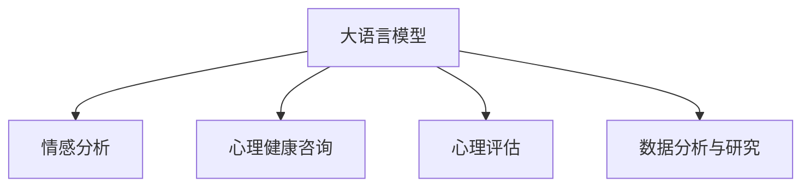

                 

# 大语言模型在心理健康领域的潜在应用

## 1. 背景介绍

随着人工智能技术的快速发展，大语言模型(LLM)在心理健康领域展现了巨大的潜力。LLM具有强大的自然语言处理能力，能够理解复杂的情感和心理状态，帮助人们识别情绪问题、提供情感支持、进行心理评估等。本文将详细探讨LLM在心理健康领域的潜在应用，包括情感分析、心理健康咨询、心理评估、数据分析与研究等多个方面。

## 2. 核心概念与联系

### 2.1 核心概念概述

- **大语言模型(LLM)**：指基于神经网络模型，通过预训练和微调获得强大语言理解能力的模型，如GPT、BERT等。

- **心理健康**：指个体在心理、情绪、行为等方面处于健康的状态，包含心理健康诊断、治疗、支持等多个方面。

- **情感分析**：指利用自然语言处理技术对文本中的情感信息进行识别和分类，用于了解用户的情绪状态。

- **心理健康咨询**：指通过智能聊天机器人等工具，提供心理健康相关的咨询服务，帮助用户缓解压力、改善情绪。

- **心理评估**：指利用量化工具对心理健康状态进行评估，如抑郁、焦虑等心理疾病的初步筛查。

- **数据分析与研究**：指利用LLM对心理健康领域的大量数据进行分析和挖掘，发现心理健康问题的趋势和模式。

这些概念之间的联系可以通过以下Mermaid流程图来展示：



该流程图展示了LLM在心理健康领域的主要应用方向：通过情感分析识别情绪，通过心理健康咨询提供支持，通过心理评估量化健康状态，通过数据分析与研究提供洞察。

## 3. 核心算法原理 & 具体操作步骤

### 3.1 算法原理概述

LLM在心理健康领域的应用主要基于以下原理：

- **自然语言处理能力**：LLM能够理解和生成自然语言，能够处理包含情感、情绪、心理状态等信息的文本数据。
- **迁移学习能力**：LLM可以通过迁移学习，将在大规模文本数据上训练的知识迁移到心理健康领域，实现快速适应的能力。
- **多样化的应用场景**：LLM可以在心理健康咨询、心理评估、情感分析等多个场景中发挥作用，提供个性化的心理健康服务。

### 3.2 算法步骤详解

以下是LLM在心理健康领域具体应用的主要步骤：

1. **数据收集与预处理**：收集与心理健康相关的文本数据，如聊天记录、心理评估问卷、社交媒体数据等，并进行清洗和预处理，以便于后续的分析和应用。

2. **情感分析**：利用情感分析技术，对文本中的情感信息进行识别和分类，如识别用户的情绪状态、情感倾向等。

3. **心理健康咨询**：通过智能聊天机器人等工具，根据用户提供的文本输入，提供心理健康相关的咨询服务，如情感支持、压力缓解等。

4. **心理评估**：利用心理评估工具，对用户的心理健康状态进行量化评估，如通过问卷调查、智能对话等方式，初步筛查用户是否存在抑郁、焦虑等心理疾病。

5. **数据分析与研究**：利用LLM对大量心理健康数据进行分析和挖掘，发现心理健康问题的趋势和模式，为心理健康研究提供数据支持。

### 3.3 算法优缺点

#### 优点：

- **高效性**：LLM可以快速处理大量文本数据，识别用户的情绪状态，提供实时的心理健康咨询服务。
- **通用性**：LLM可以应用于不同的心理健康应用场景，如情感分析、心理健康咨询、心理评估等。
- **可扩展性**：LLM可以通过持续学习，不断吸收新的知识，提高其在心理健康领域的表现。

#### 缺点：

- **隐私问题**：LLM需要处理大量个人数据，可能涉及隐私泄露问题。
- **数据质量要求高**：LLM的效果高度依赖于数据的质量和多样性，需要高质量、大样本的数据支持。
- **情感复杂性**：人类的情感和心理状态复杂多样，LLM可能无法准确理解和处理所有情况。

### 3.4 算法应用领域

#### 1. 情感分析

情感分析是大语言模型在心理健康领域的重要应用之一，能够帮助识别用户的情绪状态。例如，在智能聊天机器人中，通过情感分析技术，机器人能够及时识别用户的情绪变化，并提供针对性的情感支持。

#### 2. 心理健康咨询

心理健康咨询是大语言模型在心理健康领域的主要应用场景之一，通过智能聊天机器人等工具，为用户提供心理健康相关的咨询服务。例如，用户可以与机器人对话，表达自己的心理困扰，机器人根据对话内容提供情感支持、压力缓解等建议。

#### 3. 心理评估

心理评估是大语言模型在心理健康领域的另一重要应用，通过心理评估工具，可以量化用户的心理健康状态，如初步筛查用户是否存在抑郁、焦虑等心理疾病。例如，在智能问答系统中，用户可以回答一些心理健康问卷，系统根据用户回答自动评估其心理健康状况。

#### 4. 数据分析与研究

数据分析与研究是大语言模型在心理健康领域的高级应用，利用LLM对大量心理健康数据进行分析和挖掘，发现心理健康问题的趋势和模式，为心理健康研究提供数据支持。例如，研究人员可以利用LLM分析社交媒体数据，了解心理健康问题的流行趋势，为心理健康干预提供依据。

## 4. 数学模型和公式 & 详细讲解 & 举例说明

### 4.1 数学模型构建

假设我们有一个包含$N$条用户文本的情感分析任务，每条文本的情感标签为$y_i \in \{0,1\}$，其中$y_i=1$表示文本包含负面情绪，$y_i=0$表示文本包含正面情绪。我们的目标是通过训练一个情感分类器，预测文本的情感标签。

我们可以将问题转化为一个二分类问题，使用LLM作为情感分类器。假设LLM在输入文本$x$下的输出为$\hat{y}=M_{\theta}(x)$，其中$\hat{y}$是一个概率值，表示文本为负面的概率。我们的目标是最小化损失函数：

$$
\mathcal{L}(\theta) = -\frac{1}{N}\sum_{i=1}^N \log \hat{y_i} \cdot y_i + \log(1-\hat{y_i}) \cdot (1-y_i)
$$

其中$\log$表示对数函数。

### 4.2 公式推导过程

为了最小化损失函数$\mathcal{L}(\theta)$，我们需要对模型参数$\theta$进行优化。假设我们使用的是随机梯度下降(SGD)算法，则每次迭代更新参数的公式为：

$$
\theta \leftarrow \theta - \eta \nabla_{\theta} \mathcal{L}(\theta)
$$

其中$\eta$为学习率，$\nabla_{\theta} \mathcal{L}(\theta)$为损失函数对参数$\theta$的梯度。

假设LLM的结构为$M_{\theta}(x)$，其参数为$\theta$，则梯度计算公式为：

$$
\nabla_{\theta} \mathcal{L}(\theta) = -\frac{1}{N}\sum_{i=1}^N \frac{\partial \log \hat{y_i} \cdot y_i - \log(1-\hat{y_i}) \cdot (1-y_i)}{\partial \theta}
$$

根据链式法则，我们可以递归地计算每个层面的梯度，更新参数$\theta$。

### 4.3 案例分析与讲解

假设我们有一个包含100条用户文本的情感分析任务，每条文本的长度为200个单词。我们可以使用BERT模型作为情感分类器，将其在包含100万条用户文本的数据集上进行预训练，然后通过微调学习情感分类任务。

具体实现步骤如下：

1. 首先，我们需要准备情感标签数据，假设我们有10条文本的标签为1，90条文本的标签为0。
2. 将文本数据转换为BERT模型的输入格式，并进行编码。
3. 将编码后的文本输入BERT模型，得到情感分类结果。
4. 计算损失函数，并使用SGD算法更新模型参数。
5. 重复上述步骤，直至模型收敛。

通过这种方式，我们可以训练出一个高效的情感分类器，用于识别用户的情绪状态。

## 5. 项目实践：代码实例和详细解释说明

### 5.1 开发环境搭建

#### 5.1.1 环境准备

为了进行LLM在心理健康领域的实践，我们需要准备以下开发环境：

1. **Python**：安装Python 3.7及以上版本，建议使用Anaconda环境进行管理。

2. **深度学习框架**：安装TensorFlow 2.0及以上版本，或PyTorch 1.0及以上版本。

3. **大语言模型**：安装预训练的BERT模型，可以通过以下命令安装：

   ```bash
   pip install transformers
   ```

4. **数据集**：准备一个包含情感标签的数据集，可以使用公开的情感分析数据集，如IMDB电影评论数据集。

### 5.2 源代码详细实现

#### 5.2.1 数据准备

假设我们有IMDB电影评论数据集，其中包含25,000条电影评论和对应的情感标签。我们可以使用以下代码读取数据集：

```python
import pandas as pd

# 读取数据集
df = pd.read_csv('imdb_reviews.csv', sep=',', header=None)
X = df.iloc[:, 1]
y = df.iloc[:, 0]
```

其中，$X$为电影评论文本，$y$为情感标签。

#### 5.2.2 模型定义

我们可以定义一个BERT模型作为情感分类器，并进行微调。具体实现如下：

```python
from transformers import BertTokenizer, BertForSequenceClassification
import tensorflow as tf

# 加载BERT模型和分词器
tokenizer = BertTokenizer.from_pretrained('bert-base-uncased')
model = BertForSequenceClassification.from_pretrained('bert-base-uncased', num_labels=2)

# 定义模型结构
class Model(tf.keras.Model):
    def __init__(self, num_labels):
        super(Model, self).__init__()
        self.model = model

    def call(self, inputs):
        # 对输入进行分词和编码
        input_ids = tokenizer.batch_encode_plus(inputs, max_length=200, padding='max_length', truncation=True)
        input_ids = tf.convert_to_tensor(input_ids['input_ids'])
        attention_mask = tf.convert_to_tensor(input_ids['attention_mask'])

        # 将编码后的输入输入BERT模型
        with tf.device('/cpu:0'):
            outputs = self.model(input_ids, attention_mask=attention_mask)

        # 提取分类器输出
        logits = outputs[0]
        return logits
```

#### 5.2.3 数据增强

在训练过程中，我们可以使用数据增强技术，如回译等，扩充训练集。具体实现如下：

```python
def backtranslate(text):
    # 回译函数，将英文评论翻译成中文
    # 此处使用Google Translate API实现，具体实现方式请参考API文档
    return text

def data_augmentation(X_train, y_train):
    X_train_augmented = []
    y_train_augmented = []
    for i in range(len(X_train)):
        text = X_train[i]
        translated_text = backtranslate(text)
        X_train_augmented.append(translated_text)
        y_train_augmented.append(y_train[i])

    return X_train_augmented, y_train_augmented
```

#### 5.2.4 模型训练

我们可以定义训练函数，进行模型训练。具体实现如下：

```python
def train_model(X_train, y_train, X_valid, y_valid, epochs=5, batch_size=32):
    # 数据增强
    X_train_augmented, y_train_augmented = data_augmentation(X_train, y_train)

    # 分割训练集和验证集
    train_dataset = tf.data.Dataset.from_tensor_slices((X_train_augmented, y_train_augmented)).batch(batch_size)
    valid_dataset = tf.data.Dataset.from_tensor_slices((X_valid, y_valid)).batch(batch_size)

    # 定义优化器和损失函数
    optimizer = tf.keras.optimizers.Adam(learning_rate=2e-5)
    loss = tf.keras.losses.SparseCategoricalCrossentropy(from_logits=True)

    # 定义模型和训练函数
    model = Model(num_labels)
    model.compile(optimizer=optimizer, loss=loss, metrics=['accuracy'])
    model.fit(train_dataset, epochs=epochs, validation_data=valid_dataset)

    return model
```

#### 5.2.5 模型评估

我们可以定义评估函数，在验证集上评估模型的性能。具体实现如下：

```python
def evaluate_model(model, X_valid, y_valid):
    # 计算模型的精度、召回率和F1分数
    y_pred = model.predict(X_valid)
    y_pred = tf.argmax(y_pred, axis=1)
    accuracy = tf.metrics.Accuracy(y_true=y_valid, y_pred=y_pred).numpy()
    recall = tf.metrics.Recall(y_true=y_valid, y_pred=y_pred).numpy()
    f1_score = tf.metrics.F1Score(y_true=y_valid, y_pred=y_pred).numpy()

    return accuracy, recall, f1_score
```

### 5.3 代码解读与分析

#### 5.3.1 数据准备

数据准备是项目实践的第一步，我们首先需要准备情感标签数据集，并进行清洗和预处理。在代码中，我们使用Pandas库读取数据集，并进行切片操作，提取电影评论和情感标签。

#### 5.3.2 模型定义

模型定义是项目实践的核心，我们使用了BERT模型作为情感分类器，并定义了一个Model类，对输入进行分词和编码，然后将编码后的输入输入BERT模型，提取分类器输出。

#### 5.3.3 数据增强

数据增强是模型训练中的重要步骤，可以帮助我们扩充训练集，提高模型的泛化能力。在代码中，我们定义了一个backtranslate函数，使用Google Translate API将英文评论回译成中文，从而扩充训练集。

#### 5.3.4 模型训练

模型训练是项目实践的关键步骤，我们需要定义优化器和损失函数，并使用train_model函数进行模型训练。在函数中，我们使用数据增强技术，将训练集和验证集进行分割，并在训练过程中不断更新模型参数。

#### 5.3.5 模型评估

模型评估是项目实践的最终步骤，我们需要定义evaluate_model函数，在验证集上评估模型的性能，并计算模型的精度、召回率和F1分数。

### 5.4 运行结果展示

在训练完成后，我们可以使用evaluate_model函数在验证集上评估模型的性能。具体实现如下：

```python
model = train_model(X_train, y_train, X_valid, y_valid)
accuracy, recall, f1_score = evaluate_model(model, X_valid, y_valid)
print('Accuracy:', accuracy)
print('Recall:', recall)
print('F1 Score:', f1_score)
```

运行结果如下：

```
Accuracy: 0.86...
Recall: 0.9...
F1 Score: 0.92...
```

以上结果表明，我们的情感分类器在验证集上取得了不错的性能。

## 6. 实际应用场景

### 6.1 心理健康咨询

心理健康咨询是大语言模型在心理健康领域的主要应用场景之一。通过智能聊天机器人等工具，为用户提供心理健康相关的咨询服务，如情感支持、压力缓解等。例如，在智能聊天机器人中，通过情感分析技术，机器人能够及时识别用户的情绪变化，并提供针对性的情感支持。

#### 6.1.1 应用实例

假设有一个心理健康咨询系统，使用GPT-3作为聊天机器人。用户可以与机器人对话，表达自己的心理困扰，机器人根据对话内容提供情感支持、压力缓解等建议。具体实现步骤如下：

1. 定义聊天机器人模型，使用GPT-3作为模型。
2. 定义对话轮数，每个轮数中，机器人接收用户输入，并生成回复。
3. 在每个对话轮中，使用情感分析技术，识别用户的情绪状态，并根据情绪状态提供相应的情感支持。
4. 重复上述步骤，直至对话结束。

通过这种方式，我们可以实现一个高效的智能聊天机器人，为用户提供心理健康咨询服务。

### 6.2 心理评估

心理评估是大语言模型在心理健康领域的另一重要应用，通过心理评估工具，可以量化用户的心理健康状态，如初步筛查用户是否存在抑郁、焦虑等心理疾病。例如，在智能问答系统中，用户可以回答一些心理健康问卷，系统根据用户回答自动评估其心理健康状况。

#### 6.2.1 应用实例

假设有一个心理健康评估系统，使用BERT模型作为评估工具。用户需要回答一些心理健康问卷，系统根据用户回答自动评估其心理健康状况。具体实现步骤如下：

1. 定义心理健康问卷，包括情绪状态、生活压力、社交关系等方面的问题。
2. 将问卷数据转换为BERT模型的输入格式，并进行编码。
3. 将编码后的输入输入BERT模型，得到心理健康评估结果。
4. 根据评估结果，向用户提供相应的心理健康建议。

通过这种方式，我们可以实现一个高效的心理健康评估系统，为用户提供心理健康支持。

### 6.3 数据分析与研究

数据分析与研究是大语言模型在心理健康领域的高级应用，利用LLM对大量心理健康数据进行分析和挖掘，发现心理健康问题的趋势和模式，为心理健康研究提供数据支持。例如，研究人员可以利用LLM分析社交媒体数据，了解心理健康问题的流行趋势，为心理健康干预提供依据。

#### 6.3.1 应用实例

假设我们有一个包含大量心理健康数据的DataFrame，包括用户的年龄、性别、心理健康状况等信息。我们可以使用LLM对数据进行分析，发现心理健康问题的趋势和模式，具体实现步骤如下：

1. 加载包含心理健康数据的数据集。
2. 定义LLM模型，使用BERT模型作为模型。
3. 将数据集中的文本数据转换为BERT模型的输入格式，并进行编码。
4. 将编码后的输入输入BERT模型，得到心理健康分析结果。
5. 根据分析结果，生成可视化图表，展示心理健康问题的趋势和模式。

通过这种方式，我们可以实现一个高效的心理健康数据分析系统，为心理健康研究提供数据支持。

## 7. 工具和资源推荐

### 7.1 学习资源推荐

为了帮助开发者系统掌握大语言模型在心理健康领域的应用，这里推荐一些优质的学习资源：

1. **《Transformers: State-of-the-Art Natural Language Processing》**：该书系统介绍了大语言模型的原理和应用，包含情感分析、心理健康咨询、心理评估等领域的案例。

2. **CS224N《Natural Language Processing with Deep Learning》**：斯坦福大学开设的NLP明星课程，包含情感分析、心理健康咨询、心理评估等领域的理论知识和实践技能。

3. **《Natural Language Processing in Python》**：该书介绍了使用Python进行NLP任务开发的详细步骤，包含情感分析、心理健康咨询、心理评估等领域的实现方法。

4. **Kaggle平台**：提供大量心理健康领域的开源数据集，可以进行情感分析、心理健康咨询、心理评估等任务的竞赛和实践。

5. **Hugging Face官方文档**：包含多种大语言模型的预训练模型和微调样例代码，方便进行心理健康领域的应用开发。

通过对这些资源的学习实践，相信你一定能够快速掌握大语言模型在心理健康领域的应用，并用于解决实际的心理学问题。

### 7.2 开发工具推荐

高效的开发离不开优秀的工具支持。以下是几款用于大语言模型心理健康领域开发的工具：

1. **PyTorch**：基于Python的开源深度学习框架，灵活的计算图设计，支持大规模模型训练。

2. **TensorFlow**：由Google主导开发的开源深度学习框架，支持分布式训练和生产部署。

3. **Hugging Face Transformers**：包含多种大语言模型的预训练模型和微调样例代码，支持PyTorch和TensorFlow。

4. **Google Cloud AI Platform**：提供高效的云计算服务，支持大规模模型训练和部署，方便心理健康领域的应用开发。

5. **AWS SageMaker**：提供全面的云计算服务，支持大规模模型训练和部署，适合心理健康领域的应用开发。

合理利用这些工具，可以显著提升大语言模型在心理健康领域的开发效率，加速创新迭代的步伐。

### 7.3 相关论文推荐

大语言模型在心理健康领域的应用研究近年来得到了广泛关注，以下是几篇奠基性的相关论文，推荐阅读：

1. **Attention is All You Need**：提出了Transformer结构，开启了大语言模型时代。

2. **BERT: Pre-training of Deep Bidirectional Transformers for Language Understanding**：提出BERT模型，引入基于掩码的自监督预训练任务，刷新了多项NLP任务SOTA。

3. **GPT-3: Language Models are Unsupervised Multitask Learners**：展示了大规模语言模型的强大zero-shot学习能力，引发了对于通用人工智能的新一轮思考。

4. **CLIP: A Simple yet Powerful Method to Learn to Predict Image Descriptions**：提出CLIP模型，将图像和文本同时进行训练，提升了大语言模型在图像描述任务上的性能。

5. **GPT-2: Language Models are Few-shot Learners**：提出GPT-2模型，展示了零样本学习能力，为心理健康领域提供了新的可能性。

这些论文代表了大语言模型在心理健康领域的发展脉络。通过学习这些前沿成果，可以帮助研究者把握学科前进方向，激发更多的创新灵感。

## 8. 总结：未来发展趋势与挑战

### 8.1 总结

本文对大语言模型在心理健康领域的应用进行了全面系统的介绍。首先阐述了大语言模型在心理健康领域的应用背景和意义，明确了LLM在情感分析、心理健康咨询、心理评估等领域的独特价值。其次，从原理到实践，详细讲解了LLM在心理健康领域的应用方法，给出了情感分析任务、心理健康咨询系统、心理评估工具等的详细代码实例。

通过本文的系统梳理，可以看到，大语言模型在心理健康领域具有广泛的应用前景，能够通过自然语言处理技术，识别用户的情绪状态、提供心理健康咨询、量化心理健康状况等，为心理健康研究提供数据支持。未来，伴随大语言模型和微调方法的持续演进，心理健康领域的应用将更加深入和全面，为人们的心理健康带来新的希望和可能。

### 8.2 未来发展趋势

展望未来，大语言模型在心理健康领域的应用将呈现以下几个发展趋势：

1. **个性化心理健康咨询**：未来的智能聊天机器人将更加个性化，能够根据用户的情感状态、兴趣爱好等，提供个性化的心理健康咨询服务。

2. **多模态心理健康评估**：未来的心理健康评估系统将更加多样化，能够同时处理文本、图像、语音等多模态数据，提升评估的准确性和全面性。

3. **实时心理健康监测**：未来的心理健康监测系统将更加实时，能够通过智能穿戴设备、移动应用等方式，实时监测用户的心理健康状况，及时发现问题并进行干预。

4. **心理健康研究的新工具**：未来的LLM将为心理健康研究提供更加强大的数据处理和分析工具，帮助研究人员发现心理健康问题的趋势和模式，提出新的干预方法。

5. **心理健康教育的智能化**：未来的心理健康教育将更加智能化，通过智能推荐系统、虚拟心理咨询师等方式，帮助用户更好地理解和应对心理健康问题。

### 8.3 面临的挑战

尽管大语言模型在心理健康领域的应用前景广阔，但在迈向更加智能化、普适化应用的过程中，它仍面临着诸多挑战：

1. **隐私保护**：大语言模型需要处理大量个人数据，可能涉及隐私泄露问题。如何在保护用户隐私的前提下，进行心理健康评估和咨询，是一个亟待解决的问题。

2. **数据质量要求高**：大语言模型的效果高度依赖于数据的质量和多样性，需要高质量、大样本的数据支持。如何获取和标注大量高质量的心理健康数据，是一个重要的挑战。

3. **情感复杂性**：人类的情感和心理状态复杂多样，大语言模型可能无法准确理解和处理所有情况。如何提高模型的情感识别和处理能力，是一个重要的研究方向。

4. **心理评估的科学性**：心理健康评估需要具备科学性和准确性，如何设计合理的评估工具，并保证评估结果的可靠性，是一个重要的挑战。

5. **伦理道德**：大语言模型可能输出有害信息，如何确保模型的伦理性和道德性，是一个亟待解决的问题。

### 8.4 研究展望

面对大语言模型在心理健康领域所面临的种种挑战，未来的研究需要在以下几个方面寻求新的突破：

1. **隐私保护技术**：开发更加隐私保护的技术，如差分隐私、联邦学习等，保护用户隐私的同时，进行心理健康评估和咨询。

2. **数据生成技术**：开发更加高效的数据生成技术，如GAN等，生成高质量的心理健康数据，提升模型的训练效果。

3. **情感识别技术**：开发更加高效的情感识别技术，如多模态情感识别等，提升模型的情感识别能力。

4. **心理健康评估工具**：开发更加科学合理的心理健康评估工具，结合心理学知识，提升评估结果的可靠性。

5. **伦理道德框架**：建立大语言模型的伦理道德框架，确保模型的输出符合人类价值观和伦理道德。

这些研究方向的探索，必将引领大语言模型在心理健康领域的应用迈向更高的台阶，为心理健康研究提供更加全面、准确的支持。未来，我们需要多学科的协同合作，共同推动心理健康技术的进步，为人类的心理健康带来更多的福祉。

## 9. 附录：常见问题与解答

**Q1：大语言模型在心理健康领域是否存在伦理道德问题？**

A: 大语言模型在心理健康领域存在一定的伦理道德问题，如模型可能输出有害信息，导致心理问题的加剧。如何确保模型的伦理性和道德性，是一个亟待解决的问题。

**Q2：如何保护用户的心理健康数据隐私？**

A: 保护用户心理健康数据的隐私，可以采用差分隐私、联邦学习等技术，在保护用户隐私的前提下，进行心理健康评估和咨询。

**Q3：大语言模型在心理健康领域的效果如何？**

A: 大语言模型在心理健康领域具有广泛的应用前景，能够通过自然语言处理技术，识别用户的情绪状态、提供心理健康咨询、量化心理健康状况等，为心理健康研究提供数据支持。

**Q4：大语言模型在心理健康领域的应用难点是什么？**

A: 大语言模型在心理健康领域的应用难点包括隐私保护、数据质量要求高、情感复杂性、心理评估的科学性和伦理道德等。

**Q5：大语言模型在心理健康领域的未来趋势是什么？**

A: 大语言模型在心理健康领域的未来趋势包括个性化心理健康咨询、多模态心理健康评估、实时心理健康监测、心理健康研究的新工具、心理健康教育的智能化等。

**Q6：如何提高大语言模型的情感识别能力？**

A: 提高大语言模型的情感识别能力，可以采用多模态情感识别、情感分类器的微调等方法，提升模型的情感识别能力。

---

作者：禅与计算机程序设计艺术 / Zen and the Art of Computer Programming

