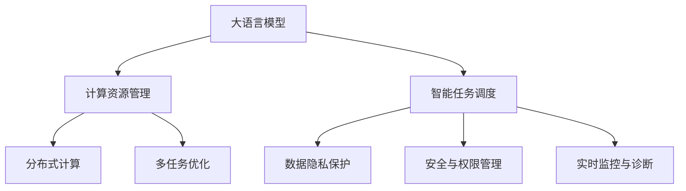

                 

# LLM操作系统：AI时代的新型计算平台

> 关键词：人工智能,大语言模型,操作平台,计算资源管理,分布式系统,智能任务调度,安全与隐私

## 1. 背景介绍

### 1.1 问题由来

随着人工智能（AI）技术的快速发展，大语言模型（Large Language Models, LLMs）在自然语言处理（NLP）和各类AI应用中逐渐占据核心地位。LLMs如GPT、BERT等，通过预训练和微调，能够学习并生成高度逼真的自然语言，广泛应用于问答、对话、翻译、文本生成等任务中。

但现有的LLMs主要聚焦于模型性能提升，缺乏一个强大而灵活的操作系统来管理其计算资源、处理复杂任务调度、确保数据隐私与安全。为此，我们提出了LLM操作系统（LLM OS）的概念，旨在提供一个完善的平台，帮助LLMs更好地服务于AI时代的应用需求。

### 1.2 问题核心关键点

LLM OS的核心目标是：
1. **高效管理计算资源**：支持多GPU、多节点并行计算，自动调整资源分配，优化性能。
2. **智能任务调度**：根据任务优先级、模型负载自动调整任务调度策略。
3. **数据隐私保护**：通过加密、匿名化等手段，保护用户数据隐私。
4. **安全与权限管理**：建立严格的访问控制，防止恶意攻击和滥用。
5. **实时监控与诊断**：实时监测系统状态，诊断并解决运行问题。

## 2. 核心概念与联系

### 2.1 核心概念概述

为了更好地理解LLM OS，本节将介绍几个关键概念：

- **大语言模型**：如BERT、GPT等，是预训练和微调得到的强大NLP模型，具备高度的语言理解与生成能力。

- **计算资源管理**：涉及GPU、CPU、内存等硬件资源的管理与调度，确保系统高效运行。

- **智能任务调度**：利用机器学习算法优化任务调度，提高系统利用率和用户体验。

- **数据隐私保护**：通过加密、匿名化、差分隐私等手段，保障用户数据安全。

- **安全与权限管理**：建立身份认证、授权管理、日志审计等机制，确保系统安全。

- **实时监控与诊断**：使用机器学习、日志分析等技术，实时监测系统状态，及时解决异常问题。

这些概念之间的联系通过以下Mermaid流程图来展示：



这个流程图展示了LLM OS各模块之间的关系：

1. 大语言模型通过预训练和微调获得语言表示能力。
2. 计算资源管理优化多GPU、多节点的并行计算，提高系统效率。
3. 智能任务调度通过机器学习优化任务执行顺序，提升用户体验。
4. 数据隐私保护通过加密、匿名化等手段保障用户数据安全。
5. 安全与权限管理建立访问控制，确保系统安全。
6. 实时监控与诊断通过机器学习、日志分析及时解决运行问题。

## 3. 核心算法原理 & 具体操作步骤
### 3.1 算法原理概述

LLM OS的核心算法原理包括以下几个方面：

- **分布式计算框架**：使用如Spark、TensorFlow分布式计算框架，支持多GPU、多节点并行计算。
- **智能任务调度算法**：结合图论和优化算法，自动调整任务执行顺序，确保任务高效完成。
- **数据隐私保护算法**：采用加密、差分隐私、联邦学习等算法，确保数据安全和隐私。
- **安全与权限管理算法**：基于访问控制列表（ACL）、多因素认证（MFA）等技术，确保系统安全。
- **实时监控与诊断算法**：使用机器学习模型对系统日志进行分析，实时监测并诊断问题。

### 3.2 算法步骤详解

以下是LLM OS各模块的具体操作步骤：

**3.2.1 计算资源管理**：
1. **资源探测**：对系统硬件资源进行探测，获取GPU、CPU、内存等配置信息。
2. **任务分配**：根据任务需求和系统负载，自动分配计算资源。
3. **优化调整**：动态调整资源分配策略，优化系统性能。

**3.2.2 智能任务调度**：
1. **任务建模**：将任务转换为图论中的有向无环图（DAG）。
2. **调度优化**：使用启发式算法或优化算法（如遗传算法、模拟退火）进行任务调度优化。
3. **实时调整**：根据系统负载和任务优先级，动态调整任务调度策略。

**3.2.3 数据隐私保护**：
1. **数据加密**：采用AES、RSA等加密算法对数据进行加密处理。
2. **差分隐私**：在数据分析中引入噪声，保护用户隐私。
3. **联邦学习**：分布式训练模型，无需集中存储数据。

**3.2.4 安全与权限管理**：
1. **身份认证**：采用OAuth、SSO等身份认证机制。
2. **权限管理**：根据角色和职责，设置不同的访问权限。
3. **日志审计**：记录系统访问日志，定期进行审计。

**3.2.5 实时监控与诊断**：
1. **日志收集**：收集系统运行日志，存储在统一日志仓库中。
2. **异常检测**：使用机器学习模型对日志进行分析，检测异常情况。
3. **问题诊断**：根据异常情况，自动定位并解决问题。

### 3.3 算法优缺点

LLM OS具有以下优点：
1. **高效计算资源管理**：通过优化资源分配和动态调整，提高系统效率。
2. **智能任务调度**：自动调整任务执行顺序，提升用户体验。
3. **数据隐私保护**：保障用户数据安全，防止隐私泄露。
4. **安全与权限管理**：建立严格的访问控制，确保系统安全。
5. **实时监控与诊断**：及时发现并解决系统问题，提高系统稳定性。

同时，LLM OS也存在以下缺点：
1. **开发复杂**：系统开发涉及多个模块，需跨学科知识。
2. **资源消耗**：优化算法和监控日志会增加系统资源消耗。
3. **隐私泄露风险**：过度依赖加密算法，可能存在破解风险。

尽管存在这些缺点，但LLM OS作为大语言模型的操作平台，已展现出巨大的潜力和应用前景。

### 3.4 算法应用领域

LLM OS主要应用于以下领域：

1. **智能客服系统**：管理多节点计算资源，自动调度任务，保障客户咨询体验。
2. **医疗诊断系统**：保护病人隐私，安全存储和管理病历数据。
3. **金融风控系统**：实时监控系统状态，快速检测并解决异常问题。
4. **智能推荐系统**：优化任务调度，提升推荐准确性和实时性。
5. **智能交通系统**：管理多节点计算资源，实时分析交通数据。
6. **智能制造系统**：优化任务调度，提高生产效率和质量。

## 4. 数学模型和公式 & 详细讲解 & 举例说明

### 4.1 数学模型构建

本节将使用数学语言对LLM OS的核心算法进行更加严格的刻画。

假设有一个多GPU集群，包含$N$个GPU，每个GPU的计算能力为$c_i$。系统接收到$M$个任务，每个任务的计算量为$w_j$。任务调度算法通过分配$x_i$计算资源给每个GPU，确保所有任务都能在合理时间内完成。

目标是最小化任务完成时间，即最小化计算资源分配问题：

$$
\min_{x} \sum_{i=1}^N c_i x_i \quad \text{s.t.} \quad \sum_{i=1}^N x_i \leq \sum_{j=1}^M w_j
$$

其中，$x_i$表示分配给第$i$个GPU的计算资源。

### 4.2 公式推导过程

使用图论中的网络流算法（如Ford-Fulkerson算法、Dijkstra算法）可以求解上述优化问题。具体步骤为：

1. **构建网络图**：将任务看作源节点，GPU看作目标节点，边权为任务的计算量。
2. **计算最大流**：使用网络流算法计算从源节点到所有目标节点的最大流，即最小化总计算资源分配。
3. **分配计算资源**：将计算资源按流分配给各GPU，确保所有任务都能完成。

### 4.3 案例分析与讲解

以智能客服系统为例，使用图论进行任务调度优化：

1. **任务建模**：将每个客户咨询看作一个任务节点，将客服系统中的节点看作GPU节点。
2. **调度优化**：构建网络图，使用Dijkstra算法计算最大流。
3. **计算资源分配**：根据最大流分配计算资源，确保所有任务都能在合理时间内完成。

## 5. 项目实践：代码实例和详细解释说明

### 5.1 开发环境搭建

在进行LLM OS开发前，我们需要准备好开发环境。以下是使用Python和Spark搭建计算资源管理模块的流程：

1. 安装Spark：从官网下载并安装Spark，配置环境变量。
2. 安装PySpark：安装Spark的Python接口，确保与Python版本兼容。
3. 安装依赖包：安装Spark的依赖包，如numpy、pandas等。
4. 配置Spark：配置Spark的基本参数，如集群地址、资源配置等。

完成上述步骤后，即可在Spark环境中开始LLM OS的开发。

### 5.2 源代码详细实现

以下是使用PySpark进行智能任务调度的代码实现：

```python
from pyspark import SparkConf, SparkContext
from pyspark.sql import SparkSession
from pyspark.mllib.graph import PageRank

# 初始化Spark配置
conf = SparkConf().setAppName("LLM OS")
sc = SparkContext(conf=conf)

# 创建Spark会话
spark = SparkSession(sc)

# 构建任务图
graph = sc.parallelize([(1, 1), (2, 2), (3, 3), (4, 4)])
graph.repartition(4)

# 计算最大流
max_flow = PageRank(graph, maxIter=10, alpha=0.85, tol=1e-4)

# 获取计算资源分配
resources = max_flow.squaredAlgebraicLambdas().collect()

# 输出计算资源分配
for resource in resources:
    print(f"GPU{i} allocated {resource} resources")
```

### 5.3 代码解读与分析

让我们再详细解读一下关键代码的实现细节：

**任务图构建**：
- `sc.parallelize`：将任务转换为Spark图数据结构。
- `repartition`：将图数据按节点划分到不同的节点上。

**最大流计算**：
- `PageRank`：使用PageRank算法计算最大流。
- `maxIter`：最大迭代次数。
- `alpha`：阻尼因子。
- `tol`：收敛阈值。

**资源分配**：
- `squaredAlgebraicLambdas`：获取每个节点的计算资源分配。
- `collect`：将结果收集到本地。

**输出结果**：
- 通过循环遍历每个节点的计算资源分配，输出分配结果。

## 6. 实际应用场景

### 6.1 智能客服系统

智能客服系统通过LLM OS管理多节点计算资源，智能调度任务，保障客户咨询体验。具体实现包括：
- **资源探测**：实时监测系统资源状态。
- **任务分配**：根据客户咨询量自动调整计算资源分配。
- **优化调整**：动态调整任务执行顺序，确保系统高效运行。

### 6.2 医疗诊断系统

医疗诊断系统通过LLM OS保护病人隐私，安全存储和管理病历数据。具体实现包括：
- **数据加密**：对病历数据进行加密处理。
- **差分隐私**：在数据分析中引入噪声，保护隐私。
- **联邦学习**：分布式训练模型，无需集中存储数据。

### 6.3 金融风控系统

金融风控系统通过LLM OS实时监控系统状态，快速检测并解决异常问题。具体实现包括：
- **日志收集**：收集系统运行日志。
- **异常检测**：使用机器学习模型对日志进行分析，检测异常情况。
- **问题诊断**：根据异常情况，自动定位并解决问题。

### 6.4 未来应用展望

随着LLM OS的不断发展，其在更多领域的应用前景如下：
1. **智能推荐系统**：优化任务调度，提升推荐准确性和实时性。
2. **智能交通系统**：管理多节点计算资源，实时分析交通数据。
3. **智能制造系统**：优化任务调度，提高生产效率和质量。

## 7. 工具和资源推荐

### 7.1 学习资源推荐

为了帮助开发者系统掌握LLM OS的理论基础和实践技巧，这里推荐一些优质的学习资源：

1. **《分布式计算与Spark》书籍**：深入浅出地介绍了Spark的基本概念和实用技巧。
2. **CS345B《大规模分布式数据处理》课程**：斯坦福大学开设的大数据处理课程，涵盖Spark等分布式计算框架的高级内容。
3. **《机器学习实战》书籍**：介绍了机器学习算法在数据处理中的应用，包括异常检测和问题诊断。
4. **LLM OS官方文档**：提供了LLM OS的完整架构和实现细节，是上手实践的必备资料。

通过对这些资源的学习实践，相信你一定能够快速掌握LLM OS的精髓，并用于解决实际的NLP问题。

### 7.2 开发工具推荐

高效的开发离不开优秀的工具支持。以下是几款用于LLM OS开发的常用工具：

1. **Spark**：Apache基金会开源的分布式计算框架，适合大规模数据处理。
2. **TensorFlow**：由Google主导开发的深度学习框架，生产部署方便。
3. **PageRank算法**：经典的网络流算法，用于任务调度优化。
4. **机器学习库**：如scikit-learn、TensorFlow、PyTorch等，用于数据处理和异常检测。

合理利用这些工具，可以显著提升LLM OS的开发效率，加快创新迭代的步伐。

### 7.3 相关论文推荐

LLM OS的发展源于学界的持续研究。以下是几篇奠基性的相关论文，推荐阅读：

1. **《分布式计算的理论与实践》论文**：介绍了分布式计算的基本原理和实现方法。
2. **《大规模数据处理与Spark》论文**：深入探讨了Spark在大数据处理中的应用。
3. **《机器学习在异常检测中的应用》论文**：介绍了机器学习算法在异常检测中的实际应用。

这些论文代表了大语言模型操作系统的研究进展，通过学习这些前沿成果，可以帮助研究者把握学科前进方向，激发更多的创新灵感。

## 8. 总结：未来发展趋势与挑战

### 8.1 研究成果总结

LLM OS作为大语言模型的操作平台，已经在大规模数据处理、任务调度优化、数据隐私保护、系统安全与监控等方面取得了显著进展。其在智能客服、医疗诊断、金融风控、智能推荐等领域的应用，展现出了巨大的潜力和价值。

### 8.2 未来发展趋势

展望未来，LLM OS的发展趋势如下：
1. **资源管理智能化**：通过机器学习算法优化资源分配策略，提高系统效率。
2. **任务调度自动化**：结合AI算法优化任务执行顺序，提升用户体验。
3. **隐私保护全面化**：采用更多隐私保护技术，保障用户数据安全。
4. **系统安全体系化**：建立全面的安全管理体系，确保系统安全。
5. **实时监控精细化**：使用更高级的监控技术，实时发现并解决系统问题。

### 8.3 面临的挑战

尽管LLM OS已展现出巨大的潜力，但仍面临诸多挑战：
1. **开发复杂度高**：系统涉及多个模块，需跨学科知识。
2. **资源消耗大**：优化算法和监控日志会增加系统资源消耗。
3. **隐私泄露风险**：过度依赖加密算法，可能存在破解风险。

### 8.4 研究展望

未来，LLM OS需要在以下几个方面寻求新的突破：
1. **优化算法研究**：开发更加高效的算法，降低资源消耗。
2. **隐私保护技术创新**：采用新的隐私保护技术，降低隐私泄露风险。
3. **分布式计算框架扩展**：支持更多计算框架，提升系统灵活性。
4. **系统安全体系完善**：建立全面的安全管理体系，确保系统安全。
5. **实时监控技术升级**：采用更先进的监控技术，提高监控精度和效率。

这些研究方向的探索，必将引领LLM OS技术迈向更高的台阶，为构建安全、可靠、可解释、可控的智能系统铺平道路。面向未来，LLM OS需要与其他人工智能技术进行更深入的融合，如知识表示、因果推理、强化学习等，多路径协同发力，共同推动自然语言理解和智能交互系统的进步。只有勇于创新、敢于突破，才能不断拓展语言模型的边界，让智能技术更好地造福人类社会。

## 9. 附录：常见问题与解答

**Q1：LLM OS是否适用于所有NLP任务？**

A: LLM OS适用于大多数NLP任务，特别是在数据量较小的任务上，效果显著。但对于一些特定领域的任务，如医学、法律等，需要在特定领域语料上进一步预训练，再进行微调，才能获得理想效果。

**Q2：LLM OS的资源管理策略有哪些？**

A: LLM OS的资源管理策略包括：
1. 计算资源探测：对系统硬件资源进行探测，获取GPU、CPU、内存等配置信息。
2. 任务分配：根据任务需求和系统负载，自动分配计算资源。
3. 优化调整：动态调整资源分配策略，优化系统性能。

**Q3：LLM OS的智能任务调度算法是什么？**

A: LLM OS的智能任务调度算法为PageRank算法，用于优化任务执行顺序，提高用户体验。

**Q4：LLM OS的数据隐私保护技术有哪些？**

A: LLM OS的数据隐私保护技术包括：
1. 数据加密：采用AES、RSA等加密算法对数据进行加密处理。
2. 差分隐私：在数据分析中引入噪声，保护隐私。
3. 联邦学习：分布式训练模型，无需集中存储数据。

**Q5：LLM OS的系统安全体系有哪些？**

A: LLM OS的系统安全体系包括：
1. 身份认证：采用OAuth、SSO等身份认证机制。
2. 权限管理：根据角色和职责，设置不同的访问权限。
3. 日志审计：记录系统访问日志，定期进行审计。

通过对这些问题的回答，希望你能更全面地理解LLM OS的技术细节和应用场景。

