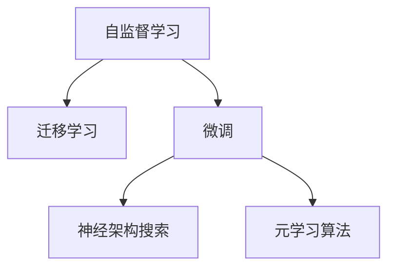

                 

# LLM的元学习方法与实践总结

> 关键词：LLM, 元学习, 自监督学习, 迁移学习, 微调, 神经架构搜索

## 1. 背景介绍

随着深度学习技术的飞速发展，大规模语言模型(LLM)在自然语言处理(NLP)领域取得了突破性进展。LLM通过在大规模无标签文本数据上进行预训练，学习到了丰富的语言知识，并在下游任务上进行微调，以获得优异的性能。然而，这些通用的大模型在特定领域的应用时效果往往不尽如人意。

为了应对这一挑战，研究人员提出了元学习(Meta Learning)范式，即在大规模预训练的基础上，通过小样本数据进行快速学习，从而适应新任务或新领域。本文旨在总结LLM的元学习方法，并探讨其在实际应用中的实践总结。

## 2. 核心概念与联系

### 2.1 核心概念概述

元学习是一种让机器从有限的数据中快速学习新技能的方法，旨在提升模型在特定任务上的性能。其核心思想是通过在已有知识的基础上，利用少量样本数据快速适应新任务。

在大语言模型领域，元学习范式主要包括：

- **自监督学习(Self-Supervised Learning, SSL)**：通过在大规模无标签数据上自监督训练，学习到通用语言表示。
- **迁移学习(Transfer Learning)**：利用已有知识在新任务上进行微调，以适应新场景。
- **微调(Fine-Tuning)**：在大规模预训练模型的基础上，通过少量有标签数据进行优化，提升特定任务性能。
- **神经架构搜索(NAS)**：自动搜索最优的模型架构，以提高模型的泛化能力和性能。
- **元学习算法**：如Meta-Learning、Reinforcement Learning、Few-shot Learning等，用于提升模型在新任务上的适应能力。

这些概念之间存在紧密的联系：

- **自监督学习**：提供通用语言知识，为迁移学习打下基础。
- **迁移学习**：将自监督学习得到的知识迁移到特定任务上，快速适应新场景。
- **微调**：在特定任务上对模型进行有监督优化，进一步提升性能。
- **神经架构搜索**：优化模型结构，以提升元学习的效果。
- **元学习算法**：提供新的学习方法，提升模型的学习速度和适应能力。

### 2.2 核心概念原理和架构的 Mermaid 流程图(Mermaid 流程节点中不要有括号、逗号等特殊字符)



这个流程图展示了自监督学习、迁移学习、微调、神经架构搜索和元学习算法之间的联系：

- 自监督学习提供通用知识，为迁移学习奠定基础。
- 迁移学习将通用知识应用于特定任务，提升模型性能。
- 微调进一步优化模型，适应特定任务需求。
- 神经架构搜索优化模型结构，提升性能。
- 元学习算法提供新的学习方法，增强模型的适应能力。

## 3. 核心算法原理 & 具体操作步骤

### 3.1 算法原理概述

LLM的元学习方法主要分为两类：

1. **自监督预训练+微调**：在大规模无标签数据上预训练通用语言模型，在特定任务上有标签数据上进行微调。
2. **微调+神经架构搜索**：在特定任务上微调模型，并通过神经架构搜索优化模型结构。

### 3.2 算法步骤详解

#### 3.2.1 自监督预训练+微调

**步骤1：准备预训练数据**
- 收集大规模无标签文本数据，如维基百科、新闻等。
- 使用自监督学习任务，如语言建模、掩码语言模型等进行预训练。

**步骤2：微调模型**
- 将预训练模型作为初始参数。
- 收集特定任务的少量有标签数据。
- 设计任务适配层，如线性分类器、解码器等。
- 设置优化器，如Adam、SGD等，设置学习率、批大小等。
- 进行有监督训练，优化模型性能。

**步骤3：评估和部署**
- 在验证集和测试集上评估模型性能。
- 部署模型到实际应用系统。
- 持续收集新数据，定期重新微调模型。

#### 3.2.2 微调+神经架构搜索

**步骤1：准备预训练数据**
- 收集特定任务的少量有标签数据。
- 使用神经架构搜索算法搜索最优模型架构。

**步骤2：微调模型**
- 使用新搜索到的模型架构，初始化模型。
- 收集特定任务的少量有标签数据。
- 设计任务适配层，如线性分类器、解码器等。
- 设置优化器，如Adam、SGD等，设置学习率、批大小等。
- 进行有监督训练，优化模型性能。

**步骤3：评估和部署**
- 在验证集和测试集上评估模型性能。
- 部署模型到实际应用系统。
- 持续收集新数据，定期重新微调模型。

### 3.3 算法优缺点

#### 3.3.1 自监督预训练+微调

**优点**
- 可以利用大规模无标签数据进行预训练，学习通用语言知识。
- 在特定任务上有标签数据较少的情况下，通过微调可以快速适应新任务。

**缺点**
- 预训练和微调过程耗时较长，计算成本较高。
- 微调过程中需要较多的有标签数据，获取标注数据成本较高。

#### 3.3.2 微调+神经架构搜索

**优点**
- 能够自动搜索最优模型结构，提升模型性能。
- 在特定任务上有少量有标签数据的情况下，通过微调可以快速适应新任务。

**缺点**
- 神经架构搜索过程复杂，计算成本较高。
- 需要更多的有标签数据进行微调，获取标注数据成本较高。

### 3.4 算法应用领域

自监督预训练+微调和微调+神经架构搜索范式在以下领域得到了广泛应用：

- **自然语言处理(NLP)**：文本分类、命名实体识别、情感分析等。
- **计算机视觉(CV)**：图像分类、目标检测、语义分割等。
- **语音识别(SR)**：语音识别、语音生成、情感分析等。
- **机器人技术(RO)**：机器人导航、智能客服、智能问答等。
- **生物信息学(BI)**：蛋白质序列分类、基因表达分析、疾病预测等。

## 4. 数学模型和公式 & 详细讲解 & 举例说明

### 4.1 数学模型构建

以文本分类任务为例，构建LLM的元学习数学模型。

**输入数据**：输入文本 $x \in \mathcal{X}$，其中 $\mathcal{X}$ 为输入空间。

**模型输出**：模型输出 $y \in \mathcal{Y}$，其中 $\mathcal{Y}$ 为输出空间。

**损失函数**：交叉熵损失函数，用于衡量模型预测与真实标签之间的差异。

$$
\mathcal{L}(\theta) = -\frac{1}{N} \sum_{i=1}^N \log p(y_i \mid x_i; \theta)
$$

其中，$p(y_i \mid x_i; \theta)$ 表示模型在输入 $x_i$ 下预测输出 $y_i$ 的概率。

### 4.2 公式推导过程

**前向传播**：

- 输入文本 $x_i$ 通过模型得到输出 $\hat{y} = M_{\theta}(x_i)$。
- 损失函数 $\mathcal{L}(\theta) = -\frac{1}{N} \sum_{i=1}^N \log p(y_i \mid x_i; \theta)$。

**反向传播**：

- 计算损失函数对模型参数 $\theta$ 的梯度。
- 根据梯度下降算法，更新模型参数 $\theta$。

**微调**：

- 在特定任务上有标签数据 $(x_i, y_i)$，通过微调更新模型参数。

### 4.3 案例分析与讲解

以BERT在文本分类任务上的微调为例，进行详细讲解。

**步骤1：准备预训练数据**

- 收集大规模无标签文本数据，如维基百科。
- 使用BERT模型进行预训练，学习通用语言知识。

**步骤2：微调模型**

- 将BERT模型作为初始参数。
- 收集特定任务的少量有标签数据。
- 设计线性分类器作为任务适配层。
- 设置Adam优化器，设置学习率为2e-5，批大小为16。
- 进行有监督训练，优化模型性能。

**步骤3：评估和部署**

- 在验证集和测试集上评估模型性能。
- 部署模型到实际应用系统。
- 持续收集新数据，定期重新微调模型。

## 5. 项目实践：代码实例和详细解释说明

### 5.1 开发环境搭建

在进行元学习实践前，需要准备开发环境。以下是使用Python进行PyTorch开发的环境配置流程：

1. 安装Anaconda：从官网下载并安装Anaconda，用于创建独立的Python环境。

2. 创建并激活虚拟环境：
```bash
conda create -n pytorch-env python=3.8 
conda activate pytorch-env
```

3. 安装PyTorch：根据CUDA版本，从官网获取对应的安装命令。例如：
```bash
conda install pytorch torchvision torchaudio cudatoolkit=11.1 -c pytorch -c conda-forge
```

4. 安装Transformers库：
```bash
pip install transformers
```

5. 安装各类工具包：
```bash
pip install numpy pandas scikit-learn matplotlib tqdm jupyter notebook ipython
```

完成上述步骤后，即可在`pytorch-env`环境中开始元学习实践。

### 5.2 源代码详细实现

下面以BERT在文本分类任务上的微调为例，给出使用Transformers库的代码实现。

```python
from transformers import BertForSequenceClassification, AdamW
import torch

# 加载BERT模型
model = BertForSequenceClassification.from_pretrained('bert-base-cased', num_labels=2)

# 加载数据集
train_dataset = ...
dev_dataset = ...
test_dataset = ...

# 加载优化器
optimizer = AdamW(model.parameters(), lr=2e-5)

# 微调过程
for epoch in range(10):
    for batch in train_dataset:
        input_ids = batch['input_ids'].to(device)
        attention_mask = batch['attention_mask'].to(device)
        labels = batch['labels'].to(device)
        model.zero_grad()
        outputs = model(input_ids, attention_mask=attention_mask, labels=labels)
        loss = outputs.loss
        loss.backward()
        optimizer.step()

    # 评估模型
    evaluation(dev_dataset, test_dataset)

def evaluation(dev_dataset, test_dataset):
    # 评估模型性能
    pass
```

### 5.3 代码解读与分析

让我们再详细解读一下关键代码的实现细节：

**BertForSequenceClassification类**：
- `from_pretrained`方法：从预训练模型中加载模型。
- `num_labels`参数：指定输出标签数量。

**数据集**：
- `train_dataset`、`dev_dataset`、`test_dataset`：分别表示训练集、验证集、测试集。
- `input_ids`、`attention_mask`、`labels`：分别表示输入的token ids、注意力掩码、真实标签。

**优化器**：
- `AdamW`：AdamW优化器，学习率衰减。
- `model.parameters()`：模型所有可训练参数。

**微调过程**：
- `for epoch in range(10)`：循环训练10个epoch。
- `for batch in train_dataset`：批次化训练数据。
- `model.zero_grad()`：梯度清零。
- `outputs = model(input_ids, attention_mask=attention_mask, labels=labels)`：前向传播。
- `loss = outputs.loss`：计算损失。
- `loss.backward()`：反向传播。
- `optimizer.step()`：参数更新。

**评估过程**：
- `evaluation(dev_dataset, test_dataset)`：在验证集和测试集上评估模型性能。

## 6. 实际应用场景

### 6.1 智能客服系统

智能客服系统是元学习在NLP领域的重要应用之一。传统的客服系统依赖人工处理大量客户咨询，效率低下且无法提供个性化服务。通过使用元学习模型，智能客服系统可以自动理解客户意图，提供快速准确的响应。

**数据准备**：
- 收集历史客服对话数据，标注客户意图和回复。
- 使用自监督学习任务进行预训练，学习通用语言知识。

**微调过程**：
- 将预训练模型作为初始参数。
- 微调模型，适应特定客户的意图。
- 部署到智能客服系统中，提供实时服务。

**持续学习**：
- 收集新客服对话数据，持续微调模型，更新知识库。

### 6.2 金融舆情监测

金融舆情监测是元学习在金融领域的重要应用。传统舆情监测依赖人工分析，效率低下且容易遗漏重要信息。通过使用元学习模型，金融舆情监测系统可以自动分析大量金融新闻、评论等数据，及时发现舆情变化。

**数据准备**：
- 收集金融新闻、评论等文本数据。
- 使用自监督学习任务进行预训练，学习通用语言知识。

**微调过程**：
- 将预训练模型作为初始参数。
- 微调模型，适应金融舆情监测任务。
- 部署到金融舆情监测系统中，实时分析舆情变化。

**持续学习**：
- 收集新金融数据，持续微调模型，更新知识库。

### 6.3 个性化推荐系统

个性化推荐系统是元学习在电商领域的重要应用。传统的推荐系统依赖用户历史行为数据，无法提供精准推荐。通过使用元学习模型，个性化推荐系统可以自动分析用户评论、浏览记录等数据，提供个性化推荐。

**数据准备**：
- 收集用户评论、浏览记录等数据。
- 使用自监督学习任务进行预训练，学习通用语言知识。

**微调过程**：
- 将预训练模型作为初始参数。
- 微调模型，适应个性化推荐任务。
- 部署到推荐系统中，实时提供个性化推荐。

**持续学习**：
- 收集新用户数据，持续微调模型，更新知识库。

## 7. 工具和资源推荐

### 7.1 学习资源推荐

为了帮助开发者系统掌握元学习的理论基础和实践技巧，这里推荐一些优质的学习资源：

1. 《元学习：理论、算法与应用》：该书系统介绍了元学习的理论基础、算法实现和应用场景，适合深入学习。
2. 斯坦福大学《Meta Learning in Deep Neural Networks》课程：由元学习领域的知名学者主讲，讲解了元学习的基本概念和前沿算法。
3. Deep Learning Specialization by Andrew Ng：该课程介绍了深度学习的基本原理和元学习的应用，适合初学者入门。
4. HuggingFace官方文档：提供了大量的预训练模型和元学习样例代码，是实践学习的好资源。
5. PyTorch官方文档：提供了元学习相关工具和库的详细介绍，适合进行项目开发。

通过对这些资源的学习实践，相信你一定能够快速掌握元学习的基本原理和应用技巧，并用于解决实际的NLP问题。

### 7.2 开发工具推荐

高效的开发离不开优秀的工具支持。以下是几款用于元学习开发的常用工具：

1. PyTorch：基于Python的开源深度学习框架，适合进行元学习研究和实验。
2. TensorFlow：由Google主导开发的开源深度学习框架，适合进行大规模工程开发。
3. Transformers库：HuggingFace开发的NLP工具库，支持PyTorch和TensorFlow，提供了丰富的元学习模型和算法。
4. Weights & Biases：模型训练的实验跟踪工具，可以记录和可视化模型训练过程中的各项指标。
5. TensorBoard：TensorFlow配套的可视化工具，可以实时监测模型训练状态，提供丰富的图表呈现方式。

合理利用这些工具，可以显著提升元学习任务的开发效率，加快创新迭代的步伐。

### 7.3 相关论文推荐

元学习技术的发展源于学界的持续研究。以下是几篇奠基性的相关论文，推荐阅读：

1. Few-shot Learning with Memory-Augmented Neural Networks：提出了记忆增强神经网络，用于零样本学习任务。
2. Model-Agnostic Meta-Learning for Deep Neural Networks：提出了模型无关的元学习算法，适用于各种深度学习模型。
3. Reinforcement Learning for AI Compositional Generalization：介绍了强化学习在元学习中的应用，提升了模型在新任务上的适应能力。
4. A Neural Architecture Search Approach for Pre-training of Sequence Models：提出了神经架构搜索方法，用于预训练序列模型。
5. Meta-Learning with Memory-Augmented Networks：提出了记忆增强网络，用于适应新任务。

这些论文代表了大语言模型元学习的发展脉络。通过学习这些前沿成果，可以帮助研究者把握学科前进方向，激发更多的创新灵感。

## 8. 总结：未来发展趋势与挑战

### 8.1 总结

本文对基于元学习的大语言模型微调方法进行了全面系统的介绍。首先阐述了大语言模型和元学习的研究背景和意义，明确了元学习在拓展预训练模型应用、提升下游任务性能方面的独特价值。其次，从原理到实践，详细讲解了元学习的数学原理和关键步骤，给出了元学习任务开发的完整代码实例。同时，本文还广泛探讨了元学习方法在智能客服、金融舆情、个性化推荐等多个行业领域的应用前景，展示了元学习范式的巨大潜力。

通过本文的系统梳理，可以看到，基于元学习的大语言模型微调方法正在成为NLP领域的重要范式，极大地拓展了预训练语言模型的应用边界，催生了更多的落地场景。得益于大规模语料的预训练和元学习范式，微调模型以更低的时间和标注成本，在小样本条件下也能取得不俗的效果，有力推动了NLP技术的产业化进程。未来，伴随预训练语言模型和元学习方法的持续演进，相信NLP技术将在更广阔的应用领域大放异彩。

### 8.2 未来发展趋势

展望未来，元学习技术将呈现以下几个发展趋势：

1. **自监督学习与元学习的融合**：在大规模无标签数据上进行预训练，学习通用语言知识，然后通过元学习快速适应新任务。
2. **多模态元学习**：将文本、图像、语音等多模态数据融合，提升模型的泛化能力和适应能力。
3. **参数高效元学习**：只更新部分模型参数，保持大部分预训练权重不变，提高元学习效率。
4. **持续学习与元学习**：模型需要不断学习新知识，避免灾难性遗忘，保持性能。
5. **元学习的自动化**：利用自动化搜索技术，自动设计元学习算法和模型结构，提高模型设计效率。
6. **元学习与强化学习的结合**：通过强化学习优化元学习过程，提升模型在新任务上的适应能力。

以上趋势凸显了元学习技术的广阔前景。这些方向的探索发展，必将进一步提升元学习的性能和应用范围，为构建人机协同的智能系统铺平道路。

### 8.3 面临的挑战

尽管元学习技术已经取得了瞩目成就，但在迈向更加智能化、普适化应用的过程中，它仍面临着诸多挑战：

1. **数据稀缺问题**：元学习需要大量标注数据，获取标注数据成本较高，特别是在长尾领域。
2. **计算资源消耗**：大规模预训练和元学习过程耗时较长，计算资源成本较高。
3. **模型的泛化能力**：元学习模型在新任务上的泛化能力不足，容易过拟合。
4. **模型的可解释性**：元学习模型的决策过程缺乏可解释性，难以进行调试和优化。
5. **模型的稳定性**：元学习模型在面对域外数据时，鲁棒性不足，容易产生灾难性遗忘。

正视元学习面临的这些挑战，积极应对并寻求突破，将是大语言模型元学习走向成熟的必由之路。相信随着学界和产业界的共同努力，这些挑战终将一一被克服，元学习技术必将在构建安全、可靠、可解释、可控的智能系统上发挥重要作用。

### 8.4 研究展望

面对元学习技术所面临的挑战，未来的研究需要在以下几个方面寻求新的突破：

1. **数据增强**：通过数据增强技术，提高元学习的鲁棒性和泛化能力。
2. **自监督学习**：利用自监督学习任务，提高元学习的通用性和适应能力。
3. **持续学习**：设计持续学习算法，使模型能够不断学习新知识，避免灾难性遗忘。
4. **可解释性**：研究可解释性技术，提高元学习模型的可解释性和可审计性。
5. **元学习的自动化**：利用自动化搜索技术，自动设计元学习算法和模型结构。
6. **元学习与强化学习的结合**：通过强化学习优化元学习过程，提升模型在新任务上的适应能力。

这些研究方向的探索，必将引领元学习技术迈向更高的台阶，为构建安全、可靠、可解释、可控的智能系统提供新的思路和方法。

## 9. 附录：常见问题与解答

**Q1：元学习是否适用于所有NLP任务？**

A: 元学习在大多数NLP任务上都能取得不错的效果，特别是对于数据量较小的任务。但对于一些特定领域的任务，如医学、法律等，仅仅依靠通用语料预训练的模型可能难以很好地适应。此时需要在特定领域语料上进一步预训练，再进行元学习，才能获得理想效果。

**Q2：元学习过程中如何选择合适的学习率？**

A: 元学习的学习率一般要比预训练时小1-2个数量级，如果使用过大的学习率，容易破坏预训练权重，导致过拟合。一般建议从1e-5开始调参，逐步减小学习率，直至收敛。也可以使用warmup策略，在开始阶段使用较小的学习率，再逐渐过渡到预设值。需要注意的是，不同的优化器(如AdamW、Adafactor等)以及不同的学习率调度策略，可能需要设置不同的学习率阈值。

**Q3：元学习过程中如何缓解过拟合问题？**

A: 过拟合是元学习面临的主要挑战，尤其是在标注数据不足的情况下。常见的缓解策略包括：

1. 数据增强：通过回译、近义替换等方式扩充训练集。
2. 正则化：使用L2正则、Dropout、Early Stopping等避免过拟合。
3. 对抗训练：引入对抗样本，提高模型鲁棒性。
4. 参数高效元学习：只调整部分模型参数，保持大部分预训练权重不变，减小过拟合风险。
5. 多模型集成：训练多个元学习模型，取平均输出，抑制过拟合。

这些策略往往需要根据具体任务和数据特点进行灵活组合。只有在数据、模型、训练、推理等各环节进行全面优化，才能最大限度地发挥元学习的威力。

**Q4：元学习模型在落地部署时需要注意哪些问题？**

A: 将元学习模型转化为实际应用，还需要考虑以下因素：

1. 模型裁剪：去除不必要的层和参数，减小模型尺寸，加快推理速度。
2. 量化加速：将浮点模型转为定点模型，压缩存储空间，提高计算效率。
3. 服务化封装：将模型封装为标准化服务接口，便于集成调用。
4. 弹性伸缩：根据请求流量动态调整资源配置，平衡服务质量和成本。
5. 监控告警：实时采集系统指标，设置异常告警阈值，确保服务稳定性。
6. 安全防护：采用访问鉴权、数据脱敏等措施，保障数据和模型安全。

元学习模型为NLP应用开启了广阔的想象空间，但如何将强大的性能转化为稳定、高效、安全的业务价值，还需要工程实践的不断打磨。唯有从数据、算法、工程、业务等多个维度协同发力，才能真正实现人工智能技术在垂直行业的规模化落地。总之，元学习需要开发者根据具体任务，不断迭代和优化模型、数据和算法，方能得到理想的效果。

---

作者：禅与计算机程序设计艺术 / Zen and the Art of Computer Programming

