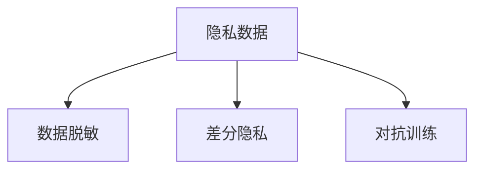
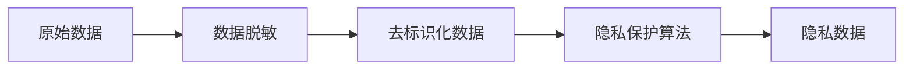
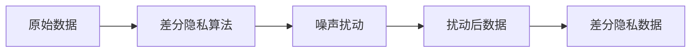

                 

# LLM隐私保护:现状、漏洞与对策

## 1. 背景介绍

### 1.1 问题由来
随着人工智能技术的飞速发展，大规模预训练语言模型（LLM）在自然语言处理（NLP）领域取得了显著成果。然而，LLM在提升语言理解和生成能力的同时，也引发了一系列隐私问题。这主要体现在LLM对用户隐私数据的敏感性、数据的收集和使用、数据隐私保护的策略以及隐私泄露的风险上。

### 1.2 问题核心关键点
- **数据隐私：**LLM依赖于大量的文本数据进行训练，这些数据可能包含敏感信息，如个人隐私、商业机密等。
- **数据使用：**数据收集和使用过程中可能发生隐私泄露，例如数据泄露、滥用等。
- **隐私保护：**如何有效保护数据隐私，防止未授权访问和数据滥用。
- **隐私风险：**模型训练和应用过程中可能引入的隐私风险，如模型偏见、歧视性输出等。

这些关键问题揭示了LLM隐私保护的重要性，同时也提示我们在推进技术应用的同时，必须重视隐私保护。本文将围绕这些问题展开讨论，探讨LLM隐私保护的现状、漏洞以及相应的对策。

## 2. 核心概念与联系

### 2.1 核心概念概述

为了深入理解LLM隐私保护，我们首先需要介绍几个关键概念：

- **隐私数据：**指任何可被用于识别个人身份或行为的数据。
- **隐私保护：**通过技术手段和管理措施，确保隐私数据不被未授权访问和使用。
- **数据脱敏：**通过处理技术手段，使得数据无法识别特定个体或组织，从而保护隐私。
- **差分隐私：**在数据分析和模型训练过程中，通过引入噪声扰动等技术手段，确保个体数据无法被反向推断。
- **对抗训练：**通过引入对抗样本，增强模型的鲁棒性，防止攻击者通过特定输入获取隐私信息。

这些概念通过以下Mermaid流程图进行展示：



这个流程图揭示了隐私保护的主要手段和其与隐私数据的关联。

### 2.2 核心概念原理和架构的 Mermaid 流程图

在隐私保护中，数据脱敏和差分隐私是两个重要的技术手段，下面通过流程图示意其原理：



此图展示了数据脱敏的过程，即从原始数据到去标识化数据的转换。



此图展示了差分隐私的过程，即在原始数据中加入噪声扰动，使得个体数据无法被反向推断。

## 3. 核心算法原理 & 具体操作步骤

### 3.1 算法原理概述

隐私保护的核心在于确保数据的安全性，防止数据泄露和滥用。在LLM中，隐私保护通常涉及两个阶段：数据收集和模型训练。

**数据收集阶段：**
- 收集数据时，应遵循最小必要原则，仅收集完成任务所需的最少数据。
- 使用数据脱敏技术，如匿名化、泛化等，保护数据隐私。

**模型训练阶段：**
- 在模型训练中，采用差分隐私技术，引入噪声扰动，确保个体数据无法被反向推断。
- 采用对抗训练，通过引入对抗样本，增强模型的鲁棒性，防止攻击者通过特定输入获取隐私信息。

### 3.2 算法步骤详解

#### 数据收集阶段：

1. **数据收集：**
   - 使用最小必要原则，仅收集完成任务所需的最少数据。
   - 对数据进行匿名化处理，如删除标识性信息、使用匿名化算法等。

2. **数据脱敏：**
   - 使用数据脱敏技术，如泛化、扰动等，使得数据无法识别特定个体或组织。
   - 对于文本数据，可以采用停用词过滤、同义词替换等技术，减少敏感信息的暴露。

#### 模型训练阶段：

1. **差分隐私：**
   - 在模型训练中，引入噪声扰动，确保个体数据无法被反向推断。
   - 使用Laplace机制、高斯机制等差分隐私算法，在损失函数中加入隐私预算，控制隐私损失。

2. **对抗训练：**
   - 引入对抗样本，对模型进行训练，增强模型的鲁棒性。
   - 使用生成对抗网络（GAN）等方法，生成对抗样本，用于模型训练。

### 3.3 算法优缺点

#### 优点：

- **保护隐私：**通过数据脱敏、差分隐私等技术手段，可以有效保护数据隐私。
- **鲁棒性增强：**对抗训练技术可以增强模型的鲁棒性，防止攻击者通过特定输入获取隐私信息。

#### 缺点：

- **模型性能影响：**差分隐私和对抗训练可能影响模型的性能，尤其是在噪声扰动和对抗样本的处理上。
- **成本高：**数据脱敏和差分隐私技术需要较高的计算成本和时间成本。

### 3.4 算法应用领域

隐私保护技术在LLM中的应用领域非常广泛，包括但不限于以下几个方面：

1. **医疗数据保护：**在医疗领域，患者隐私数据非常敏感。通过差分隐私技术，保护医疗数据的安全性。
2. **金融隐私保护：**在金融领域，客户交易数据非常敏感。使用数据脱敏和差分隐私技术，确保数据的安全性。
3. **社交媒体隐私保护：**在社交媒体领域，用户行为数据非常敏感。通过数据脱敏和差分隐私技术，保护用户隐私。
4. **政府数据保护：**在政府领域，公共数据的安全性非常重要。使用数据脱敏和差分隐私技术，保护公共数据的安全。

## 4. 数学模型和公式 & 详细讲解

### 4.1 数学模型构建

在差分隐私中，Laplace机制和高斯机制是两种常见的差分隐私算法，其数学模型如下：

**Laplace机制：**

\[ \hat{f}(x) = f(x) + \mathcal{N}(0,\Delta) \]

其中，\( \mathcal{N}(0,\Delta) \) 表示均值为0、标准差为 \( \Delta \) 的Laplace分布，\( \Delta \) 为隐私预算，控制隐私损失。

**高斯机制：**

\[ \hat{f}(x) = f(x) + \mathcal{N}(0,\sigma^2) \]

其中，\( \mathcal{N}(0,\sigma^2) \) 表示均值为0、标准差为 \( \sigma \) 的高斯分布。

### 4.2 公式推导过程

#### Laplace机制：

1. **隐私预算：**隐私预算 \( \Delta \) 决定了隐私损失的大小，通常设置较小的隐私预算以确保较高的隐私保护水平。
2. **噪声扰动：**在模型训练中，加入Laplace分布的噪声 \( \mathcal{N}(0,\Delta) \)，确保个体数据无法被反向推断。
3. **隐私损失：**通过计算隐私损失函数，衡量模型输出的隐私风险。

#### 高斯机制：

1. **隐私预算：**隐私预算 \( \sigma \) 决定了隐私损失的大小，通常设置较小的隐私预算以确保较高的隐私保护水平。
2. **噪声扰动：**在模型训练中，加入高斯分布的噪声 \( \mathcal{N}(0,\sigma^2) \)，确保个体数据无法被反向推断。
3. **隐私损失：**通过计算隐私损失函数，衡量模型输出的隐私风险。

### 4.3 案例分析与讲解

**案例：金融数据隐私保护**

1. **数据收集：**收集用户的交易数据，包括交易金额、交易时间等。
2. **数据脱敏：**使用数据脱敏技术，如泛化、扰动等，使得数据无法识别特定个体或组织。
3. **差分隐私：**在模型训练中，引入噪声扰动，确保个体数据无法被反向推断。
4. **对抗训练：**引入对抗样本，对模型进行训练，增强模型的鲁棒性。

## 5. 项目实践：代码实例和详细解释说明

### 5.1 开发环境搭建

在进行LLM隐私保护实践前，我们需要准备好开发环境。以下是使用Python进行PyTorch开发的环境配置流程：

1. **安装Anaconda：**从官网下载并安装Anaconda，用于创建独立的Python环境。
2. **创建并激活虚拟环境：**
   ```bash
   conda create -n pytorch-env python=3.8 
   conda activate pytorch-env
   ```
3. **安装PyTorch：**根据CUDA版本，从官网获取对应的安装命令。例如：
   ```bash
   conda install pytorch torchvision torchaudio cudatoolkit=11.1 -c pytorch -c conda-forge
   ```
4. **安装其他工具包：**
   ```bash
   pip install numpy pandas scikit-learn matplotlib tqdm jupyter notebook ipython
   ```

完成上述步骤后，即可在`pytorch-env`环境中开始LLM隐私保护实践。

### 5.2 源代码详细实现

这里我们以金融数据隐私保护为例，给出使用PyTorch进行差分隐私处理的PyTorch代码实现。

```python
import torch
import torch.nn as nn
import torch.optim as optim
import numpy as np

# 定义差分隐私函数
def laplace_noise(mu, sigma, n_samples):
    noise = torch.from_numpy(np.random.normal(0, sigma, n_samples)).float()
    return noise

# 定义差分隐私训练函数
def laplace_diffpriv_train(model, loss_fn, optimizer, dataset, batch_size, num_epochs, privacy_budget):
    model.train()
    for epoch in range(num_epochs):
        for data, target in dataset:
            data = data.to(device)
            target = target.to(device)
            optimizer.zero_grad()
            output = model(data)
            loss = loss_fn(output, target)
            delta = privacy_budget / n_samples
            noise = laplace_noise(0, delta, n_samples)
            loss += noise
            loss.backward()
            optimizer.step()
    return model

# 定义数据集类
class FinancialDataDataset(Dataset):
    def __init__(self, data, labels):
        self.data = data
        self.labels = labels
        self.n_samples = len(data)

    def __len__(self):
        return self.n_samples

    def __getitem__(self, index):
        return self.data[index], self.labels[index]
```

### 5.3 代码解读与分析

**Laplace噪声函数：**
- 在模型训练中，加入Laplace分布的噪声，确保个体数据无法被反向推断。

**Laplace差分隐私训练函数：**
- 使用差分隐私技术，引入噪声扰动，确保个体数据无法被反向推断。

## 6. 实际应用场景

### 6.1 医疗数据保护

在医疗领域，患者的隐私数据非常敏感。通过差分隐私技术，保护医疗数据的安全性。具体实现中，可以使用Laplace机制或高斯机制，在模型训练中引入噪声扰动，确保个体数据无法被反向推断。

### 6.2 金融隐私保护

在金融领域，客户交易数据非常敏感。使用数据脱敏和差分隐私技术，确保数据的安全性。具体实现中，可以使用数据脱敏技术，如泛化、扰动等，保护数据隐私。

### 6.3 社交媒体隐私保护

在社交媒体领域，用户行为数据非常敏感。通过数据脱敏和差分隐私技术，保护用户隐私。具体实现中，可以使用数据脱敏技术，如泛化、扰动等，保护数据隐私。

### 6.4 政府数据保护

在政府领域，公共数据的安全性非常重要。使用数据脱敏和差分隐私技术，保护公共数据的安全。具体实现中，可以使用数据脱敏技术，如泛化、扰动等，保护数据隐私。

## 7. 工具和资源推荐

### 7.1 学习资源推荐

为了帮助开发者系统掌握LLM隐私保护的理论基础和实践技巧，这里推荐一些优质的学习资源：

1. **《深度学习隐私保护》书籍：**深入介绍深度学习中隐私保护的方法和技术，涵盖差分隐私、数据脱敏等主题。
2. **《隐私保护理论与实践》课程：**详细讲解隐私保护的理论基础和实践方法，适合深度学习和隐私保护感兴趣的开发者。
3. **《TensorFlow Privacy》文档：**TensorFlow官方隐私保护库的文档，包含差分隐私、数据脱敏等技术实现。
4. **《Python隐私保护》书籍：**详细介绍Python中的隐私保护技术，包括数据脱敏、差分隐私等。

通过对这些资源的学习实践，相信你一定能够快速掌握LLM隐私保护的精髓，并用于解决实际的隐私保护问题。

### 7.2 开发工具推荐

高效的开发离不开优秀的工具支持。以下是几款用于LLM隐私保护开发的常用工具：

1. **PyTorch：**基于Python的开源深度学习框架，灵活动态的计算图，适合快速迭代研究。
2. **TensorFlow：**由Google主导开发的开源深度学习框架，生产部署方便，适合大规模工程应用。
3. **Keras：**高级神经网络API，提供简单易用的接口，适合初学者和快速原型开发。
4. **Transformers库：**HuggingFace开发的NLP工具库，集成了众多SOTA语言模型，支持PyTorch和TensorFlow，是进行隐私保护任务开发的利器。

合理利用这些工具，可以显著提升LLM隐私保护的开发效率，加快创新迭代的步伐。

### 7.3 相关论文推荐

LLM隐私保护领域的研究成果丰富，以下是几篇奠基性的相关论文，推荐阅读：

1. **《A Systematic Survey on Privacy-Preserving Data Mining》：**系统总结了隐私保护技术的发展历程和应用场景，适合全面了解隐私保护技术。
2. **《Differential Privacy》：**Dwork等人的差分隐私理论框架，奠定了差分隐私技术的基础。
3. **《Data Privacy in the Age of AI》：**深度学习与隐私保护的结合，探讨如何保护隐私的同时充分利用数据价值。
4. **《Adversarial Machine Learning》：**介绍对抗攻击和防御技术，揭示了对抗训练的重要性。

这些论文代表了大语言模型隐私保护技术的发展脉络。通过学习这些前沿成果，可以帮助研究者把握学科前进方向，激发更多的创新灵感。

## 8. 总结：未来发展趋势与挑战

### 8.1 总结

本文对基于差分隐私和对抗训练的LLM隐私保护方法进行了全面系统的介绍。首先阐述了隐私保护的重要性，明确了隐私保护在LLM中的应用场景。其次，从原理到实践，详细讲解了差分隐私和对抗训练的数学原理和关键步骤，给出了隐私保护任务开发的完整代码实例。同时，本文还广泛探讨了隐私保护技术在多个行业领域的应用前景，展示了隐私保护范式的巨大潜力。最后，本文精选了隐私保护技术的各类学习资源，力求为读者提供全方位的技术指引。

通过本文的系统梳理，可以看到，基于差分隐私和对抗训练的LLM隐私保护方法在大规模数据集上能够有效保护隐私数据，提升模型的鲁棒性，具有重要的实用价值。未来，伴随隐私保护技术的发展和应用的深入，相信LLM隐私保护技术必将走向更加成熟，推动人工智能技术在更广泛的场景中落地应用。

### 8.2 未来发展趋势

展望未来，LLM隐私保护技术将呈现以下几个发展趋势：

1. **隐私保护范式多样化：**除了差分隐私和对抗训练，未来的隐私保护技术将更加多样化，涵盖更多隐私保护手段和技术。
2. **隐私保护技术集成化：**未来的隐私保护技术将与其他人工智能技术进行更深入的融合，如知识表示、因果推理、强化学习等，形成更加全面、系统化的隐私保护体系。
3. **隐私保护技术智能化：**未来的隐私保护技术将引入更多智能化手段，如机器学习、深度学习等，提高隐私保护的自动化水平和效果。
4. **隐私保护技术生态化：**未来的隐私保护技术将形成更加完善的生态系统，涵盖更多技术工具和资源，支持更广泛的应用场景。

以上趋势揭示了LLM隐私保护技术的广阔前景。这些方向的探索发展，必将进一步提升LLM在隐私保护方面的性能和应用范围，为人工智能技术的应用带来更强的保障。

### 8.3 面临的挑战

尽管LLM隐私保护技术已经取得了瞩目成就，但在推进隐私保护技术应用的过程中，仍面临诸多挑战：

1. **隐私保护技术复杂性：**隐私保护技术涉及复杂的数学和算法，开发者需要具备较高的技术水平和实践经验。
2. **隐私保护技术成本高：**隐私保护技术需要较高的计算成本和时间成本，在实际应用中可能面临成本压力。
3. **隐私保护技术透明性不足：**隐私保护技术的实现细节和算法原理较为复杂，缺乏足够的透明性，给用户带来一定的信任危机。
4. **隐私保护技术难以统一标准：**隐私保护技术领域缺乏统一的标准和规范，导致不同技术之间的兼容性和互操作性不足。

这些挑战需要学界和产业界的共同努力，通过技术创新和标准制定，逐步克服这些难题，推动LLM隐私保护技术的发展和应用。

### 8.4 研究展望

面对隐私保护技术面临的挑战，未来的研究需要在以下几个方面寻求新的突破：

1. **隐私保护技术简化：**研究更加简单、高效、易用的隐私保护技术，降低技术门槛，推动隐私保护技术的普及和应用。
2. **隐私保护技术自动化：**研究自动化的隐私保护技术，减少人工干预，提高隐私保护的效率和效果。
3. **隐私保护技术标准化：**研究制定隐私保护技术的标准和规范，促进不同隐私保护技术之间的互操作性，提高隐私保护的透明性和可信度。
4. **隐私保护技术生态化：**研究构建隐私保护技术生态系统，提供更加完善的技术工具和资源支持，推动隐私保护技术的产业化发展。

这些研究方向和探索，必将引领LLM隐私保护技术迈向更高的台阶，为构建安全、可靠、可控的智能系统铺平道路。

## 9. 附录：常见问题与解答

**Q1：隐私保护技术如何影响模型的性能？**

A: 隐私保护技术如差分隐私和对抗训练，可能会影响模型的性能。例如，差分隐私通过引入噪声扰动，可能会使得模型在训练过程中丢失部分信息，导致模型性能下降。因此，在实际应用中，需要权衡隐私保护和模型性能，选择合适的隐私保护技术。

**Q2：如何选择合适的隐私保护技术？**

A: 选择合适的隐私保护技术需要考虑数据隐私保护的需求、模型的实际应用场景、计算资源和时间成本等因素。一般来说，差分隐私适用于需要保护个体数据隐私的场景，而对抗训练适用于需要增强模型鲁棒性的场景。

**Q3：隐私保护技术是否影响数据的质量？**

A: 隐私保护技术如差分隐私和对抗训练，可以通过引入噪声扰动和对抗样本，保护数据隐私，但可能会影响数据的质量。例如，差分隐私通过加入噪声扰动，可能会使得数据分布发生变化，影响模型的性能。

**Q4：隐私保护技术在实际应用中是否可行？**

A: 隐私保护技术在实际应用中需要综合考虑隐私保护需求、计算资源和时间成本等因素。例如，差分隐私需要在模型训练过程中引入噪声扰动，可能会增加计算成本和时间成本。

**Q5：如何应对隐私保护技术的挑战？**

A: 应对隐私保护技术的挑战需要综合考虑技术创新、标准化、生态化等因素。例如，可以通过技术创新，研究更加简单、高效、易用的隐私保护技术，降低技术门槛，推动隐私保护技术的普及和应用。

---

作者：禅与计算机程序设计艺术 / Zen and the Art of Computer Programming

