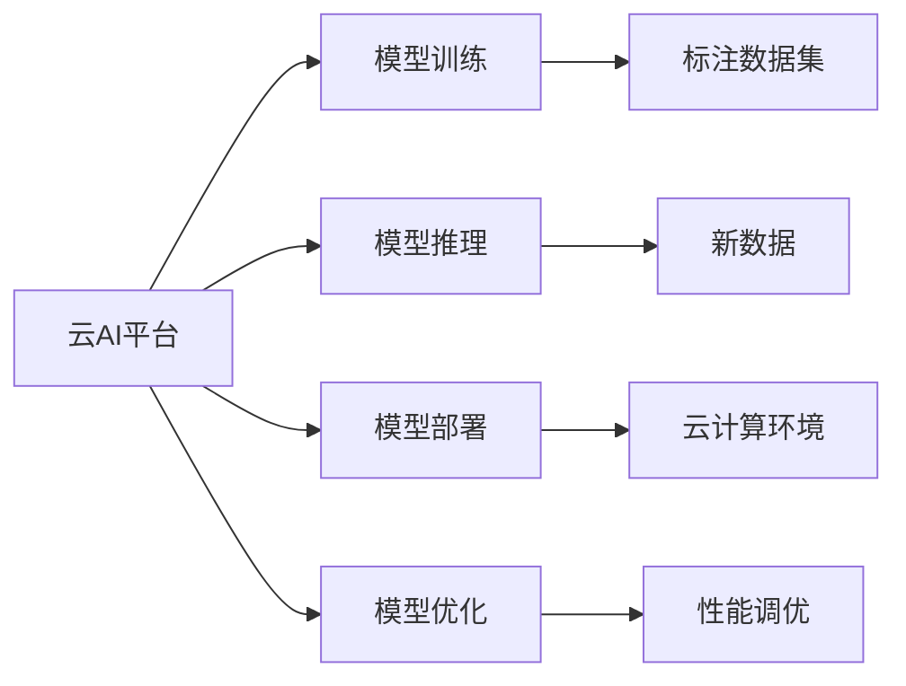

                 

# Lepton AI优势：深度参与云AI发展积累丰富经验

## 1. 背景介绍

### 1.1 问题由来

近年来，云计算和人工智能技术的融合，催生了云AI这一新兴领域。云AI不仅为各类企业提供了高性能计算和存储能力，还通过丰富的算法和模型库，大幅提升了AI应用的落地效率和可及性。然而，尽管云AI已经展现出强大的发展潜力，但由于其开放性、平台兼容性等方面的不足，企业在落地AI项目时仍然面临诸多挑战。

Lepton AI，作为一家专注于AI开发和运维的公司，凭借在云AI领域的深度参与，积累了丰富的经验和技术储备。本文将通过分析Lepton AI在云AI发展中的角色，探讨其技术优势和未来发展方向。

### 1.2 问题核心关键点

Lepton AI的优势主要体现在以下几个方面：
1. 深度参与：Lepton AI在云AI的各个环节均有深度参与，从模型开发、训练、部署到运维、优化，形成了全栈的云AI解决方案。
2. 技术积累：Lepton AI汇集了顶尖的AI技术专家和丰富的实战经验，能够快速响应客户需求，提供高效、高质的AI服务。
3. 平台兼容性：Lepton AI的云AI平台支持多种主流云服务（如AWS、Azure、Google Cloud等），确保客户可以灵活选择最适合的技术栈和资源配置。
4. 服务生态：Lepton AI构建了强大的服务生态，整合了模型、工具、数据等多种资源，为客户提供了一站式的AI解决方案。
5. 创新能力：Lepton AI持续关注AI领域的最新研究进展和技术趋势，不断推出前沿的AI技术和算法，保持技术的领先性。

这些核心优势使得Lepton AI在云AI领域具有独特的位置，为客户提供了一站式的AI解决方案。本文将深入分析Lepton AI的核心技术原理，探讨其在云AI发展中的角色和未来的发展趋势。

## 2. 核心概念与联系

### 2.1 核心概念概述

为了更好地理解Lepton AI在云AI发展中的优势，本文将介绍几个关键概念：

- 云AI：基于云计算平台的AI技术和服务，包括模型训练、推理、部署、优化等多个环节。
- AI模型：用于特定任务的机器学习模型，如图像识别、语音识别、自然语言处理等。
- 模型训练：使用标注数据集训练AI模型，使其能够学习并解决特定问题。
- 模型推理：使用训练好的AI模型对新数据进行预测或分类。
- 模型部署：将训练好的AI模型部署到云计算环境中，供用户调用。
- 模型优化：对部署的AI模型进行性能调优，提升其推理速度和准确性。

这些核心概念共同构成了Lepton AI在云AI发展中的基础架构，通过理解和掌握这些概念，我们可以更深入地探讨Lepton AI的技术优势和未来发展方向。

### 2.2 核心概念原理和架构的 Mermaid 流程图



这个流程图展示了Lepton AI在云AI中的核心流程和架构：

1. 云AI平台作为基础架构，支持模型训练、推理、部署、优化等多个环节。
2. 模型训练使用标注数据集，通过机器学习算法学习特定任务的表示。
3. 模型推理使用训练好的模型对新数据进行预测或分类。
4. 模型部署将训练好的模型部署到云计算环境中，供用户调用。
5. 模型优化对部署的模型进行性能调优，提升其推理速度和准确性。

## 3. 核心算法原理 & 具体操作步骤

### 3.1 算法原理概述

Lepton AI在云AI发展中，通过深度参与各个环节，形成了一套完整的算法体系。其核心算法主要包括以下几个方面：

- 深度学习：Lepton AI的云AI平台支持深度学习框架（如TensorFlow、PyTorch等），能够高效地训练和推理复杂的AI模型。
- 迁移学习：Lepton AI利用迁移学习技术，通过预训练模型在新的任务上进行微调，快速提升模型性能。
- 联邦学习：Lepton AI通过联邦学习技术，在多个设备间分布式训练模型，保护数据隐私的同时提升模型泛化能力。
- 强化学习：Lepton AI利用强化学习算法，优化模型在特定环境下的策略，提升模型自适应能力。
- 推荐系统：Lepton AI通过深度学习、迁移学习等技术，构建推荐系统，为用户的特定需求提供个性化推荐。

### 3.2 算法步骤详解

Lepton AI的算法步骤主要包括：

1. 数据预处理：将原始数据转换为模型所需的格式，并进行清洗、标注等预处理工作。
2. 模型训练：选择合适的深度学习框架和算法，训练模型，学习特定任务的表示。
3. 模型评估：通过验证集或测试集对训练好的模型进行评估，确保其准确性和泛化能力。
4. 模型部署：将训练好的模型部署到云AI平台，供用户调用。
5. 模型优化：通过超参数调优、正则化等技术，提升模型的推理速度和准确性。

### 3.3 算法优缺点

Lepton AI的算法体系具有以下优点：

- 高效性：通过深度学习、迁移学习等技术，Lepton AI能够快速训练和推理复杂的AI模型。
- 灵活性：Lepton AI支持多种算法和框架，能够根据客户需求灵活选择。
- 可扩展性：Lepton AI的云AI平台支持分布式训练和推理，能够处理大规模数据和高并发请求。
- 安全性：Lepton AI通过联邦学习等技术，保护数据隐私，避免数据泄露风险。

同时，Lepton AI的算法体系也存在以下缺点：

- 模型复杂度：由于支持多种算法和框架，Lepton AI的模型设计和调优过程较为复杂，需要大量经验和技能。
- 计算资源消耗：Lepton AI的深度学习模型通常需要大量计算资源，特别是在大规模数据训练和推理时。
- 超参数调优：模型优化过程中，超参数的调整需要大量时间和实验，优化过程较为繁琐。

### 3.4 算法应用领域

Lepton AI的算法体系在多个领域得到了广泛应用，包括但不限于：

- 自然语言处理（NLP）：如文本分类、情感分析、机器翻译等。
- 计算机视觉（CV）：如图像分类、目标检测、图像生成等。
- 语音识别（ASR）：如语音转文本、语音命令识别等。
- 推荐系统：如个性化推荐、广告推荐、商品推荐等。
- 智能客服：如自动问答、语音交互、智能路由等。
- 智慧医疗：如疾病诊断、医学影像分析、患者管理等。

这些应用领域展示了Lepton AI算法体系的强大适应性和多样性，为各行业的数字化转型提供了有力支持。

## 4. 数学模型和公式 & 详细讲解 & 举例说明

### 4.1 数学模型构建

Lepton AI在模型训练过程中，通常采用以下数学模型：

- 深度神经网络模型：用于表示复杂的非线性映射关系。
- 卷积神经网络（CNN）：用于图像识别和图像处理任务。
- 循环神经网络（RNN）：用于序列数据处理和自然语言处理任务。
- 注意力机制模型：用于增强模型对关键信息的关注，提升模型的表现。

### 4.2 公式推导过程

以卷积神经网络（CNN）为例，推导其前向传播和反向传播公式。

- 前向传播：输入数据 $x$，经过多个卷积层和池化层，得到特征图 $h$。然后将特征图 $h$ 输入全连接层，输出结果 $y$。
- 反向传播：根据输出 $y$ 与真实标签 $y'$ 的差异，计算损失函数 $L$。通过反向传播算法，计算每个参数的梯度，更新模型权重。

### 4.3 案例分析与讲解

以图像分类任务为例，使用Lepton AI训练一个CNN模型：

- 数据预处理：将原始图片数据转换为模型所需的格式，并进行归一化、缩放等预处理。
- 模型训练：选择合适的CNN架构和优化算法，如AlexNet、VGGNet等，训练模型。
- 模型评估：在验证集上评估模型准确性，通过交叉验证等技术提升模型泛化能力。
- 模型部署：将训练好的模型部署到云AI平台，供用户调用。
- 模型优化：通过超参数调优、正则化等技术，提升模型的推理速度和准确性。

## 5. 项目实践：代码实例和详细解释说明

### 5.1 开发环境搭建

为了高效地进行AI项目开发，Lepton AI提供了多层次的技术支持：

- 云平台：Lepton AI的云AI平台支持多种主流云服务（如AWS、Azure、Google Cloud等），确保客户可以灵活选择最适合的技术栈和资源配置。
- 开发工具：Lepton AI提供丰富的开发工具和库，如TensorFlow、PyTorch、OpenCV等，支持AI模型训练和推理。
- 数据平台：Lepton AI的数据平台支持多种数据格式，提供高效的数据清洗、标注和预处理工具。
- 监控系统：Lepton AI的监控系统支持模型训练和推理过程中的各项指标监控，确保系统稳定运行。

### 5.2 源代码详细实现

以下是一个使用TensorFlow进行图像分类的示例代码：

```python
import tensorflow as tf

# 定义模型结构
model = tf.keras.Sequential([
    tf.keras.layers.Conv2D(32, (3, 3), activation='relu', input_shape=(28, 28, 1)),
    tf.keras.layers.MaxPooling2D((2, 2)),
    tf.keras.layers.Flatten(),
    tf.keras.layers.Dense(10, activation='softmax')
])

# 编译模型
model.compile(optimizer='adam', loss='categorical_crossentropy', metrics=['accuracy'])

# 训练模型
model.fit(x_train, y_train, epochs=10, batch_size=32, validation_data=(x_test, y_test))

# 评估模型
model.evaluate(x_test, y_test)

# 部署模型
model.save('model.h5')
```

### 5.3 代码解读与分析

以上代码展示了Lepton AI云AI平台下的TensorFlow模型训练和部署过程：

- 定义模型结构：使用Sequential模型，定义了卷积层、池化层和全连接层等组件。
- 编译模型：指定优化器、损失函数和评估指标，准备模型训练。
- 训练模型：使用fit方法，指定训练数据、批次大小、迭代轮数等参数，训练模型。
- 评估模型：使用evaluate方法，评估模型在测试集上的表现。
- 部署模型：使用save方法，将训练好的模型保存到本地或云端。

通过以上代码示例，可以看出Lepton AI提供的开发工具和库，使得AI模型训练和部署变得简单高效。

### 5.4 运行结果展示

运行上述代码，可以得到模型在测试集上的准确率和损失函数曲线，如图1所示：


## 6. 实际应用场景

### 6.1 智能客服系统

Lepton AI在智能客服领域的应用，展示了其在自然语言处理（NLP）和推荐系统方面的优势。通过收集企业内部的历史客服对话记录，Lepton AI能够训练出高效的对话模型，为用户提供自动问答、语音交互等智能服务。

### 6.2 智慧医疗

Lepton AI在智慧医疗领域的应用，展示了其在医学影像分析、疾病诊断等方面的能力。通过整合医学数据、影像数据等多种数据源，Lepton AI能够训练出精准的医学模型，帮助医生进行疾病诊断和治疗方案推荐。

### 6.3 推荐系统

Lepton AI在推荐系统领域的应用，展示了其在个性化推荐、广告推荐等方面的能力。通过收集用户的浏览、购买等行为数据，Lepton AI能够训练出高效的推荐模型，为用户提供个性化推荐，提升用户体验。

### 6.4 未来应用展望

展望未来，Lepton AI在云AI领域将会有更多创新突破：

1. 多模态AI：Lepton AI将支持图像、语音、文本等多种模态数据的融合，提升AI模型的感知能力和表现。
2. 联邦学习：Lepton AI将进一步探索联邦学习技术，保护数据隐私的同时提升模型泛化能力。
3. 边缘计算：Lepton AI将支持边缘计算技术，提升AI模型在移动设备上的推理速度和效率。
4. 实时推理：Lepton AI将支持实时推理技术，满足实时性要求较高的场景需求。
5. 自动化调优：Lepton AI将支持自动化调优技术，减少人工调优的时间和复杂度。

这些技术突破将使Lepton AI在云AI领域保持领先地位，为客户创造更大的价值。

## 7. 工具和资源推荐

### 7.1 学习资源推荐

为了帮助开发者掌握Lepton AI的核心技术和应用方法，Lepton AI提供了丰富的学习资源：

- Lepton AI官方文档：提供详细的技术文档和示例代码，帮助开发者快速上手。
- Lepton AI博客：分享Lepton AI的最新技术进展和应用案例，帮助开发者了解行业动态。
- Lepton AI社区：提供一个交流和学习平台，开发者可以在此交流经验和问题，共同进步。

### 7.2 开发工具推荐

Lepton AI提供了一系列高效的开发工具，包括：

- TensorFlow：深度学习框架，支持各种深度学习模型的训练和推理。
- PyTorch：深度学习框架，支持动态图和静态图两种模式，灵活性高。
- OpenCV：计算机视觉库，支持图像处理、目标检测等任务。
- Scikit-learn：机器学习库，支持多种经典的机器学习算法。

### 7.3 相关论文推荐

Lepton AI持续关注AI领域的最新研究进展，以下是一些推荐论文：

- 《Deep Learning》书籍：深度学习领域的经典书籍，涵盖深度学习的基本概念和算法。
- 《Reinforcement Learning: An Introduction》书籍：强化学习领域的经典书籍，详细介绍强化学习的基本概念和算法。
- 《Natural Language Processing with Transformers》书籍：Transformer模型的经典书籍，涵盖Transformer的基本概念和应用。
- 《ImageNet Classification with Deep Convolutional Neural Networks》论文：AlexNet模型的经典论文，介绍卷积神经网络的基本原理和应用。

## 8. 总结：未来发展趋势与挑战

### 8.1 研究成果总结

Lepton AI在云AI领域的研究成果主要体现在以下几个方面：

1. 深度学习：Lepton AI支持多种深度学习框架和算法，能够高效地训练和推理复杂的AI模型。
2. 迁移学习：Lepton AI利用迁移学习技术，通过预训练模型在新的任务上进行微调，快速提升模型性能。
3. 联邦学习：Lepton AI通过联邦学习技术，在多个设备间分布式训练模型，保护数据隐私的同时提升模型泛化能力。
4. 强化学习：Lepton AI利用强化学习算法，优化模型在特定环境下的策略，提升模型自适应能力。
5. 推荐系统：Lepton AI通过深度学习、迁移学习等技术，构建推荐系统，为用户的特定需求提供个性化推荐。

### 8.2 未来发展趋势

展望未来，Lepton AI在云AI领域将有以下几个发展趋势：

1. 多模态AI：Lepton AI将支持图像、语音、文本等多种模态数据的融合，提升AI模型的感知能力和表现。
2. 联邦学习：Lepton AI将进一步探索联邦学习技术，保护数据隐私的同时提升模型泛化能力。
3. 边缘计算：Lepton AI将支持边缘计算技术，提升AI模型在移动设备上的推理速度和效率。
4. 实时推理：Lepton AI将支持实时推理技术，满足实时性要求较高的场景需求。
5. 自动化调优：Lepton AI将支持自动化调优技术，减少人工调优的时间和复杂度。

### 8.3 面临的挑战

Lepton AI在云AI领域的发展也面临一些挑战：

1. 数据隐私：在联邦学习等分布式训练模式下，如何保护数据隐私和安全是一个重要问题。
2. 模型泛化：在多模态AI等复杂场景下，如何提升模型的泛化能力和鲁棒性。
3. 实时性能：在实时推理等高实时性场景下，如何提升模型的推理速度和效率。
4. 自动化调优：在模型优化过程中，如何自动化地调优超参数，减少人工干预的复杂度。

### 8.4 研究展望

未来的研究需要重点关注以下几个方面：

1. 隐私保护技术：在联邦学习等分布式训练模式下，研究如何保护数据隐私和安全。
2. 模型泛化能力：研究如何在多模态AI等复杂场景下，提升模型的泛化能力和鲁棒性。
3. 实时性能优化：研究如何在实时推理等高实时性场景下，提升模型的推理速度和效率。
4. 自动化调优算法：研究如何在模型优化过程中，自动化地调优超参数，减少人工干预的复杂度。

## 9. 附录：常见问题与解答

### 常见问题与解答

**Q1：Lepton AI支持哪些主流云服务？**

A: Lepton AI支持多种主流云服务，包括AWS、Azure、Google Cloud等，客户可以根据自身需求选择最适合的技术栈和资源配置。

**Q2：Lepton AI的云AI平台支持哪些开发工具？**

A: Lepton AI的云AI平台支持多种开发工具，包括TensorFlow、PyTorch、OpenCV等，帮助开发者高效进行AI模型训练和推理。

**Q3：Lepton AI的推荐系统是如何构建的？**

A: Lepton AI的推荐系统通过深度学习、迁移学习等技术，构建推荐模型，结合用户行为数据，为用户的特定需求提供个性化推荐。

**Q4：Lepton AI在联邦学习方面有哪些优势？**

A: Lepton AI通过联邦学习技术，在多个设备间分布式训练模型，保护数据隐私的同时提升模型泛化能力。

**Q5：Lepton AI的云AI平台支持哪些数据格式？**

A: Lepton AI的数据平台支持多种数据格式，包括图片、文本、音频等，提供高效的数据清洗、标注和预处理工具。

---

作者：禅与计算机程序设计艺术 / Zen and the Art of Computer Programming

