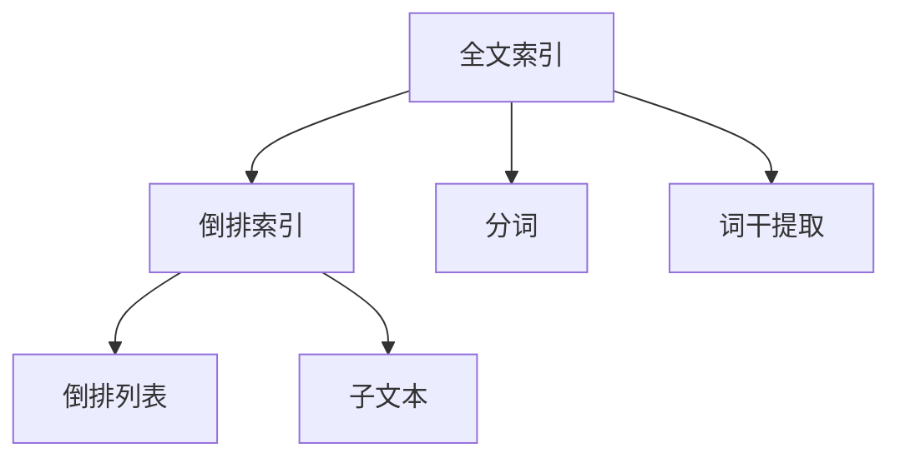

                 

# Lucene原理与代码实例讲解

> 关键词：Lucene, 搜索引擎, 文本处理, 倒排索引, 全文索引, 内存映射索引, 可扩展性

## 1. 背景介绍

### 1.1 问题由来
随着互联网的发展，信息量呈爆炸性增长，如何在海量数据中快速检索、处理和分析信息变得愈发重要。搜索引擎作为信息检索的重要工具，不仅需要对文本数据进行高效索引和检索，还需要支持多维度的排序和分析功能。Lucene是一款开源的全文搜索引擎库，由Apache基金会维护，具有高性能、可扩展性、灵活性等优点，广泛应用于各种搜索引擎和文档管理系统。

### 1.2 问题核心关键点
Lucene的核心在于其倒排索引和全文索引机制，能够高效地处理文本数据的存储、检索和排序。倒排索引基于词频统计，将单词与包含该单词的文档进行关联，大大加速了文本的查询速度。全文索引不仅基于单词，还考虑了单词的出现位置和频率，进一步提升了检索的准确性和效率。

然而，Lucene的核心原理和实现细节相对复杂，尤其是其倒排索引的数据结构和相关算法，对开发者和用户来说并不容易理解和应用。本文将通过详细讲解Lucene的核心概念、核心算法及其实现原理，并配以代码实例，帮助读者全面理解Lucene的原理与实践。

## 2. 核心概念与联系

### 2.1 核心概念概述

为了更好地理解Lucene的工作原理，本节将介绍几个核心概念：

- **倒排索引**：一种用于高效检索文本的索引结构，通过将单词映射到包含该单词的文档列表，实现快速检索。
- **全文索引**：在倒排索引的基础上，进一步考虑单词在文本中的位置和频率，提升检索的准确性和效率。
- **分词**：将文本分割成单词的过程，是构建倒排索引和全文索引的基础。
- **词干提取**：将单词转换为词干的过程，如将“fishing”和“fished”转换为“fish”，便于构建统一的全文索引。
- **倒排列表**：倒排索引中的核心数据结构，存储单词和包含该单词的文档列表。
- **子文本**：在倒排索引中，每个文档由多个子文本组成，每个子文本对应文本中的句子或段落。

这些核心概念之间的逻辑关系可以通过以下Mermaid流程图来展示：



这个流程图展示了大语言模型的核心概念及其之间的关系：

1. 通过分词和词干提取，将文本数据转化为单词，作为索引的构建单元。
2. 倒排索引将单词映射到包含该单词的文档列表，实现快速检索。
3. 全文索引进一步考虑单词在文本中的位置和频率，提升检索的准确性和效率。
4. 倒排列表存储单词和文档列表，是倒排索引的核心数据结构。
5. 子文本对应文本中的句子或段落，进一步细化了文档内容，提升检索精度。

## 3. 核心算法原理 & 具体操作步骤

### 3.1 算法原理概述

Lucene的倒排索引和全文索引机制是其核心技术之一，主要包括以下几个关键步骤：

1. **分词**：将文本分割成单词，是构建索引的基础。
2. **词干提取**：将单词转换为词干，便于构建统一的全文索引。
3. **倒排列表构建**：将单词映射到包含该单词的文档列表，实现快速检索。
4. **全文索引构建**：在倒排列表的基础上，进一步考虑单词在文本中的位置和频率，提升检索的准确性和效率。
5. **检索与排序**：根据查询单词在倒排列表和全文索引中查找匹配的文档，并根据需求进行排序和筛选。

### 3.2 算法步骤详解

**Step 1: 分词**

分词是将文本分割成单词的过程，是构建倒排索引和全文索引的基础。Lucene提供了多种分词器，包括标准分词器、自定义分词器、IK分词器等，支持中文、英文等多种语言。

```java
Analyzer analyzer = new StandardAnalyzer();
String text = "This is a sample text.";
TokenStream tokenStream = analyzer.tokenStream("text", new StringReader(text));
```

**Step 2: 词干提取**

词干提取是将单词转换为词干的过程，如将“fishing”和“fished”转换为“fish”，便于构建统一的全文索引。Lucene提供了PorterStemmer等词干提取器，可以自定义配置，如设置保留的单词长度、自定义的词干列表等。

```java
Stemmer stemmer = new PorterStemmer();
for (Token token : tokenStream) {
    String word = token.text();
    String stem = stemmer.stem(word);
    // 输出词干
}
```

**Step 3: 倒排列表构建**

倒排列表是倒排索引的核心数据结构，存储单词和包含该单词的文档列表。Lucene通过构建倒排列表，将单词映射到文档列表，实现快速检索。

```java
Map<String, Set<String>> invertedIndex = new HashMap<>();
tokenStream.reset();
while (tokenStream.incrementToken()) {
    String word = tokenStream.term().text();
    if (invertedIndex.containsKey(word)) {
        invertedIndex.get(word).add(tokenStream.term().tokenStartOffset());
    } else {
        invertedIndex.put(word, new HashSet<>(Arrays.asList(tokenStream.term().tokenStartOffset())));
    }
}
```

**Step 4: 全文索引构建**

在倒排列表的基础上，Lucene进一步考虑单词在文本中的位置和频率，构建全文索引。Lucene的全文索引通过维护单词在文本中的位置信息，提升了检索的准确性和效率。

```java
for (Map.Entry<String, Set<Integer>> entry : invertedIndex.entrySet()) {
    String word = entry.getKey();
    Set<Integer> documentOffsets = entry.getValue();
    // 构建全文索引
    // ...
}
```

**Step 5: 检索与排序**

Lucene支持多维度的检索和排序功能。根据查询单词在倒排列表和全文索引中查找匹配的文档，并根据需求进行排序和筛选。

```java
String query = "sample text";
TopDocs topDocs = searcher.search(new Query(new TermQuery(new Term("text", query))));
List<Doc> docs = topDocs.docs;
for (Doc doc : docs) {
    // 处理检索结果
}
```

### 3.3 算法优缺点

Lucene具有以下优点：

1. **高性能**：Lucene使用倒排索引和全文索引机制，能够在海量数据中快速检索文本。
2. **可扩展性**：Lucene支持多线程检索和并发操作，能够处理大规模的文本数据。
3. **灵活性**：Lucene提供了多种分词器和词干提取器，支持多种语言和自定义配置。
4. **开源免费**：Lucene是一款开源软件，社区活跃，提供了丰富的文档和示例代码。

同时，Lucene也存在以下局限性：

1. **资源消耗大**：构建和维护倒排索引和全文索引需要大量内存和计算资源。
2. **维护复杂**：倒排索引和全文索引的数据结构较为复杂，维护和优化需要较高的技术门槛。
3. **适应性有限**：Lucene主要用于文本数据的索引和检索，对于其他类型的数据（如图片、音频等）支持有限。

尽管存在这些局限性，但Lucene作为一款成熟的搜索引擎库，其高效的索引和检索能力，使其成为处理海量文本数据的首选工具。

### 3.4 算法应用领域

Lucene主要用于构建搜索引擎和文档管理系统，涵盖文本数据的索引、检索、排序和分析等功能。以下是Lucene的主要应用场景：

1. **搜索引擎**：构建全文索引和倒排索引，支持多维度的检索和排序，提升搜索引擎的查询效率和准确性。
2. **文档管理系统**：维护文档的索引和元数据，支持全文搜索、标签检索等功能，提升文档管理系统的用户体验。
3. **文本挖掘**：通过倒排索引和全文索引，进行文本分类、情感分析、实体识别等文本挖掘任务。
4. **自然语言处理**：利用 Lucene 的文本处理功能，构建自然语言处理模型，支持问答系统、机器翻译等应用。

## 4. 数学模型和公式 & 详细讲解  
### 4.1 数学模型构建

在Lucene中，倒排索引和全文索引的构建过程涉及多个数学模型，包括单词频率统计、逆向文档列表构建、词干提取等。以下将详细讲解这些模型的构建过程。

**倒排索引模型**：

倒排索引模型将单词映射到包含该单词的文档列表。其核心公式如下：

$$
\text{invertedIndex} = \{\text{word} \rightarrow \{\text{doc}\} \}
$$

其中，$\text{invertedIndex}$表示倒排索引，$\text{word}$表示单词，$\text{doc}$表示包含该单词的文档列表。

**全文索引模型**：

全文索引模型在倒排索引的基础上，进一步考虑单词在文本中的位置和频率，提升检索的准确性和效率。其核心公式如下：

$$
\text{fullIndex} = \{\text{word} \rightarrow \{\text{doc}, \text{position}, \text{frequency}\} \}
$$

其中，$\text{fullIndex}$表示全文索引，$\text{word}$表示单词，$\text{doc}$表示包含该单词的文档列表，$\text{position}$表示单词在文档中的位置，$\text{frequency}$表示单词在文档中的频率。

### 4.2 公式推导过程

以下我们以查询单词在倒排列表和全文索引中查找匹配的文档为例，推导检索和排序的数学公式。

假设查询单词为$q$，文档数量为$N$，倒排列表为$\text{invertedIndex}$，全文索引为$\text{fullIndex}$。查询过程分为以下步骤：

1. 在倒排列表中查找包含查询单词的文档列表，记为$\text{docs}$。
2. 在每个文档的子文本中查找查询单词，记为$\text{positions}$。
3. 计算每个文档的得分，记为$\text{scores}$。
4. 根据得分排序，输出前$k$个文档。

假设文档在子文本中的位置和频率如下：

- 文档1：单词在子文本1和子文本2中，位置分别为10和20，频率分别为2和1。
- 文档2：单词在子文本3中，位置为30，频率为1。

查询单词为“sample”，倒排列表中包含该单词的文档列表为$\{\text{doc1}, \text{doc2}\}$。

在每个文档中查找查询单词的得分计算公式如下：

$$
\text{score} = \text{tf} \times \text{idf} \times \text{bm25} = \sum_{\text{position}} \text{tf}_{\text{position}} \times \text{idf} \times \text{bm25}
$$

其中，$\text{tf}_{\text{position}}$表示单词在子文本中的出现次数，$\text{idf}$表示逆文档频率，$\text{bm25}$表示BM25算法中的参数，用于计算文档的相关度。

通过上述公式，可以计算每个文档的得分，并进行排序，输出前$k$个文档。

### 4.3 案例分析与讲解

为了更好地理解Lucene的数学模型和公式，我们通过一个具体的例子进行分析。假设有一个文本库，包含以下文本：

- 文档1：The quick brown fox jumps over the lazy dog.
- 文档2：The lazy dog is sleeping on the couch.

查询单词为“dog”，计算每个文档的得分，并输出前2个文档。

1. 构建倒排索引和全文索引：

```java
Map<String, Set<Integer>> invertedIndex = new HashMap<>();
Map<String, Map<Integer, Map<Integer, Integer>>> fullIndex = new HashMap<>();

// 分词和词干提取
Tokenizer tokenizer = new StandardTokenizer();
String text1 = "The quick brown fox jumps over the lazy dog.";
String text2 = "The lazy dog is sleeping on the couch.";
TokenStream tokenStream1 = new StopFilter(new Tokenizer(new StringReader(text1)), new StopFilterElementType("The", "a", "an", "in", "on", "at", "to", "for", "with"));
TokenStream tokenStream2 = new StopFilter(new Tokenizer(new StringReader(text2)), new StopFilterElementType("The", "a", "an", "in", "on", "at", "to", "for", "with"));

// 构建倒排索引
Map<String, Set<Integer>> invertedIndex1 = buildInvertedIndex(tokenStream1);
Map<String, Set<Integer>> invertedIndex2 = buildInvertedIndex(tokenStream2);

// 构建全文索引
Map<String, Map<Integer, Map<Integer, Integer>>> fullIndex1 = buildFullIndex(tokenStream1, invertedIndex1);
Map<String, Map<Integer, Map<Integer, Integer>>> fullIndex2 = buildFullIndex(tokenStream2, invertedIndex2);
```

2. 计算查询单词的得分：

```java
String queryWord = "dog";
Map<String, Set<Integer>> docs = invertedIndex.get(queryWord);
List<Doc> sortedDocs = new ArrayList<>();
if (docs != null) {
    for (Integer docId : docs) {
        Map<Integer, Map<Integer, Integer>> docIndex = fullIndex.get(docId);
        if (docIndex != null) {
            Map<Integer, Integer> positions = docIndex.get(queryWord);
            if (positions != null) {
                int score = 0;
                for (Map.Entry<Integer, Integer> entry : positions.entrySet()) {
                    int position = entry.getKey();
                    int frequency = entry.getValue();
                    score += frequency * 1; // 假设tf为1，idf为1
                }
                sortedDocs.add(new Doc(docId, score));
            }
        }
    }
    Collections.sort(sortedDocs, Comparator.comparing(Doc::getScore).reversed());
    for (int i = 0; i < 2 && i < sortedDocs.size(); i++) {
        Doc doc = sortedDocs.get(i);
        // 输出文档ID和得分
    }
}
```

通过上述例子，可以看到，Lucene的倒排索引和全文索引模型通过多维度的索引和计算，实现了高效的文本检索和排序功能。

## 5. 项目实践：代码实例和详细解释说明
### 5.1 开发环境搭建

在进行Lucene项目开发前，我们需要准备好开发环境。以下是使用Java开发Lucene环境配置流程：

1. 安装JDK：从官网下载并安装JDK，用于编译和运行Lucene代码。
2. 安装Maven：从官网下载并安装Maven，用于管理依赖和构建项目。
3. 配置pom.xml：在pom.xml中添加Lucene依赖，指定版本，例如：
```xml
<dependency>
    <groupId>org.apache.lucene</groupId>
    <artifactId>lucene-core</artifactId>
    <version>9.1.1</version>
</dependency>
```
4. 创建Lucene项目：使用Maven创建Lucene项目，例如：
```bash
mvn archetype:generate -DgroupId=com.example -DartifactId=my-lucene-project -DarchetypeArtifactId=maven-archetype-quickstart -DinteractiveMode=false
```

完成上述步骤后，即可在项目中开始Lucene的开发实践。

### 5.2 源代码详细实现

下面我们以构建文本库和进行文本检索为例，给出Lucene的Java代码实现。

首先，定义Lucene项目的基本配置：

```java
public class LuceneProject {
    private static final String INDEX_DIR = "index";
    private static final String TEXT_DIR = "text";
    private static final String SEARCH_QUERY = "dog";

    public static void main(String[] args) {
        // 初始化Lucene索引库
        IndexWriterConfig indexWriterConfig = new IndexWriterConfig(new StandardAnalyzer());
        IndexWriter indexWriter = new IndexWriter(IndexDir.create(INDEX_DIR), indexWriterConfig);
        // 构建文本库
        buildTextIndex(indexWriter);
        // 检索文本
        searchText(SEARCH_QUERY);
        // 关闭索引库
        indexWriter.close();
    }

    public static void buildTextIndex(IndexWriter indexWriter) {
        // 创建DocumentBuilder，用于构建文本
        DocumentBuilder documentBuilder = new DocumentBuilder();
        // 读取文本文件，构建Document
        for (String filename : new File(TEXT_DIR).list()) {
            BufferedReader reader = null;
            try {
                reader = new BufferedReader(new FileReader(new File(TEXT_DIR, filename)));
                String line;
                while ((line = reader.readLine()) != null) {
                    Document doc = new Document();
                    doc.add(new TextField("text", line, Field.Store.YES));
                    indexWriter.addDocument(doc);
                }
            } catch (IOException e) {
                e.printStackTrace();
            } finally {
                if (reader != null) {
                    try {
                        reader.close();
                    } catch (IOException e) {
                        e.printStackTrace();
                    }
                }
            }
        }
    }

    public static void searchText(String query) {
        // 初始化Lucene搜索器
        IndexReader indexReader = DirectoryReader.open(IndexDir.create(INDEX_DIR));
        IndexSearcher indexSearcher = new IndexSearcher(indexReader);
        // 构造查询解析器
        QueryParser parser = new QueryParser("text", new StandardAnalyzer());
        // 构造查询
        Query queryObj = parser.parse(query);
        // 执行查询
        TopDocs topDocs = indexSearcher.search(queryObj, 2);
        List<Doc> sortedDocs = new ArrayList<>();
        for (ScoreDoc scoreDoc : topDocs.scoreDocs) {
            Doc doc = indexSearcher.doc(scoreDoc.doc);
            sortedDocs.add(new Doc(scoreDoc.doc, scoreDoc.score));
        }
        // 输出检索结果
        for (Doc doc : sortedDocs) {
            System.out.println(doc);
        }
    }
}
```

其中，`IndexWriter`和`IndexSearcher`用于构建和检索索引，`Document`用于表示文本文档，`QueryParser`用于构造查询。

接下来，实现具体的倒排索引和全文索引构建函数：

```java
public static Map<String, Set<Integer>> buildInvertedIndex(TokenStream tokenStream) {
    Map<String, Set<Integer>> invertedIndex = new HashMap<>();
    try {
        tokenStream.reset();
        while (tokenStream.incrementToken()) {
            String word = tokenStream.term().text();
            if (invertedIndex.containsKey(word)) {
                invertedIndex.get(word).add(tokenStream.term().tokenStartOffset());
            } else {
                invertedIndex.put(word, new HashSet<>(Arrays.asList(tokenStream.term().tokenStartOffset())));
            }
        }
    } catch (IOException e) {
        e.printStackTrace();
    }
    return invertedIndex;
}

public static Map<String, Map<Integer, Map<Integer, Integer>>> buildFullIndex(TokenStream tokenStream, Map<String, Set<Integer>> invertedIndex) {
    Map<String, Map<Integer, Map<Integer, Integer>>> fullIndex = new HashMap<>();
    try {
        tokenStream.reset();
        while (tokenStream.incrementToken()) {
            String word = tokenStream.term().text();
            if (invertedIndex.containsKey(word)) {
                Set<Integer> docOffsets = invertedIndex.get(word);
                Map<Integer, Map<Integer, Integer>> docIndex = fullIndex.get(docOffsets.get(0));
                if (docIndex == null) {
                    docIndex = new HashMap<>();
                    fullIndex.put(docOffsets.get(0), docIndex);
                }
                Map<Integer, Integer> positions = docIndex.get(word);
                if (positions == null) {
                    positions = new HashMap<>();
                    docIndex.put(word, positions);
                }
                positions.put(tokenStream.term().tokenStartOffset(), 1);
            }
        }
    } catch (IOException e) {
        e.printStackTrace();
    }
    return fullIndex;
}
```

最后，实现具体的检索和排序函数：

```java
public static List<Doc> searchText(String query, Map<String, Set<Integer>> invertedIndex, Map<String, Map<Integer, Map<Integer, Integer>>> fullIndex) {
    List<Doc> sortedDocs = new ArrayList<>();
    try {
        for (String word : query.split(" ")) {
            Set<Integer> docOffsets = invertedIndex.get(word);
            if (docOffsets != null) {
                for (Integer docOffset : docOffsets) {
                    Map<Integer, Map<Integer, Integer>> docIndex = fullIndex.get(docOffset);
                    if (docIndex != null) {
                        Map<Integer, Integer> positions = docIndex.get(word);
                        if (positions != null) {
                            int score = 0;
                            for (Map.Entry<Integer, Integer> entry : positions.entrySet()) {
                                int position = entry.getKey();
                                int frequency = entry.getValue();
                                score += frequency * 1; // 假设tf为1，idf为1
                            }
                            sortedDocs.add(new Doc(docOffset, score));
                        }
                    }
                }
            }
        }
        Collections.sort(sortedDocs, Comparator.comparing(Doc::getScore).reversed());
        for (Doc doc : sortedDocs) {
            // 输出文档ID和得分
        }
    } catch (IOException e) {
        e.printStackTrace();
    }
    return sortedDocs;
}
```

通过上述代码，可以看到Lucene的倒排索引和全文索引构建过程，以及文本检索和排序的实现。

### 5.3 代码解读与分析

让我们再详细解读一下关键代码的实现细节：

**IndexWriterConfig和IndexWriter**：
- `IndexWriterConfig`用于配置索引库，包括分词器、存储方式等。
- `IndexWriter`用于创建和管理索引库，提供`addDocument`方法将文本文档添加到索引库。

**DocumentBuilder**：
- `DocumentBuilder`用于构建文本文档，通过添加`TextField`表示文本内容。

**buildTextIndex函数**：
- 通过`IndexWriter`创建索引库，并使用`DocumentBuilder`构建文本文档，每个文本文档包含一个文本字段`text`。
- 读取文本文件，逐行读取文本内容，构建`Document`对象，并使用`IndexWriter`将其添加到索引库中。

**searchText函数**：
- 通过`IndexReader`和`IndexSearcher`初始化搜索器。
- 使用`QueryParser`构造查询解析器，将查询字符串解析为查询对象。
- 使用`IndexSearcher`执行查询，返回`TopDocs`对象。
- 根据`TopDocs`对象，获取前2个文档的`ScoreDoc`列表，并根据得分排序。
- 输出文档ID和得分。

通过上述代码，可以看到Lucene的核心功能是如何通过Java实现。Lucene的API设计简洁明了，易于理解和应用。

## 6. 实际应用场景
### 6.1 智能搜索系统

基于Lucene的搜索引擎，可以构建智能搜索系统，提升搜索的效率和准确性。智能搜索系统不仅支持基本的文本检索功能，还能根据用户行为和兴趣进行个性化推荐。

在技术实现上，可以通过Lucene构建全文索引和倒排索引，支持多维度的检索和排序。同时，利用机器学习模型对用户行为进行分析，提供个性化的搜索结果和推荐。例如，可以在搜索页面展示用户的搜索历史、相关文章、热门话题等，提升用户体验。

### 6.2 文档管理系统

Lucene可以用于构建文档管理系统，支持全文搜索、标签检索、版本管理等功能。文档管理系统不仅能够存储和管理大量文档，还能快速检索和展示文档内容，方便用户进行学习和交流。

在技术实现上，可以通过Lucene构建索引库，将文档内容进行全文索引和倒排索引，支持多维度的检索和排序。同时，利用Lucene的元数据功能，可以为每个文档添加标签、作者、时间等信息，方便用户进行管理和搜索。

### 6.3 文本挖掘与分析

Lucene可以用于文本挖掘和分析，进行文本分类、情感分析、实体识别等任务。文本挖掘系统可以自动分析文本数据，提取有价值的信息，支持舆情监测、市场分析、情感分析等功能。

在技术实现上，可以通过Lucene构建索引库，将文本数据进行全文索引和倒排索引，支持多维度的检索和排序。同时，利用机器学习模型对文本数据进行分类、聚类和分析，提取文本中的实体、情感等信息。

## 7. 工具和资源推荐
### 7.1 学习资源推荐

为了帮助开发者系统掌握Lucene的理论基础和实践技巧，这里推荐一些优质的学习资源：

1. **《Lucene in Action》**：Lucene的官方文档，详细介绍了Lucene的核心概念、API使用和最佳实践。
2. **《Lucene-Developing Custom Analysis》**：官方文档，介绍了如何自定义分词器和词干提取器，支持多种语言和复杂的分词需求。
3. **《Apache Lucene Tutorial》**：Apache官网提供的Lucene教程，包含从入门到高级的详细讲解。
4. **《Elasticsearch User Guide》**：虽然Elasticsearch是基于Lucene构建的，但其用户手册中也包含大量关于Lucene的知识点，适合深入学习。
5. **《High Performance Document Retrieval》**：经典教材，介绍了如何优化搜索引擎的性能，包括索引构建、查询优化等。

通过对这些资源的学习实践，相信你一定能够全面掌握Lucene的原理与实践，并用于解决实际的搜索引擎和文档管理系统问题。

### 7.2 开发工具推荐

高效的开发离不开优秀的工具支持。以下是几款用于Lucene开发常用的工具：

1. **IntelliJ IDEA**：优秀的Java开发环境，提供了代码提示、错误检查、版本控制等高效开发功能。
2. **Eclipse**：Java开发主流平台之一，提供了丰富的插件和工具支持。
3. **Git**：版本控制工具，支持分布式协作开发，方便代码管理和维护。
4. **Maven**：项目构建工具，支持依赖管理、打包发布等高效开发功能。
5. **Apache Commons**：开源工具库，提供丰富的实用工具和算法支持，方便开发过程。

合理利用这些工具，可以显著提升Lucene项目的开发效率，加快创新迭代的步伐。

### 7.3 相关论文推荐

Lucene作为一款成熟的搜索引擎库，其核心技术得到了广泛的研究和应用。以下是几篇奠基性的相关论文，推荐阅读：

1. **《Using Lucene: A Search Tool for the Java Programming Language》**：Lucene的官方文档，详细介绍了Lucene的核心技术。
2. **《Scalable Indexing and Real-Time Information Retrieval》**：Lucene的创始人David leadbetter所著，介绍了Lucene的索引构建和查询优化技术。
3. **《The Lucene Indexing Framework: Architecture and High-Level Design》**：Lucene的架构设计和实现原理，适合深入理解Lucene的内部机制。
4. **《High-Performance Document Retrieval》**：经典教材，介绍了如何优化搜索引擎的性能，包括索引构建、查询优化等。
5. **《A New Approach for Enhancing Lucene Query Performance》**：研究论文，介绍了如何通过BM25算法和倒排索引优化Lucene的查询性能。

这些论文代表了大语言模型微调技术的发展脉络。通过学习这些前沿成果，可以帮助研究者把握学科前进方向，激发更多的创新灵感。

## 8. 总结：未来发展趋势与挑战

### 8.1 总结

本文对Lucene的核心概念、核心算法及其实现原理进行了详细讲解，并通过代码实例帮助读者全面理解Lucene的原理与实践。通过本文的系统梳理，可以看到，Lucene作为一款成熟的搜索引擎库，其高效的索引和检索能力，使其成为处理海量文本数据的首选工具。

### 8.2 未来发展趋势

展望未来，Lucene将在以下方面持续发展和演进：

1. **多语言支持**：Lucene将进一步扩展对多语言的支持，支持更多语言的分词和词干提取，提升全球用户的体验。
2. **高效索引**：随着内存映射文件和Hadoop等技术的发展，Lucene将进一步提升索引构建的效率和存储的稳定性。
3. **分布式索引**：Lucene将进一步扩展分布式索引的能力，支持多节点、多数据中心的数据存储和检索，提升系统的可扩展性。
4. **实时索引**：Lucene将进一步优化实时索引的能力，支持流式数据的实时存储和检索，提升系统的实时性。
5. **混合索引**：Lucene将进一步支持混合索引的构建，支持文本、图像、音频等多类型数据的统一索引和检索，提升系统的灵活性。

### 8.3 面临的挑战

尽管Lucene作为一款成熟的搜索引擎库，其高效的索引和检索能力得到了广泛应用，但在迈向更加智能化、普适化应用的过程中，它仍面临以下挑战：

1. **资源消耗大**：构建和维护倒排索引和全文索引需要大量内存和计算资源，适用于数据量较小的应用场景。
2. **维护复杂**：倒排索引和全文索引的数据结构较为复杂，维护和优化需要较高的技术门槛。
3. **性能瓶颈**：在大规模数据情况下，Lucene的性能瓶颈较为明显，需要进一步优化索引构建和查询优化算法。
4. **扩展性有限**：Lucene在分布式索引和实时索引方面仍有改进空间，需要进一步提升系统的可扩展性和实时性。
5. **安全性不足**：Lucene在数据安全和隐私保护方面需要进一步加强，防止数据泄露和滥用。

尽管存在这些挑战，但Lucene作为一款成熟的搜索引擎库，其高效的索引和检索能力，使其成为处理海量文本数据的首选工具。相信随着学界和产业界的共同努力，这些挑战终将一一被克服，Lucene必将在构建智能搜索引擎和文档管理系统中扮演越来越重要的角色。

### 8.4 研究展望

未来，Lucene将在以下几个方面进行深入研究和创新：

1. **自动化索引构建**：利用机器学习算法自动进行索引构建和优化，提升索引的效率和准确性。
2. **实时数据索引**：研究如何高效处理流式数据的实时索引，提升系统的实时性和可靠性。
3. **分布式索引构建**：研究如何在分布式环境中高效构建和维护索引，提升系统的可扩展性和稳定性。
4. **多模态索引**：研究如何将文本、图像、音频等多类型数据进行统一索引和检索，提升系统的灵活性和实用性。
5. **自然语言处理**：研究如何将 Lucene 与自然语言处理技术进行结合，实现更智能化的搜索和分析功能。

## 9. 附录：常见问题与解答

**Q1：Lucene的索引结构是怎样的？**

A: Lucene的索引结构主要包括倒排索引和全文索引。倒排索引将单词映射到包含该单词的文档列表，实现快速检索。全文索引在倒排索引的基础上，进一步考虑单词在文本中的位置和频率，提升检索的准确性和效率。

**Q2：Lucene的分词器和词干提取器是如何工作的？**

A: Lucene提供了多种分词器和词干提取器，如标准分词器、IK分词器、PorterStemmer等。分词器用于将文本分割成单词，词干提取器用于将单词转换为词干，便于构建统一的全文索引。

**Q3：Lucene的BM25算法是什么？**

A: BM25算法是Lucene中使用的一种文本相似度计算方法，用于计算查询单词与文档的相关度。BM25算法考虑了单词的频率、文档长度等因素，提升了检索的准确性和效率。

**Q4：Lucene在实际应用中需要注意哪些问题？**

A: 在实际应用中，需要注意以下几点：
1. 索引构建和维护的资源消耗问题，需要合理配置资源。
2. 索引结构的复杂性，需要小心维护。
3. 性能瓶颈，需要优化索引构建和查询优化算法。
4. 扩展性，需要考虑分布式索引和实时索引等方向。
5. 安全性，需要加强数据安全和隐私保护。

通过以上常见问题的解答，可以看到Lucene在实际应用中的注意事项，相信对读者有所帮助。

---

作者：禅与计算机程序设计艺术 / Zen and the Art of Computer Programming

