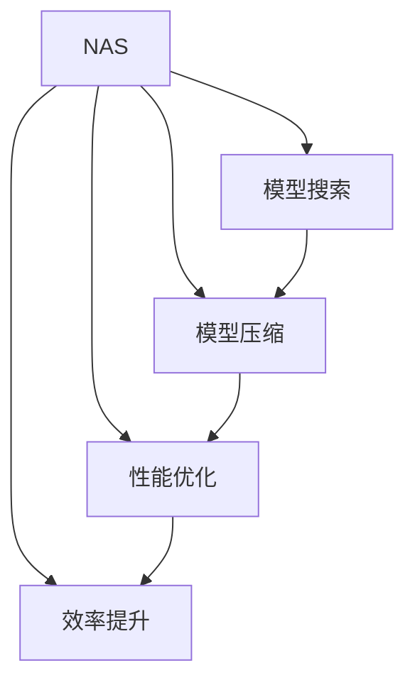

                 

# NAS在移动端AI应用开发中的角色

> 关键词：NAS,移动端AI,模型搜索,自动化,模型压缩,深度学习,性能优化,效率提升

## 1. 背景介绍

### 1.1 问题由来

在移动端AI应用开发中，模型的性能、大小、速度等因素直接影响到用户体验。然而，优化这些因素通常需要大量的时间、数据和计算资源。特别地，深度学习模型在移动设备上的部署面临着一系列挑战，如计算资源受限、模型大小限制、能耗高、应用启动时间较长等。

近年来，随着计算能力的提升和AI技术的发展，神经网络结构越来越复杂，模型规模也越来越大。这些复杂模型虽然在各类AI任务上表现出色，但在移动设备上却难以直接部署。为了提升移动设备上的AI应用性能，我们需要寻求一种高效的模型搜索和优化方法。

### 1.2 问题核心关键点

基于此，NAS（Neural Architecture Search, 神经网络结构搜索）应运而生。NAS是一种自动化设计神经网络的方法，旨在自动搜索最优的模型结构，从而在保证性能的同时，降低模型的计算复杂度和存储需求。

NAS的核心思想是通过自动化的方法，从一系列候选的网络架构中筛选出最优秀的设计，获得适应特定任务的模型。该方法打破了传统手工设计模型的桎梏，提升了模型设计的效率和效果。NAS近年来在计算机视觉、自然语言处理等各个领域得到了广泛应用。

## 2. 核心概念与联系

### 2.1 核心概念概述

为了更好地理解NAS在移动端AI应用开发中的作用，我们需要了解几个密切相关的核心概念：

- **NAS (Neural Architecture Search)**：一种自动化设计神经网络的方法，通过搜索最优的模型结构来提升AI应用性能。
- **模型搜索 (Model Search)**：自动寻找最优的模型架构，包括但不限于网络层次、节点类型、连接方式等。
- **模型压缩 (Model Compression)**：通过剪枝、量化等方法减少模型参数量和计算复杂度。
- **自动化 (Automation)**：在模型搜索和压缩过程中，无需人工干预，由算法自动完成。
- **深度学习 (Deep Learning)**：利用神经网络处理大规模复杂数据，广泛应用于图像识别、自然语言处理等领域。
- **性能优化 (Performance Optimization)**：通过模型搜索和压缩，提升模型的精度、速度、大小等性能指标。
- **效率提升 (Efficiency Improvement)**：降低模型的能耗、计算复杂度，提升AI应用的响应速度和用户体验。

这些概念之间的逻辑关系可以通过以下Mermaid流程图来展示：



这个流程图展示了大语言模型的核心概念及其之间的关系：

1. NAS通过模型搜索获得最优架构。
2. 通过模型压缩优化模型大小和计算复杂度。
3. 性能优化提升模型的精度、速度等性能指标。
4. 效率提升降低模型的能耗、计算复杂度，提升用户体验。

## 3. 核心算法原理 & 具体操作步骤
### 3.1 算法原理概述

NAS的核心理念是通过自动化的方法搜索最优的模型结构，从而提升模型的性能和效率。具体的，NAS算法通过构建搜索空间，随机生成一系列候选架构，然后通过评估指标筛选出最优的架构。

在搜索空间中，通常包括一些基本操作和组件，如卷积、池化、全连接等，以及连接方式、层次等。候选架构的生成可以是随机生成、均匀采样等方法，也可以是基于经验设计的方法。

在评估指标方面，一般包括模型的准确率、计算复杂度、存储需求等。候选架构通过这些评估指标进行筛选，保留性能最优的架构，并用于后续的模型压缩和优化。

### 3.2 算法步骤详解

基于NAS的移动端AI应用开发通常包括以下几个关键步骤：

**Step 1: 准备搜索空间和评估指标**

- 定义搜索空间，包括网络层次、节点类型、连接方式等基本组件。
- 设计评估指标，包括模型的准确率、计算复杂度、存储需求等。

**Step 2: 生成候选架构**

- 随机生成或均匀采样候选架构，确保搜索空间具有足够的覆盖性和多样性。

**Step 3: 评估候选架构**

- 在训练集上对候选架构进行训练，并使用评估指标进行评估。
- 保留性能最优的架构，继续下一轮搜索。

**Step 4: 压缩优化**

- 对保留的架构进行模型压缩，如剪枝、量化等。
- 在测试集上评估压缩后的模型，确保性能不降。

**Step 5: 部署应用**

- 将优化后的模型部署到移动设备上。
- 通过AB测试等手段评估模型性能和用户体验。

### 3.3 算法优缺点

基于NAS的移动端AI应用开发具有以下优点：

- **自动化高效**：自动化搜索和压缩过程，无需人工干预，大大提升了模型设计的效率。
- **通用性强**：搜索空间设计灵活，能够适应不同类型的AI任务。
- **性能优化**：通过自动搜索最优架构，提升了模型的精度和速度。
- **资源优化**：通过模型压缩，降低了计算复杂度和存储需求。

同时，该方法也存在一定的局限性：

- **计算复杂度高**：模型搜索过程需要大量的计算资源和时间，对硬件要求较高。
- **可解释性差**：搜索过程复杂，难以解释模型内部的决策逻辑。
- **应用限制多**：不同的任务需要不同的搜索空间和评估指标，通用性有一定限制。

尽管存在这些局限性，但就目前而言，基于NAS的方法仍然是移动端AI应用开发的一个重要范式。未来相关研究的重点在于如何进一步降低计算复杂度，提升模型搜索的效率，同时兼顾可解释性和适用性等因素。

### 3.4 算法应用领域

基于NAS的方法已经在移动端的计算机视觉、自然语言处理、推荐系统等众多领域得到了广泛应用，为移动AI应用的开发提供了新的思路和方法。

- **计算机视觉**：自动搜索最优的卷积神经网络架构，提升图像识别和物体检测的精度和速度。
- **自然语言处理**：自动设计最优的循环神经网络或Transformer架构，提升文本分类和生成能力。
- **推荐系统**：自动搜索最优的神经网络模型，提升推荐算法的准确性和实时性。
- **语音识别**：自动搜索最优的卷积神经网络或循环神经网络架构，提升语音识别精度。

除了这些典型应用外，NAS还被创新性地应用到更多场景中，如生成对抗网络(GANs)、视频分析、运动预测等，为移动AI技术带来了全新的突破。随着NAS技术的不断进步，相信其在更多领域的应用将持续扩展，进一步提升AI应用的性能和效率。

## 4. 数学模型和公式 & 详细讲解 & 举例说明
### 4.1 数学模型构建

NAS的数学模型主要包含两部分：搜索空间的定义和评估指标的设计。以下是对这两部分的详细介绍。

**搜索空间定义**：

搜索空间包含多个维度，如网络层次、节点类型、连接方式等。通常，NAS的搜索空间是基于已有神经网络架构进行扩展和组合得到的。例如，NASNet使用了生成式搜索空间，通过递归地搜索网络层次和节点类型，构建了多样化的网络结构。

**评估指标设计**：

评估指标包括模型的准确率、计算复杂度、存储需求等。常用的评估指标包括：

- **准确率 (Accuracy)**：模型在测试集上的分类准确率。
- **F1分数 (F1 Score)**：精确率（Precision）和召回率（Recall）的调和平均数。
- **计算复杂度 (Computational Complexity)**：模型的计算量和计算速度。
- **存储需求 (Storage Demand)**：模型的参数量和存储大小。

### 4.2 公式推导过程

以NASNet为例，其搜索空间可以通过递归搜索网络层次和节点类型来定义。设基本单元为 $C$，网络层次为 $L$，节点类型为 $K$，则NASNet的搜索空间为：

$$
\text{Search Space} = \bigcup_{L=1}^{L_{\text{max}}} \left(\bigcup_{K=1}^{K_{\text{max}}} \left(\text{Unit}_C \times \text{Unit}_C \times \cdots \times \text{Unit}_C\right)\right)
$$

其中，$L_{\text{max}}$ 为最大网络层次数，$K_{\text{max}}$ 为最大节点类型数，$\text{Unit}_C$ 表示基本单元 $C$ 的连接方式。

评估指标可以通过训练集和测试集上的性能数据进行计算。例如，对于分类任务，准确率的计算公式为：

$$
\text{Accuracy} = \frac{\text{TP} + \text{TN}}{\text{TP} + \text{TN} + \text{FP} + \text{FN}}
$$

其中，TP为真阳性，TN为真阴性，FP为假阳性，FN为假阴性。

### 4.3 案例分析与讲解

以下是一个简单的例子，说明NAS如何用于移动端AI应用开发。

**任务**：在移动设备上开发一个基于CNN的图像分类模型。

**步骤**：

1. **准备搜索空间和评估指标**：
   - 定义搜索空间，包括卷积核大小、卷积层数、池化方式等。
   - 设计评估指标，包括模型在CIFAR-10数据集上的准确率和计算复杂度。

2. **生成候选架构**：
   - 随机生成多个候选架构，每个架构包含若干卷积层和池化层。

3. **评估候选架构**：
   - 在CIFAR-10数据集上对每个候选架构进行训练，并计算准确率和计算复杂度。
   - 保留准确率最高且计算复杂度较低的架构。

4. **压缩优化**：
   - 对保留的架构进行模型压缩，如剪枝和量化。
   - 在测试集上评估压缩后的模型，确保性能不降。

5. **部署应用**：
   - 将优化后的模型部署到移动设备上。
   - 通过AB测试评估模型性能和用户体验。

## 5. NAS在移动端AI应用开发中的代码实践

### 5.1 开发环境搭建

在进行NAS开发前，我们需要准备好开发环境。以下是使用Python进行PyTorch开发的环境配置流程：

1. 安装Anaconda：从官网下载并安装Anaconda，用于创建独立的Python环境。

2. 创建并激活虚拟环境：
```bash
conda create -n nas-env python=3.8 
conda activate nas-env
```

3. 安装PyTorch：根据CUDA版本，从官网获取对应的安装命令。例如：
```bash
conda install pytorch torchvision torchaudio cudatoolkit=11.1 -c pytorch -c conda-forge
```

4. 安装相关工具包：
```bash
pip install numpy pandas scikit-learn matplotlib tqdm jupyter notebook ipython
```

完成上述步骤后，即可在`nas-env`环境中开始NAS开发。

### 5.2 源代码详细实现

下面我们以NASNet为例，给出使用PyTorch实现NASNet的代码实现。

首先，定义NASNet的搜索空间：

```python
import torch.nn as nn
from torch.nn import functional as F
from nasnet import NASNet

# 定义NASNet的搜索空间
num_layers = 5
channels = [32, 64, 128, 256, 512]
num_blocks = [3, 3, 3, 3, 3]
block_types = ['block1', 'block2', 'block3', 'block4', 'block5']
```

接着，定义NASNet的架构搜索：

```python
class NASNet(nn.Module):
    def __init__(self):
        super(NASNet, self).__init__()
        self.layers = nn.ModuleList()
        for i in range(num_layers):
            self.layers.append(NASBlock(channels[i]))
    
    def forward(self, x):
        for layer in self.layers:
            x = layer(x)
        return x

class NASBlock(nn.Module):
    def __init__(self, channels):
        super(NASBlock, self).__init__()
        self.conv1 = nn.Conv2d(channels[-1], channels[0], kernel_size=3, padding=1)
        self.conv2 = nn.Conv2d(channels[0], channels[1], kernel_size=3, padding=1)
        self.conv3 = nn.Conv2d(channels[1], channels[2], kernel_size=3, padding=1)
        self.conv4 = nn.Conv2d(channels[2], channels[3], kernel_size=3, padding=1)
        self.conv5 = nn.Conv2d(channels[3], channels[4], kernel_size=3, padding=1)
        self.pool = nn.MaxPool2d(kernel_size=3, stride=2, padding=1)
    
    def forward(self, x):
        x = self.conv1(x)
        x = self.conv2(x)
        x = self.conv3(x)
        x = self.conv4(x)
        x = self.conv5(x)
        x = self.pool(x)
        return x
```

然后，定义训练和评估函数：

```python
from torch.utils.data import DataLoader
from torchvision import datasets, transforms
import torch.nn.functional as F

# 定义训练集和测试集
train_dataset = datasets.CIFAR10(root='./data', train=True, download=True, transform=transforms.ToTensor())
test_dataset = datasets.CIFAR10(root='./data', train=False, download=True, transform=transforms.ToTensor())

# 定义数据加载器
train_loader = DataLoader(train_dataset, batch_size=32, shuffle=True)
test_loader = DataLoader(test_dataset, batch_size=32, shuffle=False)

# 定义训练函数
def train(model, device, criterion, optimizer, num_epochs):
    model.to(device)
    for epoch in range(num_epochs):
        for inputs, labels in train_loader:
            inputs, labels = inputs.to(device), labels.to(device)
            optimizer.zero_grad()
            outputs = model(inputs)
            loss = criterion(outputs, labels)
            loss.backward()
            optimizer.step()
    return model

# 定义评估函数
def evaluate(model, device, criterion, test_loader):
    model.eval()
    total_loss = 0
    correct = 0
    with torch.no_grad():
        for inputs, labels in test_loader:
            inputs, labels = inputs.to(device), labels.to(device)
            outputs = model(inputs)
            loss = criterion(outputs, labels)
            total_loss += loss.item()
            _, predicted = torch.max(outputs.data, 1)
            total_correct = (predicted == labels).sum().item()
            correct += total_correct
    return total_loss, correct / len(test_dataset)
```

最后，启动训练流程并在测试集上评估：

```python
# 定义模型和超参数
model = NASNet()
criterion = nn.CrossEntropyLoss()
optimizer = torch.optim.SGD(model.parameters(), lr=0.001, momentum=0.9)

# 定义训练参数
num_epochs = 50
device = torch.device('cuda' if torch.cuda.is_available() else 'cpu')

# 训练模型
model = train(model, device, criterion, optimizer, num_epochs)

# 评估模型
total_loss, accuracy = evaluate(model, device, criterion, test_loader)
print('Total Loss: {:.4f}, Accuracy: {:.4f}'.format(total_loss, accuracy))
```

以上就是使用PyTorch对NASNet进行图像分类任务微调的完整代码实现。可以看到，NASNet的代码实现相对简洁，借助PyTorch的模块化设计，能够快速实现搜索空间的定义和模型构建。

### 5.3 代码解读与分析

让我们再详细解读一下关键代码的实现细节：

**NASNet类**：
- `__init__`方法：定义了NASNet的搜索空间，包括网络层次、节点类型、通道数等。
- `forward`方法：定义了NASNet的计算过程，包括多个NAS块，每个块由多个卷积层和池化层组成。

**NASBlock类**：
- `__init__`方法：定义了NAS块的结构，包括多个卷积层和池化层。
- `forward`方法：定义了NAS块的计算过程，包括多个卷积和池化操作。

**训练函数**：
- 定义了训练集和测试集的数据加载器。
- 定义了训练函数，在每个epoch内对模型进行训练，更新模型参数。

**评估函数**：
- 定义了评估函数，在测试集上计算模型的损失和准确率。
- 使用无梯度模式进行推理预测，避免参数更新影响结果。

**训练流程**：
- 定义了超参数，包括学习率、动量等。
- 在GPU上训练模型，在测试集上评估模型性能。

可以看到，PyTorch配合NASNet的代码实现简洁高效，能够快速实现NAS模型的搜索和训练。开发者可以灵活扩展搜索空间和评估指标，适应不同的任务需求。

当然，工业级的系统实现还需考虑更多因素，如超参数调优、模型验证、部署优化等。但核心的NAS搜索和训练流程基本与此类似。

## 6. 实际应用场景

### 6.1 智能推荐系统

NAS在智能推荐系统中的应用，主要体现在自动化推荐模型的设计上。传统推荐系统通常依赖于手工设计的特征和模型，难以灵活适应用户的个性化需求。NAS可以自动搜索最优的推荐模型，提升推荐算法的效果。

在实践上，可以收集用户的浏览、购买、评分等行为数据，构建推荐任务的数据集。通过NAS搜索最优的推荐模型，实现少样本学习和零样本学习的推荐效果。NAS可以显著提升推荐系统的个性化程度和推荐准确率。

### 6.2 医疗诊断系统

在医疗诊断领域，NAS可以用于自动化设计诊断模型。由于医疗数据的多样性和复杂性，传统的手工设计方法难以满足需求。通过NAS搜索最优的诊断模型，可以提升诊断系统的准确率和鲁棒性。

在实践上，可以收集病人的病历、影像、实验室检查等数据，构建诊断任务的数据集。通过NAS搜索最优的诊断模型，实现对不同疾病的快速诊断。NAS可以显著提升医疗诊断系统的性能，降低医生的诊断负担。

### 6.3 视频分析系统

NAS在视频分析领域的应用，主要体现在自动化设计视频分析模型。视频分析通常需要手工设计特征提取器和分类器，难以适应多样化的视频场景。通过NAS搜索最优的视频分析模型，可以提升视频分析的准确率和效率。

在实践上，可以收集视频帧、语音、物体位置等数据，构建视频分析任务的数据集。通过NAS搜索最优的视频分析模型，实现对视频内容的快速分析。NAS可以显著提升视频分析系统的性能，降低视频分析的计算成本。

### 6.4 未来应用展望

随着NAS技术的不断进步，其在更多领域的应用将持续扩展，为AI应用的开发提供新的思路和方法。

在智慧城市治理中，NAS可以用于自动化设计城市事件监测、舆情分析、应急指挥等系统，提高城市管理的自动化和智能化水平。

在智能交通系统，NAS可以用于自动设计交通流量预测、路况分析等系统，提升交通管理的效率和准确性。

在智能家居系统，NAS可以用于自动设计家居控制系统，实现个性化和智能化的家居管理。

此外，在教育、农业、金融等领域，NAS技术也将发挥重要作用，为各行各业的数字化转型升级提供新的技术路径。相信随着NAS技术的不断演进，其在更多领域的应用将持续扩展，进一步提升AI应用的性能和效率。

## 7. 工具和资源推荐
### 7.1 学习资源推荐

为了帮助开发者系统掌握NAS的原理和实践技巧，这里推荐一些优质的学习资源：

1. 《Neural Architecture Search: A Survey》：总结了NAS的研究进展和应用实践，涵盖多个领域的NAS应用案例。
2. 《NAS: A Survey》：介绍了NAS的基本概念和最新研究进展，适合初学者入门。
3. NASNet官方论文：详细介绍了NASNet的搜索空间和算法实现，是研究NAS的重要参考资料。
4 《NAS: A Comprehensive Survey》：全面回顾了NAS的研究历史和未来趋势，适合深入研究。
5 《NAS: A Survey》：总结了NAS的研究进展和未来方向，涵盖多个领域的NAS应用案例。

通过对这些资源的学习实践，相信你一定能够快速掌握NAS的精髓，并用于解决实际的AI问题。

### 7.2 开发工具推荐

高效的开发离不开优秀的工具支持。以下是几款用于NAS开发的常用工具：

1. PyTorch：基于Python的开源深度学习框架，灵活动态的计算图，适合快速迭代研究。
2. TensorFlow：由Google主导开发的开源深度学习框架，生产部署方便，适合大规模工程应用。
3. NASNet官方库：HuggingFace开发的NASNet实现库，包含丰富的预训练模型和微调样例代码。
4. Weights & Biases：模型训练的实验跟踪工具，可以记录和可视化模型训练过程中的各项指标，方便对比和调优。
5. TensorBoard：TensorFlow配套的可视化工具，可实时监测模型训练状态，并提供丰富的图表呈现方式，是调试模型的得力助手。

合理利用这些工具，可以显著提升NAS开发的效率，加快创新迭代的步伐。

### 7.3 相关论文推荐

NAS的发展源于学界的持续研究。以下是几篇奠基性的相关论文，推荐阅读：

1. **Neural Architecture Search with Neural Networks (NASNet)**：NASNet的原始论文，介绍NASNet的搜索空间和算法实现。
2. **SAGE: A Search-Based Neural Architecture Search for Mobile Image Classification**：介绍SAGE的搜索空间和算法实现，适用于移动设备的图像分类任务。
3 **Efficient Neural Architecture Search for Vision Applications**：总结了NAS在计算机视觉领域的研究进展，涵盖多个经典模型和搜索算法。
4 **NASNet: A Neural Architecture Search for MobileNetv3**：介绍NASNet在移动设备上的应用，提升了模型的性能和效率。
5 **NAS-PNAS: Neural Architecture Search with Population-Based Biased Optimization**：提出NAS-PNAS算法，通过种群算法进行NAS搜索，提高了搜索效率。

这些论文代表了大语言模型微调技术的发展脉络。通过学习这些前沿成果，可以帮助研究者把握学科前进方向，激发更多的创新灵感。

## 8. 总结：未来发展趋势与挑战

### 8.1 总结

本文对NAS在移动端AI应用开发中的作用进行了全面系统的介绍。首先阐述了NAS的基本概念和应用背景，明确了NAS在提升模型性能和效率方面的独特价值。其次，从原理到实践，详细讲解了NAS的搜索空间、评估指标和搜索算法，给出了NAS的代码实现，并介绍了NAS在实际应用中的具体案例。

通过本文的系统梳理，可以看到，NAS通过自动化设计神经网络架构，显著提升了模型搜索的效率和效果，为移动AI应用的开发提供了新的思路和方法。

### 8.2 未来发展趋势

展望未来，NAS技术将呈现以下几个发展趋势：

1. **自动化程度更高**：随着搜索算法和评估指标的不断优化，NAS的自动化程度将不断提高，能够更好地应对多样化和复杂的AI任务。
2. **搜索效率更高**：未来NAS将引入更多高效搜索算法，如遗传算法、种群算法等，降低计算复杂度，提升搜索效率。
3. **模型多样性更大**：未来的NAS将生成更多种类的神经网络架构，覆盖更广泛的AI任务和数据类型。
4. **模型压缩更高效**：未来的NAS将探索更多高效的模型压缩方法，如剪枝、量化、蒸馏等，进一步降低模型复杂度，提升性能和效率。
5. **模型优化更全面**：未来的NAS将融合更多优化技术，如自适应学习率、混合精度训练等，提升模型的训练速度和精度。

### 8.3 面临的挑战

尽管NAS技术已经取得了显著成就，但在迈向更加智能化、普适化应用的过程中，它仍面临着诸多挑战：

1. **搜索空间过大**：NAS搜索空间通常非常大，导致计算复杂度较高，难以在实际应用中大规模部署。
2. **搜索算法复杂**：NAS搜索算法复杂，难以解释搜索过程中的决策逻辑，对模型设计的可控性有一定限制。
3. **数据依赖性高**：NAS需要大量的标注数据进行训练和验证，对于数据稀缺的应用场景，难以取得理想的效果。
4. **应用领域限制**：不同的应用领域需要不同的搜索空间和评估指标，通用性有一定限制。

尽管存在这些挑战，但未来的研究需要在以下几个方面寻求新的突破：

1. **优化搜索算法**：设计更加高效和可控的搜索算法，降低计算复杂度，提高搜索效率。
2. **探索无监督搜索方法**：通过无监督学习和半监督学习，降低对标注数据的依赖，提升NAS的鲁棒性和泛化能力。
3. **引入先验知识**：将符号化的先验知识，如知识图谱、逻辑规则等，与神经网络模型进行融合，提升模型的可解释性和泛化能力。
4. **多任务学习**：引入多任务学习技术，提升NAS在多个任务上的性能。
5. **模型压缩和量化**：探索更加高效的模型压缩和量化方法，降低模型大小和计算复杂度，提高模型的实际部署效率。

## 9. 附录：常见问题与解答

**Q1: NAS是否适用于所有AI任务？**

A: NAS适用于大多数AI任务，特别是那些需要设计复杂神经网络结构的领域。但有些领域，如数学计算、逻辑推理等，可能不适用于NAS。

**Q2: NAS的搜索空间应如何设计？**

A: 设计NAS的搜索空间通常需要考虑任务的复杂性和多样性。可以通过扩展已有的经典模型，或结合领域知识设计搜索空间。

**Q3: 如何评估NAS搜索结果？**

A: 评估NAS搜索结果通常需要定义多个指标，如模型的精度、计算复杂度、存储需求等。通过这些指标综合评估搜索结果的优劣。

**Q4: NAS在移动设备上能否实现实时推理？**

A: 通过模型压缩和量化，NAS能够在移动设备上实现实时推理。但需要优化模型的计算复杂度，确保推理效率。

**Q5: 如何提升NAS的搜索效率？**

A: 优化搜索算法、引入先验知识、探索多任务学习等方法，可以提升NAS的搜索效率和效果。

总之，NAS技术为AI应用的开发提供了新的思路和方法，有望在更多领域得到广泛应用。通过不断探索和创新，NAS必将在提升AI系统性能和效率方面发挥更大的作用。

