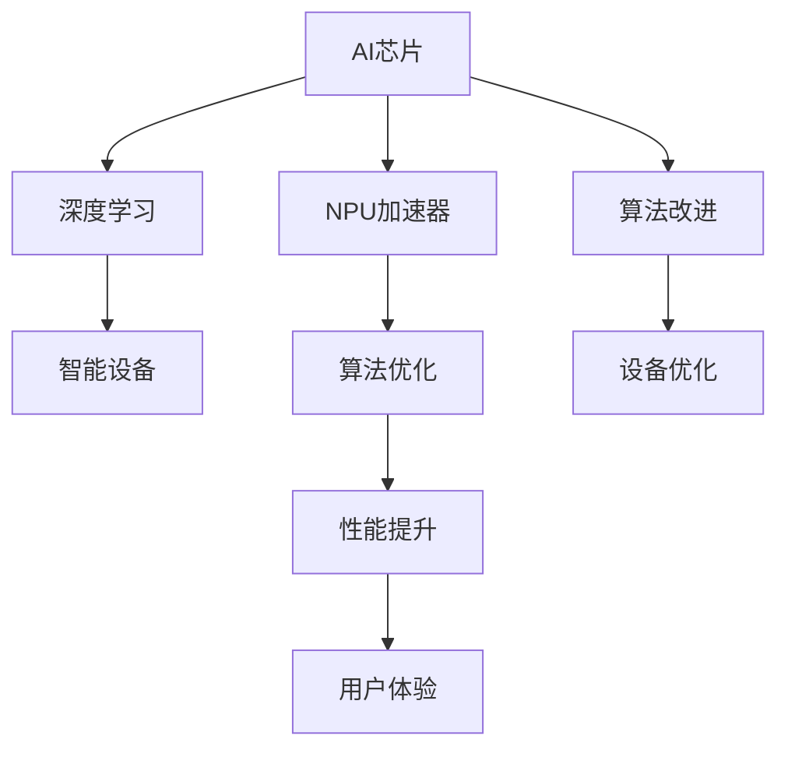

                 

# NPU加速器：AI芯片在智能设备中的应用

> 关键词：AI芯片, NPU加速器, 深度学习, 智能设备, 算法优化, 高效计算

## 1. 背景介绍

### 1.1 问题由来
随着人工智能技术的迅猛发展，深度学习在图像识别、自然语言处理、语音识别等领域取得了显著成果。然而，深度学习模型的复杂计算过程对硬件提出了极高的要求，传统的CPU和GPU已难以满足其计算需求。为了解决这个问题，AI芯片（Artificial Intelligence Chip），特别是NPU（Neural Processing Unit）加速器应运而生，成为了深度学习计算的重要工具。NPU加速器针对深度学习模型的特定计算需求进行专门优化，大幅提升了深度学习的计算效率和性能。

### 1.2 问题核心关键点
NPU加速器是专门为深度学习优化设计的人工智能芯片，其主要特点是：

- **专用性强**：NPU加速器是专为深度学习模型设计，针对模型的特定计算需求进行了专门优化。
- **高效性**：采用并行计算、流水线操作等技术，显著提升深度学习的计算效率。
- **功耗低**：通过高效的电路设计，能够在保持高计算效率的同时，降低功耗和热量。
- **灵活性**：支持多种深度学习模型和算法，具有广泛的适用性。

这些特性使得NPU加速器成为深度学习计算的理想选择，广泛应用于各种智能设备中，如智能手机、物联网设备、自动驾驶汽车等。

### 1.3 问题研究意义
研究NPU加速器的应用，对于推动人工智能技术在智能设备中的普及和应用，提高设备性能和用户体验，具有重要意义：

1. **提升设备性能**：NPU加速器能够显著提升深度学习模型的计算效率，使设备能够在更短的时间内处理更多数据，提升用户使用体验。
2. **降低能耗**：通过高效的计算设计和算法优化，NPU加速器在保持高性能的同时，显著降低了设备能耗，延长设备使用时间。
3. **推动应用场景多样化**：NPU加速器的高性能和低功耗特性，使得更多高计算需求的AI应用场景成为可能，推动了智能设备的应用多样化和创新。
4. **加速技术普及**：NPU加速器的应用，降低了深度学习技术的应用门槛，使更多企业和开发者能够便捷地开发和部署AI应用，促进技术普及。

## 2. 核心概念与联系

### 2.1 核心概念概述

为了更好地理解NPU加速器在智能设备中的应用，本节将介绍几个密切相关的核心概念：

- **AI芯片**：一种专门为人工智能应用设计的芯片，包括CPU、GPU、FPGA、ASIC和NPU等多种类型。
- **NPU加速器**：针对深度学习模型进行优化的专用芯片，具有高度计算密集和数据并行特性。
- **深度学习**：一种基于神经网络的机器学习方法，通过多层次的特征学习和抽象，实现对复杂数据的高效处理。
- **智能设备**：集成了AI芯片和深度学习模型的设备，如智能手机、物联网设备、智能家居等。
- **算法优化**：针对特定AI应用场景，通过改进模型架构、优化计算流程等手段，提升深度学习模型的计算效率和性能。

这些核心概念之间的逻辑关系可以通过以下Mermaid流程图来展示：



这个流程图展示了一系列概念之间的逻辑关系：

1. AI芯片通过技术创新为深度学习模型提供计算支持。
2. NPU加速器是专为深度学习设计的高效计算芯片。
3. 深度学习模型通过NPU加速器进行高效计算。
4. 智能设备通过集成NPU加速器，实现AI功能。
5. 算法优化和改进进一步提升NPU加速器的性能。
6. 性能提升最终带来更好的用户体验。

## 3. 核心算法原理 & 具体操作步骤
### 3.1 算法原理概述

NPU加速器在深度学习计算中的主要原理是通过高度并行化计算和流水线操作，显著提升深度学习模型的计算效率。具体而言，NPU加速器通过以下步骤实现深度学习的加速计算：

1. **数据并行化**：将深度学习模型的计算任务拆分成多个并行计算单元，每个单元处理模型中的某个子任务。
2. **流水线操作**：将计算任务划分为多个阶段，每个阶段对应一个计算单元，多个计算单元同时执行不同的阶段，实现流水线操作。
3. **局部存储优化**：在NPU加速器内部设计专用存储器，降低数据传输延迟，提高计算效率。
4. **硬件加速**：通过硬件电路设计，加速深度学习模型的特定计算操作，如矩阵乘法、卷积等。

### 3.2 算法步骤详解

以下是使用NPU加速器进行深度学习计算的一般步骤：

**Step 1: 模型适配与编译**

- 选择合适的深度学习模型，并进行适配和优化，以适配NPU加速器架构。
- 将适配后的模型代码编译为目标硬件指令集，生成可执行的NPU加速器代码。

**Step 2: 数据准备与输入**

- 将深度学习模型需要的数据准备好，并进行预处理，如数据格式转换、归一化等。
- 将准备好的数据输入NPU加速器，并进行并行化计算。

**Step 3: 计算执行与优化**

- 在NPU加速器上执行深度学习模型计算，利用并行化和流水线操作提高计算效率。
- 根据计算过程中的瓶颈和需求，对模型进行动态优化，如调整并行度、优化流水线等。

**Step 4: 结果输出与后处理**

- 将计算结果从NPU加速器读取并输出，并进行后处理，如数据滤波、降维等。
- 对输出结果进行评估和优化，确保最终结果符合预期。

### 3.3 算法优缺点

NPU加速器的应用具有以下优点：

1. **高效计算**：通过高度并行化和流水线操作，显著提升深度学习模型的计算效率。
2. **低功耗**：设计高效的电路和算法，降低功耗和热量，延长设备使用时间。
3. **高专用性**：针对深度学习模型进行专门优化，提升模型计算性能。
4. **灵活性**：支持多种深度学习模型和算法，具有广泛的适用性。

然而，NPU加速器也存在一些缺点：

1. **成本高**：专用芯片的开发和生产成本较高，普及难度较大。
2. **开发复杂**：需要针对特定硬件架构进行模型适配和优化，开发门槛较高。
3. **灵活性不足**：虽然专用性高，但灵活性相对较低，可能难以支持新兴的AI应用场景。
4. **技术壁垒高**：对硬件设计和算法优化要求较高，需要专业的技术和人才支持。

### 3.4 算法应用领域

NPU加速器在深度学习计算中有着广泛的应用，以下是几个主要的应用领域：

- **图像识别**：在图像识别任务中，NPU加速器通过优化卷积计算，显著提升模型的推理速度和准确率，如人脸识别、物体检测等。
- **语音识别**：在语音识别任务中，NPU加速器通过优化卷积和循环神经网络（RNN）计算，提升模型的语音转文字性能，如智能助手、语音翻译等。
- **自然语言处理**：在自然语言处理任务中，NPU加速器通过优化矩阵乘法和注意力机制计算，提升模型的语言理解能力和生成能力，如机器翻译、文本摘要等。
- **自动驾驶**：在自动驾驶任务中，NPU加速器通过优化卷积和时序计算，提升模型的环境感知和决策能力，如目标检测、路径规划等。
- **医疗影像分析**：在医疗影像分析任务中，NPU加速器通过优化卷积和分类计算，提升模型的图像识别和分析能力，如肿瘤检测、X光图像分析等。

## 4. 数学模型和公式 & 详细讲解 & 举例说明（备注：数学公式请使用latex格式，latex嵌入文中独立段落使用 $$，段落内使用 $)
### 4.1 数学模型构建

深度学习模型的计算过程通常由前向传播和反向传播两个阶段组成。以卷积神经网络（CNN）为例，其计算过程可以表示为：

1. **前向传播**：通过卷积层、池化层等进行特征提取，得到模型输出。

$$
h^{l+1} = f(W^{l+1} \ast h^{l} + b^{l+1})
$$

其中，$h^{l+1}$ 表示第 $l+1$ 层的输出，$W^{l+1}$ 表示第 $l+1$ 层的权重，$b^{l+1}$ 表示第 $l+1$ 层的偏置。

2. **反向传播**：通过梯度下降等优化算法，更新模型的权重和偏置。

$$
\frac{\partial L}{\partial W^{l+1}} = \frac{\partial L}{\partial h^{l+1}} \cdot \frac{\partial h^{l+1}}{\partial W^{l+1}}
$$

其中，$L$ 表示损失函数，$W^{l+1}$ 表示第 $l+1$ 层的权重，$h^{l+1}$ 表示第 $l+1$ 层的输出。

### 4.2 公式推导过程

以下以卷积神经网络（CNN）为例，推导深度学习模型在前向传播和反向传播阶段的计算过程。

**前向传播**：

- **卷积层**：通过卷积操作提取特征。

$$
h^{l+1} = f(W^{l+1} \ast h^{l} + b^{l+1})
$$

其中，$h^{l+1}$ 表示第 $l+1$ 层的输出，$W^{l+1}$ 表示第 $l+1$ 层的权重，$b^{l+1}$ 表示第 $l+1$ 层的偏置。

- **池化层**：通过池化操作降采样，减少特征维度。

$$
h'^{l+1} = max_{i,j}(h^{l+1}_{i,j})
$$

其中，$h'^{l+1}$ 表示池化层输出，$h^{l+1}$ 表示第 $l+1$ 层输出。

**反向传播**：

- **梯度计算**：通过链式法则计算梯度。

$$
\frac{\partial L}{\partial W^{l+1}} = \frac{\partial L}{\partial h^{l+1}} \cdot \frac{\partial h^{l+1}}{\partial W^{l+1}}
$$

其中，$L$ 表示损失函数，$W^{l+1}$ 表示第 $l+1$ 层的权重，$h^{l+1}$ 表示第 $l+1$ 层的输出。

### 4.3 案例分析与讲解

以图像分类任务为例，分析NPU加速器在卷积神经网络中的计算过程。

1. **数据准备**：将图像数据转换为模型所需的输入格式。

2. **前向传播**：将图像输入卷积神经网络，通过卷积层和池化层进行特征提取和降采样。

3. **计算优化**：在NPU加速器上执行卷积和池化操作，通过并行化和流水线操作提升计算效率。

4. **结果输出**：将卷积神经网络的输出与标签进行对比，计算损失函数，并进行反向传播更新模型参数。

通过NPU加速器的优化，卷积神经网络的计算效率和性能得到了显著提升，能够在更短的时间内完成图像分类任务，提高模型的实用性和普及率。

## 5. 项目实践：代码实例和详细解释说明
### 5.1 开发环境搭建

在使用NPU加速器进行深度学习计算前，需要先准备好开发环境。以下是使用Python进行TensorFlow和NPU加速器开发的环境配置流程：

1. 安装Anaconda：从官网下载并安装Anaconda，用于创建独立的Python环境。

2. 创建并激活虚拟环境：

```bash
conda create -n tf-env python=3.8 
conda activate tf-env
```

3. 安装TensorFlow：

```bash
conda install tensorflow-gpu=tensorflow-2.3
```

4. 安装NPU加速器驱动程序和开发工具包：

```bash
conda install npu-accelerate
```

5. 安装TensorFlow NPU加速器插件：

```bash
pip install tf_npu_plugin
```

完成上述步骤后，即可在`tf-env`环境中开始NPU加速器开发。

### 5.2 源代码详细实现

以下是使用TensorFlow和NPU加速器进行图像分类任务的示例代码实现：

```python
import tensorflow as tf
import tf_npu_plugin

# 设置NPU加速器设备
tf.config.experimental_connect_to_cluster(tf.config.experimental.ClusterSpec({"GPU": 0}))
tf.config.experimental.set_global_jit(True)
tf.config.experimental.set_memory_growth('GPU', True)

# 加载数据集
mnist = tf.keras.datasets.mnist
(x_train, y_train), (x_test, y_test) = mnist.load_data()

# 数据预处理
x_train = x_train.reshape(-1, 28, 28, 1).astype('float32') / 255.0
x_test = x_test.reshape(-1, 28, 28, 1).astype('float32') / 255.0
y_train = tf.keras.utils.to_categorical(y_train, 10)
y_test = tf.keras.utils.to_categorical(y_test, 10)

# 构建模型
model = tf.keras.Sequential([
    tf.keras.layers.Conv2D(32, (3, 3), activation='relu', input_shape=(28, 28, 1)),
    tf.keras.layers.MaxPooling2D((2, 2)),
    tf.keras.layers.Flatten(),
    tf.keras.layers.Dense(10, activation='softmax')
])

# 编译模型
model.compile(optimizer='adam',
              loss='categorical_crossentropy',
              metrics=['accuracy'])

# 在NPU加速器上训练模型
model.fit(x_train, y_train, epochs=10, validation_data=(x_test, y_test), verbose=2)
```

### 5.3 代码解读与分析

以上代码实现了使用TensorFlow和NPU加速器进行图像分类任务的深度学习计算。

**设置NPU加速器设备**：

- `tf.config.experimental_connect_to_cluster(tf.config.experimental.ClusterSpec({"GPU": 0}))`：连接NPU加速器设备。
- `tf.config.experimental.set_global_jit(True)`：启用全局Just-In-Time编译器。
- `tf.config.experimental.set_memory_growth('GPU', True)`：动态分配GPU内存，提升计算效率。

**数据预处理**：

- `x_train = x_train.reshape(-1, 28, 28, 1).astype('float32') / 255.0`：将图像数据转换为模型所需的格式，并进行归一化。
- `y_train = tf.keras.utils.to_categorical(y_train, 10)`：将标签转换为模型所需的格式。

**模型构建**：

- `tf.keras.layers.Conv2D(32, (3, 3), activation='relu', input_shape=(28, 28, 1))`：构建卷积层，提取图像特征。
- `tf.keras.layers.MaxPooling2D((2, 2))`：构建池化层，降采样。
- `tf.keras.layers.Flatten()`：将池化层的输出展平。
- `tf.keras.layers.Dense(10, activation='softmax')`：构建全连接层，进行分类。

**模型编译与训练**：

- `model.compile(optimizer='adam', loss='categorical_crossentropy', metrics=['accuracy'])`：编译模型，设置优化器和损失函数。
- `model.fit(x_train, y_train, epochs=10, validation_data=(x_test, y_test), verbose=2)`：在NPU加速器上训练模型，设置训练轮数和验证集。

## 6. 实际应用场景

### 6.1 智能手机

在智能手机中，NPU加速器可以显著提升深度学习模型的推理速度和计算效率，提升设备的实时性和用户体验。具体而言，NPU加速器可以应用于以下场景：

- **图像识别**：如人脸识别、人脸解锁、图像搜索等。通过优化卷积和池化计算，提升模型的推理速度。
- **语音识别**：如智能助手、语音输入、语音翻译等。通过优化卷积和循环神经网络（RNN）计算，提升模型的语音识别和理解能力。
- **自然语言处理**：如文本输入预测、智能推荐、智能客服等。通过优化矩阵乘法和注意力机制计算，提升模型的语言理解和生成能力。

### 6.2 物联网设备

在物联网设备中，NPU加速器可以显著提升深度学习模型的推理速度和计算效率，使设备能够在更短的时间内完成数据处理和决策。具体而言，NPU加速器可以应用于以下场景：

- **环境感知**：如智能家居、智慧城市、自动驾驶等。通过优化卷积和时序计算，提升模型的环境感知和决策能力。
- **设备控制**：如智能家电、智能安防、智能交通等。通过优化卷积和分类计算，提升设备的智能控制和决策能力。
- **数据处理**：如数据采集、数据存储、数据处理等。通过优化数据并行化和流水线操作，提升设备的数据处理能力。

### 6.3 自动驾驶

在自动驾驶中，NPU加速器可以显著提升深度学习模型的推理速度和计算效率，提升车辆的智能驾驶能力。具体而言，NPU加速器可以应用于以下场景：

- **目标检测**：如交通信号识别、行人检测、车辆识别等。通过优化卷积和时序计算，提升模型的环境感知能力。
- **路径规划**：如路线规划、交通优化等。通过优化卷积和分类计算，提升模型的决策能力。
- **环境建模**：如环境建模、场景理解等。通过优化卷积和卷积计算，提升模型的环境建模能力。

### 6.4 医疗影像分析

在医疗影像分析中，NPU加速器可以显著提升深度学习模型的推理速度和计算效率，提升医学影像的分析和诊断能力。具体而言，NPU加速器可以应用于以下场景：

- **肿瘤检测**：如CT、MRI、X光等。通过优化卷积和分类计算，提升模型的影像分析和诊断能力。
- **病变检测**：如心脏疾病、肺部疾病等。通过优化卷积和池化计算，提升模型的病变检测能力。
- **影像分割**：如病变分割、器官分割等。通过优化卷积和池化计算，提升模型的影像分割能力。

## 7. 工具和资源推荐
### 7.1 学习资源推荐

为了帮助开发者系统掌握NPU加速器的理论基础和实践技巧，这里推荐一些优质的学习资源：

1. **《深度学习与AI芯片：构建智能系统的新基石》**：介绍深度学习与AI芯片的结合，以及如何利用NPU加速器提升深度学习计算效率。
2. **《NPU加速器设计与优化》**：深入介绍NPU加速器的设计原理和优化技术，适合硬件和算法开发者学习。
3. **《AI芯片设计与实现》**：介绍AI芯片的原理、设计和实现技术，适合深度学习开发者和硬件工程师学习。
4. **TensorFlow NPU官方文档**：提供NPU加速器在TensorFlow中的使用方法和优化技巧，适合TensorFlow开发者学习。
5. **《NPU加速器应用案例》**：介绍NPU加速器在图像识别、语音识别、自然语言处理等领域的实际应用案例，适合NPU加速器开发者学习。

### 7.2 开发工具推荐

高效的开发离不开优秀的工具支持。以下是几款用于NPU加速器开发的常用工具：

1. **TensorFlow**：基于Python的开源深度学习框架，支持GPU和NPU加速器，适合深度学习开发者使用。
2. **PyTorch**：基于Python的开源深度学习框架，支持GPU和NPU加速器，适合深度学习开发者使用。
3. **TensorBoard**：TensorFlow配套的可视化工具，可实时监测模型训练状态，适合深度学习开发者使用。
4. **NPU加速器开发工具包**：支持NPU加速器的开发和优化，适合硬件和算法开发者使用。
5. **TensorFlow NPU插件**：提供NPU加速器的优化和支持，适合TensorFlow开发者使用。

### 7.3 相关论文推荐

NPU加速器的研究源于学界的持续研究。以下是几篇奠基性的相关论文，推荐阅读：

1. **《TensorFlow中的NPU加速器实现》**：介绍TensorFlow中NPU加速器的实现原理和优化技术。
2. **《基于NPU加速器的深度学习优化》**：介绍NPU加速器在深度学习中的优化技术和应用案例。
3. **《NPU加速器的设计原理与优化技术》**：介绍NPU加速器的设计原理和优化技术，适合硬件和算法开发者阅读。
4. **《深度学习模型在NPU加速器上的优化》**：介绍深度学习模型在NPU加速器上的优化技术和应用案例。
5. **《NPU加速器与深度学习结合的应用研究》**：介绍NPU加速器在深度学习中的实际应用案例和研究进展。

## 8. 总结：未来发展趋势与挑战

### 8.1 总结

本文对NPU加速器在智能设备中的应用进行了全面系统的介绍。首先阐述了NPU加速器的背景和意义，明确了其在深度学习计算中的重要地位。其次，从原理到实践，详细讲解了NPU加速器的核心算法和具体操作步骤，给出了NPU加速器开发的完整代码实例。同时，本文还广泛探讨了NPU加速器在智能手机、物联网设备、自动驾驶、医疗影像分析等多个领域的应用前景，展示了NPU加速器的巨大潜力。此外，本文精选了NPU加速器的各类学习资源，力求为读者提供全方位的技术指引。

通过本文的系统梳理，可以看到，NPU加速器是推动深度学习计算效率和性能提升的关键工具，具有广泛的应用前景。其在深度学习计算中的应用将进一步推动AI技术在智能设备中的普及和应用，带来全新的计算体验和应用场景。

### 8.2 未来发展趋势

展望未来，NPU加速器的发展趋势将呈现以下几个方向：

1. **计算效率持续提升**：随着硬件工艺的进步和算法优化，NPU加速器的计算效率将持续提升，进一步推动深度学习计算的普及和应用。
2. **应用场景多样化**：NPU加速器在更多领域的应用将不断扩展，如医疗影像分析、自动驾驶、智能家居等，带来新的应用前景。
3. **与AI算法深度融合**：NPU加速器将与更多的AI算法和技术进行深度融合，提升AI系统的综合性能。
4. **模型压缩与优化**：通过模型压缩和优化技术，进一步提升NPU加速器的模型适配能力和计算效率。
5. **多模态计算能力**：NPU加速器将支持更多的模态计算，如视觉、语音、文本等多模态融合，提升AI系统的多模态处理能力。

### 8.3 面临的挑战

尽管NPU加速器在深度学习计算中取得了显著成就，但在其发展过程中仍面临诸多挑战：

1. **成本高**：NPU加速器的研发和生产成本较高，难以广泛普及。
2. **开发复杂**：需要针对特定硬件架构进行模型适配和优化，开发门槛较高。
3. **应用场景限制**：虽然专用性高，但应用场景相对单一，难以支持更多新兴的AI应用场景。
4. **技术壁垒高**：对硬件设计和算法优化要求较高，需要专业的技术和人才支持。
5. **兼容性问题**：NPU加速器需要与现有软件生态和硬件平台进行深度兼容，存在兼容性问题。

### 8.4 研究展望

面对NPU加速器面临的挑战，未来的研究需要在以下几个方面寻求新的突破：

1. **降低成本**：通过开源共享、标准化设计等方式，降低NPU加速器的研发和生产成本，推动其普及和应用。
2. **提升开发便利性**：提供更灵活的开发接口和工具，降低NPU加速器的开发门槛，使其更容易被开发者接受和使用。
3. **拓展应用场景**：通过硬件和算法优化，拓展NPU加速器的应用场景，使其能够支持更多新兴的AI应用场景。
4. **提升技术兼容性**：提高NPU加速器的兼容性，使其能够与现有软件生态和硬件平台无缝结合，推动其应用普及。
5. **加强多模态计算能力**：通过多模态融合技术，提升NPU加速器的多模态计算能力，推动AI系统的综合性能提升。

这些研究方向的探索，将推动NPU加速器技术的持续进步，为深度学习计算提供更强大的硬件支持，带来更广泛的应用前景。

## 9. 附录：常见问题与解答

**Q1：NPU加速器在深度学习计算中的优势是什么？**

A: NPU加速器在深度学习计算中的优势主要体现在以下几个方面：

1. **计算效率高**：NPU加速器通过高度并行化和流水线操作，显著提升深度学习模型的计算效率。
2. **低功耗**：设计高效的电路和算法，降低功耗和热量，延长设备使用时间。
3. **专用性强**：针对深度学习模型进行专门优化，提升模型计算性能。
4. **灵活性高**：支持多种深度学习模型和算法，具有广泛的适用性。

这些优势使得NPU加速器成为深度学习计算的理想选择，广泛应用于各种智能设备中。

**Q2：如何在深度学习计算中使用NPU加速器？**

A: 在深度学习计算中使用NPU加速器，一般需要以下几个步骤：

1. 适配NPU加速器架构：将深度学习模型适配到NPU加速器的架构上，优化计算过程。
2. 编译模型代码：将适配后的模型代码编译为目标硬件指令集，生成可执行的NPU加速器代码。
3. 准备数据：将深度学习模型需要的数据准备好，并进行预处理，如数据格式转换、归一化等。
4. 设置NPU加速器设备：连接NPU加速器设备，并设置相关参数，如内存分配、优化器等。
5. 执行计算：在NPU加速器上执行深度学习模型的前向传播和反向传播，计算损失函数，并进行参数更新。
6. 输出结果：将计算结果从NPU加速器读取并输出，并进行后处理，如数据滤波、降维等。

通过以上步骤，即可在深度学习计算中使用NPU加速器，提升计算效率和性能。

**Q3：NPU加速器有哪些应用场景？**

A: NPU加速器在深度学习计算中具有广泛的应用场景，主要包括以下几个方面：

1. 图像识别：如人脸识别、图像搜索等。通过优化卷积和池化计算，提升模型的推理速度。
2. 语音识别：如智能助手、语音输入等。通过优化卷积和循环神经网络（RNN）计算，提升模型的语音识别和理解能力。
3. 自然语言处理：如文本输入预测、智能推荐等。通过优化矩阵乘法和注意力机制计算，提升模型的语言理解和生成能力。
4. 环境感知：如智能家居、智慧城市、自动驾驶等。通过优化卷积和时序计算，提升模型的环境感知和决策能力。
5. 设备控制：如智能家电、智能安防等。通过优化卷积和分类计算，提升设备的智能控制和决策能力。
6. 数据处理：如数据采集、数据存储等。通过优化数据并行化和流水线操作，提升设备的数据处理能力。

这些应用场景展示了NPU加速器在深度学习计算中的广泛应用前景。

---

作者：禅与计算机程序设计艺术 / Zen and the Art of Computer Programming

