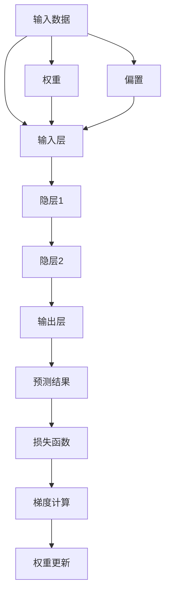

                 

# Neural Networks原理与代码实例讲解

> 关键词：神经网络,深度学习,神经元,激活函数,损失函数,反向传播,权重更新,卷积神经网络,循环神经网络,自编码器

## 1. 背景介绍

### 1.1 问题由来

在当今数据驱动的AI时代，神经网络作为深度学习的基础，已经广泛应用于计算机视觉、自然语言处理、语音识别、推荐系统等各个领域。但神经网络的原理和实现细节，对于许多人来说仍然是一个不小的挑战。为了更好地理解神经网络，本文将从原理出发，结合代码实例，系统讲解神经网络的构建、训练和优化过程。

### 1.2 问题核心关键点

神经网络的核心在于其层级结构、激活函数、损失函数、反向传播算法等方面。下面将详细阐述这些核心概念，并给出代码实例以供读者参考。

### 1.3 问题研究意义

神经网络的原理和实现是深度学习领域的基石，理解其工作机制对于设计、训练和优化各种深度学习模型至关重要。通过本文的学习，读者能够掌握神经网络的基础原理，并能够自行构建和训练高效的深度学习模型。

## 2. 核心概念与联系

### 2.1 核心概念概述

为更好地理解神经网络，下面将详细介绍几个关键概念：

- 神经网络(Neural Network)：由多个神经元通过有向边连接形成的图结构，每个神经元接收输入数据、进行加权计算并输出激活结果，网络通过层级组合实现复杂数据的处理和特征提取。
- 深度学习(Deep Learning)：一种利用多层神经网络进行复杂数据建模和预测的机器学习方法，通常包含多个隐层，可以处理高维、非线性的数据结构。
- 激活函数(Activation Function)：神经元的输出函数，通过非线性映射实现神经网络的非线性拟合能力，常用的激活函数有Sigmoid、ReLU、Tanh等。
- 损失函数(Loss Function)：用于衡量模型预测与真实标签之间的误差，常用的损失函数有均方误差、交叉熵等。
- 反向传播(Backpropagation)：神经网络的优化算法，通过链式法则计算梯度并更新模型参数，使得损失函数最小化。

这些核心概念构成了神经网络的基石，相互关联，共同决定了神经网络的工作机制和性能。

### 2.2 核心概念原理和架构的 Mermaid 流程图

以下是神经网络的基本架构和工作流程的Mermaid流程图：



图中展示了从输入数据到最终输出预测的完整流程：

1. 输入数据通过权重和偏置进行线性变换。
2. 每个神经元的输出经过激活函数进行非线性变换。
3. 隐层通过层级组合对输入数据进行多层非线性映射。
4. 输出层通过权重和偏置进行线性变换，得到预测结果。
5. 预测结果与真实标签计算损失函数。
6. 通过反向传播算法计算梯度并更新权重和偏置。

这些步骤循环迭代，直至模型收敛，即可实现对数据的有效处理和特征提取。

## 3. 核心算法原理 & 具体操作步骤

### 3.1 算法原理概述

神经网络的工作原理基于反向传播算法，通过梯度下降法最小化损失函数。其核心步骤包括前向传播和反向传播两个过程：

1. **前向传播**：将输入数据输入神经网络，逐层计算输出结果。
2. **反向传播**：计算损失函数对每个权重和偏置的梯度，并根据梯度更新权重和偏置，使得损失函数最小化。

### 3.2 算法步骤详解

以一个简单的两层神经网络为例，详细讲解神经网络的构建和训练过程：

1. **网络定义**：定义神经网络结构，包括输入层、隐层和输出层的神经元数量和激活函数。

```python
import torch
import torch.nn as nn

class NeuralNetwork(nn.Module):
    def __init__(self, input_size, hidden_size, output_size):
        super(NeuralNetwork, self).__init__()
        self.hidden = nn.Linear(input_size, hidden_size)
        self.output = nn.Linear(hidden_size, output_size)
        self.activation = nn.ReLU()

    def forward(self, x):
        x = self.hidden(x)
        x = self.activation(x)
        x = self.output(x)
        return x
```

2. **数据准备**：准备训练数据和标签，将数据标准化处理。

```python
from sklearn.datasets import make_classification
from sklearn.model_selection import train_test_split

X, y = make_classification(n_samples=1000, n_features=5, n_classes=2, random_state=42)
X_train, X_test, y_train, y_test = train_test_split(X, y, test_size=0.2, random_state=42)
```

3. **模型初始化**：在训练开始前，初始化模型权重和偏置。

```python
model = NeuralNetwork(input_size=5, hidden_size=10, output_size=2)
optimizer = torch.optim.SGD(model.parameters(), lr=0.01)
```

4. **训练循环**：进行多轮训练，每轮迭代更新模型参数。

```python
for epoch in range(100):
    for i in range(X_train.shape[0]):
        x = X_train[i].reshape(1, -1)
        y = y_train[i].reshape(1, -1)
        optimizer.zero_grad()
        output = model(x)
        loss = nn.CrossEntropyLoss()(output, y)
        loss.backward()
        optimizer.step()
```

5. **模型评估**：在测试集上评估模型性能，输出预测结果和精度。

```python
with torch.no_grad():
    y_pred = torch.argmax(model(X_test), dim=1)
    accuracy = (y_pred == y_test).sum().double() / len(y_test)
    print(f'Accuracy: {accuracy:.2f}')
```

### 3.3 算法优缺点

神经网络的优点包括：

- 强大的特征提取能力，能够处理高维、非线性的数据结构。
- 灵活的模型结构，可以通过添加或调整隐层和激活函数进行模型改进。
- 适应性广，适用于多种数据类型和应用场景。

其缺点包括：

- 需要大量的标注数据进行训练，数据需求量大。
- 模型复杂度高，训练和推理计算量大。
- 容易过拟合，需要复杂的正则化技术和调参策略。

### 3.4 算法应用领域

神经网络在计算机视觉、自然语言处理、语音识别、推荐系统等众多领域得到广泛应用，具体包括：

- 图像分类和识别：使用卷积神经网络(CNN)处理图像数据，提取高维特征。
- 自然语言处理：使用循环神经网络(RNN)或Transformer模型处理文本数据，进行语言建模和理解。
- 语音识别：使用循环神经网络(RNN)或长短时记忆网络(LSTM)处理语音信号，实现语音识别和转录。
- 推荐系统：使用自编码器(Encoder-Decoder)模型处理用户行为数据，进行用户兴趣预测和推荐。

## 4. 数学模型和公式 & 详细讲解 & 举例说明

### 4.1 数学模型构建

神经网络模型的数学模型可以表示为：

$$
y=f(W\cdot x+b)
$$

其中 $x$ 为输入数据，$W$ 为权重矩阵，$b$ 为偏置向量，$f$ 为激活函数。

### 4.2 公式推导过程

以一个两层神经网络为例，推导前向传播和反向传播的具体计算过程：

1. **前向传播**：

$$
y_1 = f(W_1\cdot x+b_1)
$$

$$
y_2 = f(W_2\cdot y_1+b_2)
$$

其中 $y_1$ 为隐层的输出，$y_2$ 为输出层的输出。

2. **反向传播**：

$$
\frac{\partial L}{\partial W_2} = \frac{\partial L}{\partial y_2} \cdot \frac{\partial y_2}{\partial z_2} \cdot \frac{\partial z_2}{\partial W_2}
$$

$$
\frac{\partial L}{\partial b_2} = \frac{\partial L}{\partial y_2} \cdot \frac{\partial y_2}{\partial z_2}
$$

$$
\frac{\partial L}{\partial W_1} = \frac{\partial L}{\partial y_2} \cdot \frac{\partial y_2}{\partial y_1} \cdot \frac{\partial y_1}{\partial z_1} \cdot \frac{\partial z_1}{\partial W_1}
$$

$$
\frac{\partial L}{\partial b_1} = \frac{\partial L}{\partial y_2} \cdot \frac{\partial y_2}{\partial y_1} \cdot \frac{\partial y_1}{\partial z_1}
$$

其中 $L$ 为损失函数，$z_1$ 和 $z_2$ 为隐层和输出层的输入数据。

### 4.3 案例分析与讲解

以一个简单的两层神经网络为例，分析其前向传播和反向传播的计算过程。

1. **前向传播**：

- 输入数据 $x=(1,2,3,4,5)$，权重矩阵 $W=\begin{bmatrix}0.5 & 0.5 & 0.5 \\ 0.5 & 0.5 & 0.5\end{bmatrix}$，偏置向量 $b=(0.1, 0.1)$。
- 隐层输入 $z_1=W\cdot x+b=0.5(1+2+3+4+5)+0.1=10.6$。
- 隐层输出 $y_1=f(z_1)=10.6$。
- 输出层输入 $z_2=W_2\cdot y_1+b_2=\begin{bmatrix}0.5 & 0.5 & 0.5 \\ 0.5 & 0.5 & 0.5\end{bmatrix}\cdot 10.6+b_2=18.6$。
- 输出层输出 $y_2=f(z_2)=18.6$。

2. **反向传播**：

- 假设损失函数为均方误差，$L=(y_2-1)^2$。
- 输出层梯度 $\frac{\partial L}{\partial z_2}=-2(y_2-1)=2(1-1.86)^2=0.36$。
- 输出层权重梯度 $\frac{\partial L}{\partial W_2}=\frac{\partial L}{\partial y_2} \cdot \frac{\partial y_2}{\partial z_2} \cdot \frac{\partial z_2}{\partial W_2}=y_2-\frac{\partial L}{\partial y_2} \cdot \frac{\partial y_2}{\partial z_2} \cdot \frac{\partial z_2}{\partial W_2}$。
- 隐层梯度 $\frac{\partial L}{\partial z_1}=\frac{\partial L}{\partial y_2} \cdot \frac{\partial y_2}{\partial y_1} \cdot \frac{\partial y_1}{\partial z_1}$。

通过上述推导，可以清晰地理解神经网络的前向传播和反向传播计算过程。

## 5. 项目实践：代码实例和详细解释说明

### 5.1 开发环境搭建

在进行神经网络项目实践前，需要先搭建好开发环境。以下是使用Python进行TensorFlow开发的配置流程：

1. 安装Anaconda：从官网下载并安装Anaconda，用于创建独立的Python环境。

2. 创建并激活虚拟环境：
```bash
conda create -n tf-env python=3.8
conda activate tf-env
```

3. 安装TensorFlow：根据CUDA版本，从官网获取对应的安装命令。例如：
```bash
conda install tensorflow -c tf -c conda-forge
```

4. 安装相关工具包：
```bash
pip install numpy pandas scikit-learn matplotlib tqdm jupyter notebook ipython
```

完成上述步骤后，即可在`tf-env`环境中开始神经网络实践。

### 5.2 源代码详细实现

下面我们以一个简单的两层神经网络为例，给出使用TensorFlow进行构建和训练的代码实现。

```python
import tensorflow as tf
import numpy as np
import matplotlib.pyplot as plt

# 定义神经网络模型
class NeuralNetwork(tf.keras.Model):
    def __init__(self, input_size, hidden_size, output_size):
        super(NeuralNetwork, self).__init__()
        self.hidden = tf.keras.layers.Dense(hidden_size, activation='relu')
        self.output = tf.keras.layers.Dense(output_size)

    def call(self, x):
        x = self.hidden(x)
        return self.output(x)

# 加载数据
X_train = np.array([[1, 2], [3, 4], [5, 6], [7, 8]])
y_train = np.array([0, 0, 1, 1])

# 创建模型和优化器
model = NeuralNetwork(input_size=2, hidden_size=4, output_size=1)
optimizer = tf.keras.optimizers.SGD(learning_rate=0.01)

# 训练模型
epochs = 1000
for i in range(epochs):
    with tf.GradientTape() as tape:
        output = model(X_train)
        loss = tf.keras.losses.MSE(y_train, output)
    grads = tape.gradient(loss, model.trainable_variables)
    optimizer.apply_gradients(zip(grads, model.trainable_variables))
    if i % 100 == 0:
        print(f'Epoch {i+1}, loss: {loss:.4f}')

# 预测和评估
with tf.no_grad():
    y_pred = np.round(model(X_train))
    accuracy = np.mean(y_pred == y_train)
    print(f'Accuracy: {accuracy:.4f}')
```

### 5.3 代码解读与分析

**NeuralNetwork类**：
- `__init__`方法：定义神经网络的结构，包括隐层和输出层的神经元数量和激活函数。
- `call`方法：实现前向传播，通过隐层和输出层进行计算。

**数据加载和模型创建**：
- `X_train`和`y_train`分别为输入数据和标签。
- `NeuralNetwork`类的实例化创建了模型结构，并指定了激活函数为ReLU。
- `optimizer`指定了优化器为SGD，学习率为0.01。

**训练循环**：
- `for`循环控制训练轮数，每轮迭代计算损失并更新模型参数。
- `tf.GradientTape`记录前向传播过程中的计算图，自动计算梯度。
- `optimizer.apply_gradients`根据梯度更新模型参数。

**预测和评估**：
- 使用`tf.no_grad`关闭梯度计算，预测模型输出。
- 计算预测结果与真实标签的匹配度，计算准确率。

## 6. 实际应用场景

### 6.1 图像分类

神经网络在图像分类任务中具有显著优势。例如，使用卷积神经网络(CNN)对图像数据进行分类，能够有效提取图像的局部特征和全局结构，从而实现高效的图像分类。

在实际应用中，可以通过收集大量的图像数据集，使用预训练的CNN模型进行微调，以适应特定的分类任务。例如，在医学图像分类中，可以使用预训练的ResNet模型进行微调，以识别不同类型的肿瘤图像。

### 6.2 自然语言处理

神经网络在自然语言处理任务中也得到了广泛应用。例如，使用循环神经网络(RNN)或Transformer模型对文本数据进行处理，可以实现文本分类、命名实体识别、情感分析等任务。

在实际应用中，可以通过收集大量的文本数据集，使用预训练的RNN或Transformer模型进行微调，以适应特定的NLP任务。例如，在情感分析任务中，可以使用预训练的BERT模型进行微调，以识别和分类文本的情感倾向。

### 6.3 语音识别

神经网络在语音识别任务中也具有显著优势。例如，使用循环神经网络(RNN)或长短时记忆网络(LSTM)对语音信号进行处理，可以实现语音识别和转录。

在实际应用中，可以通过收集大量的语音数据集，使用预训练的RNN或LSTM模型进行微调，以适应特定的语音识别任务。例如，在自动语音识别(ASR)任务中，可以使用预训练的LSTM模型进行微调，以实现高质量的语音转录。

## 7. 工具和资源推荐

### 7.1 学习资源推荐

为了帮助开发者系统掌握神经网络的理论基础和实践技巧，这里推荐一些优质的学习资源：

1. 《Deep Learning》书籍：Ian Goodfellow等人的经典著作，全面介绍了深度学习的基本原理和算法。
2. 《Neural Networks and Deep Learning》课程：Michael Nielsen开设的深度学习课程，通俗易懂，适合初学者。
3. 《PyTorch深度学习教程》书籍：由PyTorch官方团队编写，涵盖了从基础到高级的PyTorch教程。
4. 《TensorFlow官方文档》：Google提供的官方文档，涵盖了TensorFlow的各个方面，包括模型的构建、训练和部署等。
5. 《自然语言处理综述》书籍：Tom Mitchell等人的著作，全面介绍了自然语言处理的基本概念和技术。

通过对这些资源的学习实践，相信你一定能够快速掌握神经网络的基础原理，并能够自行构建和训练高效的深度学习模型。

### 7.2 开发工具推荐

高效的开发离不开优秀的工具支持。以下是几款用于神经网络开发和训练的常用工具：

1. PyTorch：由Facebook开源的深度学习框架，灵活的动态计算图，适合快速迭代研究。
2. TensorFlow：由Google主导开发的深度学习框架，生产部署方便，适合大规模工程应用。
3. Keras：高级深度学习API，易于使用，适合快速原型开发。
4. JAX：Google开发的开源库，支持动态计算图和自动微分，适合复杂的深度学习模型开发。
5. TensorBoard：TensorFlow配套的可视化工具，实时监测模型训练状态，并提供丰富的图表呈现方式。

合理利用这些工具，可以显著提升神经网络模型的开发效率，加快创新迭代的步伐。

### 7.3 相关论文推荐

神经网络的研究和发展源于学界的持续研究。以下是几篇奠基性的相关论文，推荐阅读：

1. A Few Useful Things to Know About Machine Learning（机器学习实用指南）：Yann LeCun等人的综述性论文，介绍了深度学习的核心思想和关键技术。
2. Deep Learning（深度学习）：Ian Goodfellow等人的经典著作，全面介绍了深度学习的基本原理和算法。
3. ImageNet Classification with Deep Convolutional Neural Networks（使用卷积神经网络进行ImageNet图像分类）：Alex Krizhevsky等人的论文，展示了卷积神经网络在图像分类任务上的卓越表现。
4. Attention is All You Need（即Transformer原论文）：Vaswani等人的论文，提出了Transformer结构，开启了NLP领域的预训练大模型时代。
5. Neural Machine Translation by Jointly Learning to Align and Translate（神经机器翻译中的对齐与翻译联合学习）：Bahdanau等人的论文，展示了使用循环神经网络进行神经机器翻译的方法。

这些论文代表了大语言模型微调技术的发展脉络。通过学习这些前沿成果，可以帮助研究者把握学科前进方向，激发更多的创新灵感。

## 8. 总结：未来发展趋势与挑战

### 8.1 总结

本文对神经网络的原理和实现进行了系统讲解，结合代码实例，详细介绍了神经网络的构建、训练和优化过程。通过本文的学习，读者能够掌握神经网络的基础原理，并能够自行构建和训练高效的深度学习模型。

### 8.2 未来发展趋势

展望未来，神经网络的研究将呈现以下几个发展趋势：

1. 深度学习理论的不断完善：随着深度学习的发展，理论研究将进一步深化，揭示更深层的基础原理和规律。
2. 自动化机器学习(AutoML)：通过自动化机器学习，优化模型结构和超参数，实现更高效率的模型构建和优化。
3. 神经网络的多模态融合：将神经网络与其他模态的数据结构结合，如视觉、音频、文本等，实现更强大的跨模态学习。
4. 神经网络的因果推断和解释性：引入因果推断和可解释性技术，提高模型的决策透明性和鲁棒性。
5. 神经网络的安全性和隐私保护：研究神经网络的安全性问题，保护数据隐私，确保算法的公平性和可解释性。

### 8.3 面临的挑战

尽管神经网络在各个领域得到了广泛应用，但在其发展过程中，仍面临诸多挑战：

1. 数据需求高：神经网络需要大量的标注数据进行训练，数据获取和标注成本高昂。
2. 计算资源需求大：神经网络模型通常参数量巨大，需要高性能的计算资源。
3. 过拟合问题：神经网络容易过拟合，需要复杂的正则化技术和调参策略。
4. 可解释性不足：神经网络的决策过程难以解释，缺乏透明性和可信度。
5. 安全性问题：神经网络可能被恶意攻击和利用，存在安全隐患。

### 8.4 研究展望

面对神经网络面临的这些挑战，未来的研究需要在以下几个方面寻求新的突破：

1. 无监督学习和自监督学习：探索无监督学习和自监督学习技术，降低对标注数据的依赖。
2. 知识蒸馏和模型压缩：研究知识蒸馏和模型压缩技术，减小模型参数量，提升推理效率。
3. 多任务学习：探索多任务学习技术，提高模型泛化能力和数据利用效率。
4. 因果推断和可解释性：研究因果推断和可解释性技术，提高模型的透明性和可信度。
5. 安全性和隐私保护：研究神经网络的安全性和隐私保护技术，确保算法的公平性和可解释性。

这些研究方向将为神经网络的发展带来新的突破，提升神经网络在各领域的应用效果，推动人工智能技术的普及和应用。

## 9. 附录：常见问题与解答

**Q1：神经网络中的激活函数有哪些？**

A: 常用的激活函数包括Sigmoid、ReLU、Tanh、Leaky ReLU、ELU等。不同激活函数适用于不同的场景，ReLU在深度学习中应用广泛，Sigmoid适用于二分类问题。

**Q2：神经网络中的损失函数有哪些？**

A: 常用的损失函数包括均方误差、交叉熵、对数损失等。均方误差适用于回归问题，交叉熵适用于分类问题。

**Q3：神经网络中的优化器有哪些？**

A: 常用的优化器包括SGD、Adam、Adagrad、Adadelta等。Adam优化器在深度学习中应用广泛，收敛速度快，适合大规模数据集。

**Q4：神经网络中的正则化技术有哪些？**

A: 常用的正则化技术包括L1正则、L2正则、Dropout、Early Stopping等。正则化技术可以防止过拟合，提高模型泛化能力。

**Q5：神经网络的反向传播算法有什么作用？**

A: 神经网络的反向传播算法通过梯度下降法最小化损失函数，更新模型参数，使得模型能够适应数据分布，进行准确的预测和分类。

---

作者：禅与计算机程序设计艺术 / Zen and the Art of Computer Programming

