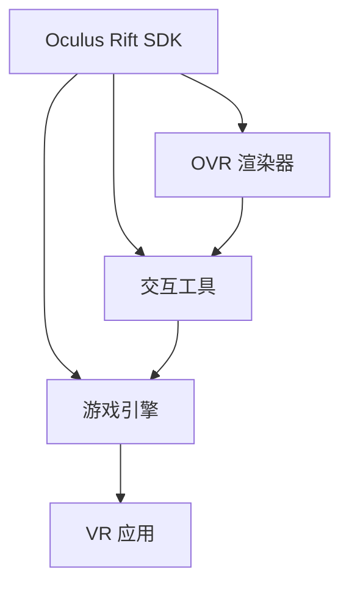

                 

# Oculus Rift SDK 集成指南：在 Rift 平台上开发 VR 应用的技巧

> 关键词：Oculus Rift, SDK, VR, 开发技巧, 集成指南, 游戏引擎, 虚拟现实, 性能优化, 安全性

## 1. 背景介绍

随着虚拟现实（Virtual Reality, VR）技术的快速发展和普及，Oculus Rift 已成为市场上最受欢迎的 VR 设备之一，其 SDK (Software Development Kit) 提供了强大的开发工具和丰富的资源，使得开发者能够轻松创建和部署各种 VR 应用。Oculus Rift SDK 包含了多个模块，包括 OVR 渲染器、交互工具、音频和输入系统等，支持多种游戏引擎，如 Unity 和 Unreal Engine，能够满足从初学者到高级开发者在 VR 开发上的不同需求。

本指南将深入介绍 Oculus Rift SDK 的基本概念、核心模块及其使用方法，并结合实际案例，详细讲解如何在 Rift 平台上开发和集成 VR 应用，以帮助开发者高效、安全地构建 VR 体验。

## 2. 核心概念与联系

### 2.1 核心概念概述

在使用 Oculus Rift SDK 开发 VR 应用时，需要掌握以下几个核心概念：

- **Oculus Rift SDK**：Oculus Rift SDK 是由 Oculus 提供的一组开发工具和资源，用于创建和部署 Rift 平台上的 VR 应用。它包含了多个模块，如渲染器、输入系统、音频系统等，支持多种游戏引擎。

- **OVR 渲染器**：OVR 渲染器是 Oculus Rift SDK 的核心组件，负责处理 VR 环境的渲染，提供沉浸式的 3D 图像和音效。

- **交互工具**：交互工具包括控制器、手势识别等，用于实现用户与虚拟环境的互动，增强用户的沉浸感和互动体验。

- **游戏引擎**：游戏引擎如 Unity 和 Unreal Engine，是构建 VR 应用的主要工具，它们能够将 SDK 提供的资源和功能集成到应用中，实现丰富的游戏场景和交互效果。

这些概念之间相互联系，共同构成了 Oculus Rift SDK 的开发框架。以下 Mermaid 流程图展示了这些概念之间的联系：



## 3. 核心算法原理 & 具体操作步骤

### 3.1 算法原理概述

在 Oculus Rift SDK 中，核心算法原理主要涉及两个方面：

- **渲染算法**：OVR 渲染器采用了一种基于视差校正的光学技术，将用户的左右眼图像进行适当的调整，以模拟人类的立体视觉，从而提供更加真实的三维视觉效果。

- **输入处理算法**：交互工具和控制器等输入设备能够捕捉用户的手部动作和按钮操作，并通过特定的算法进行处理，将用户的行为转化为虚拟环境中的互动。

### 3.2 算法步骤详解

在 Oculus Rift SDK 中开发 VR 应用，一般需要遵循以下步骤：

**Step 1: 安装 SDK 和游戏引擎**

- 从 Oculus 官网下载 SDK 并安装。
- 选择 Unity 或 Unreal Engine 等游戏引擎，并根据 SDK 文档进行配置。

**Step 2: 创建 VR 场景**

- 在游戏引擎中创建一个新的 VR 场景，并导入 Oculus Rift SDK 提供的资源，如 OVR 渲染器、交互工具和音频系统等。

**Step 3: 实现输入交互**

- 将 Oculus Rift SDK 提供的交互工具（如控制器、手势识别等）集成到应用中，实现用户与虚拟环境的互动。

**Step 4: 测试和优化**

- 在 Rift 设备上测试应用的性能和用户体验，针对出现的问题进行优化。

**Step 5: 发布和部署**

- 将优化后的应用导出为 Rift 兼容的格式，并通过 Oculus Store 或外部渠道发布。

### 3.3 算法优缺点

Oculus Rift SDK 的优点包括：

- **强大的渲染能力**：OVR 渲染器能够提供高精度的 3D 渲染效果，增强用户的沉浸感。
- **丰富的交互工具**：SDK 提供的控制器和手势识别等工具，使得用户与虚拟环境的互动更加自然和直观。
- **兼容性良好**：支持多种游戏引擎，方便开发者根据自己的需求进行选择。

缺点方面，Oculus Rift SDK 也存在一些限制：

- **性能要求高**：VR 应用对硬件的要求较高，需要高性能的 CPU 和 GPU，以及较大的内存和存储空间。
- **开发成本较高**：Oculus Rift SDK 的复杂性和高要求使得开发成本较高，需要较长时间的开发和测试。
- **用户适应门槛高**：VR 设备的使用需要用户具备一定的适应性，初次使用可能导致眩晕等不适感。

### 3.4 算法应用领域

Oculus Rift SDK 广泛应用于游戏、教育、医疗、旅游等多个领域，以下是几个具体的应用场景：

- **游戏开发**：开发基于 Rift 的游戏，如射击、模拟、冒险等，为用户提供沉浸式的游戏体验。
- **虚拟培训**：利用 VR 技术进行模拟训练，如医学、军事等领域的技能培训和情景模拟。
- **教育应用**：创建虚拟教室、虚拟实验室等教育场景，提升学生的学习兴趣和效果。
- **体验设计**：设计和展示虚拟旅游、博物馆展览等，让用户能够身临其境地体验不同场景。

## 4. 数学模型和公式 & 详细讲解 & 举例说明

### 4.1 数学模型构建

在 Oculus Rift SDK 中，渲染和交互的数学模型主要涉及以下两个方面：

- **三维渲染模型**：用于描述虚拟场景中的几何形状和位置关系，通常使用向量、矩阵等表示。
- **输入处理模型**：用于捕捉用户输入，并将其转化为虚拟环境中的互动动作，通常涉及传感器数据和运动计算。

### 4.2 公式推导过程

**三维渲染模型**的推导：

假设虚拟场景中的三维点 $P(x,y,z)$，在 Rift 设备上的投影为 $P'(x',y',z')$，则可以通过以下公式进行转换：

$$
\begin{cases}
x' = x \times F_{x} \\
y' = y \times F_{y} \\
z' = z \times F_{z}
\end{cases}
$$

其中 $F_{x}, F_{y}, F_{z}$ 是 Rift 设备的放大比例，可以通过 SDK 文档获取。

**输入处理模型**的推导：

假设用户通过控制器进行位移，控制器上的坐标变化为 $\Delta x, \Delta y, \Delta z$，则虚拟场景中的位移为：

$$
\Delta P = \begin{bmatrix} \Delta x \\ \Delta y \\ \Delta z \end{bmatrix} \times M
$$

其中 $M$ 是控制器的位移矩阵，可以通过 SDK 提供的 API 获取。

### 4.3 案例分析与讲解

以一款简单的 VR 游戏为例，讲解如何在 Rift 平台上开发和集成游戏：

1. **环境搭建**：在 Unity 中创建一个新的 VR 场景，导入 Oculus Rift SDK 提供的 OVR 渲染器和控制器资源。

2. **游戏场景设计**：设计一个简单的射击游戏场景，包括角色、敌人、道具等元素，并使用 SDK 提供的材质和光照效果进行渲染。

3. **输入交互实现**：将 Rift 控制器集成到游戏中，实现用户的手部动作控制和移动操作。

4. **测试优化**：在 Rift 设备上测试游戏性能和用户体验，针对问题进行优化，如调整渲染质量、优化输入响应等。

5. **发布部署**：导出游戏为 Rift 兼容的格式，并通过 Oculus Store 发布，供用户下载和体验。

## 5. 项目实践：代码实例和详细解释说明

### 5.1 开发环境搭建

在 Oculus Rift SDK 开发过程中，需要安装 SDK 和 Unity 或 Unreal Engine 等游戏引擎。以下是在 Unity 中搭建开发环境的示例：

1. **安装 SDK**：从 Oculus 官网下载 SDK 并安装。

2. **配置 Unity**：打开 Unity Hub，创建一个新的 Unity 项目，并导入 Oculus Rift SDK 提供的资源。

3. **导入交互工具**：将 SDK 提供的控制器和手势识别等资源导入 Unity 项目，并配置控制器属性和交互方式。

### 5.2 源代码详细实现

以下是一个简单的 VR 游戏示例，实现控制器的移动和射击操作：

```csharp
using UnityEngine;
using UnityEngine.XR.Oculus;
using UnityEngine.XR.Interaction.Toolkit;

public class PlayerController : MonoBehaviour
{
    public GameObject projectilePrefab;
    private OVRController controller;

    void Start()
    {
        controller = GetComponent<OVRController>();
    }

    void Update()
    {
        if (controller.input.primaryTriggerPressed)
        {
            Instantiate(projectilePrefab, transform.position, transform.rotation);
        }

        if (controller.input.selectPressed)
        {
            Vector3 moveDir = new Vector3(controller.input.Stick.Read().x, controller.input.Stick.Read().y, 0);
            transform.Translate(moveDir * controller.input.Stick.Read().magnitude * Time.deltaTime);
        }
    }
}
```

**代码解释**：

- `OVRController`：获取 Rift 控制器对象。
- `Update` 函数：持续检查控制器输入，当用户按下 PRIMARY_TRIGGER 按钮时，发射射击子弹。当用户按下 SELECT 按钮时，使角色移动。

### 5.3 代码解读与分析

**代码解读**：

- `Start` 函数：初始化 Rift 控制器对象。
- `Update` 函数：在游戏更新时，检查控制器输入，并根据用户的操作进行相应的响应。

**代码分析**：

- 使用 `OVRController` 获取 Rift 控制器对象，并调用其输入属性获取用户的手部动作。
- 通过 `controller.input.primaryTriggerPressed` 和 `controller.input.selectPressed` 判断用户的操作，并执行相应的逻辑。
- 使用 `Instantiate` 函数发射射击子弹，使用 `transform.Translate` 函数使角色移动。

### 5.4 运行结果展示

在 Rift 设备上运行上述代码，用户可以通过控制器进行移动和射击操作，体验简单的 VR 游戏场景。

## 6. 实际应用场景

### 6.1 游戏开发

VR 游戏开发是 Oculus Rift SDK 最常用的应用场景之一。开发者可以使用 SDK 提供的渲染器和交互工具，创建各种类型的 VR 游戏，如射击、冒险、角色扮演等，为用户提供沉浸式的游戏体验。

### 6.2 虚拟培训

在医疗、军事等领域的技能培训和情景模拟中，VR 技术可以提供真实的学习环境，提升培训效果。利用 Oculus Rift SDK，开发者可以创建虚拟实验室、虚拟手术室等培训场景，让受训人员进行实际操作和模拟演练。

### 6.3 教育应用

在教育领域，Oculus Rift SDK 可以用于创建虚拟教室、虚拟实验室等教育场景，提升学生的学习兴趣和效果。例如，可以创建虚拟历史博物馆、虚拟天文馆等教育应用，让学生身临其境地体验不同的历史和文化。

### 6.4 体验设计

虚拟旅游、虚拟展览等体验设计应用，也可以利用 Oculus Rift SDK 进行开发。例如，可以创建虚拟故宫、虚拟卢浮宫等场景，让用户能够在 Rift 设备上探索和参观，提升用户的沉浸感和互动体验。

## 7. 工具和资源推荐

### 7.1 学习资源推荐

为了帮助开发者掌握 Oculus Rift SDK 的使用方法，以下是一些优质的学习资源：

1. **Oculus 开发者文档**：Oculus 官网提供的官方文档，包含了 SDK 的详细使用指南、API 参考和常见问题解答。

2. **Unity 官方文档**：Unity 官网提供的 SDK 集成和交互工具使用指南，帮助开发者在 Unity 中实现 Oculus Rift 功能。

3. **Unreal Engine VR 开发教程**：Unreal Engine 提供的 VR 开发教程，介绍了如何在 UE4 中集成 Oculus Rift SDK，并实现各种 VR 功能。

4. **VR 开发博客和社区**：如 Oculus 开发者社区、Unity 开发者社区等，这些社区提供了大量的实践案例和经验分享，帮助开发者解决问题。

5. **VR 书籍和课程**：如《Unity VR 开发实战》、《Oculus Rift 游戏开发》等书籍，以及 Udacity、Coursera 等平台的 VR 课程，帮助开发者系统学习 Oculus Rift SDK 的使用。

通过这些学习资源，开发者可以全面掌握 Oculus Rift SDK 的使用方法，并在实际开发中游刃有余。

### 7.2 开发工具推荐

为了提升 Oculus Rift SDK 开发效率，以下是一些推荐的开发工具：

1. **Unity Hub**：Unity 的集成开发环境，支持多种 Unity 版本和 SDK，便于开发者进行项目管理和工具集成。

2. **Unreal Engine Marketplace**：Unreal Engine 的资源市场，提供了大量的 VR 开发资源和插件，方便开发者快速集成到应用中。

3. **Visual Studio**：微软开发的集成开发环境，支持多种游戏引擎和 SDK，支持代码调试和性能分析。

4. **Git**：版本控制工具，便于开发者进行代码管理、版本控制和协作开发。

5. **GitHub**：代码托管平台，支持代码版本控制和在线协作，便于开发者共享和讨论代码。

这些工具可以提升 Oculus Rift SDK 的开发效率和协作效果，帮助开发者更好地构建 VR 应用。

### 7.3 相关论文推荐

以下是几篇关于 Oculus Rift SDK 和 VR 开发的经典论文，推荐阅读：

1. **"Oculus Rift: VR's First Real Headphones"**（Oculus Rift: VR's First Real Headphones）：Oculus Rift 官方文档，介绍了 Rift 设备的设计和功能。

2. **"Unity VR: The Future of Video Games"**（Unity VR: The Future of Video Games）：Unity 官方博客，介绍了 Unity 在 VR 开发中的应用和优势。

3. **"Unreal Engine VR Development"**（Unreal Engine VR Development）：Unreal Engine 官方文档，介绍了 UE4 在 VR 开发中的应用和优势。

4. **"Virtual Reality for Education: A Survey"**（Virtual Reality for Education: A Survey）：探讨了 VR 技术在教育中的应用，以及相关的研究进展。

5. **"Virtual Reality for Health and Rehabilitation"**（Virtual Reality for Health and Rehabilitation）：介绍了 VR 技术在医疗和康复领域的应用和优势。

这些论文可以帮助开发者深入了解 Oculus Rift SDK 和 VR 开发的技术细节和应用场景，拓展视野，提升技能。

## 8. 总结：未来发展趋势与挑战

### 8.1 总结

Oculus Rift SDK 是构建 VR 应用的重要工具，其强大的渲染能力和丰富的交互工具，使得开发者能够高效地开发和部署 VR 应用。本文详细介绍了 Oculus Rift SDK 的基本概念、核心模块及其使用方法，并结合实际案例，讲解了如何在 Rift 平台上开发和集成 VR 应用。

通过本文的系统梳理，可以看到，Oculus Rift SDK 在 VR 开发中扮演了重要角色，通过集成的渲染器、控制器和音频系统等模块，开发者可以构建各种类型的 VR 应用，提升用户的沉浸感和互动体验。

### 8.2 未来发展趋势

展望未来，Oculus Rift SDK 将继续在 VR 开发中发挥重要作用，其发展趋势如下：

1. **硬件设备的升级**：随着 Rift 设备的不断迭代，硬件性能将进一步提升，VR 应用的体验将更加流畅和逼真。

2. **技术标准的完善**：Oculus Rift SDK 将继续完善技术标准，支持更多的游戏引擎和开发工具，提供更加灵活和高效的开发环境。

3. **应用场景的拓展**：VR 应用将拓展到更多领域，如医疗、教育、娱乐等，提供更加丰富和多样的应用场景。

4. **虚拟现实生态系统的建设**：Oculus Rift SDK 将与更多硬件和软件厂商合作，构建更加完善的 VR 生态系统，提升用户的使用体验。

### 8.3 面临的挑战

尽管 Oculus Rift SDK 在 VR 开发中表现出色，但在未来发展过程中，仍面临一些挑战：

1. **硬件成本高**：Rift 设备的硬件成本较高，需要较高的预算进行购买和维护。

2. **技术门槛高**：VR 开发对技术要求较高，需要开发者具备一定的编程和图形学知识。

3. **用户适应性差**：VR 设备的使用需要用户适应一段时间，初次使用可能导致眩晕等不适感。

4. **内容缺乏**：VR 应用内容相对较少，难以满足用户的需求，需要更多开发者进行内容开发。

### 8.4 研究展望

为应对上述挑战，未来的研究需要在以下几个方面进行探索：

1. **降低硬件成本**：探索低成本的 VR 设备解决方案，降低用户购买和维护设备的成本。

2. **提升技术门槛**：开发更加易用的开发工具和教程，降低 VR 开发的入门门槛。

3. **改善用户适应性**：优化 Rift 设备的设计和使用方法，提升用户的适应性和舒适度。

4. **丰富内容生态**：鼓励更多开发者进行内容开发，丰富 VR 应用的内容和类型。

这些研究方向将有助于提升 Oculus Rift SDK 的普及度和应用效果，推动 VR 技术的进一步发展。

## 9. 附录：常见问题与解答

**Q1: 如何优化 Oculus Rift 应用的性能？**

A: 优化 Oculus Rift 应用的性能，可以从以下几个方面入手：

1. **减少渲染复杂度**：降低场景中的几何细节和材质复杂度，使用 LOD 技术进行资源管理，减少渲染负担。

2. **使用优化工具**：使用 Unity 和 Unreal Engine 提供的性能优化工具，检测和优化代码性能，提升渲染效率。

3. **合理配置资源**：根据 Rift 设备的硬件性能，合理配置资源的分配，避免过度渲染。

4. **优化输入处理**：优化控制器和手势识别的输入处理算法，减少输入延迟和抖动，提升用户体验。

5. **网络优化**：对于网络传输的应用，优化数据压缩和解压缩算法，减少网络延迟和带宽占用。

**Q2: 如何在 Oculus Rift 中实现复杂的互动效果？**

A: 在 Oculus Rift 中实现复杂的互动效果，通常需要以下几个步骤：

1. **定义互动场景**：设计复杂的互动场景，如多人协作、互动演出等，并确定用户的操作行为和效果。

2. **实现输入处理**：使用 Oculus Rift SDK 提供的控制器和手势识别等工具，实现用户的操作输入。

3. **优化渲染效果**：优化渲染算法和资源管理，确保互动场景的高性能和流畅性。

4. **调试和测试**：在 Rift 设备上进行充分的测试和调试，解决互动效果中的问题，提升用户体验。

5. **迭代优化**：根据测试反馈和用户反馈，不断迭代和优化互动效果，提升应用质量。

**Q3: Oculus Rift SDK 和 SteamVR SDK 有什么区别？**

A: Oculus Rift SDK 和 SteamVR SDK 是两个不同的 VR 开发平台，它们之间的区别如下：

1. **硬件支持**：Oculus Rift SDK 仅支持 Oculus Rift 设备，而 SteamVR SDK 支持多种 VR 设备和平台。

2. **开发环境**：Oculus Rift SDK 主要支持 Unity 和 Unreal Engine，而 SteamVR SDK 支持更多游戏引擎，如 Unity、Unreal Engine、CryEngine 等。

3. **用户体验**：Oculus Rift SDK 提供了更完善的控制器和手势识别等工具，用户体验更好。SteamVR SDK 则提供了更多硬件和设备的兼容性，支持更多的开发需求。

4. **社区支持**：Oculus Rift SDK 的社区和资源相对较少，而 SteamVR SDK 的社区和资源更加丰富。

通过这些对比，开发者可以根据具体需求选择合适的 SDK 进行开发。

---

作者：禅与计算机程序设计艺术 / Zen and the Art of Computer Programming

