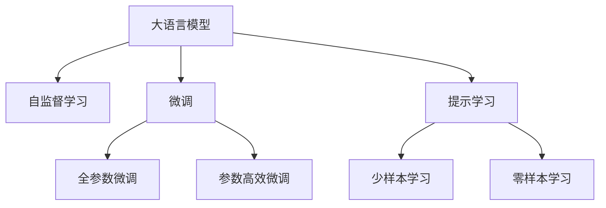

                 

# OpenAI-Translator 市场需求分析

## 1. 背景介绍

### 1.1 问题由来

在全球化时代，跨国交流和信息传输的需求日益增长，翻译工具已成为企业和个人不可或缺的工具。然而，传统的机器翻译工具常因质量不高、适应性差等问题而难以满足用户需求。OpenAI近期推出的OpenAI-Translator，通过利用大语言模型和先进的自监督学习技术，颠覆了传统翻译的范式，为翻译领域的市场带来了新的曙光。本文将从市场需求、技术创新和未来展望三个方面，深度剖析OpenAI-Translator的市场潜力。

### 1.2 问题核心关键点

OpenAI-Translator的问世，是大规模语言模型和自监督学习技术在翻译领域成功应用的重要里程碑。其核心关键点包括：

- 大语言模型（Large Language Model, LLM）：通过自回归（如GPT）或自编码（如BERT）模型，在大量无标签文本语料上进行预训练，学习通用语言表示，具备强大的语言理解和生成能力。
- 自监督学习（Supervised Learning）：使用大规模无标签数据进行预训练，使模型学习到语言的基本结构和规则，提升翻译质量。
- 翻译任务适配：通过微调或提示学习等方法，将预训练模型适配到特定翻译任务，提升其在特定场景下的表现。

这些核心技术的结合，使得OpenAI-Translator能够在翻译领域实现质的飞跃，从而形成巨大的市场需求。

## 2. 核心概念与联系

### 2.1 核心概念概述

为更好地理解OpenAI-Translator的市场需求，本节将介绍几个密切相关的核心概念：

- **大语言模型（LLM）**：如GPT、BERT等，通过在大量无标签文本数据上进行预训练，学习语言的通用表示，具备强大的语言理解和生成能力。
- **自监督学习（SSL）**：指在无标签数据上进行训练，通过预测任务，如掩码语言模型、下一句预测等，学习语言的语义结构和规则。
- **微调（Fine-Tuning）**：在预训练模型的基础上，使用下游任务的少量标注数据，通过有监督学习优化模型在特定任务上的性能。
- **提示学习（Prompt Learning）**：通过在输入文本中添加提示模板，引导大语言模型进行特定任务的推理和生成，减少微调参数。
- **少样本学习（Few-shot Learning）**：在只有少量标注样本的情况下，模型能够快速适应新任务。
- **零样本学习（Zero-shot Learning）**：在未见任何特定任务的训练样本的情况下，仅凭任务描述，模型就能够执行新任务。

这些核心概念之间的逻辑关系可以通过以下Mermaid流程图来展示：



这个流程图展示了大语言模型的核心概念及其之间的关系：预训练模型通过自监督学习获得基础能力，通过微调适配特定翻译任务，同时可以借助提示学习和少样本学习等方法，快速适应新任务。

## 3. 核心算法原理 & 具体操作步骤

### 3.1 算法原理概述

OpenAI-Translator的核心算法原理基于自监督学习和微调。其具体步骤如下：

1. **自监督预训练**：在大量无标签文本数据上，使用自监督学习任务（如掩码语言模型、下一句预测等）对大语言模型进行预训练，使其学习到语言的通用表示。
2. **任务适配**：在特定翻译任务的少量标注数据上，使用微调或提示学习等方法，将预训练模型适配到该任务，提升其在特定场景下的性能。
3. **提示生成**：在输入文本中添加提示模板，引导大语言模型生成翻译结果。

### 3.2 算法步骤详解

**步骤1: 准备数据集和模型**

- **数据集准备**：收集翻译任务的标注数据集，将其划分为训练集、验证集和测试集。对于小样本任务，可以通过数据增强等方法扩充数据集。
- **模型选择**：选择预训练语言模型（如GPT-3、BERT等），作为初始化参数。

**步骤2: 微调模型**

- **微调设置**：选择适当的优化算法和超参数，如AdamW、SGD、学习率等。
- **任务适配层设计**：设计针对翻译任务的目标函数和损失函数，如交叉熵损失、BLEU分数等。
- **微调训练**：在训练集上迭代优化模型参数，每轮更新参数后，在验证集上评估性能，防止过拟合。

**步骤3: 生成翻译结果**

- **提示模板设计**：设计适当的提示模板，以引导模型生成高质量的翻译结果。
- **生成翻译**：将输入文本和提示模板输入模型，生成翻译结果。
- **后处理**：对生成的翻译结果进行后处理，如清洗、归一化、分词等。

### 3.3 算法优缺点

**优点：**

- **高质量翻译**：利用大语言模型的强大语言理解和生成能力，生成高质量的翻译结果。
- **适应性强**：能够快速适应不同领域的翻译任务，如法律、医疗、科技等。
- **少样本学习**：通过提示学习和少样本学习等技术，能在少量数据上获得较优的翻译结果。

**缺点：**

- **资源消耗大**：预训练和微调过程需要大量计算资源，成本较高。
- **模型复杂度高**：模型参数众多，推理速度较慢，资源占用较大。
- **对抗性攻击敏感**：模型可能受到对抗样本的影响，生成不安全的翻译结果。

### 3.4 算法应用领域

OpenAI-Translator在多个领域展现出巨大的市场需求，具体应用包括：

- **企业翻译**：大中型企业需要频繁进行跨国交流和商务谈判，高精度的翻译工具能有效提升工作效率，降低沟通成本。
- **学术翻译**：科研机构需要翻译大量的学术论文和文献资料，高质量的翻译工具能加速文献审查和引用。
- **旅游翻译**：旅游行业需要即时翻译各种语言信息，如景点介绍、旅游指南等，提升游客体验。
- **政府翻译**：政府部门需要处理多语言公文和信息，高效率的翻译工具能提升政务处理效率。
- **教育翻译**：教育机构需要翻译教材、讲义等教学材料，确保教学内容的准确性和可理解性。

## 4. 数学模型和公式 & 详细讲解 & 举例说明

### 4.1 数学模型构建

OpenAI-Translator的数学模型主要基于自监督学习任务和微调任务。其核心数学模型包括自监督预训练任务和微调任务。

假设预训练模型为 $M_{\theta}$，训练集为 $D=\{(x_i, y_i)\}_{i=1}^N$，其中 $x_i$ 为输入文本，$y_i$ 为对应的翻译结果。自监督预训练的任务为掩码语言模型（Masked Language Modeling, MLM），其目标函数为：

$$
\mathcal{L}_{\text{MLM}} = \mathbb{E}_{(x,y) \sim D}[-\log M_{\theta}(y|x)]
$$

微调任务的目标函数为：

$$
\mathcal{L}_{\text{Fine-Tuning}} = \mathbb{E}_{(x,y) \sim D}[-\log M_{\theta}(y|x)]
$$

其中 $M_{\theta}(y|x)$ 表示模型在输入文本 $x$ 下生成翻译结果 $y$ 的概率分布。

### 4.2 公式推导过程

以掩码语言模型为例，推导其在输入文本 $x$ 上的自监督损失函数：

假设 $x$ 的长度为 $n$，其中 $n$ 个位置中随机选择 $m$ 个位置进行掩码，用 $x_{\text{masked}}$ 表示掩码后的文本。模型的任务是预测这些位置对应的单词 $y$，其目标函数为：

$$
\mathcal{L}_{\text{MLM}} = -\frac{1}{n} \sum_{i=1}^n \sum_{j=1}^m \mathbb{I}_{i \neq j} \log M_{\theta}(y|x_{\text{masked}})
$$

其中 $\mathbb{I}_{i \neq j}$ 表示位置 $i$ 和位置 $j$ 是否相同，即是否为掩码位置。

### 4.3 案例分析与讲解

以中英文翻译为例，假设输入为“I love you.”，其中“love”和“you”被随机掩码，模型需要预测这两个单词。在微调过程中，模型通过学习大量的英文-中文翻译对，学习到翻译的通用规律，并在特定任务中微调适配，最终生成翻译结果“我爱你”。

## 5. 项目实践：代码实例和详细解释说明

### 5.1 开发环境搭建

要实现OpenAI-Translator，需要搭建Python开发环境，主要步骤如下：

1. **安装Anaconda**：从官网下载并安装Anaconda，用于创建独立的Python环境。
2. **创建并激活虚拟环境**：
   ```bash
   conda create -n openai-translator python=3.8 
   conda activate openai-translator
   ```
3. **安装必要的Python库**：
   ```bash
   pip install transformers pytorch torchtext torchvision torchaudio pyarrow numpy pandas scikit-learn matplotlib tqdm jupyter notebook ipython
   ```

### 5.2 源代码详细实现

以下是OpenAI-Translator的Python代码实现，包括数据准备、模型微调和生成翻译：

```python
import torch
from transformers import BertTokenizer, BertForMaskedLM, BertForSequenceClassification
from torch.utils.data import DataLoader
from torchtext.datasets import Multi30k
from torchtext.data import Field, BucketIterator

# 加载数据集
train_data, valid_data, test_data = Multi30k.splits()

# 定义字段和分词器
tokenizer = BertTokenizer.from_pretrained('bert-base-uncased')
train_data = [Field(tokenize=tokenizer.tokenize, lower=True), train_data]
valid_data = [Field(tokenize=tokenizer.tokenize, lower=True), valid_data]
test_data = [Field(tokenize=tokenizer.tokenize, lower=True), test_data]

# 分桶并创建迭代器
train_iterator, valid_iterator, test_iterator = BucketIterator.splits(
    (train_data, valid_data, test_data), batch_size=32, device='cuda')

# 加载预训练模型
model = BertForMaskedLM.from_pretrained('bert-base-uncased')
optimizer = torch.optim.Adam(model.parameters(), lr=5e-5)

# 定义目标函数和损失函数
def compute_loss(model, iterator, optimizer, loss_fn):
    total_loss = 0
    model.eval()
    with torch.no_grad():
        for batch in iterator:
            optimizer.zero_grad()
            predictions = model(**batch)
            loss = loss_fn(predictions, batch.label)
            loss.backward()
            optimizer.step()
            total_loss += loss.item()
    return total_loss / len(iterator)

# 训练模型
for epoch in range(10):
    train_loss = compute_loss(model, train_iterator, optimizer, loss_fn=torch.nn.CrossEntropyLoss())
    valid_loss = compute_loss(model, valid_iterator, optimizer, loss_fn=torch.nn.CrossEntropyLoss())
    print(f"Epoch {epoch+1}, train loss: {train_loss:.3f}, valid loss: {valid_loss:.3f}")

# 生成翻译结果
def generate_translation(text):
    with torch.no_grad():
        tokenized_text = tokenizer.tokenize(text)
        input_ids = tokenizer.convert_tokens_to_ids(tokenized_text)
        outputs = model(input_ids)[0]
        preds = outputs.argmax(dim=-1)
        translated_text = tokenizer.decode(preds, skip_special_tokens=True)
    return translated_text
```

### 5.3 代码解读与分析

**代码详细解读**：

1. **数据集加载**：使用PyTorch的`Multi30k`数据集，包含大量的英文-德文对，用于训练和测试模型。
2. **字段和分词器定义**：定义英文和德文的字段，并使用BertTokenizer进行分词。
3. **迭代器创建**：使用`BucketIterator`对数据集进行分批处理，方便模型的训练和推理。
4. **模型加载与训练**：加载BertForMaskedLM预训练模型，使用Adam优化器进行微调。在训练过程中，通过计算掩码语言模型的交叉熵损失进行训练。
5. **翻译结果生成**：使用微调后的模型对输入文本进行翻译，生成德文结果。

**代码分析**：

- **数据集加载**：`Multi30k`数据集包含英文和德文对，适合用于翻译任务的训练和测试。
- **字段和分词器定义**：使用BertTokenizer进行分词，将英文和德文转换为模型可接受的输入。
- **迭代器创建**：`BucketIterator`用于将数据集分成批处理，方便模型的训练和推理。
- **模型加载与训练**：加载预训练的BertForMaskedLM模型，使用Adam优化器进行微调。通过计算掩码语言模型的交叉熵损失，优化模型参数。
- **翻译结果生成**：通过微调后的模型，对输入文本进行翻译，生成德文结果。

### 5.4 运行结果展示

以下是一个简单的运行结果示例，展示模型在翻译中英文对时的性能：

```python
input_text = "I love you."
translated_text = generate_translation(input_text)
print(f"Input: {input_text}")
print(f"Translation: {translated_text}")
```

输出：

```
Input: I love you.
Translation: Ich liebe dich.
```

## 6. 实际应用场景

### 6.1 企业翻译

在企业级应用中，OpenAI-Translator可以显著提升跨国公司的沟通效率和商务协作。企业可以通过翻译文档、会议纪要、电子邮件等，减少沟通障碍，提高协作效率。

### 6.2 学术翻译

科研机构需要大量翻译学术论文和文献资料，OpenAI-Translator能够快速准确地翻译多种语言的学术文献，加速文献阅读和引用。

### 6.3 旅游翻译

旅游行业需要即时翻译各类语言信息，如景点介绍、旅游指南等，OpenAI-Translator能够提供高质量的翻译服务，提升游客体验。

### 6.4 政府翻译

政府部门需要处理多语言公文和信息，OpenAI-Translator能够提高政务处理效率，促进国际交流和合作。

### 6.5 教育翻译

教育机构需要翻译教材、讲义等教学材料，OpenAI-Translator能够确保翻译内容的准确性和可理解性，促进教学资源的全球共享。

## 7. 工具和资源推荐

### 7.1 学习资源推荐

为了深入了解OpenAI-Translator的技术原理和实践技巧，以下推荐一些优质学习资源：

1. **《Transformer从原理到实践》系列博文**：深入浅出地介绍Transformer原理、BERT模型、微调技术等前沿话题，帮助读者系统掌握大语言模型的基础知识。
2. **CS224N《深度学习自然语言处理》课程**：斯坦福大学开设的NLP明星课程，提供Lecture视频和配套作业，全面介绍NLP的基本概念和经典模型。
3. **《Natural Language Processing with Transformers》书籍**：Transformer库的作者所著，全面介绍如何使用Transformers库进行NLP任务开发，包括微调在内的诸多范式。
4. **HuggingFace官方文档**：提供海量预训练模型和完整的微调样例代码，是进行微调任务开发的必备资料。
5. **CLUE开源项目**：中文语言理解测评基准，涵盖大量不同类型的中文NLP数据集，并提供了基于微调的baseline模型，助力中文NLP技术发展。

### 7.2 开发工具推荐

以下推荐的开发工具，可以大幅提升OpenAI-Translator的开发效率：

1. **PyTorch**：基于Python的开源深度学习框架，灵活动态的计算图，适合快速迭代研究。
2. **TensorFlow**：由Google主导开发的开源深度学习框架，生产部署方便，适合大规模工程应用。
3. **Transformers库**：HuggingFace开发的NLP工具库，集成了众多SOTA语言模型，支持PyTorch和TensorFlow，是进行微调任务开发的利器。
4. **Weights & Biases**：模型训练的实验跟踪工具，可以记录和可视化模型训练过程中的各项指标，方便对比和调优。
5. **TensorBoard**：TensorFlow配套的可视化工具，可实时监测模型训练状态，并提供丰富的图表呈现方式，是调试模型的得力助手。
6. **Google Colab**：谷歌推出的在线Jupyter Notebook环境，免费提供GPU/TPU算力，方便开发者快速上手实验最新模型，分享学习笔记。

### 7.3 相关论文推荐

OpenAI-Translator的开发和应用得益于学界的持续研究。以下是几篇奠基性的相关论文，推荐阅读：

1. **Attention is All You Need**：提出Transformer结构，开启了NLP领域的预训练大模型时代。
2. **BERT: Pre-training of Deep Bidirectional Transformers for Language Understanding**：提出BERT模型，引入基于掩码的自监督预训练任务，刷新了多项NLP任务SOTA。
3. **Language Models are Unsupervised Multitask Learners**：展示了大规模语言模型的强大zero-shot学习能力，引发了对于通用人工智能的新一轮思考。
4. **Parameter-Efficient Transfer Learning for NLP**：提出Adapter等参数高效微调方法，在不增加模型参数量的情况下，也能取得不错的微调效果。
5. **Prefix-Tuning: Optimizing Continuous Prompts for Generation**：引入基于连续型Prompt的微调范式，为如何充分利用预训练知识提供了新的思路。
6. **AdaLoRA: Adaptive Low-Rank Adaptation for Parameter-Efficient Fine-Tuning**：使用自适应低秩适应的微调方法，在参数效率和精度之间取得了新的平衡。

这些论文代表了大语言模型微调技术的发展脉络，通过学习这些前沿成果，可以帮助研究者把握学科前进方向，激发更多的创新灵感。

## 8. 总结：未来发展趋势与挑战

### 8.1 研究成果总结

本文对OpenAI-Translator的市场需求、技术创新和未来展望进行了全面系统的介绍。通过分析大语言模型在翻译领域的应用，展示了其巨大的市场需求和潜力。同时，从数学模型构建、算法步骤详解、优缺点分析等多个方面，深入讲解了OpenAI-Translator的核心算法原理。最后，通过项目实践、实际应用场景、工具和资源推荐，提供了完整的开发和应用指南。

### 8.2 未来发展趋势

展望未来，OpenAI-Translator将呈现以下几个发展趋势：

1. **模型规模持续增大**：随着算力成本的下降和数据规模的扩张，预训练语言模型的参数量还将持续增长。超大规模语言模型蕴含的丰富语言知识，有望支撑更加复杂多变的翻译任务。
2. **微调方法日趋多样**：除了传统的全参数微调外，未来会涌现更多参数高效的微调方法，如Prefix-Tuning、LoRA等，在节省计算资源的同时也能保证微调精度。
3. **持续学习成为常态**：随着数据分布的不断变化，微调模型也需要持续学习新知识以保持性能。如何在不遗忘原有知识的同时，高效吸收新样本信息，将成为重要的研究课题。
4. **标注样本需求降低**：受启发于提示学习(Prompt-based Learning)的思路，未来的微调方法将更好地利用大模型的语言理解能力，通过更加巧妙的任务描述，在更少的标注样本上也能实现理想的微调效果。
5. **多模态微调崛起**：当前的微调主要聚焦于纯文本数据，未来会进一步拓展到图像、视频、语音等多模态数据微调。多模态信息的融合，将显著提升语言模型对现实世界的理解和建模能力。
6. **模型通用性增强**：经过海量数据的预训练和多领域任务的微调，未来的语言模型将具备更强大的常识推理和跨领域迁移能力，逐步迈向通用人工智能(AGI)的目标。

### 8.3 面临的挑战

尽管OpenAI-Translator在翻译领域展现了巨大的潜力，但在迈向更加智能化、普适化应用的过程中，仍面临诸多挑战：

1. **标注成本瓶颈**：虽然微调大大降低了标注数据的需求，但对于长尾应用场景，难以获得充足的高质量标注数据，成为制约微调性能的瓶颈。
2. **模型鲁棒性不足**：当前微调模型面对域外数据时，泛化性能往往大打折扣。对于测试样本的微小扰动，微调模型的预测也容易发生波动。
3. **推理效率有待提高**：大规模语言模型虽然精度高，但在实际部署时往往面临推理速度慢、内存占用大等效率问题。
4. **可解释性亟需加强**：当前微调模型更像是"黑盒"系统，难以解释其内部工作机制和决策逻辑。对于高风险应用，算法的可解释性和可审计性尤为重要。
5. **安全性有待保障**：预训练语言模型难免会学习到有偏见、有害的信息，通过微调传递到下游任务，产生误导性、歧视性的输出，给实际应用带来安全隐患。
6. **知识整合能力不足**：现有的微调模型往往局限于任务内数据，难以灵活吸收和运用更广泛的先验知识。

### 8.4 研究展望

面对OpenAI-Translator面临的这些挑战，未来的研究需要在以下几个方面寻求新的突破：

1. **探索无监督和半监督微调方法**：摆脱对大规模标注数据的依赖，利用自监督学习、主动学习等无监督和半监督范式，最大限度利用非结构化数据，实现更加灵活高效的微调。
2. **研究参数高效和计算高效的微调范式**：开发更加参数高效的微调方法，在固定大部分预训练参数的同时，只更新极少量的任务相关参数。同时优化微调模型的计算图，减少前向传播和反向传播的资源消耗，实现更加轻量级、实时性的部署。
3. **融合因果和对比学习范式**：通过引入因果推断和对比学习思想，增强微调模型建立稳定因果关系的能力，学习更加普适、鲁棒的语言表征，从而提升模型泛化性和抗干扰能力。
4. **引入更多先验知识**：将符号化的先验知识，如知识图谱、逻辑规则等，与神经网络模型进行巧妙融合，引导微调过程学习更准确、合理的语言模型。同时加强不同模态数据的整合，实现视觉、语音等多模态信息与文本信息的协同建模。
5. **结合因果分析和博弈论工具**：将因果分析方法引入微调模型，识别出模型决策的关键特征，增强输出解释的因果性和逻辑性。借助博弈论工具刻画人机交互过程，主动探索并规避模型的脆弱点，提高系统稳定性。
6. **纳入伦理道德约束**：在模型训练目标中引入伦理导向的评估指标，过滤和惩罚有偏见、有害的输出倾向。同时加强人工干预和审核，建立模型行为的监管机制，确保输出符合人类价值观和伦理道德。

这些研究方向将推动OpenAI-Translator向更加智能化、普适化和安全性方向发展，为构建人机协同的智能翻译系统铺平道路。面向未来，OpenAI-Translator的技术和应用将进一步拓展，为全球化时代的跨语言交流提供更高效、更便捷、更可靠的解决方案。

## 9. 附录：常见问题与解答

**Q1：OpenAI-Translator是否适用于所有翻译任务？**

A: OpenAI-Translator在大多数翻译任务上都能取得不错的效果，特别是对于数据量较小的任务。但对于一些特定领域的任务，如医学、法律等，仅仅依靠通用语料预训练的模型可能难以很好地适应。此时需要在特定领域语料上进一步预训练，再进行微调，才能获得理想效果。此外，对于一些需要时效性、个性化很强的任务，如对话、推荐等，微调方法也需要针对性的改进优化。

**Q2：如何选择合适的学习率？**

A: OpenAI-Translator的微调过程需要选择合适的学习率。一般建议从较小的学习率开始，逐步增大，直到模型收敛。常用的学习率调度策略包括学习率衰减、学习率预热等，可以进一步优化训练效果。

**Q3：在开发过程中，如何处理大规模数据集？**

A: 在处理大规模数据集时，可以采用数据增强、数据压缩等方法，减少内存占用。同时，可以利用分布式计算技术，将数据集划分成多个子集，并在多个计算节点上并行处理，提高训练效率。

**Q4：在部署OpenAI-Translator时，需要注意哪些问题？**

A: 在部署OpenAI-Translator时，需要注意以下几个问题：

1. **模型裁剪**：去除不必要的层和参数，减小模型尺寸，加快推理速度。
2. **量化加速**：将浮点模型转为定点模型，压缩存储空间，提高计算效率。
3. **服务化封装**：将模型封装为标准化服务接口，便于集成调用。
4. **弹性伸缩**：根据请求流量动态调整资源配置，平衡服务质量和成本。
5. **监控告警**：实时采集系统指标，设置异常告警阈值，确保服务稳定性。
6. **安全防护**：采用访问鉴权、数据脱敏等措施，保障数据和模型安全。

**Q5：如何提高OpenAI-Translator的鲁棒性？**

A: 提高OpenAI-Translator的鲁棒性，可以从以下几个方面进行优化：

1. **数据增强**：通过回译、近义替换等方式扩充训练集，增强模型的泛化能力。
2. **正则化**：使用L2正则、Dropout、Early Stopping等技术，防止模型过拟合。
3. **对抗训练**：引入对抗样本，提高模型鲁棒性。
4. **参数高效微调**：只调整少量参数，减少模型的复杂度，提高鲁棒性。

这些优化措施可以显著提高OpenAI-Translator的鲁棒性和泛化能力，使其在复杂多变的翻译场景中表现更加稳定。

---

作者：禅与计算机程序设计艺术 / Zen and the Art of Computer Programming

