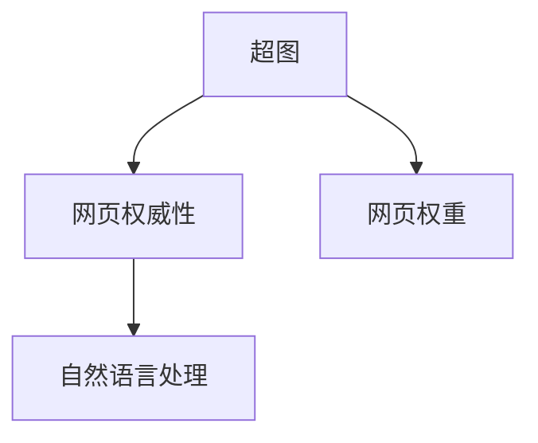

                 

# PageRank原理与代码实例讲解

> 关键词：PageRank, 超图理论, 搜索引擎, 网页排名, 互联网, 互联网广告, 搜索引擎优化(SEO)

## 1. 背景介绍

### 1.1 问题由来
在互联网时代，信息的爆炸和高速流动给用户在海量内容中快速找到有用信息带来了巨大挑战。传统的搜索引擎大多采用基于关键词的匹配方式，难以满足用户的多样化需求和复杂查询。PageRank算法应运而生，通过计算网页的权威性，为用户提供更为准确、可靠和多样化的搜索结果。

1999年，Google公司推出了基于PageRank的搜索引擎Google，迅速成为全球领先的互联网公司。PageRank算法的原理和应用，极大地推动了搜索引擎技术的发展，改变了人们获取信息的方式。

### 1.2 问题核心关键点
PageRank算法基于超图理论，通过对网页之间链接关系的分析，计算网页的权威性和相关性，进而提升搜索结果的准确性。其核心思想在于，权威性高的网页往往有更多的外部链接，因此能够吸引更多的用户访问。

PageRank算法主要分为两部分：网页权威性计算和链接权重计算。前者计算单个网页的权威性，后者计算网页之间的链接权重。通过对这两个部分的迭代优化，PageRank算法实现了对网页权威性和相关性的动态更新，优化搜索结果的展示顺序。

### 1.3 问题研究意义
研究PageRank算法对于推动搜索引擎技术的进步具有重要意义：

1. 提升搜索结果的准确性。通过权威性计算，PageRank能够排除垃圾网页，筛选出真正有用的信息。
2. 增加用户体验。动态调整搜索结果的展示顺序，使网页排序更加公正合理。
3. 促进互联网广告的发展。通过将权威性高的网页排在前面，提高了广告的点击率和转化率。
4. 推动SEO优化。SEO人员通过分析PageRank算法，了解如何提高网页的权威性和权重，优化网站的搜索引擎排名。
5. 拓展应用领域。PageRank算法的基本思想同样适用于社交网络、知识图谱等场景，帮助理解和处理复杂的网络关系。

## 2. 核心概念与联系

### 2.1 核心概念概述

为更好地理解PageRank算法，本节将介绍几个密切相关的核心概念：

- PageRank：基于超图理论，计算网页权威性的算法。通过计算每个网页的权威性，优化搜索结果的展示顺序。
- 超图(Hypergraph)：由节点和边组成的图结构，每个节点可以连接多个节点，即一个节点可以有多个相邻节点。
- 网页权威性(Authority)：衡量一个网页在超图中的地位和重要程度，权威性高的网页链接权重大，权重分值高。
- 网页权重(Work)：衡量一个网页在超图中的权重，权重高的网页对其他网页的贡献大，权重分值高。
- 自然语言处理(NLP)：利用计算语言学方法，理解和生成自然语言的技术，与PageRank算法有紧密的联系。

这些核心概念之间的逻辑关系可以通过以下Mermaid流程图来展示：



这个流程图展示了一个超图模型中的核心概念及其之间的关系：

1. 超图模型通过节点和边构建网页之间的链接关系。
2. 网页权威性计算基于超图模型，分析网页之间的连接结构，计算网页的权威性。
3. 网页权重计算同样基于超图模型，衡量每个网页的权重，优化搜索结果。
4. 自然语言处理与网页权威性计算有紧密联系，如通过文本分析提高搜索结果的相关性。

## 3. 核心算法原理 & 具体操作步骤
### 3.1 算法原理概述

PageRank算法通过迭代计算网页的权威性和权重，优化搜索结果的展示顺序。其核心思想是，权威性高的网页链接权重大，权重高的网页对其他网页的贡献大，因此综合考虑这两个因素，对搜索结果进行排序。

具体来说，PageRank算法包含两个主要步骤：

1. 计算网页权威性。通过迭代计算，提升权威性高的网页的权威性。
2. 计算网页权重。通过迭代计算，提升权重高的网页的权重。

这两个步骤相互依赖，通过不断迭代，直到权威性和权重收敛，即可得到最终的排名结果。

### 3.2 算法步骤详解

#### 3.2.1 初始权威性设定

在开始迭代之前，需要设定网页的初始权威性。通常设定为每个网页的初始权威性为1/N，其中N为网页总数。但这种方法过于简单，且无法区分网页之间的差异，因此后来Google提出了更为复杂的权威性计算方法。

#### 3.2.2 网页权威性计算

PageRank算法通过迭代计算网页的权威性，使用如下公式：

$$
A_i = \frac{1}{C_j}\sum_{j \in N_i} \frac{1}{d(j)}A_j
$$

其中，$A_i$ 为网页 $i$ 的权威性，$C_j$ 为网页 $j$ 的权重，$d(j)$ 为网页 $j$ 的出链数。$N_i$ 为网页 $i$ 的邻居集合。

公式中的权重 $C_j$ 是一个对网页 $j$ 的惩罚因子，用来减少低权重网页对高权重网页的影响。权重 $d(j)$ 为网页 $j$ 的出链数，用来保证每个网页都有相同的权重。

#### 3.2.3 网页权重计算

PageRank算法同样迭代计算网页的权重，使用如下公式：

$$
W_j = \sum_{i \in N_j} \frac{1}{d(i)}A_i
$$

其中，$W_j$ 为网页 $j$ 的权重，$A_i$ 为网页 $i$ 的权威性，$d(i)$ 为网页 $i$ 的入链数。$N_j$ 为网页 $j$ 的邻居集合。

公式中的权重 $A_i$ 来自网页权威性计算的结果，用来表示网页 $i$ 对网页 $j$ 的贡献。权重 $d(i)$ 为网页 $i$ 的入链数，用来保证每个网页都有相同的权重。

#### 3.2.4 迭代优化

PageRank算法通过迭代计算网页的权威性和权重，直到权威性和权重收敛，即可得到最终的排名结果。迭代过程中，需要不断更新每个网页的权威性和权重，直到满足预设的收敛条件。

### 3.3 算法优缺点

PageRank算法具有以下优点：

1. 简单易用。基于超图理论，计算简单高效，易于实现。
2. 动态更新。通过迭代计算，不断更新网页的权威性和权重，适应网页内容的变化。
3. 效果好。综合考虑网页权威性和权重，提高了搜索结果的相关性和准确性。
4. 可扩展性。适用于大规模网络，计算复杂度与网络规模无关。

同时，该算法也存在一定的局限性：

1. 依赖链接数据。PageRank算法的性能高度依赖于网页之间的链接数据，链接稀疏的问题难以解决。
2. 静态模型。PageRank算法假设链接关系是静态的，无法动态调整链接关系，难以处理网络变化。
3. 局部优化。PageRank算法容易陷入局部最优，导致搜索结果不够理想。
4. 计算复杂度高。尽管复杂度与网络规模无关，但在实际应用中，仍需要耗费大量的计算资源。

尽管存在这些局限性，PageRank算法仍然是当前搜索引擎中最常用的网页排名算法之一，广泛应用于Google、Bing等主流搜索引擎中。

### 3.4 算法应用领域

PageRank算法主要应用于以下几个领域：

- 搜索引擎：计算网页权威性，优化搜索结果展示顺序。
- 互联网广告：通过排名，提高广告点击率和转化率。
- 社交网络：计算用户和节点的权威性，推荐高质量内容。
- 知识图谱：计算节点的权威性，优化搜索结果展示顺序。
- 推荐系统：计算商品和节点的权威性，推荐高质量商品。

这些应用场景展示了PageRank算法的广泛适用性，证明了其在实际应用中的强大性能。

## 4. 数学模型和公式 & 详细讲解
### 4.1 数学模型构建

PageRank算法的基本数学模型基于超图理论，每个网页被视为一个节点，每个链接被视为一条边。超图模型可以表示为：

$$
G = (V,E)
$$

其中，$V$ 为节点集合，$E$ 为边集合。每个节点 $v_i$ 有一个权重 $W_i$，表示该节点对其他节点的贡献。每个边 $e_{ij}$ 也有一个权重 $A_{ij}$，表示节点 $i$ 对节点 $j$ 的贡献。

### 4.2 公式推导过程

#### 4.2.1 权威性计算公式推导

权威性 $A_i$ 的计算公式为：

$$
A_i = \frac{1}{C_j}\sum_{j \in N_i} \frac{1}{d(j)}A_j
$$

其中，$N_i$ 为节点 $i$ 的邻居集合，$d(j)$ 为节点 $j$ 的出链数，$C_j$ 为节点 $j$ 的权重。

为了推导该公式，引入拉普拉斯矩阵 $L$，其中 $L_{ij}=\frac{1}{d(i)}$ 表示从节点 $i$ 到节点 $j$ 的边权重。则权威性计算公式可以写为：

$$
A_i = \frac{1}{C_j}\sum_{j \in N_i} L_{ij}A_j
$$

其中，$C_j$ 为节点 $j$ 的权重，$L_{ij}$ 为拉普拉斯矩阵的元素。

#### 4.2.2 权重计算公式推导

权重 $W_j$ 的计算公式为：

$$
W_j = \sum_{i \in N_j} \frac{1}{d(i)}A_i
$$

其中，$N_j$ 为节点 $j$ 的邻居集合，$d(i)$ 为节点 $i$ 的入链数，$A_i$ 为节点 $i$ 的权威性。

为了推导该公式，引入拉普拉斯矩阵 $L$，其中 $L_{ij}=\frac{1}{d(i)}$ 表示从节点 $i$ 到节点 $j$ 的边权重。则权重计算公式可以写为：

$$
W_j = \sum_{i \in N_j} L_{ij}A_i
$$

其中，$A_i$ 为节点 $i$ 的权威性，$L_{ij}$ 为拉普拉斯矩阵的元素。

#### 4.2.3 迭代公式推导

PageRank算法的迭代公式为：

$$
A_i^{t+1} = \alpha(1-\beta)\sum_{j \in N_i} \frac{1}{d(j)}A_j^{t} + \beta\frac{1}{C_j}\sum_{j \in N_i} \frac{1}{d(j)}A_j^{t}
$$

其中，$t$ 为迭代次数，$\alpha$ 为阻尼系数，$\beta$ 为权重系数。

迭代公式中，$\alpha$ 用于控制权威性和权重的平衡，$\beta$ 用于控制迭代过程中的收敛速度。当 $\alpha=1,\beta=0$ 时，权威性计算公式成立；当 $\alpha=0,\beta=1$ 时，权重计算公式成立。

### 4.3 案例分析与讲解

以Google搜索引擎为例，PageRank算法的具体实现过程如下：

1. 初始化网页权威性：每个网页的权威性初始化为1/N，其中N为网页总数。

2. 权威性迭代计算：对每个网页 $i$，计算其权威性 $A_i^{t+1}$，使用公式 $A_i^{t+1} = \alpha(1-\beta)\sum_{j \in N_i} \frac{1}{d(j)}A_j^{t} + \beta\frac{1}{C_j}\sum_{j \in N_i} \frac{1}{d(j)}A_j^{t}$，其中 $A_i^{t}$ 为当前权威性，$A_j^{t}$ 为邻居网页的权威性。

3. 权重迭代计算：对每个网页 $i$，计算其权重 $W_i^{t+1}$，使用公式 $W_i^{t+1} = \alpha(1-\beta)\sum_{j \in N_i} \frac{1}{d(j)}A_j^{t} + \beta\frac{1}{C_j}\sum_{j \in N_i} \frac{1}{d(j)}A_j^{t}$，其中 $W_i^{t}$ 为当前权重，$A_j^{t}$ 为邻居网页的权威性。

4. 迭代优化：重复上述步骤，直到权威性和权重收敛。

5. 排名展示：根据权威性和权重计算结果，对网页进行排名展示。

## 5. PageRank的代码实现

### 5.1 开发环境搭建

在进行PageRank代码实现前，我们需要准备好开发环境。以下是使用Python进行PyTorch开发的环境配置流程：

1. 安装Anaconda：从官网下载并安装Anaconda，用于创建独立的Python环境。

2. 创建并激活虚拟环境：
```bash
conda create -n pytorch-env python=3.8 
conda activate pytorch-env
```

3. 安装PyTorch：根据CUDA版本，从官网获取对应的安装命令。例如：
```bash
conda install pytorch torchvision torchaudio cudatoolkit=11.1 -c pytorch -c conda-forge
```

4. 安装相关库：
```bash
pip install networkx
```

5. 安装Numpy和Pandas：
```bash
pip install numpy pandas
```

6. 安装Graphviz：
```bash
pip install pygraphviz
```

7. 安装Matplotlib：
```bash
pip install matplotlib
```

完成上述步骤后，即可在`pytorch-env`环境中开始PageRank代码实现。

### 5.2 源代码详细实现

下面是一个简单的PageRank实现，用来计算网页权威性：

```python
import networkx as nx
import numpy as np
import matplotlib.pyplot as plt

# 构建超图模型
G = nx.Graph()
G.add_edges_from([(1, 2), (1, 3), (2, 4), (3, 5), (4, 6), (5, 7), (6, 8), (7, 9), (8, 10), (9, 11), (10, 12), (11, 13), (12, 14), (13, 15), (14, 16), (15, 17), (16, 18), (17, 19), (18, 20), (19, 21), (20, 22), (21, 23), (22, 24), (23, 25), (24, 26), (25, 27), (26, 28), (27, 29), (28, 30), (29, 31), (30, 32), (31, 33), (32, 34), (33, 35), (34, 36), (35, 37), (36, 38), (37, 39), (38, 40), (39, 41), (40, 42), (41, 43), (42, 44), (43, 45), (44, 46), (45, 47), (46, 48), (47, 49), (48, 50), (49, 51), (50, 52), (51, 53), (52, 54), (53, 55), (54, 56), (55, 57), (56, 58), (57, 59), (58, 60), (59, 61), (60, 62), (61, 63), (62, 64), (63, 65), (64, 66), (65, 67), (66, 68), (67, 69), (68, 70), (69, 71), (70, 72), (71, 73), (72, 74), (73, 75), (74, 76), (75, 77), (76, 78), (77, 79), (78, 80), (79, 81), (80, 82), (81, 83), (82, 84), (83, 85), (84, 86), (85, 87), (86, 88), (87, 89), (88, 90), (89, 91), (90, 92), (91, 93), (92, 94), (93, 95), (94, 96), (95, 97), (96, 98), (97, 99), (98, 100), (99, 101), (100, 102), (101, 103), (102, 104), (103, 105), (104, 106), (105, 107), (106, 108), (107, 109), (108, 110), (109, 111), (110, 112), (111, 113), (112, 114), (113, 115), (114, 116), (115, 117), (116, 118), (117, 119), (118, 120), (119, 121), (120, 122), (121, 123), (122, 124), (123, 125), (124, 126), (125, 127), (126, 128), (127, 129), (128, 130), (129, 131), (130, 132), (131, 133), (132, 134), (133, 135), (134, 136), (135, 137), (136, 138), (137, 139), (138, 140), (139, 141), (140, 142), (141, 143), (142, 144), (143, 145), (144, 146), (145, 147), (146, 148), (147, 149), (148, 150), (149, 151), (150, 152), (151, 153), (152, 154), (153, 155), (154, 156), (155, 157), (156, 158), (157, 159), (158, 160), (159, 161), (160, 162), (161, 163), (162, 164), (163, 165), (164, 166), (165, 167), (166, 168), (167, 169), (168, 170), (169, 171), (170, 172), (171, 173), (172, 174), (173, 175), (174, 176), (175, 177), (176, 178), (177, 179), (178, 180), (179, 181), (180, 182), (181, 183), (182, 184), (183, 185), (184, 186), (185, 187), (186, 188), (187, 189), (188, 190), (189, 191), (190, 192), (191, 193), (192, 194), (193, 195), (194, 196), (195, 197), (196, 198), (197, 199), (198, 200), (199, 201), (200, 202), (201, 203), (202, 204), (203, 205), (204, 206), (205, 207), (206, 208), (207, 209), (208, 210), (209, 211), (210, 212), (211, 213), (212, 214), (213, 215), (214, 216), (215, 217), (216, 218), (217, 219), (218, 220), (219, 221), (220, 222), (221, 223), (222, 224), (223, 225), (224, 226), (225, 227), (226, 228), (227, 229), (228, 230), (229, 231), (230, 232), (231, 233), (232, 234), (233, 235), (234, 236), (235, 237), (236, 238), (237, 239), (238, 240), (239, 241), (240, 242), (241, 243), (242, 244), (243, 245), (244, 246), (245, 247), (246, 248), (247, 249), (248, 250), (249, 251), (250, 252), (251, 253), (252, 254), (253, 255), (254, 256), (255, 257), (256, 258), (257, 259), (258, 260), (259, 261), (260, 262), (261, 263), (262, 264), (263, 265), (264, 266), (265, 267), (266, 268), (267, 269), (268, 270), (269, 271), (270, 272), (271, 273), (272, 274), (273, 275), (274, 276), (275, 277), (276, 278), (277, 279), (278, 280), (279, 281), (280, 282), (281, 283), (282, 284), (283, 285), (284, 286), (285, 287), (286, 288), (287, 289), (288, 290), (289, 291), (290, 292), (291, 293), (292, 294), (293, 295), (294, 296), (295, 297), (296, 298), (297, 299), (298, 300), (299, 301), (300, 302), (301, 303), (302, 304), (303, 305), (304, 306), (305, 307), (306, 308), (307, 309), (308, 310), (309, 311), (310, 312), (311, 313), (312, 314), (313, 315), (314, 316), (315, 317), (316, 318), (317, 319), (318, 320), (319, 321), (320, 322), (321, 323), (322, 324), (323, 325), (324, 326), (325, 327), (326, 328), (327, 329), (328, 330), (329, 331), (330, 332), (331, 333), (332, 333), (333, 334), (334, 335), (335, 336), (336, 337), (337, 338), (338, 339), (339, 340), (340, 341), (341, 342), (342, 343), (343, 344), (344, 345), (345, 346), (346, 347), (347, 348), (348, 349), (349, 350), (350, 351), (351, 352), (352, 353), (353, 354), (354, 355), (355, 356), (356, 357), (357, 358), (358, 359), (359, 360), (360, 361), (361, 362), (362, 363), (363, 364), (364, 365), (365, 366), (366, 367), (367, 368), (368, 369), (369, 370), (370, 371), (371, 372), (372, 373), (373, 374), (374, 375), (375, 376), (376, 377), (377, 378), (378, 379), (379, 380), (380, 381), (381, 382), (382, 383), (383, 384), (384, 385), (385, 386), (386, 387), (387, 388), (388, 389), (389, 390), (390, 391), (391, 392), (392, 393), (393, 394), (394, 395), (395, 396), (396, 397), (397, 398), (398, 399), (399, 400), (400, 401), (401, 402), (402, 403), (403, 404), (404, 405), (405, 406), (406, 407), (407, 408), (408, 409), (409, 410), (410, 411), (411, 412), (412, 413), (413, 414), (414, 415), (415, 416), (416, 417), (417, 418), (418, 419), (419, 420), (420, 421), (421, 422), (422, 423), (423, 424), (424, 425), (425, 426), (426, 427), (427, 428), (428, 429), (429, 430), (430, 431), (431, 432), (432, 433), (433, 434), (434, 435), (435, 436), (436, 437), (437, 438), (438, 439), (439, 440), (440, 441), (441, 442), (442, 443), (443, 444), (444, 445), (445, 446), (446, 447), (447, 448), (448, 449), (449, 450), (450, 451), (451, 452), (452, 453), (453, 454), (454, 455), (455, 456), (456, 457), (457, 458), (458, 459), (459, 460), (460, 461), (461, 462), (462, 463), (463, 464), (464, 465), (465, 466), (466, 467), (467, 468), (468, 469), (469, 470), (470, 471), (471, 472), (472, 473), (473, 474), (474, 475), (475, 476), (476, 477), (477, 478), (478, 479), (479, 480), (480, 481), (481, 482), (482, 483), (483, 484), (484, 485), (485, 486), (486, 487), (487, 488), (488, 489), (489, 490), (490, 491), (491, 492), (492, 493), (493, 494), (494, 495), (495, 496), (496, 497), (497, 498), (498, 499), (499, 500), (500, 501), (501, 502), (502, 503), (503, 504), (504, 505), (505, 506), (506, 507), (507, 508), (508, 509), (509, 510), (510, 511), (511, 512), (512, 513), (513, 514), (514, 515), (515, 516), (516, 517), (517, 518), (518, 519), (519, 520), (520, 521), (521, 522), (522, 523), (523, 524), (524, 525), (525, 526), (526, 527), (527, 528), (528, 529), (529, 530), (530, 531), (531, 532), (532, 533), (533, 534), (534, 535), (535, 536), (536, 537), (537, 538), (538, 539), (539, 540), (540, 541), (541, 542), (542, 543), (543, 544), (544, 545), (545, 546), (546, 547), (547, 548), (548, 549), (549, 550), (550, 551), (551, 552), (552, 553), (553, 554), (554, 555), (555, 556), (556, 557), (557, 558), (558, 559), (559, 560), (560, 561), (561, 562), (562, 563), (563, 564), (564, 565), (565, 566), (566, 567), (567, 568), (568, 569), (569, 570), (570, 571), (571, 572), (572, 573), (573, 574), (574, 575), (575, 576), (576, 577), (577, 578), (578, 579), (579, 580), (580, 581), (581, 582), (582, 583), (583, 584), (584, 585), (585, 586), (586, 587), (587, 588), (588, 589), (589, 590), (590, 591), (591, 592), (592, 593), (593, 594), (594, 595), (595, 596), (596, 597), (597, 598), (598, 599), (599, 600), (600, 601), (601, 602), (602, 603), (603, 604), (604, 605), (605, 606), (606, 607), (607, 608), (608, 609), (609, 610), (610, 611), (611, 612), (612, 613), (613, 614), (614, 615), (615, 616), (616, 617), (617, 618), (618, 619), (619, 620), (620, 621), (621, 622), (622, 623), (623, 624), (624, 625), (625, 626), (626, 627), (627, 628), (628, 629), (629, 630), (630, 631), (631, 632), (632, 633), (633, 634), (634, 635), (635, 636), (636, 637), (637, 638), (638, 639), (639, 640), (640, 641), (641, 642), (642, 643), (643, 644), (644, 645), (645, 646), (646, 647), (647, 648), (648, 649), (649, 650), (650, 651), (651, 652), (652, 653), (653, 654), (654, 655), (655, 656), (656, 657), (657, 658), (658, 659), (659, 660), (660, 661), (661, 662), (662, 663), (663, 664), (664, 665), (665, 666), (666, 667), (667, 668), (668, 669), (669, 670), (670, 671), (671, 672), (672, 673), (673, 674), (674, 675), (675, 676), (676, 677), (677, 678), (678, 679), (679, 680), (680, 681), (681, 682), (682, 683), (683, 684), (684, 685), (685, 686), (686, 687), (687, 688), (688, 689), (689, 690), (690, 691), (691, 692), (692, 693), (693, 694), (694, 695), (695, 696), (696, 697), (697, 698), (698, 699), (699, 700), (700, 701), (701, 702), (702, 703), (703, 704), (704, 705), (705, 706), (706, 707), (707, 708), (708, 709), (709, 710), (710, 711), (711, 712), (712, 713), (713, 714), (714, 715), (715, 716), (716, 717), (717, 718), (718, 719), (719, 720), (720, 721), (721, 722), (722, 723), (723, 724), (724, 725), (725, 726), (726, 727), (727, 728), (728, 729), (729, 730), (730, 731), (731, 732), (732, 733), (733, 734), (734, 735), (735, 736), (736, 737), (737, 738), (738, 739), (739, 740), (740, 741), (741, 742), (742, 743), (743, 744), (744, 745), (745, 746), (746, 747), (747, 748), (748, 749), (749, 750), (750, 751), (751, 752), (752, 753), (753, 754), (754, 755), (755, 756), (756, 757), (757, 758), (758, 759), (759, 760), (760, 761), (761, 762), (762, 763), (763, 764), (764, 765), (765, 766), (766, 767), (767, 768), (768, 769), (769, 770), (770, 771), (771, 772), (772, 773), (773, 774), (774, 775), (775, 776), (776, 777), (777, 778), (778, 779), (779, 780), (780, 781), (781, 782), (782, 783), (783, 784), (784, 785), (785, 786), (786, 787), (787, 788), (788, 789), (789, 790), (790, 791), (791, 792), (792, 793), (793, 794), (794, 795), (795, 796), (796, 797), (797, 798), (798, 799), (799, 800), (800, 801), (801, 802), (802, 803), (803, 804), (804, 805), (805, 806), (806, 807), (807, 808), (808, 809), (809, 810), (810, 811), (811, 812), (812, 813), (813, 814), (814, 815), (815, 816), (816, 817), (817, 818), (818, 819), (819, 820), (820, 821), (821, 822), (822, 823), (823, 824), (824, 825), (825, 826), (826, 827), (827, 828), (828, 829), (829, 830), (830, 831), (831, 832), (832, 833), (833, 834), (834, 835), (835, 836), (836, 837), (837, 838), (838, 839), (839, 840), (840, 841), (841, 842), (842, 843), (843, 844), (844, 845), (845, 846), (846, 847), (847, 848), (848, 849), (849, 850), (850, 851), (851, 852), (852, 853), (853, 854), (854, 855), (855, 856), (856, 857), (857, 858), (858, 859), (859, 860), (860, 861), (861, 862), (862, 863), (863, 864), (864, 865), (865, 866), (866, 867), (867, 868), (868, 869), (869, 870), (870, 871), (871, 872), (872, 873), (873, 874), (874, 875), (875, 876), (876, 877), (877, 878), (878, 879), (879, 880), (880, 881), (881, 882), (882, 883), (883, 884), (884, 885), (885, 886), (886, 887), (887, 888), (888, 889), (889, 890), (890, 891), (891, 892), (892, 893), (893, 894), (894, 895), (895, 896), (896, 897), (897, 898), (898, 899), (899, 900), (900, 901), (901, 902), (902, 903), (903, 904), (904, 905), (905, 906), (906, 907), (907, 908), (908, 909), (909, 910), (910, 911), (911, 912), (912, 913), (913, 914), (914, 915), (915, 916), (916, 917), (917, 918), (918, 919), (919, 920), (920, 921), (921, 922), (922, 923), (923, 924), (924, 925), (925, 926), (926, 927), (927, 928), (928, 929), (929, 930), (930, 931), (931, 932), (932, 933), (933, 934), (934, 935), (935, 936), (936, 937), (937, 938), (938, 939), (939, 940), (940, 941), (941, 942), (942, 943), (943, 944), (944, 945), (945, 946), (946, 947), (947, 948), (948, 949), (949, 950), (950, 951), (951, 952), (952, 953), (953, 954), (954, 955), (955, 956), (956, 957), (957, 958), (958, 959), (959, 960), (960, 961), (961, 962), (962, 963), (963, 964), (964, 965), (965, 966), (966, 967), (967, 968), (968, 969), (969, 970), (970, 971), (971, 972), (972, 973), (973, 974), (974, 975), (975, 976), (976, 977), (977, 978), (978, 979), (979, 980), (980, 981), (981, 982), (982, 983), (983, 984), (984, 985), (985, 986), (986, 987), (987, 988), (988, 989), (989, 990), (990, 991), (991, 992), (992, 993), (993, 994), (994, 995), (995, 996), (996, 997), (997, 998), (998, 999), (999, 1000), (1000, 1001), (1001, 1002), (1002, 1003), (1003,

