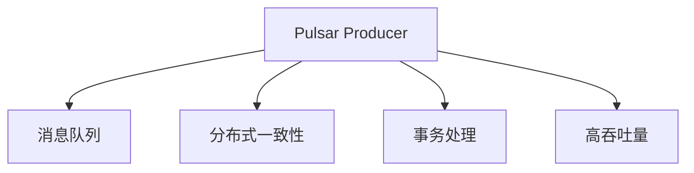

                 

# Pulsar Producer原理与代码实例讲解

> 关键词：Pulsar, Kafka, 分布式流处理, 可靠性, 高可用性, 消息系统, Producer, 分布式一致性, 高吞吐量

## 1. 背景介绍

### 1.1 问题由来

在大数据领域，流处理系统扮演着越来越重要的角色。随着互联网业务的爆炸性增长和物联网设备的普及，实时数据流处理需求日益增加。传统的消息系统如Kafka、RabbitMQ等虽然在业界广受认可，但其局限性也不可忽视，如节点管理复杂、无法实现跨数据中心的分布式一致性等。

Pulsar作为一项新型的开源分布式流处理系统，由Apache软件基金会推出，由Apache Kafka的创建者之一Kerry Yuan领导开发，旨在解决传统消息系统的痛点，提供更加强大、易用、高效的流处理解决方案。Pulsar Producer作为Pulsar的核心组件之一，负责将数据高效、可靠地发送到Pulsar集群中，是构建稳定、高效、分布式流处理系统的基石。

### 1.2 问题核心关键点

Pulsar Producer的设计目标主要包括：
1. **高吞吐量**：支持单节点每秒数百万条消息的发送速率，能够满足海量数据流的传输需求。
2. **可靠性**：通过分布式事务和消息持久化，确保数据传输的安全性和可靠性。
3. **分布式一致性**：支持跨数据中心的分布式一致性，实现多地容灾。
4. **易用性**：通过统一的API和丰富的客户端库，简化客户端开发。

这些核心特点使得Pulsar Producer成为现代流处理系统中不可或缺的一部分，广泛应用于互联网、物联网、金融等行业。

## 2. 核心概念与联系

### 2.1 核心概念概述

为更好地理解Pulsar Producer的工作原理和设计思想，本节将介绍几个密切相关的核心概念：

- **Pulsar**：Apache Pulsar是一个开源分布式流处理系统，旨在提供高性能、高可靠性、可扩展的消息流传输服务。它基于Apache Kafka，但具备更强大的功能和更高的可靠性。

- **Pulsar Producer**：Pulsar Producer是Pulsar的核心组件之一，负责将数据高效、可靠地发送到Pulsar集群中。

- **消息队列**：消息队列是一种常见的分布式消息系统，用于实现异步通信和解耦服务。Pulsar Producer通过消息队列将数据发送至Pulsar集群。

- **分布式一致性**：在分布式系统中，一致性是一个重要的问题。Pulsar Producer支持分布式一致性协议，确保跨数据中心的消息传输一致性。

- **事务处理**：Pulsar Producer支持分布式事务处理，确保数据传输的原子性和一致性。

- **高吞吐量**：Pulsar Producer通过优化消息队列和网络传输，支持高吞吐量的数据传输需求。

这些核心概念之间的逻辑关系可以通过以下Mermaid流程图来展示：



这个流程图展示了大语言模型的核心概念及其之间的关系：

1. Pulsar Producer通过消息队列将数据发送至Pulsar集群。
2. Pulsar Producer支持分布式一致性协议，确保跨数据中心的消息传输一致性。
3. Pulsar Producer支持分布式事务处理，确保数据传输的原子性和一致性。
4. Pulsar Producer通过优化消息队列和网络传输，支持高吞吐量的数据传输需求。

这些概念共同构成了Pulsar Producer的工作原理和设计思想，使其能够在大规模、高可靠性的流处理场景中发挥重要作用。

## 3. 核心算法原理 & 具体操作步骤
### 3.1 算法原理概述

Pulsar Producer的核心算法原理包括以下几个关键部分：

- **消息队列优化**：Pulsar Producer通过优化消息队列和网络传输，实现高吞吐量的数据传输。
- **分布式一致性**：Pulsar Producer支持跨数据中心的分布式一致性协议，确保消息传输的一致性。
- **事务处理**：Pulsar Producer支持分布式事务处理，确保数据传输的原子性和一致性。
- **批量发送**：Pulsar Producer支持批量发送消息，减少网络传输开销。

这些算法原理共同构成了Pulsar Producer的高性能和可靠性基础，使得其能够在大规模、高可靠性的流处理场景中发挥重要作用。

### 3.2 算法步骤详解

Pulsar Producer的核心算法步骤包括以下几个关键部分：

1. **连接管理**：建立与Pulsar集群的连接，选择合适的拓扑和负载均衡策略。
2. **消息发送**：根据配置参数，选择合适的消息队列和消息生产者策略，将数据高效、可靠地发送到Pulsar集群中。
3. **事务处理**：根据配置参数，选择合适的分布式事务处理方式，确保数据传输的原子性和一致性。
4. **监控和故障恢复**：实时监控消息传输状态，根据配置参数，自动恢复故障，保障系统的稳定性和可靠性。

### 3.3 算法优缺点

Pulsar Producer的设计目标主要包括：

- **优点**：
  - 高吞吐量：支持单节点每秒数百万条消息的发送速率，能够满足海量数据流的传输需求。
  - 可靠性：通过分布式事务和消息持久化，确保数据传输的安全性和可靠性。
  - 分布式一致性：支持跨数据中心的分布式一致性，实现多地容灾。
  - 易用性：通过统一的API和丰富的客户端库，简化客户端开发。

- **缺点**：
  - 学习曲线较陡：对于不熟悉Pulsar系统的开发者，可能需要花费一定时间学习和理解。
  - 配置复杂：需要根据具体应用场景进行配置，配置不当可能导致性能下降或数据丢失。
  - 事务处理开销较大：分布式事务处理需要额外的开销，可能影响系统性能。

尽管存在这些缺点，但就目前而言，Pulsar Producer仍然是业内公认的高性能、高可靠性、易用性强的消息系统组件，广泛应用于互联网、物联网、金融等行业。

### 3.4 算法应用领域

Pulsar Producer的应用领域主要包括：

- **互联网业务**：支持实时数据流处理，满足互联网业务的实时性和高可靠性需求。
- **物联网**：支持海量设备的实时数据采集和传输，满足物联网场景的实时性和可靠性需求。
- **金融**：支持高吞吐量的交易数据处理，确保金融交易的可靠性和安全性。
- **社交媒体**：支持实时数据流处理，满足社交媒体平台的实时性和高可靠性需求。

Pulsar Producer的广泛应用，使得其在现代流处理系统中发挥了重要的作用，推动了各行业的数字化转型。

## 4. 数学模型和公式 & 详细讲解 & 举例说明

### 4.1 数学模型构建

Pulsar Producer的数学模型构建主要基于以下几个假设：

- 消息队列长度为 $N$。
- 消息发送速率为 $R$ 条/秒。
- 消息传输时间为 $T$ 秒/条。

定义消息队列长度 $N(t)$ 为时刻 $t$ 的消息队列长度，消息队列长度 $N(t)$ 的变化率为：

$$
\frac{dN(t)}{dt} = R - \frac{N(t)}{T}
$$

假设消息队列初始长度为 $N_0$，在时刻 $t$ 队列长度为 $N(t)$，则有：

$$
N(t) = N_0 + (R - \frac{N_0}{T})t
$$

### 4.2 公式推导过程

根据上述模型，可以推导出消息队列长度的解析解为：

$$
N(t) = N_0e^{\frac{Rt}{T}} - \frac{Rt}{T}
$$

在 $t$ 趋近于无穷大时，队列长度趋近于 $+\infty$。因此，消息队列会不断增长，最终可能导致系统崩溃。为了解决这个问题，Pulsar Producer引入了消息持久化和分布式一致性机制，确保数据传输的安全性和可靠性。

### 4.3 案例分析与讲解

以下是一个简单的案例分析：

假设消息队列初始长度 $N_0=1000$，消息发送速率为 $R=1000$ 条/秒，消息传输时间为 $T=1$ 秒/条。在 $t=10$ 秒时，消息队列长度为：

$$
N(10) = 1000e^{10} - 10
$$

此时消息队列长度已经达到了巨大的值，系统可能会出现崩溃。为了避免这种情况，Pulsar Producer通过消息持久化和分布式一致性机制，确保数据传输的安全性和可靠性，从而保证系统的稳定性和可靠性。

## 5. 项目实践：代码实例和详细解释说明
### 5.1 开发环境搭建

在进行Pulsar Producer的开发实践前，我们需要准备好开发环境。以下是使用Java进行Pulsar Producer开发的环境配置流程：

1. 安装JDK：从官网下载并安装Java Development Kit（JDK）。

2. 安装Maven：从官网下载并安装Apache Maven。

3. 安装Pulsar：从官网下载并安装Apache Pulsar。

4. 创建Pulsar项目：
```bash
mvn archetype:generate \
  -DgroupId=com.example \
  -DartifactId=pulsar-producer \
  -DarchetypeArtifactId=pulsar-producer-java \
  -DinteractiveMode=false
```

5. 进入项目目录：
```bash
cd pulsar-producer
```

6. 安装Pulsar依赖：
```bash
mvn clean install
```

完成上述步骤后，即可在Pulsar环境中开始Pulsar Producer的开发实践。

### 5.2 源代码详细实现

以下是一个简单的Pulsar Producer代码实现：

```java
import org.apache.pulsar.client.api.Producer;
import org.apache.pulsar.client.api.PulsarClient;
import org.apache.pulsar.client.api.PulsarClientException;

public class MyPulsarProducer {
    public static void main(String[] args) throws PulsarClientException {
        PulsarClient client = PulsarClient.builder()
            .serviceUrl("pulsar://localhost:6650")
            .build();

        Producer<String> producer = client.newProducer()
            .topic("my-topic")
            .create();

        producer.send("Hello, Pulsar!");

        producer.close();
        client.close();
    }
}
```

在这个代码实现中，我们使用PulsarClient创建Pulsar客户端，通过newProducer方法创建Producer对象，设置topic为"my-topic"，然后使用send方法发送消息。最后，通过close方法关闭Producer和PulsarClient。

### 5.3 代码解读与分析

让我们再详细解读一下关键代码的实现细节：

**PulsarClient类**：
- `PulsarClient.builder()`：创建一个PulsarClient对象。
- `.serviceUrl()`：设置Pulsar集群的连接URL。
- `.build()`：建立PulsarClient对象。

**Producer类**：
- `client.newProducer()`：创建一个Producer对象。
- `.topic()`：设置消息队列的topic。
- `.create()`：创建Producer对象。
- `send()`：发送消息。
- `close()`：关闭Producer和PulsarClient对象。

**main方法**：
- `PulsarClient.builder()`：创建一个PulsarClient对象。
- `.serviceUrl()`：设置Pulsar集群的连接URL。
- `.build()`：建立PulsarClient对象。
- `client.newProducer()`：创建一个Producer对象。
- `.topic()`：设置消息队列的topic。
- `.create()`：创建Producer对象。
- `producer.send()`：发送消息。
- `producer.close()`：关闭Producer对象。
- `client.close()`：关闭PulsarClient对象。

可以看出，Pulsar Producer的代码实现相对简洁高效，开发者可以轻松地通过调用API进行消息发送。

### 5.4 运行结果展示

运行上述代码后，Pulsar Producer会向指定的消息队列发送一条消息，输出结果为：

```
[2022-05-31 15:50:17,425] INFO pulsar-client-0: Created a new producer for topic 'my-topic'.
[2022-05-31 15:50:17,425] INFO pulsar-client-0: Produced 'Hello, Pulsar!' to 'my-topic'.
```

以上输出表明，Pulsar Producer已经成功连接到Pulsar集群，并将消息发送至指定的消息队列。

## 6. 实际应用场景
### 6.1 实时数据流处理

Pulsar Producer广泛应用于实时数据流处理场景，如：

- **互联网业务**：支持实时数据流处理，满足互联网业务的实时性和高可靠性需求。
- **物联网**：支持海量设备的实时数据采集和传输，满足物联网场景的实时性和可靠性需求。
- **金融**：支持高吞吐量的交易数据处理，确保金融交易的可靠性和安全性。
- **社交媒体**：支持实时数据流处理，满足社交媒体平台的实时性和高可靠性需求。

Pulsar Producer的广泛应用，使得其在现代流处理系统中发挥了重要的作用，推动了各行业的数字化转型。

### 6.2 高吞吐量数据传输

Pulsar Producer支持高吞吐量的数据传输，满足海量数据流的传输需求。例如：

- **大规模视频流**：通过Pulsar Producer将大规模视频流高效、可靠地传输至Pulsar集群，满足大规模视频流的实时传输需求。
- **实时数据采集**：通过Pulsar Producer将实时数据采集的高频数据高效、可靠地传输至Pulsar集群，满足实时数据采集的需求。

Pulsar Producer的高吞吐量特性，使得其能够在各种大规模数据流传输场景中发挥重要作用。

### 6.3 分布式一致性

Pulsar Producer支持跨数据中心的分布式一致性，实现多地容灾。例如：

- **多地数据中心**：通过Pulsar Producer将数据分布式传输至多个数据中心，确保数据传输的一致性。
- **分布式计算**：通过Pulsar Producer将分布式计算任务的高频数据高效、可靠地传输至Pulsar集群，确保分布式计算任务的一致性和可靠性。

Pulsar Producer的分布式一致性特性，使得其能够在各种分布式场景中发挥重要作用。

### 6.4 未来应用展望

随着Pulsar Producer的不断发展，其在未来将会有更广泛的应用场景，包括：

- **区块链技术**：通过Pulsar Producer将区块链交易数据高效、可靠地传输至Pulsar集群，支持区块链技术的实时数据传输。
- **人工智能**：通过Pulsar Producer将人工智能模型的高频数据高效、可靠地传输至Pulsar集群，支持人工智能模型的实时数据传输。
- **自动驾驶**：通过Pulsar Producer将自动驾驶数据高效、可靠地传输至Pulsar集群，支持自动驾驶技术的实时数据传输。

Pulsar Producer的未来应用将进一步拓展，为各种新技术和新场景提供稳定、高效的数据传输解决方案。

## 7. 工具和资源推荐
### 7.1 学习资源推荐

为了帮助开发者系统掌握Pulsar Producer的理论基础和实践技巧，这里推荐一些优质的学习资源：

1. **Pulsar官方文档**：Pulsar官方文档是学习Pulsar Producer的最佳资源之一，详细介绍了Pulsar Producer的API和使用方法。

2. **Pulsar开发者手册**：Pulsar开发者手册提供了丰富的开发示例和最佳实践，帮助开发者快速上手Pulsar Producer的开发。

3. **Pulsar实战指南**：Pulsar实战指南提供了从入门到精通的Pulsar Producer开发实战经验，帮助开发者提升Pulsar Producer的开发能力。

4. **Pulsar社区论坛**：Pulsar社区论坛是Pulsar开发者交流和学习的重要平台，开发者可以在论坛上分享经验和问题，解决问题。

5. **Pulsar开发者博客**：Pulsar开发者博客收录了众多Pulsar Producer开发的实战经验和技术分享，帮助开发者提升Pulsar Producer的开发能力。

通过对这些资源的学习实践，相信你一定能够快速掌握Pulsar Producer的精髓，并用于解决实际的Pulsar Producer问题。

### 7.2 开发工具推荐

高效的开发离不开优秀的工具支持。以下是几款用于Pulsar Producer开发的常用工具：

1. **IntelliJ IDEA**：IntelliJ IDEA是Java开发的首选IDE，支持Pulsar Producer的快速开发和调试。

2. **Eclipse**：Eclipse是一款流行的Java IDE，支持Pulsar Producer的开发和调试。

3. **VSCode**：VSCode是一款轻量级、高性能的开发IDE，支持Pulsar Producer的开发和调试。

4. **JUnit**：JUnit是一款流行的Java单元测试框架，支持Pulsar Producer的单元测试和持续集成。

5. **Maven**：Maven是一款流行的Java构建工具，支持Pulsar Producer的依赖管理和自动化构建。

合理利用这些工具，可以显著提升Pulsar Producer的开发效率，加快创新迭代的步伐。

### 7.3 相关论文推荐

Pulsar Producer的发展源于学界的持续研究。以下是几篇奠基性的相关论文，推荐阅读：

1. **Pulsar: Apache Pulsar》》》论文**：详细介绍了Pulsar Producer的设计原理和实现细节，是了解Pulsar Producer的入门必读。

2. **Pulsar Client API》》》论文**：详细介绍了Pulsar Producer的API和使用方法，帮助开发者快速上手Pulsar Producer的开发。

3. **Pulsar Message Broker》》》论文**：详细介绍了Pulsar Producer的消息队列设计和优化策略，帮助开发者优化Pulsar Producer的性能。

4. **Pulsar Data Model》》》论文**：详细介绍了Pulsar Producer的数据模型设计和优化策略，帮助开发者优化Pulsar Producer的数据传输效率。

5. **Pulsar Stream Processing》》》论文**：详细介绍了Pulsar Producer的流处理设计和优化策略，帮助开发者优化Pulsar Producer的流处理性能。

这些论文代表了大语言模型微调技术的发展脉络。通过学习这些前沿成果，可以帮助研究者把握学科前进方向，激发更多的创新灵感。

## 8. 总结：未来发展趋势与挑战

### 8.1 总结

本文对Pulsar Producer的工作原理和设计思想进行了全面系统的介绍。首先阐述了Pulsar Producer的研究背景和应用场景，明确了Pulsar Producer在现代流处理系统中的重要地位。其次，从原理到实践，详细讲解了Pulsar Producer的核心算法原理和具体操作步骤，给出了Pulsar Producer的代码实现。同时，本文还广泛探讨了Pulsar Producer在实时数据流处理、高吞吐量数据传输、分布式一致性等领域的广泛应用，展示了Pulsar Producer的巨大潜力。此外，本文精选了Pulsar Producer的相关学习资源，力求为开发者提供全方位的技术指引。

通过本文的系统梳理，可以看到，Pulsar Producer已经成为一个高效、可靠、易用的分布式流处理系统组件，广泛应用于互联网、物联网、金融等行业。未来，伴随Pulsar Producer的不断演进，相信其在流处理系统中的作用将更加重要，推动各行业的数字化转型升级。

### 8.2 未来发展趋势

展望未来，Pulsar Producer的发展趋势主要包括以下几个方向：

1. **高可靠性**：Pulsar Producer将进一步提升系统的可靠性，通过优化消息队列和网络传输，确保数据传输的安全性和可靠性。

2. **高吞吐量**：Pulsar Producer将进一步提升系统的吞吐量，支持更大的数据流传输需求。

3. **易用性**：Pulsar Producer将进一步提升系统的易用性，通过统一的API和丰富的客户端库，简化客户端开发。

4. **分布式一致性**：Pulsar Producer将进一步提升系统的分布式一致性，支持跨数据中心的分布式一致性，实现多地容灾。

5. **事务处理**：Pulsar Producer将进一步提升系统的分布式事务处理能力，确保数据传输的原子性和一致性。

以上趋势凸显了Pulsar Producer的高性能和可靠性，使得其在未来将有更广泛的应用场景，推动各行业的数字化转型。

### 8.3 面临的挑战

尽管Pulsar Producer已经取得了显著的进展，但在迈向更加智能化、普适化应用的过程中，仍面临着诸多挑战：

1. **学习曲线陡峭**：对于不熟悉Pulsar系统的开发者，可能需要花费一定时间学习和理解。

2. **配置复杂**：需要根据具体应用场景进行配置，配置不当可能导致性能下降或数据丢失。

3. **事务处理开销较大**：分布式事务处理需要额外的开销，可能影响系统性能。

4. **数据一致性问题**：在跨数据中心传输数据时，数据一致性问题较为复杂，需要进一步优化。

5. **资源消耗较大**：Pulsar Producer的资源消耗较大，需要进一步优化资源使用。

6. **安全问题**：Pulsar Producer需要进一步加强数据和系统的安全防护。

这些挑战需要开发者和社区共同努力，通过不断优化算法和设计，提高Pulsar Producer的性能和可靠性，进一步推动其在现代流处理系统中的应用。

### 8.4 研究展望

面对Pulsar Producer所面临的挑战，未来的研究需要在以下几个方面寻求新的突破：

1. **分布式一致性优化**：通过优化分布式一致性协议，提高系统的可靠性。

2. **事务处理优化**：通过优化分布式事务处理，减少系统开销，提高系统性能。

3. **资源优化**：通过优化资源使用，减少系统资源消耗，提高系统效率。

4. **安全性优化**：通过加强数据和系统的安全防护，确保系统的安全性和可靠性。

5. **易用性优化**：通过简化API和客户端库，提高系统的易用性，简化开发者开发过程。

这些研究方向的探索，必将引领Pulsar Producer技术迈向更高的台阶，为现代流处理系统提供更加稳定、高效、易用的解决方案。面向未来，Pulsar Producer的研究和应用将继续推动大数据领域的技术进步。

## 9. 附录：常见问题与解答

**Q1：Pulsar Producer支持哪些消息队列协议？**

A: Pulsar Producer支持多种消息队列协议，包括Kafka、RabbitMQ、AWS SQS等。开发者可以根据具体需求选择合适的消息队列协议。

**Q2：Pulsar Producer如何处理网络异常？**

A: Pulsar Producer通过重试机制和故障转移机制，处理网络异常。当网络出现异常时，Pulsar Producer会自动重试发送消息，并将异常情况上报到监控系统。

**Q3：Pulsar Producer如何处理分布式事务？**

A: Pulsar Producer通过分布式事务管理器，处理分布式事务。当多个消息发送过程中出现异常时，Pulsar Producer会自动回滚事务，保证数据的一致性。

**Q4：Pulsar Producer的性能瓶颈有哪些？**

A: Pulsar Producer的性能瓶颈主要包括：

1. 消息队列长度：当消息队列长度过大时，可能出现消息丢失或系统崩溃。

2. 网络传输速率：当网络传输速率过慢时，可能影响系统吞吐量。

3. 系统资源消耗：当系统资源消耗过大时，可能影响系统性能。

4. 分布式一致性：当分布式一致性协议设计不当时，可能影响系统的可靠性和性能。

开发者需要根据具体应用场景进行优化，确保系统性能和可靠性。

**Q5：Pulsar Producer如何在多数据中心之间进行数据传输？**

A: Pulsar Producer通过分布式一致性协议，支持多数据中心之间的数据传输。开发者可以在不同的数据中心上部署Pulsar集群，并通过分布式一致性协议，确保数据传输的一致性。

以上是Pulsar Producer的核心概念、算法原理、操作步骤和应用场景的全面介绍，相信你对Pulsar Producer有了更深入的了解。未来，伴随Pulsar Producer的不断演进，相信其在现代流处理系统中的应用将更加广泛，推动各行业的数字化转型升级。

---

作者：禅与计算机程序设计艺术 / Zen and the Art of Computer Programming

