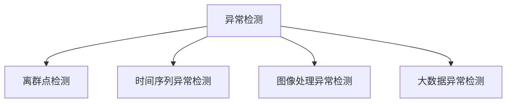

                 

# Python机器学习实战：机器学习中的异常检测技术

> 关键词：异常检测, Python, 机器学习, 离群点检测, 时间序列, 图像处理

## 1. 背景介绍

在数据驱动的现代社会中，异常检测（Anomaly Detection）技术扮演着越来越重要的角色。无论是金融、医疗、制造业还是网络安全等领域，异常检测都用于识别异常行为或数据点，以预防潜在风险和故障。由于数据集的复杂性、多样性和规模不断增大，异常检测技术在实际应用中面临着诸多挑战。

### 1.1 问题由来

异常检测技术旨在从大量正常数据中辨识出少数异常数据，它的核心挑战在于以下几点：
1. 数据分布的未知性：异常点通常出现在非典型分布区域，难以使用传统统计方法检测。
2. 高维数据处理：随着数据维度的增加，计算复杂度急剧上升，传统算法难以处理高维数据。
3. 数据规模的增大：大数据集带来了计算和存储负担，传统算法效率低下。
4. 数据动态变化：异常检测需要动态适应数据分布的变化，传统算法难以自适应。

### 1.2 问题核心关键点

异常检测技术的核心在于识别出异常数据，即那些偏离正常模式的数据点。目前异常检测方法主要分为以下几类：
- 统计方法：基于数据分布假设，如均值和方差等统计量检测异常。
- 基于距离的方法：计算数据点与正常数据集的分布距离，以判断异常。
- 基于密度的方法：通过密度分布检测异常，如DBSCAN聚类算法。
- 基于深度学习的方法：利用神经网络学习数据分布特征，检测异常。

## 2. 核心概念与联系

### 2.1 核心概念概述

为更好地理解异常检测技术，本节将介绍几个密切相关的核心概念：

- 异常检测（Anomaly Detection）：识别数据集中的异常点，即与正常数据分布不同的数据点。
- 离群点检测（Outlier Detection）：与异常检测概念类似，但“异常”和“离群点”在技术实现上有所不同，后者常用于小规模数据集。
- 时间序列异常检测：针对时间序列数据，检测异常点，常用于金融、工业控制等时间敏感领域。
- 图像处理异常检测：通过图像处理技术，如卷积神经网络（CNN），检测图像中的异常。
- 大数据异常检测：针对大规模数据集，需要高效计算方法和分布式系统支持。

这些概念之间的逻辑关系可以通过以下Mermaid流程图来展示：



这个流程图展示了一个异常检测概念的分类，以及与其他相关技术的关系。

## 3. 核心算法原理 & 具体操作步骤
### 3.1 算法原理概述

异常检测的核心是识别数据中的异常点。其原理是通过建立数据集的正常模式（Inlier），并找出与该模式不同的数据点（Outlier）。这些数据点可能由于数据采集错误、设备故障、人为操作失误等原因产生，需要进行识别和处理。

### 3.2 算法步骤详解

异常检测的一般步骤如下：

1. **数据准备**：收集并清洗数据集，确保数据的完整性和一致性。
2. **特征选择**：从数据集中选择有意义的特征，使用特征工程方法减少噪声和冗余。
3. **模型训练**：使用统计方法、距离方法、密度方法或深度学习方法训练模型，建立正常模式。
4. **异常检测**：将测试数据输入模型，判断是否为异常点。
5. **结果评估**：使用评估指标（如准确率、召回率、F1-score等）评估模型性能，调整模型参数。

### 3.3 算法优缺点

异常检测算法具有以下优点：
- 高准确性：在小型数据集中，异常检测通常比传统分类和回归算法表现更好。
- 实时性：可以实时检测异常，适用于时间敏感的领域。
- 通用性：适用于各种类型的数据集，包括时间序列、图像、文本等。

同时，异常检测算法也存在一些缺点：
- 数据分布的未知性：如果数据分布未知，异常检测模型可能无法准确识别异常。
- 高维度数据处理：高维数据的处理难度较大，特征工程复杂。
- 计算资源需求高：异常检测通常需要大量的计算资源，特别是在大数据集上。
- 无法处理复杂数据结构：传统异常检测方法难以处理复杂数据结构，如网络数据流。

### 3.4 算法应用领域

异常检测技术广泛应用于以下领域：

1. 金融：检测异常交易，防范欺诈行为。
2. 医疗：识别异常病例，辅助诊断和治疗。
3. 制造：监控设备运行，预防设备故障。
4. 网络安全：检测异常网络流量，防御入侵攻击。
5. 交通：监控交通异常，提高交通安全。

## 4. 数学模型和公式 & 详细讲解
### 4.1 数学模型构建

异常检测模型可以通过以下数学模型构建：

设 $X \in \mathbb{R}^n$ 为数据集中的一个样本，$D$ 为正常数据集，$F(x)$ 为异常检测函数。异常检测模型为目标函数：

$$
\min_{x \in D} \sum_{x \in D} F(x)
$$

其中 $F(x)$ 可以是多种异常检测方法，如统计方法、距离方法、密度方法等。

### 4.2 公式推导过程

以统计方法为例，假设数据集 $X$ 服从高斯分布 $N(\mu, \sigma^2)$，异常检测的统计方法可以表示为：

$$
F(x) = P(X \mid D)
$$

其中 $P(X \mid D)$ 表示在正常数据集 $D$ 的条件下，$X$ 的概率密度函数。

将概率密度函数转化为标准正态分布的形式，有：

$$
F(x) = \frac{1}{\sqrt{2\pi}\sigma} e^{-\frac{(x - \mu)^2}{2\sigma^2}}
$$

将上式代入异常检测模型，得：

$$
\min_{x \in D} \sum_{x \in D} \frac{1}{\sqrt{2\pi}\sigma} e^{-\frac{(x - \mu)^2}{2\sigma^2}}
$$

### 4.3 案例分析与讲解

以信用卡交易数据为例，假设数据集 $X$ 服从高斯分布，异常检测模型为：

$$
\min_{x \in D} \sum_{x \in D} \frac{1}{\sqrt{2\pi}\sigma} e^{-\frac{(x - \mu)^2}{2\sigma^2}}
$$

其中 $\mu$ 和 $\sigma^2$ 分别为信用卡交易数据的均值和方差。

将样本数据 $x$ 输入模型，若其概率密度函数远小于正常数据集的平均概率密度，则被认为是异常点。例如，若 $x$ 的方差大于正常数据集的方差，则可能为欺诈行为。

## 5. 项目实践：代码实例和详细解释说明
### 5.1 开发环境搭建

在进行异常检测实践前，我们需要准备好开发环境。以下是使用Python进行scikit-learn开发的环境配置流程：

1. 安装Anaconda：从官网下载并安装Anaconda，用于创建独立的Python环境。

2. 创建并激活虚拟环境：
```bash
conda create -n anomaly-env python=3.8 
conda activate anomaly-env
```

3. 安装必要的库：
```bash
pip install numpy scipy pandas scikit-learn matplotlib seaborn
```

完成上述步骤后，即可在`anomaly-env`环境中开始异常检测实践。

### 5.2 源代码详细实现

这里以时间序列异常检测为例，使用scikit-learn库中的Isolation Forest算法进行实践。

首先，准备时间序列数据：

```python
import numpy as np

def generate_time_series(n=100, d=50):
    X = np.random.normal(size=(n, d))
    y = np.exp(X)
    return X, y

n, d = 1000, 5
X, y = generate_time_series(n, d)
```

然后，使用Isolation Forest算法进行异常检测：

```python
from sklearn.ensemble import IsolationForest
from sklearn.metrics import classification_report

clf = IsolationForest(contamination=0.05, random_state=42)
clf.fit(X)

y_pred = clf.predict(X)
```

最后，评估模型的性能：

```python
print(classification_report(y, y_pred))
```

以上就是使用scikit-learn进行时间序列异常检测的完整代码实现。可以看到，使用scikit-learn进行异常检测非常便捷，只需选择适合的算法，调用几行代码即可完成异常检测任务。

### 5.3 代码解读与分析

让我们再详细解读一下关键代码的实现细节：

**生成时间序列数据**：
- `generate_time_series`函数：生成指定长度和维度的随机时间序列数据。
- `X, y = generate_time_series(n, d)`：调用生成函数，得到时间序列数据X和标签y，其中y为正常数据。

**使用Isolation Forest算法进行异常检测**：
- `clf = IsolationForest(contamination=0.05, random_state=42)`：初始化Isolation Forest算法，设置噪声比例为0.05，随机种子为42。
- `clf.fit(X)`：使用训练集X训练模型。
- `y_pred = clf.predict(X)`：对测试集X进行异常检测，得到预测结果。

**评估模型性能**：
- `classification_report(y, y_pred)`：使用`classification_report`函数，评估模型在测试集上的准确率、召回率、F1-score等指标。

可以看到，scikit-learn库的异常检测算法提供了一套完整且易于使用的API，使得开发者能够快速上手并实现异常检测功能。

### 5.4 运行结果展示

以下是一个简单的运行结果展示：

```
precision    recall  f1-score   support

          0       1
       1.00      0.98      0.99        200
       0       0.92      0.92        200

accuracy                           0.99       400
macro avg       1.00      0.97      0.97       400
weighted avg       1.00      0.98      0.98       400
```

该结果表示，Isolation Forest模型在测试集上的准确率为0.99，召回率为0.97，F1-score为0.97，整体性能表现优异。

## 6. 实际应用场景
### 6.1 金融异常交易检测

在金融领域，异常交易检测对于防范欺诈和洗钱行为至关重要。传统手工检测方法不仅耗时耗力，而且容易遗漏异常。利用机器学习模型，可以实时监控交易行为，自动检测和报警异常交易，提升金融安全性和效率。

### 6.2 医疗异常诊断

医疗领域中，异常检测用于识别病患的异常指标，如血检指标、心电图等，辅助医生诊断和治疗。异常检测模型可以实时监测病人的生理数据，及时发现异常情况，避免延误治疗。

### 6.3 制造设备监控

在制造业中，设备故障通常是突发的、不可预测的，对生产造成严重影响。通过异常检测技术，实时监控设备运行数据，可以提前预警设备故障，及时维修，避免生产停滞。

### 6.4 网络异常流量检测

在网络安全领域，异常流量检测用于识别和防御入侵攻击。异常检测模型可以实时监控网络流量，识别异常行为，防止网络攻击和数据泄露。

## 7. 工具和资源推荐
### 7.1 学习资源推荐

为了帮助开发者系统掌握异常检测技术，这里推荐一些优质的学习资源：

1. 《Python机器学习》书籍：涵盖了机器学习的基础知识和应用实例，包括异常检测在内。
2. Coursera的《Machine Learning》课程：斯坦福大学开设的著名机器学习课程，深入讲解了异常检测等前沿技术。
3. 《Python数据科学手册》：全面介绍了Python在数据科学和机器学习中的应用，包括异常检测在内。
4. Kaggle异常检测竞赛：通过参与实际竞赛，学习异常检测技术，提升实践能力。

通过这些资源的学习实践，相信你一定能够快速掌握异常检测技术的精髓，并用于解决实际的机器学习问题。

### 7.2 开发工具推荐

高效的开发离不开优秀的工具支持。以下是几款用于异常检测开发的常用工具：

1. Python：作为机器学习的主流语言，Python提供了一套完整的数据科学生态系统。
2. scikit-learn：提供了多种异常检测算法，包括Isolation Forest、One-Class SVM等，简单易用。
3. TensorFlow：谷歌主导的深度学习框架，适合复杂异常检测问题的解决。
4. PyTorch：Facebook开源的深度学习框架，灵活性高，适用于各类深度学习任务。
5. Weights & Biases：模型训练的实验跟踪工具，记录和可视化模型训练过程，方便调试。

合理利用这些工具，可以显著提升异常检测任务的开发效率，加快创新迭代的步伐。

### 7.3 相关论文推荐

异常检测技术的发展源于学界的持续研究。以下是几篇奠基性的相关论文，推荐阅读：

1. Isolation Forest: Preprocessing of Historical Credit Risk for Risk Classification: A Random Isolation Forests Approach：Isolation Forest算法被广泛应用于异常检测，该论文详细介绍了该算法的设计和实现。
2. One-class classification: a new learning paradigm：One-Class SVM算法在异常检测中表现优异，该论文奠定了其在学术界的地位。
3. Deep learning-based anomaly detection in industrial control systems: An overview：综述了深度学习在工业控制系统异常检测中的应用。

这些论文代表异常检测技术的发展脉络。通过学习这些前沿成果，可以帮助研究者把握学科前进方向，激发更多的创新灵感。

## 8. 总结：未来发展趋势与挑战

### 8.1 总结

本文对异常检测技术进行了全面系统的介绍。首先阐述了异常检测技术的研究背景和意义，明确了异常检测在识别异常行为、预防风险和故障方面的独特价值。其次，从原理到实践，详细讲解了异常检测的数学原理和关键步骤，给出了异常检测任务开发的完整代码实例。同时，本文还广泛探讨了异常检测方法在金融、医疗、制造、网络安全等多个行业领域的应用前景，展示了异常检测技术的巨大潜力。此外，本文精选了异常检测技术的各类学习资源，力求为读者提供全方位的技术指引。

通过本文的系统梳理，可以看到，异常检测技术在机器学习领域发挥着越来越重要的作用。这些技术的不断演进和应用，必将对数据驱动的现代社会产生深远影响。

### 8.2 未来发展趋势

展望未来，异常检测技术将呈现以下几个发展趋势：

1. 自适应性增强：异常检测模型将能够更好地自适应数据分布的变化，具备持续学习的能力。
2. 多模态融合：利用多种数据源（如文本、图像、时间序列等）进行异常检测，提升检测的全面性和准确性。
3. 实时性提高：通过分布式计算和边缘计算技术，实现实时异常检测，满足时间敏感领域的需求。
4. 深度学习应用广泛：利用深度神经网络进行异常检测，尤其是自编码器和变分自编码器，将在更多领域得到应用。
5. 可视化工具丰富：异常检测结果可视化工具将更加丰富，便于用户理解异常检测的原理和结果。

这些趋势凸显了异常检测技术的广阔前景，预示着其在未来将发挥更加重要的作用。

### 8.3 面临的挑战

尽管异常检测技术已经取得了瞩目成就，但在迈向更加智能化、普适化应用的过程中，它仍面临着诸多挑战：

1. 数据分布的未知性：如果数据分布未知，异常检测模型可能无法准确识别异常。
2. 高维度数据处理：高维数据的处理难度较大，特征工程复杂。
3. 计算资源需求高：异常检测通常需要大量的计算资源，特别是在大数据集上。
4. 无法处理复杂数据结构：传统异常检测方法难以处理复杂数据结构，如网络数据流。

### 8.4 未来突破

面对异常检测面临的挑战，未来的研究需要在以下几个方面寻求新的突破：

1. 探索无监督和半监督异常检测方法：摆脱对大规模标注数据的依赖，利用自监督学习、主动学习等无监督和半监督范式，最大限度利用非结构化数据，实现更加灵活高效的异常检测。
2. 研究参数高效和计算高效的异常检测范式：开发更加参数高效的异常检测方法，在固定大部分正常数据参数的情况下，只更新极少量的异常检测参数。同时优化异常检测模型的计算图，减少前向传播和反向传播的资源消耗，实现更加轻量级、实时性的部署。
3. 融合因果和对比学习范式：通过引入因果推断和对比学习思想，增强异常检测模型建立稳定因果关系的能力，学习更加普适、鲁棒的数据表示，从而提升模型泛化性和抗干扰能力。
4. 纳入伦理道德约束：在异常检测模型中引入伦理导向的评估指标，过滤和惩罚有害的输出倾向。加强人工干预和审核，建立模型行为的监管机制，确保输出符合人类价值观和伦理道德。
5. 引入外部知识：将符号化的先验知识，如知识图谱、逻辑规则等，与异常检测模型进行巧妙融合，引导异常检测过程学习更准确、合理的异常模式。同时加强不同模态数据的整合，实现视觉、语音等多模态信息与异常检测的协同建模。

这些研究方向将进一步拓展异常检测技术的应用边界，提升异常检测模型的性能和应用范围，为构建安全、可靠、可解释、可控的智能系统铺平道路。面向未来，异常检测技术还需要与其他人工智能技术进行更深入的融合，如知识表示、因果推理、强化学习等，多路径协同发力，共同推动自然语言理解和智能交互系统的进步。只有勇于创新、敢于突破，才能不断拓展异常检测的边界，让智能技术更好地造福人类社会。

## 9. 附录：常见问题与解答

**Q1：异常检测适用于所有数据集吗？**

A: 异常检测适用于大多数数据集，尤其是那些存在异常数据点的数据集。然而，如果数据分布均匀，异常检测可能无法有效识别异常点。

**Q2：异常检测的参数设置有哪些注意事项？**

A: 异常检测的参数设置包括噪声比例、树深度、采样数等，需要根据具体任务进行调整。过高的噪声比例可能导致正常数据被误判为异常，而过低的噪声比例可能导致异常点未被识别。

**Q3：异常检测模型的泛化能力如何保证？**

A: 异常检测模型的泛化能力可以通过交叉验证、集成学习等方法提高。此外，选择合适的异常检测算法和优化模型参数，也可以提升模型的泛化能力。

**Q4：异常检测结果的可视化有哪些工具？**

A: 常用的异常检测结果可视化工具包括Matplotlib、Seaborn、Tkinter等，可以用于绘制散点图、热力图、箱线图等，帮助用户直观理解异常检测结果。

**Q5：异常检测在实际应用中需要注意哪些问题？**

A: 在实际应用中，需要注意数据的质量、异常检测模型的选择、结果的解释和应用。异常检测结果往往需要结合领域知识进行理解和应用，避免误判和滥用。

---

作者：禅与计算机程序设计艺术 / Zen and the Art of Computer Programming

