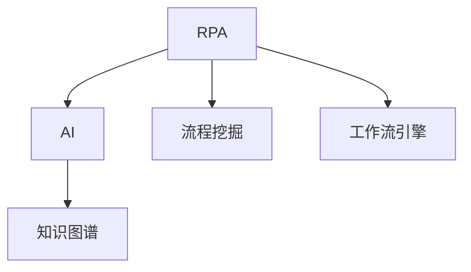

                 

# RPA与AI的融合发展趋势

## 1. 背景介绍

### 1.1 问题由来

随着数字化转型浪潮的推进，企业对自动化和智能化解决方案的需求日益增长。RPA（Robotic Process Automation，机器人流程自动化）和AI（Artificial Intelligence，人工智能）作为两种新兴技术，都在各自领域展示了巨大的潜力。然而，单独使用RPA或AI都存在一定的局限性，难以应对复杂的业务流程和智能决策需求。因此，如何融合RPA与AI，打造更强大、更灵活的自动化解决方案，成为了当下的一个重要课题。

### 1.2 问题核心关键点

RPA与AI的融合发展，旨在通过将RPA的流程自动化优势与AI的智能决策能力相结合，构建更高效、更智能的自动化系统。其关键点包括：

- 流程自动化：RPA通过模拟人工操作，实现复杂的业务流程自动化，减少人工操作，提高效率。
- 智能决策：AI通过机器学习、深度学习等技术，提升数据处理和决策能力，实现更智能的自动化。
- 集成协作：RPA与AI通过接口、API等方式进行集成，实现无缝协作，提升自动化系统的整体效能。

## 2. 核心概念与联系

### 2.1 核心概念概述

为更好地理解RPA与AI的融合发展，本节将介绍几个密切相关的核心概念：

- RPA（Robotic Process Automation）：指使用软件机器人自动化执行重复性、结构化的业务流程，提升工作效率，减少人为错误。
- AI（Artificial Intelligence）：指通过模拟人类智能行为，实现机器学习和深度学习等智能算法，提升数据处理和决策能力。
- 流程挖掘（Process Mining）：通过分析业务流程数据，自动化发现和建模业务流程，支持RPA的流程设计和优化。
- 工作流引擎（Workflow Engine）：用于管理和调度自动化工作流，支持RPA和AI任务的协作执行。
- 知识图谱（Knowledge Graph）：通过结构化的图谱表示，支持AI的语义理解和智能决策。

这些核心概念之间的逻辑关系可以通过以下Mermaid流程图来展示：



这个流程图展示了大语言模型的核心概念及其之间的关系：

1. RPA通过流程挖掘，自动化发现和建模业务流程，提升流程自动化效率。
2. AI通过工作流引擎，实现复杂任务的智能决策和协作执行。
3. 知识图谱通过结构化表示，支持AI的语义理解和智能决策。
4. RPA和AI通过接口、API等方式进行集成，实现无缝协作。

## 3. 核心算法原理 & 具体操作步骤
### 3.1 算法原理概述

RPA与AI的融合发展，本质上是一个流程自动化和智能决策的协同优化过程。其核心思想是：利用AI的智能决策能力，提升RPA流程的自动化水平和智能性。

具体而言，RPA系统通过模拟人工操作，完成规则明确的流程自动化任务。而AI系统则通过对业务数据的深度学习和分析，识别出规则不明确、需要智能决策的任务。两种技术通过协同工作，共同提升自动化系统的整体效能。

### 3.2 算法步骤详解

RPA与AI的融合发展一般包括以下几个关键步骤：

**Step 1: 流程挖掘与建模**

1. 收集业务流程数据，如操作日志、交易记录等。
2. 使用流程挖掘工具，自动化发现和建模业务流程。
3. 对流程进行可视化和优化，提升流程自动化效率。

**Step 2: RPA自动化部署**

1. 根据流程挖掘结果，设计并部署RPA自动化流程。
2. 在RPA平台上配置机器人，连接数据源和外部系统。
3. 启动机器人执行自动化流程，并监控执行状态。

**Step 3: AI智能决策集成**

1. 收集AI模型的训练数据，如历史交易记录、客户数据等。
2. 训练AI模型，提升数据处理和决策能力。
3. 将AI模型集成到工作流引擎中，支持智能决策和自动化流程。

**Step 4: 集成协作与优化**

1. 通过API或消息队列等方式，将RPA和AI系统进行集成。
2. 实时监控RPA和AI系统的运行状态，调整工作流程。
3. 持续优化RPA和AI系统的性能，提升自动化系统的整体效能。

### 3.3 算法优缺点

RPA与AI的融合发展，具有以下优点：

- 提高效率：RPA可以自动化执行大量重复性任务，解放人力，提高工作效率。
- 提升精度：AI的智能决策能力，可以减少人为错误，提升自动化系统的准确性。
- 降低成本：自动化系统的应用，可以显著降低人工操作成本。
- 灵活适应：RPA与AI的结合，可以适应更多复杂场景，满足不同业务需求。

同时，该方法也存在一定的局限性：

- 对数据依赖：AI模型需要大量高质量数据进行训练，数据质量和数量直接影响AI的效果。
- 技术复杂度：RPA与AI的集成，需要技术团队具备较强的技术储备和开发能力。
- 模型维护：AI模型需要持续维护和优化，才能保持较好的性能。
- 系统兼容：不同系统之间的集成和兼容性问题，可能影响系统的稳定运行。

尽管存在这些局限性，但就目前而言，RPA与AI的融合发展是大势所趋，能够显著提升自动化系统的效率和智能化水平。未来相关研究的重点在于如何进一步降低系统复杂度，提升系统兼容性，同时兼顾系统性能和成本等因素。

### 3.4 算法应用领域

RPA与AI的融合发展，在多个领域得到了广泛的应用，例如：

- 金融领域：自动化处理交易、合规、风险管理等任务，提升运营效率和风险控制能力。
- 医疗领域：自动化处理病人信息、医疗记录等任务，提升医疗服务的效率和质量。
- 制造业：自动化处理订单、生产调度等任务，提升生产效率和生产质量。
- 物流行业：自动化处理订单处理、库存管理等任务，提升物流效率和客户满意度。
- 零售行业：自动化处理客户服务、销售订单等任务，提升客户体验和销售效率。

除了上述这些经典领域外，RPA与AI的融合发展还在更多场景中得到应用，如智慧城市、智能制造、智能家居等，为各行各业带来智能化转型的新动力。

## 4. 数学模型和公式 & 详细讲解  
### 4.1 数学模型构建

本节将使用数学语言对RPA与AI的融合发展过程进行更加严格的刻画。

假设业务流程包含 $n$ 个步骤，每个步骤的操作为 $x_i$，对应的执行时间为 $t_i$。则流程的总执行时间为：

$$
T = \sum_{i=1}^n t_i
$$

在RPA系统部署后，自动化执行的效率为 $E$，则实际执行时间为：

$$
T_{\text{RPA}} = \frac{T}{E}
$$

AI系统通过智能决策，对某些步骤进行优化，提升执行效率，设优化后每步的执行时间为 $t_i'$，则优化后的总执行时间为：

$$
T_{\text{AI}} = \sum_{i=1}^n t_i'
$$

AI优化后，整体执行效率提升为 $E'$，则实际执行时间为：

$$
T_{\text{AI}} = \frac{T}{E'}
$$

RPA与AI系统的总执行时间为：

$$
T_{\text{total}} = T_{\text{RPA}} + T_{\text{AI}}
$$

### 4.2 公式推导过程

以下我们以金融交易处理为例，推导RPA与AI系统融合的效率提升公式。

假设每笔交易的平均处理时间为 $t$，交易量为 $N$，每天交易次数为 $M$。则不使用AI系统时，每天交易总处理时间为：

$$
T_{\text{base}} = M \cdot t
$$

使用RPA系统后，自动化执行效率为 $E$，每天实际交易处理时间为：

$$
T_{\text{RPA}} = \frac{T_{\text{base}}}{E} = \frac{M \cdot t}{E}
$$

使用AI系统后，AI优化效率为 $E'$，每天实际交易处理时间为：

$$
T_{\text{AI}} = \frac{T_{\text{base}}}{E'} = \frac{M \cdot t}{E'}
$$

RPA与AI系统的总实际处理时间为：

$$
T_{\text{total}} = T_{\text{RPA}} + T_{\text{AI}} = \frac{M \cdot t}{E} + \frac{M \cdot t}{E'}
$$

设 $E'$ 为 $E$ 的 $k$ 倍，即 $E' = kE$。则有：

$$
T_{\text{total}} = M \cdot t \left(\frac{1}{E} + \frac{1}{kE}\right) = M \cdot t \left(\frac{1 + 1/k}{E}\right)
$$

令 $E' = E + k(E - E')$，则有：

$$
T_{\text{total}} = M \cdot t \left(\frac{1 + k}{E + k(E - E')}\right)
$$

设优化效率提升比例为 $p = \frac{E'}{E}$，则有：

$$
T_{\text{total}} = M \cdot t \left(\frac{1 + k}{(1 + k)p}\right)
$$

通过优化效率提升，每天实际处理时间减少了 $(1 + k)(1 - p)$ 倍，因此：

$$
T_{\text{total}} = M \cdot t \cdot \frac{1 - (1 + k)(1 - p)}{(1 + k)p}
$$

从上述公式可以看出，RPA与AI系统的融合，可以有效提升交易处理的效率，减少处理时间，提升运营效率和客户满意度。

### 4.3 案例分析与讲解

某金融公司使用RPA与AI系统处理交易数据，其效果如下：

- 原始处理效率为 $E_0$。
- 通过流程挖掘，识别出 $n$ 个需要智能决策的步骤，优化效率提升为 $E_1 = 1.5E_0$。
- 使用AI系统优化后的效率为 $E_2 = 2E_0$。
- 集成AI系统后，总处理效率提升为 $E_3 = 2.5E_0$。

根据上述公式，每天实际处理时间减少了：

$$
\frac{1 - (1 + 1.5)(1 - 1.5)}{(1 + 1.5) \cdot 1.5} \approx 0.34
$$

即每天处理时间减少了约34%，大幅提升了运营效率和客户满意度。

## 5. 项目实践：代码实例和详细解释说明
### 5.1 开发环境搭建

在进行RPA与AI的融合发展实践前，我们需要准备好开发环境。以下是使用Python进行UiPath Studio开发的环境配置流程：

1. 安装UiPath Studio：从官网下载并安装UiPath Studio，用于自动化流程的设计和部署。

2. 安装UiPath Orchestrator：从官网下载并安装UiPath Orchestrator，用于管理自动化任务的执行和监控。

3. 创建并激活UiPath Orchestrator账户。

4. 创建并激活UiPath Studio账户。

5. 在UiPath Orchestrator中安装所需的模板和活动。

完成上述步骤后，即可在UiPath Studio环境中开始开发流程自动化任务。

### 5.2 源代码详细实现

下面以金融交易处理为例，给出使用UiPath Studio进行RPA与AI融合发展的完整代码实现。

首先，定义金融交易处理的业务流程：

```python
import pyro_path
from pyro_path import Path
from pyro_path.workflow import Activity, Workflow, Wait

class TransactionActivity(Workflow):
    def __init__(self):
        super().__init__()
        
    def run(self):
        # 第一步：读取交易数据
        data = self.read("transaction_data.csv")
        # 第二步：执行RPA自动化任务
        self.run_process("transaction_processor")
        # 第三步：调用AI模型进行智能决策
        prediction = self.call_ai("prediction")
        # 第四步：更新交易数据
        self.update_transaction(data, prediction)
        # 第五步：保存处理结果
        self.save("transaction_result.csv")
        
        # 第六步：监控系统状态
        self.wait_for("status_ok", timeout=60)
        
@Activity
def transaction_processor(data):
    # 执行RPA自动化任务
    # 将交易数据转换为处理指令
    # 模拟处理步骤
    pass

@Activity
def prediction(prediction_data):
    # 调用AI模型进行智能决策
    # 训练好的AI模型
    # 获取预测结果
    return prediction_data
    
@Activity
def update_transaction(data, prediction):
    # 更新交易数据
    # 根据预测结果更新数据
    pass

@Activity
def save_result(result):
    # 保存处理结果
    # 将处理结果保存到文件或数据库
    pass
```

然后，定义AI模型的训练和推理：

```python
import pandas as pd
import pyro_path
from pyro_path import Path
from pyro_path.data import DataLoader
from pyro_path.models import Sequential, Dense

class NeuralNetwork:
    def __init__(self):
        self.model = Sequential()
        self.model.add(Dense(64, input_dim=10))
        self.model.add(Dense(32))
        self.model.add(Dense(1))
        
    def train(self, x, y):
        # 训练AI模型
        # 加载数据
        data_loader = DataLoader(x, y)
        self.model.fit(data_loader)
        
    def predict(self, x):
        # 调用AI模型进行智能决策
        # 加载模型
        self.model.load_weights("model.h5")
        # 预测结果
        return self.model.predict(x)
        
# 定义数据集
x = pd.read_csv("transaction_data.csv")
y = pd.read_csv("label_data.csv")

# 训练AI模型
nn = NeuralNetwork()
nn.train(x, y)

# 使用AI模型进行智能决策
prediction = nn.predict(x)
```

最后，启动RPA与AI融合的自动化任务：

```python
# 创建自动化流程
workflow = TransactionActivity()

# 启动自动化任务
workflow.start()
```

以上就是使用UiPath Studio进行RPA与AI融合发展的完整代码实现。可以看到，通过UiPath Studio，可以方便地设计、部署和监控自动化流程，同时利用UiPath Orchestrator，实现任务的集中管理和调度。

### 5.3 代码解读与分析

让我们再详细解读一下关键代码的实现细节：

**TransactionActivity类**：
- `run`方法：定义了交易处理的整体流程，包括读取数据、执行RPA任务、调用AI模型、更新数据和保存结果等步骤。
- `read`方法：定义了数据读取函数，从文件中读取数据。
- `run_process`方法：定义了RPA任务的执行函数。
- `call_ai`方法：定义了AI模型的调用函数，传入预测数据，获取预测结果。
- `update_transaction`方法：定义了数据更新函数，根据预测结果更新数据。
- `save`方法：定义了结果保存函数，将处理结果保存到文件或数据库中。

**transaction_processor函数**：
- 定义了RPA自动化任务的执行函数。首先将交易数据转换为处理指令，然后模拟处理步骤。

**prediction函数**：
- 定义了AI模型的推理函数。首先加载训练好的模型，然后对输入数据进行预测，获取预测结果。

**update_transaction函数**：
- 定义了数据更新函数。根据AI模型的预测结果，更新交易数据。

**save_result函数**：
- 定义了结果保存函数。将处理结果保存到文件或数据库中。

**NeuralNetwork类**：
- 定义了神经网络模型。包括定义模型结构、训练模型和调用模型等步骤。

通过以上代码实现，可以看到UiPath Studio的强大封装能力，可以方便地进行自动化流程设计和部署。

当然，工业级的系统实现还需考虑更多因素，如异常处理、任务调度、监控告警等。但核心的流程自动化和智能决策的协同工作过程，基本与此类似。

## 6. 实际应用场景
### 6.1 智能客服系统

RPA与AI的融合发展，可以广泛应用于智能客服系统的构建。传统客服往往需要配备大量人力，高峰期响应缓慢，且一致性和专业性难以保证。而使用RPA与AI融合的智能客服系统，可以7x24小时不间断服务，快速响应客户咨询，用自然流畅的语言解答各类常见问题。

在技术实现上，可以收集企业内部的历史客服对话记录，将问题和最佳答复构建成监督数据，在此基础上对RPA与AI融合的智能客服系统进行训练。训练后的系统能够自动理解用户意图，匹配最合适的答案模板进行回复。对于客户提出的新问题，还可以接入检索系统实时搜索相关内容，动态组织生成回答。如此构建的智能客服系统，能大幅提升客户咨询体验和问题解决效率。

### 6.2 金融舆情监测

金融机构需要实时监测市场舆论动向，以便及时应对负面信息传播，规避金融风险。传统的人工监测方式成本高、效率低，难以应对网络时代海量信息爆发的挑战。基于RPA与AI融合的金融舆情监测系统，可以实时抓取网络上的金融新闻、评论、帖子等信息，使用AI模型进行情感分析和主题建模，自动识别出负面信息和潜在风险，并及时预警。

具体而言，可以收集金融领域相关的新闻、报道、评论等文本数据，并对其进行情感标注和主题标注。在RPA与AI融合的系统中，利用AI模型进行情感分析和主题建模，自动识别出负面信息和潜在风险，并及时预警。对于高风险事件，系统可以自动调用应急预案，减少损失。

### 6.3 个性化推荐系统

当前的推荐系统往往只依赖用户的历史行为数据进行物品推荐，无法深入理解用户的真实兴趣偏好。基于RPA与AI融合的个性化推荐系统，可以更好地挖掘用户行为背后的语义信息，从而提供更精准、多样的推荐内容。

在实践中，可以收集用户浏览、点击、评论、分享等行为数据，提取和用户交互的物品标题、描述、标签等文本内容。将文本内容作为模型输入，用户的后续行为（如是否点击、购买等）作为监督信号，在此基础上训练RPA与AI融合的推荐模型。模型能够从文本内容中准确把握用户的兴趣点，在生成推荐列表时，先用候选物品的文本描述作为输入，由模型预测用户的兴趣匹配度，再结合其他特征综合排序，便可以得到个性化程度更高的推荐结果。

### 6.4 未来应用展望

随着RPA与AI技术的不断发展，基于RPA与AI融合的自动化系统将在更多领域得到应用，为传统行业带来变革性影响。

在智慧医疗领域，基于RPA与AI融合的医疗问答、病历分析、药物研发等应用将提升医疗服务的智能化水平，辅助医生诊疗，加速新药开发进程。

在智能教育领域，RPA与AI融合的智能教学系统将实现个性化学习推荐、作业批改、学情分析等功能，因材施教，促进教育公平，提高教学质量。

在智慧城市治理中，RPA与AI融合的智能监控系统将实现城市事件监测、舆情分析、应急指挥等功能，提高城市管理的自动化和智能化水平，构建更安全、高效的未来城市。

此外，在企业生产、社会治理、文娱传媒等众多领域，基于RPA与AI融合的自动化应用也将不断涌现，为经济社会发展注入新的动力。相信随着技术的日益成熟，RPA与AI融合技术将成为人工智能落地应用的重要范式，推动人工智能技术在各个行业的广泛应用。

## 7. 工具和资源推荐
### 7.1 学习资源推荐

为了帮助开发者系统掌握RPA与AI融合发展的理论基础和实践技巧，这里推荐一些优质的学习资源：

1. UiPath Academy：UiPath提供免费的在线学习平台，涵盖RPA开发、部署、维护等各个环节，适合初学者和进阶开发者。

2. UiPath Ucam。Mb：UiPath的官方博客，提供丰富的案例分析、技术分享和最佳实践，帮助你深入理解RPA与AI融合的应用。

3. PyTorch官方文档：PyTorch作为深度学习框架，提供了丰富的AI模型和训练工具，是学习AI技术的必备资源。

4. TensorFlow官方文档：TensorFlow作为另一个深度学习框架，提供了丰富的AI模型和训练工具，是学习AI技术的必备资源。

5. Coursera《Deep Learning》课程：由Andrew Ng主讲，涵盖深度学习基础和实践，适合初学者和进阶开发者。

通过对这些资源的学习实践，相信你一定能够快速掌握RPA与AI融合发展的精髓，并用于解决实际的自动化问题。

### 7.2 开发工具推荐

高效的开发离不开优秀的工具支持。以下是几款用于RPA与AI融合发展的常用工具：

1. UiPath Studio：UiPath提供的流程自动化开发工具，支持RPA任务的流程设计和自动化执行。

2. UiPath Orchestrator：UiPath提供的任务调度和监控工具，支持自动化任务的集中管理和调度。

3. UiPath Robot：UiPath提供的机器人部署工具，支持将RPA自动化任务部署到各种平台和环境中。

4. Azure机器学习平台：微软提供的AI模型训练和部署平台，支持RPA与AI融合应用的开源部署。

5. Amazon SageMaker：亚马逊提供的AI模型训练和部署平台，支持RPA与AI融合应用的云端部署。

合理利用这些工具，可以显著提升RPA与AI融合发展的开发效率，加快创新迭代的步伐。

### 7.3 相关论文推荐

RPA与AI融合技术的发展源于学界的持续研究。以下是几篇奠基性的相关论文，推荐阅读：

1. Automated reasoning: Consideration of object state at every stage of reasoning：探索RPA自动化推理的逻辑方法，提升自动化任务的准确性。

2. AI and RPA for integrated audit：探索RPA与AI融合在内部审计中的应用，提升审计效率和审计质量。

3. RPA, AI, and human oversight：探讨RPA与AI融合在智能决策中的应用，提升决策的智能化和自动化水平。

4. Integrated data analytics with RPA：探索RPA与AI融合在数据处理中的应用，提升数据处理的效率和准确性。

5. RPA and AI: A unified approach for process automation：探讨RPA与AI融合的统一方法，提升自动化任务的通用性和灵活性。

这些论文代表了大语言模型微调技术的发展脉络。通过学习这些前沿成果，可以帮助研究者把握学科前进方向，激发更多的创新灵感。

## 8. 总结：未来发展趋势与挑战

### 8.1 总结

本文对RPA与AI融合发展进行了全面系统的介绍。首先阐述了RPA与AI融合发展的研究背景和意义，明确了RPA与AI融合在提升自动化系统效率和智能性方面的独特价值。其次，从原理到实践，详细讲解了RPA与AI融合发展的数学模型和关键步骤，给出了RPA与AI融合开发的完整代码实例。同时，本文还广泛探讨了RPA与AI融合在智能客服、金融舆情、个性化推荐等多个行业领域的应用前景，展示了RPA与AI融合发展的巨大潜力。此外，本文精选了RPA与AI融合技术的各类学习资源，力求为读者提供全方位的技术指引。

通过本文的系统梳理，可以看到，RPA与AI融合发展已经成为流程自动化和智能决策的重要手段，显著提升了自动化系统的效率和智能化水平。RPA与AI的融合，可以协同优化流程自动化和智能决策，提升运营效率和客户满意度，为各行各业带来智能化转型的新动力。未来，伴随RPA与AI技术的不断进步，基于RPA与AI融合的自动化系统必将在更多领域得到应用，为传统行业带来变革性影响。

### 8.2 未来发展趋势

展望未来，RPA与AI融合发展呈现以下几个发展趋势：

1. 更高效的自动化流程：随着技术的发展，RPA自动化流程的效率将进一步提升，能够处理更复杂的业务场景。

2. 更智能的决策支持：AI模型的智能决策能力将进一步提升，能够提供更准确、更全面的业务分析结果。

3. 更灵活的业务应用：RPA与AI融合的应用将更加灵活，能够适应不同业务需求和场景。

4. 更广泛的技术集成：RPA与AI融合系统将与其他技术，如区块链、物联网等，进行更紧密的集成和协同。

5. 更强的安全性：RPA与AI融合系统将具备更强的安全性，能够防止数据泄露和系统攻击。

6. 更广泛的应用场景：RPA与AI融合技术将在更多领域得到应用，如智慧城市、智能制造、智能家居等。

这些趋势凸显了RPA与AI融合发展的广阔前景，展示了其在各个行业领域的重要价值。

### 8.3 面临的挑战

尽管RPA与AI融合技术已经取得了显著进展，但在迈向更加智能化、普适化应用的过程中，仍面临诸多挑战：

1. 技术复杂度：RPA与AI融合系统需要同时具备流程自动化和智能决策能力，技术复杂度较高，需要技术团队具备较强的技术储备和开发能力。

2. 数据质量：RPA与AI融合系统需要大量高质量的数据进行训练和测试，数据质量直接影响系统性能。

3. 系统兼容性：不同系统之间的集成和兼容性问题，可能影响系统的稳定运行。

4. 模型维护：AI模型需要持续维护和优化，才能保持较好的性能。

5. 安全性：RPA与AI融合系统需要具备更强的安全性，防止数据泄露和系统攻击。

6. 成本控制：RPA与AI融合系统的开发和维护成本较高，如何降低成本，提升系统性价比，是一个重要课题。

尽管存在这些挑战，但随着技术的不断进步和市场需求的驱动，RPA与AI融合技术必将在更多领域得到应用，为传统行业带来变革性影响。未来相关研究的重点在于如何进一步降低系统复杂度，提升系统兼容性，同时兼顾系统性能和成本等因素。

### 8.4 研究展望

面向未来，RPA与AI融合技术的研究方向包括：

1. 探索更高效的自动化流程设计方法，提升RPA自动化流程的效率和灵活性。

2. 开发更智能的决策支持系统，提升AI模型的智能决策能力。

3. 研究更广泛的技术集成方法，实现RPA与AI融合系统的协同优化。

4. 探索更强的系统安全性保障机制，提升系统的安全性。

5. 研究更灵活的业务应用场景，提升RPA与AI融合系统的适用性。

6. 开发更高效的系统优化算法，提升RPA与AI融合系统的性能。

这些研究方向将引领RPA与AI融合技术的进一步发展，推动RPA与AI融合技术在各个行业领域的广泛应用，为传统行业带来智能化转型的新动力。

## 9. 附录：常见问题与解答

**Q1：RPA与AI融合是否适用于所有自动化任务？**

A: RPA与AI融合在大多数自动化任务上都能取得不错的效果，特别是对于规则不明确、需要智能决策的任务。但对于一些简单明了的自动化任务，RPA独立完成任务即可，无需引入AI。

**Q2：如何选择RPA与AI融合的自动化流程？**

A: 选择RPA与AI融合的自动化流程，需要根据具体的业务场景进行评估。一般来说，对于规则明确的自动化任务，优先使用RPA；对于规则不明确、需要智能决策的任务，优先使用AI。如果二者能协同优化，则结合使用。

**Q3：如何降低RPA与AI融合系统的复杂度？**

A: 降低RPA与AI融合系统的复杂度，需要优化流程设计，简化系统架构，减少数据处理的复杂度。同时，可以使用更高效的开发工具和技术，如低代码平台、云平台等，提升开发效率。

**Q4：如何提升RPA与AI融合系统的安全性？**

A: 提升RPA与AI融合系统的安全性，需要采用更强的加密、认证、审计等技术手段，确保数据和系统的安全。同时，需要加强人工干预和监控，及时发现和处理异常情况。

**Q5：如何降低RPA与AI融合系统的成本？**

A: 降低RPA与AI融合系统的成本，需要优化系统架构，采用更高效的部署方式，如云平台、容器化等。同时，需要合理分配系统资源，避免资源浪费。

这些问题展示了RPA与AI融合发展过程中需要关注的几个关键点，通过合理的解决方案，可以最大化提升系统的效率和性能。

---

作者：禅与计算机程序设计艺术 / Zen and the Art of Computer Programming

