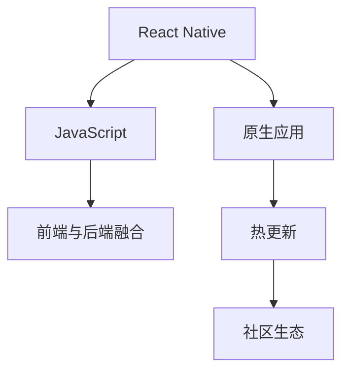

                 

# React Native：构建跨平台移动应用程序

> 关键词：React Native, 跨平台, 移动应用开发, 前端与后端融合, 社区生态, 开发者工具

## 1. 背景介绍

### 1.1 问题由来
在移动互联网时代，开发者们面临的最大挑战之一是如何高效地构建和维护跨平台移动应用。传统的跨平台解决方案，如Web技术、C++等，存在开发效率低、用户体验差等问题。于是，React Native应运而生，成为了跨平台移动应用开发的新宠。React Native由Facebook在2015年开源，它基于React框架，采用了热更新等技术，能够实现高效、一致的跨平台开发体验。

### 1.2 问题核心关键点
React Native的核心在于其能够利用JavaScript和React框架，实现原生应用级别的性能和用户体验。React Native的主要特点包括：

- **跨平台**：使用一套代码，能够在iOS和Android上编译成原生应用。
- **前端与后端融合**：开发者可以在同一个代码库中，同时管理前端和后端。
- **热更新**：能够实时更新应用的UI和逻辑，提升开发效率和用户体验。
- **社区生态**：拥有一个庞大的开发者社区，丰富的组件库和工具支持。

这些特点使得React Native成为跨平台开发的首选技术，广泛应用于电商、社交、游戏等多个领域。

## 2. 核心概念与联系

### 2.1 核心概念概述

为了更好地理解React Native，本节将介绍几个密切相关的核心概念：

- **React Native**：基于React框架的跨平台移动应用开发框架，能够利用JavaScript和React，实现原生应用的性能和体验。
- **JavaScript**：React Native的主要编程语言，提供了一个统一的编程模型，使得前端和后端的代码能够无缝融合。
- **原生应用**：指仅在特定操作系统上运行的移动应用，拥有原生的UI组件和性能表现。
- **热更新**：在应用运行时，通过网络实时更新应用代码，使得开发者能够快速迭代和发布应用。
- **社区生态**：包括开源组件、第三方工具、插件、文档等，为React Native提供丰富的资源支持。

这些核心概念之间的逻辑关系可以通过以下Mermaid流程图来展示：



这个流程图展示出React Native的核心概念及其之间的关系：

1. React Native基于JavaScript和React构建，能够实现原生应用的性能和用户体验。
2. JavaScript提供了一个统一的编程模型，使得前端和后端的代码能够无缝融合。
3. 原生应用仅在特定操作系统上运行，拥有原生的UI组件和性能表现。
4. 热更新能够在应用运行时实时更新代码，提升开发效率和用户体验。
5. 社区生态提供丰富的资源支持，帮助开发者快速开发和发布应用。

## 3. 核心算法原理 & 具体操作步骤
### 3.1 算法原理概述

React Native的算法原理主要基于组件和桥接技术。开发者可以通过React Native提供的组件API，构建自定义UI界面。这些组件由React Native框架中的Bridge层转换成原生代码，并在原生平台上运行。

React Native中的Bridge层是React Native与原生平台之间的桥梁，负责处理JavaScript和原生平台之间的数据传输和调用。Bridge层通过实现JSI（JavaScript Inspector）协议，将React Native中的JavaScript代码转换成原生代码，并在原生平台上运行。

React Native的算法原理可以概括为：

- 开发者使用JavaScript和React框架编写应用代码。
- React Native通过Bridge层将JavaScript代码转换成原生代码。
- 原生平台运行原生代码，实现应用的UI和业务逻辑。
- 应用通过Bridge层与JavaScript进行数据传输和调用。

### 3.2 算法步骤详解

使用React Native构建跨平台移动应用的一般步骤如下：

**Step 1: 准备开发环境**
- 安装Node.js和npm。
- 安装React Native CLI和相应的构建工具。
- 搭建模拟器和调试工具。

**Step 2: 创建新项目**
- 使用React Native CLI创建新的项目。
- 配置项目的依赖包。

**Step 3: 编写代码**
- 使用JavaScript和React框架编写应用代码。
- 设计UI界面，使用React Native提供的组件API。

**Step 4: 打包应用**
- 使用React Native CLI打包应用，生成原生代码。
- 在模拟器或真机上运行应用。

**Step 5: 热更新和调试**
- 在应用运行时，通过网络实时更新代码。
- 使用React Native提供的调试工具，进行代码调试和性能分析。

### 3.3 算法优缺点

React Native的优势在于其跨平台开发效率高，开发体验一致，能够快速迭代和更新。但是，它也存在一些局限性：

- **性能瓶颈**：尽管React Native能够实现较好的性能，但在一些高交互的应用场景中，性能表现可能不如原生应用。
- **组件兼容性**：由于React Native和原生平台的UI组件差异较大，一些原生组件可能无法直接使用，需要手动适配。
- **学习曲线**：React Native需要开发者掌握JavaScript和React框架，学习曲线较陡峭。

尽管存在这些局限性，但就目前而言，React Native仍然是跨平台开发的首选技术。未来，React Native需要不断优化性能，提升组件兼容性，降低学习曲线，才能进一步扩展其应用范围。

### 3.4 算法应用领域

React Native在各个领域的应用非常广泛，以下是几个典型的应用场景：

- **电商应用**：如淘宝、京东等电商平台，利用React Native实现了高效、一致的跨平台体验。
- **社交应用**：如微信、QQ等社交应用，通过React Native提升了应用的开发效率和用户体验。
- **游戏应用**：如Supercell的《部落冲突》等游戏，利用React Native实现了跨平台的快速迭代和更新。
- **企业应用**：如阿里巴巴的钉钉、字节跳动的飞书等企业应用，通过React Native提高了应用的开发效率和维护性能。
- **新闻应用**：如今日头条、知乎等新闻应用，利用React Native提升了应用的性能和用户体验。

这些应用场景展示了React Native在跨平台开发中的强大优势和广泛适用性。

## 4. 数学模型和公式 & 详细讲解 & 举例说明

### 4.1 数学模型构建

React Native的数学模型主要基于JavaScript和React框架。React Native通过Bridge层将JavaScript代码转换成原生代码，并在原生平台上运行。开发者使用JavaScript编写应用代码，利用React框架实现组件管理和数据流动。

React Native的数学模型可以概括为：

- 开发者使用JavaScript和React框架编写应用代码。
- React Native通过Bridge层将JavaScript代码转换成原生代码。
- 原生平台运行原生代码，实现应用的UI和业务逻辑。
- 应用通过Bridge层与JavaScript进行数据传输和调用。

### 4.2 公式推导过程

React Native的核心公式可以表示为：

$$
\text{React Native} = \text{JavaScript} + \text{React} + \text{Bridge}
$$

其中，JavaScript是React Native的主要编程语言，提供了一个统一的编程模型，使得前端和后端的代码能够无缝融合。React框架实现了组件管理和数据流动，使得开发者能够高效地构建和维护应用的UI界面。Bridge层是React Native与原生平台之间的桥梁，负责处理JavaScript和原生平台之间的数据传输和调用。

### 4.3 案例分析与讲解

以下是一个简单的React Native应用案例，用于演示如何使用React Native构建跨平台移动应用：

```javascript
import React, { useState } from 'react';
import { View, Text, StyleSheet } from 'react-native';

export default function App() {
  const [count, setCount] = useState(0);
  return (
    <View style={styles.container}>
      <Text style={styles.title}>React Native Counter</Text>
      <Text style={styles.text}>{count}</Text>
      <Button style={styles.button} onPress={() => setCount(count + 1)}>
        Increase
      </Button>
      <Button style={styles.button} onPress={() => setCount(count - 1)}>
        Decrease
      </Button>
    </View>
  );
}

const styles = StyleSheet.create({
  container: {
    flex: 1,
    justifyContent: 'center',
    alignItems: 'center',
  },
  title: {
    fontSize: 24,
    fontWeight: 'bold',
  },
  text: {
    fontSize: 20,
  },
  button: {
    padding: 10,
    backgroundColor: '#2196F3',
    color: '#fff',
    borderRadius: 5,
  },
});
```

在上述代码中，开发者使用React和JavaScript编写了一个简单的计数器应用。该应用通过React组件和状态管理，实现了用户界面的展示和交互。通过Bridge层，React Native将JavaScript代码转换成原生代码，并在原生平台上运行。

## 5. 项目实践：代码实例和详细解释说明
### 5.1 开发环境搭建

在进行React Native开发前，需要先搭建开发环境。以下是搭建React Native开发环境的步骤：

1. 安装Node.js和npm。可以通过官方网站下载和安装。
2. 安装React Native CLI和其他构建工具。可以通过npm全局安装React Native CLI和其他依赖包。
3. 搭建模拟器和调试工具。可以使用iOS的Xcode和Android的Android Studio进行开发和调试。

### 5.2 源代码详细实现

下面是一个简单的React Native应用示例，用于演示如何使用React Native构建跨平台移动应用：

```javascript
import React, { useState } from 'react';
import { View, Text, StyleSheet, Button } from 'react-native';

export default function App() {
  const [count, setCount] = useState(0);
  return (
    <View style={styles.container}>
      <Text style={styles.title}>React Native Counter</Text>
      <Text style={styles.text}>{count}</Text>
      <Button style={styles.button} onPress={() => setCount(count + 1)}>
        Increase
      </Button>
      <Button style={styles.button} onPress={() => setCount(count - 1)}>
        Decrease
      </Button>
    </View>
  );
}

const styles = StyleSheet.create({
  container: {
    flex: 1,
    justifyContent: 'center',
    alignItems: 'center',
  },
  title: {
    fontSize: 24,
    fontWeight: 'bold',
  },
  text: {
    fontSize: 20,
  },
  button: {
    padding: 10,
    backgroundColor: '#2196F3',
    color: '#fff',
    borderRadius: 5,
  },
});
```

### 5.3 代码解读与分析

让我们再详细解读一下关键代码的实现细节：

**App组件**：
- 使用React和JavaScript编写一个简单的计数器应用。
- 通过useState钩子管理应用的状态，实现计数器的增加和减少功能。
- 使用React Native提供的组件API，构建应用的UI界面。

**StyleSheet**：
- 定义了应用的样式，包括标题、文本和按钮的样式。
- 使用StyleSheet.create方法创建样式对象，方便组件的样式管理。

**Button组件**：
- 使用React Native提供的Button组件，实现计数器的增加和减少功能。
- 通过onPress事件监听器，更新应用的状态。

**运行结果展示**：
- 运行应用后，可以在模拟器或真机上看到计数器的展示效果。
- 点击按钮，计数器的数值会实时增加或减少。
- 通过Bridge层，React Native将JavaScript代码转换成原生代码，并在原生平台上运行，实现了跨平台应用的性能和用户体验。

## 6. 实际应用场景
### 6.1 电商应用

电商应用是React Native的重要应用场景之一。电商应用需要支持多种设备和操作系统，提供一致的购物体验。使用React Native，电商应用可以高效、一致地开发和维护，提升用户体验。

在实际应用中，电商平台可以利用React Native构建商品展示、购物车、结算等页面。React Native的组件和样式管理系统，使得开发者能够快速构建和优化应用的界面和交互。通过热更新技术，电商平台可以实时更新应用，提升开发效率和用户体验。

### 6.2 社交应用

社交应用是React Native的另一个重要应用场景。社交应用需要支持多种设备和操作系统，提供一致的用户体验。使用React Native，社交应用可以高效、一致地开发和维护，提升用户体验。

在实际应用中，社交应用可以利用React Native构建聊天界面、朋友圈、动态等页面。React Native的组件和样式管理系统，使得开发者能够快速构建和优化应用的界面和交互。通过热更新技术，社交应用可以实时更新应用，提升开发效率和用户体验。

### 6.3 游戏应用

游戏应用是React Native的另一个重要应用场景。游戏应用需要支持多种设备和操作系统，提供一致的游戏体验。使用React Native，游戏应用可以高效、一致地开发和维护，提升用户体验。

在实际应用中，游戏应用可以利用React Native构建游戏界面、角色控制、场景渲染等页面。React Native的组件和样式管理系统，使得开发者能够快速构建和优化应用的界面和交互。通过热更新技术，游戏应用可以实时更新应用，提升开发效率和用户体验。

### 6.4 企业应用

企业应用是React Native的另一个重要应用场景。企业应用需要支持多种设备和操作系统，提供一致的业务支持。使用React Native，企业应用可以高效、一致地开发和维护，提升用户体验。

在实际应用中，企业应用可以利用React Native构建内部协作、项目管理、财务审批等页面。React Native的组件和样式管理系统，使得开发者能够快速构建和优化应用的界面和交互。通过热更新技术，企业应用可以实时更新应用，提升开发效率和用户体验。

### 6.5 新闻应用

新闻应用是React Native的另一个重要应用场景。新闻应用需要支持多种设备和操作系统，提供一致的阅读体验。使用React Native，新闻应用可以高效、一致地开发和维护，提升用户体验。

在实际应用中，新闻应用可以利用React Native构建文章展示、评论互动、订阅管理等页面。React Native的组件和样式管理系统，使得开发者能够快速构建和优化应用的界面和交互。通过热更新技术，新闻应用可以实时更新应用，提升开发效率和用户体验。

## 7. 工具和资源推荐
### 7.1 学习资源推荐

为了帮助开发者系统掌握React Native的理论基础和实践技巧，这里推荐一些优质的学习资源：

1. React Native官方文档：官方文档是学习React Native的必备资源，涵盖了React Native的基础知识和高级特性。
2. React Native中文网：一个优秀的中文社区，提供了丰富的学习资源和教程，帮助开发者快速上手React Native。
3. Udemy上的React Native课程：Udemy上的React Native课程，涵盖从入门到高级的各个方面，适合初学者和进阶开发者学习。
4. Coursera上的React Native课程：Coursera上的React Native课程，由业内专家授课，内容深入浅出，适合系统学习React Native。
5. 《React Native官方指南》书籍：官方指南是React Native的学习参考资料，提供了详细的实践案例和开发技巧。

通过对这些资源的学习实践，相信你一定能够快速掌握React Native的精髓，并用于解决实际的移动开发问题。

### 7.2 开发工具推荐

高效的开发离不开优秀的工具支持。以下是几款用于React Native开发的常用工具：

1. Xcode：iOS平台上的开发工具，提供了丰富的模拟器和调试工具。
2. Android Studio：Android平台上的开发工具，提供了丰富的模拟器和调试工具。
3. React Native CLI：React Native的命令行工具，提供了创建、打包、测试等自动化命令。
4. Expo：一个基于React Native的开发平台，提供了便捷的开发环境和组件库。
5. React Native Elements：一个优秀的React Native组件库，提供了丰富的UI组件，方便开发者快速构建应用。

合理利用这些工具，可以显著提升React Native应用的开发效率，加快创新迭代的步伐。

### 7.3 相关论文推荐

React Native自开源以来，得到了学界的持续关注和研究。以下是几篇代表性的相关论文，推荐阅读：

1. "React Native: A Framework for Building Native Mobile Apps with JavaScript and React"：React Native的论文，介绍了React Native的核心架构和技术实现。
2. "A Comparative Study of Cross-Platform Mobile App Development Frameworks"：比较了多种跨平台开发框架，包括React Native、Ionic等，指出了React Native的优势和局限性。
3. "Evaluating the Performance of React Native Applications on iOS and Android Platforms"：评估了React Native应用在iOS和Android平台上的性能表现，指出了性能优化的方向。
4. "A Survey on Cross-Platform Mobile App Development with React Native"：综述了React Native的研究现状和发展趋势，提供了丰富的参考资料。

这些论文代表了React Native的研究进展，帮助开发者深入理解React Native的核心技术和应用场景。

## 8. 总结：未来发展趋势与挑战
### 8.1 总结

本文对React Native的开发方法和应用场景进行了全面系统的介绍。首先阐述了React Native的背景和核心概念，明确了React Native在跨平台开发中的重要作用。其次，从原理到实践，详细讲解了React Native的核心算法原理和具体操作步骤，给出了React Native开发任务的完整代码实例。同时，本文还广泛探讨了React Native在电商、社交、游戏等多个领域的应用前景，展示了React Native的广泛适用性。此外，本文精选了React Native的学习资源，力求为读者提供全方位的技术指引。

通过本文的系统梳理，可以看到，React Native通过JavaScript和React框架，实现了高效、一致的跨平台开发体验。利用Bridge层和热更新技术，React Native能够实现原生应用级别的性能和用户体验。未来，React Native需要在性能、组件兼容性和学习曲线等方面进行持续优化，才能进一步拓展其应用范围。

### 8.2 未来发展趋势

展望未来，React Native将呈现以下几个发展趋势：

1. **性能提升**：React Native将在性能方面进行持续优化，提升应用的用户体验。
2. **组件扩展**：React Native将不断扩展其组件库，提供更丰富的UI组件和样式管理系统。
3. **开发工具完善**：React Native将不断完善其开发工具和插件，提升开发效率和用户体验。
4. **生态系统扩展**：React Native将不断扩展其社区生态，提供更多优秀的第三方工具和组件。
5. **跨平台性能**：React Native将进一步提升其在跨平台上的性能表现，减少与原生应用的差距。

以上趋势将引领React Native技术向更高的台阶发展，为跨平台开发提供更高效、更灵活、更一致的解决方案。

### 8.3 面临的挑战

尽管React Native已经取得了显著的进展，但在迈向更加智能化、普适化应用的过程中，它仍面临诸多挑战：

1. **性能瓶颈**：尽管React Native能够实现较好的性能，但在一些高交互的应用场景中，性能表现可能不如原生应用。
2. **组件兼容性**：由于React Native和原生平台的UI组件差异较大，一些原生组件可能无法直接使用，需要手动适配。
3. **学习曲线**：React Native需要开发者掌握JavaScript和React框架，学习曲线较陡峭。
4. **社区生态**：虽然React Native拥有一个庞大的社区，但在某些复杂场景下，仍可能面临组件和工具不足的问题。
5. **跨平台一致性**：React Native需要进一步提升在不同平台上的一致性，避免出现平台特有的bug和性能问题。

这些挑战需要通过技术创新和社区合作来解决，才能实现React Native的进一步发展。

### 8.4 研究展望

未来，React Native的研究方向可以从以下几个方面进行探索：

1. **性能优化**：在性能方面进行持续优化，提升应用的用户体验。
2. **组件扩展**：不断扩展其组件库，提供更丰富的UI组件和样式管理系统。
3. **开发工具完善**：完善其开发工具和插件，提升开发效率和用户体验。
4. **跨平台性能**：进一步提升其在跨平台上的性能表现，减少与原生应用的差距。
5. **生态系统扩展**：扩展其社区生态，提供更多优秀的第三方工具和组件。

这些研究方向将推动React Native技术向更高的台阶发展，为跨平台开发提供更高效、更灵活、更一致的解决方案。

## 9. 附录：常见问题与解答

**Q1：React Native是如何实现跨平台开发的？**

A: React Native通过Bridge层将JavaScript代码转换成原生代码，并在原生平台上运行。开发者使用JavaScript和React框架编写应用代码，利用Bridge层实现与原生平台的交互。React Native提供了丰富的组件和样式管理系统，使得开发者能够快速构建和优化应用的界面和交互。

**Q2：React Native有哪些优势和局限性？**

A: React Native的优势在于其跨平台开发效率高，开发体验一致，能够快速迭代和更新。其局限性包括性能瓶颈、组件兼容性、学习曲线等问题。

**Q3：如何使用React Native构建跨平台移动应用？**

A: 使用React Native构建跨平台移动应用的步骤包括：
1. 准备开发环境，安装Node.js、npm、React Native CLI等工具。
2. 创建新项目，使用React Native CLI创建项目。
3. 编写代码，使用JavaScript和React框架编写应用代码。
4. 打包应用，使用React Native CLI打包应用，生成原生代码。
5. 运行应用，在模拟器或真机上运行应用。
6. 热更新和调试，在应用运行时，通过网络实时更新代码。

**Q4：React Native在哪些领域有广泛应用？**

A: React Native在电商、社交、游戏、企业应用、新闻应用等多个领域有广泛应用。通过React Native，开发者可以高效、一致地开发和维护跨平台应用，提升用户体验。

**Q5：React Native的未来发展方向是什么？**

A: React Native的未来发展方向包括性能提升、组件扩展、开发工具完善、生态系统扩展和跨平台性能等方面。这些方向将推动React Native技术向更高的台阶发展，为跨平台开发提供更高效、更灵活、更一致的解决方案。

---

作者：禅与计算机程序设计艺术 / Zen and the Art of Computer Programming

