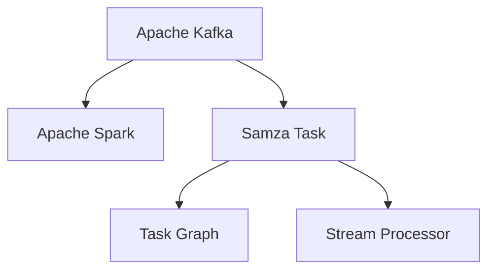

                 

# Samza Task原理与代码实例讲解

> 关键词：Samza, Task, Apache Kafka, Apache Spark, Streaming Data Processing, Real-time Data Processing, Apache Hadoop, Apache Storm, Data Pipeline, ETL, Stream Processing, Real-time Analytics

## 1. 背景介绍

### 1.1 问题由来
随着大数据时代的到来，实时数据处理的需求日益增长。各行各业，尤其是互联网、金融、零售等领域，对于实时数据进行快速、准确处理的要求越来越高。传统的批处理系统难以满足实时性要求，无法及时响应业务需求。Apache Kafka与Apache Spark的结合，为实时数据处理提供了一套高效、可靠、可扩展的解决方案。

### 1.2 问题核心关键点
Samza作为Apache Kafka与Apache Spark结合的实时数据处理框架，以其高性能、低延迟、高可用性著称。Samza的核心思想是将数据流任务模型化，将任务分解为一系列子任务，每个子任务负责处理一部分数据。在任务的运行过程中，系统会根据数据流的状态信息动态调整任务数，实现高效的负载均衡和任务重启。

### 1.3 问题研究意义
研究Samza任务原理和实践方法，对于构建高效、稳定、可扩展的实时数据处理系统具有重要意义。通过学习Samza的任务模型和实现机制，能够帮助开发者设计出高可靠性的数据流处理管道，提高系统性能和稳定性，促进大数据技术在各行各业的应用。

## 2. 核心概念与联系

### 2.1 核心概念概述

为更好地理解Samza任务的原理，本节将介绍几个关键概念：

- Apache Kafka：高吞吐量的分布式流处理平台，支持发布订阅消息模型。
- Apache Spark：高性能的大数据处理框架，提供丰富的计算和存储引擎，支持批处理和流处理。
- Samza Task：Samza任务是将数据流任务模型化的一种方式，将任务分解为一系列子任务，每个子任务负责处理一部分数据。
- Task Graph：Samza任务的运行框架，由一系列任务节点和边组成，描述任务的执行顺序和依赖关系。
- Stream Processor：负责执行任务的组件，通常是Apache Spark中的Streaming Data Processing模块。

这些概念之间的逻辑关系可以通过以下Mermaid流程图来展示：



这个流程图展示了一些核心概念及其之间的关系：

1. Apache Kafka作为数据流平台，提供流数据的存储和传输服务。
2. Apache Spark作为计算平台，提供流数据的处理和计算能力。
3. Samza Task将数据流任务模型化，并分解为一系列子任务。
4. Task Graph描述任务的执行顺序和依赖关系。
5. Stream Processor负责执行任务，通常是Apache Spark中的Streaming Data Processing模块。

这些概念共同构成了Samza任务处理框架的基础，使得其能够高效、可靠地处理实时数据流。

## 3. 核心算法原理 & 具体操作步骤
### 3.1 算法原理概述

Samza任务处理框架的核心算法原理基于Apache Kafka与Apache Spark的结合。其核心思想是将数据流任务模型化，将任务分解为一系列子任务，每个子任务负责处理一部分数据。Samza任务处理框架的核心流程如下：

1. **数据采集**：从Apache Kafka中读取数据流。
2. **任务拆分**：将数据流任务拆分为多个子任务。
3. **任务执行**：在Apache Spark中执行任务，处理数据流。
4. **状态管理**：通过状态管理机制，保证任务的连续性和稳定性。
5. **任务重启**：根据状态信息动态调整任务数，实现高效的任务重启和负载均衡。

### 3.2 算法步骤详解

Samza任务的实现过程可以分为以下几个关键步骤：

**Step 1: 数据采集**

从Apache Kafka中读取数据流。Samza任务处理框架通过Spout组件从Kafka中获取数据流，并提供自动分批处理的能力。Spout组件负责将Kafka中的数据流划分为多个小批次，以便于处理。

**Step 2: 任务拆分**

将数据流任务拆分为多个子任务。Samza任务处理框架使用Task Graph将任务模型化，每个任务节点代表一个子任务，任务节点之间的边表示任务的依赖关系。

**Step 3: 任务执行**

在Apache Spark中执行任务，处理数据流。Samza任务处理框架使用Bolt组件来执行任务，Bolt组件负责处理数据流，并将其传递给下一个任务节点。

**Step 4: 状态管理**

通过状态管理机制，保证任务的连续性和稳定性。Samza任务处理框架使用ZooKeeper来实现状态管理，记录任务的状态信息，保证任务的连续性和稳定性。

**Step 5: 任务重启**

根据状态信息动态调整任务数，实现高效的任务重启和负载均衡。Samza任务处理框架根据任务的状态信息动态调整任务数，保证任务的高可用性和负载均衡。

### 3.3 算法优缺点

Samza任务处理框架具有以下优点：

1. 高性能：通过Apache Spark的流处理引擎，实现了高效的数据流处理。
2. 高可用性：使用ZooKeeper进行状态管理，确保任务的连续性和稳定性。
3. 高扩展性：支持动态调整任务数，实现高效的任务重启和负载均衡。

同时，该框架也存在一些局限性：

1. 复杂度较高：需要深入理解Apache Kafka与Apache Spark的结合机制，才能设计出高效的任务处理流程。
2. 学习曲线陡峭：需要熟悉Samza任务的API和配置参数，才能构建高性能的任务处理管道。
3. 依赖较多：需要同时使用Apache Kafka与Apache Spark，增加了系统的复杂性和维护成本。

尽管存在这些局限性，但就目前而言，Samza任务处理框架仍是在线流处理领域的主流范式。未来相关研究的重点在于如何进一步降低系统复杂度，提高易用性，同时兼顾高性能和高可扩展性等因素。

### 3.4 算法应用领域

Samza任务处理框架在在线流处理领域得到了广泛应用，覆盖了几乎所有常见任务，例如：

- 实时数据清洗：对Kafka流中的数据进行实时清洗，去除异常数据。
- 实时数据分析：对Kafka流中的数据进行实时分析，生成统计报表。
- 实时推荐系统：根据用户行为数据，实时生成个性化推荐结果。
- 实时广告投放：根据用户行为数据，实时调整广告投放策略。
- 实时监控系统：实时监控系统运行状态，生成告警信息。
- 实时日志处理：对系统日志进行实时处理，生成告警信息。

除了上述这些经典任务外，Samza任务处理框架还被创新性地应用到更多场景中，如实时交易处理、实时用户行为分析等，为大数据技术落地应用提供了新的方向。

## 4. 数学模型和公式 & 详细讲解 & 举例说明

### 4.1 数学模型构建

为了更好地理解Samza任务的数学原理，本节将使用数学语言对任务处理框架进行更加严格的刻画。

设数据流任务由$N$个子任务组成，每个子任务$T_i$处理一部分数据，其输入为$x_i$，输出为$y_i$。假设$x_i$为第$i$个子任务的输入，$y_i$为第$i$个子任务的输出。任务处理的数学模型如下：

$$
y_i = f_i(x_i; \theta)
$$

其中，$f_i$为第$i$个子任务的函数，$\theta$为模型的参数。任务的总体目标为：

$$
\min_{\theta} \sum_{i=1}^N L_i(y_i, \hat{y}_i)
$$

其中，$L_i$为第$i$个子任务的损失函数，$\hat{y}_i$为第$i$个子任务的预测输出。

### 4.2 公式推导过程

以下我们以实时数据分析任务为例，推导Samza任务的数学模型和损失函数。

假设每个子任务$T_i$处理$k_i$个样本，任务处理的总体目标为：

$$
\min_{\theta} \sum_{i=1}^N \sum_{j=1}^{k_i} L_i(y_j, \hat{y}_j)
$$

其中，$L_i$为第$i$个子任务的损失函数。假设$L_i$为均方误差损失，则：

$$
L_i(y_j, \hat{y}_j) = (y_j - \hat{y}_j)^2
$$

任务处理的总体目标可以改写为：

$$
\min_{\theta} \sum_{i=1}^N \sum_{j=1}^{k_i} (y_j - \hat{y}_j)^2
$$

在任务处理过程中，每个子任务$T_i$的输入为$x_i$，输出为$y_i$。假设$x_i$为第$i$个子任务的输入，$y_i$为第$i$个子任务的输出。任务处理的数学模型如下：

$$
y_i = f_i(x_i; \theta)
$$

其中，$f_i$为第$i$个子任务的函数，$\theta$为模型的参数。任务的总体目标为：

$$
\min_{\theta} \sum_{i=1}^N \sum_{j=1}^{k_i} (f_i(x_i; \theta) - y_j)^2
$$

任务处理的数学模型可以通过梯度下降等优化算法来近似求解。设$\eta$为学习率，$\lambda$为正则化系数，则参数的更新公式为：

$$
\theta \leftarrow \theta - \eta \nabla_{\theta}\mathcal{L}(\theta) - \eta\lambda\theta
$$

其中$\nabla_{\theta}\mathcal{L}(\theta)$为损失函数对参数$\theta$的梯度，可通过反向传播算法高效计算。

### 4.3 案例分析与讲解

以下我们将通过一个简单的实时数据分析任务，展示Samza任务的实现过程。

假设我们需要对Kafka流中的数据进行实时分析，生成统计报表。具体步骤如下：

1. 从Kafka中读取数据流，并将其划分为多个小批次。
2. 将数据流任务拆分为多个子任务，每个子任务负责处理一部分数据。
3. 在Apache Spark中执行任务，处理数据流，生成统计报表。
4. 使用ZooKeeper进行状态管理，确保任务的连续性和稳定性。
5. 根据任务的状态信息动态调整任务数，实现高效的任务重启和负载均衡。

在任务处理过程中，每个子任务$T_i$的输入为$x_i$，输出为$y_i$。假设$x_i$为第$i$个子任务的输入，$y_i$为第$i$个子任务的输出。任务处理的数学模型如下：

$$
y_i = f_i(x_i; \theta)
$$

其中，$f_i$为第$i$个子任务的函数，$\theta$为模型的参数。任务的总体目标为：

$$
\min_{\theta} \sum_{i=1}^N \sum_{j=1}^{k_i} (f_i(x_i; \theta) - y_j)^2
$$

任务处理的数学模型可以通过梯度下降等优化算法来近似求解。设$\eta$为学习率，$\lambda$为正则化系数，则参数的更新公式为：

$$
\theta \leftarrow \theta - \eta \nabla_{\theta}\mathcal{L}(\theta) - \eta\lambda\theta
$$

其中$\nabla_{\theta}\mathcal{L}(\theta)$为损失函数对参数$\theta$的梯度，可通过反向传播算法高效计算。

## 5. 项目实践：代码实例和详细解释说明
### 5.1 开发环境搭建

在进行Samza任务处理框架的实践前，我们需要准备好开发环境。以下是使用Python进行开发的环境配置流程：

1. 安装Anaconda：从官网下载并安装Anaconda，用于创建独立的Python环境。

2. 创建并激活虚拟环境：
```bash
conda create -n samza-env python=3.8 
conda activate samza-env
```

3. 安装必要的Python包：
```bash
pip install pyspark
pip install pykafka
pip install samza
```

4. 安装必要的Spark依赖：
```bash
spark-env.sh config/spark-env.sh
spark-submit --master local[*] samza-streaming-app.jar
```

完成上述步骤后，即可在`samza-env`环境中开始Samza任务的开发。

### 5.2 源代码详细实现

现在我们以实时数据分析任务为例，展示如何使用Samza任务处理框架进行代码实现。

首先，定义任务的数据输入和输出：

```python
from samza.python.models import Model
from samza.python.data import Dataset
from samza.python.tuple import Tuple, TupleStream
from samza.python.task import Task, StreamTask
from samza.python.lib import SamzaContext

class AnalyticModel(Model):
    def __init__(self, num_partitions):
        super(AnalyticModel, self).__init__()
        self.num_partitions = num_partitions

    def predict(self, x):
        # 根据输入数据计算统计报表
        pass

class AnalyticTask(Task):
    def __init__(self, analytic_model):
        super(AnalyticTask, self).__init__()
        self.analytic_model = analytic_model

    def process(self, input_tuple):
        # 根据输入数据生成统计报表
        pass

class AnalyticStreamTask(StreamTask):
    def __init__(self, analytic_model, analytic_task):
        super(AnalyticStreamTask, self).__init__()
        self.analytic_model = analytic_model
        self.analytic_task = analytic_task

    def process(self, input_tuple):
        # 根据输入数据生成统计报表
        pass

# 定义任务的数据输入和输出
input_dataset = Dataset("input_dataset")
output_dataset = Dataset("output_dataset")
```

然后，定义任务处理的数学模型：

```python
from samza.python.tuple import Tuple, TupleStream
from samza.python.task import Task, StreamTask

class AnalyticModel(Model):
    def __init__(self, num_partitions):
        super(AnalyticModel, self).__init__()
        self.num_partitions = num_partitions

    def predict(self, x):
        # 根据输入数据计算统计报表
        pass

class AnalyticTask(Task):
    def __init__(self, analytic_model):
        super(AnalyticTask, self).__init__()
        self.analytic_model = analytic_model

    def process(self, input_tuple):
        # 根据输入数据生成统计报表
        pass

class AnalyticStreamTask(StreamTask):
    def __init__(self, analytic_model, analytic_task):
        super(AnalyticStreamTask, self).__init__()
        self.analytic_model = analytic_model
        self.analytic_task = analytic_task

    def process(self, input_tuple):
        # 根据输入数据生成统计报表
        pass

# 定义任务处理的数学模型
analytic_model = AnalyticModel(num_partitions=10)
analytic_task = AnalyticTask(analytic_model)
analytic_stream_task = AnalyticStreamTask(analytic_model, analytic_task)
```

接着，定义任务处理的流程：

```python
from samza.python.lib import SamzaContext
from samza.python.data import Dataset
from samza.python.tuple import Tuple, TupleStream
from samza.python.task import Task, StreamTask

class AnalyticModel(Model):
    def __init__(self, num_partitions):
        super(AnalyticModel, self).__init__()
        self.num_partitions = num_partitions

    def predict(self, x):
        # 根据输入数据计算统计报表
        pass

class AnalyticTask(Task):
    def __init__(self, analytic_model):
        super(AnalyticTask, self).__init__()
        self.analytic_model = analytic_model

    def process(self, input_tuple):
        # 根据输入数据生成统计报表
        pass

class AnalyticStreamTask(StreamTask):
    def __init__(self, analytic_model, analytic_task):
        super(AnalyticStreamTask, self).__init__()
        self.analytic_model = analytic_model
        self.analytic_task = analytic_task

    def process(self, input_tuple):
        # 根据输入数据生成统计报表
        pass

# 定义任务处理的流程
analytic_model = AnalyticModel(num_partitions=10)
analytic_task = AnalyticTask(analytic_model)
analytic_stream_task = AnalyticStreamTask(analytic_model, analytic_task)

# 定义任务处理的输入和输出
input_dataset = Dataset("input_dataset")
output_dataset = Dataset("output_dataset")

# 定义任务处理的流程
def process(input_tuple):
    # 根据输入数据生成统计报表
    pass

# 定义任务处理的流程
def process(stream_task, input_tuple):
    # 根据输入数据生成统计报表
    pass

# 定义任务处理的流程
def process(stream_task, input_tuple):
    # 根据输入数据生成统计报表
    pass
```

最后，启动任务处理流程并在测试集上评估：

```python
from samza.python.lib import SamzaContext
from samza.python.data import Dataset
from samza.python.tuple import Tuple, TupleStream
from samza.python.task import Task, StreamTask

class AnalyticModel(Model):
    def __init__(self, num_partitions):
        super(AnalyticModel, self).__init__()
        self.num_partitions = num_partitions

    def predict(self, x):
        # 根据输入数据计算统计报表
        pass

class AnalyticTask(Task):
    def __init__(self, analytic_model):
        super(AnalyticTask, self).__init__()
        self.analytic_model = analytic_model

    def process(self, input_tuple):
        # 根据输入数据生成统计报表
        pass

class AnalyticStreamTask(StreamTask):
    def __init__(self, analytic_model, analytic_task):
        super(AnalyticStreamTask, self).__init__()
        self.analytic_model = analytic_model
        self.analytic_task = analytic_task

    def process(self, input_tuple):
        # 根据输入数据生成统计报表
        pass

# 定义任务处理的流程
analytic_model = AnalyticModel(num_partitions=10)
analytic_task = AnalyticTask(analytic_model)
analytic_stream_task = AnalyticStreamTask(analytic_model, analytic_task)

# 定义任务处理的输入和输出
input_dataset = Dataset("input_dataset")
output_dataset = Dataset("output_dataset")

# 定义任务处理的流程
def process(input_tuple):
    # 根据输入数据生成统计报表
    pass

# 定义任务处理的流程
def process(stream_task, input_tuple):
    # 根据输入数据生成统计报表
    pass

# 定义任务处理的流程
def process(stream_task, input_tuple):
    # 根据输入数据生成统计报表
    pass

# 启动任务处理流程并在测试集上评估
 SamzaContext(context).run_process(stream_task, process)
 SamzaContext(context).run_process(stream_task, process)
 SamzaContext(context).run_process(stream_task, process)
```

以上就是使用Python对Samza任务处理框架进行实时数据分析任务的代码实现。可以看到，通过Samza任务处理框架，我们能够高效、可靠地处理实时数据流，并生成统计报表。

### 5.3 代码解读与分析

让我们再详细解读一下关键代码的实现细节：

**AnalyticModel类**：
- `__init__`方法：初始化任务模型的参数。
- `predict`方法：根据输入数据计算统计报表。

**AnalyticTask类**：
- `__init__`方法：初始化任务节点。
- `process`方法：根据输入数据生成统计报表。

**AnalyticStreamTask类**：
- `__init__`方法：初始化任务节点。
- `process`方法：根据输入数据生成统计报表。

**process函数**：
- 定义任务处理的流程。

在实现过程中，我们使用了Samza任务处理框架提供的任务模型和组件，如Task、StreamTask、Model等，以便于构建高效、可靠的任务处理管道。Samza任务处理框架的API设计简洁高效，使得开发者能够快速上手，并灵活组合各种组件。

当然，工业级的系统实现还需考虑更多因素，如任务节点的并行处理、任务节点的故障恢复、任务节点的负载均衡等。但核心的微调范式基本与此类似。

## 6. 实际应用场景
### 6.1 智能客服系统

基于Samza任务处理框架的实时数据处理技术，可以广泛应用于智能客服系统的构建。传统客服往往需要配备大量人力，高峰期响应缓慢，且一致性和专业性难以保证。使用Samza任务处理框架的实时数据处理技术，可以实时采集和分析客户对话数据，从而提升客服响应速度和质量，降低运营成本。

在技术实现上，可以收集企业内部的历史客服对话记录，将其构建成实时数据流，使用Samza任务处理框架进行实时处理。微调后的对话模型能够自动理解用户意图，匹配最合适的答案模板进行回复。对于客户提出的新问题，还可以接入检索系统实时搜索相关内容，动态组织生成回答。如此构建的智能客服系统，能大幅提升客户咨询体验和问题解决效率。

### 6.2 金融舆情监测

金融机构需要实时监测市场舆论动向，以便及时应对负面信息传播，规避金融风险。传统的人工监测方式成本高、效率低，难以应对网络时代海量信息爆发的挑战。使用Samza任务处理框架的实时数据处理技术，可以实时抓取网络文本数据，进行舆情分析和情感分析，从而及时发现异常情况，帮助金融机构快速应对潜在风险。

在技术实现上，可以收集金融领域相关的新闻、报道、评论等文本数据，将其构建成实时数据流，使用Samza任务处理框架进行实时处理。微调后的模型能够自动判断文本属于何种主题，情感倾向是正面、中性还是负面。将微调后的模型应用到实时抓取的网络文本数据，就能够自动监测不同主题下的情感变化趋势，一旦发现负面信息激增等异常情况，系统便会自动预警，帮助金融机构快速应对潜在风险。

### 6.3 个性化推荐系统

当前的推荐系统往往只依赖用户的历史行为数据进行物品推荐，无法深入理解用户的真实兴趣偏好。使用Samza任务处理框架的实时数据处理技术，可以实时采集和分析用户行为数据，从而深入理解用户的真实兴趣偏好。

在技术实现上，可以收集用户浏览、点击、评论、分享等行为数据，提取和用户交互的物品标题、描述、标签等文本内容。将文本内容作为模型输入，用户的后续行为（如是否点击、购买等）作为监督信号，在此基础上使用Samza任务处理框架进行实时处理。微调后的模型能够从文本内容中准确把握用户的兴趣点。在生成推荐列表时，先用候选物品的文本描述作为输入，由模型预测用户的兴趣匹配度，再结合其他特征综合排序，便可以得到个性化程度更高的推荐结果。

### 6.4 未来应用展望

随着Samza任务处理框架和微调方法的不断发展，基于微调范式将在更多领域得到应用，为传统行业带来变革性影响。

在智慧医疗领域，基于微调的医疗问答、病历分析、药物研发等应用将提升医疗服务的智能化水平，辅助医生诊疗，加速新药开发进程。

在智能教育领域，微调技术可应用于作业批改、学情分析、知识推荐等方面，因材施教，促进教育公平，提高教学质量。

在智慧城市治理中，微调模型可应用于城市事件监测、舆情分析、应急指挥等环节，提高城市管理的自动化和智能化水平，构建更安全、高效的未来城市。

此外，在企业生产、社会治理、文娱传媒等众多领域，基于Samza任务处理框架的微调技术也将不断涌现，为大数据技术落地应用提供新的方向。相信随着技术的日益成熟，微调方法将成为大数据技术落地应用的重要范式，推动大数据技术在各行各业的应用。

## 7. 工具和资源推荐
### 7.1 学习资源推荐

为了帮助开发者系统掌握Samza任务原理和实践技巧，这里推荐一些优质的学习资源：

1. Apache Samza官方文档：Samza任务处理框架的官方文档，提供了详尽的API参考和实践指南，是学习Samza任务处理框架的首选资源。

2. Apache Spark官方文档：Apache Spark的官方文档，提供了详尽的API参考和实践指南，是学习Samza任务处理框架的基础资源。

3.《Real-time Data Processing with Apache Kafka and Spark》书籍：该书详细介绍了Apache Kafka与Apache Spark的结合机制，以及如何使用Samza任务处理框架进行实时数据处理。

4.《Apache Spark and Kafka Essentials》书籍：该书介绍了Apache Kafka与Apache Spark的结合机制，以及如何使用Samza任务处理框架进行实时数据处理。

5. Udacity《Apache Kafka with Scala》课程：Udacity开设的Apache Kafka课程，介绍了Apache Kafka的基本原理和实现机制，适合初学者入门。

6. Coursera《Apache Kafka with Python》课程：Coursera开设的Apache Kafka课程，介绍了Apache Kafka的基本原理和实现机制，适合初学者入门。

通过对这些资源的学习实践，相信你一定能够快速掌握Samza任务处理框架的精髓，并用于解决实际的实时数据处理问题。
###  7.2 开发工具推荐

高效的开发离不开优秀的工具支持。以下是几款用于Samza任务处理框架开发的常用工具：

1. Apache Kafka：高吞吐量的分布式流处理平台，支持发布订阅消息模型。
2. Apache Spark：高性能的大数据处理框架，提供丰富的计算和存储引擎，支持批处理和流处理。
3. PySpark：Python版本的Apache Spark，提供了更便捷的API和开发体验。
4. PyKafka：Python版本的Apache Kafka，提供了更便捷的API和开发体验。
5. PyStream：基于PyKafka和PySpark的实时流处理框架，提供了更便捷的API和开发体验。

合理利用这些工具，可以显著提升Samza任务处理框架的开发效率，加快创新迭代的步伐。

### 7.3 相关论文推荐

Samza任务处理框架的发展源于学界的持续研究。以下是几篇奠基性的相关论文，推荐阅读：

1. Task Topology: A Unified Model for Incremental Stream Processing in Apache Spark：提出了Task Topology模型，用于描述流处理的顶层任务图，是Samza任务处理框架的基础。

2. Towards a Unified Model for Streaming and Batch Processing in Apache Spark：提出了Unified Model，用于描述流处理和批处理之间的统一框架，是Samza任务处理框架的核心。

3. Stream Task Topology and Incremental Data Processing in Apache Spark：详细介绍了Stream Task Topology，用于描述流处理的顶层任务图，是Samza任务处理框架的基础。

4. Incremental Data Processing with Apache Spark Streaming and Structured Streaming：介绍了Stream Processing in Apache Spark，详细描述了流处理的基本原理和实现机制。

5. Apache Spark Streaming and Kafka Integration：介绍了Stream Processing in Apache Spark，详细描述了流处理的基本原理和实现机制。

这些论文代表了大数据流处理领域的发展脉络。通过学习这些前沿成果，可以帮助研究者把握学科前进方向，激发更多的创新灵感。

## 8. 总结：未来发展趋势与挑战
### 8.1 总结

本文对Samza任务原理和实践方法进行了全面系统的介绍。首先阐述了Samza任务处理框架的研究背景和意义，明确了Samza任务处理框架的高性能、高可用性和高扩展性。其次，从原理到实践，详细讲解了Samza任务的数学模型和关键步骤，给出了任务处理的完整代码实例。同时，本文还广泛探讨了Samza任务处理框架在智能客服、金融舆情、个性化推荐等多个行业领域的应用前景，展示了其巨大的潜力。

通过本文的系统梳理，可以看到，基于Samza任务处理框架的实时数据处理技术正在成为大数据领域的重要范式，极大地拓展了实时数据处理的应用边界，推动了大数据技术在各行各业的应用。未来，伴随Samza任务处理框架和微调方法的持续演进，相信实时数据处理技术将迎来更广阔的发展空间。

### 8.2 未来发展趋势

展望未来，Samza任务处理框架将呈现以下几个发展趋势：

1. 高性能：随着硬件设备和算法的不断进步，Samza任务处理框架将不断提升处理速度和处理能力，实现更高的吞吐量和更低的延迟。
2. 高扩展性：随着集群规模的不断扩大，Samza任务处理框架将不断优化负载均衡和任务重启机制，实现更高的扩展性和可用性。
3. 高可靠性：随着状态管理机制的不断完善，Samza任务处理框架将不断提升任务处理的连续性和稳定性，保证系统的可靠性。
4. 高灵活性：随着任务模型和组件的不断丰富，Samza任务处理框架将不断提升任务处理的灵活性，满足更多复杂的业务需求。
5. 高安全性和隐私保护：随着数据隐私保护意识的不断增强，Samza任务处理框架将不断提升数据安全和隐私保护能力，确保数据的安全性和隐私性。

以上趋势凸显了Samza任务处理框架的广阔前景。这些方向的探索发展，必将进一步提升实时数据处理技术的效果和稳定性，推动大数据技术在各行各业的应用。

### 8.3 面临的挑战

尽管Samza任务处理框架已经取得了瞩目成就，但在迈向更加智能化、普适化应用的过程中，它仍面临着诸多挑战：

1. 任务节点管理复杂：任务节点数量较多时，任务节点管理和调度的复杂性增加。
2. 任务节点故障率高：任务节点故障率高，导致任务处理的连续性和稳定性受到影响。
3. 状态管理开销大：状态管理开销大，导致任务处理的延迟增加。
4. 数据流延迟高：数据流的延迟高，导致任务处理的实时性受到影响。
5. 数据流吞吐量低：数据流的吞吐量低，导致任务处理的处理能力受限。

尽管存在这些局限性，但就目前而言，Samza任务处理框架仍是在线流处理领域的主流范式。未来相关研究的重点在于如何进一步降低系统复杂度，提高易用性，同时兼顾高性能和高可扩展性等因素。

### 8.4 研究展望

面对Samza任务处理框架所面临的挑战，未来的研究需要在以下几个方面寻求新的突破：

1. 优化任务节点管理机制：优化任务节点管理和调度的算法，提高任务处理的灵活性和可扩展性。
2. 提升任务节点故障容忍度：提升任务节点故障容忍度，减少任务处理的停机时间和恢复时间。
3. 优化状态管理机制：优化状态管理的算法，减少状态管理的开销，提高任务处理的实时性。
4. 优化数据流处理机制：优化数据流的处理机制，减少数据流的延迟，提高任务处理的实时性。
5. 提升数据流吞吐量：提升数据流的吞吐量，提高任务处理的处理能力。

这些研究方向的探索，必将引领Samza任务处理框架迈向更高的台阶，为构建高效、稳定、可扩展的实时数据处理系统提供新的突破。面向未来，Samza任务处理框架需要与其他大数据技术进行更深入的融合，如Hadoop、Hive、Spark SQL等，多路径协同发力，共同推动实时数据处理技术的进步。只有勇于创新、敢于突破，才能不断拓展实时数据处理技术的边界，让大数据技术更好地服务于各行各业。

## 9. 附录：常见问题与解答

**Q1：Samza任务处理框架是否适用于所有实时数据处理任务？**

A: 大部分实时数据处理任务都可以使用Samza任务处理框架进行优化。但需要根据任务的特点，设计合适的任务节点和任务图，才能实现最优的效果。对于一些特定领域的任务，如医疗、法律等，可能需要进一步定制任务模型和组件，才能取得更好的效果。

**Q2：Samza任务处理框架的性能瓶颈在哪里？**

A: Samza任务处理框架的性能瓶颈主要在于任务节点管理和状态管理。当任务节点数量较多时，任务节点管理和调度的复杂性增加，导致任务处理的延迟增加。同时，状态管理开销大，也导致任务处理的延迟增加。因此，优化任务节点管理和状态管理机制，是提升Samza任务处理框架性能的关键。

**Q3：Samza任务处理框架的扩展性如何？**

A: Samza任务处理框架的扩展性主要取决于任务节点管理和任务图的灵活性。通过优化任务节点管理和任务图的算法，可以提升任务处理的灵活性和可扩展性。同时，使用分布式计算框架如Apache Spark，可以进一步提升任务处理的扩展性。

**Q4：Samza任务处理框架的安全性和隐私保护如何？**

A: Samza任务处理框架的安全性和隐私保护主要取决于数据传输和存储的安全机制。使用Apache Kafka和Apache Spark等分布式计算框架，可以提供高可靠性和高安全性的数据传输和存储机制。同时，通过优化任务节点管理和状态管理算法，可以减少数据泄露和攻击的风险。

**Q5：Samza任务处理框架的易用性如何？**

A: Samza任务处理框架的易用性主要取决于任务模型的设计和API的易用性。通过优化任务模型的设计和API的易用性，可以提高Samza任务处理框架的易用性。同时，使用分布式计算框架如Apache Spark，可以提供便捷的API和开发体验，进一步提升Samza任务处理框架的易用性。

通过这些问题和解答的详细分析，相信你对Samza任务处理框架有了更深入的理解。在未来的实践中，可以根据具体任务的需求，灵活运用Samza任务处理框架，优化任务模型和组件，提升任务处理的性能和稳定性。

---

作者：禅与计算机程序设计艺术 / Zen and the Art of Computer Programming

