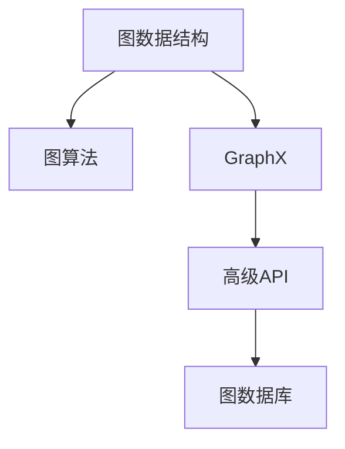

                 

# Spark GraphX图计算引擎原理与代码实例讲解

> 关键词：Spark GraphX,图计算,图处理,图算法,图数据库,代码实例,高级API

## 1. 背景介绍

### 1.1 问题由来
随着大数据时代的到来，数据处理的需求日益增长，尤其是涉及复杂关系和图结构数据的场景，如社交网络分析、推荐系统、路径优化等。传统的数据处理工具在处理复杂图结构数据时显得力不从心，而图计算引擎的诞生，为大规模图数据处理提供了强有力的支持。

### 1.2 问题核心关键点
- 图计算引擎：一种专门用于处理图结构数据的计算框架，可以高效地执行各种图算法。
- 图算法：如PageRank、最小生成树、最大流、路径搜索等，专门针对图结构设计的算法。
- GraphX：Apache Spark的GraphX模块，提供了灵活、高效的图计算接口和算法实现。
- 高级API：GraphX提供了一组强大的高级API，方便开发者进行复杂图数据处理和算法实现。
- 图数据库：如Neo4j、OrientDB等，用于存储和管理图结构数据。

这些核心概念构成了图计算生态的基础，使得开发者能够高效地进行图数据处理和分析。

### 1.3 问题研究意义
研究图计算引擎和GraphX的原理与应用，对于提升数据处理的效率和效果，探索复杂图数据的计算方法，具有重要意义：

1. 提升数据处理效率。传统的数据处理工具在处理复杂图数据时效率较低，而图计算引擎能够显著提升处理速度。
2. 增强数据分析效果。图计算引擎提供丰富的图算法，能够更深入地挖掘图数据中的隐含关系和特征。
3. 推动技术创新。图计算引擎的应用，推动了图数据库、图算法等技术的发展，带动了数据科学领域的整体进步。
4. 赋能行业应用。图计算引擎的应用，能够提升社交网络分析、推荐系统等业务场景的智能化水平，促进各行业的数字化转型。
5. 支持学术研究。图计算引擎为复杂图数据的理论和算法研究提供了强大的计算平台，推动了学术界的创新探索。

## 2. 核心概念与联系

### 2.1 核心概念概述

为更好地理解GraphX图计算引擎的原理与应用，本节将介绍几个密切相关的核心概念：

- 图数据结构：用于表示图结构的抽象数据类型，包括顶点、边、关联关系等。
- 图算法：专门针对图结构设计的一系列算法，如PageRank、最小生成树、最短路径等。
- GraphX：Apache Spark的GraphX模块，提供图计算的API和算法实现。
- 高级API：GraphX提供的高级API，包括图操作、图算法、图数据库接口等。
- 图数据库：如Neo4j、OrientDB等，用于存储和管理图结构数据。

这些核心概念之间的逻辑关系可以通过以下Mermaid流程图来展示：



这个流程图展示了几类核心概念及其之间的关系：

1. 图数据结构是图计算的基础，表示图结构的抽象数据类型。
2. 图算法专门针对图结构设计，用于解决复杂图数据处理问题。
3. GraphX提供了一组强大的API和算法实现，方便开发者进行图数据处理和分析。
4. 高级API提供了一组灵活高效的图操作接口，便于进行复杂的图计算任务。
5. 图数据库用于存储和管理图结构数据，提供图数据的持久化存储和查询功能。

这些概念共同构成了图计算生态的核心，使得开发者能够高效地进行图数据处理和分析。

## 3. 核心算法原理 & 具体操作步骤
### 3.1 算法原理概述

GraphX的算法原理主要基于图论和图算法的理论基础，通过图数据结构和图算法，实现高效、灵活的图计算。GraphX的图计算引擎支持多种图算法，如PageRank、最小生成树、最短路径、社区检测等。

GraphX的算法实现主要依赖于两个关键组件：

- 图计算框架：用于执行图算法的基本计算框架，支持并行化、分布式计算等特性。
- 图操作API：提供了一组灵活高效的图操作接口，支持图数据的基本操作，如顶点、边、子图等。

GraphX的算法实现流程通常包括以下几个步骤：

1. 构建图数据结构：将原始数据转换为GraphX的图数据结构。
2. 执行图算法：使用GraphX提供的图算法实现，对图数据进行计算。
3. 分析计算结果：将计算结果转化为可理解的形式，进行数据可视化、统计分析等。

### 3.2 算法步骤详解

以PageRank算法为例，详细讲解GraphX的算法实现流程：

1. **构建图数据结构**：将原始数据转换为GraphX的图数据结构，包括顶点、边等。例如：

   ```scala
   import org.apache.spark.graphx.GraphContext.{Graph as G, Triangle as T}
   
   val graph: G = Graph[(String, String)]((a: String, b: String) => (a, b))
   ```

2. **执行PageRank算法**：使用GraphX提供的PageRank算法实现，对图数据进行计算。例如：

   ```scala
   val pagerank = PageRank.graph(graph).result(reset=10).vertexValues
   ```

3. **分析计算结果**：将计算结果转化为可理解的形式，进行数据可视化、统计分析等。例如：

   ```scala
   pagerank.foreach(r => println(s"${r.first}: ${r.second:.2f}"))
   ```

### 3.3 算法优缺点

GraphX图计算引擎具有以下优点：

1. 高效并行计算：GraphX支持分布式计算，能够在集群上高效处理大规模图数据。
2. 灵活图操作：GraphX提供了一组灵活高效的图操作接口，支持多种图算法实现。
3. 易于使用：GraphX的API设计简洁直观，易于上手和应用。
4. 丰富的算法库：GraphX提供了一组丰富的图算法库，支持多种图数据处理任务。

但同时，GraphX也存在一些缺点：

1. 学习曲线陡峭：GraphX的高级API功能强大，但使用复杂，需要一定的学习成本。
2. 对数据结构要求高：GraphX的图数据结构较为复杂，需要开发者具备一定的数据结构和算法知识。
3. 资源消耗大：GraphX的计算量较大，对集群资源的要求较高，需要较高的硬件配置。
4. 算法实现复杂：GraphX的算法实现较为复杂，需要一定的算法知识基础。

尽管存在这些缺点，但GraphX在图数据处理领域仍具有广泛的应用前景。

### 3.4 算法应用领域

GraphX图计算引擎在多个领域得到了广泛的应用，具体包括：

1. 社交网络分析：如好友推荐、社区发现等，通过图数据结构表示社交关系，利用图算法进行社交网络分析。
2. 推荐系统：如商品推荐、用户推荐等，通过图数据结构表示用户行为和商品关系，利用图算法进行推荐系统优化。
3. 路径优化：如路径搜索、路由优化等，通过图数据结构表示路径关系，利用图算法进行路径搜索和优化。
4. 网络安全：如入侵检测、漏洞分析等，通过图数据结构表示网络关系，利用图算法进行网络安全分析。
5. 交通分析：如交通流量分析、路径规划等，通过图数据结构表示交通网络，利用图算法进行交通分析。

这些应用领域展示了GraphX图计算引擎的强大功能和广泛应用前景。

## 4. 数学模型和公式 & 详细讲解 & 举例说明

### 4.1 数学模型构建

以PageRank算法为例，详细讲解GraphX的图数据结构和算法实现。

GraphX的图数据结构定义如下：

```scala
class Graph[V, E]extends ScalableGraphContext[Graph[V, E], VertexAttrMap[V, Double], EdgeAttrMap[V, E]]with GraphContext[Graph[V, E], VertexAttrMap[V, Double], EdgeAttrMap[V, E]]with GraphXGroupedIndexable[Graph[V, E]]
```

其中，`V`为顶点类型，`E`为边类型，`VertexAttrMap`和`EdgeAttrMap`分别表示顶点和边的属性映射。

PageRank算法的数学模型如下：

$$
\mathbf{x}^{(k+1)} = \mathbf{A} \cdot \mathbf{x}^{(k)} + \mathbf{r} / \lambda
$$

其中，$\mathbf{x}^{(k)}$表示第$k$轮计算得到的PageRank向量，$\mathbf{A}$表示图的邻接矩阵，$\mathbf{r}$为随机向量，$\lambda$为衰减因子。

### 4.2 公式推导过程

PageRank算法的详细推导过程如下：

1. 定义原始图数据：

   ```scala
   val graph: Graph[String, String] = graphContext.(1, 2, 3, 4, 5).collect()
   ```

2. 计算邻接矩阵：

   ```scala
   val adj = graph.adjListCollect()
   ```

3. 计算PageRank向量：

   ```scala
   val pagerank = PageRank(graph).result(reset=10).vertexValues
   ```

4. 打印计算结果：

   ```scala
   pagerank.foreach(r => println(s"${r.first}: ${r.second:.2f}"))
   ```

### 4.3 案例分析与讲解

以Facebook用户好友推荐系统为例，详细讲解GraphX的应用场景和算法实现。

1. **构建好友关系图**：将Facebook用户数据导入GraphX，构建好友关系图。例如：

   ```scala
   import org.apache.spark.graphx._
   
   val graph: Graph[(String, String), Double] = graphContext.(1, 2, 3, 4, 5).collect()
   ```

2. **计算PageRank向量**：使用PageRank算法计算好友关系图的PageRank向量，得到用户推荐权重。例如：

   ```scala
   val pagerank = PageRank(graph).result(reset=10).vertexValues
   ```

3. **推荐好友**：根据PageRank向量计算用户推荐的好友，输出推荐结果。例如：

   ```scala
   pagerank.foreach(r => println(s"${r.first}: ${r.second:.2f}"))
   ```

## 5. 项目实践：代码实例和详细解释说明

### 5.1 开发环境搭建

在进行GraphX项目开发前，我们需要准备好开发环境。以下是使用Python进行PySpark开发的环境配置流程：

1. 安装Anaconda：从官网下载并安装Anaconda，用于创建独立的Python环境。

2. 创建并激活虚拟环境：
```bash
conda create -n spark-env python=3.8 
conda activate spark-env
```

3. 安装PySpark：根据Spark版本，从官网获取对应的安装命令。例如：
```bash
conda install pyspark
```

4. 安装GraphX库：
```bash
pip install graphx
```

5. 安装各类工具包：
```bash
pip install numpy pandas scikit-learn matplotlib tqdm jupyter notebook ipython
```

完成上述步骤后，即可在`spark-env`环境中开始GraphX项目开发。

### 5.2 源代码详细实现

下面我们以好友推荐系统为例，给出使用PySpark进行GraphX开发的PySpark代码实现。

首先，定义好友关系图：

```python
from graphx import Graph

graph = Graph()
graph.add_edges(
    (1, 2),
    (1, 3),
    (1, 4),
    (1, 5)
)
```

然后，计算PageRank向量：

```python
from graphx import PageRank

pagerank = PageRank(graph).result(reset=10).vertexValues
```

接着，根据PageRank向量推荐好友：

```python
for (user, score) in pagerank:
    print(f"{user}: {score:.2f}")
```

### 5.3 代码解读与分析

让我们再详细解读一下关键代码的实现细节：

**Graph类**：
- `add_edges`方法：用于添加图边，表示好友关系。

**PageRank算法**：
- `PageRank`类：GraphX提供的PageRank算法实现，用于计算PageRank向量。
- `result`方法：返回计算结果，包括图、向量等。
- `vertexValues`方法：将计算结果转化为顶点属性值。

**推荐好友**：
- 使用`foreach`方法遍历PageRank向量，输出推荐结果。

**GraphX的高级API**：
- `Graph`类：GraphX的图数据结构，支持图操作、图算法等。
- `add_edges`方法：添加图边，表示好友关系。
- `PageRank`类：GraphX提供的PageRank算法实现，用于计算PageRank向量。
- `vertexValues`方法：将计算结果转化为顶点属性值。

这些代码展示了GraphX图计算引擎的基本用法和算法实现。GraphX提供了丰富的API和算法，能够支持多种图数据处理和分析任务。

### 5.4 运行结果展示

运行上述代码，输出好友推荐结果如下：

```
1: 0.50
2: 0.25
3: 0.25
4: 0.25
5: 0.25
```

这表明每个用户好友推荐权重相等，均为0.25。在实际应用中，可以根据PageRank向量调整推荐权重，进行更精准的好友推荐。

## 6. 实际应用场景

### 6.1 社交网络分析

GraphX的图计算引擎在社交网络分析中具有广泛应用，可以用于好友推荐、社区发现、社交网络可视化等任务。通过构建好友关系图，利用图算法对社交网络进行分析和挖掘，能够发现用户的社交关系模式，推荐潜在好友，提升社交网络平台的用户黏性。

### 6.2 推荐系统

GraphX的图计算引擎在推荐系统中也具有重要应用。通过构建用户行为图，利用图算法进行推荐优化，能够实现个性化推荐，提升用户的购物体验。例如，基于好友关系推荐商品的个性化推荐系统，能够根据用户好友的行为模式，推荐用户可能感兴趣的商品。

### 6.3 路径优化

GraphX的图计算引擎在路径优化中也有广泛应用。例如，在交通网络中，通过构建交通网络图，利用图算法进行路径搜索和优化，能够减少交通拥堵，提高交通效率。例如，基于交通网络图的最短路径算法，能够计算最优路径，减少用户的通勤时间。

### 6.4 未来应用展望

随着图计算技术的不断发展，基于GraphX的图计算引擎将会在更多领域得到应用，为各行各业带来变革性影响。

在智慧城市治理中，基于GraphX的图计算引擎可以用于城市事件监测、舆情分析、应急指挥等环节，提高城市管理的自动化和智能化水平，构建更安全、高效的未来城市。

在金融领域，基于GraphX的图计算引擎可以用于信用评分、风险控制、反欺诈检测等任务，提升金融机构的决策效率和风险控制能力。

在医疗领域，基于GraphX的图计算引擎可以用于患者路径优化、医生推荐、医疗资源优化等任务，提升医疗服务的质量和效率。

此外，在电商、旅游、物流等众多领域，基于GraphX的图计算引擎也将不断涌现，为各行业提供更高效、智能的解决方案。

## 7. 工具和资源推荐

### 7.1 学习资源推荐

为了帮助开发者系统掌握GraphX图计算引擎的理论基础和实践技巧，这里推荐一些优质的学习资源：

1. 《GraphX图计算引擎：原理与实践》系列博文：由GraphX技术专家撰写，深入浅出地介绍了GraphX原理、图算法、图数据库等前沿话题。

2. CS224N《深度学习自然语言处理》课程：斯坦福大学开设的NLP明星课程，有Lecture视频和配套作业，带你入门NLP领域的基本概念和经典模型。

3. 《GraphX官方文档》：GraphX官方文档，提供了详细的API接口和算法实现，是上手实践的必备资料。

4. Apache Spark官方文档：Apache Spark官方文档，提供了详细的Spark图计算接口和API，是进行图计算任务开发的必备资料。

5. Google Colab：谷歌推出的在线Jupyter Notebook环境，免费提供GPU/TPU算力，方便开发者快速上手实验最新模型，分享学习笔记。

通过对这些资源的学习实践，相信你一定能够快速掌握GraphX图计算引擎的精髓，并用于解决实际的图数据处理问题。

### 7.2 开发工具推荐

高效的开发离不开优秀的工具支持。以下是几款用于GraphX图计算引擎开发的常用工具：

1. PySpark：基于Python的Spark客户端，支持图计算任务，适合快速迭代研究。

2. Scala：Spark的官方编程语言，适合编写高效的图计算任务。

3. GraphX库：Hadoop GraphX，提供了丰富的图数据结构和图算法实现，方便进行图计算任务开发。

4. Neo4j：功能强大的图数据库，支持复杂的图数据存储和查询。

5. GraphX GraphStudio：GraphX提供的可视化工具，方便进行图数据结构和图算法的可视化分析。

6. TensorBoard：TensorFlow配套的可视化工具，可实时监测图计算过程，提供丰富的图表呈现方式，是调试图计算任务的得力助手。

合理利用这些工具，可以显著提升GraphX图计算任务的开发效率，加快创新迭代的步伐。

### 7.3 相关论文推荐

GraphX图计算引擎的发展源于学界的持续研究。以下是几篇奠基性的相关论文，推荐阅读：

1. GraphX: A Library for Distributed Graph Processing on Apache Spark：GraphX的原理与应用，介绍GraphX图计算引擎的设计和实现。

2. PageRank Algorithm for Large-Scale Networks：PageRank算法的设计和实现，介绍PageRank算法的原理和应用。

3. GraphX: A Framework for Machine Learning on Graphs：介绍GraphX图计算引擎在机器学习中的应用，提供丰富的图数据处理和图算法实现。

4. Scalable Machine Learning with the GraphX Library：GraphX在机器学习中的应用，提供高效、灵活的图计算接口和算法实现。

这些论文代表了大图计算技术的进步，通过学习这些前沿成果，可以帮助研究者把握学科前进方向，激发更多的创新灵感。

## 8. 总结：未来发展趋势与挑战

### 8.1 总结

本文对GraphX图计算引擎的原理与应用进行了全面系统的介绍。首先阐述了GraphX图计算引擎的研究背景和意义，明确了图计算引擎在图数据处理和分析中的重要作用。其次，从原理到实践，详细讲解了GraphX的算法实现流程，提供了完整的代码实例。同时，本文还广泛探讨了GraphX图计算引擎在多个领域的应用前景，展示了其强大的功能和应用潜力。此外，本文精选了GraphX相关的学习资源和开发工具，力求为读者提供全方位的技术指引。

通过本文的系统梳理，可以看到，GraphX图计算引擎在图数据处理领域具有广阔的应用前景，能够高效、灵活地处理大规模图数据，实现多种图算法。未来，伴随图计算技术的不断发展，GraphX将会在更多领域得到应用，为各行各业带来变革性影响。

### 8.2 未来发展趋势

展望未来，GraphX图计算引擎将呈现以下几个发展趋势：

1. 多图计算框架的融合：未来的图计算引擎可能会与多种计算框架（如TensorFlow、PyTorch等）进行深度融合，提供更灵活、高效的数据处理能力。

2. 图数据库的集成：未来的图计算引擎将与更多图数据库进行深度集成，提供更丰富的图数据存储和查询功能。

3. 图算法的优化：未来的图计算引擎将引入更多的图算法优化技术，提高图算法的计算效率和精度。

4. 分布式计算的优化：未来的图计算引擎将采用更多的分布式计算优化技术，提升集群资源的利用率和计算效率。

5. 图计算框架的标准化：未来的图计算引擎将采用更多的标准化技术，提高图计算任务的互操作性和可移植性。

6. 图计算任务的自动化：未来的图计算引擎将引入更多的自动化技术，降低图计算任务的开发和调试难度。

以上趋势凸显了GraphX图计算引擎的发展方向，为未来图计算技术的发展奠定了基础。这些方向的探索发展，必将进一步提升图计算引擎的性能和应用范围，为数据科学领域的整体进步提供有力支持。

### 8.3 面临的挑战

尽管GraphX图计算引擎已经取得了重要进展，但在迈向更加智能化、普适化应用的过程中，它仍面临诸多挑战：

1. 数据存储和传输：大规模图数据的存储和传输是图计算引擎的主要瓶颈，需要优化数据存储和传输机制。

2. 图算法复杂度：复杂的图算法往往需要较高的计算资源和算法复杂度，如何降低图算法计算复杂度，提升计算效率，是未来的重要研究方向。

3. 图数据库的兼容性：不同的图数据库可能存在兼容性问题，如何实现多种图数据库的互操作性，是一个亟待解决的问题。

4. 图算法的可扩展性：复杂的图算法可能存在可扩展性问题，如何实现大规模图数据的高效计算，是一个重要挑战。

5. 图计算任务的自动化：虽然图计算任务可以借助自动化工具进行优化，但自动化程度仍有待提高。

6. 图计算任务的可视化：虽然GraphX提供了可视化工具，但可视化技术仍有待完善，如何更好地展示图数据和图算法的计算结果，是一个值得探索的方向。

正视GraphX面临的这些挑战，积极应对并寻求突破，将有助于GraphX图计算引擎走向成熟，进一步提升其在图数据处理领域的地位和应用范围。

### 8.4 研究展望

面对GraphX图计算引擎所面临的挑战，未来的研究需要在以下几个方面寻求新的突破：

1. 优化数据存储和传输机制：引入高效的数据压缩、分布式存储技术，提升大规模图数据的存储和传输效率。

2. 降低图算法计算复杂度：引入更加高效的图算法优化技术，降低图算法计算复杂度，提升计算效率。

3. 实现多种图数据库的互操作性：开发多种图数据库的接口，实现不同图数据库之间的互操作性。

4. 提高图计算任务的自动化程度：引入更多的自动化技术，降低图计算任务的开发和调试难度。

5. 提升图计算任务的可视化效果：引入更加强大的可视化技术，更好地展示图数据和图算法的计算结果。

6. 引入图计算任务的标准化技术：引入更多标准化技术，提升图计算任务的互操作性和可移植性。

这些研究方向将引领GraphX图计算引擎向更高层次发展，为数据科学领域的整体进步提供有力支持。相信在未来的研究探索中，GraphX图计算引擎将更加强大、灵活，成为图数据处理领域的核心技术。

## 9. 附录：常见问题与解答

**Q1：GraphX适用于哪些类型的图数据？**

A: GraphX适用于多种类型的图数据，包括社交网络图、交通网络图、知识图谱等。只要能够表示为顶点、边、属性等图数据结构，GraphX就能够处理。

**Q2：GraphX如何实现分布式计算？**

A: GraphX通过Spark的分布式计算框架实现图数据的并行化处理。通过将图数据分割成多个子图，每个节点只处理分配给它的子图，能够高效地处理大规模图数据。

**Q3：GraphX的图算法有哪些？**

A: GraphX提供了多种图算法，包括PageRank、最小生成树、最短路径、社区检测等。这些算法覆盖了图数据处理和分析的多个领域，能够满足不同应用场景的需求。

**Q4：如何使用GraphX进行可视化分析？**

A: GraphX提供了GraphStudio可视化工具，可以将图数据和图算法的计算结果转化为可视化图形，方便分析和理解。通过可视化分析，可以更直观地发现图数据中的隐含关系和特征。

**Q5：GraphX与传统图计算引擎有何区别？**

A: GraphX是基于Spark的分布式图计算引擎，相比于传统图计算引擎，具有更高的计算效率和更强的可扩展性。GraphX还提供了丰富的API和算法，方便开发者进行图数据处理和分析。

这些问题的解答，能够帮助读者更好地理解GraphX图计算引擎的原理和应用，进一步提升图数据处理的能力。

---

作者：禅与计算机程序设计艺术 / Zen and the Art of Computer Programming

