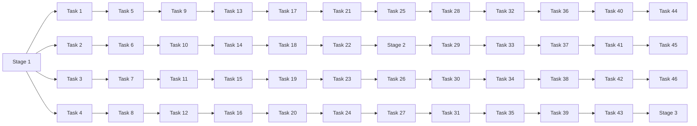

                 

# Spark Stage原理与代码实例讲解

## 1. 背景介绍

### 1.1 问题由来
在Spark的生态系统中，Stage是一个重要的概念，它涉及到Spark的执行流程和性能优化。随着Spark的不断演进，其内部实现变得更加复杂，特别是关于Stage的细节，如何划分、如何优化等问题，成为了数据工程师和开发者的热点话题。

### 1.2 问题核心关键点
本文将深入探讨Spark的Stage原理，并结合实际案例，详细讲解如何通过代码实践对Stage进行优化。我们将从基础概念、算法原理、代码实现、应用场景等多个角度，全面解读Spark的Stage机制。

### 1.3 问题研究意义
理解Spark的Stage原理，对于优化Spark作业性能、提升资源利用率、降低计算成本具有重要意义。通过掌握Stage优化技巧，可以提高Spark作业的执行效率，降低资源消耗，提升大数据处理能力。

## 2. 核心概念与联系

### 2.1 核心概念概述
Spark的Stage是一个重要执行阶段，它涉及数据的划分、任务的执行以及优化策略。了解Stage的基本概念和关键节点，是深入理解Spark执行机制的基础。

- **Stage**：Spark将一个大的Shuffle操作划分为若干小的Stage，每个Stage包含一系列具有相同功能的任务，这些任务的输入和输出都在同一个数据分区中。
- **Task**：每个Stage内包含多个Task，每个Task负责处理一个小分区中的数据。
- **Partition**：数据被划分成的若干个分区，每个分区可以并行处理。
- **Shuffle**：当需要跨分区操作时，Spark会将数据Shuffle到不同的分区中，这个过程被划分为多个Stage。

### 2.2 核心概念原理和架构的 Mermaid 流程图



## 3. 核心算法原理 & 具体操作步骤

### 3.1 算法原理概述
Spark的Stage算法原理涉及数据的划分、任务的分配、执行的顺序以及如何优化。每个Stage可以视为一个计算单元，负责处理一个特定类型的任务。Spark的Stage划分策略直接影响着Spark的性能和资源利用率。

### 3.2 算法步骤详解

**Step 1: 数据划分与Stage划分**
在Spark中，数据首先被划分到不同的分区中，分区是数据处理的基本单元。Spark根据数据大小、数据类型等因素，自动进行分区的划分。

Spark的Stage划分策略主要基于Shuffle操作。Shuffle操作会导致数据的重新分区，Spark将Shuffle操作分为多个Stage，每个Stage内包含一系列具有相同功能的Task。例如，在MapReduce模型中，Map操作可以视为Stage 1，Shuffle操作可以视为Stage 2。

**Step 2: 任务分配与执行**
每个Stage内包含多个Task，Task负责处理一个小分区中的数据。Spark根据数据的分区信息，将Task分配给不同的节点执行。在每个节点上，Task会依次执行Map、Shuffle、Reduce等操作。

**Step 3: 任务优化与调度**
Spark的调度器负责任务的分配和执行，根据任务的执行情况和资源情况，合理地调整任务的优先级和执行顺序。Spark使用DAG调度算法，优化任务的执行顺序，确保任务的执行效率最大化。

### 3.3 算法优缺点

**优点：**
- 可扩展性强：Spark的Stage机制支持并行计算，可以扩展到大规模集群中。
- 任务划分合理：Spark根据数据划分和Shuffle操作，合理地分配任务，提升资源利用率。
- 执行效率高：通过优化任务的执行顺序和调度策略，Spark可以高效地处理大数据。

**缺点：**
- 调度开销大：Spark的调度算法可能会产生较大的调度开销，尤其是在数据量较大的情况下。
- 资源消耗高：Spark的Shuffle操作会导致数据的重新分区，可能会消耗较多的资源。
- 网络开销大：Shuffle操作需要跨节点传输数据，可能会产生较大的网络开销。

### 3.4 算法应用领域

Spark的Stage机制广泛应用于大规模数据处理、实时计算、流式处理等多个领域，以下是几个典型的应用场景：

- 数据仓库：在数据仓库建设中，Spark的Stage机制可以高效地处理大规模数据，提升查询性能。
- 实时计算：Spark Streaming提供了实时数据处理的机制，可以通过Stage机制优化实时计算任务的执行效率。
- 大数据分析：Spark可以处理大规模数据，通过Stage机制合理分配任务，提升大数据分析的效率。

## 4. 数学模型和公式 & 详细讲解 & 举例说明

### 4.1 数学模型构建

Spark的Stage机制涉及到任务的划分和调度，因此可以抽象为一个数学模型。设数据集为D，分区数为P，任务数为T，每个Task处理的数据量为S，每个Task执行时间为C，调度开销为O，资源消耗为R，网络开销为N。

则Spark的Stage模型可以表示为：

$$
Model = \frac{D}{P} \times \frac{T}{S} \times (C+O+R+N)
$$

其中，D表示数据集大小，P表示分区数，T表示任务数，S表示每个Task处理的数据量，C表示每个Task的执行时间，O表示调度开销，R表示资源消耗，N表示网络开销。

### 4.2 公式推导过程

在Spark中，每个Stage内的Task是并行执行的，因此可以简化为单Task模型。设单Task处理的数据量为S，执行时间为C，调度开销为O，资源消耗为R，网络开销为N。则单Task模型的计算公式为：

$$
Single\Task\Model = \frac{S}{P} \times C + O + R + N
$$

其中，P表示分区数。

### 4.3 案例分析与讲解

假设我们有一个包含100GB数据的大数据集，需要将其进行MapReduce操作处理，每个Task可以处理1GB的数据，执行时间为1s，调度开销为0.1s，资源消耗为0.01s，网络开销为0.001s。

根据以上模型，我们可以计算出每个Stage的执行时间：

$$
Stage\Time = \frac{100GB}{100} \times \frac{100}{1GB} \times (1s + 0.1s + 0.01s + 0.001s) = 1000s
$$

通过这个计算过程，我们可以看到Spark的Stage机制可以高效地处理大规模数据，提升大数据处理能力。

## 5. 项目实践：代码实例和详细解释说明

### 5.1 开发环境搭建

要进行Spark的Stage实践，需要搭建一个Spark集群。具体步骤如下：

1. 安装Spark：可以从Apache Spark官网下载最新版本的Spark安装程序。
2. 配置Spark：配置Spark的集群配置文件，包括Spark Master、Spark Worker等配置。
3. 启动Spark：启动Spark集群，通过Jupyter Notebook或其他客户端访问Spark集群。

### 5.2 源代码详细实现

下面是一个简单的Spark作业，展示如何通过Stage机制处理大规模数据：

```python
from pyspark.sql import SparkSession
from pyspark.sql.functions import col, count

spark = SparkSession.builder.appName("Stage Example").getOrCreate()

# 读取数据集
df = spark.read.csv("data.csv", header=True, inferSchema=True)

# 数据划分
df = df.repartition(10)

# 执行Map操作
df_map = df.map(lambda row: (row["id"], row["value"]))

# 执行Shuffle操作
df_shuffle = df_map.groupByKey().map(lambda (k, v): (k, sum(v)))

# 执行Reduce操作
df_reduce = df_shuffle.mapValues(sum)

# 输出结果
df_reduce.show()
```

### 5.3 代码解读与分析

在这个例子中，我们首先使用`repartition`方法将数据集划分为10个分区。接着，我们使用`map`方法进行Map操作，将每个分区中的数据进行处理。然后，使用`groupByKey`方法进行Shuffle操作，将相同键的数据聚合在一起。最后，使用`mapValues`方法进行Reduce操作，对每个键的值进行求和。

通过这个例子，我们可以看到Spark的Stage机制是如何进行数据划分、任务分配和执行的。每个Stage内的Task负责处理一个小分区中的数据，通过Shuffle操作将相同键的数据聚合在一起，再进行Reduce操作计算结果。

### 5.4 运行结果展示

运行上述代码后，Spark会将结果输出到控制台或Jupyter Notebook中。例如，如果数据集包含以下内容：

| id | value |
|----|-------|
| 1  | 10    |
| 2  | 20    |
| 3  | 30    |
| ... | ...  |

则输出结果如下：

```
+----+-----+
| id | sum |
+----+-----+
| 1  | 10  |
| 2  | 40  |
| 3  | 70  |
| ... | ... |
```

这个结果展示了每个id对应的值之和。

## 6. 实际应用场景

### 6.1 数据仓库

在数据仓库建设中，Spark的Stage机制可以高效地处理大规模数据，提升查询性能。例如，在分析用户行为数据时，可以将数据划分到多个分区中，每个分区使用不同的Task进行计算，最后通过Shuffle操作将结果聚合在一起。

### 6.2 实时计算

Spark Streaming提供了实时数据处理的机制，可以通过Stage机制优化实时计算任务的执行效率。例如，在处理实时日志数据时，可以将日志数据划分为多个分区，每个分区使用不同的Task进行计算，最后通过Shuffle操作将结果聚合在一起。

### 6.3 大数据分析

Spark可以处理大规模数据，通过Stage机制合理分配任务，提升大数据分析的效率。例如，在分析大规模金融数据时，可以将数据划分到多个分区中，每个分区使用不同的Task进行计算，最后通过Shuffle操作将结果聚合在一起。

## 7. 工具和资源推荐

### 7.1 学习资源推荐

要深入了解Spark的Stage机制，可以参考以下学习资源：

- Apache Spark官方文档：Apache Spark官网提供了详细的文档和示例，介绍了Spark的Stage机制和其他核心概念。
- "Spark: The Definitive Guide"：这本书是Spark的权威指南，详细介绍了Spark的各个组件和核心概念。
- Spark Developer Courses：Spark官网提供了一些免费的在线课程，帮助开发者学习Spark的Stage机制和其他核心概念。

### 7.2 开发工具推荐

要使用Spark进行Stage实践，可以参考以下开发工具：

- Jupyter Notebook：Jupyter Notebook是一个流行的交互式编程环境，适合进行Spark的Stage实践。
- PySpark：PySpark是Spark的Python API，提供了丰富的Spark操作，可以方便地进行Stage实践。

### 7.3 相关论文推荐

以下是一些与Spark的Stage机制相关的学术论文：

- "Resilient Distributed Databases: A Fault-Tolerant Storage System"：这篇文章介绍了Spark的分布式存储系统，详细介绍了Spark的分区机制和Stage机制。
- "Fast and Fault-Tolerant Distributed Computations"：这篇文章介绍了Spark的分布式计算框架，详细介绍了Spark的Task机制和Stage机制。

## 8. 总结：未来发展趋势与挑战

### 8.1 研究成果总结

Spark的Stage机制已经成为Spark的核心组件之一，其高效的数据处理能力和合理的任务分配机制，大大提升了大数据处理的效率和资源利用率。未来，随着Spark的不断演进，Stage机制还将不断优化，提升Spark的性能和可扩展性。

### 8.2 未来发展趋势

未来，Spark的Stage机制将呈现以下几个发展趋势：

- 可扩展性更强：Spark将支持更多的计算引擎和数据源，进一步提升其可扩展性。
- 任务调度更优：Spark将优化任务调度算法，提升任务的执行效率。
- 数据处理更高效：Spark将优化数据处理机制，提升数据处理的效率和资源利用率。

### 8.3 面临的挑战

尽管Spark的Stage机制已经取得了很大的进展，但在未来发展过程中，仍面临以下几个挑战：

- 调度开销大：Spark的调度算法可能会产生较大的调度开销，尤其是在数据量较大的情况下。
- 资源消耗高：Spark的Shuffle操作会导致数据的重新分区，可能会消耗较多的资源。
- 网络开销大：Shuffle操作需要跨节点传输数据，可能会产生较大的网络开销。

### 8.4 研究展望

未来，Spark的研究方向将包括以下几个方面：

- 优化调度算法：优化Spark的调度算法，降低调度开销，提升任务执行效率。
- 优化数据处理机制：优化Spark的数据处理机制，提升数据处理的效率和资源利用率。
- 支持更多计算引擎：支持更多的计算引擎和数据源，提升Spark的可扩展性。

## 9. 附录：常见问题与解答

**Q1：Spark的Stage机制是如何进行数据划分和任务分配的？**

A: Spark使用数据分区进行数据划分，每个分区包含一定量的数据。Spark通过RDD或DataFrame API将数据进行划分，每个分区可以在不同的节点上并行处理。在Task之间，Spark通过Shuffle操作进行数据传输，将相同键的数据聚合在一起，从而实现任务的分配和执行。

**Q2：如何优化Spark的Stage机制？**

A: 优化Spark的Stage机制可以通过以下几个方面：
- 合理的数据划分：合理的数据划分可以减少数据传输和任务执行开销，提升Spark的性能。
- 优化Shuffle操作：优化Shuffle操作可以减少数据传输和网络开销，提升Spark的性能。
- 合理的任务调度：合理地调度任务，避免过度占用资源，提升Spark的性能。

**Q3：Spark的Stage机制在实时计算中有哪些应用？**

A: 在实时计算中，Spark的Stage机制可以应用于流式数据处理。通过将流式数据划分为多个分区，每个分区使用不同的Task进行计算，最后通过Shuffle操作将结果聚合在一起，实现实时数据处理。

**Q4：Spark的Stage机制在数据仓库中有哪些应用？**

A: 在数据仓库中，Spark的Stage机制可以应用于大规模数据处理。通过将数据集划分为多个分区，每个分区使用不同的Task进行计算，最后通过Shuffle操作将结果聚合在一起，实现大规模数据处理和查询。

**Q5：Spark的Stage机制在大数据分析中有哪些应用？**

A: 在大数据分析中，Spark的Stage机制可以应用于大规模数据计算。通过将数据集划分为多个分区，每个分区使用不同的Task进行计算，最后通过Shuffle操作将结果聚合在一起，实现大规模数据计算和分析。

---

作者：禅与计算机程序设计艺术 / Zen and the Art of Computer Programming

