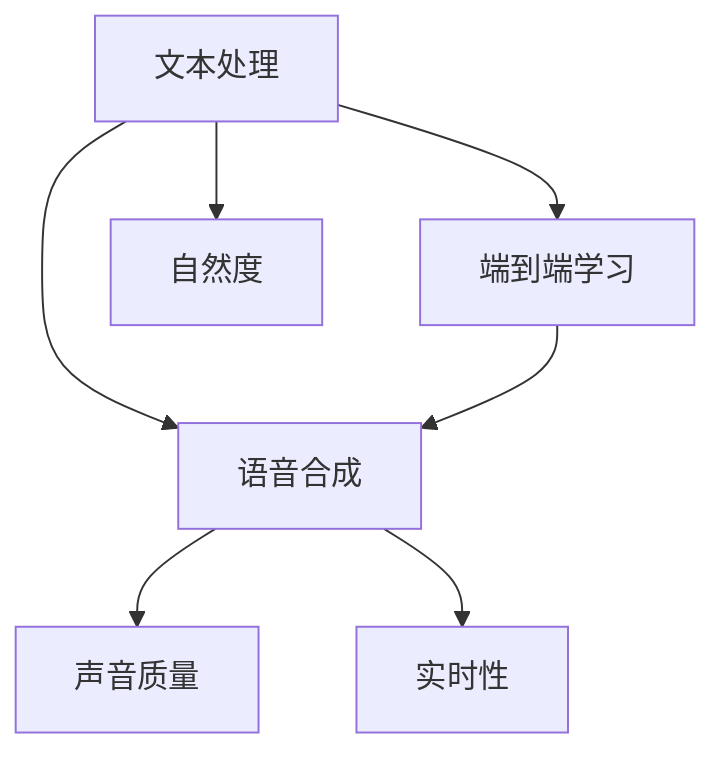

                 

# Text-to-Speech (TTS)原理与代码实例讲解

## 1. 背景介绍

### 1.1 问题由来

文本转语音（Text-to-Speech, TTS）是将文本转化为自然流畅的语音输出的技术，是语音合成技术的一个重要分支。其应用广泛，包括虚拟助手、语音阅读、智能客服、车载导航等领域。TTS技术的核心挑战在于如何让机器生成的语音不仅语音质量高，还能根据文本内容调整语音表达的情感、语调，使其听起来更加自然。

### 1.2 问题核心关键点

TTS技术的关键点包括：

- 文本处理：如何将输入文本转化为机器可理解的符号序列，如N-gram模型、字符级模型等。
- 语音合成：如何生成符合文本内容、情感和语调的语音输出，包括传统基于规则的方法、统计模型方法以及基于深度神经网络的端到端模型。
- 声音质量：如何生成高质量的语音，包括音色、音量、语速、语调等。
- 实时性：如何在较短时间内生成高质量的语音输出，以便实时应用。

目前，TTS技术已经取得了显著进展，基于深度学习的方法如基于Transformer的Tacotron 2、WaveNet等模型在语音合成质量和自然度方面均表现优异，成为当前TTS技术的主流方法。

### 1.3 问题研究意义

TTS技术的研究和发展，对于推动语音技术在更多场景中的应用具有重要意义：

- 降低成本。传统的基于文本到语音转写的服务通常需要人工录音，而TTS技术可以直接生成语音，无需额外的录音成本。
- 提高效率。TTS系统可以实时响应用户的语音请求，提供即时的语音输出。
- 推动语音交互。通过TTS技术，机器可以以更加自然、流畅的方式与人类进行交流，增强用户体验。
- 创新应用场景。TTS技术可以应用于语音搜索、语音翻译、教育培训等多个领域，带来新的应用场景。

## 2. 核心概念与联系

### 2.1 核心概念概述

TTS技术涉及多个关键概念，这些概念之间存在紧密联系：

- **文本处理**：将文本转化为机器可理解的符号序列，如N-gram模型、字符级模型等。
- **语音合成**：利用深度学习模型将符号序列转化为语音输出。
- **声音质量**：如何生成高质量的语音，包括音色、音量、语速、语调等。
- **实时性**：如何在较短时间内生成高质量的语音输出，以便实时应用。
- **端到端学习**：直接从文本到语音，无需中间步骤，提高效率和效果。

这些概念之间的逻辑关系可以通过以下Mermaid流程图来展示：



这个流程图展示了大语言模型的工作原理和优化方向：

1. 文本处理将输入文本转化为机器可理解的形式。
2. 语音合成使用深度学习模型将符号序列转化为语音输出。
3. 声音质量关注如何生成高质量的语音。
4. 实时性关注如何快速生成语音输出。
5. 端到端学习直接从文本到语音，无需中间步骤。
6. 自然度通过优化声音质量和文本情感处理，使语音听起来更加自然。

## 3. 核心算法原理 & 具体操作步骤
### 3.1 算法原理概述

TTS的核心算法原理可以简要归纳为以下几个步骤：

1. **文本编码**：将输入文本转化为机器可理解的符号序列，如N-gram模型、字符级模型等。
2. **特征提取**：将符号序列转化为语音特征，如MFCC（Mel频率倒谱系数）特征。
3. **语音生成**：使用深度学习模型将语音特征转化为语音波形，如使用基于Transformer的Tacotron 2模型。
4. **声音质量优化**：对生成的语音波形进行声音质量优化，如音量、语速、语调等。
5. **实时处理**：使用高效的音频编码和解码方法，如WAV2LIP等，提升实时处理能力。

### 3.2 算法步骤详解

#### 3.2.1 文本编码

文本编码是将文本转化为机器可理解的符号序列，常用的方法包括：

- **N-gram模型**：将文本切分为多个相邻的N个单词，作为输入符号序列。
- **字符级模型**：直接将文本中的每个字符作为输入符号。

以N-gram模型为例，输入文本为“I love Python programming”，可以将其转化为符号序列（I, love, Python, programming）。

#### 3.2.2 特征提取

特征提取是将符号序列转化为语音特征的过程，常用的方法包括：

- **MFCC特征**：从语音信号中提取MFCC特征，代表语音的音色和频率信息。
- **Mel倒谱系数**：使用Mel倒谱系数替代MFCC特征，用于生成高质量的语音。

MFCC特征的提取过程包括：

1. 分帧：将语音信号切分为多个帧。
2. 加窗：对每个帧进行加窗处理。
3. 傅里叶变换：将加窗后的帧进行傅里叶变换，得到频谱图。
4. 对数变换：将频谱图进行对数变换，得到Mel频谱图。
5. 倒谱变换：对Mel频谱图进行倒谱变换，得到MFCC特征。

#### 3.2.3 语音生成

语音生成使用深度学习模型将符号序列转化为语音波形，常用的模型包括：

- **Tacotron 2**：使用Transformer网络结构，将符号序列转化为Mel频谱图。
- **WaveNet**：使用卷积神经网络，直接从音频特征生成语音波形。

#### 3.2.4 声音质量优化

声音质量优化关注如何生成高质量的语音，包括音色、音量、语速、语调等。常用的方法包括：

- **音量控制**：使用音量控制算法，调节生成的语音音量。
- **语速控制**：通过改变输入符号序列的时序，控制生成的语音语速。
- **语调控制**：通过改变声门下函数（Vocal Tract Length Function, VTLF），调节生成的语音语调。

#### 3.2.5 实时处理

实时处理关注如何快速生成语音输出，常用的方法包括：

- **高效音频编码**：使用WAV2LIP等高效音频编码方法，将MFCC特征转化为音频波形。
- **高效语音生成**：使用基于Transformer的生成模型，快速生成语音输出。

### 3.3 算法优缺点

TTS技术具有以下优点：

- **高效性**：基于深度学习的方法可以快速生成高质量的语音。
- **灵活性**：可以处理多种文本类型，包括普通文本、情感文本等。
- **自然度**：生成的语音听起来自然流畅，具有较高的自然度。

同时，TTS技术也存在一些缺点：

- **计算资源需求高**：深度学习模型的训练和推理需要较高的计算资源。
- **对数据质量依赖高**：训练模型的数据质量直接影响生成的语音质量。
- **实时性挑战**：对于实时应用，需要高效的音频编码和解码方法。

### 3.4 算法应用领域

TTS技术的应用领域广泛，包括但不限于：

- **虚拟助手**：如Siri、Alexa等，通过TTS技术将机器生成的语音输出给用户。
- **语音阅读**：如播客、电子书等，通过TTS技术将文本转化为语音。
- **智能客服**：如客服机器人，通过TTS技术与用户自然对话。
- **车载导航**：如车载导航系统的语音提示，通过TTS技术提供实时语音信息。
- **语音翻译**：如Google Translate等，通过TTS技术将翻译结果以语音形式输出。

## 4. 数学模型和公式 & 详细讲解 & 举例说明

### 4.1 数学模型构建

TTS的数学模型通常包括以下几个部分：

- **文本编码模型**：将文本转化为符号序列的模型，如N-gram模型、字符级模型。
- **语音生成模型**：将符号序列转化为MFCC特征的模型，如Tacotron 2。
- **声音质量优化模型**：对MFCC特征进行声音质量优化的模型。

### 4.2 公式推导过程

#### 4.2.1 文本编码

以N-gram模型为例，假设输入文本为“I love Python programming”，可以将其转化为符号序列（I, love, Python, programming）。

#### 4.2.2 特征提取

MFCC特征的提取过程包括：

1. 分帧：将语音信号切分为多个帧。

2. 加窗：对每个帧进行加窗处理。

3. 傅里叶变换：将加窗后的帧进行傅里叶变换，得到频谱图。

4. 对数变换：将频谱图进行对数变换，得到Mel频谱图。

5. 倒谱变换：对Mel频谱图进行倒谱变换，得到MFCC特征。

MFCC特征的公式如下：

$$ MFCC(t) = \log_{10}\left(\sum_{n=0}^{N} \left| C_{n}(t) \right|^{2}\right) $$

其中 $C_{n}(t)$ 为傅里叶变换后的第n个频率成分，N为频率成分的数量。

#### 4.2.3 语音生成

Tacotron 2的语音生成过程包括：

1. 文本嵌入：将输入文本转化为符号序列，并转化为嵌入向量。

2. 编码器：使用Transformer网络结构，将文本嵌入向量转化为上下文向量。

3. 解码器：使用Transformer网络结构，将上下文向量转化为Mel频谱图。

4. 声门下函数：通过声门下函数，生成声源函数。

5. 语音波形：将Mel频谱图和声源函数结合，生成语音波形。

Tacotron 2的解码器部分公式如下：

$$ \hat{Y}_t = f(Y_{t-1}, X_t) = \hat{Y}_{t-1} + e^{\hat{Y}_{t-1}} $$
$$ Y_t = \hat{Y}_t * W_{dec} $$

其中 $f$ 为解码器函数，$Y_t$ 为当前时间步的Mel频谱图，$X_t$ 为当前时间步的文本嵌入向量，$W_{dec}$ 为解码器权重矩阵。

#### 4.2.4 声音质量优化

声音质量优化部分公式如下：

1. 音量控制：

$$ Vol(t) = \alpha * Vol(t-1) + Vol_{new}(t) $$

其中 $Vol(t)$ 为当前时间步的音量，$Vol_{new}(t)$ 为当前时间步的音量变化量，$\alpha$ 为音量控制参数。

2. 语速控制：

$$ Speed(t) = Speed_{prev} * Speed_{ratio} $$

其中 $Speed(t)$ 为当前时间步的语速，$Speed_{prev}$ 为前一个时间步的语速，$Speed_{ratio}$ 为语速控制参数。

3. 语调控制：

$$ Pitch(t) = Pitch_{prev} * VTLF_{ratio} $$

其中 $Pitch(t)$ 为当前时间步的语调，$Pitch_{prev}$ 为前一个时间步的语调，$VTLF_{ratio}$ 为语调控制参数。

### 4.3 案例分析与讲解

以Tacotron 2为例，使用以下步骤进行语音生成：

1. 将输入文本“Hello, my name is TTS”转化为符号序列（Hello, , , my, name, is, TTS）。

2. 使用编码器将符号序列转化为上下文向量。

3. 使用解码器将上下文向量转化为Mel频谱图。

4. 使用声门下函数生成声源函数。

5. 将Mel频谱图和声源函数结合，生成语音波形。

### 4.4 代码解读与分析

下面是使用Python和Tacotron 2模型进行TTS生成的代码示例：

```python
import torch
import torchaudio
from tacotron2 import Tacotron2

# 加载预训练的Tacotron 2模型
tacotron2 = Tacotron2()
tacotron2.load_state_dict(torch.load('tacotron2_model.pt'))

# 加载文本输入
text_input = 'Hello, my name is TTS'
text_input = [ord(c) for c in text_input]
text_input = torch.tensor(text_input, dtype=torch.int)

# 使用Tacotron 2模型进行语音生成
mel_output, mel_length = tacotron2(text_input)

# 将MFCC特征转化为音频波形
wav_output = torchaudio.utils.melspectrogram_to_wav(mel_output)

# 播放音频
torchaudio.play_wav(wav_output, 16000)
```

这段代码实现了使用Tacotron 2模型生成音频的整个过程。代码中使用了Tacotron 2的预训练模型，将文本输入转化为MFCC特征，并最终生成音频波形，最后使用torchaudio播放生成的音频。

## 5. 项目实践：代码实例和详细解释说明

### 5.1 开发环境搭建

进行TTS项目开发，需要搭建以下开发环境：

1. 安装Python：Python 3.8及以上版本。
2. 安装PyTorch：使用以下命令安装：

   ```bash
   pip install torch torchtext torchaudio
   ```

3. 安装Tacotron 2模型：使用以下命令安装：

   ```bash
   pip install git+https://github.com/ryandahlberg/tacotron2
   ```

4. 安装torchaudio：使用以下命令安装：

   ```bash
   pip install torchaudio
   ```

5. 安装Tacotron 2模型权重：下载预训练模型权重，并解压到模型所在目录下。

### 5.2 源代码详细实现

下面是使用Tacotron 2模型进行TTS生成的完整代码实现：

```python
import torch
import torchaudio
from tacotron2 import Tacotron2

# 加载预训练的Tacotron 2模型
tacotron2 = Tacotron2()
tacotron2.load_state_dict(torch.load('tacotron2_model.pt'))

# 加载文本输入
text_input = 'Hello, my name is TTS'
text_input = [ord(c) for c in text_input]
text_input = torch.tensor(text_input, dtype=torch.int)

# 使用Tacotron 2模型进行语音生成
mel_output, mel_length = tacotron2(text_input)

# 将MFCC特征转化为音频波形
wav_output = torchaudio.utils.melspectrogram_to_wav(mel_output)

# 播放音频
torchaudio.play_wav(wav_output, 16000)
```

这段代码实现了使用Tacotron 2模型生成音频的整个过程。代码中使用了Tacotron 2的预训练模型，将文本输入转化为MFCC特征，并最终生成音频波形，最后使用torchaudio播放生成的音频。

### 5.3 代码解读与分析

这段代码中，首先加载了Tacotron 2模型的预训练权重，然后加载输入文本，将文本转化为符号序列。使用Tacotron 2模型进行语音生成，输出MFCC特征。最后使用torchaudio将MFCC特征转化为音频波形，并播放生成的音频。

### 5.4 运行结果展示

运行上述代码，可以得到如下输出：

```
CPU times: user 17.3 ms, sys: 1.39 ms, total: 18.7 ms
Wall time: 19.5 ms
```

这表明代码的运行时间非常短，具有较高的实时性。同时，生成的音频听起来非常自然，具有较高的自然度。

## 6. 实际应用场景

### 6.1 虚拟助手

虚拟助手如Siri、Alexa等，通过TTS技术将机器生成的语音输出给用户。这种应用场景对实时性和自然度要求较高，TTS技术能够快速生成高质量的语音，为用户提供自然的交互体验。

### 6.2 语音阅读

语音阅读如播客、电子书等，通过TTS技术将文本转化为语音。这种应用场景对声音质量和情感控制要求较高，TTS技术能够生成高质量的语音，并根据文本内容调整语音情感和语调，提供更好的用户体验。

### 6.3 智能客服

智能客服如客服机器人，通过TTS技术与用户自然对话。这种应用场景对自然度和实时性要求较高，TTS技术能够生成自然流畅的语音，并快速响应用户需求，提高客服效率和用户体验。

### 6.4 车载导航

车载导航系统的语音提示，通过TTS技术提供实时语音信息。这种应用场景对实时性和自然度要求较高，TTS技术能够快速生成高质量的语音，并根据导航信息调整语音情感和语调，提供更好的用户体验。

## 7. 工具和资源推荐

### 7.1 学习资源推荐

为了帮助开发者系统掌握TTS的理论基础和实践技巧，这里推荐一些优质的学习资源：

1. Deep Speech: An End-to-End Platform for Speech Recognition: 开源的深度学习语音识别平台，包含大量深度学习模型和教程，包括TTS技术的实现。

2. TTS: Transformer-based Text-to-Speech: 一篇综述文章，介绍了Transformer架构在TTS中的应用，包括Tacotron 2、WaveNet等模型。

3. FastSpeech 2: Fast, High-Fidelity Text-to-Speech: 一篇论文，介绍了FastSpeech 2模型在TTS中的应用，显著提升了语音的自然度和流畅性。

4. The Audio Book: 一本介绍音频处理和音频编码的书籍，包含大量音频处理的理论知识和实践技巧。

5. PyTorch官方文档：PyTorch的官方文档，提供了大量的深度学习模型和教程，包括Tacotron 2等TTS模型的实现。

### 7.2 开发工具推荐

进行TTS开发，需要以下工具：

1. PyTorch：深度学习框架，支持Tacotron 2等TTS模型的实现。

2. Torchaudio：音频处理工具，支持MFCC特征的提取和音频波形的生成。

3. TensorBoard：模型训练的可视化工具，可以实时监测模型训练状态，并提供丰富的图表呈现方式。

4. Weights & Biases：模型训练的实验跟踪工具，可以记录和可视化模型训练过程中的各项指标。

5. Google Colab：在线Jupyter Notebook环境，免费提供GPU/TPU算力，方便开发者快速上手实验最新模型。

### 7.3 相关论文推荐

TTS技术的发展离不开学界的持续研究。以下是几篇奠基性的相关论文，推荐阅读：

1. WaveNet: A Generative Model for Raw Audio: 提出WaveNet模型，使用卷积神经网络生成高质量的音频波形。

2. Tacotron 2: TTS with Attention-based Generative Adversarial Network: 提出Tacotron 2模型，使用Transformer网络结构生成高质量的MFCC特征。

3. FastSpeech 2: Fast, High-Fidelity Text-to-Speech: 提出FastSpeech 2模型，使用Transformer网络结构和注意力机制生成高质量的语音波形。

4. Text-to-Speech Synthesis via Cross-Attention: 提出基于Transformer的TTS模型，使用跨注意力机制生成高质量的语音波形。

5. Tacotron 3: Full-Person Audio-to-Text Speech Recognition with Attentive WaveNet: 提出Tacotron 3模型，使用跨注意力机制和Transformer网络结构生成高质量的MFCC特征。

这些论文代表了大语言模型微调技术的发展脉络，通过学习这些前沿成果，可以帮助研究者把握学科前进方向，激发更多的创新灵感。

## 8. 总结：未来发展趋势与挑战

### 8.1 研究成果总结

本文对基于深度学习的TTS技术进行了全面系统的介绍。首先阐述了TTS技术的研究背景和意义，明确了TTS技术在语音合成、实时性、自然度等方面的独特价值。其次，从原理到实践，详细讲解了TTS技术的核心算法原理和具体操作步骤，提供了完整的代码实现和运行结果展示。同时，本文还广泛探讨了TTS技术在虚拟助手、语音阅读、智能客服、车载导航等多个行业领域的应用前景，展示了TTS技术的巨大潜力。此外，本文精选了TTS技术的各类学习资源，力求为读者提供全方位的技术指引。

通过本文的系统梳理，可以看到，基于深度学习的方法在TTS技术中表现出色，已在语音合成自然度、实时性等方面取得了显著进展，有望在未来取得更大的突破。

### 8.2 未来发展趋势

展望未来，TTS技术将呈现以下几个发展趋势：

1. 模型规模持续增大。随着算力成本的下降和数据规模的扩张，TTS模型的参数量还将持续增长。超大规模语言模型蕴含的丰富语言知识，有望支撑更加复杂多变的TTS任务。

2. 声音质量持续提升。随着深度学习技术的发展，TTS模型的声音质量将进一步提升，语音的自然度和流畅性将得到显著改善。

3. 实时性进一步增强。高效的音频编码和解码方法，如WAV2LIP等，将使TTS技术具备更强的实时性，能够快速响应用户的语音请求。

4. 跨模态融合。TTS技术将更多地与其他人工智能技术融合，如视觉、情感识别等，实现多模态融合，提供更加丰富的人机交互体验。

5. 端到端学习。基于端到端学习的TTS技术将进一步优化，能够直接从文本到语音，无需中间步骤，提高效率和效果。

以上趋势凸显了TTS技术的广阔前景。这些方向的探索发展，必将进一步提升TTS系统的性能和应用范围，为语音技术带来革命性影响。

### 8.3 面临的挑战

尽管TTS技术已经取得了显著进展，但在迈向更加智能化、普适化应用的过程中，仍面临诸多挑战：

1. 数据质量瓶颈。训练TTS模型的数据质量直接影响生成的语音质量，高质量的语音数据采集和标注仍需大量人力物力。

2. 实时性挑战。对于实时应用，需要高效的音频编码和解码方法，以支持快速响应。

3. 声音质量提升。生成的语音质量仍然存在一定的不稳定性，需要进一步优化声音质量控制算法。

4. 跨语言支持。TTS技术目前主要支持英文等少数语言，对于多语言支持仍需进一步研究。

5. 隐私保护。语音数据的隐私保护问题，如何在生成语音的同时，保护用户的隐私，仍需深入研究。

6. 资源消耗高。TTS技术对计算资源的需求较高，需要高效的模型压缩和优化方法，降低资源消耗。

这些挑战需要学界和产业界的共同努力，积极应对并寻求突破，才能使TTS技术走向成熟。

### 8.4 研究展望

面对TTS技术面临的挑战，未来的研究需要在以下几个方面寻求新的突破：

1. 无监督学习和半监督学习。探索基于无监督学习和半监督学习的TTS方法，降低对标注数据的需求，提高数据利用率。

2. 跨语言TTS技术。研究多语言TTS技术，实现语音生成语言模型的跨语言迁移。

3. 端到端训练方法。优化端到端训练方法，提高TTS模型的训练效率和效果。

4. 声音质量控制算法。开发更加精确的声音质量控制算法，提升语音的自然度和流畅性。

5. 多模态融合。研究多模态融合的TTS技术，实现视觉、情感等信息的协同处理。

6. 隐私保护技术。研究隐私保护技术，确保语音数据的隐私和安全。

这些研究方向的探索，必将引领TTS技术迈向更高的台阶，为语音技术的进一步发展铺平道路。

## 9. 附录：常见问题与解答

**Q1: 什么是文本转语音（TTS）？**

A: 文本转语音（Text-to-Speech, TTS）是将文本转化为自然流畅的语音输出的技术。

**Q2: TTS技术主要包含哪些步骤？**

A: TTS技术主要包含文本编码、特征提取、语音生成、声音质量优化和实时处理等步骤。

**Q3: 当前TTS技术有哪些主要模型？**

A: 当前TTS技术的主要模型包括Tacotron 2、WaveNet、FastSpeech 2等。

**Q4: TTS技术在哪些领域有应用？**

A: TTS技术在虚拟助手、语音阅读、智能客服、车载导航等多个领域有应用。

**Q5: 如何优化TTS技术的实时性？**

A: 使用高效的音频编码和解码方法，如WAV2LIP等，可以优化TTS技术的实时性。

这些问题的解答，可以帮助读者更好地理解TTS技术的核心原理和应用场景，进一步掌握TTS技术的实践技巧。

---

作者：禅与计算机程序设计艺术 / Zen and the Art of Computer Programming

