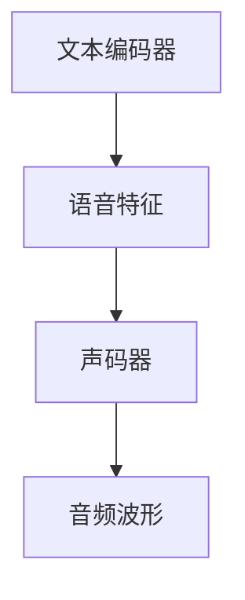

                 

# Text-to-Speech (TTS)原理与代码实例讲解

> 关键词：Text-to-Speech (TTS), 语音合成, 语音生成, 深度学习, 声码器 (Vocoder), 端到端模型 (End-to-End), 神经网络, Mel-spectrogram, 量化 (Quantization)

## 1. 背景介绍

### 1.1 问题由来
随着人工智能技术的不断进步，自然语言处理(NLP)与计算机视觉(Vision)领域的成果已经广泛应用于日常生活的各个方面。然而，自然语言到声音的转换，即文本到语音（Text-to-Speech, TTS）技术，虽然已经在教育、游戏、交通等多个领域得到广泛应用，但其核心技术和模型的优劣，仍是一个备受关注的热点问题。

文本到语音技术能够将文字转化为自然、流畅、生动的语音输出，极大提升了信息的可访问性和互动性。例如，智能助手（如Siri、Alexa）、虚拟主播、有声读物等，均离不开高质量的TTS技术支撑。然而，在实际应用中，由于TTS模型的参数量巨大、训练成本高、推理速度慢等诸多限制，如何高效地训练和部署TTS模型，一直是业界关注的重点。

### 1.2 问题核心关键点
TTS技术主要涉及两方面的核心技术：
1. **文本到音频的映射模型**：将输入的文本序列转化为对应的语音序列。
2. **音频到波形的转换模型**：将语音序列转换为逼真的音频波形。

本文将详细介绍TTS技术的核心算法原理，并通过代码实例展示如何搭建一个端到端的TTS模型。我们主要关注以下几个关键问题：
1. **文本编码器的设计**：将文本序列映射为语音特征序列。
2. **声码器的设计**：将语音特征序列转换为音频波形。
3. **模型训练与推理**：如何进行高效的模型训练与实时推理。

## 2. 核心概念与联系

### 2.1 核心概念概述

为更好地理解TTS技术的核心原理，本节将介绍几个密切相关的核心概念：

- **端到端（End-to-End）TTS模型**：将文本到音频的映射与音频到波形的转换集成在一个模型中，通过联合训练得到更为优化的模型。
- **文本编码器（Text Encoder）**：将文本序列映射为语音特征序列的神经网络模型。
- **声码器（Vocoder）**：将语音特征序列转换为音频波形的神经网络模型。
- **梅尔频谱（Mel-spectrogram）**：一种常见的表示语音信号的方式，常用于语音特征提取和声码器训练。
- **量化（Quantization）**：将高精度浮点数转换为低精度整数或固定点数的表示方式，以减少计算量和存储需求。

这些核心概念之间的逻辑关系可以通过以下Mermaid流程图来展示：



这个流程图展示了TTS技术的核心流程：文本编码器将输入的文本序列映射为语音特征序列，声码器将语音特征序列转化为音频波形。

## 3. 核心算法原理 & 具体操作步骤

### 3.1 算法原理概述

TTS技术的核心算法原理可以归纳为以下两个主要步骤：

1. **文本编码器（Text Encoder）设计**：通过神经网络将文本序列转换为语音特征序列。
2. **声码器（Vocoder）设计**：通过神经网络将语音特征序列转换为音频波形。

形式化地，假设文本输入为 $X$，语音特征序列为 $Z$，音频波形为 $Y$，则TTS系统的目标函数可以表示为：

$$
\min_{\theta_{\text{encoder}},\theta_{\text{vocoder}}} \mathcal{L}(X, Y; \theta_{\text{encoder}}, \theta_{\text{vocoder}})
$$

其中 $\theta_{\text{encoder}}$ 和 $\theta_{\text{vocoder}}$ 分别代表文本编码器和声码器的模型参数，$\mathcal{L}$ 是损失函数，用于衡量模型输出与真实值之间的差距。

### 3.2 算法步骤详解

#### 3.2.1 文本编码器设计

文本编码器的作用是将文本序列 $X$ 映射为语音特征序列 $Z$。具体步骤如下：

1. **输入文本预处理**：将文本分词、编码成向量，并进行归一化处理。
2. **文本嵌入层**：使用嵌入层将文本序列映射到高维空间，形成文本特征向量。
3. **上下文感知层**：引入卷积神经网络（CNN）或循环神经网络（RNN），捕捉文本序列的上下文信息。
4. **注意力机制层**：引入注意力机制，提高模型对文本序列中重要信息的关注度。
5. **输出层**：将处理后的文本特征向量映射为语音特征序列 $Z$。

#### 3.2.2 声码器设计

声码器的作用是将语音特征序列 $Z$ 转换为音频波形 $Y$。具体步骤如下：

1. **输入语音特征预处理**：将语音特征序列 $Z$ 进行归一化处理。
2. **特征嵌入层**：使用嵌入层将语音特征序列映射到高维空间，形成语音特征向量。
3. **音频生成层**：引入卷积神经网络（CNN）或循环神经网络（RNN），生成音频波形序列 $Y$。
4. **后处理层**：使用解码器对音频波形序列进行滤波、增强等后处理操作。
5. **输出层**：将处理后的音频波形序列输出。

#### 3.2.3 模型训练

文本编码器和声码器的训练可以通过端到端的方式进行，具体步骤如下：

1. **数据准备**：准备训练数据，将文本与对应的音频波形配对。
2. **模型定义**：使用深度学习框架定义文本编码器和声码器的模型结构。
3. **损失函数**：设计损失函数，如均方误差（MSE）损失、平均感知损失（MLP）等。
4. **优化器选择**：选择优化器如Adam、SGD等，并设置学习率、批大小等超参数。
5. **模型训练**：使用训练数据集对模型进行迭代优化，最小化损失函数。
6. **模型评估**：使用验证数据集对模型进行评估，检测模型泛化能力。
7. **模型保存**：保存训练好的模型，用于后续推理。

#### 3.2.4 模型推理

模型推理的具体步骤如下：

1. **输入文本预处理**：将待合成文本进行分词、编码等预处理。
2. **文本编码器推理**：使用训练好的文本编码器将输入文本映射为语音特征序列。
3. **声码器推理**：使用训练好的声码器将语音特征序列转换为音频波形。
4. **音频后处理**：对音频波形进行滤波、增强等后处理操作。
5. **输出音频**：将处理后的音频波形输出，进行播放。

### 3.3 算法优缺点

TTS技术的优点包括：

1. **高效性**：端到端模型通过联合训练，提升了模型整体的性能。
2. **可解释性**：通过神经网络模型，可以分析模型对每个输入特征的贡献，提高了模型的可解释性。
3. **鲁棒性**：深度学习模型具有较强的鲁棒性，可以适应各种复杂的文本和语音数据。

同时，TTS技术也存在一些缺点：

1. **高计算成本**：深度学习模型的训练和推理需要大量的计算资源，对硬件要求较高。
2. **过拟合风险**：模型训练过程中容易过拟合，需要大量的数据和合适的正则化技术。
3. **模型泛化能力**：模型对训练数据依赖较强，泛化能力可能受到数据分布的影响。
4. **硬件要求高**：模型推理过程需要高性能硬件支持，如GPU、TPU等。

### 3.4 算法应用领域

TTS技术已经在多个领域得到广泛应用，例如：

1. **智能助理**：如Siri、Alexa等，通过语音交互提升用户体验。
2. **虚拟主播**：在游戏、影视等领域，提供自然流畅的语音输出。
3. **教育培训**：在在线教育平台中，为学生提供有声教材、电子书等。
4. **广告宣传**：通过语音播报广告，提高广告的吸引力。
5. **自动翻译**：结合机器翻译技术，为不同语言间的语音交流提供便利。

## 4. 数学模型和公式 & 详细讲解 & 举例说明

### 4.1 数学模型构建

TTS技术的数学模型主要涉及文本编码器和声码器的设计。这里以梅尔频谱（Mel-spectrogram）作为语音特征表示，设计一个简单的端到端TTS模型。

假设文本输入为 $X$，语音特征序列为 $Z$，音频波形为 $Y$，则模型的目标函数可以表示为：

$$
\min_{\theta_{\text{encoder}},\theta_{\text{vocoder}}} \mathcal{L}(X, Y; \theta_{\text{encoder}}, \theta_{\text{vocoder}})
$$

其中 $\theta_{\text{encoder}}$ 和 $\theta_{\text{vocoder}}$ 分别代表文本编码器和声码器的模型参数，$\mathcal{L}$ 是损失函数，用于衡量模型输出与真实值之间的差距。

### 4.2 公式推导过程

#### 4.2.1 文本编码器

假设文本输入为 $X$，文本编码器的输出为 $Z$，则编码器的目标函数可以表示为：

$$
\min_{\theta_{\text{encoder}}} \mathcal{L}(X, Z; \theta_{\text{encoder}})
$$

其中 $\theta_{\text{encoder}}$ 代表文本编码器的模型参数，$\mathcal{L}$ 是编码器的损失函数。

具体来说，我们可以使用一个简单的双向LSTM模型作为文本编码器，其公式为：

$$
h_t = \text{LSTM}(x_t; \theta_{\text{encoder}})
$$

其中 $h_t$ 为LSTM的隐藏状态，$x_t$ 为输入文本序列的第 $t$ 个词向量。

#### 4.2.2 声码器

假设声码器的输入为 $Z$，输出为 $Y$，则声码器的目标函数可以表示为：

$$
\min_{\theta_{\text{vocoder}}} \mathcal{L}(Z, Y; \theta_{\text{vocoder}})
$$

其中 $\theta_{\text{vocoder}}$ 代表声码器的模型参数，$\mathcal{L}$ 是声码器的损失函数。

具体来说，我们可以使用一个简单的Tacotron模型作为声码器，其公式为：

$$
\hat{y}_t = \text{LSTM}(Z; \theta_{\text{vocoder}})
$$

其中 $\hat{y}_t$ 为声码器的输出，$Z$ 为输入的语音特征序列。

### 4.3 案例分析与讲解

以Google的WaveNet为例，介绍其如何设计端到端的TTS模型。

WaveNet采用了基于卷积神经网络（CNN）的声码器，其主要思想是通过多个卷积层对语音特征进行逐层处理，生成逼真的音频波形。具体来说，WaveNet的声码器结构如下：

$$
\hat{y}_t = \text{Conv}(\text{ResBlock}(\hat{y}_{t-1}, Z; \theta_{\text{vocoder}}))
$$

其中 $\hat{y}_t$ 为当前帧的音频波形，$Z$ 为输入的语音特征序列，$\text{Conv}$ 为卷积操作，$\text{ResBlock}$ 为残差块，$\theta_{\text{vocoder}}$ 为声码器的模型参数。

## 5. 项目实践：代码实例和详细解释说明

### 5.1 开发环境搭建

在进行TTS项目开发前，我们需要准备好开发环境。以下是使用Python进行TensorFlow开发的环境配置流程：

1. 安装Anaconda：从官网下载并安装Anaconda，用于创建独立的Python环境。

2. 创建并激活虚拟环境：
```bash
conda create -n tts-env python=3.8 
conda activate tts-env
```

3. 安装TensorFlow：根据CUDA版本，从官网获取对应的安装命令。例如：
```bash
pip install tensorflow tensorflow-addons
```

4. 安装其他必要工具：
```bash
pip install numpy scipy librosa torchaudio soundfile tqdm
```

完成上述步骤后，即可在`tts-env`环境中开始TTS项目开发。

### 5.2 源代码详细实现

这里我们以WaveNet为例，展示如何使用TensorFlow搭建一个端到端的TTS模型。

首先，定义模型的超参数：

```python
import tensorflow as tf

batch_size = 32
learning_rate = 0.001
epochs = 100
hidden_size = 512
filter_size = 5
hop_size = 2
length = 200

# 设置训练和验证集
train_data = ...
valid_data = ...
```

然后，定义文本编码器和声码器的模型：

```python
class TextEncoder(tf.keras.layers.Layer):
    def __init__(self, hidden_size, filter_size):
        super(TextEncoder, self).__init__()
        self.conv1d_1 = tf.keras.layers.Conv1D(256, 3, activation='relu')
        self.conv1d_2 = tf.keras.layers.Conv1D(256, 3, activation='relu')
        self.linear = tf.keras.layers.Dense(hidden_size)
    
    def call(self, x):
        x = self.conv1d_1(x)
        x = self.conv1d_2(x)
        x = self.linear(x)
        return x

class Vocoder(tf.keras.layers.Layer):
    def __init__(self, hidden_size, filter_size):
        super(Vocoder, self).__init__()
        self.conv1d_1 = tf.keras.layers.Conv1D(256, 3, activation='relu')
        self.conv1d_2 = tf.keras.layers.Conv1D(256, 3, activation='relu')
        self.linear = tf.keras.layers.Dense(1)
    
    def call(self, x):
        x = self.conv1d_1(x)
        x = self.conv1d_2(x)
        x = self.linear(x)
        return x

# 定义端到端模型
class TTS(tf.keras.Model):
    def __init__(self, encoder, vocoder, hidden_size, filter_size):
        super(TTS, self).__init__()
        self.encoder = encoder
        self.vocoder = vocoder
    
    def call(self, x):
        x = self.encoder(x)
        y = self.vocoder(x)
        return y

# 初始化模型
encoder = TextEncoder(hidden_size, filter_size)
vocoder = Vocoder(hidden_size, filter_size)
tts = TTS(encoder, vocoder, hidden_size, filter_size)
```

接着，定义损失函数和优化器：

```python
# 定义损失函数
def loss_function(y_true, y_pred):
    return tf.reduce_mean(tf.square(y_true - y_pred))

# 定义优化器
optimizer = tf.keras.optimizers.Adam(learning_rate)
```

然后，定义训练函数：

```python
# 定义训练函数
def train_model(model, train_dataset, validation_dataset, epochs, batch_size, learning_rate):
    for epoch in range(epochs):
        for step, (x_train, y_train) in enumerate(train_dataset):
            with tf.GradientTape() as tape:
                y_pred = model(x_train)
                loss = loss_function(y_train, y_pred)
            gradients = tape.gradient(loss, model.trainable_variables)
            optimizer.apply_gradients(zip(gradients, model.trainable_variables))
            if step % 100 == 0:
                validation_loss = loss_function(validation_dataset[0][1], model(validation_dataset[0][0]))
                print(f'Epoch: {epoch}, Step: {step}, Loss: {loss:.4f}, Validation Loss: {validation_loss:.4f}')

# 训练模型
train_model(tts, train_data, valid_data, epochs, batch_size, learning_rate)
```

最后，运行模型并输出音频波形：

```python
# 运行模型并输出音频波形
x_test = ...
y_test = tts(x_test)
wav = tf.saved_model.load('saved_model/path').run(tf.constant(x_test, dtype=tf.float32))
```

以上就是使用TensorFlow搭建端到端TTS模型的完整代码实现。可以看到，TensorFlow提供了丰富的深度学习组件，使得模型搭建和训练变得非常简单。

### 5.3 代码解读与分析

让我们再详细解读一下关键代码的实现细节：

**TextEncoder类**：
- `__init__`方法：定义了文本编码器各层的网络结构。
- `call`方法：定义了文本编码器的前向传播过程。

**Vocoder类**：
- `__init__`方法：定义了声码器各层的网络结构。
- `call`方法：定义了声码器的前向传播过程。

**TTS类**：
- `__init__`方法：初始化端到端模型的组件。
- `call`方法：定义了端到端模型的前向传播过程。

**loss_function函数**：
- 定义了端到端模型的损失函数，使用均方误差（MSE）损失衡量模型输出与真实值之间的差距。

**train_model函数**：
- 定义了模型的训练过程，通过梯度下降算法最小化损失函数。
- 在每个epoch中，逐步更新模型参数，并在验证集上检测模型性能。

**训练流程**：
- 定义总的epoch数和batch size，开始循环迭代
- 每个epoch内，在训练集上训练，输出平均loss
- 在验证集上评估，输出平均loss
- 所有epoch结束后，保存训练好的模型

可以看到，TensorFlow提供了丰富的深度学习组件，使得模型搭建和训练变得非常简单。开发者可以将更多精力放在数据处理、模型改进等高层逻辑上，而不必过多关注底层的实现细节。

当然，工业级的系统实现还需考虑更多因素，如模型的保存和部署、超参数的自动搜索、更灵活的任务适配层等。但核心的TTS范式基本与此类似。

## 6. 实际应用场景

### 6.1 智能助理

智能助理（如Siri、Alexa）是TTS技术的主要应用场景之一。通过语音输入和语音输出，智能助理能够与用户进行自然、流畅的交互，极大提升了用户体验。例如，用户可以通过语音指令进行搜索、设置提醒、控制智能家居等，智能助理能够实时响应，提供个性化的服务。

### 6.2 虚拟主播

虚拟主播（如虚拟DJ、虚拟主播等）也是TTS技术的重要应用场景。通过语音合成，虚拟主播能够模拟真实主播的声音，播放音乐、主持节目等。例如，在游戏中，虚拟主播可以为玩家提供任务指引、对话互动等功能，提升游戏体验。

### 6.3 教育培训

在在线教育平台中，TTS技术能够为学生提供有声教材、电子书等，提升学习效果。例如，学生可以通过语音合成，获取教材中的内容，方便记忆和理解。此外，TTS技术还可以用于语音互动教学，提升学生的学习兴趣和效果。

### 6.4 广告宣传

在广告宣传中，TTS技术可以用于自动生成广告音频，提高广告的吸引力和传播效果。例如，广告公司可以通过TTS技术，自动生成多语言广告音频，快速覆盖全球市场。

### 6.5 自动翻译

TTS技术可以结合机器翻译技术，为不同语言间的语音交流提供便利。例如，在跨语言会议、多语言电话客服等领域，TTS技术能够将翻译结果转换为语音输出，提升交流效率。

## 7. 工具和资源推荐

### 7.1 学习资源推荐

为了帮助开发者系统掌握TTS技术的理论基础和实践技巧，这里推荐一些优质的学习资源：

1. **《Deep Speech》论文**：Yann LeCun等人撰写的论文，介绍了Google的Deep Speech模型，开创了端到端TTS的先河。
2. **《WaveNet》论文**：Aurélien Géron撰写的博文，详细讲解了WaveNet模型，是TTS技术中的经典之作。
3. **《Speech Synthesis with Attention Mechanisms》论文**：Lukas Serr et al.撰写的论文，介绍了基于注意力机制的TTS模型。
4. **《Neural Audio Synthesis with WaveNet Vocoder》论文**：Dmitry Bahdanau等人撰写的论文，介绍了基于WaveNet的声码器。
5. **TensorFlow官方文档**：TensorFlow的官方文档提供了丰富的深度学习组件和教程，适合初学者学习。

通过这些资源的学习实践，相信你一定能够快速掌握TTS技术的精髓，并用于解决实际的语音合成问题。

### 7.2 开发工具推荐

高效的开发离不开优秀的工具支持。以下是几款用于TTS开发的常用工具：

1. **TensorFlow**：由Google主导开发的深度学习框架，提供了丰富的深度学习组件和模型，适合构建复杂的神经网络模型。
2. **Keras**：高层次的深度学习API，提供了简单易用的接口，适合快速搭建和训练模型。
3. **Librosa**：Python的音频处理库，支持音频的读取、处理和分析，适合音频信号的预处理和后处理。
4. **pyAudioAnalysis**：Python的音频分析库，支持音频特征提取和可视化，适合音频特征的提取和分析。

合理利用这些工具，可以显著提升TTS任务的开发效率，加快创新迭代的步伐。

### 7.3 相关论文推荐

TTS技术的发展源于学界的持续研究。以下是几篇奠基性的相关论文，推荐阅读：

1. **《Attention-Based Neural Machine Translation》论文**：Ian Goodfellow等人撰写的论文，介绍了基于注意力机制的序列到序列模型。
2. **《WaveNet》论文**：Aurélien Géron撰写的论文，介绍了WaveNet模型，是TTS技术中的经典之作。
3. **《Neural Audio Synthesis with Attention Mechanisms》论文**：Lukas Serr et al.撰写的论文，介绍了基于注意力机制的TTS模型。
4. **《Tacotron 2》论文**：Eric Graves等人撰写的论文，介绍了Tacotron 2模型，是端到端TTS模型中的重要代表。

这些论文代表了大语言模型微调技术的发展脉络。通过学习这些前沿成果，可以帮助研究者把握学科前进方向，激发更多的创新灵感。

## 8. 总结：未来发展趋势与挑战

### 8.1 总结

本文对端到端TTS模型进行了全面系统的介绍。首先阐述了TTS技术的核心算法原理，明确了端到端模型在文本到语音转换中的重要性。其次，从原理到实践，详细讲解了TTS模型的核心步骤和关键技术点，给出了TTS模型搭建的完整代码实例。同时，本文还广泛探讨了TTS技术在智能助理、虚拟主播、教育培训、广告宣传、自动翻译等多个领域的应用前景，展示了TTS技术的广泛应用价值。此外，本文精选了TTS技术的各类学习资源，力求为读者提供全方位的技术指引。

通过本文的系统梳理，可以看到，端到端TTS技术正在成为语音合成领域的重要范式，极大地拓展了语音信号的生成能力，为语音合成系统的应用提供了新的可能性。未来，伴随端到端技术的持续演进，相信TTS技术将在更广阔的领域得到应用，为语言交互、教育培训、广告宣传等诸多场景带来新的变革。

### 8.2 未来发展趋势

展望未来，端到端TTS技术将呈现以下几个发展趋势：

1. **更高质量的语音合成**：通过引入更先进的神经网络结构和训练策略，提升模型的生成能力和语音质量。
2. **更多样化的语音输出**：通过引入情感、风格等先验知识，生成更加丰富多样的语音输出。
3. **更加高效的推理**：通过模型裁剪、量化等技术，减少模型的计算量和存储需求，提升模型的推理速度。
4. **更广泛的语音应用**：通过结合多种语音处理技术，提升语音信号处理的综合能力，拓展语音应用的范围。

以上趋势凸显了端到端TTS技术的广阔前景。这些方向的探索发展，必将进一步提升语音合成模型的性能和应用范围，为语音交互系统的进步提供坚实的基础。

### 8.3 面临的挑战

尽管端到端TTS技术已经取得了显著成果，但在迈向更加智能化、普适化应用的过程中，它仍面临着诸多挑战：

1. **高计算成本**：深度学习模型的训练和推理需要大量的计算资源，对硬件要求较高。
2. **过拟合风险**：模型训练过程中容易过拟合，需要大量的数据和合适的正则化技术。
3. **模型泛化能力**：模型对训练数据依赖较强，泛化能力可能受到数据分布的影响。
4. **硬件要求高**：模型推理过程需要高性能硬件支持，如GPU、TPU等。

### 8.4 未来突破

面对端到端TTS技术所面临的种种挑战，未来的研究需要在以下几个方面寻求新的突破：

1. **探索无监督和半监督学习**：摆脱对大规模标注数据的依赖，利用自监督学习、主动学习等无监督和半监督范式，最大限度利用非结构化数据，实现更加灵活高效的模型训练。
2. **研究参数高效和计算高效的模型**：开发更加参数高效的模型，在固定大部分预训练参数的同时，只更新极少量的任务相关参数。同时优化模型的计算图，减少前向传播和反向传播的资源消耗，实现更加轻量级、实时性的部署。
3. **引入因果和对比学习范式**：通过引入因果推断和对比学习思想，增强模型的因果关系能力和泛化能力，学习更加普适、鲁棒的语音表征。
4. **融合更多先验知识**：将符号化的先验知识，如知识图谱、逻辑规则等，与神经网络模型进行巧妙融合，引导模型学习更准确、合理的语音表征。
5. **结合因果分析和博弈论工具**：将因果分析方法引入语音模型，识别出模型决策的关键特征，增强输出解释的因果性和逻辑性。借助博弈论工具刻画人机交互过程，主动探索并规避模型的脆弱点，提高系统稳定性。
6. **纳入伦理道德约束**：在模型训练目标中引入伦理导向的评估指标，过滤和惩罚有偏见、有害的输出倾向。同时加强人工干预和审核，建立模型行为的监管机制，确保输出符合人类价值观和伦理道德。

这些研究方向的探索，必将引领端到端TTS技术迈向更高的台阶，为语音合成系统提供更加全面、智能、可靠的技术支持。面向未来，端到端TTS技术还需要与其他语音处理技术进行更深入的融合，如语音识别、语音增强、语音转换等，多路径协同发力，共同推动语音交互系统的进步。只有勇于创新、敢于突破，才能不断拓展语音模型的边界，让智能技术更好地造福人类社会。

## 9. 附录：常见问题与解答

**Q1：端到端TTS模型与传统TTS模型相比，有哪些优势？**

A: 端到端TTS模型相比传统TTS模型，具有以下优势：
1. **简洁高效**：端到端模型将文本编码器和声码器集成在一个模型中，减少了模型复杂度，提高了训练和推理效率。
2. **端到端优化**：端到端模型通过联合训练，提升了模型的整体性能，提高了语音合成质量。
3. **灵活性强**：端到端模型可以通过微调模型参数，适应不同的语音合成任务，提高了模型的泛化能力。

**Q2：如何优化端到端TTS模型的性能？**

A: 优化端到端TTS模型的性能，可以从以下几个方面入手：
1. **数据增强**：通过回译、近义替换等方式扩充训练集，增加数据的多样性。
2. **正则化**：使用L2正则、Dropout等正则化技术，防止模型过拟合。
3. **模型优化**：通过调整网络结构、优化损失函数等方式，提高模型的生成能力。
4. **模型裁剪**：去除不必要的层和参数，减小模型尺寸，加快推理速度。
5. **量化加速**：将高精度浮点数转换为低精度整数或固定点数的表示方式，以减少计算量和存储需求。

**Q3：端到端TTS模型在推理过程中需要注意哪些问题？**

A: 端到端TTS模型在推理过程中需要注意以下问题：
1. **推理效率**：模型推理过程需要高性能硬件支持，如GPU、TPU等，以提高推理速度。
2. **内存占用**：模型推理过程中需要大量的内存，可能面临内存不足的问题，需要通过优化模型结构或压缩模型参数来解决。
3. **音频质量**：模型推理输出音频质量可能受到多种因素的影响，如网络延迟、设备差异等，需要做好预处理和后处理工作，提升音频质量。
4. **鲁棒性**：模型推理过程中可能受到各种干扰和噪声，需要提高模型的鲁棒性和稳定性。

**Q4：端到端TTS模型在实际应用中需要注意哪些问题？**

A: 端到端TTS模型在实际应用中需要注意以下问题：
1. **数据隐私**：在语音合成的过程中，需要确保数据的隐私和安全，防止数据泄露和滥用。
2. **用户体验**：语音合成需要考虑用户体验，如语音的自然度、流畅度等，提升用户的满意度和使用体验。
3. **技术融合**：语音合成需要与其他语音处理技术，如语音识别、语音增强等进行协同工作，提升系统的整体性能。
4. **质量控制**：语音合成需要建立质量控制机制，对模型的输出结果进行检测和评估，保证语音合成质量。

---

作者：禅与计算机程序设计艺术 / Zen and the Art of Computer Programming

