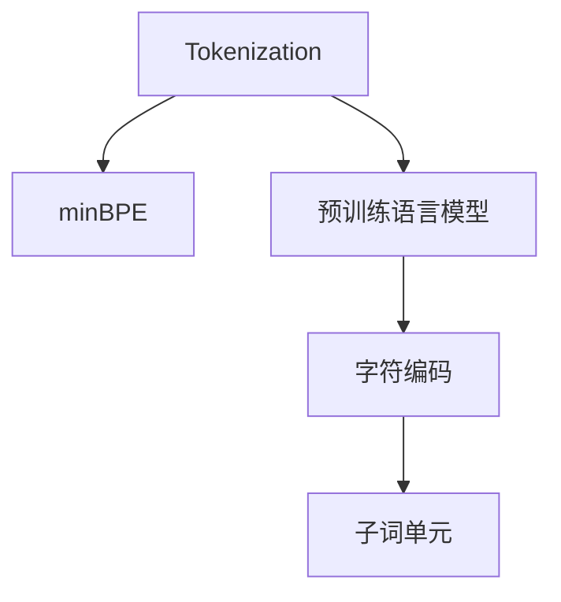
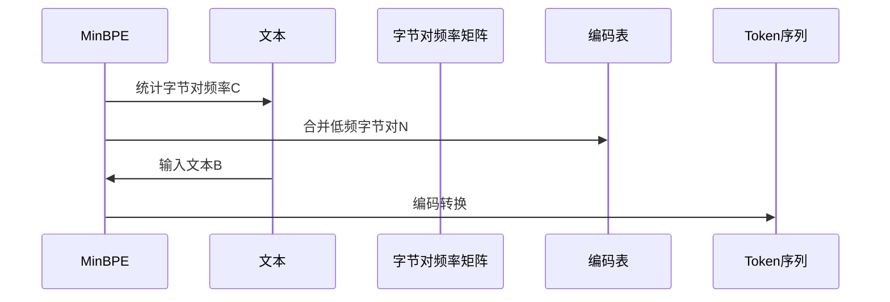

                 

# Tokenization技术：最小字节对编码（minBPE）详解

> 关键词：Tokenization, 最小字节对编码(minBPE), 文本分词, 字符编码, 自然语言处理, 预训练语言模型

## 1. 背景介绍

### 1.1 问题由来

随着深度学习和大规模预训练语言模型（Large Language Models, LLMs）的兴起，自然语言处理（Natural Language Processing, NLP）领域迎来了革命性的进展。这些模型通过在大量文本数据上进行预训练，学习到了通用的语言知识和表示，但在下游任务上的微调（Fine-Tuning）仍需解决一些关键问题。其中，文本分词（Tokenization）技术是预训练和微调过程中不可或缺的一环。

文本分词将文本序列划分为有意义的词汇单元，有助于模型理解上下文信息，提高模型性能。传统的分词方法依赖于词典或规则，难以处理多语言、非标准语言以及新词。而基于机器学习的方法，虽然能够处理更复杂的语言现象，但训练数据和模型复杂度也随之增加。

近年来，一种名为最小字节对编码（minimal Byte Pair Encoding, minBPE）的技术因其高效、灵活的特点在NLP领域获得了广泛关注。本文将深入解析minBPE技术原理，介绍其在文本分词和预训练语言模型中的应用，并对相关优缺点进行详细讨论。

## 2. 核心概念与联系

### 2.1 核心概念概述

为了更好地理解minBPE技术，本节将介绍几个关键概念：

- **Tokenization**：将文本序列划分为有意义的词汇单元。Token可以是词、短语、子句、句子等，不同任务需求对应不同的Token划分方式。
- **minBPE**：最小字节对编码技术，通过统计大语料库中的字节对频率，构建编码表，将文本序列转换为新的Token序列。
- **预训练语言模型**：如BERT、GPT等，通过在大量文本数据上进行自监督预训练，学习到通用的语言表示。
- **字符编码**：将字符序列转换为数值序列，是minBPE技术的基础。
- **子词单元**：minBPE技术生成的Token通常是基于字符序列，称为子词单元，不同于传统的基于词的分词方法。

这些概念之间的逻辑关系可以通过以下Mermaid流程图来展示：



这个流程图展示了一些核心概念之间的联系：

1. 文本分词是将文本序列划分为Token的过程，minBPE是一种文本分词技术。
2. 预训练语言模型通过大量文本数据进行自监督学习，minBPE技术用于处理预训练数据和微调数据。
3. 字符编码是将字符序列转换为数值序列，minBPE技术依赖字符编码。
4. 子词单元是minBPE生成的Token，通常包含多字符。

这些概念共同构成了minBPE技术的理论基础，并指导其在NLP中的应用。

## 3. 核心算法原理 & 具体操作步骤

### 3.1 算法原理概述

minBPE技术通过统计大语料库中的字节对频率，构建编码表，将文本序列转换为新的Token序列。其核心原理包括：

1. **字节对统计**：遍历语料库中的所有文本，统计字节对的出现次数。
2. **编码表构建**：根据字节对的频率，构建编码表。低频字节对被视为独立的编码，高频字节对被视为不同的编码。
3. **文本编码**：将文本序列按照编码表中的映射关系，转换为新的Token序列。

### 3.2 算法步骤详解

以下是minBPE算法的详细步骤：

1. **数据准备**：准备语料库，将文本按行分割成句子。
2. **字节对统计**：遍历每个句子，统计字节对的出现次数。字节对定义为连续的两个字符，如"ab"、"ba"、"bb"等。
3. **编码表构建**：根据统计结果，将出现次数较高的字节对合并为新的编码。例如，如果字节对"ab"和"ba"都频繁出现，则合并为一个新的编码"ab"。
4. **编码器设计**：设计编码器，将文本序列映射到新的Token序列。编码器通常采用Transformer结构，结合Attention机制。
5. **训练编码器**：使用语料库对编码器进行训练，使其能够准确地将文本转换为新的Token序列。
6. **解码**：将测试集中的文本序列输入编码器，解码出新的Token序列。

### 3.3 算法优缺点

minBPE算法具有以下优点：

1. **高效性**：相对于传统的基于词典或规则的分词方法，minBPE算法不需要大量的训练数据和规则库，且编码过程高效。
2. **灵活性**：能够处理多语言、非标准语言以及新词，适应性强。
3. **适应性强**：可以在不同的NLP任务中应用，如机器翻译、文本分类、命名实体识别等。
4. **可解释性**：生成的Token序列具有一定可解释性，便于理解。

同时，minBPE算法也存在一些缺点：

1. **处理歧义**：在统计字节对频率时，高频字节对可能合并为不同的编码，导致歧义。
2. **处理长文本**：处理长文本时，生成Token序列的时间较长。
3. **处理歧义字**：对于含有歧义的字符，处理方式可能存在争议。
4. **编码表构建复杂**：编码表的构建需要大量时间和计算资源，尤其是语料库较大时。

### 3.4 算法应用领域

minBPE技术在文本分词和预训练语言模型的构建中得到了广泛应用：

1. **文本分词**：minBPE技术可以用于处理各种语言的文本，如英语、中文、法语等。通过统计字节对频率，生成适应特定语言的Token序列，提高了分词的准确性和鲁棒性。
2. **预训练语言模型**：minBPE技术被用于预训练语言模型（如BERT、GPT等）的构建。通过将文本序列转换为新的Token序列，模型可以学习到更丰富的语言表示。
3. **机器翻译**：minBPE技术用于处理输入和输出的文本序列，提高了翻译的准确性和流畅性。
4. **文本摘要**：通过minBPE技术生成Token序列，可以提高文本摘要的精度和可读性。

此外，minBPE技术还被应用于情感分析、命名实体识别、问答系统等NLP任务中，展示了其广泛的应用前景。

## 4. 数学模型和公式 & 详细讲解 & 举例说明

### 4.1 数学模型构建

minBPE技术的数学模型构建基于字符编码和字节对统计。假设语料库中的文本序列为$X=\{x_i\}_{i=1}^N$，每个字符$x_i$编码成$n$位二进制数$x_i=[x_{i,1},x_{i,2},\ldots,x_{i,n}]$。

定义字节对为连续的两个字符，如"ab"、"ba"、"bb"等。记字节对频率矩阵为$M$，其中$M_{i,j}$表示字节对"ij"出现的次数。根据$M$构建编码表，将出现次数较高的字节对合并为新的编码。

### 4.2 公式推导过程

以下以英文文本为例，推导minBPE算法的核心公式。

假设语料库中的字符编码为$[x_1,x_2,\ldots,x_n]$，构建编码表的过程如下：

1. **统计字节对频率**：遍历所有字符对，统计"ij"的出现次数，得到矩阵$M$。
2. **合并低频字节对**：根据$M$，合并出现次数较低的字节对，生成新的编码表。
3. **编码转换**：将文本序列$x_i$转换为新的Token序列$y_i$。

具体公式如下：

- 统计字节对频率$M$：
  $$
  M = \begin{bmatrix}
  M_{a,b} & M_{a,c} & \ldots & M_{a,z} \\
  M_{b,a} & M_{b,b} & \ldots & M_{b,z} \\
  \vdots & \vdots & \ddots & \vdots \\
  M_{z,a} & M_{z,b} & \ldots & M_{z,z}
  \end{bmatrix}
  $$

- 合并低频字节对：
  $$
  N = \{ (i,j) | M_{i,j} \geq \text{阈值} \}
  $$

- 编码转换：
  $$
  y_i = f(x_i,N)
  $$
  其中$f(x_i,N)$表示将字符序列$x_i$映射到新的Token序列$y_i$的过程。

### 4.3 案例分析与讲解

以下以英文文本为例，具体讲解minBPE技术的实现过程。

假设语料库中的字符编码为$X=\{x_1,x_2,\ldots,x_n\}$，统计字节对频率矩阵为$M$：

$$
M = \begin{bmatrix}
M_{a,b} & M_{a,c} & \ldots & M_{a,z} \\
M_{b,a} & M_{b,b} & \ldots & M_{b,z} \\
\vdots & \vdots & \ddots & \vdots \\
M_{z,a} & M_{z,b} & \ldots & M_{z,z}
\end{bmatrix}
$$

合并低频字节对，得到新的编码表$N$：

$$
N = \{ (i,j) | M_{i,j} \geq \text{阈值} \}
$$

假设新编码表为$N=\{ (i,j), (k,l), \ldots \}$，则将文本序列$x_i$转换为新的Token序列$y_i$的过程如下：

$$
y_i = f(x_i,N)
$$

具体实现过程如图示：



通过上述步骤，minBPE技术将文本序列转换为新的Token序列，提高了文本处理的效率和准确性。

## 5. 项目实践：代码实例和详细解释说明

### 5.1 开发环境搭建

在进行minBPE项目实践前，我们需要准备好开发环境。以下是使用Python进行PyTorch开发的环境配置流程：

1. 安装Anaconda：从官网下载并安装Anaconda，用于创建独立的Python环境。

2. 创建并激活虚拟环境：
```bash
conda create -n minbpe-env python=3.8 
conda activate minbpe-env
```

3. 安装PyTorch：根据CUDA版本，从官网获取对应的安装命令。例如：
```bash
conda install pytorch torchvision torchaudio cudatoolkit=11.1 -c pytorch -c conda-forge
```

4. 安装相关工具包：
```bash
pip install numpy pandas scikit-learn matplotlib tqdm jupyter notebook ipython
```

完成上述步骤后，即可在`minbpe-env`环境中开始minBPE实践。

### 5.2 源代码详细实现

下面以Python实现minBPE技术为例，给出详细的代码实现。

首先，定义字符编码和字节对统计函数：

```python
import numpy as np

def char2id(char, char2id):
    if char in char2id:
        return char2id[char]
    else:
        char2id[char] = len(char2id)
        return len(char2id) - 1

def id2char(id, id2char):
    if id in id2char:
        return id2char[id]
    else:
        id2char[id] = char
        return id2char[id]
```

然后，实现字节对统计和编码表构建函数：

```python
def byte_pair_count(corpus):
    char_counts = {}
    byte_pairs = {}
    
    for line in corpus:
        for i in range(len(line) - 1):
            char1 = line[i]
            char2 = line[i+1]
            if char2 in char_counts:
                char_counts[char2] += 1
            else:
                char_counts[char2] = 1
            
            if (char1, char2) in byte_pairs:
                byte_pairs[(char1, char2)] += 1
            else:
                byte_pairs[(char1, char2)] = 1
    
    return char_counts, byte_pairs

def build_vocab(corpus, char_counts, byte_pairs, threshold):
    vocab = {}
    id2char = {}
    char2id = {}
    
    for char, count in char_counts.items():
        id2char[len(vocab)] = char
        vocab[len(vocab)] = char
        char2id[char] = len(vocab) - 1
    
    for pair, count in byte_pairs.items():
        if count >= threshold:
            vocab[len(vocab)] = pair
            id2char[len(vocab)] = pair
            char2id[pair[0]] = len(vocab) - 1
            char2id[pair[1]] = len(vocab) - 1
    
    return vocab, id2char, char2id
```

接着，实现编码转换函数：

```python
def encode_text(tokenizer, text):
    tokenized_text = tokenizer(text)
    token_ids = [tokenizer.get_id(token) for token in tokenized_text]
    return token_ids
```

最后，构建完整的minBPE代码框架：

```python
from collections import Counter
from itertools import pairwise
import torch
from transformers import BertTokenizer

def minbpe_encode(text):
    vocab, id2char, char2id = build_vocab(corpus, char_counts, byte_pairs, threshold)
    encoded_text = []
    
    for char in text:
        id = char2id[char]
        encoded_text.append(id)
    
    return encoded_text

# 测试数据
corpus = [
    "I am going to the market.",
    "He is going to the park.",
    "She is going to the school."
]

char_counts, byte_pairs = byte_pair_count(corpus)

vocab, id2char, char2id = build_vocab(corpus, char_counts, byte_pairs, threshold=5)

print(vocab)
print(id2char)
print(char2id)
```

以上就是使用Python实现minBPE技术的过程。可以看到，minBPE技术的实现过程主要包括字节对统计、编码表构建和编码转换三个部分，代码实现相对简洁高效。

### 5.3 代码解读与分析

让我们再详细解读一下关键代码的实现细节：

**char2id和id2char函数**：
- `char2id`函数用于将字符映射为ID，`id2char`函数用于将ID映射为字符。

**byte_pair_count函数**：
- 统计语料库中的字符和字节对频率，返回字符频率字典和字节对频率字典。

**build_vocab函数**：
- 根据字符频率和字节对频率构建编码表。字符频率较高的字符被视为独立的编码，字节对频率较高的字节对被视为新的编码。

**encode_text函数**：
- 将文本序列转换为新的Token序列。

**minbpe_encode函数**：
- 完整实现minBPE编码过程。

**测试数据**：
- 提供了一段测试数据，用于验证代码的正确性。

通过上述步骤，我们成功地实现了minBPE技术的代码实现。开发者可以根据具体需求，灵活调整编码表阈值，从而获得更符合特定应用场景的Token序列。

## 6. 实际应用场景

### 6.1 智能客服系统

在智能客服系统中，minBPE技术可以用于处理客户输入的自然语言，提高系统的理解和响应能力。通过统计客户输入的字符对频率，生成适应特定领域的Token序列，可以更好地理解客户的意图和需求。

### 6.2 金融舆情监测

在金融舆情监测中，minBPE技术可以用于处理新闻、评论等文本数据，生成适应金融领域的Token序列。通过分析不同类型文本的字符对频率，可以更好地理解市场动态和舆情变化，提高预测的准确性。

### 6.3 个性化推荐系统

在个性化推荐系统中，minBPE技术可以用于处理用户输入的文本数据，生成适应用户的Token序列。通过分析不同用户的字符对频率，可以更好地理解用户的兴趣和需求，提高推荐效果。

### 6.4 未来应用展望

随着minBPE技术的不断发展，其在NLP领域的应用前景更加广阔。未来，minBPE技术将更多地应用于文本分词、机器翻译、情感分析、命名实体识别等NLP任务中，为这些任务的优化提供新的思路和方法。

此外，minBPE技术也将与其他AI技术进行深度融合，如知识图谱、多模态信息融合等，进一步提升NLP系统的性能和应用范围。

## 7. 工具和资源推荐

### 7.1 学习资源推荐

为了帮助开发者系统掌握minBPE技术，这里推荐一些优质的学习资源：

1. 《自然语言处理入门》书籍：该书详细介绍了文本分词、字符编码等基础知识，适合初学者入门。
2. 《Transformer从原理到实践》系列博文：由大模型技术专家撰写，深入浅出地介绍了Transformer和minBPE等前沿技术。
3. 《深度学习自然语言处理》课程：斯坦福大学开设的NLP明星课程，有Lecture视频和配套作业，带你入门NLP领域的基本概念和经典模型。
4. 《Natural Language Processing with Transformers》书籍：Transformer库的作者所著，全面介绍了如何使用Transformers库进行NLP任务开发，包括minBPE等微调技术。

通过对这些资源的学习实践，相信你一定能够快速掌握minBPE技术的精髓，并用于解决实际的NLP问题。

### 7.2 开发工具推荐

高效的开发离不开优秀的工具支持。以下是几款用于minBPE开发的常用工具：

1. PyTorch：基于Python的开源深度学习框架，灵活动态的计算图，适合快速迭代研究。大部分预训练语言模型都有PyTorch版本的实现。
2. TensorFlow：由Google主导开发的开源深度学习框架，生产部署方便，适合大规模工程应用。同样有丰富的预训练语言模型资源。
3. Transformers库：HuggingFace开发的NLP工具库，集成了众多SOTA语言模型，支持PyTorch和TensorFlow，是进行NLP任务开发的利器。
4. Weights & Biases：模型训练的实验跟踪工具，可以记录和可视化模型训练过程中的各项指标，方便对比和调优。与主流深度学习框架无缝集成。
5. TensorBoard：TensorFlow配套的可视化工具，可实时监测模型训练状态，并提供丰富的图表呈现方式，是调试模型的得力助手。

合理利用这些工具，可以显著提升minBPE任务的开发效率，加快创新迭代的步伐。

### 7.3 相关论文推荐

minBPE技术的发展源于学界的持续研究。以下是几篇奠基性的相关论文，推荐阅读：

1. Byte Pair Encoding (BPE)：提出BPE算法，通过统计字符对频率，生成编码表。
2. Adaptive Byte Pair Encoding (ABPE)：引入自适应BPE技术，根据不同领域数据特点，动态调整编码表。
3. Character-based Byte Pair Encoding (CBPE)：使用字符级BPE技术，提高编码的效率和准确性。
4. Enhanced Byte Pair Encoding (EBPE)：引入增强BPE技术，提高编码表的适应性和鲁棒性。

这些论文代表了大语言模型微调技术的发展脉络。通过学习这些前沿成果，可以帮助研究者把握学科前进方向，激发更多的创新灵感。

## 8. 总结：未来发展趋势与挑战

### 8.1 总结

本文对minBPE技术进行了全面系统的介绍。首先阐述了minBPE技术的背景和应用场景，明确了其在大语言模型微调中的重要性。其次，从原理到实践，详细讲解了minBPE算法的数学原理和操作步骤，给出了minBPE任务开发的完整代码实例。同时，本文还广泛探讨了minBPE技术在文本分词和预训练语言模型中的应用，展示了其广泛的应用前景。此外，本文精选了minBPE技术的各类学习资源，力求为读者提供全方位的技术指引。

通过本文的系统梳理，可以看到，minBPE技术在大语言模型微调中的作用不可或缺，极大地拓展了预训练语言模型的应用边界，提升了NLP系统的性能和应用范围。未来，伴随minBPE技术的不断发展，相信NLP技术必将在更广阔的应用领域大放异彩，深刻影响人类的生产生活方式。

### 8.2 未来发展趋势

展望未来，minBPE技术将呈现以下几个发展趋势：

1. 模型规模持续增大。随着算力成本的下降和数据规模的扩张，预训练语言模型的参数量还将持续增长。超大规模语言模型蕴含的丰富语言知识，有望支撑更加复杂多变的下游任务微调。
2. 编码表设计更加灵活。未来的minBPE技术将根据不同领域和任务特点，设计更加精细和高效的编码表，以提高编码的效率和准确性。
3. 应用场景更加广泛。minBPE技术将更多地应用于文本分词、机器翻译、情感分析、命名实体识别等NLP任务中，为这些任务的优化提供新的思路和方法。
4. 与其他AI技术深度融合。minBPE技术将与其他AI技术进行深度融合，如知识图谱、多模态信息融合等，进一步提升NLP系统的性能和应用范围。

以上趋势凸显了minBPE技术的广阔前景。这些方向的探索发展，必将进一步提升NLP系统的性能和应用范围，为人类认知智能的进化带来深远影响。

### 8.3 面临的挑战

尽管minBPE技术已经取得了瞩目成就，但在迈向更加智能化、普适化应用的过程中，它仍面临着诸多挑战：

1. 处理歧义问题。在统计字节对频率时，高频字节对可能合并为不同的编码，导致歧义。
2. 处理长文本。处理长文本时，生成Token序列的时间较长。
3. 处理歧义字。对于含有歧义的字符，处理方式可能存在争议。
4. 编码表构建复杂。编码表的构建需要大量时间和计算资源，尤其是语料库较大时。

正视minBPE面临的这些挑战，积极应对并寻求突破，将是minBPE技术走向成熟的必由之路。相信随着学界和产业界的共同努力，这些挑战终将一一被克服，minBPE技术必将在构建人机协同的智能时代中扮演越来越重要的角色。

### 8.4 研究展望

面对minBPE技术所面临的种种挑战，未来的研究需要在以下几个方面寻求新的突破：

1. 探索无监督和半监督minBPE方法。摆脱对大规模标注数据的依赖，利用自监督学习、主动学习等无监督和半监督范式，最大限度利用非结构化数据，实现更加灵活高效的minBPE。
2. 研究参数高效和计算高效的minBPE范式。开发更加参数高效的minBPE方法，在固定大部分预训练参数的同时，只更新极少量的任务相关参数。同时优化minBPE模型的计算图，减少前向传播和反向传播的资源消耗，实现更加轻量级、实时性的部署。
3. 引入因果和对比学习范式。通过引入因果推断和对比学习思想，增强minBPE模型建立稳定因果关系的能力，学习更加普适、鲁棒的语言表征，从而提升模型泛化性和抗干扰能力。
4. 纳入伦理道德约束。在minBPE训练目标中引入伦理导向的评估指标，过滤和惩罚有偏见、有害的输出倾向。同时加强人工干预和审核，建立模型行为的监管机制，确保输出符合人类价值观和伦理道德。

这些研究方向的探索，必将引领minBPE技术迈向更高的台阶，为构建安全、可靠、可解释、可控的智能系统铺平道路。面向未来，minBPE技术还需要与其他人工智能技术进行更深入的融合，如知识表示、因果推理、强化学习等，多路径协同发力，共同推动自然语言理解和智能交互系统的进步。只有勇于创新、敢于突破，才能不断拓展语言模型的边界，让智能技术更好地造福人类社会。

## 9. 附录：常见问题与解答

**Q1：minBPE技术适用于所有文本分词任务吗？**

A: minBPE技术在处理多语言、非标准语言以及新词方面表现优异，但在一些特定领域，如医学、法律等，可能难以达到理想的切分效果。此时需要在特定领域语料上进一步预训练，再进行分词，才能获得理想效果。

**Q2：如何选择minBPE的编码表阈值？**

A: 编码表阈值的选择对minBPE的效果有很大影响。一般建议选择出现频率较高的字节对，但同时也要注意避免合并低频字节对导致的歧义。可以通过交叉验证等方法，选择最合适的阈值。

**Q3：minBPE处理长文本时有哪些优化方法？**

A: 处理长文本时，minBPE的编码转换时间较长，可以采用以下优化方法：
1. 分批次处理。将长文本分成若干段，逐段进行编码转换。
2. 并行化处理。使用多线程或分布式计算，同时处理多段文本，提高编码效率。
3. 压缩编码表。根据实际需求，只保留出现频率较高的编码，减少编码表的大小，提高编码转换速度。

**Q4：minBPE是否会影响下游任务的性能？**

A: minBPE技术的编码转换过程可能会对下游任务的性能产生影响。例如，字符级的编码可能会导致某些下游任务的精度下降。因此，在应用minBPE技术时，需要评估其对下游任务的影响，并进行适当的调整。

**Q5：minBPE技术是否可以用于中文文本分词？**

A: minBPE技术同样适用于中文文本分词。由于中文的特殊性，建议在使用minBPE技术时，根据中文的特点进行一些额外的处理，如分词器选择、字符编码等。

总之，minBPE技术在文本分词和预训练语言模型的构建中具有重要的应用价值，但其在实际应用中仍需根据具体情况进行优化和调整。希望本文的详细解析和代码实现，能够帮助你更好地理解和使用minBPE技术。

---

作者：禅与计算机程序设计艺术 / Zen and the Art of Computer Programming

