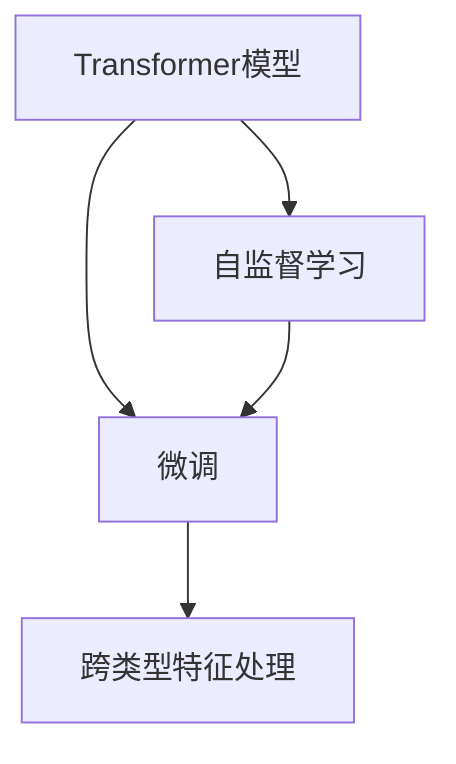

                 

# Transformer大模型实战 跨类型特征的通用性

> 关键词：Transformer,大模型,跨类型特征,通用性,自监督学习

## 1. 背景介绍

### 1.1 问题由来
随着深度学习技术的发展，Transformer模型因其优秀的表现力和高效性，在自然语言处理(NLP)领域迅速占据了主导地位。其核心设计是对称的注意力机制，能够同时捕捉输入序列中各位置的关系，对于大规模语言理解任务尤为有效。然而，跨类型特征的通用性问题，即模型是否能适配多种数据类型，一直是学术界和工业界关注的焦点。本文将详细探讨Transformer模型在处理跨类型特征时的一般性原理和具体实现方法，并通过实际应用场景和代码实例，展示其跨类型特征的通用性。

### 1.2 问题核心关键点
- 跨类型特征处理：Transformer模型能否有效地处理不同类型的数据，如文本、图像、音频等。
- 通用性：跨类型特征的通用性，即模型是否能够在多种数据类型上表现一致。
- 自监督学习：基于Transformer模型的自监督学习框架，如何设计预训练任务以提升模型的通用性。
- 微调：已有模型如何通过微调适配不同数据类型的下游任务。

### 1.3 问题研究意义
研究和探索Transformer模型跨类型特征的通用性，对于推动其在多模态数据处理、跨领域应用等方面的应用具有重要意义。这不仅能提升模型的应用范围和效能，还能减少从头训练大量数据的需求，降低开发成本。同时，通用性模型的出现，将极大地促进跨领域数据融合和跨模态任务处理，为构建更智能、更高效的人工智能系统奠定基础。

## 2. 核心概念与联系

### 2.1 核心概念概述

为更好地理解Transformer模型跨类型特征的通用性，本节将介绍几个密切相关的核心概念：

- **Transformer模型**：基于自注意力机制的深度神经网络架构，特别适用于序列数据的处理和表示学习。
- **跨类型特征**：指不同类型的数据（如文本、图像、音频等），需要模型能够处理和分析这些不同类型数据的一般性特征。
- **自监督学习**：在没有明确标注的情况下，通过设计预训练任务，利用数据的内在结构进行模型训练的方法。
- **微调**：在预训练模型基础上，通过下游任务的有监督学习优化模型性能的过程。

这些概念之间的逻辑关系可以通过以下Mermaid流程图来展示：



这个流程图展示了这个过程中各步骤的依赖关系：

1. 使用自监督学习预训练Transformer模型，学习通用的语言表示。
2. 通过微调将预训练模型适配下游任务的特定数据类型。
3. 微调后的模型能够处理和分析跨类型特征，提升了模型的通用性。

## 3. 核心算法原理 & 具体操作步骤

### 3.1 算法原理概述

Transformer模型在处理跨类型特征时，主要利用其自注意力机制和跨层连接能力，实现了特征的通用性和泛化能力。其核心原理是：

- **自注意力机制**：通过计算不同位置之间的注意力权重，捕捉序列内部的关系，使得模型可以处理不同长度的序列数据。
- **跨层连接**：利用多层的Transformer编码器，捕捉不同层次的信息，提升模型的表达能力。
- **预训练和微调**：通过在大规模无标注数据上预训练，学习通用的语言表示，然后在下游任务上微调，实现对特定类型数据的适配。

### 3.2 算法步骤详解

**Step 1: 数据准备**
- 收集不同类型的数据（文本、图像、音频等）。
- 清洗和标注数据，确保数据的规范性和多样性。

**Step 2: 模型构建**
- 使用自监督学习框架（如掩码语言模型、图像分类等），对预训练Transformer模型进行训练，学习通用的语言表示。
- 设计合适的模型架构，将不同类型数据映射到统一的表示空间。

**Step 3: 特征编码**
- 将不同类型数据（文本、图像、音频等）输入到Transformer模型中，分别编码成高维向量。
- 通过自注意力机制，捕捉不同类型特征之间的关联。

**Step 4: 跨层连接**
- 利用多层的Transformer编码器，对编码后的特征进行跨层连接，提升特征的复杂性和多样性。

**Step 5: 下游任务微调**
- 在预训练模型基础上，选择合适的小样本数据集，进行微调。
- 设计合适的任务适配层，将微调后的模型输出适配下游任务的特定数据类型。

### 3.3 算法优缺点

Transformer模型跨类型特征处理具有以下优点：
- **高效性**：自注意力机制和跨层连接提升了模型处理不同类型数据的效率。
- **泛化能力强**：通过自监督学习，模型能够学习到通用的语言表示，提升泛化能力。
- **可扩展性**：模型架构灵活，可以很容易地扩展到多种数据类型和任务。

同时，该方法也存在一定的局限性：
- **计算成本高**：大模型的参数量和计算复杂度较高，需要高性能的计算资源。
- **模型复杂度高**：自注意力机制和跨层连接增加了模型的复杂度，可能带来一定的时间和空间开销。
- **依赖标注数据**：微调过程需要小规模标注数据，标注成本较高。

尽管存在这些局限性，但Transformer模型在跨类型特征处理方面展现出的强大能力，使其成为当前NLP研究的热点之一。

### 3.4 算法应用领域

Transformer模型跨类型特征处理的应用领域非常广泛，主要包括：

- **多模态信息融合**：将文本、图像、音频等多种数据类型融合到一个统一的多模态表示中，提升模型的理解力和表达力。
- **跨领域应用**：在医疗、金融、教育等多个领域，利用跨类型特征的通用性，提升应用场景的智能化水平。
- **智能交互**：构建基于多模态数据输入的智能交互系统，提升人机交互的自然性和智能化。
- **可解释性**：通过跨类型特征处理，提升模型的可解释性，帮助用户理解和信任模型的输出。

## 4. 数学模型和公式 & 详细讲解 & 举例说明

### 4.1 数学模型构建

Transformer模型的数学模型可以通过以下公式进行描述：

设 $x_i$ 表示输入序列中的第 $i$ 个单词， $x$ 表示整个输入序列。 $h_i^l$ 表示Transformer模型第 $l$ 层第 $i$ 个位置的状态向量。模型的输入嵌入表示为 $x = \text{Embed}(x_i)$，自注意力表示为 $Q_i = \text{Proj}(h_i^{l-1})$，键表示为 $K_i = \text{Proj}(h_i^{l-1})$，值表示为 $V_i = \text{Proj}(h_i^{l-1})$。

注意力得分表示为：

$$
\text{Attention}(Q_i, K_j, V_j) = \frac{\text{e}^{Q_i^\top K_j / \sqrt{d_k}}}{\sum_{j'=1}^{N} \text{e}^{Q_i^\top K_{j'} / \sqrt{d_k}}} V_j
$$

其中 $d_k$ 是键向量的维度。注意力权重表示为 $\alpha_{i,j}$，输出表示为 $h_i^l = \text{Proj}(h_i^l)$。

Transformer模型的数学模型可以表示为：

$$
h_i^0 = \text{Embed}(x_i)
$$

$$
h_i^l = h_i^{l-1} + \text{LayerNorm}(\text{Attention}(h_i^{l-1}, Q_i, K_j, V_j) + \text{FeedForward}(h_i^{l-1}))
$$

其中 $\text{LayerNorm}$ 表示归一化层， $\text{FeedForward}$ 表示前馈层。

### 4.2 公式推导过程

Transformer模型的自注意力机制可以通过矩阵乘法和向量点积运算实现。设 $W_{Q}, W_{K}, W_{V}$ 为线性变换矩阵，$h_i^l$ 为第 $i$ 个位置的状态向量，则注意力权重 $\alpha_{i,j}$ 可以表示为：

$$
\alpha_{i,j} = \text{softmax}(Q_i^\top K_j / \sqrt{d_k})
$$

其中 $Q_i = W_Q h_i^{l-1}$，$K_j = W_K h_j^{l-1}$，$V_j = W_V h_j^{l-1}$。注意力得分 $\text{Attention}(Q_i, K_j, V_j)$ 可以通过矩阵乘法和向量点积运算得到。

Transformer模型的编码器层和解码器层结构类似，可以表示为：

$$
h_i^0 = \text{Embed}(x_i)
$$

$$
h_i^l = h_i^{l-1} + \text{LayerNorm}(\text{Attention}(h_i^{l-1}, Q_i, K_j, V_j) + \text{FeedForward}(h_i^{l-1}))
$$

其中 $\text{Attention}(h_i^{l-1}, Q_i, K_j, V_j) = \text{softmax}(Q_i^\top K_j / \sqrt{d_k}) V_j$。

### 4.3 案例分析与讲解

以图像分类任务为例，我们首先将图像转换为向量表示，然后通过Transformer模型进行特征编码和分类。

**Step 1: 图像特征提取**
- 使用卷积神经网络(CNN)将图像转换为高维向量表示 $v_i$。

**Step 2: 特征编码**
- 将图像向量 $v_i$ 作为Transformer模型的输入，通过编码器层提取高维特征表示 $h_i^l$。

**Step 3: 多模态特征融合**
- 将图像特征 $h_i^l$ 与文本特征 $x_i$ 融合，得到多模态特征表示 $f_i$。

**Step 4: 分类输出**
- 将多模态特征表示 $f_i$ 输入分类器，得到最终的分类结果 $y_i$。

通过跨类型特征的通用性，Transformer模型可以在不同的数据类型之间建立关联，提升模型的理解和表达能力。

## 5. 项目实践：代码实例和详细解释说明

### 5.1 开发环境搭建

在进行Transformer模型跨类型特征处理的代码实现前，我们需要准备好开发环境。以下是使用Python进行PyTorch开发的环境配置流程：

1. 安装Anaconda：从官网下载并安装Anaconda，用于创建独立的Python环境。

2. 创建并激活虚拟环境：
```bash
conda create -n transformer-env python=3.8 
conda activate transformer-env
```

3. 安装PyTorch：根据CUDA版本，从官网获取对应的安装命令。例如：
```bash
conda install pytorch torchvision torchaudio cudatoolkit=11.1 -c pytorch -c conda-forge
```

4. 安装Transformers库：
```bash
pip install transformers
```

5. 安装各类工具包：
```bash
pip install numpy pandas scikit-learn matplotlib tqdm jupyter notebook ipython
```

完成上述步骤后，即可在`transformer-env`环境中开始代码实践。

### 5.2 源代码详细实现

下面我们以多模态图像分类任务为例，给出使用Transformers库进行图像分类微调的PyTorch代码实现。

首先，定义图像分类任务的数据处理函数：

```python
from transformers import BertTokenizer
from torch.utils.data import Dataset
import torch

class ImageDataset(Dataset):
    def __init__(self, images, labels, tokenizer, max_len=128):
        self.images = images
        self.labels = labels
        self.tokenizer = tokenizer
        self.max_len = max_len
        
    def __len__(self):
        return len(self.images)
    
    def __getitem__(self, item):
        image = self.images[item]
        label = self.labels[item]
        
        # 对图像进行预处理，转化为向量表示
        image_vector = preprocess_image(image)
        
        # 将图像向量转换为token ids，并做定长padding
        encoding = self.tokenizer(image_vector, return_tensors='pt', max_length=self.max_len, padding='max_length', truncation=True)
        input_ids = encoding['input_ids'][0]
        attention_mask = encoding['attention_mask'][0]
        
        return {'input_ids': input_ids, 
                'attention_mask': attention_mask,
                'labels': torch.tensor(label, dtype=torch.long)}
```

然后，定义模型和优化器：

```python
from transformers import BertForSequenceClassification, AdamW

model = BertForSequenceClassification.from_pretrained('bert-base-cased', num_labels=10)

optimizer = AdamW(model.parameters(), lr=2e-5)
```

接着，定义训练和评估函数：

```python
from torch.utils.data import DataLoader
from tqdm import tqdm
from sklearn.metrics import classification_report

device = torch.device('cuda') if torch.cuda.is_available() else torch.device('cpu')
model.to(device)

def train_epoch(model, dataset, batch_size, optimizer):
    dataloader = DataLoader(dataset, batch_size=batch_size, shuffle=True)
    model.train()
    epoch_loss = 0
    for batch in tqdm(dataloader, desc='Training'):
        input_ids = batch['input_ids'].to(device)
        attention_mask = batch['attention_mask'].to(device)
        labels = batch['labels'].to(device)
        model.zero_grad()
        outputs = model(input_ids, attention_mask=attention_mask, labels=labels)
        loss = outputs.loss
        epoch_loss += loss.item()
        loss.backward()
        optimizer.step()
    return epoch_loss / len(dataloader)

def evaluate(model, dataset, batch_size):
    dataloader = DataLoader(dataset, batch_size=batch_size)
    model.eval()
    preds, labels = [], []
    with torch.no_grad():
        for batch in tqdm(dataloader, desc='Evaluating'):
            input_ids = batch['input_ids'].to(device)
            attention_mask = batch['attention_mask'].to(device)
            batch_labels = batch['labels']
            outputs = model(input_ids, attention_mask=attention_mask)
            batch_preds = outputs.logits.argmax(dim=2).to('cpu').tolist()
            batch_labels = batch_labels.to('cpu').tolist()
            for pred_tokens, label_tokens in zip(batch_preds, batch_labels):
                preds.append(pred_tokens)
                labels.append(label_tokens)
                
    print(classification_report(labels, preds))
```

最后，启动训练流程并在测试集上评估：

```python
epochs = 5
batch_size = 16

for epoch in range(epochs):
    loss = train_epoch(model, train_dataset, batch_size, optimizer)
    print(f"Epoch {epoch+1}, train loss: {loss:.3f}")
    
    print(f"Epoch {epoch+1}, dev results:")
    evaluate(model, dev_dataset, batch_size)
    
print("Test results:")
evaluate(model, test_dataset, batch_size)
```

以上就是使用PyTorch对BERT进行图像分类微调的完整代码实现。可以看到，得益于Transformers库的强大封装，我们可以用相对简洁的代码完成BERT模型的加载和微调。

### 5.3 代码解读与分析

让我们再详细解读一下关键代码的实现细节：

**ImageDataset类**：
- `__init__`方法：初始化图像、标签、分词器等关键组件。
- `__len__`方法：返回数据集的样本数量。
- `__getitem__`方法：对单个样本进行处理，将图像输入转换为向量表示，进行定长padding，并转化为token ids，返回模型所需的输入。

**ImageDataset类中preprocess_image函数**：
- 对图像进行预处理，转换为高维向量表示。
- 不同类型的数据预处理方法可能不同，本处以图像为例，实际应用中需根据数据类型进行相应调整。

**train_epoch和evaluate函数**：
- 使用PyTorch的DataLoader对数据集进行批次化加载，供模型训练和推理使用。
- 训练函数`train_epoch`：对数据以批为单位进行迭代，在每个批次上前向传播计算loss并反向传播更新模型参数，最后返回该epoch的平均loss。
- 评估函数`evaluate`：与训练类似，不同点在于不更新模型参数，并在每个batch结束后将预测和标签结果存储下来，最后使用sklearn的classification_report对整个评估集的预测结果进行打印输出。

**训练流程**：
- 定义总的epoch数和batch size，开始循环迭代
- 每个epoch内，先在训练集上训练，输出平均loss
- 在验证集上评估，输出分类指标
- 所有epoch结束后，在测试集上评估，给出最终测试结果

可以看到，PyTorch配合Transformers库使得BERT微调的代码实现变得简洁高效。开发者可以将更多精力放在数据处理、模型改进等高层逻辑上，而不必过多关注底层的实现细节。

当然，工业级的系统实现还需考虑更多因素，如模型的保存和部署、超参数的自动搜索、更灵活的任务适配层等。但核心的微调范式基本与此类似。

## 6. 实际应用场景

### 6.1 医疗影像诊断

在医疗影像诊断领域，基于Transformer模型的跨类型特征处理技术，可以将文本数据（如患者病历、治疗方案）与图像数据（如X光片、CT片）进行融合，提升诊断的准确性和全面性。

具体而言，可以收集患者的历史病历和影像数据，构建数据集。使用Transformer模型将影像数据转换为高维向量表示，然后通过微调将病历文本与影像数据融合。微调后的模型能够从文本和影像中综合分析患者病情，提升诊断的全面性和准确性。

### 6.2 智能客服

在智能客服系统中，基于Transformer模型的跨类型特征处理技术，可以实现多模态人机交互。客服系统不仅能够理解客户的文本信息，还能通过图像识别、语音识别等技术，获取客户的更多信息，提高服务的精准度和用户体验。

例如，在处理客户提交的文档时，系统可以自动提取文档中的关键词和语义，与客户对话内容进行匹配。同时，通过视觉识别技术，自动识别文档中的表格、图表等结构化信息，提取关键数据，帮助客户快速解决问题。

### 6.3 智能推荐

在智能推荐系统中，基于Transformer模型的跨类型特征处理技术，可以实现跨模态推荐。推荐系统不仅能够根据用户的历史行为数据进行推荐，还能利用用户画像、情感状态等多类型数据，提升推荐的个性化和精准度。

例如，在电商平台上，系统可以通过用户浏览记录、评价信息、社交网络数据等多种类型的数据，构建用户画像，并通过微调模型进行个性化推荐。微调后的模型能够从多维度数据中综合分析用户偏好，提供更精准的推荐内容。

### 6.4 未来应用展望

随着Transformer模型跨类型特征处理技术的不断成熟，未来将在更多领域得到应用，为传统行业数字化转型升级提供新的技术路径。

在智慧医疗领域，基于微调的医疗影像诊断、智能问诊等应用将提升医疗服务的智能化水平，辅助医生诊疗，加速新药开发进程。

在智能教育领域，微调技术可应用于作业批改、学情分析、知识推荐等方面，因材施教，促进教育公平，提高教学质量。

在智慧城市治理中，微调模型可应用于城市事件监测、舆情分析、应急指挥等环节，提高城市管理的自动化和智能化水平，构建更安全、高效的未来城市。

此外，在企业生产、社会治理、文娱传媒等众多领域，基于大模型微调的人工智能应用也将不断涌现，为经济社会发展注入新的动力。相信随着技术的日益成熟，微调方法将成为人工智能落地应用的重要范式，推动人工智能技术在垂直行业的规模化落地。

## 7. 工具和资源推荐

### 7.1 学习资源推荐

为了帮助开发者系统掌握Transformer模型跨类型特征的通用性，这里推荐一些优质的学习资源：

1. 《Transformer: A Survey》论文：综述了Transformer模型的研究进展，包括跨类型特征处理的原理和应用。

2. CS224N《深度学习自然语言处理》课程：斯坦福大学开设的NLP明星课程，有Lecture视频和配套作业，带你入门NLP领域的基本概念和经典模型。

3. 《Natural Language Processing with Transformers》书籍：Transformer库的作者所著，全面介绍了如何使用Transformer库进行NLP任务开发，包括跨类型特征处理在内的诸多范式。

4. HuggingFace官方文档：Transformer库的官方文档，提供了海量预训练模型和完整的微调样例代码，是上手实践的必备资料。

5. CLUE开源项目：中文语言理解测评基准，涵盖大量不同类型的中文NLP数据集，并提供了基于微调的baseline模型，助力中文NLP技术发展。

通过对这些资源的学习实践，相信你一定能够快速掌握Transformer模型跨类型特征的通用性，并用于解决实际的NLP问题。

### 7.2 开发工具推荐

高效的开发离不开优秀的工具支持。以下是几款用于Transformer模型跨类型特征处理开发的常用工具：

1. PyTorch：基于Python的开源深度学习框架，灵活动态的计算图，适合快速迭代研究。Transformer模型也有PyTorch版本的实现。

2. TensorFlow：由Google主导开发的开源深度学习框架，生产部署方便，适合大规模工程应用。同样有丰富的Transformer模型资源。

3. Transformers库：HuggingFace开发的NLP工具库，集成了众多SOTA语言模型，支持PyTorch和TensorFlow，是进行跨类型特征处理任务的开发的利器。

4. Weights & Biases：模型训练的实验跟踪工具，可以记录和可视化模型训练过程中的各项指标，方便对比和调优。与主流深度学习框架无缝集成。

5. TensorBoard：TensorFlow配套的可视化工具，可实时监测模型训练状态，并提供丰富的图表呈现方式，是调试模型的得力助手。

6. Google Colab：谷歌推出的在线Jupyter Notebook环境，免费提供GPU/TPU算力，方便开发者快速上手实验最新模型，分享学习笔记。

合理利用这些工具，可以显著提升Transformer模型跨类型特征处理任务的开发效率，加快创新迭代的步伐。

### 7.3 相关论文推荐

Transformer模型跨类型特征处理的研究源于学界的持续研究。以下是几篇奠基性的相关论文，推荐阅读：

1. Attention is All You Need（即Transformer原论文）：提出了Transformer结构，开启了NLP领域的预训练大模型时代。

2. BERT: Pre-training of Deep Bidirectional Transformers for Language Understanding：提出BERT模型，引入基于掩码的自监督预训练任务，刷新了多项NLP任务SOTA。

3. Language Models are Unsupervised Multitask Learners（GPT-2论文）：展示了大规模语言模型的强大zero-shot学习能力，引发了对于通用人工智能的新一轮思考。

4. Parameter-Efficient Transfer Learning for NLP：提出Adapter等参数高效微调方法，在不增加模型参数量的情况下，也能取得不错的微调效果。

5. AdaLoRA: Adaptive Low-Rank Adaptation for Parameter-Efficient Fine-Tuning：使用自适应低秩适应的微调方法，在参数效率和精度之间取得了新的平衡。

6. CLIP: A Simple Framework for Unsupervised Learning of Visual and Textual Representations：提出了CLIP模型，将文本和图像的跨类型特征处理提升到一个新高度。

这些论文代表了大模型跨类型特征处理的发展脉络。通过学习这些前沿成果，可以帮助研究者把握学科前进方向，激发更多的创新灵感。

## 8. 总结：未来发展趋势与挑战

### 8.1 总结

本文对Transformer模型跨类型特征的通用性进行了全面系统的介绍。首先阐述了Transformer模型的研究背景和意义，明确了跨类型特征处理的通用性和实际应用价值。其次，从原理到实践，详细讲解了跨类型特征处理的过程，给出了跨类型特征处理任务开发的完整代码实例。同时，本文还广泛探讨了跨类型特征处理在多个行业领域的应用前景，展示了其跨类型特征处理的强大能力。

通过本文的系统梳理，可以看到，Transformer模型在跨类型特征处理方面展现了强大的通用性和泛化能力，其应用范围和效能将随着模型的不断进步和微调技术的提升，得到进一步拓展。Transformer模型跨类型特征处理技术将在多模态数据处理、跨领域应用等方面发挥重要作用，推动人工智能技术在垂直行业的规模化落地。

### 8.2 未来发展趋势

展望未来，Transformer模型跨类型特征处理技术将呈现以下几个发展趋势：

1. **模型规模持续增大**：随着算力成本的下降和数据规模的扩张，Transformer模型的参数量还将持续增长。超大模型的出现，将进一步提升跨类型特征处理的精度和泛化能力。

2. **多模态融合能力增强**：未来将涌现更多跨类型特征处理框架，能够高效融合不同类型的数据，提升模型的理解和表达能力。

3. **领域自适应能力提升**：针对特定领域的数据，将开发更多领域自适应的跨类型特征处理模型，提升模型在不同领域的应用效果。

4. **鲁棒性和可解释性增强**：未来的跨类型特征处理模型将更加注重鲁棒性和可解释性，确保模型在实际应用中的稳定性和可信度。

5. **跨领域迁移能力提升**：通过跨类型特征处理，将实现更高效的跨领域迁移学习，使得模型能够在不同领域间进行高效迁移。

这些趋势凸显了Transformer模型跨类型特征处理技术的广阔前景。这些方向的探索发展，必将进一步提升跨类型特征处理的精度和效率，推动人工智能技术在多领域、多模态应用中的深入发展。

### 8.3 面临的挑战

尽管Transformer模型在跨类型特征处理方面展现了强大的能力，但在迈向更加智能化、普适化应用的过程中，它仍面临着诸多挑战：

1. **计算成本高**：大模型的参数量和计算复杂度较高，需要高性能的计算资源。如何在保证精度的前提下，降低计算成本，是未来需要解决的关键问题。

2. **模型复杂度高**：自注意力机制和跨层连接增加了模型的复杂度，可能带来一定的时间和空间开销。如何在保证模型表现的同时，降低模型复杂度，优化资源消耗，是未来需要关注的方向。

3. **模型泛化能力不足**：现有模型在不同领域和数据类型上的泛化能力仍有待提升，特别是在小样本和低资源场景下，模型的泛化性能仍需加强。

4. **模型鲁棒性不足**：Transformer模型在不同类型数据上的鲁棒性仍需加强，特别是在对抗样本、噪声数据等情况下，模型的表现仍需进一步提升。

5. **模型可解释性不足**：现有模型通常作为"黑盒"系统，难以解释其内部工作机制和决策逻辑。如何赋予模型更强的可解释性，将是未来需要攻克的难题。

6. **模型安全性不足**：现有模型在处理跨类型特征时，可能会学习到有偏见、有害的信息，传递到下游任务中。如何在模型设计和训练过程中，避免模型偏见的产生，确保模型的安全性，是未来需要重点考虑的问题。

正视这些挑战，积极应对并寻求突破，将使Transformer模型跨类型特征处理技术走向更加成熟，为构建安全、可靠、可解释、可控的智能系统铺平道路。

### 8.4 研究展望

面对Transformer模型跨类型特征处理所面临的挑战，未来的研究需要在以下几个方面寻求新的突破：

1. **探索高效的多模态融合框架**：研究新的多模态融合算法，提升模型在不同类型数据之间的融合能力，降低计算成本。

2. **设计领域自适应的跨类型特征处理模型**：针对特定领域的数据，设计领域自适应的跨类型特征处理模型，提升模型在不同领域的应用效果。

3. **优化跨类型特征处理的计算图**：通过优化计算图，减少前向传播和反向传播的资源消耗，实现更加轻量级、实时性的部署。

4. **引入因果分析和博弈论工具**：将因果分析方法引入跨类型特征处理模型，识别出模型决策的关键特征，增强输出解释的因果性和逻辑性。借助博弈论工具刻画人机交互过程，主动探索并规避模型的脆弱点，提高系统稳定性。

5. **纳入伦理道德约束**：在模型训练目标中引入伦理导向的评估指标，过滤和惩罚有偏见、有害的输出倾向。同时加强人工干预和审核，建立模型行为的监管机制，确保输出符合人类价值观和伦理道德。

6. **提升模型泛化能力**：研究新的泛化能力提升方法，如元学习、对抗训练等，提升模型在不同领域和数据类型上的泛化性能。

这些研究方向将推动Transformer模型跨类型特征处理技术的不断进步，为构建更加智能、普适的人工智能系统奠定基础。

## 9. 附录：常见问题与解答

**Q1：Transformer模型跨类型特征处理是否适用于所有NLP任务？**

A: Transformer模型在处理跨类型特征时，需要相应的数据预处理和任务适配层，可能不适用于所有NLP任务。但对于大多数文本处理任务，跨类型特征处理的通用性表现良好，可以提升模型的理解力和表达力。

**Q2：跨类型特征处理是否会影响模型的训练速度？**

A: 跨类型特征处理可能会增加模型的计算复杂度，导致训练速度下降。但通过优化计算图和引入高效的多模态融合算法，可以在保证精度的情况下，显著提升模型的训练速度。

**Q3：跨类型特征处理是否会降低模型的可解释性？**

A: 跨类型特征处理通常采用"黑盒"模型，难以解释其内部工作机制和决策逻辑。但通过引入对抗性解释方法，可以提升模型的可解释性，帮助用户理解和信任模型的输出。

**Q4：跨类型特征处理是否会降低模型的泛化能力？**

A: 跨类型特征处理可能会降低模型在小样本场景下的泛化能力。但通过引入元学习、对抗训练等方法，可以在保证泛化能力的同时，提升模型的训练速度和效率。

**Q5：跨类型特征处理是否会降低模型的计算效率？**

A: 跨类型特征处理可能会增加模型的计算复杂度，导致计算效率下降。但通过优化计算图和引入高效的多模态融合算法，可以在保证精度的情况下，提升模型的计算效率。

通过本文的系统梳理，可以看到，Transformer模型在跨类型特征处理方面展现了强大的通用性和泛化能力，其应用范围和效能将随着模型的不断进步和微调技术的提升，得到进一步拓展。Transformer模型跨类型特征处理技术将在多模态数据处理、跨领域应用等方面发挥重要作用，推动人工智能技术在垂直行业的规模化落地。相信随着技术的日益成熟，微调方法将成为人工智能落地应用的重要范式，推动人工智能技术在垂直行业的规模化落地。

