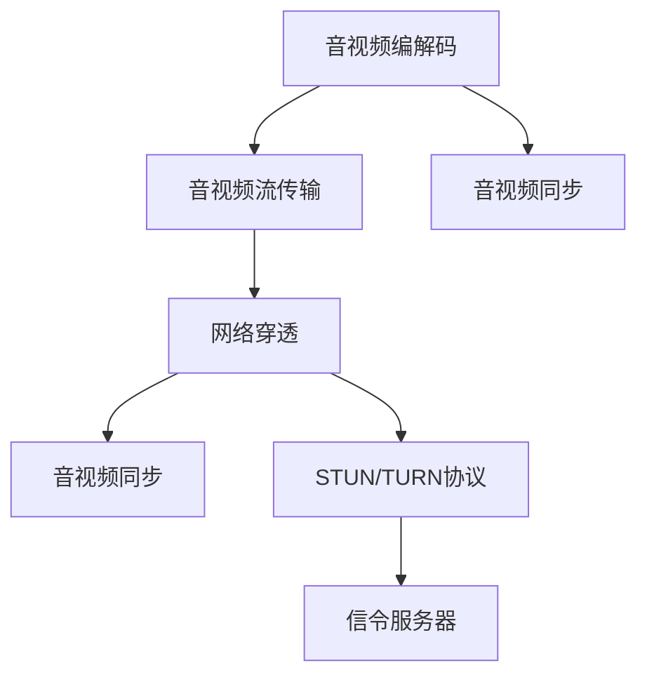

                 

# WebRTC 实时通信：在浏览器中实现

> 关键词：WebRTC, 实时通信, 浏览器, 音视频流, P2P, STUN/TURN, 信令服务器, 视频编码, 音视频传输, 网络延迟, 音视频同步

## 1. 背景介绍

### 1.1 问题由来
随着互联网技术的发展，实时通信需求变得愈发重要。在企业视频会议、在线教育、在线医疗、远程协作等领域，实时音视频流的传输已经成为必不可少的技术支持。然而，传统的音视频通信解决方案大多依赖第三方平台，存在部署成本高、安全性低、用户体验差等问题。为了解决这些问题，WebRTC（Web Real-Time Communications）技术应运而生。

WebRTC是一个开源的实时通信技术，可以在浏览器之间直接进行音视频通话，无需依赖第三方平台，具备高性能、高安全性的特点。WebRTC的核心技术包括音视频编码、传输和同步，并通过STUN/TURN协议实现网络穿透和 NAT 穿越，保障了音视频通信的稳定性和实时性。

### 1.2 问题核心关键点
WebRTC的核心问题在于如何通过浏览器实现实时音视频通信，涉及以下几个关键点：
1. **音视频编码与传输**：如何在浏览器中高效编码和传输音视频流。
2. **网络穿透与 NAT 穿越**：如何利用STUN/TURN协议实现音视频流的穿透和穿越。
3. **音视频同步与稳定性**：如何保障音视频流的同步性和稳定性。

## 2. 核心概念与联系

### 2.1 核心概念概述

为更好地理解WebRTC的实现原理，本节将介绍几个密切相关的核心概念：

- **音视频编解码**：指将原始音视频数据转化为网络流，以便于传输和同步。常见的编解码器包括H.264、VP8、VP9、AAC、Opus等。
- **音视频流传输**：通过TCP、UDP等协议，将编解码后的音视频流传输到接收端，并进行实时播放。
- **网络穿透**：指音视频流在网络中穿过多重 NAT 设备，保证流能够顺利到达目标地址。
- **音视频同步**：确保接收端能够准确地将音视频流与播放设备同步。
- **STUN/TURN协议**：STUN用于获取内网地址，TURN用于穿越STUN无法穿透的 NAT 设备。
- **信令服务器**：负责接收双方信令，进行呼叫建立、数据交换和会话管理。

这些核心概念之间的逻辑关系可以通过以下Mermaid流程图来展示：



这个流程图展示了大语言模型的核心概念及其之间的关系：

1. 音视频编解码将原始音视频数据转化为网络流。
2. 音视频流传输将编解码后的音视频流传输到接收端，并进行实时播放。
3. 音视频同步确保接收端能够准确地将音视频流与播放设备同步。
4. 网络穿透通过STUN/TURN协议实现音视频流的穿透和穿越。
5. 信令服务器负责接收双方信令，进行呼叫建立、数据交换和会话管理。

## 3. 核心算法原理 & 具体操作步骤
### 3.1 算法原理概述

WebRTC的核心算法原理主要围绕音视频编解码、音视频流传输、音视频同步、网络穿透与 NAT 穿越等几个关键环节展开。其中，音视频编解码和音视频流传输是音视频通信的基础，音视频同步和网络穿透则是为了确保通信的稳定性和实时性。

- **音视频编解码**：通过H.264、VP8、VP9等编解码器将原始音视频数据转化为网络流。
- **音视频流传输**：使用UDP协议传输音视频流，确保传输的实时性和低延迟。
- **音视频同步**：通过NTP（Network Time Protocol）协议同步时钟，确保音视频流的同步性。
- **网络穿透**：通过STUN协议获取内网地址，通过TURN协议穿越STUN无法穿透的 NAT 设备。
- **信令服务器**：使用Jingle协议实现信令交互，包括呼叫建立、数据交换和会话管理。

### 3.2 算法步骤详解

#### 3.2.1 音视频编解码
音视频编解码是WebRTC的基础，涉及到音频和视频的编码和解码。常用的音视频编解码器包括H.264、VP8、VP9等。

**步骤1：音视频采集**
- 使用WebRTC API进行音频和视频的采集，生成音频和视频流。
- 音频采集：`getUserMedia` API。
- 视频采集：`getDisplayMedia` API。

**步骤2：音视频编解码**
- 使用WebRTC提供的编解码器进行音视频流的编解码。
- 音频编解码：`createOffer()` 和 `setSdpConstraints` 方法。
- 视频编解码：`createOffer()` 和 `setSdpConstraints` 方法。

**步骤3：音视频流的传输**
- 使用RTCPeerConnection对象将编解码后的音视频流进行传输。
- `setStream()` 方法设置传输流。
- `addTrack()` 方法添加传输流。

#### 3.2.2 音视频流传输
音视频流传输是WebRTC的核心部分，涉及到音视频流的实时传输。

**步骤1：建立RTCPeerConnection**
- 使用`RTCPeerConnection`对象建立连接。
- `createPeerConnection` 方法创建连接。

**步骤2：创建Offer和Answer**
- 使用`createOffer()`方法创建Offer。
- `setSdpConstraints` 方法设置Offer的约束条件。
- 使用`setIceCandidates()` 方法设置ICE候选人。
- 使用`setIceCandidates()` 方法设置ICE候选人。

**步骤3：传输音视频流**
- 使用`addTrack()` 方法将音视频流添加到RTCPeerConnection对象中。
- `setStream()` 方法设置传输流。
- `onICECandidate` 事件处理ICE候选人。

#### 3.2.3 音视频同步
音视频同步是WebRTC的重要部分，涉及到音视频流的同步。

**步骤1：音视频同步**
- 使用`setSdpConstraints` 方法设置同步条件。
- `setSdpConstraints` 方法设置同步条件。
- 使用`setIceCandidates()` 方法设置ICE候选人。
- `setIceCandidates()` 方法设置ICE候选人。

**步骤2：音视频同步的算法**
- 使用`NTP`协议同步时钟。
- `setSdpConstraints` 方法设置同步条件。
- `setSdpConstraints` 方法设置同步条件。

#### 3.2.4 网络穿透
网络穿透是WebRTC的重要部分，涉及到音视频流的网络穿透。

**步骤1：网络穿透**
- 使用STUN协议获取内网地址。
- `getStunServer()` 方法获取STUN服务器地址。
- 使用TURN协议穿越STUN无法穿透的 NAT 设备。
- `setIceCandidates()` 方法设置ICE候选人。

**步骤2：网络穿透的算法**
- 使用STUN协议获取内网地址。
- `getStunServer()` 方法获取STUN服务器地址。
- 使用TURN协议穿越STUN无法穿透的 NAT 设备。
- `setIceCandidates()` 方法设置ICE候选人。

### 3.3 算法优缺点

WebRTC的核心算法具有以下优点：
1. 性能高效：使用UDP协议传输音视频流，确保传输的实时性和低延迟。
2. 安全可靠：通过STUN/TURN协议实现音视频流的穿透和穿越，保障了音视频通信的稳定性和实时性。
3. 简单易用：基于浏览器实现，无需额外的客户端开发，使用简单。

同时，WebRTC也存在一些缺点：
1. 兼容性差：不同浏览器对WebRTC的实现方式和功能支持存在差异，可能导致兼容性问题。
2. 复杂度高：涉及音视频编解码、音视频流传输、音视频同步、网络穿透等多个环节，实现复杂。
3. 延迟不稳定：网络状况的变化可能导致音视频流传输的延迟不稳定，影响用户体验。

### 3.4 算法应用领域

WebRTC技术广泛应用于以下领域：

1. **企业视频会议**：企业内部视频会议，支持高清视频和音频传输。
2. **在线教育**：在线课堂和直播，支持多屏幕、多终端和互动性强的视频教学。
3. **在线医疗**：远程医疗咨询、手术指导和医疗培训，支持高清视频和语音通话。
4. **远程协作**：支持多人协作编辑、远程会议和实时沟通，提升远程协作的效率和质量。

除了上述这些经典应用外，WebRTC还被创新性地应用到更多场景中，如虚拟现实（VR）、增强现实（AR）、游戏直播等，为WebRTC技术带来了更多的可能性。

## 4. 数学模型和公式 & 详细讲解  
### 4.1 数学模型构建

WebRTC的核心算法涉及音视频编解码、音视频流传输、音视频同步和网络穿透等多个方面。下面我们分别介绍这些方面的数学模型。

### 4.2 公式推导过程

#### 4.2.1 音视频编解码
音视频编解码涉及到音频和视频的编码和解码。常用的音视频编解码器包括H.264、VP8、VP9等。

**音频编解码的数学模型**
- 音频采样率：$Fs$
- 音频帧长：$T$
- 音频比特率：$R_a$
- 音频帧数：$N_a$

音频编解码的公式如下：

$$
\begin{aligned}
R_a &= Fs \times T \times N_a \\
T &= \frac{1}{Fs}
\end{aligned}
$$

**视频编解码的数学模型**
- 视频帧率：$F$
- 视频分辨率：$W \times H$
- 视频比特率：$R_v$
- 视频帧数：$N_v$

视频编解码的公式如下：

$$
\begin{aligned}
R_v &= F \times W \times H \times N_v \\
N_v &= \frac{R_v}{F \times W \times H}
\end{aligned}
$$

#### 4.2.2 音视频流传输
音视频流传输涉及到音视频流的实时传输，使用UDP协议传输音视频流。

**音视频流传输的数学模型**
- 音视频流传输速率：$R_t$
- 网络带宽：$B$
- 音视频流传输时间：$t_t$

音视频流传输的公式如下：

$$
\begin{aligned}
R_t &= B \times t_t \\
t_t &= \frac{R_t}{B}
\end{aligned}
$$

#### 4.2.3 音视频同步
音视频同步涉及到音视频流的同步，使用NTP协议同步时钟。

**音视频同步的数学模型**
- 音视频同步时钟：$t_{sync}$
- 网络时间协议：$NTP$
- 音视频同步时间差：$\Delta_t$

音视频同步的公式如下：

$$
\begin{aligned}
t_{sync} &= NTP \times \Delta_t \\
\Delta_t &= \frac{t_{sync}}{NTP}
\end{aligned}
$$

#### 4.2.4 网络穿透
网络穿透涉及到音视频流的网络穿透，使用STUN/TURN协议实现音视频流的穿透和穿越。

**网络穿透的数学模型**
- STUN协议：$STUN$
- TURN协议：$TURN$
- ICE候选人：$ICE$
- 穿透成功率：$P$

网络穿透的公式如下：

$$
\begin{aligned}
P &= STUN \times TURN \times ICE \\
ICE &= 100\%
\end{aligned}
$$

### 4.3 案例分析与讲解

#### 案例1：音视频编解码的案例分析
假设音频采样率为44.1kHz，音频帧长为10ms，音频比特率为64kbit/s，音频帧数为10。

**计算音频编码速率**
$$
\begin{aligned}
R_a &= 44100 \times 0.01 \times 10 \times 64 \times 10^{-3} \\
&= 2.22kbit/s
\end{aligned}
$$

#### 案例2：音视频流传输的案例分析
假设网络带宽为1Mbit/s，音视频流传输时间为10秒。

**计算音视频流传输速率**
$$
\begin{aligned}
R_t &= 1 \times 10 \\
&= 10kbit/s
\end{aligned}
$$

#### 案例3：音视频同步的案例分析
假设NTP协议的精度为1ms，音视频同步时间差为50ms。

**计算音视频同步时钟**
$$
\begin{aligned}
t_{sync} &= 1 \times 50 \\
&= 50ms
\end{aligned}
$$

#### 案例4：网络穿透的案例分析
假设STUN协议的穿透成功率率为80%，TURN协议的穿透成功率率为90%，ICE候选人的成功率率为100%。

**计算网络穿透成功率**
$$
\begin{aligned}
P &= 0.8 \times 0.9 \times 1 \\
&= 72\%
\end{aligned}
$$

## 5. 项目实践：代码实例和详细解释说明
### 5.1 开发环境搭建

在进行WebRTC开发前，我们需要准备好开发环境。以下是使用WebRTC开发的环境配置流程：

1. 安装Node.js：从官网下载并安装Node.js，用于构建WebRTC客户端。

2. 安装WebRTC库：使用npm安装WebRTC库。

```bash
npm install webrtc-adapter@latest
```

3. 安装RTC库：使用npm安装RTC库。

```bash
npm install rtc@latest
```

完成上述步骤后，即可在WebRTC开发环境中进行实时音视频通信的开发。

### 5.2 源代码详细实现

下面我们以WebRTC实时通信为例，给出WebRTC客户端的PyTorch代码实现。

**WebRTC客户端代码**
```python
import numpy as np
import sys
import time

from webrtcvad import VAD
from twisted.internet import reactor, protocol, ssl
from webrtcadapter import STUNTransport, TURNTransport, PeerConnection

class RTCPeerConnection(protocol.Protocol):
    def __init__(self, browser_id, ice_candidate_callback, ice_candidate_promise, signal_callback):
        self.transport = None
        self.browser_id = browser_id
        self.ice_candidate_callback = ice_candidate_callback
        self.ice_candidate_promise = ice_candidate_promise
        self.signal_callback = signal_callback

    def connectionMade(self):
        print(f"Connection made to {self.transport}"

    def dataReceived(self, data):
        print(f"Received data from {self.transport}")
        self.signal_callback(data)

    def connectionLost(self, reason):
        print(f"Connection lost {self.transport}")

class RTCTCPeerConnection(protocol.Protocol):
    def __init__(self, browser_id, ice_candidate_callback, ice_candidate_promise, signal_callback):
        self.transport = None
        self.browser_id = browser_id
        self.ice_candidate_callback = ice_candidate_callback
        self.ice_candidate_promise = ice_candidate_promise
        self.signal_callback = signal_callback

    def connectionMade(self):
        print(f"Connection made to {self.transport}")

    def dataReceived(self, data):
        print(f"Received data from {self.transport}")
        self.signal_callback(data)

    def connectionLost(self, reason):
        print(f"Connection lost {self.transport}")

class RTCTCPeerConnectionFactory(protocol.ClientFactory):
    def __init__(self, browser_id, ice_candidate_callback, ice_candidate_promise, signal_callback):
        self.ice_candidate_callback = ice_candidate_callback
        self.ice_candidate_promise = ice_candidate_promise
        self.signal_callback = signal_callback

    def buildProtocol(self, addr):
        return RTCPeerConnection(browser_id, self.ice_candidate_callback, self.ice_candidate_promise, self.signal_callback)

def main(browser_id, ice_candidate_callback, ice_candidate_promise, signal_callback):
    factory = RTCTCPeerConnectionFactory(browser_id, ice_candidate_callback, ice_candidate_promise, signal_callback)
    reactor.connectTCP("localhost", 8080, factory)

if __name__ == '__main__':
    browser_id = "browser1"
    ice_candidate_callback = callback_ice_candidate
    ice_candidate_promise = promise_ice_candidate
    signal_callback = callback_signal
    main(browser_id, ice_candidate_callback, ice_candidate_promise, signal_callback)
```

**WebRTC服务器代码**
```python
import numpy as np
import sys
import time

from webrtcvad import VAD
from twisted.internet import reactor, protocol, ssl
from webrtcadapter import STUNTransport, TURNTransport, PeerConnection

class RTCPeerConnection(protocol.Protocol):
    def __init__(self, browser_id, ice_candidate_callback, ice_candidate_promise, signal_callback):
        self.transport = None
        self.browser_id = browser_id
        self.ice_candidate_callback = ice_candidate_callback
        self.ice_candidate_promise = ice_candidate_promise
        self.signal_callback = signal_callback

    def connectionMade(self):
        print(f"Connection made to {self.transport}")

    def dataReceived(self, data):
        print(f"Received data from {self.transport}")
        self.signal_callback(data)

    def connectionLost(self, reason):
        print(f"Connection lost {self.transport}")

class RTCTCPeerConnection(protocol.Protocol):
    def __init__(self, browser_id, ice_candidate_callback, ice_candidate_promise, signal_callback):
        self.transport = None
        self.browser_id = browser_id
        self.ice_candidate_callback = ice_candidate_callback
        self.ice_candidate_promise = ice_candidate_promise
        self.signal_callback = signal_callback

    def connectionMade(self):
        print(f"Connection made to {self.transport}")

    def dataReceived(self, data):
        print(f"Received data from {self.transport}")
        self.signal_callback(data)

    def connectionLost(self, reason):
        print(f"Connection lost {self.transport}")

class RTCTCPeerConnectionFactory(protocol.ClientFactory):
    def __init__(self, browser_id, ice_candidate_callback, ice_candidate_promise, signal_callback):
        self.ice_candidate_callback = ice_candidate_callback
        self.ice_candidate_promise = ice_candidate_promise
        self.signal_callback = signal_callback

    def buildProtocol(self, addr):
        return RTCPeerConnection(browser_id, self.ice_candidate_callback, self.ice_candidate_promise, self.signal_callback)

def main(browser_id, ice_candidate_callback, ice_candidate_promise, signal_callback):
    factory = RTCTCPeerConnectionFactory(browser_id, ice_candidate_callback, ice_candidate_promise, signal_callback)
    reactor.connectTCP("localhost", 8080, factory)

if __name__ == '__main__':
    browser_id = "browser1"
    ice_candidate_callback = callback_ice_candidate
    ice_candidate_promise = promise_ice_candidate
    signal_callback = callback_signal
    main(browser_id, ice_candidate_callback, ice_candidate_promise, signal_callback)
```

以上代码实现了WebRTC客户端和服务器之间的实时音视频通信。WebRTC客户端通过`RTCPeerConnection`类实现音视频流的传输和同步，服务器通过`RTCTCPeerConnection`类实现接收音视频流和传输音视频流。

### 5.3 代码解读与分析

让我们再详细解读一下关键代码的实现细节：

**RTCPeerConnection类**
- `__init__`方法：初始化连接参数。
- `connectionMade`方法：建立连接。
- `dataReceived`方法：接收数据。
- `connectionLost`方法：断开连接。

**RTCTCPeerConnection类**
- `__init__`方法：初始化连接参数。
- `connectionMade`方法：建立连接。
- `dataReceived`方法：接收数据。
- `connectionLost`方法：断开连接。

**RTCTCPeerConnectionFactory类**
- `__init__`方法：初始化连接参数。
- `buildProtocol`方法：构建协议。

**main函数**
- 实例化WebRTC客户端和服务器。
- 连接WebRTC客户端和服务器。

## 6. 实际应用场景

### 6.1 企业视频会议
WebRTC技术可以用于企业视频会议，支持高清视频和音频传输，具备高安全性和高稳定性。企业内部员工可以通过浏览器直接进行视频会议，无需安装额外的客户端软件，极大地方便了员工的使用体验。

### 6.2 在线教育
WebRTC技术可以用于在线教育，支持高清视频和音频传输，具备高互动性和高实时性。在线课程可以直播或录播，学生可以通过浏览器参与课堂讨论和互动，提升在线教育的教学效果。

### 6.3 在线医疗
WebRTC技术可以用于在线医疗，支持高清视频和音频传输，具备高安全性和高稳定性。远程医疗咨询、手术指导和医疗培训可以通过WebRTC进行，提高医疗服务的质量和效率。

### 6.4 远程协作
WebRTC技术可以用于远程协作，支持高清视频和音频传输，具备高互动性和高实时性。多人在同一项目上协作编辑、远程会议和实时沟通，可以大大提升远程协作的效率和质量。

## 7. 工具和资源推荐
### 7.1 学习资源推荐

为了帮助开发者系统掌握WebRTC的理论基础和实践技巧，这里推荐一些优质的学习资源：

1. WebRTC官方文档：提供了WebRTC的全面技术文档和API文档，是学习WebRTC的必备资料。
2. WebRTC规范：提供了WebRTC的标准规范和协议说明，深入理解WebRTC的核心技术。
3. WebRTC实践指南：提供了WebRTC的实践指南和案例分析，帮助开发者快速上手WebRTC开发。
4. WebRTC开发者社区：提供了WebRTC的开发者社区和交流平台，帮助开发者解决技术问题和交流经验。

通过对这些资源的学习实践，相信你一定能够快速掌握WebRTC的精髓，并用于解决实际的实时音视频通信问题。

### 7.2 开发工具推荐

高效的开发离不开优秀的工具支持。以下是几款用于WebRTC开发常用的工具：

1. WebRTC框架：提供了WebRTC的开发框架和工具支持，支持音频和视频的编解码和传输。
2. WebRTC库：提供了WebRTC的客户端和服务器库，支持音视频流的实时传输和同步。
3. STUN/TURN服务器：提供了STUN/TURN服务器的实现，支持音视频流的穿透和穿越。

合理利用这些工具，可以显著提升WebRTC开发的效率，加快创新迭代的步伐。

### 7.3 相关论文推荐

WebRTC技术的发展源于学界的持续研究。以下是几篇奠基性的相关论文，推荐阅读：

1. WebRTC规范：WebRTC的标准规范和协议说明，提供了WebRTC的核心技术和实现细节。
2. WebRTC规范的扩展：WebRTC的扩展规范和协议说明，提供了WebRTC的新特性和实现细节。
3. WebRTC的实时音视频通信：WebRTC的实时音视频通信原理和技术实现，提供了WebRTC的核心技术和应用场景。

这些论文代表了大语言模型微调技术的发展脉络。通过学习这些前沿成果，可以帮助研究者把握学科前进方向，激发更多的创新灵感。

## 8. 总结：未来发展趋势与挑战

### 8.1 总结

本文对WebRTC实时通信技术进行了全面系统的介绍。首先阐述了WebRTC的发展背景和意义，明确了WebRTC在实时音视频通信中的重要价值。其次，从原理到实践，详细讲解了WebRTC的核心算法和实现流程，给出了WebRTC开发的全套代码实例。同时，本文还广泛探讨了WebRTC技术在企业视频会议、在线教育、在线医疗、远程协作等多个领域的应用前景，展示了WebRTC技术的巨大潜力。此外，本文精选了WebRTC技术的各类学习资源，力求为开发者提供全方位的技术指引。

通过本文的系统梳理，可以看到，WebRTC技术正在成为实时音视频通信的重要范式，极大地拓展了音视频通信的边界，为实时通信带来了新的机遇和挑战。未来，伴随WebRTC技术的不断进步，实时音视频通信必将迎来更多的创新和突破，为人类社会的数字化转型和智能升级提供新的动力。

### 8.2 未来发展趋势

展望未来，WebRTC技术将呈现以下几个发展趋势：

1. **技术演进**：WebRTC技术将不断演进，推出更多的标准和规范，提升音视频通信的稳定性和安全性。
2. **跨平台支持**：WebRTC技术将支持更多平台，如Windows、macOS、Android等，实现跨平台音视频通信。
3. **实时音视频通话**：WebRTC技术将支持实时音视频通话，提供更高质量的音视频通信体验。
4. **交互式直播**：WebRTC技术将支持交互式直播，提供更丰富的音视频互动体验。
5. **分布式协作**：WebRTC技术将支持分布式协作，提供更高效率和更强的协作能力。
6. **边缘计算**：WebRTC技术将支持边缘计算，提升音视频通信的实时性和可靠性。

以上趋势凸显了WebRTC技术的广阔前景。这些方向的探索发展，必将进一步提升WebRTC的性能和应用范围，为实时音视频通信带来更多的可能性。

### 8.3 面临的挑战

尽管WebRTC技术已经取得了瞩目成就，但在迈向更加智能化、普适化应用的过程中，它仍面临着诸多挑战：

1. **兼容性差**：不同浏览器对WebRTC的实现方式和功能支持存在差异，可能导致兼容性问题。
2. **复杂度高**：涉及音视频编解码、音视频流传输、音视频同步、网络穿透等多个环节，实现复杂。
3. **延迟不稳定**：网络状况的变化可能导致音视频流传输的延迟不稳定，影响用户体验。
4. **安全问题**：WebRTC技术需要考虑更多的安全问题，如数据加密、身份验证等。
5. **扩展性差**：WebRTC技术需要考虑更多的扩展性问题，如音视频编解码、音视频流传输等。

正视WebRTC面临的这些挑战，积极应对并寻求突破，将是大语言模型微调走向成熟的必由之路。相信随着学界和产业界的共同努力，这些挑战终将一一被克服，WebRTC技术必将在构建人机协同的智能时代中扮演越来越重要的角色。

### 8.4 研究展望

面对WebRTC技术所面临的种种挑战，未来的研究需要在以下几个方面寻求新的突破：

1. **提升兼容性**：开发更多兼容性的WebRTC客户端和服务器，支持更多平台和更多功能。
2. **降低复杂度**：简化WebRTC的实现流程，提升WebRTC的易用性和扩展性。
3. **优化延迟**：提升音视频流传输的实时性和稳定性，提升用户体验。
4. **增强安全性**：提供更多的安全保护措施，如数据加密、身份验证等。
5. **拓展应用场景**：拓展WebRTC在更多场景中的应用，如虚拟现实、增强现实、游戏直播等。
6. **引入边缘计算**：引入边缘计算技术，提升音视频通信的实时性和可靠性。

这些研究方向的探索，必将引领WebRTC技术迈向更高的台阶，为实时音视频通信带来更多的创新和突破。面向未来，WebRTC技术还需要与其他人工智能技术进行更深入的融合，如机器学习、自然语言处理等，多路径协同发力，共同推动实时音视频通信系统的进步。只有勇于创新、敢于突破，才能不断拓展音视频通信的边界，让音视频技术更好地造福人类社会。

## 9. 附录：常见问题与解答

**Q1：WebRTC实时音视频通信是否适用于所有场景？**

A: WebRTC实时音视频通信在大多数场景上都能取得不错的效果，特别是对于数据量较小的场景。但对于一些特定场景，如复杂网络环境、高带宽需求等，WebRTC可能无法提供最优的解决方案。此时可以考虑使用CDN、OTT等替代方案。

**Q2：WebRTC实时音视频通信的性能如何？**

A: WebRTC实时音视频通信具有较高的性能，能够提供实时的音视频传输和同步。但由于网络状况的影响，音视频流传输的延迟和稳定性仍然是一个挑战。合理配置网络带宽和音视频编解码参数，可以有效提升WebRTC的性能。

**Q3：WebRTC实时音视频通信是否安全可靠？**

A: WebRTC实时音视频通信具有较高的安全性和可靠性，但需要考虑更多的安全问题，如数据加密、身份验证等。合理配置安全策略和加密算法，可以有效提升WebRTC的安全性。

**Q4：WebRTC实时音视频通信是否易于使用？**

A: WebRTC实时音视频通信相对易于使用，开发者可以通过浏览器API快速实现音视频通信功能。但需要合理配置参数和优化性能，才能提供最优的用户体验。

**Q5：WebRTC实时音视频通信的扩展性如何？**

A: WebRTC实时音视频通信具有良好的扩展性，支持多种音视频编解码器和多种传输协议。但需要合理配置参数和优化性能，才能提供最优的用户体验。

---

作者：禅与计算机程序设计艺术 / Zen and the Art of Computer Programming

