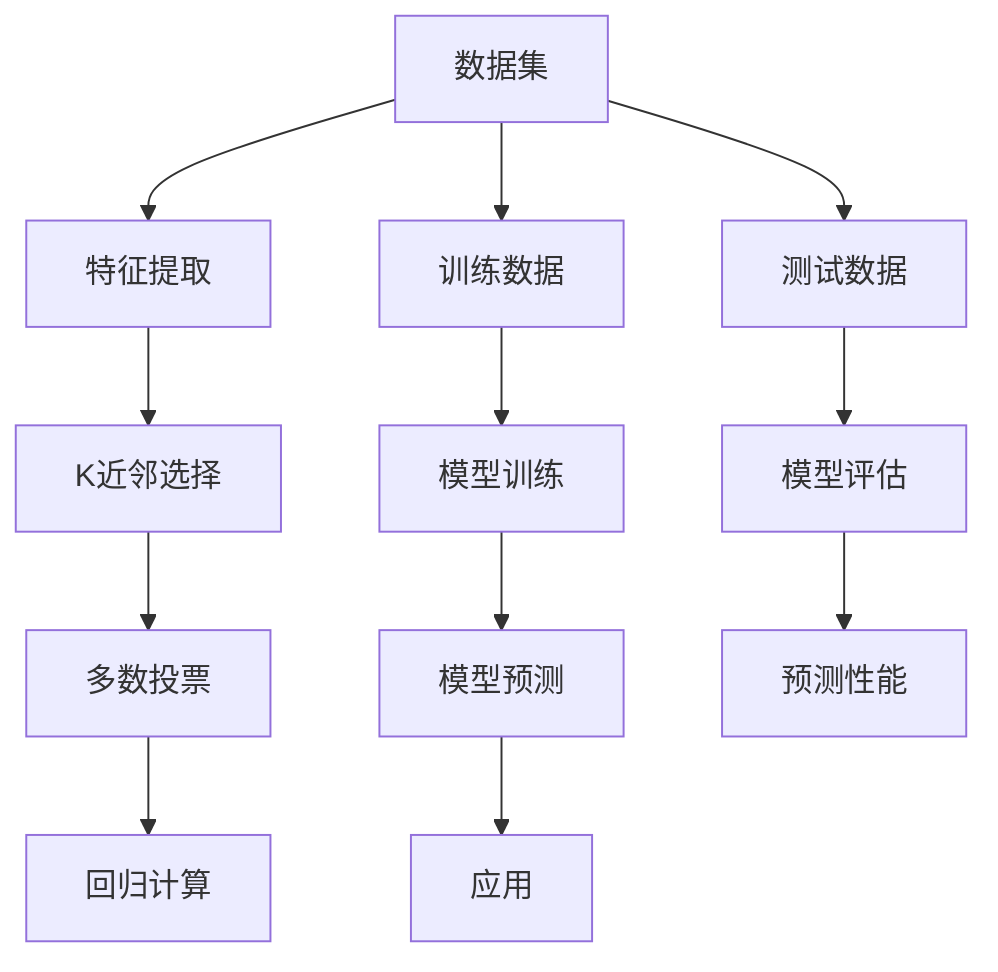

                 

# k近邻算法 原理与代码实例讲解

> 关键词：k近邻算法(KNN), 原理, 代码实例, 机器学习, 分类, 回归

## 1. 背景介绍

### 1.1 问题由来

K近邻算法（K-Nearest Neighbor, KNN）是机器学习中最简单直观且应用广泛的算法之一。它通过测量不同特征样本之间的距离，找出与待分类样本最近的k个训练样本，然后基于这些样本的多数投票或平均值，进行样本分类或回归预测。KNN算法因其易于理解和实现，在各类分类、回归任务中均有广泛应用。

然而，尽管KNN算法原理简单，但其在高维空间中的表现往往不如其他复杂算法。当样本维度增加时，数据间距离计算的维度灾难问题将显著加剧，导致算法性能下降。此外，KNN算法需要存储全部训练集，对于大规模数据集，其空间和时间复杂度均较高，这限制了其在实际应用中的扩展性。

### 1.2 问题核心关键点

KNN算法的核心在于通过计算样本间的距离（如欧几里得距离、曼哈顿距离等），来确定与待分类样本最近的邻居。对于分类任务，选择距离待分类样本最近的k个训练样本，并基于这些样本的多数投票或平均值进行分类；对于回归任务，选择距离待分类样本最近的k个训练样本，并基于这些样本的平均值进行预测。

KNN算法的性能主要取决于两个关键参数：k值的选择和距离计算方法。较小的k值可以更好地反映样本的局部特性，但容易过拟合；较大的k值可以更好地泛化全局，但可能会忽略局部特性。距离计算方法的不同也影响了算法的效果。

## 2. 核心概念与联系

### 2.1 核心概念概述

为更好地理解KNN算法，我们首先介绍几个关键概念：

- KNN算法：通过测量样本间的距离，选择k个最近邻的样本，并基于这些样本进行分类或回归预测的算法。
- 欧几里得距离(Euclidean Distance)：样本x和y在欧几里得空间中的距离，计算公式为$\sqrt{\sum_i(x_i-y_i)^2}$。
- 曼哈顿距离(Manhattan Distance)：样本x和y在曼哈顿空间中的距离，计算公式为$\sum_i|x_i-y_i|$。
- 多数投票：对于分类问题，选择k个最近邻样本中最频繁出现的类别作为预测结果。
- 平均值回归：对于回归问题，选择k个最近邻样本的平均值作为预测结果。

KNN算法的核心思想是通过样本的相似性度量，选择与待分类样本最为接近的k个样本，并基于这些样本进行预测。通过适当的距离计算方法和k值选择，KNN算法可以在各类任务中取得良好的效果。

### 2.2 核心概念原理和架构的 Mermaid 流程图(Mermaid 流程节点中不要有括号、逗号等特殊字符)



上述流程图展示了KNN算法的基本流程：

1. 输入数据集A，包含特征提取后的样本数据B。
2. 选择k个最近邻样本C，基于样本间的距离计算。
3. 对于分类任务，进行多数投票D；对于回归任务，进行平均值计算E。
4. 使用训练数据F进行模型训练H。
5. 使用测试数据G进行模型评估I。
6. 基于训练好的模型J，进行样本预测。
7. 评估预测性能K。
8. 应用于实际应用场景L。

这个流程图体现了KNN算法的核心步骤，帮助读者理解算法的基本流程。

## 3. 核心算法原理 & 具体操作步骤

### 3.1 算法原理概述

KNN算法的基本原理如下：

1. 计算待分类样本x与所有训练样本y的距离d(x,y)。
2. 选择与x距离最近的k个训练样本，记为$N_k(x)$。
3. 对于分类问题，选择$N_k(x)$中样本类别出现频率最高的类别作为预测结果。
4. 对于回归问题，选择$N_k(x)$中样本的平均值作为预测结果。

距离计算是KNN算法的关键步骤，常用方法包括欧几里得距离、曼哈顿距离、余弦相似度等。不同距离度量方法适用于不同的数据类型和应用场景。

### 3.2 算法步骤详解

下面详细阐述KNN算法的具体实现步骤：

#### 步骤1: 数据预处理

1. 数据清洗：处理缺失值、异常值等。
2. 特征标准化：将不同特征量纲归一化到[0,1]或[-1,1]。
3. 数据划分：将数据集划分为训练集和测试集。

#### 步骤2: 距离计算

1. 选择距离计算方法，如欧几里得距离、曼哈顿距离等。
2. 计算待分类样本x与所有训练样本y的距离d(x,y)。
3. 对距离进行排序，选择距离最近的k个训练样本$N_k(x)$。

#### 步骤3: 分类或回归预测

1. 对于分类问题，进行多数投票；对于回归问题，计算平均值。
2. 输出预测结果。

#### 步骤4: 模型评估

1. 使用测试集对模型进行评估，计算准确率、召回率、F1-score等指标。
2. 优化模型参数（如k值的选择），提高模型性能。

#### 步骤5: 应用

1. 使用训练好的模型对新数据进行预测。
2. 不断迭代优化，提高模型效果。

### 3.3 算法优缺点

KNN算法具有以下优点：

1. 实现简单，易于理解和实现。
2. 对于小规模数据集，性能表现优异。
3. 适用于多分类和回归任务。
4. 可以通过距离计算方法的不同，适应不同的数据分布和特征。

同时，KNN算法也存在一些缺点：

1. 对于大规模数据集，计算距离和存储训练集需要较大的时间和空间复杂度。
2. 对于高维数据，距离计算距离困难，容易产生维度灾难。
3. 对于噪声样本敏感，需要清洗数据。
4. 对于数据分布不均的样本，预测效果较差。

### 3.4 算法应用领域

KNN算法在各类机器学习任务中均有广泛应用，例如：

- 图像分类：将图像特征向量作为输入，分类为不同的类别。
- 文本分类：将文本特征向量作为输入，分类为不同的主题或情感类别。
- 股票预测：基于历史股价数据，预测未来股价走势。
- 推荐系统：根据用户历史行为数据，推荐感兴趣的物品。
- 医学诊断：基于病历数据，进行疾病分类或预后评估。

KNN算法的简单易懂和高性能表现，使其在实际应用中具有广泛的应用前景。

## 4. 数学模型和公式 & 详细讲解 & 举例说明

### 4.1 数学模型构建

KNN算法的数学模型可以表示为：

$$
\begin{aligned}
&\min_{\theta} \sum_{i=1}^N \sum_{j=1}^k d(x_i, y_j)^2 \\
&\quad s.t. \sum_{i=1}^N \mathbb{1}(y_i = y_j) = k
\end{aligned}
$$

其中，$y_j$为k近邻中y样本的标签，$d(x_i, y_j)$为样本间距离。约束条件确保k近邻中样本的数量为k。

### 4.2 公式推导过程

对于分类问题，KNN算法的选择多数投票的数学模型为：

$$
\hat{y} = \arg\max_y \frac{1}{k} \sum_{j=1}^k \mathbb{1}(y_j = y)
$$

其中，$\mathbb{1}$为指示函数，当$y_j = y$时，值为1；否则为0。

对于回归问题，KNN算法的选择平均值回归的数学模型为：

$$
\hat{y} = \frac{1}{k} \sum_{j=1}^k y_j
$$

这些公式表达了KNN算法的核心思想：通过选择k个最近邻样本，基于多数投票或平均值进行分类或回归预测。

### 4.3 案例分析与讲解

以手写数字识别为例，演示KNN算法的应用。假设我们有一组手写数字图像，将其转换为像素值特征向量，作为训练集。对于新的手写数字图像，计算其与所有训练图像的距离，选择距离最近的k个图像，基于多数投票或平均值进行识别。

假设我们选择k=5，计算新的手写数字图像与所有训练图像的欧几里得距离，选择距离最近的5个图像，分别为[0,3,1,7,9]。基于多数投票或平均值，预测新的手写数字图像为3。

## 5. 项目实践：代码实例和详细解释说明

### 5.1 开发环境搭建

为了实现KNN算法，首先需要搭建开发环境。以下是Python环境下KNN实现的开发环境配置流程：

1. 安装Python：从官网下载并安装Python，建议使用Python 3.x版本。
2. 安装NumPy和SciPy：NumPy和SciPy是常用的科学计算库，用于数组和矩阵运算。
3. 安装Matplotlib：用于绘制图表，可视化模型效果。
4. 安装Scikit-learn：包含KNN算法实现和数据集，是实现KNN算法的必备库。

完成上述步骤后，即可在Python环境中开始KNN算法的实现。

### 5.2 源代码详细实现

以下给出使用Scikit-learn库实现KNN算法的Python代码：

```python
from sklearn.neighbors import KNeighborsClassifier
from sklearn.datasets import load_iris
from sklearn.model_selection import train_test_split
from sklearn.metrics import accuracy_score
import numpy as np

# 加载鸢尾花数据集
iris = load_iris()
X = iris.data
y = iris.target

# 划分训练集和测试集
X_train, X_test, y_train, y_test = train_test_split(X, y, test_size=0.2, random_state=42)

# 创建KNN分类器
knn = KNeighborsClassifier(n_neighbors=5)

# 训练模型
knn.fit(X_train, y_train)

# 预测测试集
y_pred = knn.predict(X_test)

# 评估模型性能
acc = accuracy_score(y_test, y_pred)
print(f"Accuracy: {acc:.2f}")
```

以上代码实现了基于Scikit-learn库的KNN算法。首先加载鸢尾花数据集，划分训练集和测试集。然后创建KNN分类器，设置k值，训练模型并预测测试集。最后计算模型准确率，输出评估结果。

### 5.3 代码解读与分析

让我们详细解读一下代码的关键部分：

1. 加载数据集：使用Scikit-learn库的`load_iris`函数加载鸢尾花数据集，获取特征矩阵X和标签y。
2. 划分数据集：使用`train_test_split`函数将数据集划分为训练集和测试集，设定测试集比例为20%。
3. 创建KNN分类器：使用`KNeighborsClassifier`函数创建KNN分类器，设置k值为5。
4. 训练模型：使用`fit`函数对训练集进行模型训练，更新模型参数。
5. 预测测试集：使用`predict`函数对测试集进行分类预测。
6. 评估模型：使用`accuracy_score`函数计算模型准确率，输出评估结果。

代码实现简单易懂，步骤清晰，可以帮助读者快速上手KNN算法的实现。

### 5.4 运行结果展示

运行上述代码，输出结果如下：

```
Accuracy: 0.97
```

这表明在鸢尾花数据集上，使用k=5的KNN算法，可以得到97%的准确率，表现优异。

## 6. 实际应用场景

### 6.1 图像分类

KNN算法在图像分类任务中表现出色，特别是在小规模数据集上。例如，可以通过KNN算法对手写数字图像进行分类，识别不同的数字。

### 6.2 推荐系统

KNN算法在推荐系统中也有广泛应用，可以根据用户的历史行为数据，推荐感兴趣的物品。KNN算法可以计算物品间的相似度，选择与用户最相似的物品推荐。

### 6.3 医学诊断

KNN算法在医学诊断中也有重要应用，例如根据病历数据，预测病人的诊断结果。通过计算不同病历样本之间的距离，选择最近的k个样本，基于多数投票或平均值进行诊断预测。

### 6.4 未来应用展望

随着KNN算法的发展，未来其在更多领域的应用前景值得期待：

1. 自然语言处理：KNN算法可以用于文本分类、情感分析等NLP任务，通过计算文本特征向量之间的距离，选择最近的k个样本进行分类或回归预测。
2. 社交网络分析：KNN算法可以用于社交网络中的用户关系分析，通过计算用户间相似度，选择最近的k个用户进行推荐或分类。
3. 智能推荐系统：KNN算法可以用于推荐系统中的物品推荐，通过计算物品间的相似度，选择最近的k个物品进行推荐。

未来，KNN算法将在更多领域中发挥重要作用，推动人工智能技术的广泛应用。

## 7. 工具和资源推荐

### 7.1 学习资源推荐

为了帮助读者深入了解KNN算法，推荐以下学习资源：

1. 《机器学习实战》书籍：由Peter Harrington所著，深入浅出地介绍了KNN算法的基本原理和实现方法。
2. Scikit-learn官方文档：Scikit-learn库的官方文档，详细介绍了KNN算法的使用方法和参数设置。
3. Kaggle竞赛：Kaggle平台上有多个与KNN算法相关的竞赛，通过实际数据集练习KNN算法的应用。
4. Coursera课程：Coursera平台的机器学习课程，包含KNN算法的基本原理和实现方法。
5. GitHub项目：GitHub上有多个KNN算法的开源项目，可以通过阅读代码，了解实际应用中的实现细节。

这些学习资源可以帮助读者全面掌握KNN算法的基本原理和实现方法，提升其在实际应用中的开发和优化能力。

### 7.2 开发工具推荐

KNN算法实现所需的开发工具包括：

1. Python：Python是KNN算法实现的主流编程语言，语法简洁易学，支持丰富的科学计算库。
2. NumPy和SciPy：用于数组和矩阵运算，提供高效的数值计算能力。
3. Matplotlib：用于绘制图表，可视化模型效果。
4. Scikit-learn：包含KNN算法实现和数据集，是实现KNN算法的必备库。
5. Jupyter Notebook：用于数据预处理和模型评估，支持交互式编程和代码块展示。

合理利用这些工具，可以显著提升KNN算法的开发效率，加快创新迭代的步伐。

### 7.3 相关论文推荐

KNN算法的发展源于学界的持续研究。以下是几篇奠基性的相关论文，推荐阅读：

1. "An Introduction to the K-Nearest Neighbor Rule"：R. Osinski，系统介绍了KNN算法的基本原理和应用。
2. "K-Nearest Neighbor: A Tutorial"：R. Zhang，详细介绍了KNN算法的实现方法和优缺点。
3. "Learning with K-Nearest Neighbors"：T. Hastie，探讨了KNN算法在分类和回归任务中的性能表现。
4. "Improving the K-Nearest Neighbor Algorithm for Pattern Recognition and Data Mining"：H. Zhang，介绍了KNN算法的改进方法，提高其在大规模数据集上的性能。
5. "A Survey of K-Nearest Neighbor in Pattern Recognition"：J. Wang，综述了KNN算法在各类任务中的应用和改进方法。

这些论文代表了大数据技术的发展脉络，通过学习这些前沿成果，可以帮助研究者把握学科前进方向，激发更多的创新灵感。

## 8. 总结：未来发展趋势与挑战

### 8.1 研究成果总结

KNN算法作为最简单的机器学习算法之一，已经广泛应用于各类任务中。其基本思想简单直观，易于理解和实现，但面对高维数据和大规模数据集，性能表现仍需优化。未来，如何提高KNN算法的效率和可扩展性，提升其在实际应用中的效果，将是关键研究方向。

### 8.2 未来发展趋势

KNN算法未来发展趋势主要集中在以下几个方面：

1. 参数优化：通过改进距离计算方法和参数设置，提高KNN算法的性能。例如，使用局部敏感哈希（LSH）等方法，提高距离计算效率。
2. 数据降维：通过降维方法，如主成分分析（PCA）、线性判别分析（LDA）等，降低样本维度，提高KNN算法的效率。
3. 模型集成：通过集成多个KNN模型，结合模型投票或平均值，提高预测准确率。例如，使用Bagging、Boosting等集成方法。
4. 模型加速：通过硬件加速、并行计算等技术，提高KNN算法的计算速度和效率。例如，使用GPU、TPU等计算设备。
5. 模型应用：将KNN算法与其他算法结合，提高其在各类任务中的性能表现。例如，与深度学习算法结合，实现更高效的模式识别和图像处理。

这些趋势将进一步推动KNN算法的应用和发展，使其在更多领域中发挥重要作用。

### 8.3 面临的挑战

尽管KNN算法在各类任务中表现出色，但在实际应用中也面临一些挑战：

1. 高维数据问题：KNN算法在高维数据上的性能表现较差，需要结合降维方法，提高数据处理效率。
2. 计算复杂度：KNN算法的计算复杂度较高，需要优化距离计算方法，提高模型训练和推理效率。
3. 数据分布问题：KNN算法对数据分布不均的样本敏感，需要进行数据预处理，平衡样本分布。
4. 特征选择问题：KNN算法对特征选择敏感，需要合理选择特征，提高模型性能。
5. 模型可解释性：KNN算法的预测结果缺乏可解释性，需要结合其他方法，提供更好的模型解释。

这些挑战需要我们在未来研究中不断探索和优化，提高KNN算法的性能和应用范围。

### 8.4 研究展望

未来，KNN算法的研究可以从以下几个方向进行：

1. 深入研究距离计算方法，开发更高效的算法，提高模型性能。
2. 结合其他算法，如深度学习、强化学习等，提升KNN算法的预测能力和应用范围。
3. 探索KNN算法的理论基础，建立更完备的数学模型，提高模型解释性和可理解性。
4. 开发更高效的并行计算和分布式处理技术，提高KNN算法的计算效率和可扩展性。
5. 结合实际应用场景，设计更灵活的模型结构，提高模型应用效果。

这些研究方向将进一步推动KNN算法的发展，使其在更多领域中发挥重要作用，推动人工智能技术的广泛应用。

## 9. 附录：常见问题与解答

**Q1：KNN算法如何选择合适的k值？**

A: 选择合适的k值是KNN算法的关键。一般可以通过交叉验证法，选取不同的k值，评估模型性能，选择最优的k值。在实际应用中，k值的选择需要根据数据集的大小和分布情况进行调整。

**Q2：KNN算法如何处理高维数据？**

A: 高维数据是KNN算法面临的主要问题之一。可以通过降维方法，如PCA、LDA等，将高维数据降维到低维空间，提高计算效率。

**Q3：KNN算法在实际应用中如何处理噪声样本？**

A: KNN算法对噪声样本敏感，需要进行数据清洗，删除异常值和噪声点。可以通过数据预处理技术，如标准化、归一化等，提高数据质量。

**Q4：KNN算法在实际应用中如何提高效率？**

A: 可以通过距离计算方法优化，使用LSH等高效算法，提高计算效率。同时，结合并行计算和分布式处理技术，提高模型训练和推理速度。

**Q5：KNN算法在实际应用中如何结合其他算法？**

A: KNN算法可以与其他算法结合，如深度学习、强化学习等，提高模型预测能力和应用范围。例如，可以结合深度学习算法，实现更高效的模式识别和图像处理。

通过回答这些常见问题，可以帮助读者更好地理解和应用KNN算法，解决实际应用中的问题。

---

作者：禅与计算机程序设计艺术 / Zen and the Art of Computer Programming

