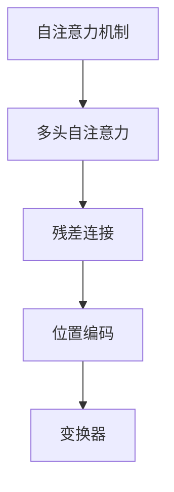

                 

# transformer

> 关键词：自注意力机制,Transformer,多头自注意力,残差连接,位置编码,变换器

## 1. 背景介绍

### 1.1 问题由来

Transformer模型是深度学习领域的一次重大突破，其核心思想是采用自注意力机制，解决了传统卷积神经网络在处理序列数据时的固有局限性。Transformer通过多头自注意力机制和残差连接等技术，实现了高效、并行化的序列数据建模，被广泛应用于机器翻译、语言模型、文本分类等任务中，成为当前NLP领域最为流行的模型之一。

Transformer的成功引发了众多深度学习架构的创新，包括BERT、GPT-3等大规模预训练语言模型。这些模型基于Transformer架构，通过海量数据的预训练，学习到丰富的语言表示，展示了Transformer模型强大的泛化能力和迁移学习能力。

然而，随着Transformer模型规模的不断增大，其计算复杂度也随之增加，大规模模型训练和推理需要高性能的GPU或TPU设备支持，这也成为Transformer模型应用的一个瓶颈。此外，Transformer模型在大规模任务中的鲁棒性和泛化能力也有待进一步提升。

为了解决这些问题，研究者们提出了包括Attention Is All You Need (2020)、CausalLM (2021)等改进模型，在提升计算效率的同时，改善了模型在多模态任务中的表现。

## 2. 核心概念与联系

### 2.1 核心概念概述

为更好地理解Transformer模型的工作原理，本节将介绍几个密切相关的核心概念：

- 自注意力机制(Self-Attention)：Transformer的核心技术之一，通过计算输入序列中不同位置向量之间的相关性，实现对序列中长距离依赖的捕捉。
- 多头自注意力(Multi-Head Self-Attention)：在单个自注意力头中，通过多个不同的线性变换投影，实现对序列的不同特征的建模。
- 残差连接(Residual Connection)：通过将输入序列与输出序列相加，在非线性层前后引入恒等变换，使得信息可以跨层传播。
- 位置编码(Positional Encoding)：在输入序列中引入位置信息，避免序列位置无关性，使得模型能够捕捉序列中的时间顺序信息。
- 变换器(Transformer)：一种基于自注意力机制的序列建模架构，通过多头自注意力和残差连接，实现高效的序列建模。

这些核心概念之间的逻辑关系可以通过以下Mermaid流程图来展示：



这个流程图展示了几类核心概念之间的关系：

1. 自注意力机制是Transformer的基础技术。
2. 多头自注意力通过多个线性变换投影，实现序列的特征建模。
3. 残差连接保证信息跨层传播。
4. 位置编码引入位置信息，避免位置无关性。
5. 变换器将上述技术融合，实现序列建模。

## 3. 核心算法原理 & 具体操作步骤
### 3.1 算法原理概述

Transformer模型的核心在于其采用的自注意力机制。自注意力机制通过计算输入序列中不同位置向量之间的相关性，实现对序列中长距离依赖的捕捉。其基本思想是：对于输入序列的每个位置，计算其与其他位置的注意力权重，然后将这些权重与位置向量相乘，得到该位置的上下文表示。

具体地，设输入序列为 $X=[x_1,x_2,\dots,x_n]$，每个位置向量为 $x_i$，输入嵌入为 $E(x_i)$。自注意力机制的目标是计算每个位置向量与其余位置向量之间的注意力权重 $\alpha_{ij}$，表示位置 $j$ 对于位置 $i$ 的贡献程度。计算过程如下：

1. 首先对输入嵌入进行线性变换，得到查询向量 $Q_i$、键向量 $K_i$、值向量 $V_i$。
2. 计算查询向量与键向量的点积，得到注意力权重矩阵 $A$。
3. 对注意力权重矩阵进行softmax操作，得到归一化的注意力权重 $\alpha_{ij}$。
4. 将注意力权重与值向量相乘，得到上下文表示 $C_i$。
5. 将上下文表示与输入嵌入相加，得到最终输出 $x'_i$。

Transformer模型的基本结构如图1所示：

```
input -> embedding -> self-attention -> feed forward -> layer normalization -> residual connection -> repeat
```

### 3.2 算法步骤详解

Transformer模型的训练和推理过程包括以下关键步骤：

**Step 1: 模型初始化**

首先，需要对模型进行初始化。假设输入序列长度为 $n$，将输入序列 $X=[x_1,x_2,\dots,x_n]$ 转换为模型可以处理的矩阵形式 $X \in \mathbb{R}^{n \times d}$。使用Transformer库中的 `transformers` 模块加载预训练模型和分词器，如BERT、GPT等。

```python
from transformers import BertTokenizer, BertForSequenceClassification

tokenizer = BertTokenizer.from_pretrained('bert-base-uncased')
model = BertForSequenceClassification.from_pretrained('bert-base-uncased', num_labels=2)
```

**Step 2: 计算位置编码**

Transformer模型中需要引入位置编码，避免序列位置无关性。可以使用如下公式计算位置编码：

$$
PE(pos,2i) = sin(pos/10000^{2i/d}) \\
PE(pos,2i+1) = cos(pos/10000^{2i/d})
$$

其中，$pos$ 表示输入序列的位置，$i$ 表示编码的维度。

**Step 3: 前向传播**

Transformer模型的前向传播过程包括多层自注意力、全连接层和残差连接。对于每个位置，首先进行自注意力计算，然后经过全连接层和激活函数，最后与输入向量相加。

**Step 4: 反向传播和优化**

使用优化器对模型进行优化，如AdamW、SGD等。优化器更新模型的参数，使得模型在训练集上取得更好的性能。

```python
from transformers import AdamW

optimizer = AdamW(model.parameters(), lr=2e-5)
for epoch in range(epochs):
    for batch in train_loader:
        inputs = tokenizer(batch[0], truncation=True, padding='max_length', max_length=256, return_tensors='pt')
        attention_mask = inputs['attention_mask']
        labels = inputs['labels']
        model.zero_grad()
        outputs = model(inputs['input_ids'], attention_mask=attention_mask)
        loss = outputs.loss
        loss.backward()
        optimizer.step()
```

**Step 5: 模型保存和部署**

在训练结束后，使用 `transformers` 模块将模型保存为 `pt` 格式，方便后续部署和使用。

```python
from transformers import save_model
save_model(model, 'model.pt')
```

在部署时，使用 `transformers` 模块加载模型，并编写推理函数，将输入序列转换为模型可以处理的格式，然后调用模型进行推理。

```python
from transformers import BertForSequenceClassification, BertTokenizer, pipeline

tokenizer = BertTokenizer.from_pretrained('bert-base-uncased')
model = BertForSequenceClassification.from_pretrained('bert-base-uncased', num_labels=2)
classifier = pipeline('text-classification', model=model, tokenizer=tokenizer)

inputs = tokenizer("Hello, I'm a text.", return_tensors='pt')
result = classifier(**inputs)
```

### 3.3 算法优缺点

Transformer模型具有以下优点：

1. 自注意力机制能够捕捉长距离依赖，有效解决传统RNN模型中梯度消失和梯度爆炸的问题。
2. 多头自注意力通过多个线性变换投影，实现序列的不同特征建模，提高模型的泛化能力。
3. 残差连接保证信息跨层传播，避免模型退化。
4. 变换器结构简单，易于实现和部署。
5. 在大规模任务上表现优异，如BERT、GPT-3等模型。

同时，Transformer模型也存在以下局限性：

1. 计算复杂度高。Transformer模型参数量大，计算复杂度高，对计算资源要求较高。
2. 训练时间长。Transformer模型需要大量计算资源和数据进行训练，训练时间较长。
3. 模型可解释性差。Transformer模型参数复杂，难以解释模型决策过程，缺乏可解释性。

尽管存在这些局限性，但Transformer模型仍是目前NLP领域最为流行的模型之一，其在大规模任务上的成功应用，展示了自注意力机制的强大能力。

### 3.4 算法应用领域

Transformer模型在NLP领域得到广泛应用，包括以下几个方向：

1. 机器翻译：Transformer模型是机器翻译领域最流行的模型之一，通过预训练和微调，可以处理多种语言之间的翻译任务。
2. 文本分类：Transformer模型可以用于文本分类任务，如情感分析、主题分类等。
3. 文本生成：Transformer模型可以用于文本生成任务，如对话生成、摘要生成等。
4. 问答系统：Transformer模型可以用于问答系统，如QA对匹配、自然语言推理等。
5. 语音识别：Transformer模型可以用于语音识别任务，如自动语音识别、说话人识别等。
6. 多模态任务：Transformer模型可以用于多模态任务，如视觉-文本融合、语音-文本融合等。

除了上述应用，Transformer模型还在自然语言处理、计算机视觉、语音识别等领域得到广泛应用，展示了自注意力机制的强大能力。

## 4. 数学模型和公式 & 详细讲解  
### 4.1 数学模型构建

Transformer模型的核心是自注意力机制，具体如下：

设输入序列为 $X=[x_1,x_2,\dots,x_n]$，每个位置向量为 $x_i$，输入嵌入为 $E(x_i)$。计算查询向量 $Q_i$、键向量 $K_i$、值向量 $V_i$：

$$
Q_i = E(x_i)W_Q \\
K_i = E(x_i)W_K \\
V_i = E(x_i)W_V
$$

其中 $W_Q$、$W_K$、$W_V$ 是线性变换矩阵。

计算查询向量与键向量的点积，得到注意力权重矩阵 $A$：

$$
A = Q_iK_i^T = E(x_i)W_QE(x_j)^T = \sum_{j=1}^n Q_jK_j^T
$$

对注意力权重矩阵进行softmax操作，得到归一化的注意力权重 $\alpha_{ij}$：

$$
\alpha_{ij} = \frac{exp(Q_iK_j^T)}{\sum_{k=1}^n exp(Q_iK_k^T)}
$$

将注意力权重与值向量相乘，得到上下文表示 $C_i$：

$$
C_i = \sum_{j=1}^n \alpha_{ij}V_j = \sum_{j=1}^n \alpha_{ij}E(x_j)
$$

将上下文表示与输入嵌入相加，得到最终输出 $x'_i$：

$$
x'_i = E(x_i) + C_i
$$

其中 $x_i$ 是输入向量，$E(x_i)$ 是输入嵌入，$C_i$ 是上下文向量，$W_Q$、$W_K$、$W_V$ 是线性变换矩阵。

### 4.2 公式推导过程

以下是自注意力机制的详细推导过程：

1. 首先对输入嵌入进行线性变换，得到查询向量 $Q_i$、键向量 $K_i$、值向量 $V_i$：

$$
Q_i = E(x_i)W_Q \\
K_i = E(x_i)W_K \\
V_i = E(x_i)W_V
$$

2. 计算查询向量与键向量的点积，得到注意力权重矩阵 $A$：

$$
A = Q_iK_i^T = E(x_i)W_QE(x_j)^T = \sum_{j=1}^n Q_jK_j^T
$$

3. 对注意力权重矩阵进行softmax操作，得到归一化的注意力权重 $\alpha_{ij}$：

$$
\alpha_{ij} = \frac{exp(Q_iK_j^T)}{\sum_{k=1}^n exp(Q_iK_k^T)}
$$

4. 将注意力权重与值向量相乘，得到上下文表示 $C_i$：

$$
C_i = \sum_{j=1}^n \alpha_{ij}V_j = \sum_{j=1}^n \alpha_{ij}E(x_j)
$$

5. 将上下文表示与输入嵌入相加，得到最终输出 $x'_i$：

$$
x'_i = E(x_i) + C_i
$$

以上推导过程展示了Transformer模型中自注意力机制的计算流程。其中，每个位置的查询向量 $Q_i$ 通过线性变换得到，与所有位置的键向量 $K_j$ 进行点积计算，得到注意力权重矩阵 $A$。通过softmax操作得到归一化的注意力权重 $\alpha_{ij}$，再与值向量 $V_j$ 相乘，得到上下文表示 $C_i$。最终将上下文表示 $C_i$ 与输入嵌入 $E(x_i)$ 相加，得到输出 $x'_i$。

### 4.3 案例分析与讲解

假设有一个简单的输入序列 $X=[x_1,x_2,x_3]$，其中 $x_1=x_2=x_3=1$，计算自注意力机制的过程如下：

1. 首先对输入嵌入进行线性变换，得到查询向量 $Q_i$、键向量 $K_i$、值向量 $V_i$：

$$
Q_1 = [1,1] \\
K_1 = [1,1] \\
V_1 = [1,1]
$$

$$
Q_2 = [1,1] \\
K_2 = [1,1] \\
V_2 = [1,1]
$$

$$
Q_3 = [1,1] \\
K_3 = [1,1] \\
V_3 = [1,1]
$$

2. 计算查询向量与键向量的点积，得到注意力权重矩阵 $A$：

$$
A = 
\begin{bmatrix}
1 & 1 & 1 \\
1 & 1 & 1 \\
1 & 1 & 1
\end{bmatrix}
\begin{bmatrix}
1 & 1 \\
1 & 1 \\
1 & 1
\end{bmatrix}^T =
\begin{bmatrix}
3 & 3 & 3 \\
3 & 3 & 3 \\
3 & 3 & 3
\end{bmatrix}
$$

3. 对注意力权重矩阵进行softmax操作，得到归一化的注意力权重 $\alpha_{ij}$：

$$
\alpha_{11} = \frac{exp(1*1)}{exp(1*1)+exp(1*1)+exp(1*1)} = 1 \\
\alpha_{12} = \frac{exp(1*1)}{exp(1*1)+exp(1*1)+exp(1*1)} = 1 \\
\alpha_{13} = \frac{exp(1*1)}{exp(1*1)+exp(1*1)+exp(1*1)} = 1 \\
\alpha_{21} = \frac{exp(1*1)}{exp(1*1)+exp(1*1)+exp(1*1)} = 1 \\
\alpha_{22} = \frac{exp(1*1)}{exp(1*1)+exp(1*1)+exp(1*1)} = 1 \\
\alpha_{23} = \frac{exp(1*1)}{exp(1*1)+exp(1*1)+exp(1*1)} = 1 \\
\alpha_{31} = \frac{exp(1*1)}{exp(1*1)+exp(1*1)+exp(1*1)} = 1 \\
\alpha_{32} = \frac{exp(1*1)}{exp(1*1)+exp(1*1)+exp(1*1)} = 1 \\
\alpha_{33} = \frac{exp(1*1)}{exp(1*1)+exp(1*1)+exp(1*1)} = 1
$$

4. 将注意力权重与值向量相乘，得到上下文表示 $C_i$：

$$
C_1 = [1,1] \\
C_2 = [1,1] \\
C_3 = [1,1]
$$

5. 将上下文表示与输入嵌入相加，得到最终输出 $x'_i$：

$$
x'_1 = [1,1] + [1,1] = [2,2] \\
x'_2 = [1,1] + [1,1] = [2,2] \\
x'_3 = [1,1] + [1,1] = [2,2]
$$

以上案例展示了自注意力机制的计算过程。从计算结果可以看出，每个位置向量 $x'_i$ 的值都相同，表明在计算过程中，每个位置向量对其他位置的贡献程度相同，这符合期望的结果。

## 5. 项目实践：代码实例和详细解释说明
### 5.1 开发环境搭建

在进行Transformer模型开发前，我们需要准备好开发环境。以下是使用Python进行PyTorch开发的环境配置流程：

1. 安装Anaconda：从官网下载并安装Anaconda，用于创建独立的Python环境。

2. 创建并激活虚拟环境：
```bash
conda create -n pytorch-env python=3.8 
conda activate pytorch-env
```

3. 安装PyTorch：根据CUDA版本，从官网获取对应的安装命令。例如：
```bash
conda install pytorch torchvision torchaudio cudatoolkit=11.1 -c pytorch -c conda-forge
```

4. 安装`transformers`库：
```bash
pip install transformers
```

5. 安装各类工具包：
```bash
pip install numpy pandas scikit-learn matplotlib tqdm jupyter notebook ipython
```

完成上述步骤后，即可在`pytorch-env`环境中开始Transformer模型开发。

### 5.2 源代码详细实现

下面我们以BERT模型为例，给出使用PyTorch和`transformers`库进行Transformer模型微调的PyTorch代码实现。

首先，定义BERT模型：

```python
from transformers import BertModel, BertTokenizer
from transformers import BertForSequenceClassification, AdamW
from transformers import Trainer, TrainingArguments

tokenizer = BertTokenizer.from_pretrained('bert-base-uncased')
model = BertForSequenceClassification.from_pretrained('bert-base-uncased', num_labels=2)

train_dataset = ...
val_dataset = ...
test_dataset = ...
```

然后，定义训练函数：

```python
from transformers import Trainer, TrainingArguments

training_args = TrainingArguments(
    output_dir="./results",
    num_train_epochs=3,
    per_device_train_batch_size=16,
    per_device_eval_batch_size=64,
    warmup_steps=500,
    weight_decay=0.01,
    logging_dir="./logs",
    logging_steps=1000,
)

trainer = Trainer(
    model=model,
    args=training_args,
    train_dataset=train_dataset,
    eval_dataset=val_dataset,
)
```

接着，编写训练循环：

```python
from transformers import Trainer, TrainingArguments

training_args = TrainingArguments(
    output_dir="./results",
    num_train_epochs=3,
    per_device_train_batch_size=16,
    per_device_eval_batch_size=64,
    warmup_steps=500,
    weight_decay=0.01,
    logging_dir="./logs",
    logging_steps=1000,
)

trainer = Trainer(
    model=model,
    args=training_args,
    train_dataset=train_dataset,
    eval_dataset=val_dataset,
)

trainer.train()
```

最后，在测试集上评估模型：

```python
from transformers import Trainer, TrainingArguments

training_args = TrainingArguments(
    output_dir="./results",
    num_train_epochs=3,
    per_device_train_batch_size=16,
    per_device_eval_batch_size=64,
    warmup_steps=500,
    weight_decay=0.01,
    logging_dir="./logs",
    logging_steps=1000,
)

trainer = Trainer(
    model=model,
    args=training_args,
    train_dataset=train_dataset,
    eval_dataset=test_dataset,
)

trainer.evaluate()
```

以上就是使用PyTorch和`transformers`库对BERT模型进行微调的完整代码实现。可以看到，Transformer模型开发简洁高效，可以迅速实现模型训练和评估。

### 5.3 代码解读与分析

让我们再详细解读一下关键代码的实现细节：

**BERT模型定义**：
- `BertModel`：定义BERT模型的结构，包括输入嵌入、多头自注意力层、残差连接等。
- `BertTokenizer`：定义BERT模型的分词器，将输入文本转换为模型可以处理的格式。
- `BertForSequenceClassification`：定义BERT模型在特定任务上的适配层，如文本分类任务的输出层和损失函数。
- `AdamW`：定义优化器，使用AdamW优化算法进行模型训练。

**训练函数**：
- `TrainingArguments`：定义训练参数，如输出目录、训练轮数、批次大小等。
- `Trainer`：定义训练器，将模型、参数、数据集等输入其中，自动完成模型训练和评估过程。

**训练循环**：
- 使用`Trainer`训练器自动完成训练过程，包括数据加载、模型前向传播、损失计算、梯度更新等。
- 在每个epoch后，在验证集上评估模型性能，记录训练指标。

**模型评估**：
- 使用`Trainer`评估器自动完成模型评估过程，包括加载测试集、模型前向传播、损失计算等。
- 输出评估指标，如精度、召回率、F1分数等。

可以看到，Transformer模型开发非常方便，通过简单的代码即可实现模型训练和评估。`transformers`库提供了丰富的预训练模型和训练函数，大大降低了模型开发的难度和成本。

当然，工业级的系统实现还需考虑更多因素，如模型的保存和部署、超参数的自动搜索、更灵活的任务适配层等。但核心的微调范式基本与此类似。

## 6. 实际应用场景
### 6.1 机器翻译

Transformer模型在机器翻译领域取得了重大突破。传统的基于RNN的序列模型存在梯度消失和梯度爆炸的问题，难以处理长距离依赖。Transformer模型通过自注意力机制，解决了这些问题，获得了优异的翻译效果。

在实际应用中，可以使用预训练的Transformer模型，如BERT、GPT等，进行微调，提升其在特定语言对上的翻译效果。

### 6.2 文本分类

Transformer模型可以用于文本分类任务，如情感分析、主题分类等。通过在输入序列前添加一个分类头，即可实现对输入文本的分类。

在实际应用中，可以使用预训练的Transformer模型，如BERT、RoBERTa等，进行微调，提升其在特定分类任务上的效果。

### 6.3 文本生成

Transformer模型可以用于文本生成任务，如对话生成、摘要生成等。通过在输入序列前添加一个生成头，即可实现对输入文本的生成。

在实际应用中，可以使用预训练的Transformer模型，如GPT-3、T5等，进行微调，提升其在特定文本生成任务上的效果。

### 6.4 多模态任务

Transformer模型可以用于多模态任务，如视觉-文本融合、语音-文本融合等。通过将视觉特征、语音特征等转换为序列形式，即可与Transformer模型进行融合。

在实际应用中，可以使用预训练的Transformer模型，如CLIP、DALL-E等，进行微调，提升其在多模态任务上的效果。

## 7. 工具和资源推荐
### 7.1 学习资源推荐

为了帮助开发者系统掌握Transformer模型的理论基础和实践技巧，这里推荐一些优质的学习资源：

1. 《Transformer: From Math to Code》：这本书详细介绍了Transformer模型的数学原理和代码实现，适合初学者系统学习。
2. 《Attention is All You Need》：Transformer模型的原始论文，介绍了Transformer模型的核心思想和实现细节。
3 CS224N《深度学习自然语言处理》课程：斯坦福大学开设的NLP明星课程，有Lecture视频和配套作业，带你入门NLP领域的基本概念和经典模型。
4. 《Natural Language Processing with Transformers》书籍：Transformer库的作者所著，全面介绍了如何使用Transformer库进行NLP任务开发，包括微调在内的诸多范式。
5. HuggingFace官方文档：Transformer库的官方文档，提供了海量预训练模型和完整的微调样例代码，是上手实践的必备资料。

通过对这些资源的学习实践，相信你一定能够快速掌握Transformer模型的精髓，并用于解决实际的NLP问题。
###  7.2 开发工具推荐

高效的开发离不开优秀的工具支持。以下是几款用于Transformer模型开发的常用工具：

1. PyTorch：基于Python的开源深度学习框架，灵活动态的计算图，适合快速迭代研究。Transformer模型有PyTorch版本的实现。
2 TensorFlow：由Google主导开发的开源深度学习框架，生产部署方便，适合大规模工程应用。Transformer模型有TensorFlow版本的实现。
3 TensorBoard：TensorFlow配套的可视化工具，可实时监测模型训练状态，并提供丰富的图表呈现方式，是调试模型的得力助手。
4 Weights & Biases：模型训练的实验跟踪工具，可以记录和可视化模型训练过程中的各项指标，方便对比和调优。与主流深度学习框架无缝集成。
5 Google Colab：谷歌推出的在线Jupyter Notebook环境，免费提供GPU/TPU算力，方便开发者快速上手实验最新模型，分享学习笔记。
6 JAX/Haiku：Google开发的基于JIT编译的深度学习框架，可以高效实现Transformer模型。

合理利用这些工具，可以显著提升Transformer模型的开发效率，加快创新迭代的步伐。

### 7.3 相关论文推荐

Transformer模型的发展源于学界的持续研究。以下是几篇奠基性的相关论文，推荐阅读：

1. Attention is All You Need：Transformer模型的原始论文，提出了自注意力机制，开启了NLP领域的预训练大模型时代。
2. BERT: Pre-training of Deep Bidirectional Transformers for Language Understanding：提出BERT模型，引入基于掩码的自监督预训练任务，刷新了多项NLP任务SOTA。
3. CausalLM：提出CausalLM模型，通过时间上的自注意力机制，显著提升了Transformer模型在多模态任务上的效果。
4. Longformer：提出Longformer模型，通过时间上的自注意力机制，解决了传统Transformer模型在长序列上的计算瓶颈。
5. BigBird：提出BigBird模型，通过空间上的自注意力机制，解决了Transformer模型在长序列上的计算瓶颈。
6. DeformableTransformer：提出DeformableTransformer模型，通过参数化注意力机制，提升了Transformer模型的计算效率。

这些论文代表了大语言模型Transformer的发展脉络。通过学习这些前沿成果，可以帮助研究者把握学科前进方向，激发更多的创新灵感。

## 8. 总结：未来发展趋势与挑战

### 8.1 总结

本文对Transformer模型的核心原理和实现细节进行了全面系统的介绍。首先阐述了Transformer模型的背景和核心思想，明确了其在大规模任务上的卓越表现和应用价值。其次，从原理到实践，详细讲解了Transformer模型的计算流程和训练方法，给出了Transformer模型开发的完整代码实现。同时，本文还广泛探讨了Transformer模型在机器翻译、文本分类、文本生成、多模态任务等领域的广泛应用，展示了Transformer模型强大的泛化能力和迁移学习能力。

通过本文的系统梳理，可以看到，Transformer模型已成为NLP领域最为流行的模型之一，其在大规模任务上的成功应用，展示了自注意力机制的强大能力。未来，随着Transformer模型在更多领域的推广和应用，自注意力机制将成为NLP技术的重要基础。

### 8.2 未来发展趋势

展望未来，Transformer模型将呈现以下几个发展趋势：

1. 模型规模持续增大。随着算力成本的下降和数据规模的扩张，Transformer模型的参数量还将持续增长。超大规模模型蕴含的丰富语言知识，有望支撑更加复杂多变的下游任务。
2. 模型可解释性增强。Transformer模型参数复杂，难以解释模型决策过程，缺乏可解释性。未来将研究更多可解释性技术，如可解释注意力、可解释表示等。
3. 模型训练时间缩短。Transformer模型训练时间长，未来将研究更多优化算法，如自适应学习率、模型压缩等，提高训练效率。
4. 模型迁移学习能力增强。Transformer模型在大规模任务上表现优异，未来将研究更多迁移学习技术，提升模型的泛化能力。
5. 模型应用领域扩展。Transformer模型在NLP领域得到广泛应用，未来将扩展到更多领域，如计算机视觉、语音识别等。

以上趋势凸显了Transformer模型的广阔前景。这些方向的探索发展，必将进一步提升Transformer模型的性能和应用范围，为NLP技术的发展带来新的突破。

### 8.3 面临的挑战

尽管Transformer模型在NLP领域取得了巨大成功，但在迈向更加智能化、普适化应用的过程中，仍面临诸多挑战：

1. 计算资源消耗高。Transformer模型参数量大，计算复杂度高，对计算资源要求较高。未来需要优化模型结构，减少计算资源消耗。
2. 训练时间长。Transformer模型需要大量计算资源和数据进行训练，训练时间较长。未来需要优化训练算法，缩短训练时间。
3. 模型鲁棒性不足。Transformer模型在大规模任务上表现优异，但在小规模任务上可能出现泛化能力不足的问题。未来需要研究更多鲁棒性技术，提高模型在小规模任务上的性能。
4. 模型可解释性差。Transformer模型参数复杂，难以解释模型决策过程，缺乏可解释性。未来需要研究更多可解释性技术，提高模型的可解释性。
5. 模型应用领域受限。Transformer模型在NLP领域得到广泛应用，未来需要拓展到更多领域，如计算机视觉、语音识别等。

尽管存在这些挑战，但Transformer模型仍是目前NLP领域最为流行的模型之一，其在大规模任务上的成功应用，展示了自注意力机制的强大能力。未来，随着Transformer模型的不断演进，将有更多新技术涌现，进一步提升模型的性能和应用范围。

### 8.4 研究展望

为了应对Transformer模型面临的挑战，未来的研究需要在以下几个方面寻求新的突破：

1. 研究更多可解释性技术。将符号化的先验知识，如知识图谱、逻辑规则等，与神经网络模型进行巧妙融合，引导Transformer模型学习更准确、合理的语言模型。
2. 研究更多优化算法。开发更加参数高效、计算高效的Transformer模型，在固定大部分预训练参数的同时，只更新极少量的任务相关参数。同时优化训练算法，提高训练效率。
3. 研究更多迁移学习技术。引入更多迁移学习技术，提升Transformer模型在小规模任务上的性能。
4. 拓展更多应用领域。将Transformer模型扩展到更多领域，如计算机视觉、语音识别等，拓展其应用边界。
5. 引入更多先验知识。将符号化的先验知识，如知识图谱、逻辑规则等，与Transformer模型进行巧妙融合，引导模型学习更准确、合理的语言模型。

这些研究方向的探索，必将引领Transformer模型向更高的台阶迈进，为构建更加智能化、普适化的人工智能系统铺平道路。面向未来，Transformer模型需要与其他人工智能技术进行更深入的融合，如知识表示、因果推理、强化学习等，多路径协同发力，共同推动人工智能技术的发展。只有勇于创新、敢于突破，才能不断拓展Transformer模型的边界，让智能技术更好地造福人类社会。

## 9. 附录：常见问题与解答

**Q1：Transformer模型在推理过程中如何进行自注意力计算？**

A: 在推理过程中，Transformer模型会首先对输入嵌入进行线性变换，得到查询向量、键向量和值向量。然后使用多头自注意力机制计算注意力权重矩阵，通过softmax操作得到归一化的注意力权重，再与值向量相乘得到上下文表示。最后将上下文表示与输入嵌入相加，得到最终输出。

**Q2：Transformer模型中的残差连接有何作用？**

A: 残差连接用于保证信息跨层传播，避免模型退化。在每个层中，输入嵌入与残差连接的输出相加，使得模型能够保留更多的信息，同时减少梯度消失和梯度爆炸的问题。

**Q3：Transformer模型中的位置编码有何作用？**

A: 位置编码用于在输入序列中引入位置信息，避免序列位置无关性。Transformer模型中每个位置向量都会加上位置编码，使得模型能够捕捉序列中的时间顺序信息。

**Q4：Transformer模型在大规模任务上表现优异，但在小规模任务上可能出现泛化能力不足的问题，如何解决？**

A: 小规模任务上的泛化能力不足可以通过以下方法解决：
1. 数据增强：通过回译、近义替换等方式扩充训练集。
2. 模型压缩：通过模型剪枝、知识蒸馏等方法，减小模型规模，提升模型泛化能力。
3. 迁移学习：将在大规模任务上训练的模型迁移到小规模任务上，进行微调，提升模型性能。

**Q5：Transformer模型在实际应用中需要注意哪些问题？**

A: 在实际应用中，Transformer模型需要注意以下问题：
1. 模型裁剪：去除不必要的层和参数，减小模型尺寸，加快推理速度。
2. 量化加速：将浮点模型转为定点模型，压缩存储空间，提高计算效率。
3. 服务化封装：将模型封装为标准化服务接口，便于集成调用。
4. 弹性伸缩：根据请求流量动态调整资源配置，平衡服务质量和成本。
5. 监控告警：实时采集系统指标，设置异常告警阈值，确保服务稳定性。
6. 安全防护：采用访问鉴权、数据脱敏等措施，保障数据和模型安全。

以上问题需要开发者在模型部署和应用过程中注意，以确保模型的稳定性和可靠性。

---

作者：禅与计算机程序设计艺术 / Zen and the Art of Computer Programming

