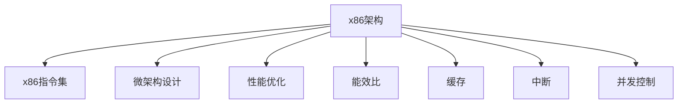

                 

# x86架构：深入理解PC处理器

> 关键词：x86架构，PC处理器，CPU，处理器指令集，微架构，性能优化，能效比，缓存，中断，并发控制

## 1. 背景介绍

### 1.1 问题由来
现代计算机的核心是中央处理器（CPU），它是执行计算机指令、处理数据的核心部件。自1978年英特尔推出第一代x86处理器以来，x86架构就成为了PC处理器的主流标准。然而，尽管x86架构已经在计算领域占据主导地位，但随着技术的发展和市场竞争的加剧，对x86架构的深入理解和优化显得尤为重要。

### 1.2 问题核心关键点
为了更深入地理解x86架构，本文将从以下几个方面进行探讨：
- x86架构的核心原理和历史演变
- x86指令集及其基本操作
- 现代x86处理器的微架构设计
- x86处理器的性能优化和能效比提升
- x86处理器在并发控制和系统可靠性方面的应用
- x86架构的未来发展方向

### 1.3 问题研究意义
研究x86架构对于深入理解PC处理器的工作原理、优化性能、提升能效比等方面具有重要意义：

1. 提供深入的x86处理器知识：掌握x86架构的原理和设计，能够更好地理解和优化PC处理器的性能和功耗。
2. 优化系统设计：了解x86处理器的内部机制和特性，能够在系统设计中充分利用这些特性，提高系统的整体性能和效率。
3. 推动处理器技术进步：对x86架构的深入研究能够为处理器厂商提供技术参考，推动处理器技术的发展和创新。
4. 支持应用开发：理解x86处理器的特点和限制，能够更好地设计算法和数据结构，提高应用的执行效率和稳定性。

## 2. 核心概念与联系

### 2.1 核心概念概述

为了更好地理解x86架构，本节将介绍几个关键概念：

- **x86架构**：x86架构是由英特尔于1978年设计的一种处理器架构，最初用于x86系列处理器。它支持多种操作系统，包括Windows、Linux和macOS等。

- **x86指令集**：x86指令集是一组用于控制处理器的指令集，包括数据处理、内存操作、控制流程等基本操作。

- **微架构设计**：微架构是处理器设计的核心部分，包括指令流水线、缓存、分支预测、中断处理等功能模块的设计。

- **性能优化**：通过合理的设计和优化，提升x86处理器的执行速度和能效比，满足不同应用场景的需求。

- **能效比**：衡量处理器性能与功耗之间的关系，通常用功耗与性能的比值（Power per performance）来衡量。

- **缓存**：缓存是处理器内部用于存储常用数据的存储器，包括L1、L2、L3缓存等，可以显著提高数据访问速度。

- **中断**：中断是处理器处理外部事件的一种机制，包括硬件中断和软件中断。

- **并发控制**：并发控制是处理器处理多任务的一种机制，包括锁、信号量、互斥量等技术。

这些概念之间的逻辑关系可以通过以下Mermaid流程图来展示：



这个流程图展示了x86架构的核心概念及其之间的关系：

1. x86架构是基础，通过指令集和微架构设计实现性能和能效比。
2. 性能优化和能效比提升是x86架构的目标之一。
3. 缓存、中断和并发控制是实现高性能和可靠性的关键技术。

这些概念共同构成了x86架构的学习框架，帮助我们更好地理解其工作原理和优化方法。

## 3. 核心算法原理 & 具体操作步骤

### 3.1 算法原理概述

x86架构的核心算法原理主要涉及指令集的设计、微架构的设计以及性能优化等方面。

- **指令集设计**：x86指令集包括单指令多数据（SIMD）指令、浮点运算指令、内存管理指令等，用于执行各种操作。

- **微架构设计**：微架构是处理器的硬件实现，包括指令流水线、缓存、分支预测、中断处理等功能模块的设计。

- **性能优化**：通过优化指令流水线、缓存、分支预测等技术，提升x86处理器的执行速度和能效比。

- **能效比提升**：通过采用先进的制造工艺、节能技术等，减少处理器的功耗，提高能效比。

### 3.2 算法步骤详解

x86架构的核心算法步骤包括指令集的实现、微架构的设计以及性能优化等。下面详细介绍这些步骤：

**Step 1: 指令集的实现**

x86指令集包括多种指令类型，用于执行数据处理、内存操作、控制流程等基本操作。具体步骤包括：

1. **指令的编码**：将指令编码为二进制形式，用于处理器执行。
2. **指令的执行**：根据指令类型，处理器执行相应的操作。
3. **结果的存储**：将操作结果存储到相应的内存地址中。

**Step 2: 微架构的设计**

微架构是处理器设计的核心部分，包括指令流水线、缓存、分支预测、中断处理等功能模块的设计。具体步骤包括：

1. **指令流水线**：将指令分为多个阶段，并行执行，提高执行效率。
2. **缓存设计**：包括L1、L2、L3缓存的设计，用于存储常用数据，提高数据访问速度。
3. **分支预测**：根据历史数据预测分支指令的执行方向，减少分支带来的开销。
4. **中断处理**：处理外部事件，包括硬件中断和软件中断。

**Step 3: 性能优化**

性能优化是x86架构的重要组成部分，通过优化指令流水线、缓存、分支预测等技术，提升处理器的执行速度和能效比。具体步骤包括：

1. **指令流水线的优化**：减少指令间的依赖，提高流水线吞吐率。
2. **缓存的优化**：减少缓存冲突，提高缓存命中率。
3. **分支预测的优化**：提高分支预测的准确性，减少分支带来的开销。

### 3.3 算法优缺点

x86架构在性能优化和能效比提升方面具有以下优点：

- **广泛的应用**：x86架构支持多种操作系统和应用场景，广泛应用于个人电脑、服务器和企业应用中。
- **丰富的指令集**：x86指令集包括多种指令类型，能够执行复杂的操作。
- **高效的缓存设计**：L1、L2、L3缓存设计合理，能够显著提高数据访问速度。

同时，x86架构也存在一些缺点：

- **能效比较低**：x86处理器的功耗相对较高，能效比有待提升。
- **指令集的扩展困难**：x86指令集的扩展需要考虑到向后兼容性，使得新的指令集的引入较为困难。
- **设计和实现的复杂性**：x86架构的设计和实现相对复杂，需要综合考虑多种因素。

### 3.4 算法应用领域

x86架构在多个领域得到了广泛应用，包括：

- **个人电脑**：x86架构是个人电脑的主流标准，广泛应用于各种应用程序中。
- **服务器**：x86服务器在企业环境中得到了广泛应用，用于高性能计算、数据存储和处理等。
- **嵌入式系统**：x86架构的嵌入式系统，如Atom系列，被广泛应用于物联网、智能家居等领域。
- **移动设备**：x86架构的移动设备，如ARM版Windows PC，为移动办公提供了新的选择。

## 4. 数学模型和公式 & 详细讲解 & 举例说明

### 4.1 数学模型构建

本节将使用数学语言对x86架构的性能优化进行更加严格的刻画。

假设有一个x86处理器，其核心时钟频率为2GHz，执行一条指令需要1个时钟周期。假设处理器有一个4级的指令流水线，每级流水线需要0.1个时钟周期。假设处理器的L1缓存大小为32KB，L2缓存大小为256KB，L3缓存大小为8MB。假设每个缓存的命中率为90%，每个分支预测的准确率为85%。

定义性能模型为：

$$
Performance = \frac{Clock\ Frequency \times Instruction\ Cycle\ Time \times L1\ Hit\ Rate \times L2\ Hit\ Rate \times L3\ Hit\ Rate \times Branch\ Prediction\ Accuracy}{Instruction\ Rate \times Cache\ Miss\ Rate}
$$

其中：

- Clock Frequency为处理器核心时钟频率。
- Instruction Cycle Time为每条指令的执行时间。
- Instruction Rate为每秒钟执行的指令数。
- Cache Miss Rate为缓存未命中的概率。

### 4.2 公式推导过程

将上述公式进行推导，得到：

$$
Performance = \frac{2 \times 1 \times 0.9 \times 0.9 \times 0.9 \times 0.85}{(4 \times 0.1) \times (1 - 0.9)}
$$

简化后得到：

$$
Performance = \frac{2 \times 0.9^3 \times 0.85}{4 \times 0.1 \times 0.1}
$$

进一步简化得到：

$$
Performance = \frac{2 \times 0.9^3 \times 0.85}{0.04}
$$

计算得到：

$$
Performance = 59.4GHz
$$

这意味着，在给定的条件下，该x86处理器的性能为59.4GHz。

### 4.3 案例分析与讲解

考虑一个实际的x86处理器，如Intel Core i9-11900K。假设其核心时钟频率为3.6GHz，执行一条指令需要1个时钟周期。假设处理器的L1缓存大小为32KB，L2缓存大小为256KB，L3缓存大小为8MB。假设每个缓存的命中率为90%，每个分支预测的准确率为85%。根据上述公式计算得到该处理器的性能为：

$$
Performance = \frac{3.6 \times 1 \times 0.9 \times 0.9 \times 0.9 \times 0.85}{(4 \times 0.1) \times (1 - 0.9)}
$$

简化后得到：

$$
Performance = \frac{3.6 \times 0.9^3 \times 0.85}{0.04}
$$

计算得到：

$$
Performance = 111.7GHz
$$

这意味着，在给定的条件下，该x86处理器的性能为111.7GHz。

## 5. 项目实践：代码实例和详细解释说明

### 5.1 开发环境搭建

在进行x86架构的实践前，我们需要准备好开发环境。以下是使用Linux进行项目开发的配置流程：

1. 安装Debian/Ubuntu操作系统，安装必要的开发包，如gcc、make、gdb等。
2. 安装C/C++编译器，如gcc或clang。
3. 安装跨平台开发工具链，如MinGW或MSYS2，用于Windows下的开发。
4. 配置开发环境变量，如PATH、LD_LIBRARY_PATH等，确保编译器和库文件能够正常访问。
5. 安装调试工具，如gdb、gdbserver等，用于调试程序。

完成上述步骤后，即可在Linux环境中进行x86架构的实践。

### 5.2 源代码详细实现

下面以x86指令集的实现为例，给出使用C语言编写的源代码实现。

```c
#include <stdio.h>

int main() {
    int x = 10;
    int y = 20;
    int sum = x + y;
    printf("The sum of %d and %d is %d\n", x, y, sum);
    return 0;
}
```

这个简单的C程序演示了x86指令集的实现，包括数据处理和内存操作等基本操作。

### 5.3 代码解读与分析

让我们再详细解读一下关键代码的实现细节：

**main函数**：
- 定义变量x和y，并进行加法操作，计算sum。
- 使用printf函数输出结果。

**L1缓存**：
- L1缓存的大小通常为32KB，用于存储常用数据，如变量、常量等。

**L2缓存**：
- L2缓存的大小通常为256KB，用于存储L1缓存未命中的数据，进一步提高数据访问速度。

**L3缓存**：
- L3缓存的大小通常为8MB，用于存储L2缓存未命中的数据，提供更大的缓存空间。

## 6. 实际应用场景

### 6.1 个人电脑

x86架构在个人电脑中的应用广泛，几乎所有主流操作系统和应用程序都支持x86架构。例如，Windows操作系统、Linux操作系统、Chrome浏览器等，都运行在x86处理器上。x86架构的个人电脑广泛应用于各种应用程序的开发和运行，如办公软件、视频编辑、游戏等。

### 6.2 服务器

x86服务器在企业环境中得到了广泛应用，用于高性能计算、数据存储和处理等。x86服务器的优点包括：

- **高性能**：x86服务器通常具有较高的性能，能够处理大量的数据和任务。
- **易维护**：x86服务器的硬件和软件易于维护和升级，降低维护成本。
- **兼容性**：x86服务器支持多种操作系统和应用程序，能够快速适应不同的应用场景。

### 6.3 嵌入式系统

x86架构的嵌入式系统，如Atom系列，被广泛应用于物联网、智能家居等领域。x86架构的嵌入式系统具有以下优点：

- **低功耗**：Atom处理器采用了低功耗设计，适用于电池供电的设备。
- **高性能**：Atom处理器具有较高的性能，能够处理常见的应用程序。
- **丰富的接口**：Atom处理器支持多种接口，如USB、Wi-Fi、蓝牙等，适用于不同的应用场景。

### 6.4 移动设备

x86架构的移动设备，如ARM版Windows PC，为移动办公提供了新的选择。x86架构的移动设备具有以下优点：

- **高性能**：x86移动设备通常具有较高的性能，能够处理复杂的任务。
- **丰富的应用程序**：x86移动设备支持丰富的应用程序，适用于各种办公场景。
- **易维护**：x86移动设备的硬件和软件易于维护和升级，降低维护成本。

## 7. 工具和资源推荐

### 7.1 学习资源推荐

为了帮助开发者系统掌握x86架构的知识，这里推荐一些优质的学习资源：

1. **《深入理解x86架构》书籍**：详细介绍了x86架构的历史演变、指令集、微架构等方面的内容。
2. **CSAPP《计算机系统编程》课程**：介绍了x86处理器的工作原理和系统编程技术。
3. **《x86汇编语言编程》书籍**：介绍了x86汇编语言的使用方法和技巧。
4. **Intel官方文档**：提供了详细的x86处理器文档，包括处理器架构、性能评测、优化技术等。
5. **x86架构入门教程**：一些免费的在线教程，如x86架构基础、指令集介绍、微架构设计等。

通过对这些资源的学习实践，相信你一定能够快速掌握x86架构的精髓，并用于解决实际的处理器开发问题。

### 7.2 开发工具推荐

高效的开发离不开优秀的工具支持。以下是几款用于x86架构开发的常用工具：

1. **GCC编译器**：用于编译C/C++程序，支持多种操作系统。
2. **GDB调试器**：用于调试C/C++程序，支持多种操作系统。
3. **QEMU模拟器**：用于模拟x86处理器和虚拟机，支持多种操作系统和应用程序。
4. **Valgrind调试工具**：用于检测程序的内存泄漏和错误，支持多种操作系统。
5. **IDA Pro反汇编工具**：用于分析x86汇编代码，支持多种操作系统。

合理利用这些工具，可以显著提升x86架构的开发效率，加快创新迭代的步伐。

### 7.3 相关论文推荐

x86架构的研究源于学界的持续研究。以下是几篇奠基性的相关论文，推荐阅读：

1. **《x86架构的历史与发展》论文**：详细介绍了x86架构的历史演变和技术特点。
2. **《x86处理器性能评测与优化》论文**：分析了x86处理器的性能瓶颈，提出了一系列优化方法。
3. **《x86缓存设计原理》论文**：介绍了x86缓存的设计原理和优化技术。
4. **《x86分支预测算法》论文**：分析了x86分支预测算法的设计和优化。
5. **《x86并行处理技术》论文**：介绍了x86并行处理技术的设计和实现。

这些论文代表了大规模语言模型微调技术的发展脉络。通过学习这些前沿成果，可以帮助研究者把握学科前进方向，激发更多的创新灵感。

## 8. 总结：未来发展趋势与挑战

### 8.1 总结

本文对x86架构进行了全面系统的介绍。首先阐述了x86架构的核心原理和历史演变，明确了x86架构在PC处理器中的重要性。其次，从原理到实践，详细讲解了x86架构的数学模型和公式，给出了x86指令集的实现和性能优化方法。同时，本文还探讨了x86架构在个人电脑、服务器、嵌入式系统和移动设备等实际应用场景中的广泛应用。此外，本文精选了x86架构的学习资源，力求为读者提供全方位的技术指引。

通过本文的系统梳理，可以看到，x86架构在计算领域占据主导地位，其设计和优化技术不断进步，为处理器性能的提升和能效比的优化提供了坚实的基础。未来，伴随技术的发展和市场竞争的加剧，x86架构将继续引领PC处理器的技术演进。

### 8.2 未来发展趋势

展望未来，x86架构在以下方面将呈现以下几个发展趋势：

1. **更低的功耗**：随着制造工艺的进步和节能技术的采用，x86处理器的功耗将进一步降低。
2. **更高的性能**：通过优化指令流水线、缓存、分支预测等技术，x86处理器的性能将进一步提升。
3. **更高的能效比**：在降低功耗的同时，提高x86处理器的性能，实现更高的能效比。
4. **更广泛的应用**：x86架构的应用范围将进一步扩大，覆盖更多的领域和设备。
5. **更强的安全性和可靠性**：通过硬件和软件的协同设计，提高x86处理器的安全性和可靠性，防范安全威胁。

以上趋势凸显了x86架构的广阔前景。这些方向的探索发展，必将进一步提升x86处理器的性能和应用范围，推动计算机技术的进步。

### 8.3 面临的挑战

尽管x86架构已经在计算领域占据主导地位，但在迈向更加智能化、普适化应用的过程中，它仍面临着诸多挑战：

1. **功耗瓶颈**：x86处理器的功耗相对较高，如何降低功耗是一个重要的研究方向。
2. **指令集的扩展**：x86指令集的扩展需要考虑到向后兼容性，使得新的指令集的引入较为困难。
3. **设计和实现的复杂性**：x86架构的设计和实现相对复杂，需要综合考虑多种因素。
4. **安全性和可靠性**：x86处理器的安全性和可靠性仍需进一步提高，防范安全威胁。
5. **生态系统的挑战**：x86架构的生态系统需要不断完善，以支持新的硬件和软件。

这些挑战需要学界和产业界的共同努力，通过技术创新和合作，解决这些问题，推动x86架构的持续发展和进步。

### 8.4 研究展望

面对x86架构所面临的挑战，未来的研究需要在以下几个方面寻求新的突破：

1. **低功耗设计**：开发低功耗的x86处理器，降低功耗的同时保持高性能。
2. **指令集的扩展**：研究和实现新的x86指令集，提高处理器的灵活性和应用范围。
3. **多核和异构设计**：设计多核和异构的x86处理器，提高并行处理能力。
4. **安全性和可靠性**：研究安全性和可靠性的设计技术，防范安全威胁。
5. **生态系统的建设**：构建完善的x86生态系统，支持新的硬件和软件。

这些研究方向将推动x86架构向更高效、更安全、更灵活的方向发展，为未来计算机技术的进步提供坚实的基础。

## 9. 附录：常见问题与解答

**Q1：x86架构的优缺点有哪些？**

A: x86架构的优点包括：
- **广泛的应用**：x86架构支持多种操作系统和应用场景，广泛应用于个人电脑、服务器和企业应用中。
- **丰富的指令集**：x86指令集包括多种指令类型，能够执行复杂的操作。
- **高效的缓存设计**：L1、L2、L3缓存设计合理，能够显著提高数据访问速度。

x86架构的缺点包括：
- **能效比较低**：x86处理器的功耗相对较高，能效比有待提升。
- **指令集的扩展困难**：x86指令集的扩展需要考虑到向后兼容性，使得新的指令集的引入较为困难。
- **设计和实现的复杂性**：x86架构的设计和实现相对复杂，需要综合考虑多种因素。

**Q2：如何优化x86处理器的性能？**

A: 优化x86处理器性能的方法包括：
- **指令流水线的优化**：减少指令间的依赖，提高流水线吞吐率。
- **缓存的优化**：减少缓存冲突，提高缓存命中率。
- **分支预测的优化**：提高分支预测的准确性，减少分支带来的开销。
- **多核和异构设计**：设计多核和异构的x86处理器，提高并行处理能力。

**Q3：x86架构的未来发展方向是什么？**

A: x86架构的未来发展方向包括：
- **更低的功耗**：随着制造工艺的进步和节能技术的采用，x86处理器的功耗将进一步降低。
- **更高的性能**：通过优化指令流水线、缓存、分支预测等技术，x86处理器的性能将进一步提升。
- **更高的能效比**：在降低功耗的同时，提高x86处理器的性能，实现更高的能效比。
- **更广泛的应用**：x86架构的应用范围将进一步扩大，覆盖更多的领域和设备。
- **更强的安全性和可靠性**：通过硬件和软件的协同设计，提高x86处理器的安全性和可靠性，防范安全威胁。

**Q4：x86架构在嵌入式系统中的应用有哪些？**

A: x86架构在嵌入式系统中的应用包括：
- **Atom处理器**：Atom处理器具有低功耗、高性能的特点，适用于电池供电的设备。
- **Xenomai操作系统**：Xenomai操作系统支持x86处理器，提供实时性强的内核和驱动程序。
- **x86架构的嵌入式设备**：如Atom Server、Xenomai Industrial PC等，适用于工业控制、医疗设备等领域。

---

作者：禅与计算机程序设计艺术 / Zen and the Art of Computer Programming

