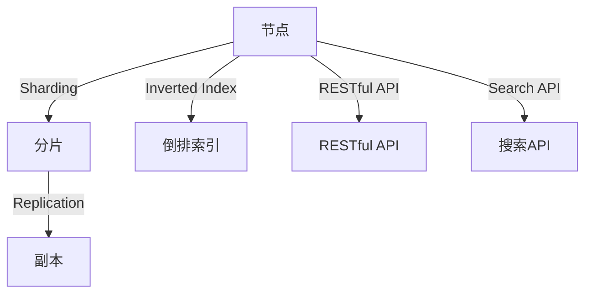

                 

# 【AI大数据计算原理与代码实例讲解】ElasticSearch

> 关键词：ElasticSearch, 大数据计算, 搜索引擎, 实时数据, 索引, 存储, 查询

## 1. 背景介绍

在当今信息爆炸的时代，如何高效地存储、搜索和处理海量数据是一个至关重要的问题。传统的SQL数据库和文件存储系统在面对大规模数据集时显得力不从心，且操作复杂，查询速度慢，无法满足实时性需求。ElasticSearch作为一款基于Lucene的开源搜索引擎，以其强大的文本搜索和分析能力，成为了处理大规模数据的首选解决方案。

ElasticSearch是一个分布式搜索引擎，可以处理海量数据，同时提供了实时索引和查询功能。它采用了Sharding（分片）和Replication（复制）的技术来确保数据的分布式存储和容错性。ElasticSearch的RESTful API设计友好，易于使用，支持多种数据类型和查询语言，能够轻松地集成到各种应用程序中。

## 2. 核心概念与联系

### 2.1 核心概念概述

为了更好地理解ElasticSearch的核心原理和架构，我们需要介绍几个关键概念：

- **分布式系统**：ElasticSearch是一个基于Node（节点）的分布式系统，节点可以独立运行，多个节点可以组成一个ElasticSearch集群，共同处理数据。
- **Sharding**：Sharding是将数据分散存储在不同的节点上，以提高系统的扩展性和容错性。每个Shard可以视为一个独立的索引，可以单独管理和搜索。
- **Replication**：为了保证数据的安全性和可靠性，每个Shard可以配置多个副本（Replicas），以保证数据冗余。当某个节点发生故障时，系统可以自动从备份节点恢复数据。
- **Inverted Index**：ElasticSearch的核心数据结构，用于快速定位和检索文档中的关键词。Inverted Index将每个关键词与其出现的文档列表关联起来，可以快速查找包含某个关键词的文档。
- **RESTful API**：ElasticSearch的接口采用RESTful API设计，支持HTTP协议，能够通过标准Web接口进行数据查询、索引、管理和监控等操作。
- **Search API**：ElasticSearch的查询语言基于DSL（Domain-Specific Language）设计，提供强大的搜索和分析功能。

这些核心概念之间相互关联，共同构成了ElasticSearch的工作原理和架构，使得它能够高效地处理大规模数据，并提供了丰富的查询和分析功能。

### 2.2 核心概念原理和架构的 Mermaid 流程图



这个流程图展示了ElasticSearch中几个核心概念之间的关系。节点管理分片和副本，分片使用倒排索引存储数据，RESTful API提供了数据管理和监控功能，而搜索API则是查询和分析的主要手段。

## 3. 核心算法原理 & 具体操作步骤

### 3.1 算法原理概述

ElasticSearch的核心算法是倒排索引（Inverted Index），其原理是将每个关键词与其出现的文档列表关联起来，快速定位和检索文档中的关键词。ElasticSearch通过分片和副本技术，确保数据的分布式存储和容错性。其算法步骤如下：

1. **数据分片**：将数据分割成多个分片（Shard），每个分片存储在一个节点上。
2. **数据复制**：每个分片配置多个副本（Replica），保证数据的冗余和容错性。
3. **倒排索引构建**：每个分片使用倒排索引技术，将每个关键词与其出现的文档列表关联起来，建立快速检索的数据结构。
4. **查询处理**：客户端通过RESTful API向ElasticSearch发送查询请求，ElasticSearch根据查询语句，在倒排索引中快速定位和检索文档。

### 3.2 算法步骤详解

下面详细解释ElasticSearch的算法步骤：

1. **数据分片**：ElasticSearch将数据根据指定的Shard Size（分片大小）分割成多个分片，每个分片存储在一个节点上。分片大小可以根据数据量和节点数进行配置，通常是8GB~16GB之间。

2. **数据复制**：为了保证数据的冗余和容错性，每个分片配置多个副本（Replica）。通常每个分片会配置一个副本，以保证数据的高可用性。

3. **倒排索引构建**：每个分片使用倒排索引技术，将每个关键词与其出现的文档列表关联起来，建立快速检索的数据结构。倒排索引的构建过程包括两个步骤：
   - 索引构建：将文档内容分词，并建立倒排索引。
   - 查询优化：对倒排索引进行优化，提高查询效率。

4. **查询处理**：客户端通过RESTful API向ElasticSearch发送查询请求，ElasticSearch根据查询语句，在倒排索引中快速定位和检索文档。查询处理过程包括：
   - 解析查询语句：将查询语句解析成查询逻辑。
   - 分片分配：根据查询逻辑，分配查询请求到合适的分片上。
   - 数据检索：在倒排索引中快速定位和检索文档。
   - 结果合并：将多个分片的结果合并，返回给客户端。

### 3.3 算法优缺点

ElasticSearch的优点包括：

- **高可用性**：通过Sharding和Replication技术，保证数据的分布式存储和容错性，系统可靠性高。
- **高性能**：倒排索引和查询优化技术，确保数据检索的高效性。
- **易用性**：RESTful API设计友好，易于使用，支持多种查询语言和数据类型。

ElasticSearch的缺点包括：

- **配置复杂**：需要配置分片大小、副本数、索引映射等参数，配置不当可能导致性能问题。
- **资源消耗大**：ElasticSearch需要消耗大量的CPU、内存和磁盘资源，特别是磁盘I/O操作较多，可能导致系统负载高。
- **部署复杂**：需要构建和维护ElasticSearch集群，部署过程较为复杂。

### 3.4 算法应用领域

ElasticSearch在多个领域得到了广泛的应用，包括：

- **搜索和推荐系统**：ElasticSearch能够处理大规模数据，快速检索和推荐相关信息。
- **日志管理**：ElasticSearch可以实时处理和分析日志数据，帮助系统进行性能监控和故障排查。
- **文本分析和挖掘**：ElasticSearch支持自然语言处理技术，可以分析文本数据，提取有价值的信息。
- **实时数据处理**：ElasticSearch支持流式数据处理，可以实时处理和分析数据。

## 4. 数学模型和公式 & 详细讲解

### 4.1 数学模型构建

ElasticSearch的数学模型主要涉及倒排索引的构建和查询优化。倒排索引的构建过程可以概括为以下几个步骤：

1. **分词和解析**：将文档内容进行分词和解析，将其转化为关键词列表。
2. **索引构建**：将关键词与文档ID关联起来，建立倒排索引。
3. **查询优化**：对倒排索引进行优化，提高查询效率。

查询优化过程包括两个步骤：

1. **查询解析**：将查询语句解析成查询逻辑。
2. **查询执行**：根据查询逻辑，在倒排索引中快速定位和检索文档。

### 4.2 公式推导过程

倒排索引的构建过程可以表示为：

$$
\text{Index} = \text{Document} \times \text{Term}^{-1}
$$

其中，$\text{Index}$表示倒排索引，$\text{Document}$表示文档列表，$\text{Term}$表示关键词列表。倒排索引的查询过程可以表示为：

$$
\text{Result} = \text{Index}[Term] \cap \text{Query}
$$

其中，$\text{Result}$表示查询结果，$\text{Query}$表示查询语句。

### 4.3 案例分析与讲解

以一个简单的文本搜索为例，ElasticSearch的查询过程可以描述为：

1. **分词和解析**：将查询语句进行分词和解析，将其转化为关键词列表。
2. **分片分配**：根据关键词列表，分配查询请求到合适的分片上。
3. **数据检索**：在倒排索引中快速定位和检索文档。
4. **结果合并**：将多个分片的结果合并，返回给客户端。

## 5. 项目实践：代码实例和详细解释说明

### 5.1 开发环境搭建

要进行ElasticSearch的开发和部署，首先需要搭建好开发环境。以下是在Ubuntu系统中搭建ElasticSearch开发环境的详细步骤：

1. **安装Java**：ElasticSearch需要JDK 8或以上版本，可以从官网下载安装包进行安装。
   ```
   sudo apt-get update
   sudo apt-get install openjdk-8-jdk
   ```

2. **安装ElasticSearch**：可以从官网下载最新的ElasticSearch安装包，并解压安装。
   ```
   wget https://download.elastic.co/elasticsearch/elasticsearch-7.10.1.tar.gz
   tar -xzf elasticsearch-7.10.1.tar.gz
   cd elasticsearch-7.10.1
   ```

3. **启动ElasticSearch**：在bin目录下运行start.sh脚本启动ElasticSearch服务。
   ```
   bin/elasticsearch
   ```

4. **访问ElasticSearch**：可以通过浏览器访问ElasticSearch的RESTful API，默认端口为9200。

### 5.2 源代码详细实现

以下是使用Python语言进行ElasticSearch查询的代码实现：

```python
from elasticsearch import Elasticsearch

# 创建ElasticSearch连接
es = Elasticsearch(['localhost:9200'])

# 查询数据
res = es.search(index='my_index', body={
    "query": {
        "match": {
            "text": "keyword"
        }
    }
})

# 输出结果
print(res['hits']['hits'])
```

这段代码创建了一个ElasticSearch连接，并使用search方法查询索引为'my_index'，查询文本为'keyword'的文档。查询结果会以列表形式返回，每个文档包含其ID、分数、内容和解析。

### 5.3 代码解读与分析

这段代码的实现过程如下：

1. **连接ElasticSearch**：使用ElasticSearch库创建连接，指定ElasticSearch服务器的地址和端口。
2. **构建查询语句**：使用search方法，指定查询索引和查询语句，其中查询语句使用match查询方法，匹配文本中的关键词。
3. **执行查询**：发送查询请求，ElasticSearch返回查询结果。
4. **输出结果**：遍历查询结果，输出每个文档的ID、分数、内容和解析。

## 6. 实际应用场景

### 6.1 搜索和推荐系统

ElasticSearch在搜索和推荐系统中得到了广泛应用，其强大的文本搜索和分析能力，可以处理大规模数据，快速检索和推荐相关信息。例如，电商平台可以使用ElasticSearch存储商品信息，根据用户查询推荐相关商品。

### 6.2 日志管理

ElasticSearch可以实时处理和分析日志数据，帮助系统进行性能监控和故障排查。例如，应用服务器可以记录日志信息，使用ElasticSearch进行实时查询和分析，及时发现系统异常和性能瓶颈。

### 6.3 文本分析和挖掘

ElasticSearch支持自然语言处理技术，可以分析文本数据，提取有价值的信息。例如，社交媒体可以使用ElasticSearch存储用户评论，分析用户情感和趋势，提供有价值的内容推荐。

### 6.4 实时数据处理

ElasticSearch支持流式数据处理，可以实时处理和分析数据。例如，传感器数据可以实时存储在ElasticSearch中，进行实时查询和分析，及时发现异常和故障。

## 7. 工具和资源推荐

### 7.1 学习资源推荐

为了帮助开发者系统掌握ElasticSearch的理论基础和实践技巧，这里推荐一些优质的学习资源：

1. **ElasticSearch官方文档**：ElasticSearch官方文档提供了详细的API文档和用户手册，是学习ElasticSearch的必备资料。
   [官方文档](https://www.elastic.co/guide/en/elasticsearch/reference/current/index.html)

2. **《ElasticSearch权威指南》**：这本书系统介绍了ElasticSearch的核心概念、配置和管理，适合初学者和进阶开发者。
   [书籍](https://www.manning.com/books/elasticsearch-the-definitive-guide-4th-edition)

3. **《ElasticSearch高级优化指南》**：这本书详细介绍了ElasticSearch的高级优化技巧和最佳实践，适合有一定ElasticSearch基础的中高级开发者。
   [书籍](https://www.manning.com/books/elasticsearch-advanced-tuning-4th-edition)

4. **ElasticSearch官方博客**：ElasticSearch官方博客定期发布最新的技术文章和案例分析，适合跟进最新技术和应用趋势。
   [官方博客](https://www.elastic.co/blog/)

5. **Kibana官网教程**：Kibana是基于ElasticSearch构建的数据可视化工具，官方提供了详细的教程和示例。
   [Kibana教程](https://www.elastic.co/guide/en/kibana/current/index.html)

### 7.2 开发工具推荐

ElasticSearch的开发和部署需要使用一些辅助工具：

1. **ElasticSearch控制台**：ElasticSearch提供了官方控制台，可以方便地进行数据管理和监控。
   [控制台](https://www.elastic.co/guide/en/elasticsearch/reference/current/guide.html#running-an-elasticsearch-node-locally)

2. **Kibana**：Kibana是基于ElasticSearch构建的数据可视化工具，可以方便地进行数据可视化分析。
   [Kibana](https://www.elastic.co/kibana)

3. **Curator**：Curator是ElasticSearch的一个插件，可以方便地进行数据管理和清理。
   [Curator](https://github.com/elastic/elasticsearch-curator)

4. **Logstash**：Logstash是ElasticSearch的日志收集和处理工具，可以方便地收集和分析日志数据。
   [Logstash](https://www.elastic.co/guide/en/logstash/current/index.html)

### 7.3 相关论文推荐

ElasticSearch的不断发展和优化，也带来了大量的相关论文。以下是几篇具有代表性的论文：

1. **《Scalable and Efficient Search of Distributed Document Bases with DocMate》**：这篇论文提出了DocMate算法，用于高效地处理大规模文档数据。
   [论文](https://www.elastic.co/blog/elasticsearch-paper-scalable-efficient-search-of-distributed-document-bases-with-docmate)

2. **《Analyzing the Performance of E-Commerce Searches in Elasticsearch》**：这篇论文分析了ElasticSearch在电商搜索中的应用，提出了性能优化的方法。
   [论文](https://www.elastic.co/blog/analytics-performance-of-ecommerce-searches-in-elasticsearch)

3. **《ElasticSearch for Production: Real-time Indexing, Searching, and Analytics》**：这篇论文介绍了ElasticSearch的生产环境部署和优化方法。
   [论文](https://www.elastic.co/blog/elasticsearch-for-production-real-time-indexing-searching-and-analytics)

## 8. 总结：未来发展趋势与挑战

### 8.1 研究成果总结

ElasticSearch作为一款强大的搜索引擎，已经在多个领域得到了广泛应用。其分布式存储和容错性、高可用性、高性能等优势，使得其在处理大规模数据时具有显著优势。ElasticSearch的RESTful API和查询语言设计友好，易于使用，能够满足各种应用需求。

### 8.2 未来发展趋势

展望未来，ElasticSearch的发展趋势包括：

1. **分布式架构优化**：ElasticSearch将进一步优化分布式架构，提高系统的扩展性和容错性。
2. **查询优化**：ElasticSearch将进一步优化查询语言和查询优化算法，提高查询效率和性能。
3. **数据处理**：ElasticSearch将进一步优化数据处理和存储技术，提高数据处理速度和效率。
4. **跨领域应用**：ElasticSearch将进一步扩展应用领域，覆盖更多的行业和场景。
5. **人工智能**：ElasticSearch将进一步结合人工智能技术，提供更加智能化和自动化的解决方案。

### 8.3 面临的挑战

尽管ElasticSearch已经取得了诸多成就，但在未来发展过程中，仍然面临一些挑战：

1. **配置复杂**：ElasticSearch需要配置分片大小、副本数、索引映射等参数，配置不当可能导致性能问题。
2. **资源消耗大**：ElasticSearch需要消耗大量的CPU、内存和磁盘资源，特别是磁盘I/O操作较多，可能导致系统负载高。
3. **部署复杂**：ElasticSearch需要构建和维护ElasticSearch集群，部署过程较为复杂。
4. **安全性**：ElasticSearch需要加强安全性措施，防止数据泄露和系统攻击。
5. **可扩展性**：ElasticSearch需要进一步提升可扩展性，支持更大规模的数据处理和查询。

### 8.4 研究展望

面对ElasticSearch面临的挑战，未来的研究需要在以下几个方面寻求新的突破：

1. **配置自动化**：开发自动化的配置工具，简化ElasticSearch的配置过程，减少人为错误。
2. **资源优化**：优化ElasticSearch的资源消耗，提升系统的运行效率和稳定性。
3. **安全性增强**：加强ElasticSearch的安全性措施，保障数据和系统的安全。
4. **可扩展性提升**：提升ElasticSearch的可扩展性，支持更大规模的数据处理和查询。
5. **跨领域应用扩展**：将ElasticSearch扩展到更多行业和场景，提升应用价值和用户体验。

总之，ElasticSearch作为一款强大的搜索引擎，其发展前景广阔，但也需要不断优化和改进，以应对未来发展的挑战和需求。

## 9. 附录：常见问题与解答

### Q1: 什么是ElasticSearch?

A: ElasticSearch是一个基于Lucene的开源搜索引擎，提供了分布式存储和查询功能。它支持实时索引和查询，能够处理大规模数据，并提供了RESTful API和查询语言，方便开发和部署。

### Q2: 如何使用ElasticSearch进行文本搜索?

A: 使用ElasticSearch进行文本搜索，首先需要创建索引，并上传文档数据。然后可以使用ElasticSearch的RESTful API进行查询。查询语句可以使用match、bool、script等查询语言，根据具体需求进行优化。

### Q3: 如何优化ElasticSearch的查询性能?

A: 优化ElasticSearch的查询性能，可以从以下几个方面入手：
1. 合理配置分片大小和副本数，提升系统的扩展性和容错性。
2. 使用查询缓存和缓存过滤，减少查询时间和I/O操作。
3. 使用分页查询，减少查询结果的数量。
4. 优化查询语句，避免复杂的子查询和过滤条件。
5. 使用查询优化工具，如ElasticSearch官方提供的查询优化插件。

### Q4: 如何使用ElasticSearch进行数据可视化分析?

A: 使用ElasticSearch进行数据可视化分析，可以通过Kibana实现。首先需要将ElasticSearch的数据导入Kibana，然后使用Kibana的可视化功能，创建仪表盘和报告，实时展示和分析数据。

### Q5: 如何处理大规模数据存储和查询?

A: 处理大规模数据存储和查询，可以采用以下策略：
1. 使用分片技术，将数据分散存储在不同的节点上。
2. 使用副本技术，保证数据的冗余和容错性。
3. 使用倒排索引技术，提高数据检索的效率。
4. 使用分布式计算和存储技术，提升系统的扩展性和性能。
5. 使用ElasticSearch的监控和告警功能，及时发现和处理数据异常。

总之，ElasticSearch作为一款强大的搜索引擎，其应用场景广泛，技术细节复杂，但通过合理配置和优化，能够实现高效的数据存储和查询。

---

作者：禅与计算机程序设计艺术 / Zen and the Art of Computer Programming

