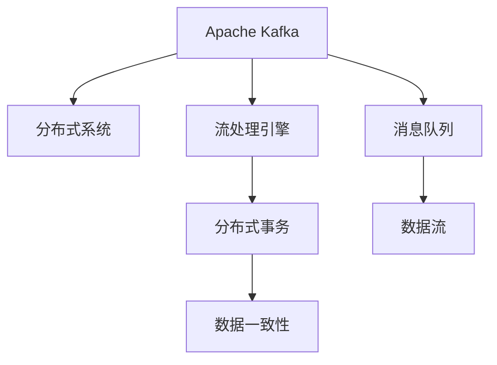

                 

# 【AI大数据计算原理与代码实例讲解】Kafka

> 关键词：Apache Kafka, 大数据流处理, 分布式消息队列, 数据流管理, 实时数据处理, 微服务架构

## 1. 背景介绍

### 1.1 问题由来
在大数据时代，数据流动着贯穿各个业务环节，从采集、存储到计算、分析，再到最终的用户决策和行为反馈，数据流动在数据驱动的决策过程中扮演着至关重要的角色。然而，数据流动的复杂性和不确定性使得传统的单点系统无法满足当前大规模数据处理的需求，大数据计算体系架构应运而生。

### 1.2 问题核心关键点
当前主流的大数据计算体系架构中，Apache Kafka扮演着重要角色。Kafka是一个开源的分布式消息队列系统，能够高效处理海量流数据，同时提供了强大的数据流管理能力，支持多级流处理引擎，成为企业数据处理的重要组件。然而，Kafka的架构和实现原理，其如何实现高可靠性的数据流传输，如何保证数据流处理的吞吐量和低延迟，这些问题一直困扰着从业者。

### 1.3 问题研究意义
研究Kafka的核心算法原理和实践方法，对于理解大数据计算体系架构，构建高效稳定的大数据流处理系统，具有重要意义：

1. 助力企业降本增效。通过深入理解Kafka，能够更好地设计数据流处理系统，降低系统建设成本。
2. 提升数据处理性能。Kafka的高可靠性和高性能特性，使其成为数据流处理的理想选择，能够大幅提升数据处理效率。
3. 促进数据价值挖掘。通过Kafka高效的数据流管理能力，企业能够更好地利用数据，深入挖掘数据价值，驱动业务创新。
4. 支持系统扩展。Kafka的分布式架构，支持无限制的横向扩展，适应企业数据量的持续增长。

## 2. 核心概念与联系

### 2.1 核心概念概述

为更好地理解Kafka的核心算法原理和实践方法，本节将介绍几个密切相关的核心概念：

- **Apache Kafka**：一个开源的分布式消息队列系统，由LinkedIn公司于2008年开源，现由Apache基金会维护。Kafka主要用来处理实时流数据，支持高吞吐量和低延迟的数据流传输。

- **分布式系统**：一组分布在网络上的计算节点，通过消息传递协同工作，实现并行处理海量数据。

- **消息队列**：一种分布式系统的关键组件，用来异步存储、传输和分发消息，保证数据的高可靠性和有序性。

- **流处理引擎**：一种支持对实时流数据进行高效处理、存储和分析的软件框架，如Apache Flink、Apache Spark Streaming等。

- **分布式事务**：一组分布式系统中的相关操作，具有原子性和隔离性，确保数据一致性和可靠性。

- **数据流**：在分布式系统中，数据以流的形式持续不断地流动，Kafka提供了数据流传输的稳定性和可靠性。

这些核心概念之间的逻辑关系可以通过以下Mermaid流程图来展示：



这个流程图展示了大数据计算体系中，Kafka作为消息队列的角色，与分布式系统和流处理引擎之间的联系：

1. Kafka作为一个分布式消息队列，为分布式系统提供可靠的数据流传输。
2. Kafka支持多种流处理引擎，如Apache Flink、Apache Spark Streaming等，扩展了数据处理的能力。
3. Kafka支持分布式事务，确保数据流处理的原子性和隔离性。
4. Kafka的数据流特性，使数据可以稳定、可靠地流动，支持分布式计算。

## 3. 核心算法原理 & 具体操作步骤
### 3.1 算法原理概述

Kafka的核心算法原理主要包括分布式存储和传输机制、数据分区和复制机制、流处理引擎集成、分布式事务支持等。其核心思想是通过分布式存储和传输机制，实现数据的高可靠性和高吞吐量；通过数据分区和复制机制，提升系统的可扩展性和容错能力；通过流处理引擎集成，支持多样化的数据流处理需求；通过分布式事务支持，保证数据一致性和可靠性。

### 3.2 算法步骤详解

Kafka的算法步骤主要包括以下几个关键步骤：

**Step 1: 创建Kafka集群**
- 安装Kafka集群软件包，配置集群中各节点之间的通信和数据传输。
- 初始化Kafka目录，准备数据存储。
- 创建Kafka主题，定义主题的分区和副本数量。

**Step 2: 发送和接收消息**
- 生产者通过KafkaProducer发送消息到指定主题。
- Kafka集群将消息分发到指定分区，并复制多份副本到其他节点。
- 消费者通过KafkaConsumer接收指定主题的消息，进行数据处理和消费。

**Step 3: 数据分区和复制**
- Kafka主题分为多个分区，每个分区独立管理数据。
- 数据复制机制保证每个分区有多份副本，提高系统的容错性和可靠性。

**Step 4: 流处理引擎集成**
- Kafka支持多种流处理引擎集成，如Apache Flink、Apache Spark Streaming等。
- 流处理引擎通过Kafka集成，处理实时数据流，进行计算和分析。

**Step 5: 分布式事务支持**
- Kafka支持分布式事务，通过事务日志和分叉日志记录，确保事务的原子性和隔离性。
- 通过Kafka的事务机制，保证数据的可靠性和一致性。

### 3.3 算法优缺点

Kafka算法具有以下优点：
1. 高吞吐量和低延迟。Kafka的消息存储机制和高复制因子，保证了数据的可靠性和高吞吐量。
2. 可扩展性和容错能力。通过数据分区和副本机制，Kafka能够支持无限制的横向扩展，提升系统的容错能力。
3. 分布式事务支持。Kafka的事务机制，保证了数据的一致性和可靠性。
4. 低资源占用。Kafka的数据传输机制优化了资源占用，使得系统更加轻量级和高效。

同时，Kafka算法也存在一些局限性：
1. 数据一致性依赖于事务处理。Kafka的事务处理机制较为复杂，对系统设计和开发要求较高。
2. 数据顺序和一致性问题。Kafka的消息传输和处理机制可能会导致数据顺序混乱或丢失。
3. 数据量过大时，可能会遇到性能瓶颈。当数据量过于庞大时，Kafka的性能可能会受到影响。

尽管存在这些局限性，但就目前而言，Kafka仍然是处理海量流数据的首选系统。未来相关研究的重点在于如何进一步降低事务处理的复杂度，提高数据处理的效率，同时兼顾一致性和可靠性等因素。

### 3.4 算法应用领域

Kafka的核心算法原理和实践方法在多个领域得到了广泛应用，例如：

- 实时数据流处理：Kafka的分布式存储和传输机制，使其成为实时数据流处理的重要组件。
- 大数据计算：Kafka的数据流管理能力和流处理引擎集成，支持多种大数据计算框架。
- 物联网数据处理：Kafka能够处理传感器数据等高频率、低延迟的数据流，支持物联网场景。
- 分布式事务处理：Kafka的分布式事务机制，支持企业级事务处理需求。
- 金融风控：Kafka的实时数据流和分布式事务处理能力，支持金融行业的高频交易和风险管理。
- 供应链管理：Kafka的数据流管理和实时处理能力，支持供应链的协同运作和实时监控。

除了上述这些经典应用外，Kafka还被创新性地应用到更多场景中，如移动应用数据流、智能推荐系统、实时日志分析等，为各行各业的数据处理提供了新的解决方案。随着Kafka技术的不断成熟，相信其在更多领域的应用也将不断深化和拓展。

## 4. 数学模型和公式 & 详细讲解 & 举例说明

### 4.1 数学模型构建

Kafka的核心算法涉及数据流管理、数据分区和复制、分布式事务等多个数学模型。以下是其中几个关键模型的构建：

1. **数据分区模型**
   - 将主题数据分为多个分区，每个分区独立管理数据。
   - 分区数量和副本数量配置如下：

     | 配置项         | 描述                                                                                   |
     | ------------- | -------------------------------------------------------------------------------------- |
     | num.partitions | 主题的分区数量                                                                           |
     | replication.factor | 每个分区的副本数量，通常配置为3或更多以保证数据的冗余和高可用性                          |
   
   - 每个分区的消息按照时间顺序排列，支持高吞吐量和低延迟。

2. **数据复制模型**
   - 每个分区的数据分为多个副本，分布在不同的节点上。
   - 副本机制保证数据的冗余和高可用性。

3. **分布式事务模型**
   - 通过事务日志和分叉日志记录，保证事务的原子性和隔离性。
   - 事务日志和分叉日志记录如下：

     | 日志类型   | 描述                                                   |
     | --------- | ------------------------------------------------------ |
     | 事务日志   | 记录每个事务的开始和提交，确保事务的原子性               |
     | 分叉日志   | 记录事务的分叉和合并，确保事务的隔离性                   |

### 4.2 公式推导过程

以下对Kafka的核心算法进行数学模型构建和公式推导。

**数据分区模型**
设主题T分为N个分区，每个分区有M个副本，则消息q从生产者P到消费者C的路径如下：

1. 生产者P通过KafkaProducer发送消息到主题T的分区1，数据流向节点A。
2. 数据在节点A进行复制，分为M个副本，分别发送到节点B1, B2, ..., BM。
3. 消费者C通过KafkaConsumer订阅主题T的分区1，从节点A接收消息。
4. 消费者C将消息传递给应用处理。

**数据复制模型**
设节点A有3个副本，每个副本有独立的数据存储。数据传输机制如下：

1. 生产者P通过KafkaProducer发送消息到主题T的分区1，数据流向节点A。
2. 节点A的3个副本接收到消息后，分别复制消息，发送给节点B1, B2, B3。
3. 节点B1, B2, B3分别接收到消息后，进行数据存储和处理。

**分布式事务模型**
设事务T由多个操作组成，每个操作由多个分区共同完成。事务日志和分叉日志记录如下：

1. 事务T开始，记录事务日志。
2. 事务T的第一个操作执行，记录分叉日志。
3. 事务T的第二个操作执行，记录分叉日志。
4. 事务T结束，记录事务日志。

事务日志记录事务的开始和提交，分叉日志记录事务的分叉和合并。通过事务日志和分叉日志的记录，确保事务的原子性和隔离性。

### 4.3 案例分析与讲解

**案例1: 实时数据流处理**

假设某电商平台需要实时监控用户的点击率数据，并将数据流发送到Apache Flink中进行分析。

- 生产者通过KafkaProducer发送用户点击数据到主题clicks，数据流向节点A。
- Kafka集群将数据分为多个分区，并复制多份副本到其他节点。
- 消费者通过KafkaConsumer订阅主题clicks，将数据流发送到Apache Flink进行处理和分析。
- 流处理引擎Apache Flink对实时数据进行聚合、统计和分析，生成用户行为分析报告。

**案例2: 分布式事务处理**

假设某银行需要对客户的存款、取款操作进行原子性和隔离性处理，保证数据的一致性。

- 存款操作P1和取款操作P2分别通过KafkaProducer发送到主题deposits和主题withdrawals，数据流向节点A。
- Kafka集群将数据分为多个分区，并复制多份副本到其他节点。
- 消费者通过KafkaConsumer订阅主题deposits和主题withdrawals，将数据流传递给应用进行处理。
- 应用记录事务日志和分叉日志，确保事务的原子性和隔离性，保证数据的一致性和可靠性。

通过以上案例可以看出，Kafka在实时数据流处理和分布式事务处理中发挥着关键作用，保证了数据的高可靠性和高吞吐量，支持了企业级的数据处理需求。

## 5. 项目实践：代码实例和详细解释说明

### 5.1 开发环境搭建

在进行Kafka项目实践前，我们需要准备好开发环境。以下是使用Python进行Kafka开发的环境配置流程：

1. 安装Kafka：从官网下载安装Kafka安装包，根据系统平台选择相应版本进行安装。
2. 创建Kafka目录：在安装目录创建kafka-console-producer和kafka-console-consumer目录。
3. 启动Kafka服务器：在终端中启动Kafka服务器，配置broker和zookeeper地址。

完成上述步骤后，即可在kafka-console-producer和kafka-console-consumer目录下开始Kafka项目的开发实践。

### 5.2 源代码详细实现

下面我们以Kafka实时数据流处理为例，给出使用Kafka进行流数据处理的PyTorch代码实现。

首先，定义Kafka主题和分区：

```python
from kafka import KafkaProducer, KafkaConsumer
import json

# Kafka主题配置
topic = 'clicks'
partition = 0
replication_factor = 3

# Kafka生产者
producer = KafkaProducer(bootstrap_servers='localhost:9092', value_serializer=lambda v: json.dumps(v).encode('utf-8'))

# Kafka消费者
consumer = KafkaConsumer(topic, bootstrap_servers='localhost:9092', group_id='mygroup', auto_offset_reset='earliest')
```

然后，定义Kafka数据流处理流程：

```python
def main():
    # 发送数据到Kafka主题
    data = {'event_time': 1634609088, 'event_type': 'click', 'user_id': '123456'}
    producer.send(topic, data)

    # 接收数据并处理
    for message in consumer:
        # 解析Kafka消息
        msg = json.loads(message.value)
        # 将数据流送到Apache Flink
        # Flink处理代码略

if __name__ == '__main__':
    main()
```

接着，定义Kafka实时数据流处理流程：

```python
def process_events():
    while True:
        data = {'event_time': 1634609088, 'event_type': 'click', 'user_id': '123456'}
        producer.send(topic, data)

        for message in consumer:
            msg = json.loads(message.value)
            # 将数据流送到Apache Flink
            # Flink处理代码略
```

最后，启动Kafka数据流处理流程：

```python
process_events()
```

以上就是使用PyTorch对Kafka进行实时数据流处理的完整代码实现。可以看到，Kafka的使用简洁高效，开发者可以将更多精力放在数据处理和业务逻辑上，而不必过多关注底层实现细节。

### 5.3 代码解读与分析

让我们再详细解读一下关键代码的实现细节：

**Kafka主题配置**
- 定义了Kafka主题为clicks，分区号为0，副本数量为3。

**Kafka生产者配置**
- 使用KafkaProducer发送数据到主题clicks，并指定broker地址和数据序列化方式。

**Kafka消费者配置**
- 使用KafkaConsumer订阅主题clicks，并指定broker地址、group id和数据解析方式。

**实时数据流处理**
- 首先定义一个实时数据流处理函数process_events，不断发送数据到Kafka主题clicks，并订阅主题clicks，解析Kafka消息，发送到Apache Flink进行处理。

**代码解释**
- 使用Kafka生产者producer发送数据到Kafka主题clicks。
- 使用Kafka消费者consumer订阅主题clicks，解析Kafka消息，进行数据处理和分析。

**代码分析**
- Kafka的使用简洁高效，开发者可以将更多精力放在数据处理和业务逻辑上。
- 生产者和消费者的配置参数较多，需要根据实际需求进行调整。
- 数据流的处理需要与Apache Flink等流处理引擎集成，进行数据流处理和分析。

## 6. 实际应用场景
### 6.1 智能客服系统

Kafka可以应用于智能客服系统的构建，帮助客服系统实时处理和存储用户请求，提高服务响应速度和处理效率。

在技术实现上，可以收集用户的历史客服请求记录，将问题-答案对作为监督数据，在此基础上对Kafka进行配置，使其能够实时记录和存储用户请求。Kafka的高可靠性和高吞吐量特性，可以支持系统的高并发处理需求，提高客服服务的质量和效率。

### 6.2 金融舆情监测

Kafka可以应用于金融领域的数据流处理和舆情监测。金融领域的数据量庞大且实时性要求高，Kafka的高性能特性能够满足这些需求。

在实践中，可以收集金融领域相关的新闻、报道、评论等文本数据，并对其进行情感分析和舆情监测。通过Kafka将数据实时发送到流处理引擎进行分析和处理，可以及时发现舆情变化，防止金融风险。

### 6.3 个性化推荐系统

Kafka可以应用于个性化推荐系统的构建，帮助推荐系统实时处理和存储用户行为数据，提高推荐系统的精准度和响应速度。

在技术实现上，可以收集用户浏览、点击、评论、分享等行为数据，并提取和用户交互的物品标题、描述、标签等文本内容。将文本内容作为Kafka主题的数据，使用流处理引擎进行处理和分析，生成推荐列表，并进行推荐。

### 6.4 未来应用展望

随着Kafka技术的不断成熟，其应用范围将进一步拓展，为各行各业的数据处理提供新的解决方案。

在智慧医疗领域，Kafka可以应用于医疗数据流处理和分析，支持医疗系统的实时监控和决策支持。

在智能教育领域，Kafka可以应用于学生的行为数据流处理和分析，帮助教育系统进行精准的教学和评估。

在智慧城市治理中，Kafka可以应用于城市事件监测和舆情分析，提高城市管理的自动化和智能化水平。

此外，在企业生产、社会治理、文娱传媒等众多领域，Kafka的应用也将不断深化和拓展，为各行各业的数据处理提供新的解决方案。相信随着技术的日益成熟，Kafka必将在构建安全、可靠、可控的智能系统中扮演越来越重要的角色。

## 7. 工具和资源推荐
### 7.1 学习资源推荐

为了帮助开发者系统掌握Kafka的核心算法原理和实践方法，这里推荐一些优质的学习资源：

1. Kafka官方文档：Kafka的官方文档详细介绍了Kafka的架构和实现原理，是学习和实践Kafka的重要参考资料。

2. Kafka教程系列文章：多篇来自Kafka社区的文章介绍了Kafka的架构和实现原理，适合初学者和进阶开发者学习。

3. Apache Kafka – The Definitive Guide 书籍：该书由Kafka社区成员撰写，全面介绍了Kafka的架构、设计和实践方法，是Kafka学习的经典入门书籍。

4. Kafka编程指南：一本详细介绍Kafka编程的书籍，涵盖了Kafka生产者、消费者、流处理引擎等的实现细节。

5. Kafka实战：一本实战型书籍，详细介绍了Kafka的部署和优化方法，帮助开发者在实际应用中解决问题。

通过学习这些资源，相信你一定能够系统掌握Kafka的核心算法原理和实践方法，并用于解决实际的流数据处理问题。

### 7.2 开发工具推荐

Kafka的开发需要多种工具支持，以下是几款常用的Kafka开发工具：

1. Kafka生产者工具：Kafka的官方工具，用于发送数据到Kafka主题，支持多种数据格式和序列化方式。

2. Kafka消费者工具：Kafka的官方工具，用于订阅Kafka主题，解析Kafka消息，并进行数据处理。

3. Kafka监控工具：用于监控Kafka集群的状态和性能，帮助开发者及时发现和解决问题。

4. Kafka测试工具：用于测试Kafka的生产者和消费者性能，验证Kafka的吞吐量和延迟特性。

5. Kafka管理工具：用于管理Kafka集群，包括分区的创建和删除、副本数量的调整等。

合理利用这些工具，可以显著提升Kafka的开发效率，加快创新迭代的步伐。

### 7.3 相关论文推荐

Kafka的研究源于学界的持续研究，以下是几篇奠基性的相关论文，推荐阅读：

1. Kafka: A real-time data pipeline and stream processing system：该论文是Kafka的核心论文，介绍了Kafka的架构和实现原理。

2. Beyond Basic Fault Tolerance in Kafka：探讨了Kafka的高可靠性机制，如何在集群中实现数据的高可用性和容错能力。

3. Apache Kafka – Under-the-Hood: A deep dive into Kafka's architecture and data model：该论文详细介绍了Kafka的架构和数据模型，帮助开发者深入理解Kafka的实现原理。

4. Scaling out Kafka: A concise guide：该论文介绍了Kafka的集群扩展策略，帮助开发者在实际应用中设计高可用性和高性能的Kafka集群。

5. Kafka: A Distributed Stream Processing Platform：该论文介绍了Kafka的流处理引擎集成和分布式事务支持，帮助开发者深入理解Kafka的流处理能力。

这些论文代表了大数据计算体系架构的研究方向，对于深入理解Kafka的核心算法原理和实践方法，具有重要意义。

## 8. 总结：未来发展趋势与挑战

### 8.1 总结

本文对Apache Kafka的核心算法原理和实践方法进行了全面系统的介绍。首先阐述了Kafka在数据流处理中的应用背景和重要意义，明确了Kafka作为分布式消息队列系统的作用。其次，从原理到实践，详细讲解了Kafka的分布式存储和传输机制、数据分区和复制机制、流处理引擎集成、分布式事务支持等核心算法。给出了Kafka实时数据流处理和分布式事务处理的完整代码实现，并详细解读了关键代码的实现细节和性能分析。最后，本文还广泛探讨了Kafka在多个行业领域的应用前景，展示了Kafka的强大性能和广泛应用。

通过本文的系统梳理，可以看到，Kafka作为分布式消息队列系统，在数据流处理和实时数据处理中发挥着至关重要的作用，极大地提升了数据处理的效率和可靠性。未来，伴随Kafka技术的不断演进，其应用领域将不断拓展，为各行各业的数据处理提供新的解决方案。

### 8.2 未来发展趋势

展望未来，Kafka技术的发展将呈现以下几个趋势：

1. 增强分布式事务支持。随着数据处理的需求不断增加，Kafka的分布式事务机制将不断优化，提升事务处理的能力和效率。

2. 提升流处理性能。Kafka的流处理引擎将不断优化，支持更多的流处理框架，提升数据处理的吞吐量和延迟特性。

3. 拓展数据源和流处理能力。Kafka将支持更多类型的数据源和流处理能力，如视频、音频、图像等，满足更广泛的数据处理需求。

4. 支持分布式函数。Kafka将支持分布式函数计算，提供更灵活的数据处理方式。

5. 增强安全性和隐私保护。Kafka将支持更多的安全机制和隐私保护措施，确保数据流处理的安全性和隐私性。

以上趋势展示了Kafka技术的未来发展方向，为构建高效、安全、可靠的大数据流处理系统提供了新的可能性。

### 8.3 面临的挑战

尽管Kafka在数据流处理中表现出色，但其在高可靠性和高可用性方面仍面临一些挑战：

1. 数据一致性和可靠性。Kafka的分布式事务机制较为复杂，需要在设计和实现上做好冗余和容错处理。

2. 数据顺序和一致性问题。Kafka的消息传输机制可能会导致数据顺序混乱或丢失，需要进一步优化。

3. 数据量大时的性能瓶颈。当数据量过于庞大时，Kafka的性能可能会受到影响，需要进一步优化。

4. 系统复杂度增加。Kafka的架构和实现原理较为复杂，需要开发者具备较高的系统设计和实现能力。

5. 数据流处理的安全性和隐私保护。Kafka需要在数据流处理中做好安全性和隐私保护措施，确保数据流处理的安全性和隐私性。

这些挑战展示了Kafka技术的应用中需要面对的问题，需要研究者不断探索和解决，才能进一步提升Kafka的性能和可靠性。

### 8.4 研究展望

面对Kafka所面临的挑战，未来的研究需要在以下几个方面寻求新的突破：

1. 探索更高效的数据分区和复制机制。通过改进分区和复制机制，提升Kafka的高可靠性和高吞吐量特性。

2. 开发更灵活的流处理引擎集成。支持更多类型的数据源和流处理引擎，提升数据处理的灵活性和效率。

3. 引入更多分布式计算技术。引入分布式函数计算、分布式机器学习等技术，提升数据处理的能力和效率。

4. 增强安全性和隐私保护。引入更多的安全机制和隐私保护措施，确保数据流处理的安全性和隐私性。

5. 支持更多类型的数据源和数据格式。支持更多类型的数据源和数据格式，提升Kafka的适应性和扩展性。

这些研究方向的探索，必将引领Kafka技术迈向更高的台阶，为构建高效、安全、可靠的大数据流处理系统提供新的可能性。面向未来，Kafka需要与其他大数据技术进行更深入的融合，协同发力，共同推动数据流处理的进步。只有勇于创新、敢于突破，才能不断拓展Kafka的边界，让数据流处理技术更好地服务于各行业的业务创新。

## 9. 附录：常见问题与解答

**Q1: Kafka生产者发送数据到Kafka主题时，为什么会失败？**

A: Kafka生产者发送数据到Kafka主题失败，通常是由于以下原因：
1. Kafka主题不存在或不存在在当前的Kafka集群中。
2. Kafka生产者配置错误，如broker地址、分区信息等。
3. Kafka集群性能问题，如网络延迟、资源不足等。

**Q2: Kafka消费者订阅主题时，为什么会接收到重复的消息？**

A: Kafka消费者接收到重复的消息，通常是由于以下原因：
1. Kafka消费者配置错误，如group id、分区信息等。
2. Kafka集群性能问题，如数据丢失、消息重放等。

**Q3: Kafka在高并发环境下，如何保证数据的可靠性和一致性？**

A: Kafka在高并发环境下，可以通过以下方法保证数据的可靠性和一致性：
1. 数据分区和副本机制，保证数据的冗余和高可用性。
2. 分布式事务机制，记录事务日志和分叉日志，确保事务的原子性和隔离性。
3. 数据一致性协议，如Paxos、Raft等，确保数据的一致性。

**Q4: Kafka的数据流处理性能如何提升？**

A: Kafka的数据流处理性能可以通过以下方法提升：
1. 数据分区和副本机制，提高数据的处理能力和容错能力。
2. 流处理引擎优化，支持更多的流处理框架，提升数据处理的效率。
3. 数据缓存机制，减少数据读取和写入的开销，提高数据处理的性能。

**Q5: Kafka的数据一致性如何保证？**

A: Kafka的数据一致性可以通过以下方法保证：
1. 数据分区和副本机制，保证数据的冗余和高可用性。
2. 分布式事务机制，记录事务日志和分叉日志，确保事务的原子性和隔离性。
3. 数据一致性协议，如Paxos、Raft等，确保数据的一致性。

通过以上常见问题的解答，相信你一定能够更好地理解Kafka的核心算法原理和实践方法，并应用于实际的数据流处理场景。

