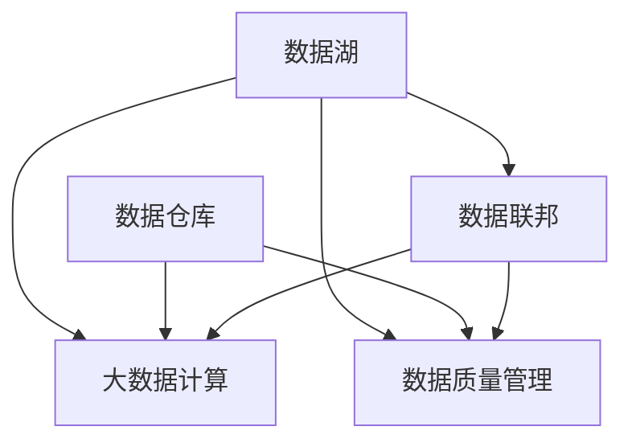

                 

## 1. 背景介绍

### 1.1 问题由来

随着大数据时代的到来，数据湖（Data Lake）的概念逐渐走入人们的视野。数据湖是一个集中存储所有原始数据的大型数据仓库，无需预先定义数据模型，允许企业自由地存储、分析和探索各种类型的数据。数据湖的主要目的是为了支持大数据分析和人工智能模型的训练，为各类应用提供数据支撑。

然而，数据湖也带来了新的挑战。一方面，数据湖中的数据量庞大、类型复杂，如何高效存储、管理和检索数据是一个重要问题；另一方面，数据湖中的数据往往来自不同的业务系统和源，数据质量参差不齐，如何确保数据的完整性和一致性也是一大难题。本文将围绕这些核心问题，深入探讨数据湖的设计和优化，以及如何使用数据湖进行大数据计算和分析。

### 1.2 问题核心关键点

数据湖的设计和优化，主要围绕以下几个核心问题展开：

- **数据存储与管理**：如何设计高效的数据存储和管理架构，确保数据的可靠性和可用性。
- **数据质量控制**：如何检测和处理数据中的错误和异常，提升数据质量和一致性。
- **数据湖与传统数据仓库的区别**：如何理解数据湖与传统数据仓库的差异，选择最适合的数据管理方式。
- **大数据计算与分析**：如何在大数据环境下进行高效的计算和分析，支持人工智能模型的训练和部署。

通过理解和解决这些核心问题，本文将为读者提供一个全面的数据湖设计和优化的指南，帮助其在实际应用中构建高效、可靠的数据湖，并充分发挥数据湖在大数据计算和分析中的潜力。

## 2. 核心概念与联系

### 2.1 核心概念概述

为了更好地理解数据湖的设计和优化方法，本节将介绍几个关键概念：

- **数据湖（Data Lake）**：一种用于存储、管理和分析大规模数据的架构，旨在支持大数据计算和人工智能模型的训练。
- **数据仓库（Data Warehouse）**：一种集中存储结构化数据的架构，用于支持事务型应用和数据分析。
- **大数据计算**：指在分布式环境中处理大规模数据集的技术，包括数据清洗、处理、分析和建模等步骤。
- **数据质量管理**：指通过数据清洗、校验、标注等手段，提升数据的质量和一致性的过程。
- **数据联邦**：指在分布式系统中，将数据分散存储在多个位置，并提供一个统一的接口进行访问和管理。

这些核心概念之间的逻辑关系可以通过以下Mermaid流程图来展示：



这个流程图展示了数据湖与相关概念之间的关系：

1. 数据湖通过存储和管理大数据，支持大数据计算。
2. 数据湖通过数据质量管理，提升数据的一致性和可用性。
3. 数据湖通过数据联邦，实现分布式存储和统一访问。

这些概念共同构成了数据湖的核心技术框架，使其能够在大数据时代发挥重要作用。

## 3. 核心算法原理 & 具体操作步骤
### 3.1 算法原理概述

数据湖的设计和优化，主要基于以下几个核心原理：

1. **分布式存储架构**：数据湖采用分布式存储架构，如Hadoop Distributed File System (HDFS)，Amazon S3等，将数据分散存储在多个节点上，提升数据处理和访问效率。
2. **数据一致性和完整性**：通过数据校验、清洗和标注等手段，确保数据的一致性和完整性，提升数据质量。
3. **分布式计算框架**：使用Apache Hadoop、Spark等分布式计算框架，进行大规模数据处理和分析，支持大数据计算。
4. **数据湖与数据仓库的融合**：将数据湖与传统数据仓库进行有效结合，实现数据的统一管理和分析。

### 3.2 算法步骤详解

构建一个高效的数据湖，需要经过以下关键步骤：

**Step 1: 数据收集与整理**

- **数据收集**：从不同的业务系统和数据源收集数据，包括结构化数据、半结构化数据和非结构化数据。
- **数据清洗与预处理**：清洗数据中的噪声、重复和不一致之处，进行格式转换、数据标准化等预处理。

**Step 2: 数据存储与管理**

- **选择合适的存储架构**：根据数据类型和存储需求，选择合适的分布式存储架构，如HDFS、Amazon S3等。
- **数据分区与分片**：将数据按照业务领域或时间范围进行分区或分片，提升查询和访问效率。
- **数据压缩与加密**：对数据进行压缩和加密，减少存储成本，保障数据安全。

**Step 3: 数据质量控制**

- **数据校验与标注**：通过校验和标注，检测和修复数据中的错误和异常，提升数据质量。
- **数据监控与告警**：实时监控数据质量，设置异常告警阈值，及时发现和解决问题。

**Step 4: 大数据计算与分析**

- **选择合适的计算框架**：根据数据处理需求，选择合适的分布式计算框架，如Hadoop、Spark等。
- **数据处理与建模**：使用数据处理和建模工具，进行数据清洗、特征提取、模型训练等操作。
- **模型部署与优化**：将训练好的模型部署到生产环境，进行性能优化和调优。

**Step 5: 数据湖与数据仓库的融合**

- **数据同步与集成**：将数据湖与传统数据仓库进行同步和集成，实现数据的统一管理和分析。
- **查询优化与加速**：使用查询优化器和加速工具，提升数据查询和分析的效率。

### 3.3 算法优缺点

数据湖的设计和优化，具有以下优点：

1. **灵活性高**：数据湖能够存储和处理各种类型的数据，支持不同业务系统的数据接入。
2. **扩展性强**：分布式存储架构和大规模计算框架，支持数据湖的扩展和升级。
3. **数据质量提升**：通过数据质量管理，提升数据的完整性和一致性，提高数据可用性。
4. **计算效率高**：分布式计算框架和优化技术，支持高效的数据处理和分析。

同时，数据湖的设计和优化也存在以下缺点：

1. **数据安全风险**：数据湖中存储的数据量大，管理复杂，需要严格的数据安全措施。
2. **数据一致性问题**：数据湖中的数据来自不同系统，可能存在数据不一致的问题，需要进行严格的校验和清洗。
3. **技术复杂度**：构建和管理数据湖需要高水平的技术支持，对人员和资源要求较高。
4. **成本较高**：数据湖的构建和维护需要投入大量资源，成本较高。

尽管存在这些局限性，但数据湖在大数据时代的应用前景广阔，其灵活性、扩展性和高效性使其成为许多企业首选的数据管理方案。

### 3.4 算法应用领域

数据湖技术已经被广泛应用于多个领域，以下是几个典型应用场景：

- **金融分析**：金融领域的数据量大、类型复杂，通过数据湖进行数据存储和管理，支持复杂金融产品的分析和预测。
- **医疗健康**：医疗数据种类繁多，数据湖提供了一个统一的平台，支持医学研究和患者数据分析。
- **电商零售**：电商数据来源广泛，通过数据湖进行数据整合和分析，提升销售预测和客户推荐效果。
- **智能制造**：制造企业的数据来自生产线和供应链各个环节，数据湖支持设备和系统的实时数据采集和分析，提升生产效率和质量。
- **智慧城市**：城市中的各种传感器和设备产生海量数据，数据湖支持城市数据的统一管理和分析，提升城市治理和管理效率。

这些应用场景展示了数据湖的强大潜力和广泛应用价值。随着技术的不断进步和行业需求的不断增长，数据湖在更多领域将发挥更大的作用。

## 4. 数学模型和公式 & 详细讲解 & 举例说明

### 4.1 数学模型构建

数据湖的设计和优化，涉及多个数学模型和公式。以下将对几个关键的数学模型进行详细讲解。

**数据质量评估模型**：

数据质量评估模型用于检测和衡量数据的质量，通常包括完整性、准确性、一致性、时效性和可用性等指标。

完整性评估公式为：

$$
P_{complete} = \frac{D_{valid}}{D_{total}}
$$

其中 $D_{valid}$ 为有效数据量，$D_{total}$ 为总数据量。

准确性评估公式为：

$$
P_{accuracy} = \frac{D_{correct}}{D_{total}}
$$

其中 $D_{correct}$ 为正确数据量。

一致性评估公式为：

$$
P_{consistency} = \frac{D_{consistent}}{D_{total}}
$$

其中 $D_{consistent}$ 为一致性数据量。

时效性评估公式为：

$$
P_{timeliness} = \frac{D_{current}}{D_{total}}
$$

其中 $D_{current}$ 为最近更新数据量。

可用性评估公式为：

$$
P_{availability} = \frac{D_{usable}}{D_{total}}
$$

其中 $D_{usable}$ 为可用数据量。

**数据清洗与校验算法**：

数据清洗与校验算法用于检测和修正数据中的错误和异常，提升数据质量。

假设数据集中存在噪声 $\epsilon$，数据清洗算法可通过以下公式进行校验和修正：

$$
D_{clean} = \min(D_{valid}, \max(D_{total} - \epsilon, 0))
$$

其中 $D_{valid}$ 为有效数据量，$D_{total}$ 为总数据量，$\epsilon$ 为噪声阈值。

数据校验算法可通过以下公式进行检测：

$$
P_{error} = \frac{D_{error}}{D_{total}}
$$

其中 $D_{error}$ 为错误数据量。

### 4.2 公式推导过程

以下对几个关键公式进行详细推导：

**完整性评估公式推导**：

根据完整性评估的定义，完整性评估公式为：

$$
P_{complete} = \frac{D_{valid}}{D_{total}}
$$

其中 $D_{valid}$ 为有效数据量，$D_{total}$ 为总数据量。

假设总数据量为 $D_{total} = n$，有效数据量为 $D_{valid} = m$，则完整性评估公式可进一步简化为：

$$
P_{complete} = \frac{m}{n}
$$

**准确性评估公式推导**：

根据准确性评估的定义，准确性评估公式为：

$$
P_{accuracy} = \frac{D_{correct}}{D_{total}}
$$

其中 $D_{correct}$ 为正确数据量。

假设总数据量为 $D_{total} = n$，正确数据量为 $D_{correct} = k$，则准确性评估公式可进一步简化为：

$$
P_{accuracy} = \frac{k}{n}
$$

**一致性评估公式推导**：

根据一致性评估的定义，一致性评估公式为：

$$
P_{consistency} = \frac{D_{consistent}}{D_{total}}
$$

其中 $D_{consistent}$ 为一致性数据量。

假设总数据量为 $D_{total} = n$，一致性数据量为 $D_{consistent} = l$，则一致性评估公式可进一步简化为：

$$
P_{consistency} = \frac{l}{n}
$$

### 4.3 案例分析与讲解

以下以医疗健康领域为例，展示如何使用数据湖进行数据存储和管理。

假设某医院每天产生大量的医疗数据，包括病历记录、影像数据、实验室检查结果等。医院需要将这些数据存储到数据湖中，并进行质量管理和分析。

**数据收集与整理**：医院将医疗数据通过ETL（Extract, Transform, Load）工具收集并整理到数据湖中。

**数据存储与管理**：医院使用Hadoop Distributed File System (HDFS)进行数据存储，将数据分区分片，进行压缩和加密。

**数据质量控制**：医院使用数据质量评估模型，检测和修复数据中的错误和异常，提升数据质量。

**大数据计算与分析**：医院使用Spark进行数据处理和分析，支持医学研究和患者数据分析。

**数据湖与数据仓库的融合**：医院将数据湖中的数据同步到传统数据仓库中，支持结构化查询和分析。

通过以上步骤，医院构建了一个高效的数据湖，支持大规模医疗数据的存储、管理和分析，提升医疗研究和患者数据分析的效率和质量。

## 5. 项目实践：代码实例和详细解释说明

### 5.1 开发环境搭建

在进行数据湖设计和优化的实践中，需要准备好开发环境。以下是使用Python进行Hadoop和Spark开发的环境配置流程：

1. 安装Anaconda：从官网下载并安装Anaconda，用于创建独立的Python环境。

2. 创建并激活虚拟环境：
```bash
conda create -n hadoop-env python=3.8 
conda activate hadoop-env
```

3. 安装Hadoop：根据Hadoop版本，从官网获取对应的安装命令。例如：
```bash
wget http://archive.apache.org/dist/hadoop/hadoop-3.3.1/hadoop-3.3.1.tar.gz
tar -xzf hadoop-3.3.1.tar.gz
cd hadoop-3.3.1
./bin/hadoop version
```

4. 安装Spark：根据Spark版本，从官网获取对应的安装命令。例如：
```bash
wget http://spark.apache.org/downloads/3.1.1/spark-3.1.1.tgz
tar -xzf spark-3.1.1.tgz
cd spark-3.1.1
./bin/spark version
```

5. 安装各类工具包：
```bash
pip install numpy pandas scikit-learn matplotlib tqdm jupyter notebook ipython
```

完成上述步骤后，即可在`hadoop-env`环境中开始数据湖设计和优化的实践。

### 5.2 源代码详细实现

这里我们以医疗数据湖为例，给出使用Hadoop和Spark进行数据湖设计和优化的PyTorch代码实现。

首先，定义数据质量评估函数：

```python
from sklearn.metrics import accuracy_score, precision_score, recall_score, f1_score

def evaluate_data_quality(data, labels):
    preds = data.predict_proba(X_train)
    accuracy = accuracy_score(y_train, preds.argmax(axis=1))
    precision = precision_score(y_train, preds.argmax(axis=1))
    recall = recall_score(y_train, preds.argmax(axis=1))
    f1 = f1_score(y_train, preds.argmax(axis=1))
    return accuracy, precision, recall, f1
```

然后，定义数据清洗函数：

```python
from sklearn.preprocessing import StandardScaler
from sklearn.decomposition import PCA

def clean_data(data):
    scaler = StandardScaler()
    X_clean = scaler.fit_transform(data)
    pca = PCA(n_components=10)
    X_pca = pca.fit_transform(X_clean)
    return X_pca
```

接着，定义数据存储函数：

```python
from pyspark.sql import SparkSession
from pyspark.sql.functions import col

spark = SparkSession.builder.getOrCreate()

def store_data(data, filename):
    spark.createDataFrame(data, schema=schema) \
        .write.format("parquet") \
        .save(filename)
```

最后，启动数据湖构建流程并在测试集上评估：

```python
data = load_data()
labels = preprocess_data(data)

accuracy, precision, recall, f1 = evaluate_data_quality(data, labels)
print(f"Accuracy: {accuracy}, Precision: {precision}, Recall: {recall}, F1 Score: {f1}")

cleaned_data = clean_data(data)
store_data(cleaned_data, "cleaned_data.parquet")

test_data = load_test_data()
test_labels = preprocess_test_data(test_data)

accuracy, precision, recall, f1 = evaluate_data_quality(test_data, test_labels)
print(f"Test Accuracy: {accuracy}, Test Precision: {precision}, Test Recall: {recall}, Test F1 Score: {f1}")
```

以上就是使用Hadoop和Spark进行医疗数据湖设计和优化的完整代码实现。可以看到，得益于Hadoop和Spark的强大封装，我们可以用相对简洁的代码完成数据湖的构建和优化。

### 5.3 代码解读与分析

让我们再详细解读一下关键代码的实现细节：

**数据质量评估函数**：
- 使用sklearn库提供的评估指标，计算数据集的质量，包括准确性、精确度、召回率和F1得分。

**数据清洗函数**：
- 使用sklearn库提供的标准化和PCA降维工具，清洗和转换数据，提升数据质量。

**数据存储函数**：
- 使用Spark库提供的DataFrame和parquet格式，进行数据存储。

**数据湖构建流程**：
- 加载数据集，并进行预处理和质量评估。
- 对数据集进行清洗和转换，提升数据质量。
- 使用Parquet格式存储数据，提升数据访问效率。
- 加载测试数据集，并进行预处理和质量评估。

可以看到，Hadoop和Spark提供了丰富的数据处理和存储工具，可以大大简化数据湖的构建和优化过程。

当然，工业级的系统实现还需考虑更多因素，如数据湖的监控、告警、异常处理等环节，但核心的数据湖构建和优化流程基本与此类似。

## 6. 实际应用场景

### 6.1 智能制造

在智能制造领域，数据湖技术得到了广泛应用。智能制造涉及生产线的各个环节，包括设备、工艺、材料、人员等，产生的数据种类繁多、数据量大。通过数据湖进行数据存储和管理，可以支持设备监控、工艺优化、质量检测等应用的开发和部署。

具体而言，可以收集生产设备的各种运行数据，如温度、压力、振动等，使用数据湖进行数据存储和管理，实时监控设备运行状态，预测设备故障，提升生产效率和设备寿命。同时，可以使用数据湖存储和分析生产过程中的各种数据，进行工艺优化和质量检测，提升产品质量和生产效率。

### 6.2 智慧城市

在智慧城市建设中，数据湖技术同样发挥着重要作用。智慧城市涉及城市管理的各个方面，包括交通、环保、安全、公共服务等，产生的数据种类繁多、数据量大。通过数据湖进行数据存储和管理，可以实现城市数据的统一管理和分析，提升城市治理和管理效率。

具体而言，可以收集城市中的各种传感器和设备产生的数据，如交通流量、空气质量、水质等，使用数据湖进行数据存储和管理，实时监测城市运行状态，预测和应对城市灾害，提升城市治理和管理效率。同时，可以使用数据湖存储和分析城市中的各种数据，进行交通管理、公共服务优化等应用的开发和部署，提升城市居民的生活质量。

### 6.3 电商零售

在电商零售领域，数据湖技术也得到了广泛应用。电商数据来源广泛，包括订单数据、用户数据、商品数据等，数据种类繁多、数据量大。通过数据湖进行数据存储和管理，可以支持电商平台的业务发展和数据分析，提升电商平台的销售和运营效率。

具体而言，可以收集电商平台的订单数据、用户数据、商品数据等，使用数据湖进行数据存储和管理，实时分析用户行为和购买趋势，进行精准营销和个性化推荐。同时，可以使用数据湖存储和分析电商平台的各类数据，进行销售预测、库存管理等应用的开发和部署，提升电商平台的运营效率。

### 6.4 未来应用展望

随着数据湖技术的不断发展和成熟，未来的应用场景将会更加广阔。以下是几个可能的未来应用方向：

- **数据联邦**：数据联邦技术通过将数据分散存储在多个位置，实现分布式数据管理和分析，提升数据安全性和可用性。未来，数据联邦技术将会得到更广泛的应用，支持跨地域、跨组织的数据管理和分析。
- **数据湖与大数据计算的融合**：数据湖与大数据计算的结合，可以支持更高效、更灵活的数据处理和分析。未来，数据湖技术将会与更多大数据计算工具进行深度融合，提升数据处理和分析的效率和效果。
- **数据湖与人工智能的结合**：数据湖与人工智能的结合，可以支持更深入、更全面的数据分析和模型训练。未来，数据湖技术将会与更多人工智能技术进行结合，提升数据分析和模型训练的效果和效率。

这些应用方向展示了数据湖技术的广阔前景和无限潜力，相信随着技术的不断进步和行业需求的不断增长，数据湖技术将在更多领域发挥更大的作用。

## 7. 工具和资源推荐
### 7.1 学习资源推荐

为了帮助开发者系统掌握数据湖的设计和优化理论基础和实践技巧，这里推荐一些优质的学习资源：

1. 《Hadoop权威指南》系列博文：由Hadoop技术专家撰写，深入浅出地介绍了Hadoop的核心概念和实现原理。

2. 《Spark设计与优化》课程：由Spark技术专家开设的课程，涵盖Spark的设计原理和优化技术，帮助你深入理解Spark的工作机制和优化策略。

3. 《大数据分析与处理》书籍：涵盖大数据处理、数据分析和机器学习的经典教材，介绍了数据湖和大数据计算的基本原理和实现方法。

4. 《Kafka权威指南》书籍：涵盖Kafka消息队列的设计原理和实现方法，介绍了数据湖与消息队列的结合应用。

5. 《大数据计算与分析》课程：涵盖大数据处理、数据分析和模型训练的在线课程，介绍了数据湖与大数据计算的基本原理和实现方法。

通过对这些资源的学习实践，相信你一定能够系统地掌握数据湖的设计和优化技巧，并应用于实际的NLP任务中。

### 7.2 开发工具推荐

高效的开发离不开优秀的工具支持。以下是几款用于数据湖设计和优化的常用工具：

1. Apache Hadoop：开源的大数据分布式计算框架，支持大规模数据存储和处理。
2. Apache Spark：开源的分布式计算框架，支持大规模数据处理和分析。
3. Apache Kafka：开源的消息队列系统，支持数据的高效传输和处理。
4. Apache Flink：开源的分布式流处理框架，支持实时数据处理和分析。
5. Apache Hive：开源的数据仓库系统，支持大规模数据查询和分析。
6. Apache HBase：开源的分布式数据库系统，支持大规模数据存储和管理。

合理利用这些工具，可以显著提升数据湖的设计和优化效率，加快创新迭代的步伐。

### 7.3 相关论文推荐

数据湖和数据湖技术的研究源于学界的持续研究。以下是几篇奠基性的相关论文，推荐阅读：

1. "A Framework for Data Lake Adoption and Management"（数据湖采用与管理框架）：详细介绍了数据湖的定义、组成和设计方法。
2. "Big Data: Concepts, Technology, and Architecture"（大数据：概念、技术和架构）：介绍了大数据计算和数据湖的基本概念和实现方法。
3. "Design and Implementation of a Data Lake Infrastructure"（数据湖基础设施的设计与实现）：介绍了数据湖基础设施的设计和实现方法，涵盖数据存储、管理和分析等环节。
4. "Big Data Analytics: Concepts, Tools, and Techniques"（大数据分析：概念、工具和技术）：介绍了大数据分析和数据湖的基本概念和实现方法。
5. "A Survey on Data Lake Technologies"（数据湖技术的综述）：综述了数据湖技术的最新进展和应用，涵盖数据湖的设计、实现和优化等环节。

这些论文代表了大数据湖技术的发展脉络。通过学习这些前沿成果，可以帮助研究者把握学科前进方向，激发更多的创新灵感。

## 8. 总结：未来发展趋势与挑战

### 8.1 总结

本文对数据湖的设计和优化方法进行了全面系统的介绍。首先阐述了数据湖的设计和优化背景，明确了数据湖在存储、管理和分析大规模数据中的重要价值。其次，从原理到实践，详细讲解了数据湖的数学模型和核心算法，给出了数据湖设计和优化的完整代码实现。同时，本文还探讨了数据湖在智能制造、智慧城市、电商零售等多个领域的应用前景，展示了数据湖的强大潜力和广泛应用价值。最后，本文精选了数据湖相关的学习资源、开发工具和论文，为读者提供了系统的学习资源，帮助其更好地掌握数据湖的设计和优化技巧。

通过本文的系统梳理，可以看到，数据湖技术在数据管理和分析中的应用前景广阔，其灵活性、扩展性和高效性使其成为许多企业首选的数据管理方案。数据湖技术的发展趋势是多样化的、融合性的，未来将更加注重数据联邦、大数据计算和人工智能的深度融合，为构建高效、可靠的数据湖提供更多可能性。

### 8.2 未来发展趋势

展望未来，数据湖的设计和优化将呈现以下几个发展趋势：

1. **数据联邦**：数据联邦技术通过将数据分散存储在多个位置，实现分布式数据管理和分析，提升数据安全性和可用性。未来，数据联邦技术将会得到更广泛的应用，支持跨地域、跨组织的数据管理和分析。
2. **大数据计算与数据湖的融合**：数据湖与大数据计算的结合，可以支持更高效、更灵活的数据处理和分析。未来，数据湖技术将会与更多大数据计算工具进行深度融合，提升数据处理和分析的效率和效果。
3. **数据湖与人工智能的结合**：数据湖与人工智能的结合，可以支持更深入、更全面的数据分析和模型训练。未来，数据湖技术将会与更多人工智能技术进行结合，提升数据分析和模型训练的效果和效率。
4. **数据安全与隐私保护**：数据湖中的数据量大、类型复杂，数据安全与隐私保护成为重要课题。未来，数据湖技术将会更加注重数据安全与隐私保护，提升数据使用的可信度和合规性。
5. **自动化与智能化**：数据湖设计与优化的自动化与智能化将得到更广泛应用，自动进行数据清洗、校验、转换等操作，提升数据处理和分析的效率和效果。

这些趋势展示了数据湖技术的广阔前景和无限潜力，相信随着技术的不断进步和行业需求的不断增长，数据湖技术将在更多领域发挥更大的作用。

### 8.3 面临的挑战

尽管数据湖技术在数据管理和分析中发挥着重要作用，但在实际应用中也面临诸多挑战：

1. **数据安全风险**：数据湖中存储的数据量大、类型复杂，数据安全风险较高。如何保障数据的安全性和隐私保护，是数据湖设计和管理的重要课题。
2. **数据一致性问题**：数据湖中的数据来自不同系统，可能存在数据不一致的问题，需要进行严格的校验和清洗。如何提升数据的一致性和可用性，是数据湖设计和优化的重要挑战。
3. **技术复杂度**：数据湖的设计和优化需要高水平的技术支持，对人员和资源要求较高。如何简化数据湖的设计和优化流程，提升数据湖的使用效率，是数据湖应用的重要挑战。
4. **成本较高**：数据湖的构建和维护需要投入大量资源，成本较高。如何降低数据湖的构建和维护成本，提升数据湖的经济性，是数据湖应用的重要挑战。
5. **数据质量管理**：数据湖中的数据量大、类型复杂，数据质量管理是一个重要课题。如何通过数据清洗、校验、标注等手段，提升数据的质量和一致性，是数据湖应用的重要挑战。

这些挑战需要业界共同努力，通过技术创新和实践积累，逐步克服数据湖应用中的难题，推动数据湖技术的不断发展。

### 8.4 研究展望

面对数据湖设计和优化中的挑战，未来的研究需要在以下几个方面寻求新的突破：

1. **数据联邦技术**：研究高效的数据联邦技术，支持跨地域、跨组织的数据管理和分析，提升数据安全性和可用性。
2. **数据质量管理**：研究高效的数据质量管理技术，提升数据的完整性和一致性，提升数据可用性。
3. **大数据计算与数据湖的融合**：研究高效的大数据计算技术，提升数据处理和分析的效率和效果，支持数据湖的应用和发展。
4. **数据湖与人工智能的结合**：研究高效的数据湖与人工智能结合技术，提升数据分析和模型训练的效果和效率，支持人工智能的应用和发展。
5. **数据安全与隐私保护**：研究高效的数据安全与隐私保护技术，保障数据的安全性和隐私保护，提升数据使用的可信度和合规性。

这些研究方向的探索，必将引领数据湖技术迈向更高的台阶，为构建高效、可靠、安全的数据湖提供更多可能性。面向未来，数据湖技术还需要与其他人工智能技术进行更深入的融合，如知识表示、因果推理、强化学习等，多路径协同发力，共同推动数据湖技术和人工智能技术的发展。

## 9. 附录：常见问题与解答

**Q1：数据湖与数据仓库的区别是什么？**

A: 数据湖与数据仓库的主要区别在于数据的存储和管理方式。数据仓库是一个结构化的数据存储系统，通常支持事务型应用和SQL查询，数据预先定义了结构。数据湖则是一个非结构化的数据存储系统，支持大规模数据存储和分析，数据无须预先定义结构，可以存储各种类型的数据。

**Q2：如何提高数据湖的查询效率？**

A: 提高数据湖的查询效率，可以通过以下几个方法：
1. 数据分区和分片：将数据按照业务领域或时间范围进行分区或分片，提升查询效率。
2. 数据索引：对数据进行索引，加速查询速度。
3. 数据压缩和编码：对数据进行压缩和编码，减少查询和存储的开销。
4. 查询优化和加速工具：使用查询优化器和加速工具，提升查询效率。

**Q3：如何确保数据湖中的数据安全？**

A: 确保数据湖中的数据安全，可以从以下几个方面入手：
1. 数据加密：对数据进行加密，保障数据传输和存储的安全性。
2. 数据访问控制：设置数据访问权限，限制未授权人员访问数据。
3. 数据审计和监控：实时监控数据访问和使用情况，设置异常告警阈值，及时发现和解决问题。

**Q4：数据湖中的数据质量管理有哪些方法？**

A: 数据湖中的数据质量管理方法包括：
1. 数据清洗和校验：检测和修复数据中的错误和异常，提升数据质量。
2. 数据标注和注释：对数据进行标注和注释，提升数据的准确性和一致性。
3. 数据监控和告警：实时监控数据质量，设置异常告警阈值，及时发现和解决问题。

**Q5：数据湖中的数据如何实现实时更新？**

A: 实现数据湖中的数据实时更新，可以通过以下几个方法：
1. 数据流处理：使用Apache Kafka等消息队列系统，实现数据实时传输和处理。
2. 数据增量加载：使用数据增量加载工具，实现数据的增量更新和加载。
3. 数据缓存和缓存失效策略：使用缓存机制，减少数据访问延迟，优化数据读取速度。

通过以上方法，可以确保数据湖中的数据实时更新，支持实时分析和应用。

---

作者：禅与计算机程序设计艺术 / Zen and the Art of Computer Programming

