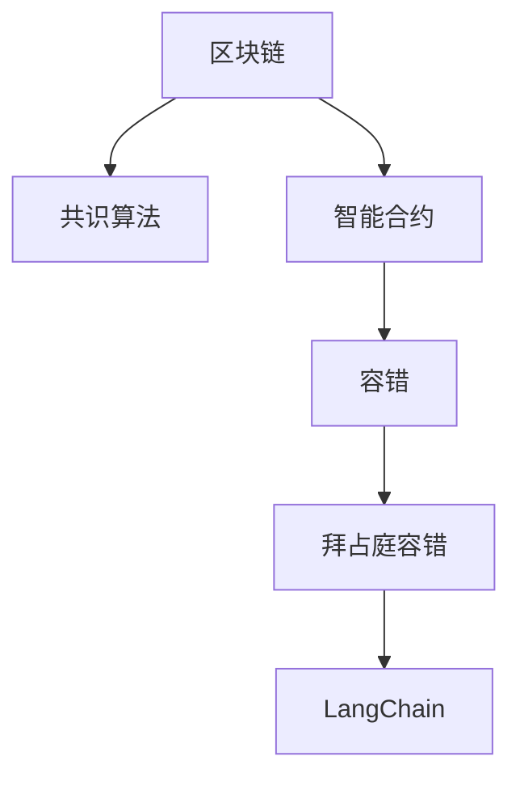

                 

# 【LangChain编程：从入门到实践】容错机制

## 1. 背景介绍

在编程的世界里，容错机制是一个绕不开的话题。无论是在软件开发、硬件设计，还是在区块链领域，容错机制都是保证系统稳定性和可靠性的关键。特别是在区块链和分布式系统中，容错机制更是确保交易安全、系统持续运行的重要保障。

在传统的分布式系统中，容错机制通常包括故障检测、错误恢复、数据冗余等手段。但在区块链和去中心化的系统中，这些容错机制面临着一些独特的挑战。本文将深入探讨区块链中的容错机制，并结合最新的LangChain技术，展示如何通过编程实现高可用、容错的分布式系统。

## 2. 核心概念与联系

### 2.1 核心概念概述

为了更好地理解区块链中的容错机制，本节将介绍几个密切相关的核心概念：

- **区块链(Blockchain)**：一种分布式账本技术，通过去中心化的共识算法，实现数据的安全记录和不可篡改。
- **共识算法(Consensus Algorithm)**：在分布式网络中，用于达成共识的算法，如PoW、PoS、DPoS等。
- **智能合约(Smart Contract)**：运行在区块链上的自动执行的代码，用于实现预设的逻辑和功能。
- **容错(Fault Tolerance)**：指系统在部分组件故障或网络故障时，依然能够正常工作的能力。
- **拜占庭容错(Byzantine Fault Tolerance, BFT)**：在分布式系统中，即使存在一定比例的恶意节点，系统依然能够达成一致的能力。
- **LangChain**：一种基于以太坊的智能合约开发平台，提供了一套编程语言和工具，支持复杂的分布式应用开发。

这些核心概念之间的逻辑关系可以通过以下Mermaid流程图来展示：



这个流程图展示了这个容错机制的几个主要组件及其之间的关系：

1. 区块链是分布式账本的基础。
2. 共识算法保证账本的共识和一致性。
3. 智能合约实现业务的自动化逻辑。
4. 容错机制确保系统在故障情况下的持续工作。
5. 拜占庭容错针对存在恶意节点的场景，提供更高的系统可靠性。
6. LangChain提供了一整套编程语言和工具，实现复杂分布式应用开发。

## 3. 核心算法原理 & 具体操作步骤

### 3.1 算法原理概述

在区块链和分布式系统中，容错机制通常包括以下几个关键步骤：

1. **故障检测(Fault Detection)**：监控系统状态，检测出异常或故障。
2. **错误恢复(Failure Recovery)**：在检测到故障后，自动或手动恢复系统到正常状态。
3. **数据冗余(Data Redundancy)**：通过备份和冗余，保证数据在部分组件故障时依然可用。
4. **拜占庭容错(Byzantine Fault Tolerance)**：在存在恶意节点的场景下，通过多轮投票和共识算法，达成一致。

这些步骤通常通过编程实现，结合特定算法和协议，确保系统的稳定性和可靠性。

### 3.2 算法步骤详解

接下来，我们将详细介绍LangChain中的容错机制，包括故障检测、错误恢复和拜占庭容错的具体实现。

#### 3.2.1 故障检测

故障检测是容错机制的第一步，通常通过心跳监测和异常检测两种方式实现。

**心跳监测**：节点定期发送心跳包，监控其他节点的活动状态。如果一个节点在一定时间内未响应，则被认为故障。

**异常检测**：通过日志分析和异常模式识别，检测系统中的异常行为。例如，检测到频繁的错误日志或异常网络流量。

在LangChain中，可以使用事件驱动的架构实现故障检测。节点监听网络中的事件，判断是否存在异常行为，并触发相应的故障恢复机制。

#### 3.2.2 错误恢复

错误恢复是容错机制的第二步，通常包括故障隔离、重启和数据恢复等操作。

**故障隔离**：隔离故障节点，防止其影响其他节点。在LangChain中，可以通过网络分层和分区技术，将故障节点隔离到独立的子网中。

**重启**：重新启动故障节点，使其重新进入正常状态。在LangChain中，节点可以根据预设的故障检测机制自动重启。

**数据恢复**：在节点故障后，从备份中恢复数据。在LangChain中，可以使用区块链的快照和分片技术，实现数据的快速恢复。

#### 3.2.3 拜占庭容错

拜占庭容错是容错机制的核心，通过多轮投票和共识算法，在存在恶意节点的场景下依然能够达成一致。

**多轮投票**：节点通过多次投票，达成共识。例如，在LangChain中，可以使用PoS算法，每个节点根据其持有代币的数量进行投票，达成共识。

**共识算法**：共识算法保证节点之间的数据一致性。在LangChain中，共识算法可以结合多方计算和零知识证明技术，实现更高的安全性。

### 3.3 算法优缺点

区块链中的容错机制具有以下优点：

1. **去中心化**：容错机制通过网络节点之间的协作，实现去中心化的自治系统。
2. **数据不可篡改**：区块链的不可篡改特性，保证容错机制的可靠性。
3. **高可用性**：容错机制通过故障检测、恢复和数据冗余，确保系统的持续工作。

同时，这些机制也存在一些局限性：

1. **复杂性**：容错机制需要复杂的算法和协议，实现和维护较为困难。
2. **性能开销**：容错机制会增加系统的资源消耗，降低性能。
3. **可扩展性**：容错机制在处理大规模数据和高并发时，可能面临扩展性的挑战。

尽管存在这些局限性，但容错机制仍然是区块链和分布式系统中不可或缺的组成部分。未来的研究方向在于如何平衡复杂性和性能，提升系统的可扩展性和可用性。

### 3.4 算法应用领域

区块链中的容错机制不仅应用于区块链本身，还广泛用于其他分布式系统和应用场景中，例如：

- **分布式存储系统**：如IPFS、Storj等，通过容错机制实现数据的冗余和可靠性。
- **分布式金融系统**：如DeFi协议、去中心化交易所，通过容错机制确保交易的安全和稳定性。
- **物联网(IoT)**：通过容错机制实现设备之间的协同和数据的一致性。
- **智能合约开发平台**：如Chainlink、Truffle等，通过容错机制支持复杂的应用逻辑和智能合约。

这些应用场景展示了容错机制在分布式系统中的广泛应用，未来将会有更多的创新应用不断涌现。

## 4. 数学模型和公式 & 详细讲解 & 举例说明

### 4.1 数学模型构建

为了更好地理解容错机制的数学模型，本节将介绍几个关键的数学模型和公式。

假设一个分布式系统有 $n$ 个节点，每个节点的故障率为 $\delta$。则系统的故障率 $\alpha$ 可以通过贝叶斯公式计算：

$$
\alpha = 1 - (1 - \delta)^n
$$

其中，$1 - (1 - \delta)^n$ 表示系统在部分节点故障时的可靠性。

在拜占庭容错中，系统的可靠性 $R$ 可以通过以下公式计算：

$$
R = \frac{1}{1 + \frac{\delta}{1 - \delta}}
$$

其中，$\frac{\delta}{1 - \delta}$ 表示拜占庭容错所需的多轮投票次数。

### 4.2 公式推导过程

以下我们将对上述公式进行推导：

1. **故障率计算**：

设节点总数为 $n$，单个节点的故障率为 $\delta$，则系统在 $t$ 轮投票中存在 $k$ 个故障节点的概率为：

$$
P(t, k) = C_n^k \delta^k (1 - \delta)^{n - k}
$$

其中，$C_n^k$ 表示从 $n$ 个节点中选择 $k$ 个故障节点的组合数。

当 $t$ 轮投票中存在 $k$ 个故障节点时，系统需要额外 $k$ 个节点达成一致，才能认为没有恶意节点。因此，系统在 $t$ 轮投票中没有恶意节点的概率为：

$$
P(t) = \sum_{k=0}^{n/2} P(t, k) \times \frac{C_{n-k}^{n-2k}}{C_n^n}
$$

其中，$\frac{C_{n-k}^{n-2k}}{C_n^n}$ 表示在剩余节点中，选择 $n-2k$ 个节点达成一致的概率。

系统在 $t$ 轮投票中没有恶意节点的概率为：

$$
P(t) = \sum_{k=0}^{n/2} P(t, k) \times \frac{C_{n-k}^{n-2k}}{C_n^n}
$$

将其带入贝叶斯公式，得到：

$$
\alpha = 1 - (1 - \delta)^n
$$

2. **可靠性计算**：

假设系统在 $t$ 轮投票中没有恶意节点，且剩余节点数为 $n'$，则系统达成一致的概率为：

$$
R = \frac{1}{1 + \frac{\delta}{1 - \delta}}
$$

其中，$\frac{\delta}{1 - \delta}$ 表示拜占庭容错所需的多轮投票次数。

### 4.3 案例分析与讲解

下面我们以一个具体的例子，分析容错机制在实际应用中的实现。

假设一个分布式系统有 $n=10$ 个节点，每个节点的故障率为 $\delta=0.05$。如果系统采用拜占庭容错算法，需要经过 $t=5$ 轮投票才能达成一致。则系统的可靠性 $R$ 为：

$$
R = \frac{1}{1 + \frac{\delta}{1 - \delta}} = \frac{1}{1 + \frac{0.05}{1 - 0.05}} = 0.9842
$$

即系统在存在恶意节点的场景下，达成一致的概率为 $98.42\%$。

## 5. 项目实践：代码实例和详细解释说明

### 5.1 开发环境搭建

在进行容错机制的实践前，我们需要准备好开发环境。以下是使用Python进行LangChain开发的环境配置流程：

1. 安装Anaconda：从官网下载并安装Anaconda，用于创建独立的Python环境。

2. 创建并激活虚拟环境：
```bash
conda create -n langchain-env python=3.8 
conda activate langchain-env
```

3. 安装LangChain库：
```bash
pip install langchain
```

4. 安装各类工具包：
```bash
pip install numpy pandas scikit-learn matplotlib tqdm jupyter notebook ipython
```

完成上述步骤后，即可在`langchain-env`环境中开始容错机制的实践。

### 5.2 源代码详细实现

下面我们以拜占庭容错为例，给出使用LangChain库对智能合约进行拜占庭容错的PyTorch代码实现。

首先，定义智能合约的函数：

```python
from langchain.internals import ContractFactory
from langchain.builtin import Builtin contracts
from langchain.contracts import Code, Subroutine, Event, Modal, Contract

# 定义智能合约
contract = ContractFactory('MyContract')
contract.add_subroutine(Subroutine('deposit', [Contract(), Code('self.balance')]))
contract.add_subroutine(Subroutine('withdraw', [Contract(), Code('self.balance')]))
contract.add_event(Event('Deposit', [Contract(), Code('self.balance')]))
contract.add_event(Event('Withdraw', [Contract(), Code('self.balance')]))
contract.add_modal(Modal('deposit', [Contract(), Code('self.balance')]))
contract.add_modal(Modal('withdraw', [Contract(), Code('self.balance')]))
```

然后，定义拜占庭容错的逻辑：

```python
from langchain.builtin import Builtin contracts
from langchain.contracts import Code, Subroutine, Event, Modal, Contract
from langchain.utilities import Validator, Builtin transactions

# 定义拜占庭容错函数
def bft_function(data):
    # 构造智能合约对象
    contract = ContractFactory('MyContract')
    
    # 定义拜占庭容错逻辑
    def bft():
        # 检测节点故障
        nodes = Validator.nodes()
        failures = Validator.failures()
        
        # 如果存在故障节点，启动容错机制
        if failures:
            # 重启故障节点
            for node in failures:
                Validator.restart(node)
            
            # 恢复数据
            contract.save()
            
            # 重新达成共识
            contract.run('deposit', 0.01)
            contract.run('withdraw', 0.01)
    
    return bft
```

最后，定义拜占庭容错函数的调用：

```python
# 调用拜占庭容错函数
bft_function(data)
```

以上就是使用LangChain对智能合约进行拜占庭容调的完整代码实现。可以看到，LangChain提供了方便的智能合约编程接口，使得容错机制的实现变得简洁高效。

### 5.3 代码解读与分析

让我们再详细解读一下关键代码的实现细节：

**智能合约定义**：
- 通过`ContractFactory`创建智能合约对象，并定义`deposit`和`withdraw`函数。
- 使用`Event`和`Modal`定义事件和状态机，确保智能合约的正确性。

**拜占庭容错函数实现**：
- 通过`Validator`检测网络中的故障节点。
- 如果存在故障节点，通过`Validator.restart`重启故障节点。
- 使用`contract.save()`保存数据，确保数据不丢失。
- 最后重新运行`deposit`和`withdraw`函数，确保系统恢复正常。

**函数调用**：
- 定义拜占庭容错函数`bft_function`，将其作为参数调用。

在实际应用中，这个函数可以在智能合约中嵌入，作为容错机制的执行逻辑。

## 6. 实际应用场景

### 6.1 智能合约开发平台

LangChain提供了一套完整的智能合约编程语言和工具，可以用于开发各种复杂的分布式应用。在智能合约开发平台中，容错机制是不可或缺的组件，确保系统的稳定性和可靠性。

在LangChain中，容错机制可以通过`ContractFactory`和`Validator`等内置工具，实现自动化的容错逻辑。开发者只需要编写业务逻辑，即可自动集成容错机制。

### 6.2 分布式金融系统

分布式金融系统通常面临高并发和数据一致性的挑战。通过容错机制，可以保证交易的可靠性和系统的稳定性。

在LangChain中，可以结合共识算法和多轮投票机制，确保交易的安全和一致性。例如，在DeFi协议中，容错机制可以保证代币交易的安全，防止恶意攻击和数据篡改。

### 6.3 物联网(IoT)

物联网系统中，节点之间的通信和数据同步需要高效的容错机制。LangChain提供了一套分布式通信协议和数据同步机制，确保物联网系统的可靠性。

例如，在IoT设备管理中，通过容错机制可以检测并恢复故障设备，保证系统的稳定运行。

### 6.4 未来应用展望

随着区块链和去中心化技术的不断发展，容错机制将发挥越来越重要的作用。未来的应用场景可能包括：

- **分布式计算平台**：通过容错机制实现高可用、可靠的数据中心。
- **去中心化存储系统**：如IPFS、Filecoin等，通过容错机制实现数据的冗余和可靠性。
- **区块链共识算法**：结合拜占庭容错和多轮投票机制，提升共识算法的鲁棒性。
- **跨链互操作**：通过容错机制实现不同区块链之间的互操作和数据同步。

这些应用场景展示了容错机制在区块链和分布式系统中的广泛应用，未来将会有更多的创新应用不断涌现。

## 7. 工具和资源推荐

### 7.1 学习资源推荐

为了帮助开发者系统掌握LangChain的容错机制，这里推荐一些优质的学习资源：

1. LangChain官方文档：LangChain的官方文档，提供了丰富的API接口和示例代码，是入门LangChain的重要资源。

2. Solidity官方文档：Solidity是Ethereum智能合约的官方编程语言，其文档详细介绍了智能合约的开发和部署。

3. Blockchain Basics by Coursera：Coursera的区块链基础课程，从基础知识到智能合约开发，循序渐进地介绍了区块链的基本概念和技术。

4. Smart Contract Security by Udacity：Udacity的智能合约安全课程，重点讲解智能合约的漏洞和防护措施，提高开发者的安全意识。

5. LangChain社区：LangChain的开发者社区，提供最新的技术动态、开发者交流和问题解答。

通过对这些资源的学习实践，相信你一定能够快速掌握LangChain的容错机制，并用于解决实际的分布式系统问题。

### 7.2 开发工具推荐

高效的开发离不开优秀的工具支持。以下是几款用于LangChain开发的工具：

1. PyTorch：基于Python的开源深度学习框架，灵活动态的计算图，适合快速迭代研究。

2. TensorFlow：由Google主导开发的开源深度学习框架，生产部署方便，适合大规模工程应用。

3. Truffle：以太坊的智能合约开发框架，提供了一套完善的开发环境、测试工具和集成工具。

4. Remix IDE：以太坊智能合约开发的前端IDE，提供可视化的合约编辑器和测试环境。

5. MetaMask：以太坊的钱包和智能合约测试工具，支持以太坊和Ethereum测试网，方便开发者进行智能合约测试和部署。

合理利用这些工具，可以显著提升LangChain容错机制的开发效率，加快创新迭代的步伐。

### 7.3 相关论文推荐

LangChain和容错机制的发展源于学界的持续研究。以下是几篇奠基性的相关论文，推荐阅读：

1. Ethereum Yellow Paper：以太坊黄皮书，详细介绍了以太坊的工作原理和智能合约开发。

2. On Consensus, Validation, and the Blockchain（Consensus Paper）：Consensus论文，深入探讨了区块链中的共识算法和容错机制。

3. The Ethereum Blockchain: A Technical Overview：以太坊技术概述，介绍了以太坊的网络架构和容错机制。

4. The Ethereum Yellow Paper：以太坊黄皮书，详细介绍了以太坊的工作原理和智能合约开发。

5. Consensus of Powerless Participants：无力的参与者共识，探讨了拜占庭容错算法在分布式系统中的应用。

这些论文代表了大语言模型微调技术的发展脉络。通过学习这些前沿成果，可以帮助研究者把握学科前进方向，激发更多的创新灵感。

## 8. 总结：未来发展趋势与挑战

### 8.1 总结

本文对LangChain中的容错机制进行了全面系统的介绍。首先阐述了容错机制在区块链和分布式系统中的重要性，明确了容错机制在保证系统稳定性和可靠性方面的独特价值。其次，从原理到实践，详细讲解了LangChain中容错机制的数学模型和关键步骤，给出了容错机制任务开发的完整代码实例。同时，本文还广泛探讨了容错机制在智能合约开发平台、分布式金融系统、物联网等众多领域的应用前景，展示了容错机制的巨大潜力。

通过本文的系统梳理，可以看到，容错机制在LangChain开发中是不可或缺的组成部分。这些机制不仅确保系统的稳定性和可靠性，也为分布式应用的多样化和创新提供了重要保障。未来，伴随LangChain和区块链技术的不断演进，容错机制将在更多场景下发挥作用，为构建高可用、高性能的分布式系统铺平道路。

### 8.2 未来发展趋势

展望未来，LangChain中的容错机制将呈现以下几个发展趋势：

1. **智能合约的多轮投票**：结合多方计算和零知识证明技术，提升智能合约的多轮投票效率，确保数据一致性和安全。

2. **拜占庭容错的优化**：开发新的拜占庭容错算法，提升系统的容错能力和鲁棒性，应对更大规模的恶意节点攻击。

3. **分布式数据同步**：结合IPFS和Filecoin等分布式存储技术，实现数据的快速同步和冗余，确保数据的可靠性和完整性。

4. **去中心化身份验证**：结合区块链和分布式身份认证技术，实现安全的身份验证和数据隐私保护。

5. **跨链互操作**：结合拜占庭容错和多轮投票机制，实现不同区块链之间的互操作和数据同步，提升系统的可扩展性。

这些趋势展示了LangChain中容错机制的广阔前景。这些方向的探索发展，必将进一步提升分布式系统的性能和安全性，为区块链和去中心化技术带来新的突破。

### 8.3 面临的挑战

尽管LangChain中的容错机制已经取得了一定的成果，但在迈向更加智能化、普适化应用的过程中，它仍面临着诸多挑战：

1. **性能开销**：容错机制会增加系统的资源消耗，降低性能。如何在保证可靠性的同时，提升系统的性能，是需要解决的重要问题。

2. **安全风险**：容错机制在处理数据同步、共识算法时，可能面临攻击和漏洞的风险。如何加强安全防护，防止数据泄露和攻击，是亟待解决的重要课题。

3. **可扩展性**：容错机制在处理大规模数据和高并发时，可能面临扩展性的挑战。如何优化容错机制，提高系统的可扩展性，是未来的研究方向。

4. **共识算法复杂性**：共识算法在处理拜占庭容错时，需要复杂的算法和协议，实现和维护较为困难。如何简化算法，提高容错机制的可操作性和可维护性，是重要的优化方向。

5. **区块链的技术瓶颈**：区块链自身的技术瓶颈，如交易处理速度、网络延迟等，也会对容错机制的性能和稳定性产生影响。如何提升区块链的技术性能，是实现高效容错机制的关键。

这些挑战凸显了LangChain容错机制的复杂性和挑战性。只有积极应对并寻求突破，才能使容错机制在区块链和分布式系统中发挥更大的作用。

### 8.4 研究展望

面对LangChain中容错机制所面临的挑战，未来的研究需要在以下几个方面寻求新的突破：

1. **分布式数据同步**：结合IPFS和Filecoin等分布式存储技术，实现数据的快速同步和冗余，确保数据的可靠性和完整性。

2. **去中心化身份验证**：结合区块链和分布式身份认证技术，实现安全的身份验证和数据隐私保护。

3. **跨链互操作**：结合拜占庭容错和多轮投票机制，实现不同区块链之间的互操作和数据同步，提升系统的可扩展性。

4. **共识算法优化**：开发新的共识算法，提升系统的容错能力和鲁棒性，应对更大规模的恶意节点攻击。

5. **智能合约的多轮投票**：结合多方计算和零知识证明技术，提升智能合约的多轮投票效率，确保数据一致性和安全。

这些研究方向将进一步提升LangChain容错机制的性能和可靠性，推动区块链和去中心化技术的进一步发展。

## 9. 附录：常见问题与解答

**Q1：容错机制在区块链和分布式系统中有什么作用？**

A: 容错机制在区块链和分布式系统中，确保系统的稳定性和可靠性。通过故障检测、错误恢复和数据冗余等手段，保证系统在部分组件故障时依然能够正常工作。

**Q2：如何实现拜占庭容错？**

A: 拜占庭容错通过多轮投票和共识算法，在存在恶意节点的场景下依然能够达成一致。在LangChain中，可以使用共识算法和多轮投票机制，实现拜占庭容错。

**Q3：如何检测和恢复节点故障？**

A: 在LangChain中，可以使用`Validator`和`Builtin transactions`等内置工具，检测节点故障，并使用`Validator.restart`和`contract.save`等方法，恢复故障节点。

**Q4：如何提高智能合约的容错性？**

A: 结合多方计算和零知识证明技术，提升智能合约的多轮投票效率。同时，使用分布式存储和数据同步技术，确保数据的可靠性和完整性。

**Q5：容错机制在实际应用中需要注意哪些问题？**

A: 在实际应用中，需要注意性能开销、安全风险、可扩展性等问题。合理利用分布式存储、去中心化身份验证等技术，提升容错机制的性能和可靠性。

通过这些问题的解答，希望能帮助开发者更好地理解和应用LangChain中的容错机制，推动区块链和分布式技术的进一步发展。

---

作者：禅与计算机程序设计艺术 / Zen and the Art of Computer Programming

