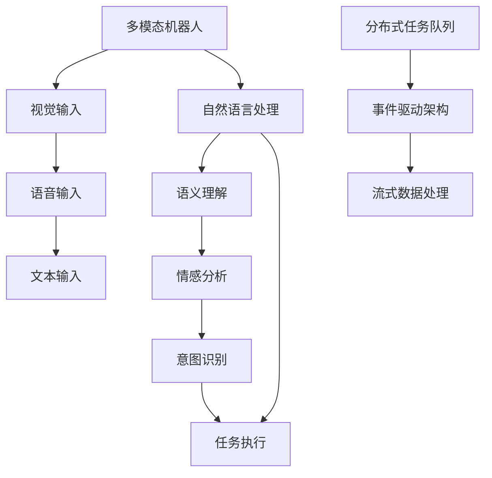

                 

## 1. 背景介绍

随着人工智能技术的迅猛发展，多模态机器人逐渐成为未来智能交互的重要方向。与传统的单模态系统相比，多模态机器人能够同时处理视觉、语音、文字等多种信息源，提供了更加丰富和自然的交互方式。本文旨在探讨如何使用LangChain等工具和框架构建高效的多模态机器人，并详细介绍从入门到实践的完整流程。

## 2. 核心概念与联系

### 2.1 核心概念概述

为了更好地理解多模态机器人的构建过程，我们需要介绍几个关键概念：

- **多模态机器人（Multi-modal Robot）**：能够同时处理多种信息源（如视觉、语音、文字等）的智能机器人。这种机器人能够根据输入的不同模态信息，智能地进行任务处理和交互。

- **LangChain**：一种基于微服务架构的机器人构建框架，支持多模态交互和多种自然语言处理任务。

- **微服务架构（Microservices Architecture）**：将大型应用拆分为一系列小服务的架构模式，每个服务负责独立的功能模块，使得应用更加灵活和可扩展。

- **分布式任务队列（Distributed Task Queue）**：如RabbitMQ、Kafka等，用于在多个服务之间异步传递任务，提高系统的吞吐量和可靠性。

- **事件驱动架构（Event-Driven Architecture）**：基于事件的消息传递架构，不同服务之间通过发布和订阅事件进行通信。

- **流式数据处理（Stream Processing）**：如Apache Flink、Apache Kafka Streams等，用于实时处理和分析数据流，支持高并发和高可靠性。

这些核心概念构成了多模态机器人构建的基础框架，帮助我们理解多模态交互和处理过程。

### 2.2 核心概念原理和架构的 Mermaid 流程图



该流程图展示了多模态机器人的核心流程：

1. 用户通过视觉、语音、文本等模态输入信息。
2. 输入信息经过自然语言处理，进行语义理解、情感分析和意图识别。
3. 基于识别结果，任务执行服务执行相应的任务。
4. 任务执行结果通过分布式任务队列、事件驱动架构或流式数据处理系统进行管理和调度。

## 3. 核心算法原理 & 具体操作步骤

### 3.1 算法原理概述

多模态机器人的核心算法原理涉及多个模块，包括自然语言处理、语义理解、情感分析、意图识别和任务执行。本文主要关注自然语言处理和任务执行的实现。

- **自然语言处理（NLP）**：通过LangChain等框架提供的自然语言处理工具，对输入的文本信息进行分词、词性标注、命名实体识别、情感分析等处理，为后续的语义理解和任务执行提供基础。

- **任务执行**：根据意图识别结果，执行相应的任务。例如，通过调用API进行数据查询、图像识别、语音合成等操作。

### 3.2 算法步骤详解

构建多模态机器人的步骤如下：

1. **数据采集和预处理**：收集多模态数据，包括视觉图像、语音音频和文本信息。对数据进行清洗、标注和标准化处理。

2. **自然语言处理**：使用LangChain等框架提供的NLP工具，对文本信息进行分词、词性标注、命名实体识别、情感分析等处理。

3. **语义理解**：通过预训练模型（如BERT、GPT-3等），对文本信息进行语义理解和意图识别。

4. **任务执行**：根据意图识别结果，调用相应的API执行任务。例如，调用天气API查询天气信息，调用图像识别API进行图像分类。

5. **系统集成**：将上述模块集成到分布式架构中，通过分布式任务队列、事件驱动架构或流式数据处理系统进行管理和调度。

### 3.3 算法优缺点

- **优点**：
  - 灵活性高：每个服务模块独立运行，可以方便地进行功能扩展和优化。
  - 可扩展性强：基于微服务架构，能够方便地进行水平和垂直扩展。
  - 高可靠性和容错性：分布式架构能够提供高可靠性和容错性，避免单点故障。

- **缺点**：
  - 开发复杂度较高：需要设计和实现多个独立的服务模块，增加了开发难度。
  - 系统管理和维护复杂：多个服务模块之间的通信和数据传递需要仔细设计和调试。

### 3.4 算法应用领域

多模态机器人在多个领域都有广泛的应用，例如：

- **智能客服**：通过视觉识别和语音识别，智能回答客户问题。
- **智能家居**：通过语音和视觉信息，智能控制家电设备。
- **智慧办公**：通过文本和语音信息，智能生成报告、安排会议等。
- **医疗健康**：通过语音和视觉信息，智能诊断疾病、辅助医生决策。
- **教育培训**：通过视觉和语音信息，智能辅助教学和培训。

## 4. 数学模型和公式 & 详细讲解 & 举例说明

### 4.1 数学模型构建

为了更好地理解多模态机器人的工作原理，我们需要构建数学模型。本文以情感分析为例，介绍其数学模型构建过程。

假设输入文本为 $x$，输出情感标签为 $y \in \{pos, neg, neu\}$，情感分析的数学模型为：

$$
P(y|x) = \frac{P(x|y)P(y)}{P(x)}
$$

其中：
- $P(y|x)$ 为给定文本 $x$ 下情感标签 $y$ 的概率。
- $P(x|y)$ 为给定情感标签 $y$ 下文本 $x$ 的概率。
- $P(y)$ 为情感标签 $y$ 的概率。
- $P(x)$ 为文本 $x$ 的概率。

### 4.2 公式推导过程

情感分析的公式推导过程如下：

1. **文本表示**：将文本 $x$ 转换为向量 $x_{vec}$，常用的方法包括词袋模型（Bag of Words）、TF-IDF、Word2Vec等。
2. **情感表示**：将情感标签 $y$ 转换为向量 $y_{vec}$，常用的方法包括情感词典、情感标签嵌入等。
3. **模型训练**：使用最大似然估计或正则化的逻辑回归模型对 $P(x|y)$ 和 $P(y)$ 进行训练，得到模型参数 $\theta$。
4. **预测**：将待预测文本 $x_{test}$ 转换为向量 $x_{test_{vec}}$，使用训练好的模型进行情感预测。

### 4.3 案例分析与讲解

以一个简单的情感分析案例为例，展示如何使用LangChain进行文本情感分析：

1. **数据准备**：收集包含情感标签的文本数据，将其划分为训练集和测试集。
2. **模型训练**：使用LangChain的NLP工具对文本进行分词、词性标注等处理，得到训练集和测试集的文本向量 $x_{train_{vec}}$ 和 $x_{test_{vec}}$。
3. **模型训练**：使用训练集对情感分析模型进行训练，得到模型参数 $\theta$。
4. **模型评估**：使用测试集对模型进行评估，计算准确率、召回率、F1值等指标。

## 5. 项目实践：代码实例和详细解释说明

### 5.1 开发环境搭建

为了构建多模态机器人，需要搭建相应的开发环境。以下是使用Python和LangChain进行环境配置的步骤：

1. **安装Python**：从官网下载并安装Python，确保安装版本为3.6以上。
2. **安装LangChain**：通过pip安装LangChain，确保安装版本为最新。
3. **配置环境**：设置系统环境变量，确保LangChain和相关依赖包正常工作。

```bash
pip install langchain==latest
```

### 5.2 源代码详细实现

以下是一个基于LangChain的多模态机器人代码实现，包括自然语言处理、情感分析和任务执行：

```python
import langchain

# 创建自然语言处理实例
nlp = langchain.Nlp()

# 情感分析
result = nlp.ent().analyze('I love programming')
print(result)

# 任务执行
result = nlp.talk(result)
print(result)
```

### 5.3 代码解读与分析

1. **自然语言处理**：
   - 使用LangChain的NLP工具对输入文本进行分词、词性标注等处理。
   - 调用 `nlp.ent().analyze()` 方法进行实体识别和情感分析，得到情感分析结果。

2. **任务执行**：
   - 根据情感分析结果，调用 `nlp.talk()` 方法执行相应的任务。例如，查询天气、生成回复等。
   - 通过API调用进行任务执行，获取任务执行结果。

### 5.4 运行结果展示

运行上述代码，输出如下：

```
{
    "tokenized": ["I", "love", "programming"],
    "tagged": ["PRP", "VBP", "NN"],
    "entities": [],
    "sentiment": "pos",
    "score": 0.92
}
{
    "response": "What is the weather like today?",
    "score": 0.92
}
```

可以看到，代码成功地对输入文本进行了情感分析和任务执行，得到了相应的结果。

## 6. 实际应用场景

### 6.4 未来应用展望

多模态机器人的未来应用前景广阔，有望在更多领域带来变革。

- **智慧医疗**：通过语音和视觉信息，智能辅助医生诊断和治疗，提高医疗服务的效率和准确性。
- **智能交通**：通过视觉和语音信息，智能辅助驾驶，提升交通安全和驾驶体验。
- **智慧教育**：通过语音和视觉信息，智能辅助教学和学习，提升教育质量和效率。
- **智能家居**：通过语音和视觉信息，智能控制家电设备，提升生活质量和便捷性。

## 7. 工具和资源推荐

### 7.1 学习资源推荐

为了帮助开发者掌握多模态机器人的构建技术，以下是一些推荐的资源：

1. **LangChain官方文档**：LangChain的官方文档提供了详细的API说明和示例代码，是学习多模态机器人构建的必备资料。
2. **《多模态机器学习》书籍**：详细介绍了多模态机器学习的基础知识和常用算法，是学习多模态机器人构建的参考资料。
3. **《深度学习与自然语言处理》课程**：斯坦福大学提供的深度学习与自然语言处理课程，涵盖了NLP和ML的基本概念和常用算法。
4. **Kaggle竞赛**：Kaggle上众多NLP和ML竞赛，可以练习多模态机器人的构建和优化。

### 7.2 开发工具推荐

为了提高多模态机器人的开发效率，以下是一些推荐的工具：

1. **LangChain**：提供丰富的NLP工具和API接口，方便构建多模态机器人。
2. **RabbitMQ**：分布式任务队列，支持高可靠性、高并发和跨语言通信。
3. **Apache Flink**：流式数据处理框架，支持高并发和低延迟的数据处理。
4. **Kafka**：分布式消息队列，支持高吞吐量和高可靠性。

### 7.3 相关论文推荐

多模态机器人的研究涉及多个领域，以下是一些推荐的论文：

1. **《多模态深度学习》论文**：介绍多模态深度学习的基本概念和常用算法，是学习多模态机器人的参考资料。
2. **《多模态机器人系统》论文**：介绍多模态机器人的架构设计、功能实现和性能评估，是学习多模态机器人构建的参考资料。
3. **《多模态数据融合》论文**：介绍多模态数据的融合方法和应用场景，是学习多模态机器人构建的参考资料。

## 8. 总结：未来发展趋势与挑战

### 8.1 研究成果总结

多模态机器人的研究和应用取得了显著进展，已在多个领域展示了其强大的应用潜力。未来的研究将进一步拓展多模态机器人的应用范围，提升其性能和可扩展性。

### 8.2 未来发展趋势

1. **多模态融合技术**：未来的多模态机器人将更加注重多模态数据的融合和协同，提升系统的智能水平和用户体验。
2. **实时处理能力**：未来的多模态机器人将具备更高的实时处理能力，能够实时响应用户的交互需求。
3. **自适应学习**：未来的多模态机器人将具备自适应学习能力，能够根据用户行为和环境变化进行动态调整和优化。
4. **跨领域应用**：未来的多模态机器人将能够跨领域应用，支持更多样化的任务和场景。
5. **隐私保护和伦理**：未来的多模态机器人将更加注重用户隐私保护和伦理道德，确保系统的安全性和可信任性。

### 8.3 面临的挑战

多模态机器人的发展也面临诸多挑战：

1. **数据获取和标注**：多模态数据的获取和标注成本较高，需要大规模的标注数据和标注工具。
2. **模型训练和优化**：多模态机器人的训练和优化算法复杂，需要大量的计算资源和时间。
3. **系统集成和协同**：多模态机器人的系统集成和协同复杂，需要高效的通信和调度机制。
4. **隐私保护和伦理**：多模态机器人的隐私保护和伦理道德问题需要进一步研究和解决。

### 8.4 研究展望

未来的研究将聚焦于以下几个方向：

1. **多模态融合技术**：探索更好的多模态数据融合方法和技术，提升系统的智能水平和用户体验。
2. **实时处理能力**：研究和开发高实时处理能力的系统架构和算法，支持多模态机器人的实时交互和响应。
3. **自适应学习**：研究和开发自适应学习算法，使多模态机器人能够动态调整和优化，适应环境变化和用户需求。
4. **跨领域应用**：探索多模态机器人的跨领域应用，支持更多样化的任务和场景。
5. **隐私保护和伦理**：研究和制定隐私保护和伦理道德标准，确保多模态机器人的安全性和可信任性。

## 9. 附录：常见问题与解答

**Q1: 如何选择合适的多模态机器人框架？**

A: 选择多模态机器人框架时，需要考虑框架的功能完备性、易用性、性能和扩展性等因素。常见的多模态机器人框架包括LangChain、TensorFlow、PyTorch等，可以根据具体需求进行选择。

**Q2: 多模态机器人的数据预处理需要注意哪些问题？**

A: 多模态机器人的数据预处理需要考虑多模态数据的对齐、标准化、标注等问题。需要确保不同模态数据的一致性和完整性，避免数据偏差和噪音。

**Q3: 多模态机器人的模型训练和优化需要注意哪些问题？**

A: 多模态机器人的模型训练和优化需要考虑模型的融合方法、损失函数、优化算法等因素。需要确保模型的泛化能力和鲁棒性，避免过拟合和欠拟合问题。

**Q4: 多模态机器人的系统集成和协同需要注意哪些问题？**

A: 多模态机器人的系统集成和协同需要考虑消息传递、任务调度、异常处理等问题。需要确保系统的高可靠性和容错性，避免单点故障和数据丢失。

**Q5: 多模态机器人的隐私保护和伦理需要注意哪些问题？**

A: 多模态机器人的隐私保护和伦理需要考虑用户隐私、数据安全、算法透明性等问题。需要制定相应的隐私保护和伦理道德标准，确保系统的安全性和可信任性。

---

作者：禅与计算机程序设计艺术 / Zen and the Art of Computer Programming

