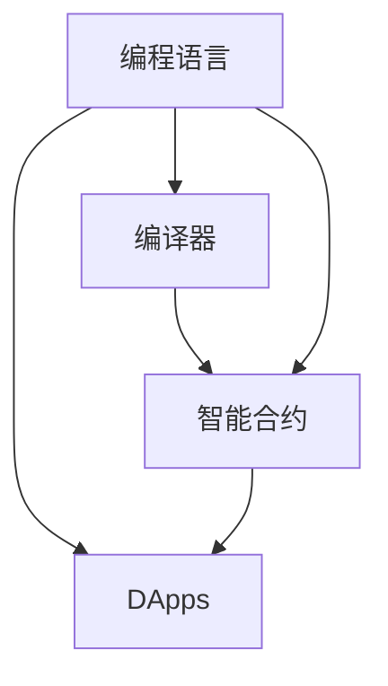

                 

## 1. 背景介绍

### 1.1 问题由来

随着人工智能（AI）技术的快速发展，区块链领域的编程范式也发生了根本性的转变。传统的基于中央权威的编程方式，正逐渐被去中心化、去信任的区块链编程所替代。在这个背景下，由Ethereum基金会推出的LangChain项目应运而生，旨在提供一种新的编程方式，以支持基于区块链的去中心化应用（DApps）的开发。

LangChain项目致力于通过语言和编译器技术，为开发者提供一种能够直接在区块链上编写、测试和部署智能合约的平台。这种编程方式不仅能够提高智能合约的安全性，还能够提升DApps的可扩展性和互操作性，从而推动区块链技术在更多行业中的应用。

### 1.2 问题核心关键点

LangChain项目的核心思想是通过一种新型的编程语言和编译器技术，实现在区块链上的去中心化编程。这包括以下几个关键点：

- **语言设计**：LangChain采用了类似于JavaScript的语法，便于开发者学习和使用。
- **编译器**：通过编译器技术，LangChain能够将源代码直接编译成区块链上的智能合约代码。
- **智能合约**：智能合约是直接在区块链上运行的代码，具有不可篡改和不可逆的特点。
- **DApps**：基于智能合约开发的去中心化应用，具有更高的安全性和可扩展性。

这些关键点构成了LangChain项目的技术架构基础，使得开发者能够使用一种全新的编程方式，实现在区块链上的智能合约开发和部署。

## 2. 核心概念与联系

### 2.1 核心概念概述

为了更好地理解LangChain项目，本节将介绍几个关键概念及其联系：

- **编程语言**：LangChain项目采用了类似于JavaScript的编程语言，用于编写智能合约代码。
- **编译器**：编译器将源代码转换为区块链上的智能合约代码。
- **智能合约**：直接运行在区块链上的代码，具有不可篡改和不可逆的特点。
- **DApps**：基于智能合约开发的去中心化应用，具有更高的安全性和可扩展性。

这些概念之间的逻辑关系可以通过以下Mermaid流程图来展示：



这个流程图展示了几类关键概念及其之间的关系：编程语言是编写智能合约代码的工具，编译器将源代码转换为智能合约代码，智能合约是直接在区块链上运行的代码，而DApps则是基于智能合约开发的去中心化应用。

## 3. 核心算法原理 & 具体操作步骤

### 3.1 算法原理概述

LangChain项目的核心算法原理主要体现在以下几个方面：

- **编程语言设计**：LangChain采用了类似于JavaScript的语法，便于开发者学习和使用。
- **编译器技术**：LangChain通过编译器技术，将源代码转换为区块链上的智能合约代码。
- **智能合约机制**：智能合约具有不可篡改和不可逆的特点，确保了DApps的安全性和可靠性。
- **DApps开发**：基于智能合约开发的去中心化应用，具有更高的安全性和可扩展性。

这些算法原理共同构成了LangChain项目的技术架构，使得开发者能够使用一种全新的编程方式，实现在区块链上的智能合约开发和部署。

### 3.2 算法步骤详解

LangChain项目的具体操作步骤如下：

1. **编写智能合约代码**：开发者使用类似于JavaScript的编程语言编写智能合约代码。
2. **编译智能合约**：通过编译器技术，将源代码转换为区块链上的智能合约代码。
3. **部署智能合约**：将编译后的智能合约代码部署到区块链上。
4. **开发DApps**：基于智能合约开发去中心化应用。
5. **测试和部署DApps**：在测试网络环境下测试DApps，确保其正确性和可靠性，然后将DApps部署到主网。

### 3.3 算法优缺点

LangChain项目的算法优点主要体现在以下几个方面：

- **安全性高**：智能合约具有不可篡改和不可逆的特点，确保了DApps的安全性和可靠性。
- **可扩展性强**：基于智能合约开发的去中心化应用，具有更高的可扩展性。
- **易于学习**：采用了类似于JavaScript的编程语言，便于开发者学习和使用。

同时，LangChain项目也存在一些缺点：

- **开发成本高**：需要掌握新的编程语言和编译器技术，对开发者的要求较高。
- **部署复杂**：将智能合约部署到区块链上需要较高的技术门槛。
- **更新难度大**：一旦智能合约部署到区块链上，修改难度较大。

### 3.4 算法应用领域

LangChain项目适用于各种去中心化应用（DApps）的开发，具体应用领域包括：

- **金融**：智能合约在金融领域的应用广泛，如DeFi、NFT等。
- **供应链**：区块链技术在供应链管理中的应用，可以提高供应链的透明度和可追溯性。
- **医疗**：基于智能合约的电子病历系统，可以提高医疗数据的共享和安全性。
- **政府**：智能合约在政府公共服务中的应用，可以提高政府的透明度和效率。

LangChain项目的应用领域非常广泛，涵盖了多个行业，有望在未来的数字化转型中发挥重要作用。

## 4. 数学模型和公式 & 详细讲解 & 举例说明

### 4.1 数学模型构建

LangChain项目中使用的数学模型主要涉及智能合约的编译和执行过程。智能合约的编译和执行过程通常包括以下步骤：

1. **源代码编译**：将源代码编译成中间代码。
2. **中间代码优化**：对中间代码进行优化，以提高执行效率。
3. **目标代码生成**：将优化后的中间代码生成目标代码，即区块链上的智能合约代码。

### 4.2 公式推导过程

智能合约的编译和执行过程涉及多个数学模型和公式。以智能合约的编译为例，假设有以下源代码：

```javascript
function transfer(_to, _value) {
    balances[_from] -= _value;
    balances[_to] += _value;
}
```

编译后的智能合约代码可能为：

```solidity
function transfer(uint256 _to, uint256 _value) {
    balances[_from] -= _value;
    balances[_to] += _value;
}
```

其中，`uint256` 是Solidity中的整数类型，`balances` 是智能合约中的变量。这个编译过程涉及多个数学模型和公式，如符号表达式的转换、数据类型的映射等。

### 4.3 案例分析与讲解

以下是一个简单的智能合约案例，用于演示LangChain项目的编译和执行过程：

**源代码**：

```javascript
function transfer(_to, _value) {
    balances[_from] -= _value;
    balances[_to] += _value;
}
```

**编译后的智能合约代码**：

```solidity
function transfer(uint256 _to, uint256 _value) {
    balances[_from] -= _value;
    balances[_to] += _value;
}
```

在这个案例中，源代码通过LangChain项目的编译器编译成智能合约代码。编译器在编译过程中，将JavaScript中的符号表达式转换为Solidity中的整数表达式，从而生成了可执行的智能合约代码。

## 5. 项目实践：代码实例和详细解释说明

### 5.1 开发环境搭建

在进行LangChain项目实践前，我们需要准备好开发环境。以下是使用Solidity进行LangChain开发的环境配置流程：

1. **安装Solidity编译器**：从官网下载并安装Solidity编译器。
2. **安装Truffle框架**：安装Truffle框架，用于自动化管理智能合约的部署和测试。
3. **搭建测试网络**：搭建测试网络，用于测试和部署智能合约。

完成上述步骤后，即可在测试网络环境下进行LangChain项目的实践。

### 5.2 源代码详细实现

以下是一个简单的智能合约案例，用于演示LangChain项目的源代码实现：

```solidity
pragma solidity ^0.8.0;

contract Transfer {
    address public owner;
    mapping(address => uint256) balances;

    constructor() public {
        owner = msg.sender;
    }

    function transfer(uint256 _to, uint256 _value) public {
        require(msg.sender != _to);
        balances[msg.sender] -= _value;
        balances[_to] += _value;
    }

    function getBalance(address _user) public view returns (uint256 balance) {
        return balances[_user];
    }
}
```

在这个案例中，智能合约实现了转账功能，用户可以向其他地址转账。智能合约的源代码包括构造函数和转账函数。

### 5.3 代码解读与分析

让我们再详细解读一下关键代码的实现细节：

**constructor函数**：
- 构造函数用于初始化智能合约的`owner`变量，并将调用者作为`owner`。
- `owner`变量用于记录智能合约的创建者。

**transfer函数**：
- `transfer`函数用于执行转账操作。
- 函数接收两个参数：`_to`和`_value`，分别表示转账目标地址和转账金额。
- 函数首先检查转账者和转账目标是否相同，以避免转账到自己。
- 如果转账者不是转账目标，则执行转账操作，更新`balances`映射。

**getBalance函数**：
- `getBalance`函数用于查询用户的余额。
- 函数接收一个参数`_user`，表示要查询余额的用户地址。
- 函数返回指定地址的余额。

**部署智能合约**：
- 使用Truffle框架，将编译后的智能合约代码部署到测试网络中。
- 在部署过程中，智能合约会自动生成一个地址，用于识别和调用智能合约。

**测试智能合约**：
- 在测试网络中，使用Truffle框架的测试工具，对智能合约进行测试。
- 通过调用`transfer`函数，可以模拟转账操作。
- 通过调用`getBalance`函数，可以查询用户的余额。

**部署智能合约到主网**：
- 将智能合约部署到主网之前，需要进行充分的测试，确保其正确性和可靠性。
- 在主网上，智能合约的地址是固定的，不能随意更改。
- 部署智能合约到主网需要较高的技术门槛，建议由经验丰富的开发者完成。

## 6. 实际应用场景

### 6.1 智能合约

基于LangChain项目的智能合约可以在多个领域得到应用，例如：

- **金融**：智能合约在金融领域的应用广泛，如DeFi、NFT等。通过智能合约，可以实现去中心化的金融服务，如借贷、众筹等。
- **供应链**：区块链技术在供应链管理中的应用，可以提高供应链的透明度和可追溯性。智能合约可以实现供应链上的自动化操作，如物流跟踪、货物认证等。
- **医疗**：基于智能合约的电子病历系统，可以提高医疗数据的共享和安全性。智能合约可以实现电子病历的自动化更新和查询。

### 6.2 去中心化应用（DApps）

基于LangChain项目的智能合约可以开发多种去中心化应用（DApps），具体应用场景包括：

- **金融应用**：如去中心化的交易所、借贷平台、保险等。
- **社交应用**：如去中心化的社交网络、聊天室等。
- **游戏应用**：如去中心化的游戏、NFT交易等。
- **身份认证**：如去中心化的身份认证系统、投票系统等。

这些DApps利用LangChain项目的智能合约技术，实现了去中心化的应用场景，提升了系统的安全性和可靠性。

### 6.3 未来应用展望

随着区块链技术的不断发展和成熟，LangChain项目在多个领域的应用前景广阔。未来，LangChain项目有望在以下几个方面取得突破：

- **跨链互操作性**：实现不同区块链之间的互操作性，支持多种区块链平台上的智能合约开发。
- **智能合约标准化**：推动智能合约的标准化，提高智能合约的可扩展性和互操作性。
- **智能合约审计**：提供智能合约的审计服务，确保智能合约的安全性和可靠性。
- **去中心化交易所（DEX）**：支持去中心化的交易所，提高交易的透明度和安全性。

这些应用场景的实现，将进一步推动LangChain项目的普及和应用，推动区块链技术在更多领域的应用。

## 7. 工具和资源推荐

### 7.1 学习资源推荐

为了帮助开发者系统掌握LangChain项目的理论和实践，这里推荐一些优质的学习资源：

1. **LangChain官方文档**：LangChain项目的官方文档，详细介绍了LangChain项目的功能和使用方法。
2. **Solidity官方文档**：Solidity编译器的官方文档，提供了Solidity语言的详细说明和示例。
3. **Truffle官方文档**：Truffle框架的官方文档，提供了Truffle框架的使用方法和示例。
4. **Ethereum开发者手册**：Ethereum基金会的开发者手册，提供了Ethereum平台的详细说明和示例。
5. **Solidity安全最佳实践**：Solidity安全团队发布的最佳实践文档，提供了智能合约开发的安全建议和示例。

通过对这些资源的学习实践，相信你一定能够快速掌握LangChain项目的精髓，并用于解决实际的智能合约开发问题。

### 7.2 开发工具推荐

LangChain项目的主要开发工具包括Solidity编译器和Truffle框架，以下是一些常用的开发工具：

1. **Visual Studio Code**：一款流行的代码编辑器，支持Solidity代码的编写和调试。
2. **Ganache**：一款测试网络工具，用于搭建和测试智能合约。
3. **Remix IDE**：一款基于Web的Solidity编辑器，支持智能合约的编写和调试。
4. **Truffle**：一款智能合约管理工具，用于自动化管理智能合约的部署和测试。
5. **MyEtherWallet**：一款以太钱包，用于管理以太币和智能合约地址。

这些工具可以帮助开发者更高效地进行智能合约开发和测试。

### 7.3 相关论文推荐

LangChain项目的研究方向涉及智能合约和区块链技术，以下是几篇奠基性的相关论文，推荐阅读：

1. **Ethereum Yellow Paper**：以太坊的白皮书，介绍了以太坊平台的原理和应用。
2. **Solidity Yellow Paper**：Solidity编译器的白皮书，介绍了Solidity语言的原理和应用。
3. **Smart Contract Security Patterns**：Solidity安全团队发布的智能合约安全模式文档，提供了智能合约开发的建议和示例。
4. **Decentralized Applications (DApps) in Blockchain**：关于区块链去中心化应用的文章，介绍了区块链平台上的应用场景和开发方法。
5. **Ethereum 2.0**：以太坊2.0的白皮书，介绍了以太坊2.0的原理和应用。

这些论文代表了智能合约和区块链技术的研究进展，对理解LangChain项目具有重要的参考价值。

## 8. 总结：未来发展趋势与挑战

### 8.1 总结

本文对LangChain项目的核心概念和操作步骤进行了全面系统的介绍。首先阐述了LangChain项目的背景和意义，明确了智能合约在区块链上的重要地位。其次，从原理到实践，详细讲解了LangChain项目的功能和使用方法，给出了智能合约的代码实现。同时，本文还广泛探讨了LangChain项目在多个领域的应用前景，展示了其广泛的应用潜力。此外，本文精选了LangChain项目的各类学习资源，力求为读者提供全方位的技术指引。

通过本文的系统梳理，可以看到，LangChain项目通过一种新型的编程语言和编译器技术，实现在区块链上的智能合约开发和部署。这种编程方式不仅提高了智能合约的安全性和可靠性，还提升了去中心化应用的可扩展性和互操作性，推动了区块链技术在更多领域的应用。

### 8.2 未来发展趋势

展望未来，LangChain项目的发展趋势主要体现在以下几个方面：

1. **跨链互操作性**：随着不同区块链平台的发展，实现跨链互操作性将成为LangChain项目的重要方向。通过跨链互操作性，可以实现不同区块链平台之间的互操作，提升智能合约的可扩展性和互操作性。
2. **智能合约标准化**：推动智能合约的标准化，提高智能合约的可扩展性和互操作性。标准化智能合约的格式和接口，将大大提高智能合约的开发效率和可维护性。
3. **智能合约审计**：提供智能合约的审计服务，确保智能合约的安全性和可靠性。智能合约审计服务可以帮助开发者发现智能合约中的漏洞和风险，提升智能合约的安全性。
4. **去中心化交易所（DEX）**：支持去中心化的交易所，提高交易的透明度和安全性。去中心化交易所将进一步推动区块链技术在金融领域的应用，提升交易的效率和安全性。

这些趋势凸显了LangChain项目的广阔前景。这些方向的探索发展，将进一步提升智能合约的开发效率和安全性能，推动区块链技术在更多领域的应用。

### 8.3 面临的挑战

尽管LangChain项目已经取得了一定的进展，但在迈向更加智能化、普适化应用的过程中，它仍面临着诸多挑战：

1. **开发门槛高**：智能合约开发需要掌握新的编程语言和编译器技术，对开发者的要求较高。
2. **安全问题多**：智能合约的安全问题复杂，容易受到攻击。智能合约的安全性保障需要不断提升。
3. **性能瓶颈多**：智能合约的性能瓶颈较多，需要优化。提升智能合约的性能，需要优化代码实现和优化算法。
4. **互操作性差**：不同区块链平台之间的互操作性较差，需要跨链互操作技术进行改进。
5. **标准化不足**：智能合约的标准化不足，需要推动标准化工作。标准化智能合约的格式和接口，将大大提高智能合约的开发效率和可维护性。

这些挑战需要开发者不断优化和改进，才能推动LangChain项目的发展和应用。

### 8.4 研究展望

面向未来，LangChain项目需要在以下几个方面进行深入研究：

1. **跨链互操作技术**：推动跨链互操作技术的发展，实现不同区块链平台之间的互操作。
2. **智能合约安全技术**：提升智能合约的安全性，减少智能合约被攻击的风险。
3. **智能合约性能优化**：优化智能合约的性能，提升智能合约的执行效率。
4. **智能合约标准化**：推动智能合约的标准化，提高智能合约的可扩展性和互操作性。
5. **去中心化交易所技术**：支持去中心化的交易所，提高交易的透明度和安全性。

这些研究方向将进一步推动LangChain项目的发展，推动区块链技术在更多领域的应用。

## 9. 附录：常见问题与解答

**Q1：LangChain项目适用于哪些智能合约？**

A: LangChain项目适用于各种类型的智能合约，包括DeFi、NFT、供应链、医疗等领域。不同类型的智能合约可以根据LangChain项目的编译器技术进行编写和部署。

**Q2：如何优化智能合约的性能？**

A: 优化智能合约的性能可以从以下几个方面入手：
1. 优化算法：改进智能合约中的算法，提升算法的效率。
2. 代码优化：优化智能合约的代码，减少不必要的计算和存储开销。
3. 并行计算：利用并行计算技术，提升智能合约的执行效率。
4. 状态优化：优化智能合约的状态存储，减少状态查询和存储的开销。

**Q3：LangChain项目是否支持多种区块链平台？**

A: LangChain项目目前主要支持以太坊平台，但不排除未来支持其他区块链平台的可能性。如果其他区块链平台支持Solidity语言，LangChain项目也有可能支持该平台上的智能合约开发。

**Q4：智能合约的安全问题如何解决？**

A: 智能合约的安全问题可以通过以下几种方式解决：
1. 审计：通过智能合约审计，发现智能合约中的漏洞和风险。
2. 安全测试：通过安全测试，发现智能合约中的漏洞和风险。
3. 安全规范：遵循智能合约的安全规范，减少智能合约的安全漏洞。
4. 安全工具：使用智能合约的安全工具，提升智能合约的安全性。

**Q5：如何提高智能合约的可扩展性？**

A: 提高智能合约的可扩展性可以从以下几个方面入手：
1. 模块化设计：将智能合约设计为模块化结构，便于扩展和维护。
2. 接口设计：设计好智能合约的接口，便于扩展和复用。
3. 插件机制：通过插件机制，实现智能合约的动态扩展。
4. 标准化：推动智能合约的标准化，提升智能合约的可扩展性和互操作性。

这些问题的解答，可以帮助开发者更好地理解LangChain项目，掌握智能合约开发和部署的最佳实践。

