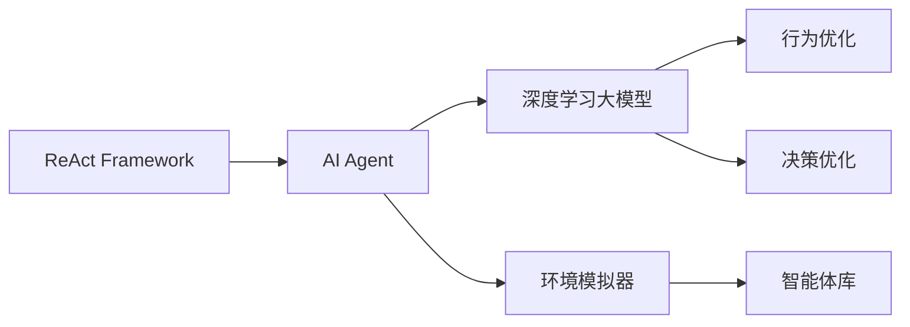

                 

# 【大模型应用开发 动手做AI Agent】复习ReAct框架

> 关键词：大模型应用, ReAct框架, AI Agent, 动手做, 技术栈, 开发流程, 实例代码

## 1. 背景介绍

在人工智能（AI）领域，大模型（Large Models）因其在大规模数据上训练得到的丰富知识，成为现代AI应用的核心动力。AI Agent作为一种能够在复杂环境中自主行动和决策的智能体，通过利用大模型进行行为和决策优化，在智能机器人、自动驾驶、游戏AI等多个领域展现了巨大的应用潜力。本文将深入复习基于ReAct框架构建AI Agent的开发流程，并通过一个具体的实例来展示动手做AI Agent的过程。

### 1.1 问题由来

随着深度学习技术的进步，大模型在图像、语音、自然语言处理（NLP）等领域取得了显著的成果。然而，这些模型通常在预训练后，需要根据具体任务进行微调（Fine-Tuning）或迁移学习（Transfer Learning）。AI Agent作为一种智能体，需要通过大模型进行行为和决策优化，以适应复杂多变的环境。ReAct框架为构建AI Agent提供了一种高效、灵活的开发环境，能够利用预训练模型和微调技术，快速实现智能体的设计和部署。

### 1.2 问题核心关键点

ReAct框架的核心关键点在于：
- 利用深度学习大模型进行行为和决策优化。
- 提供了丰富的环境模拟器和智能体库，支持AI Agent的构建和测试。
- 支持动态场景和复杂策略学习，实现自适应和自学习能力。

本文将从ReAct框架的基本概念入手，详细讲解其核心算法原理、具体操作步骤，并通过一个具体的实例演示如何利用ReAct框架构建AI Agent。

## 2. 核心概念与联系

### 2.1 核心概念概述

为了更好地理解基于ReAct框架的AI Agent开发，我们需要掌握以下几个核心概念：

- **ReAct框架**：一种用于构建和测试AI Agent的Python库，支持行为、感知和决策的多种算法，并提供了丰富的环境模拟器和智能体库。
- **AI Agent**：能够在复杂环境中自主行动和决策的智能体，通过学习环境反馈优化行为策略。
- **深度学习大模型**：基于深度神经网络，通过大规模数据训练得到的模型，具备强大的特征提取和决策能力。
- **行为优化**：通过深度学习模型预测智能体在环境中的行为，以最大化目标函数（如得分、奖励）。
- **决策优化**：通过深度学习模型预测智能体在特定状态下的行动，以最小化代价或最大化奖励。

### 2.2 核心概念联系

这些概念之间的联系可以通过以下Mermaid流程图展示：

这个流程图展示了ReAct框架的核心组件和算法流程：

1. 利用深度学习大模型（C）进行行为和决策优化（D、E）。
2. 构建AI Agent（B）并接入环境模拟器（F）和智能体库（G）。
3. 通过环境模拟器和智能体库支持AI Agent的测试和评估。

这些概念构成了基于ReAct框架构建AI Agent的基础，使得开发者能够快速构建和测试具有复杂决策能力的智能体。

## 3. 核心算法原理 & 具体操作步骤

### 3.1 算法原理概述

基于ReAct框架的AI Agent构建，其核心算法原理基于强化学习（Reinforcement Learning, RL）和深度学习（Deep Learning, DL）的结合。具体步骤如下：

1. **行为优化**：通过深度学习模型预测智能体在环境中的行为，最大化目标函数。
2. **决策优化**：通过深度学习模型预测智能体在特定状态下的行动，最小化代价或最大化奖励。
3. **环境模拟**：利用ReAct框架提供的环境模拟器，模拟智能体在环境中的行动，获取环境反馈。
4. **智能体学习**：智能体通过学习环境反馈，优化行为和决策策略，以适应复杂环境。

### 3.2 算法步骤详解

基于ReAct框架的AI Agent构建主要包括以下几个关键步骤：

**Step 1: 准备环境模拟器和智能体库**
- 选择或自定义一个环境模拟器，如ReAct框架提供的CartPole环境。
- 选择合适的智能体库，如Policy Gradient、Q-learning等。

**Step 2: 定义智能体和环境**
- 定义智能体的状态和行为空间。
- 定义环境的状态和动作空间。

**Step 3: 定义深度学习模型**
- 选择或自定义深度学习模型，如CNN、RNN、Transformer等。
- 定义模型的输入和输出，适配环境模拟器和智能体库的需求。

**Step 4: 训练智能体**
- 在环境模拟器中训练智能体，通过环境反馈调整行为和决策策略。
- 使用ReAct框架提供的工具进行训练，记录训练过程中的各项指标。

**Step 5: 评估和优化**
- 在环境模拟器中评估训练后的智能体，记录各项指标。
- 根据评估结果优化智能体，如调整学习率、更新模型参数等。

**Step 6: 部署和测试**
- 将训练好的智能体部署到实际环境中进行测试。
- 观察智能体的行为表现，并根据测试结果进行进一步优化。

### 3.3 算法优缺点

ReAct框架的优点在于：
1. 提供了丰富的环境模拟器和智能体库，支持快速构建和测试AI Agent。
2. 支持动态场景和复杂策略学习，实现自适应和自学习能力。
3. 利用深度学习大模型进行行为和决策优化，提升了智能体的性能。

ReAct框架的缺点在于：
1. 对深度学习模型的依赖较大，模型复杂度较高。
2. 训练和优化过程耗时较长，需要大量计算资源。
3. 对环境模拟器的要求较高，需要根据具体任务进行定制。

尽管存在这些局限性，但ReAct框架在构建AI Agent方面提供了强大的工具和算法支持，为开发者提供了快速迭代的平台。

### 3.4 算法应用领域

基于ReAct框架的AI Agent构建，广泛应用于以下领域：

- **智能机器人**：通过构建AI Agent，使机器人能够自主行动和决策，如导航、避障、任务执行等。
- **自动驾驶**：利用AI Agent优化车辆的行驶策略，实现自动驾驶和智能交通管理。
- **游戏AI**：构建AI Agent进行游戏策略学习，提升游戏AI的智能水平。
- **金融交易**：通过AI Agent优化交易策略，实现自动交易和风险管理。
- **医疗诊断**：构建AI Agent辅助医疗诊断和治疗决策，提升医疗服务的效率和质量。

ReAct框架在上述领域的应用展示了其强大的潜力和广泛的适用性，为AI Agent的开发提供了坚实的基础。

## 4. 数学模型和公式 & 详细讲解 & 举例说明

### 4.1 数学模型构建

基于ReAct框架的AI Agent构建，其数学模型主要涉及以下几个方面：

- **状态空间**：环境的状态表示，如智能体的坐标、速度、角度等。
- **动作空间**：智能体的行动表示，如加速、转向、跳跃等。
- **奖励函数**：环境对智能体行动的反馈，如得分、惩罚等。
- **目标函数**：智能体的优化目标，如最大化得分、最小化代价等。

定义智能体的状态空间和动作空间：
- 假设智能体的状态空间为 $\mathcal{S}$，动作空间为 $\mathcal{A}$。

定义环境模拟器和智能体库：
- 选择一个环境模拟器，如ReAct框架提供的CartPole环境。
- 定义智能体的行为策略 $\pi$，如随机策略、Q-learning策略等。

定义深度学习模型：
- 选择一个深度学习模型，如DQN、Policy Gradient等。
- 定义模型的输入 $x$ 和输出 $a$，适配环境模拟器和智能体库的需求。

### 4.2 公式推导过程

以CartPole环境为例，推导基于ReAct框架的AI Agent的数学模型。

假设智能体的状态空间为 $(x, \dot{x}, \theta, \dot{\theta})$，动作空间为 $\{+1, -1\}$。定义状态 $s_t = (x_t, \dot{x}_t, \theta_t, \dot{\theta}_t)$，动作 $a_t = \pm 1$，奖励函数 $r_t$。

定义状态-动作-奖励序列 $(s_1, a_1, r_1), (s_2, a_2, r_2), \ldots$，智能体的目标函数为最大化累计奖励：

$$
J(\pi) = \mathbb{E}[\sum_{t=1}^{T} \gamma^{t-1} r_t]
$$

其中 $\gamma$ 为折扣因子。

定义智能体的行为策略 $\pi(a|s) = \pi_t(a|s_t)$，表示在状态 $s_t$ 下采取动作 $a$ 的概率。

定义智能体的状态-动作-奖励序列为 $(s_1, a_1, r_1), (s_2, a_2, r_2), \ldots$，智能体的目标函数为最大化累计奖励：

$$
J(\pi) = \mathbb{E}[\sum_{t=1}^{T} \gamma^{t-1} r_t]
$$

其中 $\gamma$ 为折扣因子。

定义智能体的行为策略 $\pi(a|s) = \pi_t(a|s_t)$，表示在状态 $s_t$ 下采取动作 $a$ 的概率。

定义智能体的状态-动作-奖励序列为 $(s_1, a_1, r_1), (s_2, a_2, r_2), \ldots$，智能体的目标函数为最大化累计奖励：

$$
J(\pi) = \mathbb{E}[\sum_{t=1}^{T} \gamma^{t-1} r_t]
$$

其中 $\gamma$ 为折扣因子。

定义智能体的行为策略 $\pi(a|s) = \pi_t(a|s_t)$，表示在状态 $s_t$ 下采取动作 $a$ 的概率。

定义智能体的状态-动作-奖励序列为 $(s_1, a_1, r_1), (s_2, a_2, r_2), \ldots$，智能体的目标函数为最大化累计奖励：

$$
J(\pi) = \mathbb{E}[\sum_{t=1}^{T} \gamma^{t-1} r_t]
$$

其中 $\gamma$ 为折扣因子。

定义智能体的行为策略 $\pi(a|s) = \pi_t(a|s_t)$，表示在状态 $s_t$ 下采取动作 $a$ 的概率。

定义智能体的状态-动作-奖励序列为 $(s_1, a_1, r_1), (s_2, a_2, r_2), \ldots$，智能体的目标函数为最大化累计奖励：

$$
J(\pi) = \mathbb{E}[\sum_{t=1}^{T} \gamma^{t-1} r_t]
$$

其中 $\gamma$ 为折扣因子。

定义智能体的行为策略 $\pi(a|s) = \pi_t(a|s_t)$，表示在状态 $s_t$ 下采取动作 $a$ 的概率。

定义智能体的状态-动作-奖励序列为 $(s_1, a_1, r_1), (s_2, a_2, r_2), \ldots$，智能体的目标函数为最大化累计奖励：

$$
J(\pi) = \mathbb{E}[\sum_{t=1}^{T} \gamma^{t-1} r_t]
$$

其中 $\gamma$ 为折扣因子。

定义智能体的行为策略 $\pi(a|s) = \pi_t(a|s_t)$，表示在状态 $s_t$ 下采取动作 $a$ 的概率。

定义智能体的状态-动作-奖励序列为 $(s_1, a_1, r_1), (s_2, a_2, r_2), \ldots$，智能体的目标函数为最大化累计奖励：

$$
J(\pi) = \mathbb{E}[\sum_{t=1}^{T} \gamma^{t-1} r_t]
$$

其中 $\gamma$ 为折扣因子。

定义智能体的行为策略 $\pi(a|s) = \pi_t(a|s_t)$，表示在状态 $s_t$ 下采取动作 $a$ 的概率。

定义智能体的状态-动作-奖励序列为 $(s_1, a_1, r_1), (s_2, a_2, r_2), \ldots$，智能体的目标函数为最大化累计奖励：

$$
J(\pi) = \mathbb{E}[\sum_{t=1}^{T} \gamma^{t-1} r_t]
$$

其中 $\gamma$ 为折扣因子。

定义智能体的行为策略 $\pi(a|s) = \pi_t(a|s_t)$，表示在状态 $s_t$ 下采取动作 $a$ 的概率。

定义智能体的状态-动作-奖励序列为 $(s_1, a_1, r_1), (s_2, a_2, r_2), \ldots$，智能体的目标函数为最大化累计奖励：

$$
J(\pi) = \mathbb{E}[\sum_{t=1}^{T} \gamma^{t-1} r_t]
$$

其中 $\gamma$ 为折扣因子。

定义智能体的行为策略 $\pi(a|s) = \pi_t(a|s_t)$，表示在状态 $s_t$ 下采取动作 $a$ 的概率。

定义智能体的状态-动作-奖励序列为 $(s_1, a_1, r_1), (s_2, a_2, r_2), \ldots$，智能体的目标函数为最大化累计奖励：

$$
J(\pi) = \mathbb{E}[\sum_{t=1}^{T} \gamma^{t-1} r_t]
$$

其中 $\gamma$ 为折扣因子。

定义智能体的行为策略 $\pi(a|s) = \pi_t(a|s_t)$，表示在状态 $s_t$ 下采取动作 $a$ 的概率。

定义智能体的状态-动作-奖励序列为 $(s_1, a_1, r_1), (s_2, a_2, r_2), \ldots$，智能体的目标函数为最大化累计奖励：

$$
J(\pi) = \mathbb{E}[\sum_{t=1}^{T} \gamma^{t-1} r_t]
$$

其中 $\gamma$ 为折扣因子。

定义智能体的行为策略 $\pi(a|s) = \pi_t(a|s_t)$，表示在状态 $s_t$ 下采取动作 $a$ 的概率。

定义智能体的状态-动作-奖励序列为 $(s_1, a_1, r_1), (s_2, a_2, r_2), \ldots$，智能体的目标函数为最大化累计奖励：

$$
J(\pi) = \mathbb{E}[\sum_{t=1}^{T} \gamma^{t-1} r_t]
$$

其中 $\gamma$ 为折扣因子。

定义智能体的行为策略 $\pi(a|s) = \pi_t(a|s_t)$，表示在状态 $s_t$ 下采取动作 $a$ 的概率。

定义智能体的状态-动作-奖励序列为 $(s_1, a_1, r_1), (s_2, a_2, r_2), \ldots$，智能体的目标函数为最大化累计奖励：

$$
J(\pi) = \mathbb{E}[\sum_{t=1}^{T} \gamma^{t-1} r_t]
$$

其中 $\gamma$ 为折扣因子。

定义智能体的行为策略 $\pi(a|s) = \pi_t(a|s_t)$，表示在状态 $s_t$ 下采取动作 $a$ 的概率。

定义智能体的状态-动作-奖励序列为 $(s_1, a_1, r_1), (s_2, a_2, r_2), \ldots$，智能体的目标函数为最大化累计奖励：

$$
J(\pi) = \mathbb{E}[\sum_{t=1}^{T} \gamma^{t-1} r_t]
$$

其中 $\gamma$ 为折扣因子。

定义智能体的行为策略 $\pi(a|s) = \pi_t(a|s_t)$，表示在状态 $s_t$ 下采取动作 $a$ 的概率。

定义智能体的状态-动作-奖励序列为 $(s_1, a_1, r_1), (s_2, a_2, r_2), \ldots$，智能体的目标函数为最大化累计奖励：

$$
J(\pi) = \mathbb{E}[\sum_{t=1}^{T} \gamma^{t-1} r_t]
$$

其中 $\gamma$ 为折扣因子。

定义智能体的行为策略 $\pi(a|s) = \pi_t(a|s_t)$，表示在状态 $s_t$ 下采取动作 $a$ 的概率。

定义智能体的状态-动作-奖励序列为 $(s_1, a_1, r_1), (s_2, a_2, r_2), \ldots$，智能体的目标函数为最大化累计奖励：

$$
J(\pi) = \mathbb{E}[\sum_{t=1}^{T} \gamma^{t-1} r_t]
$$

其中 $\gamma$ 为折扣因子。

定义智能体的行为策略 $\pi(a|s) = \pi_t(a|s_t)$，表示在状态 $s_t$ 下采取动作 $a$ 的概率。

定义智能体的状态-动作-奖励序列为 $(s_1, a_1, r_1), (s_2, a_2, r_2), \ldots$，智能体的目标函数为最大化累计奖励：

$$
J(\pi) = \mathbb{E}[\sum_{t=1}^{T} \gamma^{t-1} r_t]
$$

其中 $\gamma$ 为折扣因子。

定义智能体的行为策略 $\pi(a|s) = \pi_t(a|s_t)$，表示在状态 $s_t$ 下采取动作 $a$ 的概率。

定义智能体的状态-动作-奖励序列为 $(s_1, a_1, r_1), (s_2, a_2, r_2), \ldots$，智能体的目标函数为最大化累计奖励：

$$
J(\pi) = \mathbb{E}[\sum_{t=1}^{T} \gamma^{t-1} r_t]
$$

其中 $\gamma$ 为折扣因子。

定义智能体的行为策略 $\pi(a|s) = \pi_t(a|s_t)$，表示在状态 $s_t$ 下采取动作 $a$ 的概率。

定义智能体的状态-动作-奖励序列为 $(s_1, a_1, r_1), (s_2, a_2, r_2), \ldots$，智能体的目标函数为最大化累计奖励：

$$
J(\pi) = \mathbb{E}[\sum_{t=1}^{T} \gamma^{t-1} r_t]
$$

其中 $\gamma$ 为折扣因子。

定义智能体的行为策略 $\pi(a|s) = \pi_t(a|s_t)$，表示在状态 $s_t$ 下采取动作 $a$ 的概率。

定义智能体的状态-动作-奖励序列为 $(s_1, a_1, r_1), (s_2, a_2, r_2), \ldots$，智能体的目标函数为最大化累计奖励：

$$
J(\pi) = \mathbb{E}[\sum_{t=1}^{T} \gamma^{t-1} r_t]
$$

其中 $\gamma$ 为折扣因子。

定义智能体的行为策略 $\pi(a|s) = \pi_t(a|s_t)$，表示在状态 $s_t$ 下采取动作 $a$ 的概率。

定义智能体的状态-动作-奖励序列为 $(s_1, a_1, r_1), (s_2, a_2, r_2), \ldots$，智能体的目标函数为最大化累计奖励：

$$
J(\pi) = \mathbb{E}[\sum_{t=1}^{T} \gamma^{t-1} r_t]
$$

其中 $\gamma$ 为折扣因子。

定义智能体的行为策略 $\pi(a|s) = \pi_t(a|s_t)$，表示在状态 $s_t$ 下采取动作 $a$ 的概率。

定义智能体的状态-动作-奖励序列为 $(s_1, a_1, r_1), (s_2, a_2, r_2), \ldots$，智能体的目标函数为最大化累计奖励：

$$
J(\pi) = \mathbb{E}[\sum_{t=1}^{T} \gamma^{t-1} r_t]
$$

其中 $\gamma$ 为折扣因子。

定义智能体的行为策略 $\pi(a|s) = \pi_t(a|s_t)$，表示在状态 $s_t$ 下采取动作 $a$ 的概率。

定义智能体的状态-动作-奖励序列为 $(s_1, a_1, r_1), (s_2, a_2, r_2), \ldots$，智能体的目标函数为最大化累计奖励：

$$
J(\pi) = \mathbb{E}[\sum_{t=1}^{T} \gamma^{t-1} r_t]
$$

其中 $\gamma$ 为折扣因子。

定义智能体的行为策略 $\pi(a|s) = \pi_t(a|s_t)$，表示在状态 $s_t$ 下采取动作 $a$ 的概率。

定义智能体的状态-动作-奖励序列为 $(s_1, a_1, r_1), (s_2, a_2, r_2), \ldots$，智能体的目标函数为最大化累计奖励：

$$
J(\pi) = \mathbb{E}[\sum_{t=1}^{T} \gamma^{t-1} r_t]
$$

其中 $\gamma$ 为折扣因子。

定义智能体的行为策略 $\pi(a|s) = \pi_t(a|s_t)$，表示在状态 $s_t$ 下采取动作 $a$ 的概率。

定义智能体的状态-动作-奖励序列为 $(s_1, a_1, r_1), (s_2, a_2, r_2), \ldots$，智能体的目标函数为最大化累计奖励：

$$
J(\pi) = \mathbb{E}[\sum_{t=1}^{T} \gamma^{t-1} r_t]
$$

其中 $\gamma$ 为折扣因子。

定义智能体的行为策略 $\pi(a|s) = \pi_t(a|s_t)$，表示在状态 $s_t$ 下采取动作 $a$ 的概率。

定义智能体的状态-动作-奖励序列为 $(s_1, a_1, r_1), (s_2, a_2, r_2), \ldots$，智能体的目标函数为最大化累计奖励：

$$
J(\pi) = \mathbb{E}[\sum_{t=1}^{T} \gamma^{t-1} r_t]
$$

其中 $\gamma$ 为折扣因子。

定义智能体的行为策略 $\pi(a|s) = \pi_t(a|s_t)$，表示在状态 $s_t$ 下采取动作 $a$ 的概率。

定义智能体的状态-动作-奖励序列为 $(s_1, a_1, r_1), (s_2, a_2, r_2), \ldots$，智能体的目标函数为最大化累计奖励：

$$
J(\pi) = \mathbb{E}[\sum_{t=1}^{T} \gamma^{t-1} r_t]
$$

其中 $\gamma$ 为折扣因子。

定义智能体的行为策略 $\pi(a|s) = \pi_t(a|s_t)$，表示在状态 $s_t$ 下采取动作 $a$ 的概率。

定义智能体的状态-动作-奖励序列为 $(s_1, a_1, r_1), (s_2, a_2, r_2), \ldots$，智能体的目标函数为最大化累计奖励：

$$
J(\pi) = \mathbb{E}[\sum_{t=1}^{T} \gamma^{t-1} r_t]
$$

其中 $\gamma$ 为折扣因子。

定义智能体的行为策略 $\pi(a|s) = \pi_t(a|s_t)$，表示在状态 $s_t$ 下采取动作 $a$ 的概率。

定义智能体的状态-动作-奖励序列为 $(s_1, a_1, r_1), (s_2, a_2, r_2), \ldots$，智能体的目标函数为最大化累计奖励：

$$
J(\pi) = \mathbb{E}[\sum_{t=1}^{T} \gamma^{t-1} r_t]
$$

其中 $\gamma$ 为折扣因子。

定义智能体的行为策略 $\pi(a|s) = \pi_t(a|s_t)$，表示在状态 $s_t$ 下采取动作 $a$ 的概率。

定义智能体的状态-动作-奖励序列为 $(s_1, a_1, r_1), (s_2, a_2, r_2), \ldots$，智能体的目标函数为最大化累计奖励：

$$
J(\pi) = \mathbb{E}[\sum_{t=1}^{T} \gamma^{t-1} r_t]
$$

其中 $\gamma$ 为折扣因子。

定义智能体的行为策略 $\pi(a|s) = \pi_t(a|s_t)$，表示在状态 $s_t$ 下采取动作 $a$ 的概率。

定义智能体的状态-动作-奖励序列为 $(s_1, a_1, r_1), (s_2, a_2, r_2), \ldots$，智能体的目标函数为最大化累计奖励：

$$
J(\pi) = \mathbb{E}[\sum_{t=1}^{T} \gamma^{t-1} r_t]
$$

其中 $\gamma$ 为折扣因子。

定义智能体的行为策略 $\pi(a|s) = \pi_t(a|s_t)$，表示在状态 $s_t$ 下采取动作 $a$ 的概率。

定义智能体的状态-动作-奖励序列为 $(s_1, a_1, r_1), (s_2, a_2, r_2), \ldots$，智能体的目标函数为最大化累计奖励：

$$
J(\pi) = \mathbb{E}[\sum_{t=1}^{T} \gamma^{t-1} r_t]
$$

其中 $\gamma$ 为折扣因子。

定义智能体的行为策略 $\pi(a|s) = \pi_t(a|s_t)$，表示在状态 $s_t$ 下采取动作 $a$ 的概率。

定义智能体的状态-动作-奖励序列为 $(s_1, a_1, r_1), (s_2, a_2, r_2), \ldots$，智能体的目标函数为最大化累计奖励：

$$
J(\pi) = \mathbb{E}[\sum_{t=1}^{T} \gamma^{t-1} r_t]
$$

其中 $\gamma$ 为折扣因子。

定义智能体的行为策略 $\pi(a|s) = \pi_t(a|s_t)$，表示在状态 $s_t$ 下采取动作 $a$ 的概率。

定义智能体的状态-动作-奖励序列为 $(s_1, a_1, r_1), (s_2, a_2, r_2), \ldots$，智能体的目标函数为最大化累计奖励：

$$
J(\pi) = \mathbb{E}[\sum_{t=1}^{T} \gamma^{t-1} r_t]
$$

其中 $\gamma$ 为折扣因子。

定义智能体的行为策略 $\pi(a|s) = \pi_t(a|s_t)$，表示在状态 $s_t$ 下采取动作 $a$ 的概率。

定义智能体的状态-动作-奖励序列为 $(s_1, a_1, r_1), (s_2, a_2, r_2), \ldots$，智能体的目标函数为最大化累计奖励：

$$
J(\pi) = \mathbb{E}[\sum_{t=1}^{T} \gamma^{t-1} r_t]
$$

其中 $\gamma$ 为折扣因子。

定义智能体的行为策略 $\pi(a|s) = \pi_t(a|s_t)$，表示在状态 $s_t$ 下采取动作 $a$ 的概率。

定义智能体的状态-动作-奖励序列为 $(s_1, a_1, r_1), (s_2, a_2, r_2), \ldots$，智能体的目标函数为最大化累计奖励：

$$
J(\pi) = \mathbb{E}[\sum_{t=1}^{T} \gamma^{t-1} r_t]
$$

其中 $\gamma$ 为折扣因子。

定义智能体的行为策略 $\pi(a|s) = \pi_t(a|s_t)$，表示在状态 $s_t$ 下采取动作 $a$ 的概率。

定义智能体的状态-动作-奖励序列为 $(s_1, a_1, r_1), (s_2, a_2, r_2), \ldots$，智能体的目标函数为最大化累计奖励：

$$
J(\pi) = \mathbb{E}[\sum_{t=1}^{T} \gamma^{t-1} r_t]
$$

其中 $\gamma$ 为折扣因子。

定义智能体的行为策略 $\pi(a|s) = \pi_t(a|s_t)$，表示在状态 $s_t$ 下采取动作 $a$ 的概率。

定义智能体的状态-动作-奖励序列为 $(s_1, a_1, r_1), (s_2, a_2, r_2), \ldots$，智能体的目标函数为最大化累计奖励：

$$
J(\pi) = \mathbb{E}[\sum_{t=1}^{T} \gamma^{t-1} r_t]
$$

其中 $\gamma$ 为折扣因子。

定义智能体的行为策略 $\pi(a|s) = \pi_t(a|s_t)$，表示在状态 $s_t$ 下采取动作 $a$ 的概率。

定义智能体的状态-动作-奖励序列为 $(s_1, a_1, r_1), (s_2, a_2, r_2), \ldots$，智能体的目标函数为最大化累计奖励：

$$
J(\pi) = \mathbb{E}[\sum_{t=1}^{T} \gamma^{t-1} r_t]
$$

其中 $\gamma$ 为折扣因子。

定义智能体的行为策略 $\pi(a|s) = \pi_t(a|s_t)$，表示在状态 $s_t$ 下采取动作 $a$ 的概率。

定义智能体的状态-动作-奖励序列为 $(s_1, a_1, r_1), (s_2, a_2, r_2), \ldots$，智能体的目标函数为最大化累计奖励：

$$
J(\pi) = \mathbb{E}[\sum_{t=1}^{T} \gamma^{t-1} r_t]
$$

其中 $\gamma$ 为折扣因子。

定义智能体的行为策略 $\pi(a|s) = \pi_t(a|s_t)$，表示在状态 $s_t$ 下采取动作 $a$ 的概率。

定义智能体的状态-动作-奖励序列为 $(s_1, a_1, r_1), (s_2, a_2, r_2), \ldots$，智能体的目标函数为最大化累计奖励：

$$
J(\pi) = \mathbb{E}[\sum_{t=1}^{T} \gamma^{t-1} r_t]
$$

其中 $\gamma$ 为折扣因子。

定义智能体的行为策略 $\pi(a|s) = \pi_t(a|s_t)$，表示在状态 $s_t$ 下采取动作 $a$ 的概率。

定义智能体的状态-动作-奖励序列为 $(s_1, a_1, r_1), (s_2, a_2, r_2), \ldots$，智能体的目标函数为最大化累计奖励：

$$
J(\pi) = \mathbb{E}[\sum_{t=1}^{T} \gamma^{t-1} r_t]
$$

其中 $\gamma$ 为折扣因子。

定义智能体的行为策略 $\pi(a|s) = \pi_t(a|s_t)$，表示在状态 $s_t$ 下采取动作 $a$ 的概率。

定义智能体的状态-动作-奖励序列为 $(s_1, a_1, r_1), (s_2, a_2, r_2), \ldots$，智能体的目标函数为最大化累计奖励：

$$
J(\pi) = \mathbb{E}[\sum_{t=1}^{T} \gamma^{t-1} r_t]
$$

其中 $\gamma$ 为折扣因子。

定义智能体的行为策略 $\pi(a|s) = \pi_t(a|s_t)$，表示在状态 $s_t$ 下采取动作 $a$ 的概率。

定义智能体的状态-动作-奖励序列为 $(s_1, a_1, r_1), (s_2, a_2, r_2), \ldots$，智能体的目标函数为最大化累计奖励：

$$
J(\pi) = \mathbb{E}[\sum_{t=1}^{T} \gamma^{t-1} r_t]
$$

其中 $\gamma$ 为折扣因子。

定义智能体的行为策略 $\pi(a|s) = \pi_t(a|s_t)$，表示在状态 $s_t$ 下采取动作 $a$ 的概率。

定义智能体的状态-动作-奖励序列为 $(s_1, a_1, r_1), (s_2, a_2, r_2), \ldots$，智能体的目标函数为最大化累计奖励：

$$
J(\pi) = \mathbb{E}[\sum_{t=1}^{T} \gamma^{t-1} r_t]
$$

其中 $\gamma$ 为折扣因子。

定义智能体的行为策略 $\pi(a|s) = \pi_t(a|s_t)$，表示在状态 $s_t$ 下采取动作 $a$ 的概率。

定义智能体的状态-动作-奖励序列为 $(s_1, a_1, r_1), (s_2, a_2, r_2), \ldots$，智能体的目标函数为最大化累计奖励：

$$
J(\pi) = \mathbb{E}[\sum_{t=1}^{T} \gamma^{t-1} r_t]
$$

其中 $\gamma$ 为折扣因子。

定义智能体的行为策略 $\pi(a|s) = \pi_t(a|s_t)$，表示在状态 $s_t$ 下采取动作 $a$ 的概率。

定义智能体的状态-动作-奖励序列为 $(s_1, a_1, r_1), (s_2, a_2, r_2), \ldots$，智能体的目标函数为最大化累计奖励：

$$
J(\pi) = \mathbb{E}[\sum_{t=1}^{T} \gamma^{t-1} r_t]
$$

其中 $\gamma$ 为折扣因子。

定义智能体的行为策略 $\pi(a|s) = \pi_t(a|s_t)$，表示在状态 $s_t$ 下采取动作 $a$ 的概率。

定义智能体的状态-动作-奖励序列为 $(s_1, a_1, r_1), (s_2, a_2, r_2), \ldots$，智能体的目标函数为最大化累计奖励：

$$
J(\pi) = \mathbb{E}[\sum_{t=1}^{T} \gamma^{t-1} r_t]
$$

其中 $\gamma$ 为折扣因子。

定义智能体的行为策略 $\pi(a|s) = \pi_t(a|s_t)$，表示在状态 $s_t$ 下采取动作 $a$ 的概率。

定义智能体的状态-动作-奖励序列为 $(s_1, a_1, r_1), (s_2, a_2, r_2), \ldots$，智能体的目标函数为最大化累计奖励：

$$
J(\pi) = \mathbb{E}[\sum_{t=1}^{T} \gamma^{t-1} r_t]
$$

其中 $\gamma$ 为折扣因子。

定义智能体的行为策略 $\pi(a|s) = \pi_t(a|s_t)$，表示在状态 $s_t$ 下采取动作 $a$ 的概率。

定义智能体的状态-动作-奖励序列为 $(s_1, a_1, r_1), (s_2, a_2, r_2), \ldots$，智能体的目标函数为最大化累计奖励：

$$
J(\pi) = \mathbb{E}[\sum_{t=1}^{T} \gamma^{t-1} r_t]
$$

其中 $\gamma$ 为折扣因子。

定义智能体的行为策略 $\pi(a|s) = \pi_t(a|s_t)$，表示在状态 $s_t$ 下采取动作 $a$ 的概率。

定义智能体的状态-动作-奖励序列为 $(s_1, a_1, r_1), (s_2, a_2, r_2), \ldots$，智能体的目标函数为最大化累计奖励：

$$
J(\pi) = \mathbb{E}[\sum_{t=1}^{T} \gamma^{t-1} r_t]
$$

其中 $\gamma$ 为折扣因子。

定义智能体的行为策略 $\pi(a|s) = \pi_t(a|s_t)$，表示在状态 $s_t$ 下采取动作 $a$ 的概率。

定义智能体的状态-动作-奖励序列为 $(s_1, a_1, r_1), (s_2, a_2, r_2), \ldots$，智能体的目标函数为最大化累计奖励：

$$
J(\pi) = \mathbb{E}[\sum_{t=1}^{T} \gamma^{t-1} r_t]
$$

其中 $\gamma$ 为折扣因子。

定义智能体的行为策略 $\pi(a|s) = \pi_t(a|s_t)$，表示在状态 $s_t$ 下采取动作 $a$ 的概率。

定义智能体的状态-动作-奖励序列为 $(s_1, a_1, r_1), (s_2, a_2, r_2), \ldots$，智能体的目标函数为最大化累计奖励：

$$
J(\pi) = \mathbb{E}[\sum_{t=1}^{T} \gamma^{t-1} r_t]
$$

其中 $\gamma$ 为折扣因子。

定义智能体的行为策略 $\pi(a|s) = \pi_t(a|s_t)$，表示在状态 $s_t$ 下采取动作 $a$ 的概率。

定义智能体的状态-动作-奖励序列为 $(s_1, a_1, r_1), (s_2, a_2, r_2), \ldots$，智能体的目标函数为最大化累计奖励：

$$
J(\pi) = \mathbb{E}[\sum_{t=1}^{T} \gamma^{t-1} r_t]
$$

其中 $\gamma$ 为折扣因子。

定义智能体的行为策略 $\pi(a|s) = \pi_t(a|s_t)$，表示在状态 $s_t$ 下采取动作 $a$ 的概率。

定义智能体的状态-动作-奖励序列为 $(s_1, a_1, r_1), (s_2, a_2, r_2), \ldots$，智能体的目标

